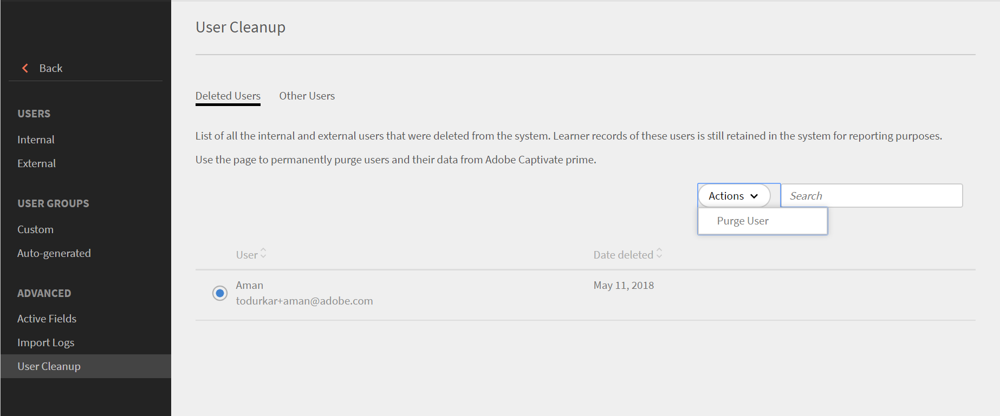
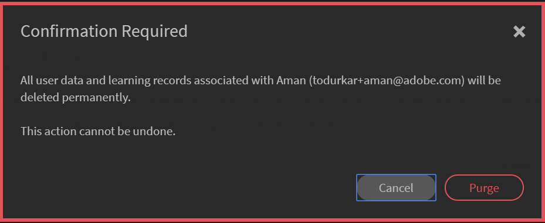
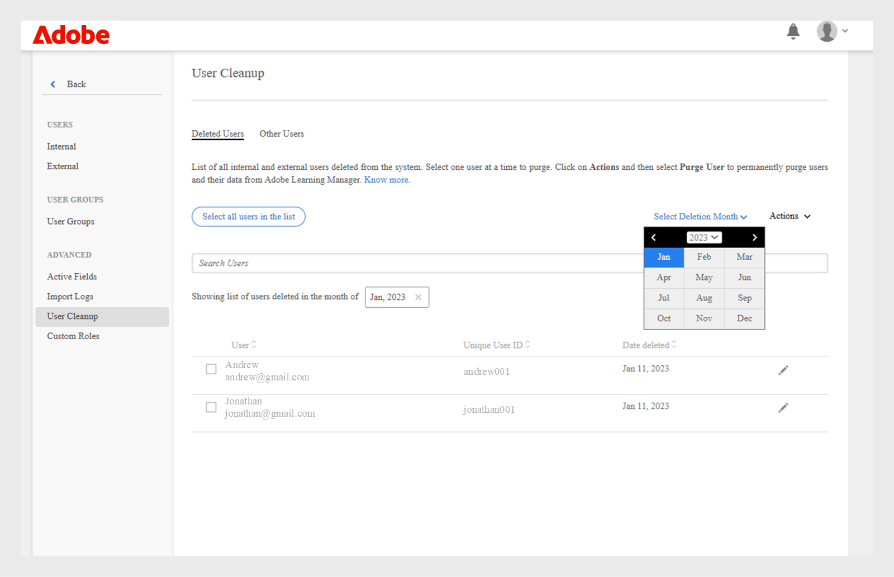
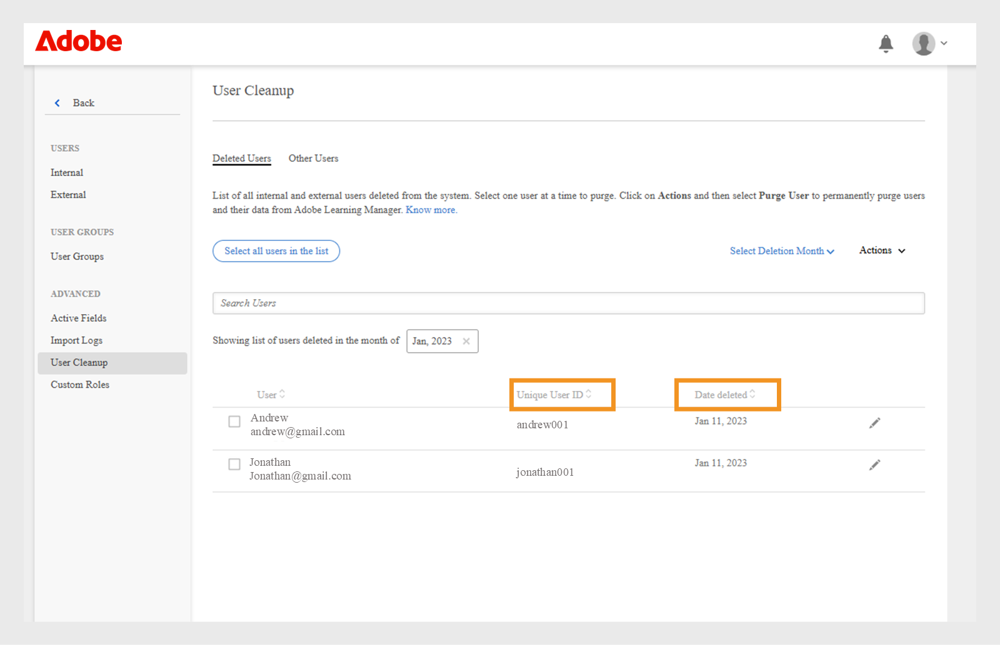
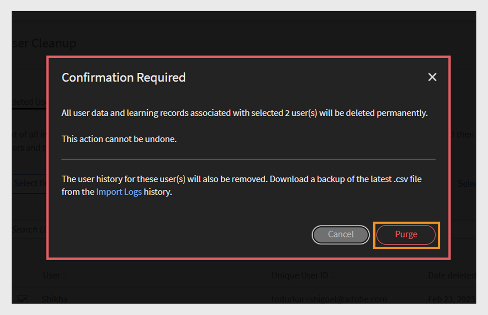
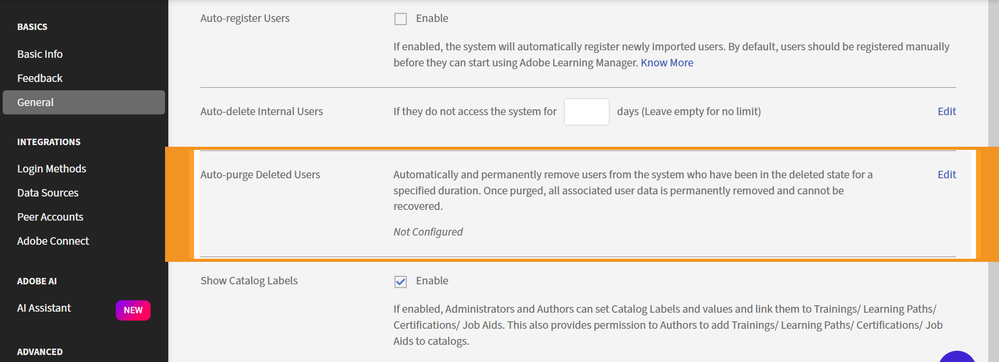
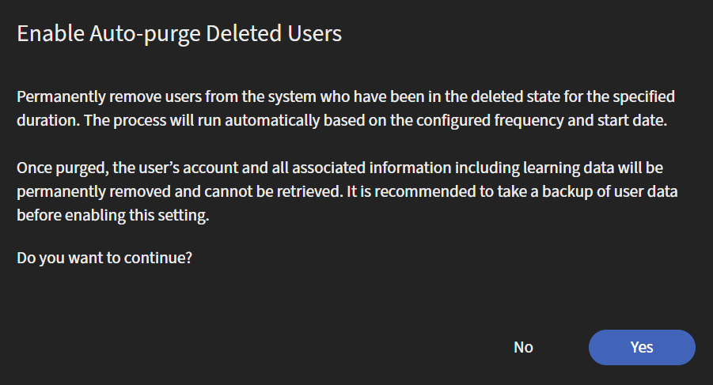

# Benutzer bereinigen

Erfahren Sie mehr über das Bereinigen von Benutzerdaten in Learning Manager.

## Übersicht {#overview}

Verwenden Sie die Funktion zur Benutzerbereinigung, um personenbezogene Daten und Lerndatensätze von Benutzenden aus Learning Manager zu entfernen. Beachten Sie, dass das Löschen und das Bereinigen von Benutzern zwei unterschiedliche Funktionen sind. Während ein gelöschter Benutzer wiederhergestellt werden kann, können Benutzerdaten und Lerndatensätze, die einem bereinigten Benutzer zugeordnet sind, nicht wiederhergestellt werden.

Das Bereinigen eines Benutzers kann diese Folgen haben:

* Wenn ein Benutzer bereinigt wird, funktionieren die Links in den Importprotokollen nicht, um den Download alter CSVs und das erneute Einbinden der Benutzerdaten in das System zu vermeiden.
* Wenn ein Autor gelöscht wird, wird sein Name durch den Namen des Administrators ersetzt, der diesen Benutzer gelöscht hat.
* Wenn Kursleiter bereinigt werden, werden sie aus den Sitzungen entfernt. Der Administrator muss Kursleiter für solche Sitzungen ersetzen/hinzufügen.
* Durch das Bereinigen eines Benutzers in Learning Manager wird der Benutzer nicht in externen Anwendungen (von Drittanbietern oder anderen von Ihnen geschriebenen Anwendungen) entfernt. Wenden Sie sich an die Eigentümer der externen Anwendung, um die Benutzer daraus zu entfernen.
* Wenn ein bereinigter Benutzer in den Konfigurationseinstellungen eines Connectors referenziert wird, wird der Connector deaktiviert. Der Connector muss vom Administrator neu konfiguriert werden, um fortzufahren.

<!--
### Manage users

In this training, you will learn how to assign and remove roles, send a welcome email, and delete and purge users. 

If you're unable to launch the training, write to <almacademy@adobe.com>.
-->

## Benutzer bereinigen

Führen Sie die folgenden Schritte aus, um Benutzer zu bereinigen:

1. Klicken Sie als Administrator im linken Bereich auf **[!UICONTROL Benutzer]**. Die Seite **[!UICONTROL Interne Benutzer]** wird geöffnet.
1. Löschen Sie die Benutzer, die Sie bereinigen möchten. Wählen Sie dafür einen oder mehrere Benutzer über das Kontrollkästchen aus. Öffnen Sie das Dropdown-Menü **[!UICONTROL Aktion]** und wählen Sie **[!UICONTROL Benutzer löschen.]**
1. Klicken Sie im linken Bereich auf **[!UICONTROL Benutzerbereinigung]**. Die Seite **[!UICONTROL Benutzerbereinigung]** mit der Liste der gelöschten Benutzer wird angezeigt. Wählen Sie über die Optionsfelder den Benutzer aus, der bereinigt werden soll. Sie können jeweils nur einen Benutzer bereinigen.

   

   *Benutzer zum Bereinigen auswählen*

1. Öffnen Sie das Dropdown-Menü **[!UICONTROL Aktionen]** und wählen Sie **[!UICONTROL Benutzer bereinigen]**.

   

   *Option &quot;Benutzer bereinigen&quot; auswählen*

1. Sie werden in einem Dialogfeld zur Bestätigung der Aktion aufgefordert. Nach der Bereinigung sind alle Benutzerdaten und Lerndatensätze, die mit dem ausgewählten Benutzer verknüpft sind, dauerhaft gelöscht. Die Aktion kann nicht rückgängig gemacht werden. Klicken Sie zum Bestätigen auf **[!UICONTROL Bereinigen]**.

   

   *Bestätigungsmeldung nach Bereinigung eines Benutzers*

1. Sobald Sie bestätigen und auf „Bereinigen“ klicken, wird die Bereinigungsanforderung akzeptiert. Sie erhalten eine Benachrichtigung, sobald die Aktion abgeschlossen ist. Eine Bereinigungsanforderungs-ID wird ebenfalls angegeben. Sie können diese ID an den CSM senden, um die Anfrage zu verfolgen.

>[!NOTE]
>
>Sobald der gelöschte Benutzer wieder zum System hinzugefügt wurde, werden die vorherigen Rollen (z. B. Administrator, Manager, Autor, Kursleiter usw.) wird nicht gespeichert.Sie werden mit der Teilnehmerrolle hinzugefügt.

## Massenbereinigung von Benutzern

Sie können die ersten 50 Benutzer auswählen und dann in einem einzigen Arbeitsgang bereinigen. Dadurch können Administratoren 50 Benutzer gleichzeitig auswählen und gemeinsam bereinigen. Dies hilft Administratoren, wenn sie mehrere Benutzer gleichzeitig bereinigen möchten. Es empfiehlt sich immer, die zum Bereinigen ausgewählten Benutzer zu überprüfen. Damit wird sichergestellt, dass nur die tatsächlich betroffenen korrekten Benutzer bereinigt werden.

*Benutzer massenweise bereinigen*

## Gelöschte Benutzer vor dem Bereinigen filtern

Mit Adobe Learning Manager können Administratoren Benutzer, die bereits von der Plattform gelöscht wurden, endgültig entfernen. Dieser Prozess, der als Bereinigung bezeichnet wird, hilft Unternehmen dabei, eine saubere Teilnehmerdatenbank zu pflegen, Datenaufbewahrungsrichtlinien einzuhalten und jeden nicht autorisierten Zugriff auf Benutzerdaten zu verhindern.
Dies ist besonders nützlich, um Datenhygiene zu gewährleisten und sicherzustellen, dass alte, nicht verwendete Benutzerdaten aus dem System entfernt werden.
Die Bereinigung von Benutzern ist unerlässlich, um die Datenschutzrichtlinien einzuhalten oder einen bereinigten Datenspeicher zu verwalten, indem redundante Datensätze entfernt werden.

### Gelöschte Benutzer nach Monat filtern

Sie können gelöschte Benutzer filtern, indem Sie einen bestimmten Monat auswählen und sie dann endgültig löschen.

So filtern Sie gelöschte Benutzer mithilfe des Löschmonats:

1. Wählen Sie **[!UICONTROL Benutzer]** auf der Startseite des Administrators aus, und wählen Sie dann **[!UICONTROL Benutzerbereinigung]** aus.
2. Wählen Sie die Datumsauswahl **[!UICONTROL Löschmonat auswählen]** und wählen Sie das Datum aus.

   
   _Wählen Sie den Monat aus, in dem die Benutzer gelöscht wurden_

   Die Liste der im ausgewählten Monat gelöschten Benutzer wird angezeigt.

   
   _Liste der gelöschten Benutzer für den ausgewählten Monat angezeigt_

### Gelöschte Benutzer nach Monat sortieren

Sie können die gefilterten Benutzer nach ihrer **[!UICONTROL eindeutigen Benutzer-ID]** und dem **[!UICONTROL Löschdatum]** sortieren.

1. Sortieren Sie die Benutzer in der Liste der gelöschten Benutzer nach ihren Benutzer-IDs oder ihrem Löschdatum.

   
   _Benutzerliste gefiltert nach eindeutiger Benutzer-ID_

2. Wählen Sie einen oder mehrere Benutzer aus.
3. Wählen Sie **[!UICONTROL Aktionen]** und anschließend **[!UICONTROL Benutzer bereinigen]**.
4. Wählen Sie in der Bestätigungsmeldung Bereinigen aus, um die Benutzerdatensätze endgültig aus Adobe Learning Manager zu löschen.

   
   _Letzte Bestätigung vor der endgültigen Bereinigung von Benutzern_

>[!NOTE]
>
>Durch das Bereinigen von Benutzern werden ihre Daten dauerhaft entfernt. Überprüfen Sie die Auswahl noch einmal, bevor Sie fortfahren.

+++Informationen zu den Ergebnissen der Aktion „Benutzer bereinigen“

<table>
 <tbody>
  <tr>
   <th><strong>Bereinigen über die Learning Manager-Benutzeroberfläche – Unternehmen</strong></th>
   <th> </th>
  </tr>
  <tr>
   <td>Löschen ausgewählter Benutzer aus dem anfordernden Unternehmenskonto. </td>
   <td>Ja</td>
  </tr>
  <tr>
   <td>Löschen aller Benutzer aus allen Testkonten, deren E-Mail-Adresse und Adobe-ID mit der E-Mail-Adresse der ausgewählten Benutzer übereinstimmt.</td>
   <td>Ja</td>
  </tr>
  <tr>
   <td>Löschen aller Benutzer aus allen Testkonten, deren E-Mail-Adresse und Adobe-ID mit der E-Mail-Adresse der ausgewählten Benutzer übereinstimmt und bei denen die Benutzer das Testkonto erstellt haben.</td>
   <td>Nein</td>
  </tr>
  <tr>
   <td>Löschen der E-Mail-Adresse des Benutzers aus allen anderen Feldern des anfordernden Unternehmenskontos und aller Testkonten.</td>
   <td>Ja</td>
  </tr>
  <tr>
   <td>Senden der Löschbestätigung an den Initiator.</td>
   <td>Ja</td>
  </tr>
  <tr>
   <td><strong>Bereinigen über die Learning Manager-Benutzeroberfläche – unternehmensextern</strong></td>
   <td> </td>
  </tr>
  <tr>
   <td>Löschen des ausgewählten Benutzers aus dem anfordernden Testkonto.</td>
   <td>Ja</td>
  </tr>
  <tr>
   <td>Löschen aller Benutzer aus allen Testkonten, deren E-Mail-Adresse und Adobe-ID mit der E-Mail-Adresse der ausgewählten Benutzer übereinstimmt.</td>
   <td>Ja</td>
  </tr>
  <tr>
   <td>Löschen aller Benutzer aus allen Testkonten, deren E-Mail-Adresse und Adobe-ID mit der E-Mail-Adresse der ausgewählten Benutzer übereinstimmt und bei denen die Benutzer das Testkonto erstellt haben.</td>
   <td>Nein</td>
  </tr>
  <tr>
   <td>Löschen der E-Mail-Adresse des Benutzers aus allen anderen Feldern aller Testkonten.</td>
   <td>Ja</td>
  </tr>
  <tr>
   <td>Senden der Löschbestätigung an den Initiator.</td>
   <td>Ja</td>
  </tr>
  <tr>
   <td><strong>Bereinigen anderer Benutzer – Unternehmen (Personen, die keine internen oder externen Learning Manager-Benutzer sind)</strong></td>
   <td> </td>
  </tr>
  <tr>
   <td>Löschen des ausgewählten Benutzers aus allen anderen Feldern des anfordernden Unternehmenskontos und aller Testkonten.</td>
   <td>Ja</td>
  </tr>
  <tr>
   <td>Löschen von Benutzern aus Konten.</td>
   <td>Nein</td>
  </tr>
  <tr>
   <td>Senden der Löschbestätigung an den Initiator. </td>
   <td>Ja</td>
  </tr>
  <tr>
   <td><strong>Bereinigung</strong> <strong>anderer Benutzer - keine Unternehmen (Personen, die keine internen oder externen Learning Manager-Benutzer sind)</strong></td>
   <td> </td>
  </tr>
  <tr>
   <td>Löschen des ausgewählten Benutzers aus allen anderen Feldern aller Testkonten.</td>
   <td>Ja</td>
  </tr>
  <tr>
   <td>Löschen von Benutzern aus Konten.</td>
   <td>Nein</td>
  </tr>
  <tr>
   <td>Senden der Löschbestätigung an den Initiator.</td>
   <td>Ja</td>
  </tr>
  <tr>
   <td><strong>Bereinigen mit Adobe IMS – Unternehmen</strong></td>
   <td> </td>
  </tr>
  <tr>
   <td>Benachrichtigen des Unternehmensadministrators über die Anfrage.</td>
   <td>Ja</td>
  </tr>
  <tr>
   <td>Aktivieren von E-Mail-Feldern zum Senden von Benachrichtigungen.</td>
   <td>Nein</td>
  </tr>
  <tr>
   <td><strong>Bereinigen mit Adobe IMS – keine Unternehmen</strong></td>
   <td> </td>
  </tr>
  <tr>
   <td>Löschen aller Benutzer mit der angegebenen Adobe-ID/E-Mail-Adresse aus allen Testkonten.</td>
   <td>Ja</td>
  </tr>
  <tr>
   <td>Löschen Benutzer eines Testkontos, wenn die angegebene E-Mail-Adresse/Adobe-ID der Ersteller des Kontos war.</td>
   <td>Ja</td>
  </tr>
  <tr>
   <td>Löschen der ausgewählte E-Mail-ID aus allen anderen Feldern aller Testkonten.</td>
   <td>Ja</td>
  </tr>
 </tbody>
</table>

+++

### Automatische Bereinigung gelöschter Benutzer{#auto-purge}

Die automatische Bereinigung gelöschter Benutzer ist eine Funktion, mit der Daten für Benutzer bereinigt werden, die bereits in ALM gelöscht wurden. Die Bereinigung erfolgt nach einer konfigurierbaren Aufbewahrungsfrist, wobei der Schwerpunkt auf Massenvorgängen liegt, sodass große Kundenkonten effizient bearbeitet werden können, ohne dass die Performance beeinträchtigt wird.

Der Massenlöschungsfluss kann bis zu 10.000 Benutzer pro Stapel verarbeiten. Die Funktion ist als zuverlässigkeitsorientierter Hintergrunddienst für das Löschen großer Volumes positioniert.

Als Administrator können Sie die Dauer angeben, innerhalb derer bereinigte Benutzer gelöscht werden können. Weitere Informationen finden Sie unter [Admin-Einstellungen](/help/migrated/administrators/feature-summary/settings.md).

#### Was sie bewirkt:

* Bereitstellung konfigurierbarer automatischer Bereinigungen für gelöschte Benutzer auf Kontoebene
* Stellen Sie sicher, dass Benutzer innerhalb von 24 Stunden bereinigt werden, sobald sie die Bereinigungskriterien erfüllen.
* Unterstützung der Massenlöschung von bis zu 10.000 Benutzern pro Tag** ohne Beeinträchtigung der Systemleistung
* Aufrechterhaltung der Gesamtansprechfähigkeit des Systems und des Datenbankzustands während der Ausführung dieser Vorgänge
* Durchsetzung automatisierter Datenaufbewahrungsverwaltung zur Einhaltung der DSGVO-Verpflichtungen

#### Was sie nicht tut:

* Der Massenlöschungsfluss wird nur als geplanter cron-Auftrag ausgeführt (nicht on demand pro Anforderung).

### Aktivieren der Option &quot;Automatische Bereinigung&quot;

1. Melden Sie sich bei Adobe Learning Manager als Administrator an.
2. Navigieren Sie zum Abschnitt **Konfigurieren** > **Einstellungen** > **Grundlagen** Abschnitt > **Allgemein**.
3. Scrollen Sie auf der Seite nach unten zu **Gelöschte Benutzer automatisch bereinigen**.
   
   *Option für automatische Bereinigung*
   >[!NOTE]
   >
   >Wenn **Gelöschte Benutzer automatisch bereinigen** nicht aktiviert ist, wird im Abschnitt eine Meldung angezeigt, die am unteren Rand des Abschnitts der Option lautet: **Nicht konfiguriert**.
4. Wählen Sie **Bearbeiten**.
5. Aktivieren Sie das Kontrollkästchen **Aktivieren**.
6. Geben Sie die Dauer ein, nach der die Bereinigung wirksam werden soll.
   >[!NOTE]
   >
   >Der Mindestwert sollte ein Jahr betragen. Sie können ihn auch um 1 erhöhen. Sie können jedoch keinen Wert wie 1,5 Jahre oder 2,5 Jahre eingeben. Wenn Sie einen benutzerdefinierten Wert als Dauer benötigen, wenden Sie sich bitte an unseren Support.
7. Wählen Sie **Speichern**. ALM zeigt eine detaillierte Bestätigungsmeldung an.
   
   *Aktivieren und Eingeben der Dauer*
8. Wählen Sie **Ja**, um die Einstellung zu bestätigen und zu speichern.
   
   *Bestätigungsmeldung*

## Häufig gestellte Fragen {#frequentlyaskedquestions}

+++Wie viele Tage dauert es, bis eine Bereinigungsanforderung abgeschlossen ist?

Eine Anforderung zum Bereinigen von Benutzern dauert maximal 30 Tage.
+++

+++Können Sie eine Massenbereinigung in Adobe Learning Manager durchführen?

Ja, Sie können eine Massenbereinigung durchführen. Sie können jedoch nur eine Massenbereinigung von 50 Benutzern durchführen.
+++

+++Kann ich einen bereinigten Benutzer wiederherstellen?

Anzahl Nach der Bereinigung sind alle Benutzerdaten endgültig gelöscht und können nicht wiederhergestellt werden.

+++
