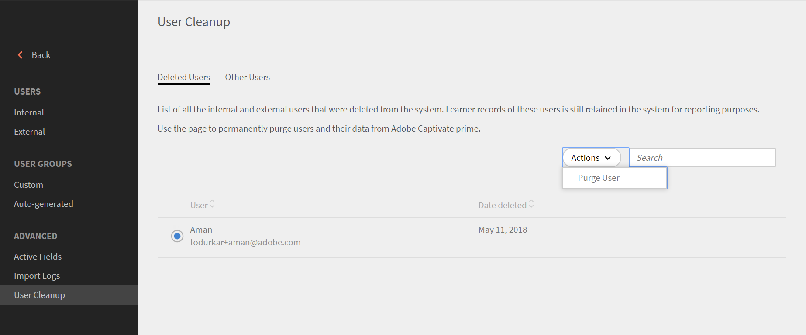

# Bereinigen von Benutzern

Erfahren Sie mehr über das Bereinigen von Benutzerdaten in Learning Manager.

## Übersicht {#overview}

Verwenden Sie die Funktion zum Bereinigen von Benutzern, um personenbezogene Daten und Lerndatensätze des Benutzers aus Learning Manager zu entfernen. Beachten Sie, dass das Löschen und das Bereinigen von Benutzern zwei verschiedene Funktionen sind. Während ein gelöschter Benutzer wiederhergestellt werden kann, können Benutzerdaten und Lerndatensätze, die einem bereinigten Benutzer zugeordnet sind, nicht wiederhergestellt werden.

Das Bereinigen eines Benutzers kann zu folgenden Ergebnissen führen:

* Wenn ein Benutzer bereinigt wird, funktionieren die Links in den Importprotokollen nicht, um den Download alter CSVs und das erneute Einbinden der Benutzerdaten in das System zu vermeiden.
* Wenn ein Autor gelöscht wird, wird sein Name durch den Namen des Administrators ersetzt, der diesen Benutzer gelöscht hat.
* Wenn Kursleiter bereinigt werden, werden sie aus den Sitzungen entfernt. Der Administrator muss Kursleiter für solche Sitzungen ersetzen/hinzufügen.
* Durch das Bereinigen eines Benutzers in Learning Manager wird der Benutzer nicht in externen Anwendungen (von Drittanbietern oder anderen von Ihnen geschriebenen Anwendungen) entfernt. Wenden Sie sich an die Eigentümer der externen Anwendung, um die Benutzer aus solchen Anwendungen zu entfernen.
* Wenn ein bereinigter Benutzer in den Konfigurationseinstellungen eines Connectors referenziert wird, wird der Connector deaktiviert. Der Connector muss vom Administrator neu konfiguriert werden, um fortzufahren.

Führen Sie die folgenden Schritte aus, um Benutzer zu bereinigen:

1. Wählen Sie als Administrator **[!UICONTROL Benutzer]** im linken Bereich. Die **[!UICONTROL Interne Benutzer]** wird geöffnet.
1. Löschen Sie die Benutzer, die Sie bereinigen möchten. Wählen Sie zum Löschen einen oder mehrere Benutzer mithilfe des Kontrollkästchens aus. Öffnen Sie die **[!UICONTROL Aktion]** &quot; und wählen Sie **[!UICONTROL Benutzer löschen.]**
1. Wählen Sie im linken Bereich **[!UICONTROL Benutzerbereinigung]**. Die **[!UICONTROL Benutzerbereinigung]** wird mit der Liste der gelöschten Benutzer angezeigt. Wählen Sie mithilfe der Optionsfelder den Benutzer aus, der bereinigt werden soll. Sie können jeweils nur einen Benutzer bereinigen.

   

   *Benutzer für Bereinigung auswählen*

1. Öffnen Sie die **[!UICONTROL Aktionen]** &quot; und wählen Sie **[!UICONTROL Benutzer bereinigen]**.

   

   *Wählen Sie die Option &quot;Benutzer bereinigen&quot;*

1. Sie werden in einem Dialogfeld zur Bestätigung der Aktion aufgefordert. Nach der Bereinigung werden alle Benutzerdaten und Lerndatensätze, die mit dem ausgewählten Benutzer verknüpft sind, endgültig gelöscht. Die Aktion kann nicht rückgängig gemacht werden. Klicken Sie zum Bestätigen auf **[!UICONTROL Entleeren]**.

   

   *Bestätigungsmeldung nach dem Bereinigen eines Benutzers*

1. Sobald Sie bestätigen und auf &quot;Bereinigen&quot; klicken, wird die Bereinigungsanforderung akzeptiert. Sie erhalten eine Benachrichtigung, sobald die Aktion abgeschlossen ist. Eine Bereinigungsanforderungs-ID wird ebenfalls angegeben. Sie können diese ID an den CSM senden, um die Anfrage zu verfolgen.

## Massenbereinigung von Benutzern

Sie können die ersten 50 Benutzer auswählen und dann in einem einzigen Arbeitsgang bereinigen. Dadurch können Administratoren 50 Benutzer gleichzeitig auswählen und gemeinsam bereinigen. Dies hilft Administratoren, wenn sie Benutzer in großen Mengen bereinigen möchten. Es empfiehlt sich immer, die zum Bereinigen ausgewählten Benutzer zu überprüfen. Dies ist wichtig, um sicherzustellen, dass nur die richtigen Benutzer bereinigt werden.

*Mehrere Benutzer bereinigen*

+++Informationen zu den Ergebnissen der Aktion &quot;Benutzer bereinigen&quot;

<table>
 <tbody>
  <tr>
   <th><strong>Bereinigung über die Lern-Manager-Benutzeroberfläche - Unternehmen</strong></th>
   <th> </th>
  </tr>
  <tr>
   <td>Löschen ausgewählter Benutzer aus dem anfordernden Unternehmenskonto. </td>
   <td>Ja</td>
  </tr>
  <tr>
   <td>Löschen aller Benutzer aus allen Testkonten, deren E-Mail-Adresse und Adobe-ID mit der E-Mail-Adresse der ausgewählten Benutzer übereinstimmt.</td>
   <td>Ja</td>
  </tr>
  <tr>
   <td>Löschen aller Benutzer aus allen Testkonten, deren E-Mail-Adresse und Adobe-ID mit der E-Mail-Adresse der ausgewählten Benutzer übereinstimmt und bei denen das Testkonto erstellt wurde.</td>
   <td>Nein</td>
  </tr>
  <tr>
   <td>Löschen der E-Mail-Adresse des Benutzers aus allen anderen Feldern des anfordernden Unternehmenskontos und aller Testkonten.</td>
   <td>Ja</td>
  </tr>
  <tr>
   <td>Den Initiator über die Bestätigung des Löschens informieren.</td>
   <td>Ja</td>
  </tr>
  <tr>
   <td><strong>Bereinigung über die Lern-Manager-Benutzeroberfläche - keine Unternehmen</strong></td>
   <td> </td>
  </tr>
  <tr>
   <td>Löschen des ausgewählten Benutzers aus dem anfordernden Testkonto.</td>
   <td>Ja</td>
  </tr>
  <tr>
   <td>Löschen aller Benutzer aus allen Testkonten, deren E-Mail-Adresse und Adobe-ID mit der E-Mail-Adresse der ausgewählten Benutzer übereinstimmt.</td>
   <td>Ja</td>
  </tr>
  <tr>
   <td>Löschen aller Benutzer aus allen Testkonten, deren E-Mail-Adresse und Adobe-ID mit der E-Mail-Adresse der ausgewählten Benutzer übereinstimmt und bei denen das Testkonto erstellt wurde.</td>
   <td>Nein</td>
  </tr>
  <tr>
   <td>Löschen der E-Mail-Adresse des Benutzers aus allen anderen Feldern aller Testkonten.</td>
   <td>Ja</td>
  </tr>
  <tr>
   <td>Den Initiator über die Bestätigung des Löschens informieren.</td>
   <td>Ja</td>
  </tr>
  <tr>
   <td><strong>Bereinigung anderer Benutzer - Unternehmen (Personen, die keine internen oder externen Learning Manager-Benutzer sind)</strong></td>
   <td> </td>
  </tr>
  <tr>
   <td>Löschen des ausgewählten Benutzers aus allen anderen Feldern des anfordernden Unternehmenskontos und aller Testkonten.</td>
   <td>Ja</td>
  </tr>
  <tr>
   <td>Löschen von Benutzern aus Konten.</td>
   <td>Nein</td>
  </tr>
  <tr>
   <td>Den Initiator über die Bestätigung des Löschens informieren. </td>
   <td>Ja</td>
  </tr>
  <tr>
   <td><strong>Entleeren</strong> <strong>Andere Benutzer - keine Unternehmen (Personen, die keine internen oder externen Learning Manager-Benutzer sind)</strong></td>
   <td> </td>
  </tr>
  <tr>
   <td>Löschen des ausgewählten Benutzers aus allen anderen Feldern aller Testkonten.</td>
   <td>Ja</td>
  </tr>
  <tr>
   <td>Löschen von Benutzern aus Konten.</td>
   <td>Nein</td>
  </tr>
  <tr>
   <td>Den Initiator über die Bestätigung des Löschens informieren.</td>
   <td>Ja</td>
  </tr>
  <tr>
   <td><strong>Bereinigen mit Adobe IMS - Unternehmen</strong></td>
   <td> </td>
  </tr>
  <tr>
   <td>Benachrichtigen des Unternehmensadministrators über die Anfrage.</td>
   <td>Ja</td>
  </tr>
  <tr>
   <td>Aktivieren Sie die E-Mail-Felder zum Senden von Benachrichtigungen.</td>
   <td>Nein</td>
  </tr>
  <tr>
   <td><strong>Bereinigen mit Adobe IMS - keine Unternehmen</strong></td>
   <td> </td>
  </tr>
  <tr>
   <td>Löschen aller Benutzer mit der angegebenen Adobe ID/E-Mail-Adresse aus allen Testkonten.</td>
   <td>Ja</td>
  </tr>
  <tr>
   <td>Löschen aller Benutzer eines Testkontos, wenn die angegebene E-Mail-Adresse/Adobe-ID der Ersteller des Kontos war.</td>
   <td>Ja</td>
  </tr>
  <tr>
   <td>Löschen der ausgewählte E-Mail-ID aus allen anderen Feldern aller Testkonten.</td>
   <td>Ja</td>
  </tr>
 </tbody>
</table>

+++

Learning Manager ist jetzt mit der DS-GVO konform. Weitere Informationen zur Einhaltung der DSGVO finden Sie unter  [Learning Manager - Konformität mit der DSGVO](../../kb/prime-gdpr.md).

## Häufig gestellte Fragen {#frequentlyaskedquestions}

+++Wie viele Tage dauert es, bis eine Bereinigungsanforderung abgeschlossen ist?

Eine Anforderung zum Bereinigen von Benutzern dauert maximal 30 Tage.
+++

+++Können Sie eine Massenbereinigung in Learning Manager durchführen?

Ja, Sie können eine Massenbereinigung durchführen. Sie können jedoch nur eine Massenbereinigung von 50 Benutzern durchführen.
+++
