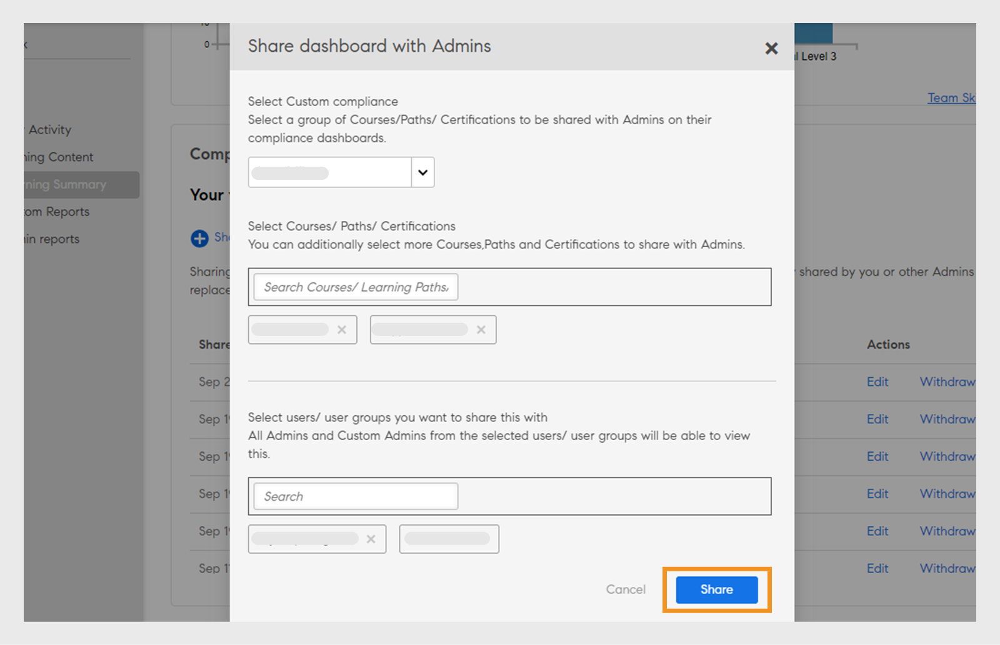
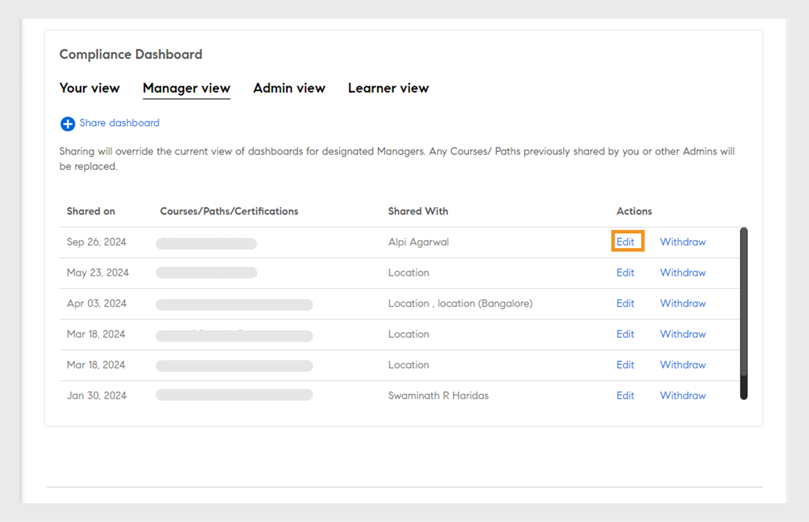
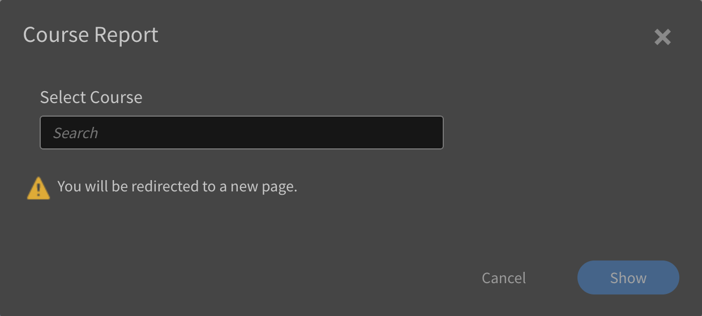
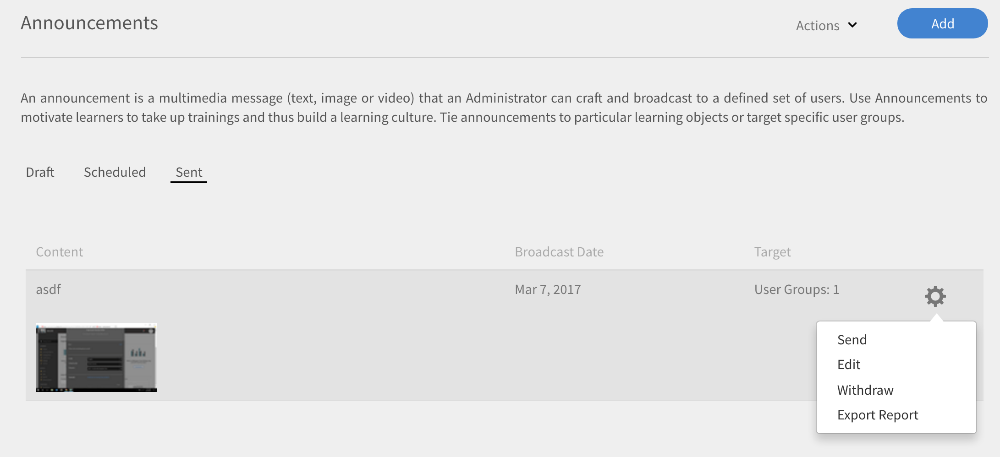
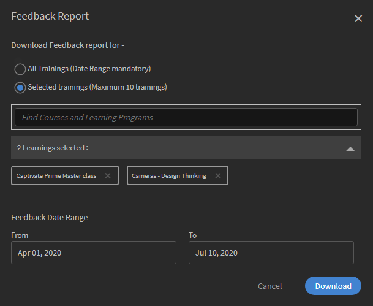
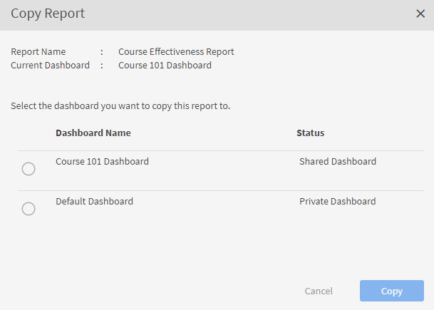
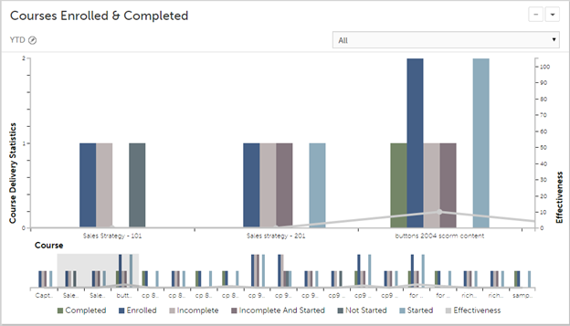

# Berichte

Informieren Sie sich über die Berichte, die mit der Administratorrolle in der Learning Manager-Anwendung verknüpft sind.

Mit Adobe Learning Manager können Sie verschiedene Berichte erstellen, um die Aktivitäten der Teilnehmer zu verfolgen, zu überwachen und zu kontrollieren. Aktivitäten von Teilnehmern werden verfolgt und automatisch in der Datenbank erfasst. Manager- und Administratoren-Berichte werden von der Datenbank aus erstellt.

## Übersicht {#overview}

Berichte für Administratoren und Manager werden auf ähnliche Weise erstellt. Manager können Berichte über ihre Mitarbeiter anzeigen, Administratoren hingegen alle Berichte im Unternehmen.

Berichte werden in einem Dashboard generiert. Ein Bericht muss sich in einem Dashboard befinden. Ein **[!UICONTROL Standard-Dashboard]** ist standardmäßig auf der Berichtsseite vorhanden. Alle Berichte, die Sie hinzufügen, werden in dieses Standard-Dashboard verschoben. Verwenden Sie zum Hinzufügen von Berichten zu einzelnen Dashboards den Dropdown-Pfeil, und wählen Sie **[!UICONTROL Bericht hinzufügen]**. Genauere Informationen über das Erstellen von Dashboards finden Sie im Bereich „Dashboards“ auf dieser Seite.

## Berichtstypen {#typesofreports}

Adobe Learning Manager unterstützt vier wichtige Berichtstypen wie z. B. Abschluss, aufgewandte Zeit, Kenntnisse und Effektivität. Mit den folgenden Berichtstypen können Sie mehr als 300 unterschiedliche Berichtsvarianten generieren:

* Statistiken zur Kursbereitstellung für Teilnehmer
* Bericht zur Effektivität von Kursen
* Kenntnisbasierter Bericht über Teilnehmer
* Statistik zur Registrierung der Teil für Lernprogramme
* Von den Teilnehmern aufgewandte Lernzeit
* Anzahl der Teilnehmer
* Abschluss der Zertifizierung

## Dashboards für Benutzeraktivität {#useractivitydashboards}

Zeigen Sie eine Zusammenfassung aller Benutzeraktivitäten auf der Plattform im Zeitverlauf an. Konfigurieren Sie Benutzergruppen und wenden Sie Filter an.

Das Dashboard für Benutzeraktivität zeigt die Aktivität der Benutzer im Konto an. Die drei aufgeführten Berichte sind:

* **Registrierte Benutzer:** Dieser Bericht enthält Informationen zur Anzahl der Benutzer, die Woche für Woche bei Ihrem Konto registriert sind. Bei Konten mit der Lizenzierung „Monatlich aktive Einheiten in diesem Monat“ zeigt der Bericht stattdessen die MAU-Einheiten an.

* **Benutzerbesuchsbericht:** Dieser Bericht enthält Informationen über die Anzahl der Benutzer, die täglich auf die Plattform zugreifen. Der Monatsbericht ist ebenfalls verfügbar.

* **Bericht über Zeitaufwand zum Lernen:** Dieser Bericht enthält Informationen über den Zeitaufwand zum Lernen, der täglich auf der Plattform verbracht wird. Der Monatsbericht ist ebenfalls verfügbar.

### Registrierte Benutzer {#registeredusers}

Learning Manager zeichnet jede Woche die Anzahl der im System registrierten Benutzer auf. Administratoren können diesen Bericht anzeigen, um die registrierte Anzahl der Benutzer an diesem Wochentag zu erfahren. Die einmal für eine Woche gespeicherte registrierte Anzahl ändert sich nicht. Daher steht die registrierte historische Anzahl nicht in Beziehung zur aktuellen Gruppe von Teilnehmern im System.

Dieser Bericht enthält Informationen zur Anzahl der Benutzer, die Woche für Woche bei Ihrem Konto registriert sind.

Bei Konten mit der Lizenzierung „Monatlich aktive Einheiten in diesem Monat“ zeigt der Bericht stattdessen die MAU-Einheiten an.

*Bericht über registrierte Benutzer*

***Für Konten mit Einheit für monatlichen Zugriff:***

**Bericht über monatlich aktive Benutzer**

Dieser Bericht zeigt die Anzahl der Teilnehmer an, die jeden Monat auf der Lernplattform aktiv sind. Der Benutzer gilt für den Monat als aktiv, wenn er eine der hier genannten Lernaktionen ausführt. Dies ist die gleiche Weise, wie „Monatlich aktive Einheiten in diesem Monat“ gezählt werden.

Die einmal für einen Monat gespeicherte aktive Anzahl ändert sich nicht. Daher steht die angezeigte historische Anzahl nicht in Beziehung zur aktuellen Gruppe von Teilnehmern im System.

### Benutzerbesuche {#uservisits}

Dieser Bericht zeigt die Gesamtzahl der Teilnehmer, die in einem Tag oder Monat auf das System zugreifen. Das Durchsuchen der Lernplattform ohne Nutzung des Lernangebots wird auch als „Zugriff“ auf die Lernplattform betrachtet. Dies hilft dem Administrator, die Gesamtzahl der Benutzer zu ermitteln, die auf das System zugreifen. Am ersten Tag des Monats erstellt Learning Manager einen Datensatz mit allen Benutzern, die im Vormonat auf die Plattform zugegriffen haben. Außerdem werden die Benutzergruppeninformationen für diese Benutzer erfasst.

Nur die vom Administrator konfigurierten Benutzergruppen werden aufgezeichnet. Dadurch können Administratoren auch Filter auf Benutzergruppen für historische Monatsdaten anwenden. Beachten Sie: Falls die Benutzergruppenkonfiguration geändert wurde und Learning Manager in früheren Monaten keine Daten für diese Benutzergruppe aufgezeichnet hat, kann Learning Manager die Daten für diese neu konfigurierten Benutzergruppen nicht für vorherige Monate anzeigen.

Dieser Bericht enthält Benutzer, die mit allen Formaten wie Web, mobiler App, fragwürdigen benutzerdefinierten Lösungen usw. auf die Plattform zugreifen. Im Diagramm zur Verwendung der Geräte-App werden speziell nur die Benutzer berücksichtigt, die mit der Geräte-App von Learning Manager auf die Plattform zugreifen. Dadurch können Administratoren die Verwendung der mobilen App in ihrem Konto erkennen.

*Benutzerbesuchsbericht*

### Bericht über Zeitaufwand zum Lernen {#learningtimespentreport}

Hier sehen Sie zweiachsige Liniendiagramme, die den gesamten Zeitaufwand zum Lernen für alle Teilnehmer über einen Zeitraum von 12 Monaten anzeigen. Die zweite Achse stellt den mittleren Zeitaufwand zum Lernen einer einzelne Person dar.

Der Zeitaufwand für verschiedene Lernobjekte wie Lernprogramme und Zertifizierungen wird für Folgendes berechnet:

* Selbststudium mit statischen und interaktiven Inhalten
* Aktivitätskurse mit URL.
* Wochenendsitzungen mit aktiviertem Wochenendflag
* VC-Connect-Sitzung, bei der die Anwesenheit automatisch markiert wird
* Die für verschiedene Lernobjekte wie Lernprogramme und Zertifizierungen aufgewendete Zeit
* xAPI-Anweisungen für einen xAPI-Aktivitätskurs.

Sie können das Diagramm weiter als Excel-Tabelle exportieren.

Ein Filter zur Auswahl der Benutzergruppenkonfiguration erleichtert die Anzeige der Daten hinsichtlich verschiedener Benutzergruppen.

Der ausgewählte Datums- und Benutzergruppenfilter wird auf alle relevanten Diagramme im Dashboard angewendet.

>[!NOTE]
>
>Für die Berichte **[!UICONTROL Benutzerbesuche]** und **[!UICONTROL Zeitaufwand zum Lernen]** werden die Standarddaten (wenn keine Benutzergruppe konfiguriert ist) für das gesamte Konto angezeigt.

## Dashboard für Schulungsinhalt {#trainingcontentdashboard}

Das Dashboard für Schulungsinhalt bietet Einblicke in Schulungen, die auf der Plattform verfügbar sind. Sie können beliebte Schulungen anzeigen oder alle verfügbaren Schulungen verfolgen.

### Schulungsbericht {#trainingsreport}

Dieser Bericht enthält Informationen über alle Schulungen, die Monat für Monat (im Veröffentlichungszustand) auf der Plattform verfügbar sind. Er informiert über die Anzahl der im Laufe der Zeit angebotenen Schulungen.

*Schulungsbericht*

### Bericht über aktive Schulungen {#activetrainingsreport}

Dieser Bericht enthält Informationen zu den Schulungen, die über den ausgewählten Zeitraum aktiv sind. Aktive Schulungen sind Schulungen, die im jeweiligen Zeitraum registriert sind, im Player angezeigt oder abgeschlossen werden.

Für aktive Schulungen stehen Daten aller internen Gruppen von Stammbenutzern (mit Managerrolle) zur Auswahl, wenn keine Benutzergruppenkonfiguration vorgenommen wurde. Neben den Stammbenutzergruppen können Sie bei Bedarf 10 weitere Benutzergruppen konfigurieren.

*Bericht über aktive Schulungen*

>[!NOTE]
>
>Die Daten werden nicht wie erwartet angezeigt, wenn die Filter **[!UICONTROL Alle Benutzer]** und **[!UICONTROL 12 Monate]** ausgewählt sind. Die Daten werden jedoch angezeigt, wenn Sie **[!UICONTROL Alle internen Benutzergruppen] auswählen.**

<table>
 <tbody>
  <tr>
   <td>
    
<b>Referenz</b>
</td>
   <td>
    
<b>Metrisch</b>
</td>
   <td>
    
<b>Beschreibung</b>
</td>
  </tr>
  <tr>
   <td>
    
1
</td>
   <td>
    
Startverhältnis (%)
</td>
   <td>
    
Verhältnis zwischen der Anzahl der Teilnehmer, die den Kurs gestartet haben, und der Anzahl der Registrierungen.
</td>
  </tr>
  <tr>
   <td>
    
2
</td>
   <td>
    
Abschlussverhältnis (%)
</td>
   <td>
    
Verhältnis zwischen allen Benutzern, die den Kurs abgeschlossen haben, und allen Benutzern, die den Kurs gestartet haben. 
</td>
  </tr>
  <tr>
   <td>
    
3
</td>
   <td>
    
Teilnehmerfeedback
</td>
   <td>
    
Durchschnitt aller eingegangenen L1-Feedback-Antworten auf einer Skala von 1 bis 10, gerundet auf die nächste ganze Zahl. 
</td>
  </tr>
  <tr>
   <td>
    
4
</td>
   <td>
    
Manager-Feedback
</td>
   <td>
    
Durchschnitt aller eingegangenen L3-Feedback-Antworten auf einer Skala von 1 bis 5, gerundet auf die nächste ganze Zahl 
</td>
  </tr>
 </tbody>
</table>

Der Schulungsbericht enthält zwei zusätzliche Spalten:

1. Durchschnittliche Sternebewertung eines Kurses.
1. Anzahl der Teilnehmer, die den Kurs bewertet haben.
1. Eingebetteter Pfad
1. ID für eingebetteten Pfad
1. ID für eingebetteten Kurs

>[!NOTE]
>
>Startverhältnis, Abschlussverhältnis, Teilnehmerfeedback und Manager-Feedback werden von den angewendeten Filtern nicht beeinflusst. Die Filter wirken sich nur auf Registrierung, Ansichten und Abschlüsse aus.

>[!NOTE]
>
>Für beide Berichte (Schulungsinhalt, Benutzeraktivität) können Sie maximal 10 Benutzergruppen konfigurieren. Es kann bis zu 24 Stunden dauern, bis die Verarbeitung abgeschlossen ist und die neu konfigurierten Filter verfügbar sind.

## Dashboards für Lernzusammenfassungen {#dashboards}

### Dashboard-Berichte erstellen

>[!INFO]
>
>In dieser Schulung erfahren Sie, wie Sie Dashboard-Berichte aus der Datenbank generieren.    

Wenn Sie die Schulung nicht starten können, schreiben Sie an <almacademy@adobe.com>.

Sehen Sie sich einen zusammenfassenden Bericht über alle Lernaktivitäten in der Plattform an. Auf dieser Seite können Sie die folgenden Zusammenfassungsinformationen für das Team des ausgewählten Stammbenutzers und die externen Profile sehen. Der Zeitbereich kann auch ausgewählt werden:

* Lernzusammenfassung in Form von Registrierungen, Ansichten und Abschlüssen
* Top-Qualifikationen
* Compliance-Zusammenfassung

*Zusammenfassungsdiagramme*

Wenn es interne Stammebenen-Manager gibt, werden diese nacheinander angezeigt.

Alle externen Profile werden nach internen Profilen aufgelistet (interne Stammbenutzer).

Wenn ein externes Profil über einen Manager verfügt, wird die Managerhierarchie in der Dropdownliste **[!UICONTROL Daten werden angezeigt für]** angezeigt. Der Benutzer wird auf allen Detailseiten in der Managerhierarchie aufgeführt (Lernzusammenfassung, Compliance und Kenntnisstatus).

Andernfalls werden alle individuellen Benutzerdetails in der Liste angezeigt.

Klicken Sie auf **[!UICONTROL Lernzusammenfassungsdetails]**, um detailliertere Informationen zu den Registrierungen für verschiedene interne Teams anzuzeigen.

*Lernzusammenfassungsdetails*

Wenn Sie auf eine Registrierung klicken, können Sie die Teilnehmer für jeden Manager sehen und die Registrierung für welche Lernobjekte. Sie können auch die Details der einzelnen Teilnehmer zu Fortschritt und Abschluss sehen.

*Teilnehmer, die einem Manager zugewiesen sind*

Klicken Sie auf ein beliebiges Team und exportieren Sie seinen Bericht als CSV-Datei. Ein Administrator kann den Bericht für jede Benutzergruppe oder jeden einzelnen Benutzer exportieren, indem er die Benutzergruppe oder den einzelnen Benutzer auswählt und dann Details aus der Dropdown-Liste **[!UICONTROL Aktion]** exportiert.

Sie können auch ein Balkendiagramm mit den Qualifikationen anzeigen, die gerade erworben wurden. Sie können Kenntnisse hinzufügen/entfernen, die Sie im Diagramm verwenden möchten.

*Gestapeltes Balkendiagramm zum Kenntnisstatus*

### Kompatibilitäts-Dashboard

**Adobe Learning Manager** bietet allen Administratoren und Managern ein Kompatibilitäts-Dashboard. Administratoren können ein Compliance-Dashboard erstellen und für Manager freigeben. Manager können das neu freigegebene Dashboard in ihrer App anzeigen und die Konformität ihrer Team-Mitglieder mit einer bestimmten Schulung ganz einfach nachverfolgen. Mit dem Compliance-Dashboard können Administratoren benutzerdefinierte Compliance-Kurse in bestimmte Kategorien (z. B. Vertrieb, Marketing und Recht) kategorisieren. Benutzerdefinierte Kompatibilitätskategorien werden von **[!UICONTROL Katalogbeschriftungen]** unterstützt.

_Kompatibilitäts-Dashboard-Administratoransicht_

Administratoren können auch den Konformitätsstatus für das Team jedes Managers überprüfen, indem sie **[!UICONTROL Zum Kompatibilitäts-Dashboard wechseln]** auswählen. Administratoren können Schulungskurse einzeln oder mit einer Gruppe an Manager weitergeben. Dies hilft Managern, die Einhaltung der Richtlinien durch ihre Teamkollegen für die angegebene Schulung einfach nachzuverfolgen.

#### Arbeitsablauf für Administratoren

##### Erstellen benutzerdefinierter Compliance-Beschriftungen

Eine Compliance-Beschriftung ist eine Art von Katalogbeschriftung, die Kurse/Lernpfade/Zertifizierungen als Compliance-Typ kategorisiert.
Führen Sie die folgenden Schritte aus, um ein benutzerdefiniertes Konformitätslabel zu erstellen:

1. Navigieren Sie in der Administrator-App zu **[!UICONTROL Einstellungen]** > **[!UICONTROL Allgemein]**.
1. Wählen Sie die Option **[!UICONTROL Benutzerdefinierter Kompatibilitätstyp]**, um die benutzerdefinierte Kompatibilitätsbeschriftung zu aktivieren.

   
   _Benutzerdefinierte Kompatibilität aktivieren_

   >[!NOTE]
   >
   >Dieses neue Kataloglabel wurde eingeführt, um die Kurse, Lernpfade und Zertifizierungen als Compliance-Typ zu kategorisieren. Um die Option **[!UICONTROL Benutzerdefinierter Kompatibilitätstyp]** zu aktivieren, müssen Sie zunächst die Option **[!UICONTROL Katalogbeschriftung anzeigen]** auf derselben Seite aktivieren.

1. Wechseln Sie zu **[!UICONTROL Einstellungen]** > **[!UICONTROL Katalogbeschriftung]** und wählen Sie den **[!UICONTROL Kompatibilitätstyp]** aus.
1. Geben Sie die Werte (z. B. Legal, Sales) in das Textfeld **[!UICONTROL Wert]** ein und wählen Sie **[!UICONTROL Wert hinzufügen]** aus.

   
   _Werte für benutzerdefinierte Konformität hinzufügen_

1. Wählen Sie **[!UICONTROL Speichern]**.

>[!NOTE]
>
>Der Autor muss diese Konformitätsbezeichnungen beim Erstellen/Bearbeiten der Kurse in seiner App hinzufügen. Siehe [Hinzufügen von Konformitätsbezeichnungen zu einem Kurs/Lernpfad/einer Zertifizierung](/help/migrated/authors/feature-summary/courses.md#add-compliance-labels-to-courselearning-pathcertification).

##### Erstellen und Freigeben eines Kompatibilitäts-Dashboards

Um ein Kompatibilitäts-Dashboard zu erstellen und freizugeben, führen Sie die folgenden Schritte aus:

1. Wechseln Sie zu **[!UICONTROL Berichte]** > **[!UICONTROL Lernzusammenfassung]**.
1. Wählen Sie im Abschnitt **[!UICONTROL Kompatibilitäts-Dashboard]** die Option **[!UICONTROL Für Manager freigegeben]** aus.
1. Wählen Sie **[!UICONTROL Dashboard freigeben]** und wählen Sie die erstellten Beschriftungen aus dem Dropdown-Menü **[!UICONTROL Kompatibilitätsbeschriftung auswählen]** aus.

   
   _Kompatibilitätstyp auswählen_

1. Geben Sie den Namen des Managers in das Textfeld **[!UICONTROL Freigeben für]** ein und wählen Sie ihn aus.
1. Wählen Sie **[!UICONTROL Freigeben]**, um das Dashboard an den ausgewählten Manager zu senden.

>[!NOTE]
>
>Wenn Sie das neue Dashboard freigeben, wird das vorhandene Dashboard in der App des ausgewählten Managers überschrieben. Manager können das neu freigegebene Dashboard von den Administratoren anzeigen.

#### Freigabe des Compliance-Dashboards für Administratoren und benutzerdefinierte Administratoren

Administratoren können das Dashboard für andere Administratoren und benutzerdefinierte Administratoren freigeben, sodass sie sofort Zugriff auf alle Compliance-Dashboards haben.

Führen Sie die folgenden Schritte aus, um das Dashboard für Administratoren und benutzerdefinierte Administratoren freizugeben:

1. Melden Sie sich als **[!UICONTROL Administrator]** an.
2. Navigieren Sie zu **[!UICONTROL Berichte]** > **[!UICONTROL Lernzusammenfassung]**.
3. Wählen Sie im Abschnitt **[!UICONTROL Kompatibilitäts-Dashboard]** die Option **[!UICONTROL Administratoransicht]** aus.
4. Wählen Sie die Schaltfläche **[!UICONTROL Dashboard freigeben]**.

   
   _Dashboard freigeben - Administrator_

5. Wählen Sie die Konformitätsbezeichnungen aus dem Dropdown-Menü **[!UICONTROL Benutzerdefinierte Konformität auswählen]** aus. Mit dieser Option werden alle Kurse ausgewählt, die über die ausgewählten Compliance-Beschriftungen verfügen.
6. Wählen Sie die zusätzlichen Kurse, Lernpfade oder Zertifizierungen aus, die Sie für Administratoren freigeben möchten.

   
   _Kompatibilitäts-Dashboard freigeben_

7. Wählen Sie die Benutzer oder Benutzergruppen aus, für die Sie das Dashboard freigeben möchten, und wählen Sie **[!UICONTROL Freigeben]** aus.

##### Kompatibilitäts-Dashboard anzeigen - Benutzerdefinierte Administratoren und andere Administratoren

Alle benutzerdefinierten Administratoren und andere Administratoren aus der ausgewählten Benutzergruppe können das Kompatibilitäts-Dashboard in ihrer App sehen.

Führen Sie die folgenden Schritte aus, um das Kompatibilitäts-Dashboard anzuzeigen:

1. Navigieren Sie zum **[!UICONTROL Berichte]** > **[!UICONTROL Übersicht zu Lernprogrammen]** > **[!UICONTROL Kompatibilitäts-Dashboard]**.
2. Wählen Sie im Abschnitt **[!UICONTROL Kompatibilitäts-Dashboard]** die Option **[!UICONTROL Ihre Ansicht]** aus.
3. Wählen Sie die Option **[!UICONTROL Zum Kompatibilitäts-Dashboard wechseln]** aus, und das neue Kompatibilitäts-Dashboard wird vom Administrator freigegeben.

   
   _Kompatibilitäts-Dashboard anzeigen - Benutzerdefinierter Administrator_

#### Freigabe für Store Manager

Administratoren können das Compliance-Dashboard für Store Manager freigeben, sodass sie den Compliance-Fortschritt ihrer Teilnehmer überwachen können.

Führen Sie die folgenden Schritte aus, um das Dashboard für Filialleiter freizugeben:

1. Melden Sie sich als **[!UICONTROL Administrator]** an.
2. Navigieren Sie zum **[!UICONTROL Berichte]** > **[!UICONTROL Übersicht zu Lernprogrammen]** > **[!UICONTROL Kompatibilitäts-Dashboard]**.
3. Wählen Sie im Abschnitt **[!UICONTROL Kompatibilitäts-Dashboard]** die Option **[!UICONTROL Manager-Ansicht]** aus.
4. Wählen Sie die Schaltfläche **[!UICONTROL Dashboard freigeben]**.

   
   _Das Kompatibilitäts-Dashboard für Manager freigeben_

5. Wählen Sie die Konformitätsbezeichnungen aus dem Dropdown-Menü **[!UICONTROL Benutzerdefinierte Konformität auswählen]** aus.
Mit dieser Option werden alle Kurse ausgewählt, die über die ausgewählten Compliance-Beschriftungen verfügen.
6. Wählen Sie die zusätzlichen Kurse, Lernpfade oder Zertifizierungen aus, die Sie für Administratoren freigeben möchten.
7. Wählen Sie die Benutzer oder Benutzergruppen aus, für die Sie das Dashboard freigeben möchten, und wählen Sie **[!UICONTROL Freigeben]** aus.

##### Compliance-Dashboard anzeigen - Manager

Weitere Informationen finden Sie in diesem Artikel [Anzeigen des Kompatibilitäts-Dashboard](/help/migrated/managers/feature-summary/manager-dashboard.md#view-the-dashboard).

#### Das Dashboard bearbeiten.

Führen Sie die folgenden Schritte aus, um das Kompatibilitäts-Dashboard zu bearbeiten:

1. Melden Sie sich als **[!UICONTROL Administrator]** an.
2. Navigieren Sie zum **[!UICONTROL Berichte]** > **[!UICONTROL Übersicht zu Lernprogrammen]** > **[!UICONTROL Kompatibilitäts-Dashboard]**.
3. Wählen Sie im Abschnitt **[!UICONTROL Kompatibilitäts-Dashboard]** die Option **[!UICONTROL Admin-Ansicht]** oder **[!UICONTROL Manager-Ansicht]**. Sie können die Kompatibilitäts-Dashboards in diesem Abschnitt sehen.
4. Wählen Sie im Kompatibilitäts-Dashboard, das Sie bearbeiten möchten, **[!UICONTROL Bearbeiten]** aus.

   
   _Kompatibilitäts-Dashboard bearbeiten_

5. Ändern Sie die erforderlichen Details und wählen Sie **[!UICONTROL Freigeben]**.
6. Das Kompatibilitäts-Dashboard wird für die ausgewählten Manager freigegeben.

#### Dashboard zurückziehen - Administrator

Führen Sie die folgenden Schritte aus, um das Kompatibilitäts-Dashboard zurückzuziehen:

1. Melden Sie sich als **[!UICONTROL Administrator]** an.
2. Navigieren Sie zum **[!UICONTROL Berichte]** > **[!UICONTROL Übersicht zu Lernprogrammen]** > **[!UICONTROL Kompatibilitäts-Dashboard]**.
3. Wählen Sie im Abschnitt **[!UICONTROL Kompatibilitäts-Dashboard]** die Option **[!UICONTROL Admin-Ansicht]** oder **[!UICONTROL Manager-Ansicht]**. Sie können die Kompatibilitäts-Dashboards in diesem Abschnitt sehen.
4. Wählen Sie im Kompatibilitäts-Dashboard, das Sie entfernen möchten, **[!UICONTROL Zurücknehmen]** aus und wählen Sie **[!UICONTROL Fortfahren]**.
5. Durch diese Aktion wird das freigegebene Kompatibilitäts-Dashboard aus der App des Managers entfernt.

   
   _Das Kompatibilitäts-Dashboard zurückziehen_

#### Festlegen des standardmäßigen Compliance-Widgets für Teilnehmer

Führen Sie die folgenden Schritte aus, um das Standard-Widget für die Konformität für Teilnehmer festzulegen:

1. Melden Sie sich als **[!UICONTROL Administrator]** an.
2. Navigieren Sie zum **[!UICONTROL Berichte]** > **[!UICONTROL Übersicht zu Lernprogrammen]** > **[!UICONTROL Kompatibilitäts-Dashboard]**.
3. Wählen Sie im Abschnitt **[!UICONTROL Kompatibilitäts-Dashboard]** die Option **[!UICONTROL Teilnehmeransicht]** aus.
4. Wählen Sie **[!UICONTROL Ändern]** im Abschnitt **[!UICONTROL Teilnehmeransicht]** aus.

   
   _Festlegen des Standard-Widgets für die Konformität für Teilnehmer_
5. Wählen Sie die Konformitätsbezeichnungen aus der Dropdown-Liste **[!UICONTROL Benutzerdefinierte Konformität]** aus. Mit dieser Option werden alle Kurse ausgewählt, die über die ausgewählten Compliance-Beschriftungen verfügen.
6. Wählen Sie &quot;**[!UICONTROL Weiter]**&quot;, um das Standardrichtlinienwidget festzulegen.

Teilnehmer können die ausgewählten Kurse oder Lernpfade auf dem Konformitäts-Widget auf ihrer Startseite anzeigen. Weitere Informationen finden Sie unter [Kompatibilitäts-Dashboard-Widget](/help/migrated/learners/feature-summary/learner-home-page.md#compliance-dashboard-widget).

## Benutzerdefinierte Berichte

Administratoren können bestimmte Berichte mithilfe der benutzerdefinierten Vorlage generieren, die im Abschnitt **[!UICONTROL Berichte]** verfügbar ist.

### Beispielberichte {#samplereports}

Die Registerkarte **[!UICONTROL Beispielberichte]** zeigt einige Musterberichte an, die aufgrund von Beispieldaten erstellt wurden. Sehen Sie sich diese Berichte an, um zu verstehen, welche funktionsreichen Berichtsvarianten Sie mit Ihren Kontodaten generieren können.

### Dashboard-Berichte {#dashboardreports}

Ein Dashboard ist eine Sammlung von Berichten. Berichte können nach Ihren Wünschen in einem Dashboard gruppiert werden. Klicken Sie auf diese Dashboard-Registerkarte, um alle von Ihnen erstellten Dashboards anzuzeigen. Aus der Dropdownliste **[!UICONTROL Dashboard anzeigen]** können Sie das Standardboard oder ein Dashboard auswählen, das Sie erstellt haben.

### Excel-Berichte {#excelreports}

Auf der Registerkarte **[!UICONTROL Excel-Berichte]** können Sie Berichte im XLS-Dateiformat exportieren.

Die folgenden Berichtstypen können heruntergeladen werden.

* Kursberichte
* Teilnehmertranskripte
* Bericht für Ankündigungen
* Bericht zu Arbeitshilfen
* Inhaltsprüfpfad
* Benutzerprüfpfad
* Anmelde-/Zugriffsbericht
* Gamification-Transkripte
* Gamification-Prüfpfad

### Teilnehmertranskripte {#learnertranscripts}

In den Teilnehmertranskripten in Excel-Berichten werden die Spalten „Benötigte Credits“ und „Verdiente Credits“ in Dezimalzahlen angezeigt. 

### Kursberichte {#coursereports}

Als Administrator können Sie Berichte für Kurse herunterladen. Führen Sie die folgenden Schritte aus:

1. Öffnen Sie **[!UICONTROL Berichte]** > **[!UICONTROL Benutzerdefinierte Berichte]** > **[!UICONTROL Excel-Berichte]** > **[!UICONTROL Kursberichte]**.
1. Das Dialogfeld **[!UICONTROL Kursbericht]** wird angezeigt. Wählen Sie den Kurs aus, von dem Sie den Bericht abrufen möchten, und klicken Sie auf **[!UICONTROL Anzeigen]**.

   
   *Kursberichte*

1. Sie werden auf die Kursseite weitergeleitet. Sie können die Quizpunktzahl nach Benutzer und Frage exportieren, basierend auf jeder Registrierung, indem Sie den spezifischen Registrierungstyp auswählen.
1. Wählen Sie **[!UICONTROL Quizpunktzahl exportieren]**, um den Bericht zu exportieren. Das Dialogfeld **[!UICONTROL Erstellen einer Berichtsanforderung]** wird geöffnet. Klicken Sie auf **[!UICONTROL OK]**, um zu bestätigen.

   
   *Berichtsanforderung wird generiert*

   >[!NOTE]
   >
   >Der exportierte Bericht zur Quizpunktzahl enthält die Bewertungsdetails für jeden Versuch, wenn die Option „Mehrfachversuch“ für das Modul konfiguriert ist.

### Teilnehmertranskripte {#LearnerTranscripts-1}

Mit Adobe Learning Manager können die Administratoren eines Unternehmens die Transkripte erstellen, die mit den Teilnehmenden verknüpft sind. Der Teilnehmertranskriptbericht enthält Folgendes:

1. Teilnehmertranskript: Dashboard für Lernaktivitäten
1. Kenntnisse: Dashboard für Kenntnisse
1. Kompatibilitäts-Dashboard

In den Teilnehmertranskripten in Excel-Berichten werden die Spalten „Benötigte Credits“ und „Verdiente Credits“ in Dezimalzahlen angezeigt. 

Weitere Informationen zum Erstellen von Teilnehmertranskriptberichten und weitere Informationen finden Sie unter [Teilnehmertranskripte](learner-transcripts.md).

### Berichte für Ankündigungen {#announcementsreports}

Als Administrator können Sie einen Bericht aller Ankündigungen generieren, die Sie senden. Der Bericht enthält Details zu:

* Ankündigungstyp
* Name der Ankündigung
* Ankündigungsdatum
* Status der Ankündigung
* Teilnehmername

Um einen Bericht herunterzuladen, führen Sie einen der folgenden Schritte aus:

1. Öffnen Sie **[!UICONTROL Berichte]** > **[!UICONTROL Benutzerdefinierte Berichte]** > **[!UICONTROL Excel-Berichte]** > **[!UICONTROL Bericht für Ankündigungen]**. Das Dialogfeld **[!UICONTROL Erstellen einer Berichtsanforderung]** wird geöffnet. Klicken Sie auf OK.
1. [!UICONTROL **Ankündigungen**] > [!UICONTROL **Aktionen**] > [!UICONTROL **Bericht exportieren**].

   
   *Bericht für Ankündigungen*

1. Sie können einen Bericht für eine bestimmte Ankündigung extrahieren, indem Sie auf **[!UICONTROL Bericht exportieren]** unter dem Symbol &quot;Einstellungen&quot; klicken.

   
   *Bericht für bestimmte Ankündigungen*

### Bericht zu Arbeitshilfen {#jobaidsreport}

Arbeitshilfen sind Schulungsmaterialien, auf die ein Teilnehmer zugreifen kann, ohne dass sie sich für spezifische Lernobjekte wie beispielsweise für einen Kurs oder ein Lernprogramm registrieren müssen. Administratoren können Arbeitshilfen extrahieren und herunterladen.

Der extrahierte Bericht enthält Informationen zu folgenden Themen:

* Name
* Typ der Arbeitshilfe
* Status der Arbeitshilfe (veröffentlicht oder eingestellt)
* Registrierungsdatum
* Datum des Abschlusses
* Downloaddatum
* Teilnehmername
* Managername
* Erstellt von

Führen Sie eine der folgenden Schritte aus, um einen Bericht herunterzuladen:

* Öffnen Sie **[!UICONTROL Berichte]** > **[!UICONTROL Benutzerdefinierte Berichte]** > **[!UICONTROL Excel-Berichte]** > **[!UICONTROL Arbeitshilfeberichte]**. Das Dialogfeld **[!UICONTROL Erstellen einer Berichtsanforderung]** wird geöffnet. Klicken Sie auf **[!UICONTROL OK]**.
* Öffnen Sie **[!UICONTROL Arbeitshilfe]** > **[!UICONTROL Aktionen]** > **[!UICONTROL Bericht exportieren]**.

*Bericht zu Arbeitshilfen*

* Sie können einen Bericht für eine bestimmte Arbeitshilfen extrahieren, indem Sie auf **[!UICONTROL Bericht exportieren]** unter dem Symbol „Einstellungen“ klicken.

*Bericht für bestimmte Arbeitshilfe*

### Bericht zu Arbeitshilfen

Nachdem Sie den **[!UICONTROL Bericht zu Arbeitshilfen]** in der Liste ausgewählt haben, werden zwei Optionen angezeigt:

*Arbeitshilfen herunterladen USer-Registrierungsbericht*

**Alle Arbeitshilfen**: Wenn die Anzahl der Arbeitshilfen im Konto weniger als 10 Millionen beträgt, enthält der generierte Bericht Registrierungsinformationen aller Arbeitshilfen. Dies ist die Standardauswahl. Wenn die Anzahl der Zeilen 10 Millionen überschreitet, wird ein Fehler angezeigt und Sie müssen die erforderlichen Arbeitshilfen manuell auswählen.

**Ausgewählte Arbeitshilfen**: Wenn Sie diese Option auswählen, können Sie die Arbeitshilfen eingeben, für die Sie den Bericht generieren möchten. Sie können maximal 10 Arbeitshilfen auswählen. Adobe Learning Manager überprüft, ob die Anzahl der Arbeitshilfen 10 Millionen übersteigt.

*Arbeitshilfe auswählen*

**Bericht zu Arbeitshilfen**

Wenn Sie diese Option auswählen, werden die Details aller im System vorhandenen Arbeitshilfen zusammen mit ihren Metadaten und Schulungen heruntergeladen.

Der heruntergeladene Bericht enthält folgende Felder:

* Name der Arbeitshilfe
* Sprache(n)
* ID
* Typ
* Dauer (Minuten)
* Status
* Veröffentlicht am (UTC-Zeitzone)
* Erstellt nach Name
* Erstellt nach E-Mail
* Erstellt nach eindeutiger ID
* Katalog(e)
* Lernpfad(e)
* Kurs(e)
* Tag(s)
* Kenntnis(se)

**Bericht zur Registrierung von Arbeitshilfen für Benutzer**

Der Registrierungsbericht enthält Details zur Benutzerregistrierung und andere Informationen.

Der heruntergeladene Bericht enthält folgende Felder:

* Name der Arbeitshilfe
* Typ
* Status
* Registrierungsdatum (UTC-Zeitzone)
* Datum abgeschlossen (UTC-Zeitzone)
* Downloaddatum (UTC-Zeitzone)
* Teilnehmendenname
* E-Mail
* Eindeutige ID des Benutzers
* Managername
* E-Mail-Adresse des Managers
* Eindeutige Manager-Benutzer-ID
* Nach Name zugewiesen
* Per E-Mail zugewiesen
* Zugwiesen nach eindeutiger Benutzer-ID
* Erstellt nach Name
* Erstellt nach E-Mail
* Erstellt nach eindeutiger ID
* Arbeitscode
* Neues Feld
* Profil

### Berichte zu Inhaltsprüfpfaden {#contentaudittrailreports}

Verwenden Sie den Berichtsgenerator **[!UICONTROL Inhaltsprüfpfad]**, um einen Bericht über alle Änderungen zu erstellen, die an einem Kurs vorgenommen wurden, während er im System aktiv ist. Der generierte Bericht enthält die folgenden Informationen.

* Objekt-ID
* Objektname
* Objekttyp
* Änderungstyp
* Beschreibung
* ID des referenzierten Objekts
* Referenzierter Objektname 
* Geändert von Benutzername
* Geändert von Benutzer-ID
* Änderungsdatum (UTC-Zeitzone) 

In der Spalte **Modifizierungstyp** werden die folgenden Details angezeigt:

| Änderungstyp | Beschreibung |
| --- | --- |
| Erstellen | Kurs erstellt |
| Zertifizierung hinzufügen | Zertifizierung zum Katalog hinzugefügt |
| Zertifizierung entfernen | Zertifizierung aus Katalog entfernt |
| Inhalt hinzufügen | Dem Modul hinzugefügte Inhalte |
| Kurs hinzufügen | Kurs zum Lernpfad hinzugefügt |
| Kurs entfernen | Kurs aus dem Lernpfad entfernt |
| Benutzerdefinierte Beschriftung hinzufügen | Benutzerdefiniertes Etikett zum Katalog hinzugefügt |
| Benutzerdefinierte Bezeichnung entfernen | Benutzerdefiniertes Etikett aus Katalog entfernt |
| Löschen | Katalog gelöscht |
| Arbeitshilfe hinzufügen | Arbeitshilfe zum Katalog hinzugefügt |
| Arbeitshilfe entfernen | Arbeitshilfe aus Katalog entfernt |
| Learning Path Add | Lernpfad zum Katalog hinzugefügt |
| Lernpfad entfernen | Lernpfad aus Katalog entfernt |
| Modulinhalt hinzufügen | Modul zum Kurs hinzugefügt (Abschnitt &quot;Inhalt&quot;) |
| Modulinhalt entfernen | Modul aus Kurs entfernt (Abschnitt &quot;Inhalt&quot;) |
| Veröffentlicht | Kurs oder Lernpfad veröffentlicht und zum Standardkatalog hinzugefügt |
| Wiederveröffentlicht | Kurs erneut veröffentlicht |
| Ressource hinzufügen | Ressource zum Kurs hinzugefügt |
| Ressource entfernen | Ressource aus Kurs entfernt |
| Eingestellt | Kurs eingestellt |
| Freigegebener Katalog - Hinzufügen | Für Katalog freigegebener Katalog |
| Freigegebene Kataloge entfernen | Katalogfreigabe aus Katalog entfernt |
| Aktualisierung des freigegebenen Katalogs | Status der Katalogfreigabe : aktiv |
| Update | Kurs oder Lernpfad aktualisiert |
| Benutzergruppen hinzufügen | Benutzergruppe zum Katalog hinzugefügt |
| Benutzergruppe entfernen | Benutzergruppe aus Katalog entfernt |

Informationen zu Metadaten werden nicht im generierten Bericht aufgerufen.

Um einen Kursprüfprotokollbericht zu generieren, führen Sie die folgenden Schritte aus.

1. Wählen Sie **[!UICONTROL Bericht]** > **[!UICONTROL Excel-Berichte]** > **[!UICONTROL Kursprüfprotokoll]**. Das Dialogfeld **[!UICONTROL Inhaltsprüfpfad]** wird angezeigt.

   
   *Kursprüfprotokoll*

1. Wählen Sie den Kurs, die Lernprogramme und Zertifizierung aus, von deren die den Bericht herunterladen möchten. Wenn nicht angegeben, werden alle Berichte standardmäßig heruntergeladen.
1. Wählen Sie einen Datumsbereich für den Bericht aus, und klicken Sie auf **[!UICONTROL Generieren]**.
1. Der Bericht wird erstellt und Sie werden benachrichtigt, dass der Prüfbericht bereit ist. Sie können den Bericht herunterladen.

### Berichte zu Benutzerprüfpfaden {#useraudittrailreports}

Der Benutzerprüfpfad erfasst den Lebenszyklus von Benutzern, Benutzergruppen und Selbstregistrierungsprofilen. Hier werden das Hinzufügen, Löschen, ein Wechseln des Managers für Benutzer erfasst. Die Erstellung und Löschung von Selbstregistrierungsprofilen werden aufgezeichnet. Sie können die Selbstregistrierung auch aussetzen und fortsetzen.

Sie können externe Profile hinzufügen, aktivieren, deaktivieren, aussetzen oder fortsetzen, die Selbstregistrierung hingegen hinzufügen, löschen, aussetzen oder fortsetzen. CSV-Uploads werden ebenfalls erfasst.

1. Wählen Sie **[!UICONTROL Bericht > Excel-Bericht > Benutzerprüfpfad]**. Das Dialogfeld &quot;Benutzerprüfpfad&quot; wird angezeigt.
1. Das Dialogfeld „Benutzerprüfpfad“ wird angezeigt. Wählen Sie den Datumsbereich im Popupmenü. Sie können den Bericht wahlweise für die letzte Woche oder den letzten Monat generieren oder ein benutzerdefiniertes Datum wählen.

   
   *Benutzerprüfpfad*

1. Klicken Sie auf **[!UICONTROL Generieren]**, um den Bericht zu generieren.

Es gibt zwei Filter im Dialogfeld **[!UICONTROL Benutzerprüfpfad-Bericht]**.

**Filter für Datumsbereich:** Wählen Sie den Datumsbereich aus, für den Sie den Bericht generieren möchten. Es gibt drei Optionen:

* Letzte Woche
* Letzter Monat
* Benutzerdefiniertes Datum

Filter &quot;Teilnehmer wählen&quot;: Suchen Sie nach einem Benutzer oder einer Benutzergruppe.

Der exportierte Bericht enthält Daten der Benutzer, die beide Suchkriterien erfüllen.

*Benutzerprüfpfad*

>[!NOTE]
>
>Wenn Kenntnisse zugewiesen oder entfernt werden, können sie für den Benutzerprüfungsbericht verfolgt werden, sowohl für zugewiesene als auch für entfernte Kenntnisse.

### Bericht über die Konfiguration der Erweiterung

Dieser Bericht enthält Informationen zu den Konfigurationsdetails aller hinzugefügten nativen Erweiterungen, einschließlich ihres Aktivierungsstatus. Weitere Informationen zum Herunterladen des Erweiterungsberichts finden Sie unter [Erweiterungsbericht herunterladen](native-extensibility.md#download-extension-report).

### xAPI-Aktivitätsbericht

Dieser Bericht enthält die Daten aller xAPI-Anweisungen, die während xAPI-Aktivitätsmodulen aufgezeichnet und generiert wurden.

Um diesen Bericht herunterzuladen, führen Sie die folgenden Schritte aus:

1. Wählen Sie **[!UICONTROL Bericht > Excel-Bericht > xAPI-Aktivitätsbericht]**. Das Dialogfeld &quot;xAPI-Aktivitätsbericht&quot; wird angezeigt.
1. Wählen Sie den Datumsbereich im Popupmenü. Sie können den Bericht wahlweise für die letzte Woche oder den letzten Monat generieren oder ein benutzerdefiniertes Datum wählen.
1. Wählen Sie Teilnehmer und Aktivität aus dem Dropdown-Menü aus.
1. Wählen Sie **[!UICONTROL Generieren]**, um den Bericht zu generieren.

### Gamification-Berichte {#gamification}

Administratoren können das Gamification-Transkript im CSV-Format herunterladen. Sie können den Bericht entweder für einzelne Benutzer oder Benutzergruppen herunterladen. Benutzername, Benutzer-E-Mail-Adresse, Benutzer-UUID, erreichte Gesamtpunktzahl des Benutzers, Aufteilung der gesammelten Punkte, Name der Gruppen, in denen der Benutzer spielt, Name des Managers und Werte für aktive Felder werden alle im Bericht abgerufen. Administratoren können diesen Bericht verwenden, um Benutzerrangfolgen auf Organisationsebene oder für eine bestimmte Gruppe zu bewerten und zu analysieren.

1. Wählen Sie Bericht > Excel-Bericht > Gamification-Bericht.

   
   *Gamification-Bericht*

1. Das Dialogfeld „Gamification-Transkripte“ wird angezeigt. Wählen Sie Teilnehmer anhand ihres Namens, Profils, ihrer Benutzergruppen, ihrer E-Mail-ID oder ihrer UUID aus.

   
   *Dialogfeld &quot;Gamification-Transkripte&quot;*

1. Klicken Sie auf **[!UICONTROL Generieren]**, um den Bericht zu generieren.

   Nachdem Sie den Bericht eines Teilnehmers erstellt haben, müssen Sie in der Lage sein, die aktuellen und erreichten Informationen für alle Benutzer (intern, extern oder gelöscht) im Konto zu exportieren. Sie können auch die Daten für die von einem Teilnehmer erreichte Kenntnisstufe überprüfen:

   * Datum, an dem Bronze erreicht wurde
   * Datum, an dem Silber erreicht wurde
   * Datum, an dem Gold erreicht wurde
   * Datum, an dem Platin erreicht wurde

   Diese Spalten enthalten die Daten, an denen die Kenntnisstufe zum ersten Mal erreicht wurde. In der Spalte **[!UICONTROL Aktuelle Stufe]** wird die aktuelle Stufe des Teilnehmers angezeigt.

   Wenn der Administrator die Gamification zurücksetzt, werden alle Punkte des Teilnehmers entsprechend zurückgesetzt.

### Gamification-Audit-Bericht {#gamification-audit-trail}

Dieser Bericht enthält den Verlauf und die Gründe für die Gamification-Punkte der Teilnehmer, die für jede Regel gesammelt wurden.

### Bericht herunterladen

1. Wählen Sie die Gamification-Prüfprotokoll-URL aus.
1. Wählen Sie im Popup **Gamification Audit Trail** den Datumsbereich aus.
1. Wählen Sie **Generieren**.

Der Bericht wird als CSV-Datei heruntergeladen. Die Datei enthält die folgenden Spalten:

* Name
* E-Mail/UUID,
* Status
* Aktion
* Punkte,
* Ausgleichspunkte
* Regel/Aufgabe
* Regel-/Teilaufgabe,
* Regel-/Aufgabendetails
* Typ,
* Name
* InstanznameErreichtes Datum (UTC-Zeitzone)
* Regel-/Vorgangsstartzeit
* Regel-/Vorgangsendzeit

### Bericht zur Registrierung und Aufhebung der Registrierung {#enrollmentandunenrollmentreport}

Administratoren und Manager können einen Bericht der Teilnehmer extrahieren, die sich registriert bzw. ihre Registrierung aufgehoben haben. Als Administrator können Sie alle Teilnehmer, Administrator oder Manager sehen, die von einer Instanz eines Kurses des Lernprogramms oder der Zertifizierung registriert wurden oder deren Registrierung aufgehoben wurde und Sie können den Bericht exportieren. Als Manager können Sie jedoch nur einen Bericht Ihrer Teammitglieder abrufen. Als Manager können Sie nicht die gelöschten Teilnehmer oder Ihren eigenen Namen in der Manager-Anwendung als registrierter oder nicht registrierter Teilnehmer sehen.

Führen Sie die folgenden Schritte aus, um einen Bericht herunterzuladen: **[!UICONTROL Kurs/Lernprogramm/Zertifizierung]** > **[!UICONTROL Teilnehmer]** > **[!UICONTROL Aktion]** > **[!UICONTROL Bericht exportieren]**.

*Bericht zur Aufhebung der Registrierung*

### Feedbackbericht {#feedback-report}

Als Administrator können Sie jetzt sowohl Teilnehmer-Feedback (L1) als auch Manager-Feedback (L3) für ausgewählte Schulungen für einen bestimmten Zeitraum abrufen.

Sie können die Daten über die Benutzeroberfläche oder über den PowerBI-Connector exportieren, um eine detaillierte Analyse durchzuführen.

L1- und L3-Feedbackberichte bieten die Möglichkeit, einen konsolidierten Feedbackbericht für die L1- und L3-Antworten für ausgewählte Schulungen für einen Zeitraum von **einem Jahr** oder für bis zu 10 ausgewählte Schulungen für einen beliebigen Datumsbereich herunterzuladen.

Melden Sie sich als Administrator an, klicken Sie auf **[!UICONTROL Berichte]** > **[!UICONTROL Benutzerdefinierte Berichte]**, und klicken Sie in der Liste der Berichte auf **[!UICONTROL Feedbackbericht]**.

*Feedbackbericht herunterladen*

Wenn Sie nach Auswahl der Filter auf &quot;Herunterladen&quot; klicken, erhalten Sie eine Benachrichtigung, dass Sie den Bericht im CSV-Format herunterladen können.

Der heruntergeladene Bericht enthält Details wie Schulungsname und -typ, Instanzname, Name und E-Mail-Adresse des Teilnehmers, Typ des Feedbacks: L1 oder L3, Datumsangaben des übermittelten Feedbacks für neue Daten.

Für vorhandene Daten vor dieser Funktionsimplementierung wird das LO-Abschlussdatum angezeigt, LO-Abschlussdatum, L1-Feedbackfrage: Selbststufiger aktueller Text und Klassenzimmertext in verschiedenen Spalten, L1-Feedback: entsprechende Antworten, Name und E-Mail-Adresse des Managers, L3-Feedbackwert und Sendedatum, aktive Felder.

Sie können die Daten auch von der Benutzeroberfläche oder auf den Power BI exportieren, wodurch alle Schulungen für einen beliebigen Datumsbereich für eine tiefere Analyse unterstützt werden.

### Schulungsbericht {#training-report}

Learning Manager unterstützt den Schulungsbericht, mit dem Administratoren Schulungsdetails und die zugehörigen Metadaten wie Autor, Veröffentlichungsdatum, Kenntnisse, Katalogbeschriftungen usw. herunterladen können.

Klicken Sie in der Admin-App auf **[!UICONTROL Berichte]** > **[!UICONTROL Benutzerdefinierte Berichte]** > **[!UICONTROL Excel-Berichte]** > **[!UICONTROL Schulungsbericht]**.

Sie können Berichte für Folgendes herunterladen:

* Ausgewählte Schulungen (maximal 10): Eine oder mehrere Schulungen (bis zu 10) aus einem beliebigen Katalog werden ausgewählt.
* Alle Schulungen im ausgewählten Katalog (maximal 5) – Katalogauswahl ist bis zu fünf Katalogen verfügbar.
* Alle Schulungen – alle Schulungen im Konto

*Schulungsbericht herunterladen*

Im Abschnitt &quot;Erweiterte Optionen&quot; sind die folgenden Optionen verfügbar:

* Kurszuordnungen mit Lernprogramm/Zertifizierung einschließen
* Modulebeneninformationen einschließen

Nachdem Sie die Filter ausgewählt und auf &quot;Herunterladen&quot; geklickt haben, erhalten Sie eine Benachrichtigung, dass Sie den Bericht im CSV-Format herunterladen können.

Der Bericht enthält folgende Felder:

*Katalogname, Schulungstyp, Schulungs-ID, eindeutige Schulungs-ID, Schulungsname, untergeordnete Schulungen, Module, Dauer von Schulung oder Modul, Format, Status der Schulung, Kenntnisse, Autor, Datum der letzten Veröffentlichung, Datum des letzten Abschlusses, Anzahl der Registrierungen durch Kursleiter, Anzahl der Beginne, Anzahl der Abschlüsse, durchschnittliche L1-Punktzahl, durchschnittliche L2-Punktzahl, durchschnittliche L3-Punktzahl, erhaltene L1-Antworten, erhaltene L2-Antworten, erhaltene L3-Antworten, Katalogbeschriftungen und -tags.*

*Zusätzliche Optionen*

### Sitzungsübersicht – Bericht {#session-summary-report}

Der Sitzungsübersichtsbericht enthält alle Sitzungen, die für einen Teilnehmer innerhalb eines bestimmten Datums geplant sind.

Dadurch kann der Administrator alle Sitzungsdetails für virtuelle und Klassenzimmer exportieren, die in den angegebenen Datumsbereich fallen. Der Administrator kann den Sitzungsbericht auch in Bezug auf bestimmte Schulungen oder Kursleiter exportieren.

Dadurch kann der Administrator auch die geplanten monatlichen Sitzungen nachvollziehen und den Zeitplan der Kursleiter und die bereits durchgeführten Sitzungen identifizieren.

Klicken Sie als Administrator auf **[!UICONTROL Benutzerdefinierte Berichte]** > **[!UICONTROL Sitzungsübersichtsbericht]**.

Wählen Sie im folgenden Dialogfeld den Datumsbereich und entweder eine Schulung oder einen Kursleiter für den Bericht aus.

*Sitzungsübersichtsbericht*

Die heruntergeladene CSV-Datei enthält die folgenden Felder:

* Startdatum und -uhrzeit
* Enddatum und -uhrzeit

* Modulname
* Sitzungsdauer (in Minuten)
* Sitzanzahl
* Standort
* Instanzname
* Kursname
* Kurs-ID
* Kursleitername
* Kursleiter-E-Mail
* Anzahl der Registrierungen
* Sitzungstyp
* Limit für Warteliste
* Warteliste – Anzahl
* Warteliste – Benutzer-E-Mail-Adressen
* Standortinformationen
* Standortregion

### Bericht zur Auslastung von Kursleiter(innen)

Dieser Bericht erfasst die Zeit (in Minuten), die Kursleiter(innen) täglich mit zugewiesenen Sitzungen verbringen. Der Bericht kann für einen Zeitraum von drei Monaten ab dem ausgewählten Startdatum heruntergeladen werden.

Um den Bericht herunterzuladen, klicken Sie auf **[!UICONTROL Berichte]** > **[!UICONTROL Benutzerdefinierte Berichte]** > **[!UICONTROL Bericht zur Kursleiterauslastung]**.

Wählen Sie einen oder mehrere Kursleiter(innen) und den Datumsbereich aus.

*Bericht zur Kursleiterauslastung herunterladen*

Der heruntergeladene Bericht enthält die folgenden Felder:

* Kursleitername
* Kursleiter(innen)-ID
* Kompetenzniveau
* Datumsangaben in Spalten. Wenn Kursleiter(innen) an einem Tag ausgelastet sind, wird die Anzahl der Sitzungen aufgeführt. Wenn Kursleiter(innen) an einem Tag nicht ausgelastet sind, wird der Wert Null angezeigt.

Der Bericht enthält Datensätze für drei Monate ab dem ausgewählten Monat.

Um Datensätze aller Kursleiter(innen) abzurufen, lassen Sie das Feld &quot;Kursleiter(in)&quot; leer.

Außerdem kann ein(e) benutzerdefinierte(r) Administrator(in) mit der Berechtigung zum Generieren von Berichten diesen Bericht abrufen.

### Benutzerprüfpfad-Bericht

Dieser Bericht enthält Informationen über Teilnehmer, die Instanzen gewechselt haben, z. B. zwischen &quot;von der Instanz&quot; und &quot;zur Instanz&quot;, die nach Zeit, Datum usw. gewechselt haben.

Wählen Sie die Teilnehmenden oder eine Benutzergruppe aus.

Um den Bericht herunterzuladen, klicken Sie auf **[!UICONTROL Berichte]** > **[!UICONTROL Benutzerdefinierte Berichte]** > **[!UICONTROL Benutzerprüfprotokollbericht]**.

*Benutzerprüfprotokollbericht herunterladen*

### Lernplanbericht

Dieser Bericht enthält Details zu allen Lernplänen in einem Konto, z. B. zugehörige Benutzergruppen, Status und Auslöserinformationen.

Der Bericht enthält Folgendes:

* Name des Lernplans
* Typ (tritt auf, wenn)
* Schulung (abgeschlossen)
* Kenntnisse (erreicht)
* Datum (Datum)
* Aktion
* Status, erstellt von
* Erstellungsdatum
* Datum der letzten Änderung
* Benutzergruppe (gilt für)
* Benutzergruppe (hinzufügen zu)
* Registrieren nach
* Lernelementtyp(en)
* Lernelement(e)
* Lernelementinstanz(en)
* Lernelement
* Abschlussdatum
* Erinnerung für Lernelement
* Bereichskatalog
* Bereichsbenutzergruppe

### Audit-Protokoll für benutzerdefinierte Rollen

Administratoren können den Audit-Bericht für benutzerdefinierte Rollen herunterladen, um alle Änderungen an den benutzerdefinierten Rollen zu verfolgen, einschließlich des Erstellens, Änderns und Löschens benutzerdefinierter Rollen und des zugehörigen Funktionszugriffs.

Führen Sie die folgenden Schritte aus, um den Bericht herunterzuladen:

1. Melden Sie sich als Administrator an.
2. Wählen Sie Berichte > Benutzerdefinierte Berichte.
3. Wählen Sie Benutzerdefiniertes Rollenprüfprotokoll aus und wählen Sie den Datumsbereich aus.
4. Wählen Sie Generieren , um den Bericht herunterzuladen.

Der Audit-Bericht für benutzerdefinierte Rollen enthält die folgenden Felder:

* Rollen-ID
* Rollenname
* Aktivitätstyp
* Modifizierungstyp
* Beschreibung
* Referenzierter Objekttyp
* Referenzierte Objekt-ID
* Referenzierter Objektname
* Referenzierte Objekt-E-Mail
* Modifiziert durch Benutzername
* Geändert von Benutzer-UUID
* Modifiziert durch Benutzer-E-Mail
* Änderungsdatum (UTC-Zeitzone)
* Quelle

## E-Mail Abonnements {#emailsubscriptions}

Sie erhalten Ihre wichtigsten Berichte per E-Mail, indem Sie sie abonnieren.

### E-Mail-Abonnements einrichten

>[!INFO]
>
>In dieser Schulung erfahren Sie, wie Sie E-Mail-Abonnements für Dashboard-Berichte einrichten.    

Wenn Sie die Schulung nicht starten können, schreiben Sie an <almacademy@adobe.com>.

Klicken Sie auf der Seite **[!UICONTROL Berichte]** auf die Registerkarte **[!UICONTROL Abonnement]**. Die Seite zum Abonnieren von Berichten erscheint.

Beginnen Sie mit der Eingabe des Berichtnamens in das Feld &quot;Berichte&quot;, um den Namen des Berichts aus der Dropdownliste auszuwählen. Wählen Sie die E-Mail-Häufigkeit aus der Dropdown-Liste aus. Sie können den Betreff der E-Mail hinzufügen und eine alternative E-Mail-ID angeben.

Sie können Abonnements bearbeiten und löschen.

## Historische Berichte

Historische Berichte in Adobe Learning Manager (ALM) beziehen sich auf die Berichte, die die historischen Daten und Aktivitäten innerhalb der Lernplattform erfassen. Diese Berichte bieten Einblicke in frühere Teilnehmeraktivitäten, Schulungsinhalte, die Leistung von Benutzergruppen und andere relevante Daten. Die historischen Berichte ermöglichen es Administratoren, den Fortschritt und die Effektivität von Lerninitiativen im Laufe der Zeit zu verfolgen, zu überwachen und zu analysieren.

### Kurszugriffsberichte

Die Kurszugriffsberichte enthalten Informationen über den erneuten Besuch der einzelnen Kurse.

Um diesen Bericht herunterzuladen, führen Sie die folgenden Schritte aus:

1. Gehen Sie zu **[!UICONTROL Berichte]** > **[!UICONTROL Benutzerdefinierte Berichte]** > **[!UICONTROL Historische Berichte]**.
1. Wählen Sie **[!UICONTROL Kurszugriffsbericht]** aus. Das Dialogfeld Erstellen einer Berichtsanforderung wird geöffnet.
1. Wählen Sie das Jahr und das Quartal aus dem Dropdown-Menü aus.
1. Wählen Sie **[!UICONTROL Generieren]**.

### Anmelde-/Zugriffsberichte

Die Anmelde-/Zugriffsberichte enthalten Informationen zu Benutzeranmeldungen und -zugriff. Sie können einen Bericht mit Daten von jeweils drei Monaten erstellen.

Um diesen Bericht herunterzuladen, führen Sie die folgenden Schritte aus:

1. Gehen Sie zu **[!UICONTROL Berichte]** > **[!UICONTROL Benutzerdefinierte Berichte]** > **[!UICONTROL Historische Berichte]**.
1. Wählen Sie **[!UICONTROL Anmelde-/Zugriffsbericht]**. Das Dialogfeld Erstellen einer Berichtsanforderung wird geöffnet.
1. Wählen Sie das Jahr und das Quartal aus dem Dropdown-Menü aus.
1. Wählen Sie **[!UICONTROL Generieren]**.

## Dashboard erstellen {#createadashboard}

1. Klicken Sie rechts auf der Seite auf Dashboard hinzufügen , um eigene Dashboards zu erstellen.

   
   *Dashboards hinzufügen*

1. Geben Sie den Namen und die Beschreibung des Dashboards ein.
1. Wenn Sie das Dashboard für einen beliebigen Manager freigeben möchten, wählen Sie diese im Feld **[!UICONTROL Freigeben für]** aus. Sie können für diese Aktion alle normalen Auswahlkriterien verwenden.
1. Klicken Sie auf **[!UICONTROL Speichern].**.

Sie können das kürzlich erstellte Dashboard in der Liste **[!UICONTROL Dashboard-Berichte]** sehen.

Um Ihrem Dashboard Berichte hinzuzufügen, klicken Sie auf das Dropdownmenü in der oberen rechten Ecke des Dashboard-Fensters und klicken Sie auf **[!UICONTROL Bericht hinzufügen]**. Der so erstellte Bericht wird mit Ihrem Dashboard verknüpft.

>[!NOTE]
>
>Berichte, die Sie erstellen, indem Sie in der rechten oberen Ecke der Seite &quot;Berichte&quot; auf &quot;Hinzufügen&quot; klicken, werden Ihrem Standard-Dashboard hinzugefügt.

## Freigegebene Dashboards {#shareddashboards}

Freigegebene Dashboards sind eine Sammlung von Berichten, die andere Benutzer im Unternehmen für Sie freigegeben haben. Alle Berichte, die Sie diesen freigegebenen Dashboards hinzufügen, werden automatisch für andere Benutzer freigegeben, die Zugriff auf dieses Dashboard haben.

Sie haben zwei Möglichkeiten, das Board freizugeben:

* Sie geben im Feld &quot;**[!UICONTROL Freigeben für]**&quot; die Benutzer ein, für die das Dashboard freigegeben ist.
* Sie wählen in der Dropdownliste die Option „Dashboard bearbeiten“ und geben die Benutzerdetails zur Freigabe des Dashboards ein.

>[!NOTE]
>
>Ein Manager kann die Berichte seiner Teammitglieder nur über ein freigegebenes Dashboard anzeigen.

## Downloads {#downloads}

Das exportierte Blatt mit Dashboard-Berichten enthält detaillierte Informationen anstelle der Berichtzusammenfassung. Der heruntergeladene Bericht folgt dem Format eines Teilnehmertranskripts.

## Berichte erstellen {#report}

1. Klicken Sie auf „Berichte“ im linken Bereich. Die Seite mit der Berichtzusammenfassung wird angezeigt.

   >[!NOTE]
   >
   >Standardmäßig befinden sich mindestens drei Beispielberichte auf der Registerkarte „Beispiel-Board“. Sie können diese Beispielberichte nicht bearbeiten, sondern nur anzeigen, um zu sehen, wie Sie sie erstellen und anpassen können.

1. Klicken Sie oben rechts auf der Seite auf **[!UICONTROL Hinzufügen]**.
1. Im Dialogfeld **[!UICONTROL Bericht hinzufügen]** können Sie in der Dropdown-Liste „Typ“ einen der vordefinierten Berichte auswählen oder **[!UICONTROL Benutzerdefiniert]** auswählen. Wenn Sie einen vordefinierten Bericht auswählen, sehen Sie, dass das Formular bereits ausgefüllt ist. Sie können weitere Änderungen an einigen Feldern vornehmen und auf **[!UICONTROL Speichern]** klicken. Dadurch wird der Bericht zu Ihrem Standard-Dashboard hinzugefügt.

   
   *Bericht erstellen*

   Unter **[!UICONTROL Berichtstyp]** können Sie einen Satz vordefinierter Berichte oder benutzerdefinierte Werte auswählen. Sie können die folgenden Berichte als Teil der vordefinierten Berichte aufrufen:

   * Zugewiesene und erreichte Kenntnisse
   * Kursregistrierungen und -abschlüsse
   * Effektivität von Kursen
   * Lernprogrammregistrierungen und -abschlüsse
   * Aufgewandte Lernzeit pro Kurs
   * Aufgewandte Lernzeit pro Quartal
   * Abschluss der Zertifizierung

1. Wählen Sie die **[!UICONTROL Y-Achse]** für Ihren Bericht aus den Drop-Down-Optionen. Für einige der ausgewählten Kriterien können Sie entweder eine oder mehrere Status von den Statusoptionen daneben auswählen. Beim primären Kriterium der Statistik zur Kursregistrierung können die Status beispielsweise „Abgeschlossen“, „Nicht abgeschlossen“ und „Registriert“ lauten. Daten des primären Bereichs werden im Bericht in Form von Balkendiagrammen dargestellt.

   
   *Achsen für Berichte*

1. Wählen Sie aus den Dropdown-Optionen die Kriterien für die sekundäre **[!UICONTROL Y-Achse]** bzw. den Bereich für Ihren Bericht aus. Wählen Sie zum Beispiel für eine Option betreffend die Registrierung für ein Lernprogramm einen oder mehrere Status aus dem Status-Dropdown-Menü neben der Option aus. Sekundäre Bereichsdaten werden im Bericht in Form von Liniendiagrammen dargestellt.
1. Wählen Sie aus den Dropdown-Optionen die für Ihren Bericht geeigneten X**-Achsen**-Kriterien aus. Wenn Sie das Datum als Kriterium für die x-Achse ausgewählt haben, steht Ihnen eine Option zur Gruppierung des x-Achsen-Kriteriums nach Tag, Monat, Quartal und Jahr zur Verfügung.
1. Wählen Sie die gewünschte Option aus dem Dropdown-Menü für die Zeitspanne aus. Die verfügbaren Optionen sind:

   * Letzter Monat
   * Quartal
   * Jahr
   * QTD (letzte 90 Tage)
   * YTD (letzte 365 Tage)
   * Datumsbereich Geben Sie Werte in die Felder **[!UICONTROL Von]** und **[!UICONTROL Bis]**-Datum ein.

   

1. **Bereich „Filter“**

   Filter werden im Dialogfeld „Bericht hinzufügen“ am unteren Rand basierend auf Berichtstypen, die Sie ausgewählt haben, angezeigt. Einige der wichtigsten Filter sind nachfolgend aufgeführt.

   * **Manager:** Sie können jeden der Manager basierend auf der Hierarchieebene auswählen. Bei einigen Managern können untergeordnete Manager vorhanden sein, denen wiederum mehrere Mitarbeiter unterstellt sind.
   * **Profil:** Wählen Sie die Bezeichnung Ihres Mitarbeiters aus. Das hilft dabei, Berichte von Mitarbeitern basierend auf ihrem Profil/ihrer Einstufung abzurufen. Beispiel: Informatiker, Ingenieur.
   * **Benutzergruppe:** Wählen Sie die Benutzergruppe aus, je nachdem, wie Sie die Berichte filtern möchten. Learning Manager ruft die Benutzergruppen auf, die für Ihr Konto definiert wurden, aus der Benutzerfunktion aus.
   * **Inhalt:** Sie können Ihren Bericht nach Kursen filtern, indem Sie diese in der Dropdownliste auswählen.

   Erweitern Sie diesen Abschnitt und wählen Sie die gewünschten Filter aus.

   
   *Filter auswählen*

1. Klicken Sie auf **[!UICONTROL Speichern]**, um das Erstellen eines Berichts abzuschließen.

   
   *Beispielbericht*

## Bericht bearbeiten {#editareport}

Klicken Sie im Bericht auf den Dropdown-Pfeil und wählen Sie die Option **[!UICONTROL Bericht bearbeiten]**.

*Bericht bearbeiten*

Nehmen Sie die erforderlichen Änderungen am Bericht vor. Um die Änderungen zu speichern, klicken Sie auf **[!UICONTROL Speichern]**.

## Verschieben eines Berichts in ein Dashboard {#moveareporttoadashboard}

Wählen Sie diese Option, um den aktuellen Bericht in ein vorhandenes Dashboard zu verschieben. Um den Bericht zu verschieben, klicken Sie auf die Option **[!UICONTROL In Dashboard verschieben]**.

*Bericht in ein Dashboard verschieben*

Wählen Sie das Dashboard aus, in das der Bericht verschoben werden soll, und klicken Sie auf **[!UICONTROL Verschieben]**.

## Erstellen Sie eine Kopie eines Berichts {#createacopyofareport}

Um eine Kopie des Berichts zu erstellen, wählen Sie die Option **[!UICONTROL Kopie erstellen]**.

*Kopie eines Berichts erstellen*

Wählen Sie das Dashboard aus, in das Sie den Bericht kopieren möchten. Um den Kopiervorgang zu starten, klicken Sie auf **[!UICONTROL Kopieren]**.

## Löschen eines Berichts {#deleteareport}

Um einen Bericht zu löschen, wählen Sie die Option **[!UICONTROL Bericht löschen]**. Nachdem Sie den Bericht gelöscht haben, können Sie den Bericht nicht wiederherstellen. Das Vorgang kann nicht rückgängig gemacht werden. Gehen Sie beim Löschen eines Berichts mit Vorsicht vor.

*Bericht löschen*

## Herunterladen eines Berichts {#downloadareport}

Um den Bericht herunterzuladen, wählen Sie die Option **[!UICONTROL Bericht herunterladen]**.

*Bericht herunterladen*

## Ändern der Größe eines Berichts {#resizeareport}

Größe ändern Sie können die Größe Ihrer Berichte ändern in 1×1 (mittel) und 1×2 (groß). Auf diese Weise können Sie Ihre Berichte besser anzeigen. Sie können diese Berichte auch ganz einfach schwenken und zoomen.

## Filter {#filters}

Filter werden im Dialogfeld **[!UICONTROL Bericht hinzufügen]** am unteren Rand basierend auf Berichtstypen, die Sie ausgewählt haben, angezeigt. Einige der wichtigsten Filter sind nachfolgend aufgeführt.

**Manager** Sie können jeden der Manager basierend auf der Hierarchieebene auswählen. Bei einigen Managern können untergeordnete Manager vorhanden sein, denen wiederum mehrere Mitarbeiter unterstellt sind.

**Profil** Wählen Sie die Bezeichnung Ihres Mitarbeiters aus. Das hilft dabei, Berichte von Mitarbeitern basierend auf ihrem Profil/ihrer Einstufung abzurufen. Beispiel: Informatiker, Ingenieur.

**Benutzergruppe** Wählen Sie die Benutzergruppe aus, je nachdem, wie Sie die Berichte filtern möchten. Learning Manager ruft die Benutzergruppen auf, die für Ihr Konto definiert wurden, aus der Benutzerfunktion aus.

**Kurs** Sie können Ihren Bericht nach Kursen filtern, indem Sie diese in der Dropdownliste auswählen.

*Bericht filtern*

Über der Legende für das Diagramm können Sie ein Zoomfeld anzeigen Bewegen Sie den Cursor darauf und ziehen Sie das Cursorkreuz über irgendeinen Teil des Zoomfelds des Diagrammbereichs, um ihn zu zoomen.

Sie können die Werte der sekundären y-Achse in Form einer Linie durch die Diagrammbalken anzeigen. Im oben angeführten Beispiel sehen Sie beispielsweise die Werte für die Effektivität in einer grauen Linie durch das Diagramm.

## Benutzergruppenberichte {#user-group-reporting}

Verfolgen Sie nach, wie Benutzergruppen wie gut Abteilungen, externe Partner und Rollen im Vergleich zu anderen Benutzergruppen oder im Vergleich zu anderen Lernobjektiven funktionieren.

### Benutzergruppen {#usergroups}

Um Berichte basierend auf Benutzergruppen zu generieren, wählen Sie **[!UICONTROL Benutzergruppe]** auf der x-Achse aus der Liste der Dropdown-Optionen (siehe Screenshot unten).

*Benutzergruppenberichte*

Um eine Benutzergruppe auszuwählen, geben Sie den Namen der Gruppe ein. Sie können die vorgeschlagenen Gruppen sehen, die gemäß der von Ihnen eingegebenen Zeichenfolge angezeigt werden. Wenn Sie eine Liste mit Gruppen sehen, wählen Sie die gewünschte Benutzergruppe aus.

Sie können auch mithilfe der Typ-Ahead-Suche mehrere Benutzergruppen auswählen.

Wenn Sie mehrere Benutzergruppen ausgewählt haben, wird, nachdem Sie den Bericht speichern und erstellen, der Bericht mit allen Benutzergruppen, die im Balkendiagramm neben jeder x-Achse dargestellt werden, erstellt.

Dieser Benutzergruppebericht ermöglicht Ihnen, die Leistung von einer Abteilung/Division/Rolle von Rolle mit anderen zu vergleichen, um ihre Lernleistungen auszuwerten.

### Benutzerdefinierte Benutzergruppen/Benutzerattribute {#customusergroupsuserattributes}

Sie können eigene Benutzergruppen mit der Funktion „Benutzer/Benutzergruppen hinzufügen“ in Learning Manager erstellen. Nachdem Sie die Benutzergruppen erstellt haben, können Sie die Berichte für die benutzerdefinierten Benutzergruppen mit einer Liste der Attribute wie Ort oder Zweigstelle generieren.

Wählen Sie in der x-Achse die Benutzerattributoption und wählen Sie das Attribut aus der Dropdown-Liste **Auswählen** daneben aus. Um einen benutzerdefinierten Benutzergruppebericht basierend auf diesen Attributen zu erstellen, müssen Sie auch die entsprechende Benutzergruppe im Filter auswählen.

## Anzeigen von Berichten {#viewingreports}

Auf der Seite „Berichte“ können Sie alle Berichte anzeigen. Sie können jeden Bericht minimieren, indem Sie auf das Minussymbol (-) in der rechten oberen Ecke jedes Berichts klicken. Klicken Sie auf das (+) Symbol, um den Bericht wieder anzuzeigen.

## Schnellansicht mit verschiedenen Datumswerten {#quickviewwithdifferentdates}

Sie können den Datumsbereich/-wert für jeden Bericht ändern und diesen schnell für ein anderes Datum anzeigen, ohne dabei den Bericht selbst zu ändern und zu speichern. Klicken Sie auf das Bearbeitungssymbol (wie in der Abbildung unten mit einem Pfeil gezeigt) neben dem Datumsbereich, z. B. QTD, letztes Jahr. Wählen Sie einen neuen Wert aus dem Dropdown-Menü aus und klicken Sie auf das Häkchen, um die Änderung zu bestätigen. Sie können die Änderungen verwerfen, indem Sie auf „X“ klicken.

>[!NOTE]
>
>Die Kalenderdaten bei der Anzeige des Berichts sind temporär. Wenn Sie die Option „Herunterladen“ wählen, wird diese Berichtsansicht nicht heruntergeladen. Es handelt sich dabei nur um eine temporäre Ansicht.

*Anzahl der Teilnehmer anzeigen*

## Schnellansicht mit verschiedenen Managern {#quickviewwithdifferentmanagers}

Wenn Ihnen mehrere Manager unterstellt sind, können Sie die Berichte für jeden Manager schnell anzeigen. Wählen Sie in der Dropdownliste den Managernamen, um einen spezifischen Bericht für den entsprechenden Manager anzuzeigen.

>[!NOTE]
>
>Die Managerwerte, die Sie verwenden, um den Bericht anzuzeigen, sind temporär. Wenn Sie die Option „Herunterladen“ wählen, wird diese Berichtsansicht nicht heruntergeladen. Es handelt sich dabei nur um eine temporäre Ansicht.

## Kursberichte anzeigen {#viewcoursereports}

### Kursberichte generieren

>[!INFO]
>
>In dieser Schulung erfahren Sie, wie Sie Kursberichte exportieren und E-Mail-Abonnements für diese Berichte einrichten.    

Wenn Sie die Schulung nicht starten können, schreiben Sie an <almacademy@adobe.com>.

Sie können zu jedem Kurs spezifische Berichte anzeigen.

1. Klicken Sie auf der Seite &quot;Berichte&quot; auf der Registerkarte &quot;Meine Dashboards&quot; auf den Link **[!UICONTROL Kursberichte anzeigen]**.\
   Ein Popup-Fenster wird angezeigt. Es wird ein Texteingabefeld angezeigt, in das Sie den erforderlichen Kurs eingeben können und in der Dropdown-Liste vorgeschlagene Kursnamen angezeigt werden. Wählen Sie aus der angezeigten Liste den Kurs aus.

   

   *Kursberichte anzeigen*

1. Wählen Sie aus der Dropdown-Liste den gewünschten Kurs aus und klicken Sie auf „Anzeigen“.
1. Sie werden zur Ergebnisseite mit den Quizpunktzahlen des ausgewählten Kurses umgeleitet, um den kursspezifischen Bericht anzuzeigen.

**Berichte bearbeiten/in Dashboard verschieben/Kopie erstellen/löschen/Größe ändern**

Klicken Sie in der rechten oberen Ecke eines Berichts auf den Pfeil der Dropdownliste, um die Dropdownoptionen für Bearbeiten, Verschieben ins Dashboard, Erstellen einer Kopie, Löschen und Größenänderung anzuzeigen.

*Berichte bearbeiten/in Dashboard verschieben/Kopie erstellen/löschen/Größe ändern*

**[!UICONTROL Bearbeiten]** Um beim Ändern von Daten zu den Anfangswerten zurückzukehren, klicken Sie auf Zurücksetzen. Klicken Sie auf „Speichern“, nachdem Sie die Werte geändert haben.

**[!UICONTROL In Dashboard verschieben]** Sie können den aktuellen Bericht in ein anderes Dashboard verschieben, das Sie aus der Liste der Dashboards auswählen.

**[!UICONTROL Kopie erstellen]** Sie können den Bericht in dasselbe oder ein anderes Dashboard kopieren, das Sie aus der Liste der Dashboards auswählen.

**[!UICONTROL Löschen]** Klicken Sie auf &quot;Löschen&quot;, um den Bericht zu entfernen. Bevor Sie den Bericht löschen können, wird eine Warn- bzw. Bestätigungsmeldung angezeigt.

**[!UICONTROL Größe ändern]** Sie können die Größe Ihrer Berichte ändern in 1×1 (mittel) und 2×2 (groß).

## Berichte für Peer-Konten erstellen und anzeigen {#generateandviewreportsforpeeraccount}

Als Administrator können Sie nicht nur Berichte für Ihr Konto erstellen, sondern auch Berichte für von Ihnen festgelegte Peer-Konten erstellen und anzeigen.

Wenn Sie ein Peer-Konto mit einem anderen Benutzer eingerichtet haben, können Sie die Berichte für dieses Peer-Konto über die Seite **[!UICONTROL Berichte]** anzeigen. Beim Erstellen eines Berichts finden Sie das Feld **[!UICONTROL Konto auswählen]** vor. Wählen Sie aus der Dropdownliste aller Peer-Konten, mit denen Sie verknüpft sind, das Konto, für das Sie die freigegebenen Berichte anzeigen möchten.

Wenn bei der Erstellung eines Peer-Kontos die Option „Freigegebene Kataloge“ nicht aktiviert war, wird das betreffende Konto nicht in dieser Liste angezeigt.

*Berichte für Peer-Konto verwalten*

1. Wählen Sie die x-Achse und die y-Achse sowie das Datum für diesen Bericht aus.
1. Beachten Sie, dass im Feld „Filter“ die Schaltfläche „Freigegebene Kataloge“ automatisch aktiviert ist. Dies ist erforderlich. Wenn die Option „Freigegebene Kataloge“ nicht aktiviert ist, bedeutet dies, dass Sie keine Berichte für das Peer-Konto erstellen oder anzeigen können.
1. Wählen Sie aus der Dropdownliste unter „Freigegebene Kataloge“ den freigegebenen Katalog, für den Sie den Bericht anzeigen möchten.
1. Klicken Sie auf [!UICONTROL **Speichern**].

   
   *Freigegebenen Katalog für Peer-Konto auswählen*

1. Nachdem Sie auf **[!UICONTROL Speichern]** geklickt haben, können Sie die grafische Darstellung Ihrer Berichte in Ihrem Standard-Dashboard anzeigen. Über dieses Dashboard können Sie den Bericht weiter nach dem Manager für das jeweilige Peer-Konto filtern.
1. Änderungen, die Sie auf Ihrer Seite an dem Katalog vornehmen, spiegeln sich sofort in den vom Peer erstellten Berichten und in dessen Dashboard wider. Wenn jedoch der Peer den Katalog ändert, erscheinen die Änderungen nicht automatisch in Ihrem Dashboard.
1. Wenn Sie möchten, dass Ihr Dashboard automatisch aktualisiert wird, muss der Peer Ihnen eine neue Peer-Anforderung senden.

   >[!NOTE]
   >
   >Manager können Peer-Berichte nicht anzeigen.

## Häufig gestellte Fragen {#frequentlyaskedquestions}

+++Wie kann ein benutzerdefiniertes Dashboard für einen Manager freigegeben werden?

Geben Sie beim Erstellen eines Dashboards den Namen und die Beschreibung ein. Geben Sie zur Freigabe für den Manager den Namen des Managers in das Feld **[!UICONTROL Freigeben für]** ein.

*Dashboard freigeben*
+++
