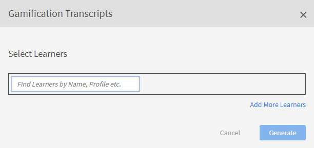
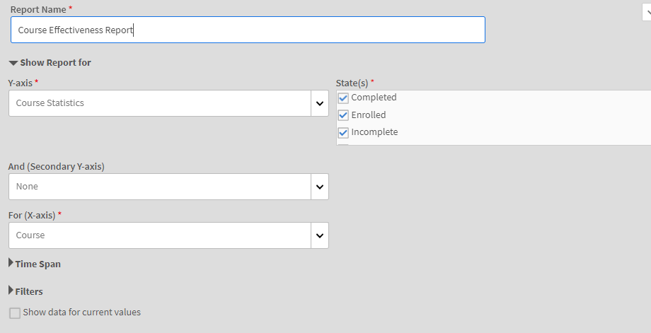
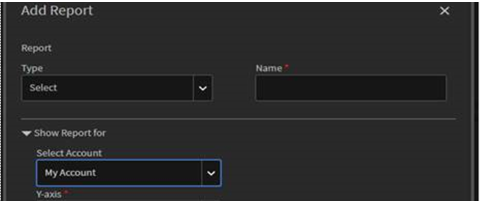

# Berichte

Informieren Sie sich über die Berichte, die mit der Administratorrolle in der Learning Manager-Anwendung verknüpft sind.

Mit Adobe Learning Manager können Sie verschiedene Berichte erstellen, um die Aktivitäten der Teilnehmer zu verfolgen, zu überwachen und zu kontrollieren. Aktivitäten von Teilnehmern werden verfolgt und automatisch in der Datenbank erfasst. Manager- und Administratoren-Berichte werden von der Datenbank aus erstellt.

## Übersicht {#overview}

Berichte für Administratoren und Manager werden auf ähnliche Weise erstellt. Manager können Berichte über ihre Mitarbeiter anzeigen, Administratoren hingegen alle Berichte im Unternehmen.

Berichte werden in einem Dashboard generiert. Ein Bericht muss sich in einem Dashboard befinden. Auf der Seite &quot;Berichte&quot; ist standardmäßig ein **[!UICONTROL Standard-Dashboard]** vorhanden. Alle Berichte, die Sie hinzufügen, werden in dieses Standard-Dashboard verschoben. Um Berichten zu einzelnen Dashboards hinzuzufügen, verwende den Dropdown-Pfeil und wähle **[!UICONTROL &quot;Report]** hinzufügen&quot;. Genauere Informationen über das Erstellen von Dashboards finden Sie im Bereich „Dashboards“ auf dieser Seite.

## Berichtstypen {#typesofreports}

Adobe Learning Manager unterstützt vier wichtige Berichtstypen wie z. B. Abschluss, aufgewandte Zeit, Kenntnisse und Effektivität. Mit den folgenden Berichtstypen könnt ihr Berichte über 300 Varianten erstellen:

* Statistiken zur Kursbereitstellung für Teilnehmer
* Bericht zur Effektivität von Kursen
* Kenntnisbasierter Bericht über Teilnehmer
* Statistik zur Registrierung der Teil für Lernprogramme
* Von den Teilnehmern aufgewandte Lernzeit
* Anzahl der Teilnehmer
* Abschluss der Zertifizierung

## Dashboards für Benutzeraktivität {#useractivitydashboards}

Zeigen Sie eine Zusammenfassung aller Benutzeraktivitäten auf der Plattform im Zeitverlauf an. Konfigurieren Sie Benutzergruppen und wenden Sie Filter an.

Das Dashboard für Benutzeraktivität zeigt die Aktivität der Benutzer im Konto an. Die drei aufgeführten Berichte sind:

* **Registrierte Benutzer:** Dieser Bericht enthält Informationen zur Anzahl der registrierten Benutzer in Ihrem Konto Woche für Woche. Bei Konten mit der Lizenzierung „Monatlich aktive Einheiten in diesem Monat“ zeigt der Bericht stattdessen die MAU-Einheiten an.

* **Bericht zu Anwenderbesuchen:** Dieser Bericht enthält Informationen über die Anzahl der Benutzer, die täglich auf die Plattform zugreifen. Der Monatsbericht ist ebenfalls verfügbar.

* **Report zu verbrachte Lernzeiten:** Dieser Bericht enthält Informationen zur täglichen Lernzeit, die in der Plattform verbracht wird. Der Monatsbericht ist ebenfalls verfügbar.

### Registrierte Benutzer {#registeredusers}

Learning Manager zeichnet jede Woche die Anzahl der im System registrierten Benutzer auf. Administratoren können diesen Bericht anzeigen, um die registrierte Anzahl der Benutzer an diesem Wochentag zu erfahren. Die einmal für eine Woche gespeicherte registrierte Anzahl ändert sich nicht. Daher steht die registrierte historische Anzahl nicht in Beziehung zur aktuellen Gruppe von Teilnehmern im System.

Dieser Bericht enthält Informationen zur Anzahl der Benutzer, die Woche für Woche bei Ihrem Konto registriert sind.

Bei Konten mit der Lizenzierung „Monatlich aktive Einheiten in diesem Monat“ zeigt der Bericht stattdessen die MAU-Einheiten an.

*Bericht registrierter Benutzer*

***Für Konten mit Einheit für monatlichen Zugriff:***

**Bericht über monatlich aktive Benutzer**

Dieser Bericht zeigt die Anzahl der Teilnehmer an, die jeden Monat auf der Lernplattform aktiv sind. Der Benutzer gilt für den Monat als aktiv, wenn er eine der hier genannten Lernaktionen ausführt. Dies ist die gleiche Weise, wie „Monatlich aktive Einheiten in diesem Monat“ gezählt werden.

Die einmal für einen Monat gespeicherte aktive Anzahl ändert sich nicht. Daher steht die angezeigte historische Anzahl nicht in Beziehung zur aktuellen Gruppe von Teilnehmern im System.

### Benutzerbesuche {#uservisits}

Dieser Bericht zeigt die Gesamtzahl der Teilnehmer, die in einem Tag oder Monat auf das System zugreifen. Das Durchsuchen der Lernplattform ohne Nutzung des Lernangebots wird auch als „Zugriff“ auf die Lernplattform betrachtet. Dies hilft dem Administrator, die Gesamtzahl der Benutzer zu ermitteln, die auf das System zugreifen. Am ersten Tag des Monats erstellt Learning Manager einen Datensatz mit allen Benutzern, die im Vormonat auf die Plattform zugegriffen haben. Sie erfasst auch die Informationen der Benutzergruppe für diese Benutzer.

Nur die vom Administrator konfigurierten Benutzergruppen werden aufgezeichnet. Dadurch können Administratoren auch Filter auf Benutzergruppen anwenden, um historische Monatsdaten zu verwenden. Hinweis: Die Konfiguration von Anwendergruppen in Großbuchstaben wird geändert, und Learning Manager hat in den früheren Monaten keine Daten für diese Benutzergruppe aufgezeichnet. Anschließend kann Learning Manager die Daten für diese neu konfigurierten Benutzergruppen für die vergangenen Monate nicht anzeigen.

Dieser Bericht enthält Benutzer, die mit allen Formaten wie Web, mobiler App, fragwürdigen benutzerdefinierten Lösungen usw. auf die Plattform zugreifen. Im Diagramm zur Verwendung der Geräte-App werden speziell nur die Benutzer berücksichtigt, die mit der Geräte-App von Learning Manager auf die Plattform zugreifen. Dadurch können Administratoren die Verwendung der mobilen App in ihrem Konto erkennen.

*Anwenderbesuchsbericht*

### Bericht über Zeitaufwand zum Lernen {#learningtimespentreport}

Hier sehen Sie zweiachsige Liniendiagramme, die den gesamten Zeitaufwand zum Lernen für alle Teilnehmer über einen Zeitraum von 12 Monaten anzeigen. Die zweite Achse stellt den mittleren Zeitaufwand zum Lernen einer einzelne Person dar.

Der Zeitaufwand für verschiedene Lernobjekte wie Lernprogramme und Zertifizierungen wird für Folgendes berechnet:

* Selbststudium mit statischen und interaktiven Inhalten
* Aktivitätskurse mit URL.
* Wochenendsitzungen mit aktiviertem Wochenendflag
* VC-Connect-Sitzung, bei der die Anwesenheit automatisch markiert wird
* Die für verschiedene Lernobjekte wie Lernprogramme und Zertifizierungen aufgewendete Zeit
* xAPI-Anweisungen für einen XAPI-Aktivitätskurs.

Sie können das Diagramm weiter als Excel-Tabelle exportieren.

Ein Filter zur Auswahl der Benutzergruppenkonfiguration erleichtert die Anzeige der Daten hinsichtlich verschiedener Benutzergruppen.

Der ausgewählte Datums- und Benutzergruppenfilter wird auf alle relevanten Diagramme im Dashboard angewendet.

>[!NOTE]
>
>Für die Berichte **[!UICONTROL Benutzerbesuche]** und **[!UICONTROL Zeitaufwand zum Lernen]** werden die Standarddaten (wenn keine Benutzergruppe konfiguriert ist) für das gesamte Konto angezeigt.

## Dashboard für Schulungsinhalt {#trainingcontentdashboard}

Das Dashboard für Schulungsinhalt bietet Einblicke in Schulungen, die auf der Plattform verfügbar sind. Sie können beliebte Schulungen anzeigen oder alle verfügbaren Schulungen verfolgen.

### Schulungsbericht {#trainingsreport}

Dieser Bericht enthält Informationen über alle Schulungen, die Monat für Monat (im Veröffentlichungszustand) auf der Plattform verfügbar sind. Er informiert über die Anzahl der im Laufe der Zeit angebotenen Schulungen.

*Schulungsbericht*

### Bericht über aktive Schulungen {#activetrainingsreport}

Dieser Bericht enthält Informationen zu den Schulungen, die über den ausgewählten Zeitraum aktiv sind. Aktive Schulungen sind Schulungen, die im jeweiligen Zeitraum registriert sind, im Player angezeigt oder abgeschlossen werden.

Für aktive Schulungen stehen Daten aller internen Gruppen von Stammbenutzern (mit Managerrolle) zur Auswahl, wenn keine Benutzergruppenkonfiguration vorgenommen wurde. Neben den Stammbenutzergruppen können Sie bei Bedarf 10 weitere Benutzergruppen konfigurieren.

*Bericht zu aktiven Schulungen*

>[!NOTE]
>
>Die Daten werden nicht wie erwartet angezeigt, wenn **[!UICONTROL alle Benutzer]** und **[!UICONTROL Filter für 12 Monate]** ausgewählt werden, aber die Daten werden angezeigt, wenn du &quot;Alle internen Benutzergruppen&quot; auswählst **.**

<table>
 <tbody>
  <tr>
   <td>
    
<b>Referenz</b>
</td>
   <td>
    
<b>Metrisch</b>
</td>
   <td>
    
<b>Beschreibung</b>
</td>
  </tr>
  <tr>
   <td>
    
1
</td>
   <td>
    
Startverhältnis (%)
</td>
   <td>
    
Verhältnis zwischen der Anzahl der Teilnehmer, die den Kurs gestartet haben, und der Anzahl der Registrierungen.
</td>
  </tr>
  <tr>
   <td>
    
2
</td>
   <td>
    
Abschlussverhältnis (%)
</td>
   <td>
    
Verhältnis zwischen allen Benutzern, die den Kurs abgeschlossen haben, und allen Benutzern, die den Kurs gestartet haben. 
</td>
  </tr>
  <tr>
   <td>
    
3
</td>
   <td>
    
Teilnehmerfeedback
</td>
   <td>
    
Durchschnitt aller eingegangenen L1-Feedback-Antworten auf einer Skala von 1 bis 10, gerundet auf die nächste ganze Zahl. 
</td>
  </tr>
  <tr>
   <td>
    
4
</td>
   <td>
    
Manager-Feedback
</td>
   <td>
    
Durchschnitt aller eingegangenen L3-Feedback-Antworten auf einer Skala von 1 bis 5, gerundet auf die nächste ganze Zahl 
</td>
  </tr>
 </tbody>
</table>

Der Schulungsbericht enthält zwei zusätzliche Spalten:

1. Durchschnittliche Sternebewertung eines Kurses.
1. Anzahl der Teilnehmer, die den Kurs bewertet haben.
1. Eingebetteter Pfad
1. ID für eingebetteten Pfad
1. ID für eingebetteten Kurs

>[!NOTE]
>
>Startverhältnis, Abschlussverhältnis, Teilnehmerfeedback und Manager-Feedback werden von den angewendeten Filtern nicht beeinflusst. Die Filter wirken sich nur auf Registrierung, Ansichten und Abschlüsse aus.

>[!NOTE]
>
>Für beide Berichte (Schulungsinhalt, Benutzeraktivität) können Sie maximal 10 Benutzergruppen konfigurieren. Es kann bis zu 24 Stunden dauern, bis die Verarbeitung abgeschlossen ist und die neu konfigurierten Filter verfügbar sind.

## Dashboards für Lernzusammenfassungen {#dashboards}

### Dashboard-Berichte generieren

>[!INFO]
>
>In dieser Schulung erfährst du, wie du Dashboard-Berichte aus der Datenbank generierst.    

Wenn du die Schulung nicht starten kannst, schreibe an <almacademy@adobe.com>.

Seht euch einen Übersichtsbericht zu allen Lernaktivitäten auf der Plattform an. Auf dieser Seite findest du die folgenden Übersichtsinformationen zum Team des ausgewählten Stammanwenders und zu externen Profilen. Der Zeitbereich kann auch ausgewählt werden:

* Lernzusammenfassung in Form von Registrierungen, Ansichten und Abschlüssen
* Top-Qualifikationen
* Compliance-Übersicht

*Übersichtsdiagramme*

Wenn interne Root-Level-Manager vorhanden sind, werden sie nacheinander angezeigt.

Alle externen Profile werden nach internen Profilen (Interne Benutzer auf Stammebene) aufgeführt.

Wenn ein externes Profil einen Manager hat, wird die Manager-Hierarchie in der **[!UICONTROL Dropdown-Liste Daten für]** anzeigen angezeigt. Der Anwender wird in der Manager-Hierarchie auf allen Details aufgeführt (Schulungsübersicht, Compliance und Kompetenzstatus).

Falls nicht, werden alle Individuellen Benutzerdetails in der Liste angezeigt.

Um detailliertere Details zu Anmeldungen verschiedener interner Teams zu sehen, klicke auf **[!UICONTROL &quot;Lernzusammenfassungsdetails&quot;]**.

*Details zur Lernzusammenfassung*

Wenn du auf eine Anmeldung klickst, siehst du die Teilnehmer für jeden Manager und die Anmeldung für welche Lernobjekte. Sie können auch die Details zum Fortschritt und Abschluss der einzelnen Teilnehmer sehen.

*Einem Manager zugewiesene Teilnehmer*

Klicken Sie auf ein beliebiges Team und exportieren Sie seinen Bericht als CSV-Datei. Ein Administrator kann den Bericht für eine beliebige Anwendergruppe oder einen einzelnen Benutzer exportieren, indem er die Benutzergruppe oder den einzelnen Benutzer auswählt und dann details aus der **[!UICONTROL Dropdown-Liste &quot;Aktion&quot;]** exportiert.

Außerdem siehst du in einem Balkendiagramm die aktuellen und bereits erreichten Skills. Sie können Kenntnisse hinzufügen/entfernen, die Sie im Diagramm verwenden möchten.

*Übereinander gestapelter Balkendiagramm zum Kompetenzstatus*

### Kompatibilitäts-Dashboard

**Adobe Learning Manager** bietet allen Administratoren und Managern ein Compliance-Dashboard. Administratoren können ein Compliance-Dashboard erstellen und an Manager weitergeben. Manager können das neu freigegebene Dashboard in ihrer Applikation anzeigen und die Compliance ihrer Team-Mitglieder für eine bestimmte Schulung verfolgen. Mit dem Compliance-Dashboard können Administratoren benutzerdefinierte Compliance-Kurse in bestimmte Kategorien kategorisieren (z. B. Vertrieb, Marketing und Rechtsabteilung). Benutzerdefinierte Compliance-Kategorien basieren auf **[!UICONTROL Katalog-Labels]**.

_Compliance-Dashboard – Administratoransicht_

Administratoren können auch den Compliance-Status für das jeweilige Team überprüfen, indem sie das Compliance-Dashboard ]**auswählen**[!UICONTROL . Administratoren können eine Reihe von Schulungskursen einzeln oder gemeinsam mit einer Gruppe an Manager weitergeben. Dies hilft Managern, die Compliance ihrer Team-Kollegen für die festgelegten Schulungen zu verfolgen.

#### Admin-Workflow

##### Benutzerdefinierte Compliance-Labels erstellen

Ein Compliance-Label ist eine Art Katalogetikett, das Kurse/Lernpfade/Zertifizierungen als Compliance-Art kategorisiert.
So erstellst du ein benutzerdefiniertes Compliance-Label:

1. Wähle in der Administrator-App **[!UICONTROL einstellungen]** > **[!UICONTROL Allgemein]** aus.
1. Wähle **[!UICONTROL &quot;Benutzerdefinierter Compliance-Typ&quot;]** , um das benutzerdefinierte Compliance-Label zu aktivieren.

   
   _Benutzerdefinierte Compliance ermöglichen_

   >[!NOTE]
   >
   >Dieses neue Katalog-Label wurde eingeführt, um Kurse, Lernpfade und Zertifizierungen als Compliance-Art zu kategorisieren. Um die **[!UICONTROL Option &quot;Benutzerdefinierter Konformitätstyp]** &quot; zu aktivieren, musst du auf derselben Seite zuerst die **[!UICONTROL Option &quot;Katalogetikett]** anzeigen&quot; aktivieren.

1. Gehe zu **[!UICONTROL Einstellungen]** > **[!UICONTROL Katalogetikett]** , und wähle den **[!UICONTROL Typ &quot;Compliance&quot; aus]**.
1. Gib die Werte (z. B. Legal, Vertrieb) im **[!UICONTROL Textfeld &quot;Wert]** &quot; ein, und wähle **[!UICONTROL &quot;Wert]** hinzufügen&quot;.

   
   _Werte für benutzerdefinierte Compliance hinzufügen._

1. Wählen Sie **[!UICONTROL Speichern]**.

>[!NOTE]
>
>Der Autor muss diese Compliance-Labels hinzufügen, während er die Kurse in seiner Applikation erstellt/bearbeitet. Siehe [Compliance-Labels zu Kurs/Lernpfad/Zertifizierung](/help/migrated/authors/feature-summary/courses.md#add-compliance-labels-to-courselearning-pathcertification) hinzufügen.

##### Compliance-Dashboard erstellen und weitergeben

So erstellst und teilest du ein Compliance-Dashboard:

1. **[!UICONTROL Zu Reports > Learning Summary (Reports]** > **[!UICONTROL Learning Summary).]**
1. Wähle im Abschnitt Compliance-Dashboard ]**&quot;**[!UICONTROL **[!UICONTROL Gemeinsam mit Managern]** freigeben&quot;.
1. Wähle das Dashboard &quot;**[!UICONTROL Freigeben&quot;]** aus, und wähle im Dropdown-Menü &quot;Benutzerdefinierte Compliance&quot;]**die**[!UICONTROL  erstellten Beschriftungen aus.

   
   _Typ &quot;Compliance&quot; auswählen_

1. Gib den Namen des Managers im Textfeld &quot;Freigeben mit ]**&quot; ein, und wähle den Namen des**[!UICONTROL  Managers aus.
1. Wähle &quot;Freigeben&quot;****, um das Dashboard an den ausgewählten Manager zu senden.

>[!NOTE]
>
>Durch die Freigabe des neuen Dashboards wird das vorhandene Dashboard im Programm des ausgewählten Managers überschrieben. Manager können das neu freigegebene Dashboard der Administratoren anzeigen.

<!--In the final visualization, you can check the compliance status of learners, and take appropriate action.

Also, an Admin can view individual training data in the **[!UICONTROL Compliance Dashboard]**.

For instance, the Administrator has identified three trainings to track compliance. Learning Manager provides the compliance snapshot for all three trainings at once.

Now an Admin can click on any training and quickly view the compliance for the selected training.

*View Compliance dashboard*

You can also see the compliance status for each internal team.

Click the link **[!UICONTROL Compliance Status Details]** on the bottom of the visualization. 

You can see that, for a team, the number of learners in the team are violating or honoring the learning compliance.

*Compliance status of a team*

### Share training with managers

Learning Manager offers compliance dashboard to all Administrators and Managers. Managers find it very useful to track compliance of their team members for a particular training. At the same time, Administrators would like all Managers to add compliance trainings to their dashboard and track it. 

In Learning Manager, the **[!UICONTROL Share with Managers]** workflow allows Administrators to share training with Managers, so that they can get added to a manager's Compliance Dashboard. Thus, Managers do not need to take any action and can start tracking compliance immediately. 

An Administrator can share a set of training courses with managers individually or with a group. This sharing can help a manager easily track the compliance of his/her team for the specified training.

The Administrator can "push" a default list of compliance training to be viewed in the manager's compliance dashboard.

### Share training

1. In **[!UICONTROL Reports]** > **[!UICONTROL Learning Summary]**, scroll down, and click the tab **[!UICONTROL Share with Managers]**. 

   
   *Share training with managers*

1. To add training or multiple training, click **[!UICONTROL Share more]**.   

1. In the **[!UICONTROL Share with Managers]** dialog, choose the training(s) and the manager(s).

   
   *Select training to share with managers*

1. Click **[!UICONTROL Share]**.

The training is now shared with the specified manager.

### View training

In the list of shared training, click **[!UICONTROL View]**. You can view the training that is assigned to a manager or some managers.

### Withdraw training

1. To withdraw training from a manager, click **[!UICONTROL Withdraw]**.  

1. Click **[!UICONTROL Proceed]**. This withdraws previously shared training from the Manager's compliance dashboard.-->

## Benutzerdefinierte Berichte

Administratoren können mithilfe der benutzerdefinierten Vorlage im **[!UICONTROL Abschnitt Berichte]** spezifische Berichte generieren.

### Beispielberichte {#samplereports}

Die Registerkarte **[!UICONTROL Beispielberichte]** zeigt einige Musterberichte an, die aufgrund von Beispieldaten erstellt wurden. Sehen Sie sich diese Berichte an, um zu verstehen, welche funktionsreichen Berichtsvarianten Sie mit Ihren Kontodaten generieren können.

### Dashboard-Berichte {#dashboardreports}

Ein Dashboard ist eine Sammlung von Berichten. Berichte können nach Wahl in einem Dashboard gruppiert werden. Um alle von dir erstellten Boards anzuzeigen, klicke auf diese Registerkarte. Über die **[!UICONTROL Dropdown-Liste &quot;Ansichts-Dashboard]** &quot; kannst du die Standardkarte oder ein von dir erstelltes Dashboard auswählen.

### Excel-Berichte {#excelreports}

Auf der Registerkarte **[!UICONTROL Excel-Berichte]** können Sie Berichte im XLS-Dateiformat exportieren.

Die folgenden Berichtstypen können heruntergeladen werden.

* Kursberichte
* Teilnehmertranskripte
* Bericht für Ankündigungen
* Bericht zu Arbeitshilfen
* Inhaltsprüfpfad
* Benutzerprüfpfad
* Anmelde-/Zugriffsbericht
* Gamification-Transkripte
* Gamification-Prüfpfad

### Teilnehmertranskripte {#learnertranscripts}

In den Teilnehmertranskripten in Excel-Berichten werden die Spalten „Benötigte Credits“ und „Verdiente Credits“ in Dezimalzahlen angezeigt. 

### Kursberichte {#coursereports}

Als Administrator können Sie Berichte für Kurse herunterladen. Führen Sie die folgenden Schritte aus:

1. Öffne **[!UICONTROL Berichte]** > **[!UICONTROL benutzerdefinierte Berichte]** > **[!UICONTROL Excel-Berichte]** > **[!UICONTROL Kursberichte]**.
1. Das Dialogfeld **[!UICONTROL Kursbericht]** wird angezeigt. Wählen Sie den Kurs aus, von dem Sie den Bericht abrufen möchten, und klicken Sie auf **[!UICONTROL Anzeigen]**.

   
   *Kursberichte*

1. Sie werden auf die Kursseite weitergeleitet. Ihr könnt den Testwert nach Anwender und Frage basierend auf jeder Anmeldung exportieren, indem ihr den jeweiligen Anmeldetyp auswählt.
1. Wählen Sie **[!UICONTROL Quizpunktzahl exportieren]**, um den Bericht zu exportieren. Das Dialogfeld **[!UICONTROL Erstellen einer Berichtsanforderung]** wird geöffnet. Klicken Sie auf **[!UICONTROL OK]**, um zu bestätigen.

   
   *Generieren von Berichtsanfragen*

   >[!NOTE]
   >
   >Der exportierte Bericht zur Quizpunktzahl enthält die Bewertungsdetails für jeden Versuch, wenn die Option „Mehrfachversuch“ für das Modul konfiguriert ist.

### Teilnehmertranskripte {#LearnerTranscripts-1}

Mit Adobe Learning Manager können die Administratoren eines Unternehmens die Transkripte erstellen, die mit den Teilnehmenden verknüpft sind. Der Teilnehmertranskriptbericht enthält Folgendes:

1. Teilnehmertranskript: Dashboard für Lernaktivitäten
1. Kompetenz:Kompetenz-Dashboard
1. Kompatibilitäts-Dashboard

In den Teilnehmertranskripten in Excel-Berichten werden die Spalten „Benötigte Credits“ und „Verdiente Credits“ in Dezimalzahlen angezeigt. 

Informationen zur Erstellung von Berichten zum Teilnehmer-Protokoll und weitere Informationen findest du unter [Teilnehmer-Protokolle](learner-transcripts.md).

### Berichte für Ankündigungen {#announcementsreports}

Als Administrator können Sie einen Bericht aller Ankündigungen generieren, die Sie senden. Der Bericht enthält Details zu:

* Ankündigungstyp
* Name der Ankündigung
* Ankündigungsdatum
* Status der Ankündigung
* Teilnehmername

Um einen Bericht herunterzuladen, führen Sie einen der folgenden Schritte aus:

1. Öffne **[!UICONTROL Berichte]** > **[!UICONTROL benutzerdefinierte Berichte]** > **[!UICONTROL Excel-Berichte]** > **[!UICONTROL Ankündigungen]**. Das Dialogfeld **[!UICONTROL Erstellen einer Berichtsanforderung]** wird geöffnet. Klicke auf Ok.
1. [!UICONTROL **Ankündigungen**] > [!UICONTROL **Aktionen**] > [!UICONTROL **Exportbericht**].

   
   *Bericht zu Ankündigungen*

1. Um einen Bericht für eine bestimmte Ankündigung zu extrahieren, klicke unter &quot;Einstellungen&quot; auf **[!UICONTROL &quot;Exportbericht]** &quot;.

   
   *Bericht für spezifische Ankündigungen*

### Bericht zu Arbeitshilfen {#jobaidsreport}

Arbeitshilfen sind Schulungsmaterialien, auf die ein Teilnehmer zugreifen kann, ohne dass sie sich für spezifische Lernobjekte wie beispielsweise für einen Kurs oder ein Lernprogramm registrieren müssen. Administratoren können Arbeitshilfen extrahieren und herunterladen.

Der extrahierte Bericht enthält Informationen zu folgenden Themen:

* Name
* Typ der Arbeitshilfe
* Status der Arbeitshilfe (veröffentlicht oder eingestellt)
* Registrierungsdatum
* Datum des Abschlusses
* Downloaddatum
* Teilnehmername
* Managername
* Erstellt von

Führen Sie eine der folgenden Schritte aus, um einen Bericht herunterzuladen:

* Öffne  **[!UICONTROL Berichte]** > **[!UICONTROL benutzerdefinierte Berichte]** > **[!UICONTROL Excel-Berichte]** > **[!UICONTROL Arbeitshilfeberichte]**. Das Dialogfeld **[!UICONTROL Erstellen einer Berichtsanforderung]** wird geöffnet. Klicken Sie auf **[!UICONTROL OK]**.
* Open **[!UICONTROL Job Aid]** > **[!UICONTROL Actions]** > **[!UICONTROL Export Report]**.

*Job-Aids-Bericht*

* Sie können einen Bericht für eine bestimmte Arbeitshilfen extrahieren, indem Sie auf **[!UICONTROL Bericht exportieren]** unter dem Symbol „Einstellungen“ klicken.

*Report für spezifische Arbeitshilfen*

### Bericht zu Arbeitshilfen

Nachdem du den **[!UICONTROL Job-Aids-Report]** ausgewählt hast, sind zwei Optionen verfügbar:

*Herunterladen Job Aids USer Enrollment Report*

**Alle Arbeitshilfen**: Wenn die Anzahl der Arbeitshilfen auf dem Konto weniger als 10 Millionen beträgt, enthält der generierte Bericht Informationen zur Anmeldung aller Arbeitshilfen. Dies ist die Standardauswahl. Wenn die Zeilenanzahl 10 Millionen überschreitet, wird ein Fehler angezeigt. Die erforderlichen Arbeitshilfen müssen manuell ausgewählt werden.

**Ausgewählte Arbeitshilfen**: Wenn du diese Option auswählst, kannst du die Arbeitshilfen eingeben, für die du den Bericht generieren willst. Sie können höchstens 10 Arbeitshilfen auswählen. Adobe Learning Manager prüft, ob die Anzahl der Arbeitshilfen 10 Millionen überschreitet.

*Bewerbungshilfe auswählen*

**Job-Aids-Report**

Wenn Sie diese Option auswählen, werden die Details aller im System vorhandenen Arbeitshilfen zusammen mit ihren Metadaten und Schulungen heruntergeladen.

Der heruntergeladene Bericht enthält folgende Felder:

* Name der Arbeitshilfe
* Sprache(n)
* ID
* Typ
* Dauer (Minuten)
* Status
* Veröffentlicht am (UTC-Zeitzone)
* Erstellt nach Name
* Erstellt nach E-Mail
* Erstellt nach eindeutiger ID
* Katalog(e)
* Lernpfad(e)
* Kurs(e)
* Tag(s)
* Kenntnis(se)

**Bericht über Arbeitshilfen für Anwender**

Der Registrierungsbericht enthält Details zur Benutzerregistrierung und andere Informationen.

Der heruntergeladene Bericht enthält folgende Felder:

* Name der Arbeitshilfe
* Typ
* Status
* Registrierungsdatum (UTC-Zeitzone)
* Abgeschlossenes Datum (ZEITZONE FÜR DAS 20219)
* Download-Datum (ZEITZONE FÜR DAS ZEIT-ABO VON 2020)
* Teilnehmendenname
* E-Mail
* Eindeutige ID des Benutzers
* Managername
* E-Mail-Adresse des Managers
* Eindeutige Manager-Benutzer-ID
* Nach Name zugewiesen
* Per E-Mail zugewiesen
* Zugwiesen nach eindeutiger Benutzer-ID
* Erstellt nach Name
* Erstellt nach E-Mail
* Erstellt nach eindeutiger ID
* Arbeitscode
* Neues Feld
* Profil

### Berichte zu Inhaltsprüfpfaden {#contentaudittrailreports}

Erstellt mit dem Report-Generator für Content **[!UICONTROL Audit Trail]** einen Bericht über alle Änderungen und Änderungen, die während der Nutzung eines Kurses im System vorgenommen wurden. Der generierte Bericht enthält die folgenden Informationen.

* Objekt-ID
* Objektname
* Objekttyp
* Änderungstyp
* Beschreibung
* ID des referenzierten Objekts
* Referenzierter Objektname 
* Nach Benutzername geändert
* Geändert von Benutzer-ID
* Änderungsdatum (UTC-Zeitzone) 

In der **Spalte &quot;Modifikationstyp** &quot; werden die folgenden Details angezeigt:

| Änderungstyp | Beschreibung |
| --- | --- |
| Erstellen | Erstellter Kurs |
| Zertifizierung hinzufügen | Zu Catalog hinzugefügte Zertifizierung |
| Entfernen der Zertifizierung | Aus Katalog entfernte Zertifizierung |
| Inhalte hinzufügen | Zu Modul hinzugefügter Content |
| Kurs hinzufügen | Kurs, der zum Lernpfad hinzugefügt wurde |
| Kurs entfernen | Kurs aus dem Lernpfad entfernt |
| Eigenes Label hinzufügen | Benutzerdefiniertes Label, das zum Katalog hinzugefügt wurde |
| Benutzerdefiniertes Etikett entfernen | Benutzerdefiniertes Etikett aus Katalog entfernt |
| Löschen | Gelöschter Katalog |
| Stellenhilfe hinzufügen | Zu Katalog hinzugefügte Stellenhilfe |
| Job Aid Entfernen | Job Aid aus Katalog entfernt |
| Lernpfad hinzufügen | Lernpfad zum Katalog hinzugefügt |
| Lernpfad entfernen | Aus Katalog entfernter Lernpfad |
| Modul-Content-Hinzufügen | Modul, das zu Kurs hinzugefügt wurde (Abschnitt &quot;Inhalt&quot;) |
| Modulinhalte entfernen | Aus Kurs entferntes Modul (Abschnitt &quot;Inhalt&quot;) |
| Veröffentlicht | Kurs- oder Lernpfad veröffentlicht und zum Standardkatalog hinzugefügt |
| Wiederveröffentlicht | Kurs erneut veröffentlicht |
| Ressourcen hinzufügen | Ressource, die zum Kurs hinzugefügt wurde |
| Ressourcen entfernen | Ressource aus Kurs entfernt |
| Eingestellt | Kurs im Ruhestand |
| Freigegebener Katalog hinzufügen | Katalog, der in Catalog freigegeben wurde |
| Freigegebener Katalog entfernen | Katalogfreigabe aus dem Katalog entfernt |
| Aktualisierung freigegebener Kataloge | Status für Katalogfreigabe: aktiv |
| Update | Kurs- oder Lernpfad aktualisiert |
| Anwendergruppe hinzufügen | Benutzergruppe, die zum Katalog hinzugefügt wurde |
| Benutzergruppe entfernen | Aus Katalog entfernte Benutzergruppe |

Informationen zu Metadaten werden nicht im generierten Bericht aufgerufen.

Um einen Kursprüfprotokollbericht zu generieren, führen Sie die folgenden Schritte aus.

1. Wähle Report ]****[!UICONTROL > **[!UICONTROL Excel-Berichte]** > **[!UICONTROL Course Audit Trail]** aus. Das Dialogfeld **[!UICONTROL Inhaltsprüfpfad]** wird angezeigt.

   
   *Kursprüfungsprotokoll*

1. Wählen Sie den Kurs, die Lernprogramme und Zertifizierung aus, von deren die den Bericht herunterladen möchten. Wenn nicht angegeben, werden alle Berichte standardmäßig heruntergeladen.
1. Wähle einen Datumsbereich für den Bericht aus, und klicke auf &quot;Generieren ]**&quot;**[!UICONTROL .
1. Der Bericht wird erstellt und Sie werden benachrichtigt, dass der Prüfbericht bereit ist. Sie können den Bericht herunterladen.

### Berichte zu Benutzerprüfpfaden {#useraudittrailreports}

Das Prüfprotokoll erfasst den Lebenszyklus von Anwendern, Anwendergruppen und Profilen zur Selbstregistrierung. Hier werden das Hinzufügen, Löschen, ein Wechseln des Managers für Benutzer erfasst. Die Erstellung und Löschung von Selbstregistrierungsprofilen werden aufgezeichnet. Sie können die Selbstregistrierung auch aussetzen und fortsetzen.

Sie können externe Profile hinzufügen, aktivieren, deaktivieren, aussetzen oder fortsetzen, die Selbstregistrierung hingegen hinzufügen, löschen, aussetzen oder fortsetzen. CSV-Uploads werden ebenfalls erfasst.

1. Wähle  **[!UICONTROL Bericht > Excel-Bericht > Benutzerhandbuch]** aus. Das Dialogfeld &quot;Benutzerprüfungsprotokoll&quot; wird angezeigt.
1. Das Dialogfeld „Benutzerprüfpfad“ wird angezeigt. Wählen Sie den Datumsbereich im Popupmenü. Sie können den Bericht wahlweise für die letzte Woche oder den letzten Monat generieren oder ein benutzerdefiniertes Datum wählen.

   
   *Prüfprotokoll für Anwender*

1. Klicken Sie auf **[!UICONTROL Generieren]**, um den Bericht zu generieren.

Es gibt zwei Filter im Dialogfeld **[!UICONTROL Benutzerprüfpfad-Bericht]**.

**Datumswut-Filter:** Wähle den Datumsbereich aus, für den du den Report generieren willst. Es gibt drei Optionen:

* Letzte Woche
* Letzter Monat
* Benutzerdefiniertes Datum

Filter &quot;Teilnehmer auswählen&quot;: Suche nach einem Benutzer oder einer Benutzergruppe.

Der exportierte Bericht enthält Daten der Benutzer, die beide Suchkriterien erfüllen.

*Prüfprotokoll für Anwender*

>[!NOTE]
>
>Wenn Kenntnisse zugewiesen oder entfernt werden, können sie für den Benutzerprüfungsbericht verfolgt werden, sowohl für zugewiesene als auch für entfernte Kenntnisse.

### Bericht über die Konfiguration der Erweiterung

Dieser Bericht enthält Informationen zu den Konfigurationsdetails aller hinzugefügten nativen Erweiterungen einschließlich ihres Aktivierungsstatus. Weitere Informationen zum Download des Erweiterungsberichts findest du unter [Download extension report](native-extensibility.md#download-extension-report).

### xAPI-Aktivitätsbericht

Dieser Bericht enthält die Daten aller xAPI-Anweisungen, die während der xAPI-Aktivitätsmodule aufgezeichnet und generiert wurden.

So ladest du den Report herunter:

1. Wähle  **[!UICONTROL Report > Excel-Bericht > xAPI Activity Report]** aus. Das Dialogfeld &quot;xAPI-Aktivitätsbericht&quot; wird angezeigt.
1. Wählen Sie den Datumsbereich im Popupmenü. Sie können den Bericht wahlweise für die letzte Woche oder den letzten Monat generieren oder ein benutzerdefiniertes Datum wählen.
1. Wähle die Teilnehmer und die Aktivität aus dem Dropdown-Menü aus.
1. Wähle **[!UICONTROL &quot;Generieren&quot;]** , um den Bericht zu generieren.

### Gamification-Berichte {#gamification}

Administratoren können das Gamification-Transkript im CSV-Format herunterladen. Du kannst den Report entweder für einzelne Anwender oder Anwendergruppen herunterladen. Im Bericht werden der Benutzername, die E-Mail-Adresse des Benutzers, die AAAAID des Benutzers, die Gesamtzahl der erfassten Punkte, die Aufteilung der erfassten Punkte, der Name der vom Benutzer abgespielten Gruppen, der Name des Managers und die aktiven Feldwerte abgerufen. Administratoren können diesen Bericht verwenden, um Benutzerrangfolgen auf Organisationsebene oder für eine bestimmte Gruppe zu bewerten und zu analysieren.

1. Wähle Report > Excel-Bericht > Gamification-Bericht aus.

   
   *Gamification-Bericht*

1. Das Dialogfeld „Gamification-Transkripte“ wird angezeigt. Wählen Sie Teilnehmer anhand ihres Namens, Profils, ihrer Benutzergruppen, ihrer E-Mail-ID oder ihrer UUID aus.

   
   *Dialog zu Gamification-Transkriptionen*

1. Klicke auf  **[!UICONTROL Generieren]** , um den Bericht zu generieren.

   Nachdem du den Bericht eines Teilnehmers generiert hast, musst du in der Lage sein, die aktuellen und erreichten Informationen für alle Benutzer (intern, extern oder gelöscht) im Konto zu exportieren. Sie können auch die Daten für die von einem Teilnehmer erreichte Kenntnisstufe überprüfen:

   * Datum, an dem Bronze erreicht wurde
   * Datum, an dem Silber erreicht wurde
   * Datum, an dem Gold erreicht wurde
   * Datum, an dem Platin erreicht wurde

   Diese Spalten enthalten die Daten, an denen die Kenntnisstufe zum ersten Mal erreicht wurde. In der Spalte **[!UICONTROL &quot;Aktueller Pegel&quot;]** wird der aktuelle Pegel des Teilnehmers angezeigt.

   Wenn der Administrator die Gamification zurücksetzt, werden alle Punkte des Teilnehmers entsprechend zurückgesetzt.

### Gamification Audit Trail-Bericht {#gamification-audit-trail}

Dieser Bericht enthält den Verlauf und die Gründe für die Gamification-Punkte der Teilnehmer, die für jede Regel gewonnen wurden.

### Report herunterladen

1. Wähle das Gamification Audit Trail URL aus.
1. Wähle im **Popup-Popup-Fenster &quot;Gamification Audit Trail** &quot; den Datumsbereich aus.
1. Wähle **&quot;Generieren&quot;**.

Der Bericht wird als CSV-Datei heruntergeladen. Die Datei enthält die folgenden Spalten:

* Name
* E-Mail/3D-ID,
* Status
* Aktion
* Punkte
* Ausgleichspunkte
* Regel/Aufgabe
* Regel-/Aufgaben-Untertask,
* Regel-/Aufgabendetails
* Art
* Name
* Erreichter Instanzname (3D-Zeitzone)
* Regel-/Aufgabenstartzeit
* Regel-/Aufgaben-Endzeit

### Bericht zur Registrierung und Aufhebung der Registrierung {#enrollmentandunenrollmentreport}

Administratoren und Manager können einen Bericht über die Teilnehmer extrahieren, die angemeldet und nicht abgerollt wurden. Als Administrator können Sie alle Teilnehmer, Administrator oder Manager sehen, die von einer Instanz eines Kurses des Lernprogramms oder der Zertifizierung registriert wurden oder deren Registrierung aufgehoben wurde und Sie können den Bericht exportieren. Während ihr als Manager nur einen Bericht eurer Team-Mitglieder abrufen könnt. Als Krippe ist es Ihnen nicht möglich, die gelöschten Teilnehmer oder Ihren eigenen Namen in der Manager-Anwendung als registrierter oder nicht abgeschriebener Teilnehmer zu sehen.

Um einen Bericht herunterzuladen, führe die folgenden Schritte aus: Öffne den  **[!UICONTROL Bericht &quot;Kurs/Lernprogramm/Zertifizierung]** > **[!UICONTROL Teilnehmer]** > **[!UICONTROL Aktion]** > **[!UICONTROL Export&quot;]**.

*Bericht zur Abrollung*

### Feedbackbericht {#feedback-report}

Als Administrator können Sie jetzt sowohl Teilnehmer-Feedback (L1) als auch Manager-Feedback (L3) für ausgewählte Schulungen für einen bestimmten Zeitraum abrufen.

Sie können die Daten aus der Benutzeroberfläche oder über den PowerBI-Connector exportieren, um detailliertere Analysen durchzuführen.

Die Feedback-Berichte L1 und L3 bieten die Möglichkeit, einen konsolidierten Feedbackbericht für die Rückmeldungen von L1 und L3 für ausgewählte Schulungen für einen Zeitraum von einem **Jahr** oder für bis zu 10 ausgewählte Schulungen für einen beliebigen Datumsbereich herunterzuladen.

Melde dich als Administrator an, klicke auf **[!UICONTROL Berichte]** > **[!UICONTROL Benutzerdefinierte Berichte]**, und klicke in der Liste der Berichte auf **[!UICONTROL Feedback-Report]**.

*Feedback-Report herunterladen*

Wenn du nach Auswahl der Filter auf &quot;Herunterladen&quot; klickst, erhältst du eine Benachrichtigung, um den Report im CSV Format herunterzuladen.

Der heruntergeladene Bericht enthält Informationen wie Schulungsname und -typ, Instanzname, Teilnehmername und E-Mail, Feedbacktyp: L1 oder L3, Datum des eingereichten Feedbacks für neue Daten.

Bei vorhandenen Daten vor der Implementierung dieser Funktion wird das Datum der LO-Fertigstellung angezeigt, das Lo-Fertigstellungsdatum, die L1-Feedback-Frage Der aktuelle Text selbst und der Klassenraumtext in verschiedenen Spalten, die jeweiligen Antworten von L1 Feedback, der Manager-Name und die E-Mail, der L3-Feedbackwert und das übermittelte Datum, aktive Felder.

Sie können die Daten auch aus der Benutzeroberfläche oder in Power BI exportieren. Dies unterstützt alle Schulungen für jeden Datumsbereich, um detailliertere Analysen zu ermöglichen.

### Schulungsbericht {#training-report}

Learning Manager unterstützt den Schulungsbericht, mit dem Administratoren Schulungsdetails und zugehörige Metadaten wie Autor, Veröffentlichungsdatum, Kenntnisse, Katalogetiketten usw. herunterladen können.

Klicke in der Admin-App auf Reports > Custom Reports ]**>**[!UICONTROL  Excel Reports ]**>**[!UICONTROL  Trainings Report ]**.******[!UICONTROL 

Sie können Berichte für die folgenden Zwecke herunterladen:

* Ausgewählte Schulungen (maximal 10): Eine oder mehrere Schulungen (bis zu 10) aus einem beliebigen Katalog werden ausgewählt.
* Alle Schulungen im ausgewählten Katalog (maximal 5) – Katalogauswahl ist bis zu fünf Katalogen verfügbar.
* Alle Schulungen – alle Schulungen im Konto

*Training-Report herunterladen*

Im Abschnitt Erweiterte Optionen sind die folgenden Optionen verfügbar:

* Kurszuordnungen mit Lernprogramm/Zertifizierung einschließen
* Modulebeneninformationen einschließen

Nachdem du die Filter ausgewählt und auf &quot;Herunterladen&quot; geklickt hast, erhältst du eine Benachrichtigung, um den Report im CSV Format herunterzuladen.

Der Bericht enthält folgende Felder:

*Katalogname, Schulungstyp, Schulungs-ID, eindeutige ID für Schulung, Schulungsname, Unterschulungen, Module, Schulungen oder Module Dauer, Format, Status von Schulung, Fähigkeiten, Autor, Letztes veröffentlichtes Datum, letztes abgeschlossenes Datum, Anzahl der Anmeldungen der Ausbilder, Anzahl der Gestarteten, Abschlussanzahl, Avg L1-Punktzahl, Avg L2-Punktzahl, Avg L3-Punktzahl, erhaltene L1-Antworten, erhaltene L2-Antworten, L3-Antworten, Katalogbeschriftungen und Tags.*

*Weitere Optionen*

### Sitzungsübersicht – Bericht {#session-summary-report}

Der Session Summary Report enthält alle Sessions, die für einen Teilnehmer innerhalb eines bestimmten Datums geplant sind.

Auf diese Weise kann der Administrator alle Session-Details für Virtuelles Lernen und Klassenzimmer exportieren, die unter den angegebenen Datumsbereich fallen. Der Administrator kann den Sitzungsbericht auch in Bezug auf spezifische Schulungen oder Kursleiter exportieren.

Dies hilft dem Administrator auch, die monatlich geplanten Sitzungen zu verstehen und den Zeitplan der Kursleiter und die bereits bereitgestellten Sitzungen zu ermitteln.

Klicke als Administrator auf **[!UICONTROL Benutzerdefinierte Berichte]** > **[!UICONTROL Session-Übersichtsbericht]**.

Wählen Sie im folgenden Dialogfeld den Datumsbereich und entweder eine Schulung oder einen Kursleiter für den Bericht aus.

*Session Summary Report*

Die heruntergeladene CSV-Datei enthält die folgenden Felder:

* Startdatum und -uhrzeit
* Enddatum und -uhrzeit

* Modulname
* Sitzungsdauer (in Minuten)
* Sitzanzahl
* Standort
* Instanzname
* Kursname
* Kurs-ID
* Kursleitername
* Kursleiter-E-Mail
* Anzahl der Registrierungen
* Sitzungstyp
* Limit für Warteliste
* Warteliste – Anzahl
* Warteliste – Benutzer-E-Mail-Adressen
* Standortinformationen
* Standortregion

### Bericht zur Auslastung von Kursleiter(innen)

Dieser Bericht erfasst die Zeit (in Minuten), die Kursleiter(innen) täglich mit zugewiesenen Sitzungen verbringen. Der Bericht kann für einen Zeitraum von drei Monaten ab dem ausgewählten Startdatum heruntergeladen werden.

Um den Report herunterzuladen, klicke auf **[!UICONTROL Reports]** > **[!UICONTROL Custom Reports]** > **[!UICONTROL Instructor Utilization Report]**.

Wählen Sie einen oder mehrere Kursleiter(innen) und den Datumsbereich aus.

*Download Instructor Utilization Report*

Der heruntergeladene Bericht enthält die folgenden Felder:

* Kursleitername
* Kursleiter(innen)-ID
* Kompetenzniveau
* Datumsangaben in Spalten. Wenn Kursleiter(innen) an einem Tag ausgelastet sind, wird die Anzahl der Sitzungen aufgeführt. Wenn Kursleiter(innen) an einem Tag nicht ausgelastet sind, wird der Wert Null angezeigt.

Der Bericht enthält Datensätze für drei Monate ab dem ausgewählten Monat.

Um Datensätze aller Kursleiter(innen) abzurufen, lassen Sie das Feld &quot;Kursleiter(in)&quot; leer.

Außerdem kann ein(e) benutzerdefinierte(r) Administrator(in) mit der Berechtigung zum Generieren von Berichten diesen Bericht abrufen.

### Benutzerprüfpfad-Bericht

Dieser Bericht erfasst Informationen über die Teilnehmer, die Instanzen &quot;von Instanz zu Instanz&quot; gewechselt haben, die nach Zeit, Datum usw. geschaltet wurden.

Wählen Sie die Teilnehmenden oder eine Benutzergruppe aus.

Um den Bericht herunterzuladen, klicke auf Reports > Custom Reports ]**>**[!UICONTROL  User Audit Trail Report ]**.******[!UICONTROL 

*User Audit Trail-Bericht herunterladen*

### Lernplanbericht

Dieser Bericht enthält Details zu allen Lernplänen in einem Konto, z. B. zugehörige Benutzergruppen, Status und Auslöserinformationen.

Der Bericht enthält Folgendes:

* Name des Lernplans
* Typ (tritt auf, wenn)
* Schulung (abgeschlossen)
* Kenntnisse (erreicht)
* Datum (Datum)
* Aktion
* Status, erstellt von
* Erstellungsdatum
* Datum der letzten Änderung
* Benutzergruppe (gilt für)
* Benutzergruppe (hinzufügen zu)
* Registrieren nach
* Lernelementtyp(en)
* Lernelement(e)
* Lernelementinstanz(en)
* Lernelement
* Abschlussdatum
* Erinnerung für Lernelement
* Bereichskatalog
* Bereichsbenutzergruppe

## E-Mail Abonnements {#emailsubscriptions}

Sie erhalten Ihre wichtigsten Berichte per E-Mail, indem Sie sie abonnieren.

### E-Mail-Abonnements einrichten

>[!INFO]
>
>In dieser Schulung erfährst du, wie du E-Mail-Abonnements für Dashboard-Berichte einstellst.    

Wenn du die Schulung nicht starten kannst, schreibe an <almacademy@adobe.com>.

**[!UICONTROL Klicke auf der Seite Berichte]** auf die **[!UICONTROL Registerkarte Abonnement]**. Die Seite zum Abonnieren von Berichten erscheint.

Um den Namen des Berichts aus der Dropdown-Liste auszuwählen, gib den Namen des Berichts im Feld &quot;Berichte&quot; ein. Wählen Sie die E-Mail-Häufigkeit aus der Dropdown-Liste aus. Sie können den Betreff der E-Mail hinzufügen und eine alternative E-Mail-ID angeben.

Sie können Abonnements bearbeiten und löschen.

## Historische Berichte

Historische Berichte in Adobe Learning Manager (ALM) beziehen sich auf Berichte, die die historischen Daten und Aktivitäten innerhalb der Lernplattform erfassen. Diese Berichte liefern Einblicke in frühere Aktivitäten der Teilnehmer, Schulungsinhalte, Benutzergruppenleistung und andere relevante Daten. Mit historischen Berichten können Administratoren den Fortschritt und die Effektivität von Lerninitiativen im Laufe der Zeit verfolgen, überwachen und analysieren.

### Berichte zum Kurszugriff

Die Berichte zum Kurszugriff enthalten Informationen über die erneute Überprüfung des Kurses.

So ladest du den Report herunter:

1. Gehe zu **[!UICONTROL Reports]** > **[!UICONTROL Custom Reports]** > **[!UICONTROL Historic Reports]**.
1. Wähle den **[!UICONTROL Kurszugriffsbericht]** aus. Das Dialogfeld &quot;Berichtsanfrage generieren&quot; wird geöffnet.
1. Wähle im Dropdown-Menü Jahr und Quartal aus.
1. Wähle **[!UICONTROL &quot;Generieren&quot;]**.

### Anmelde-/Zugriffsberichte

In den Anmelde-/Zugriffsberichten werden Informationen über die Anmeldung und den Zugriff von Anwendern bereitgestellt. Ihr könnt einen Bericht mit jeweils drei Monaten Daten erstellen.

So ladest du den Report herunter:

1. Gehe zu **[!UICONTROL Reports]** > **[!UICONTROL Custom Reports]** > **[!UICONTROL Historic Reports]**.
1. Wähle &quot;Anmelde-/Zugriffsbericht&quot; aus ****. Das Dialogfeld &quot;Berichtsanfrage generieren&quot; wird geöffnet.
1. Wähle im Dropdown-Menü Jahr und Quartal aus.
1. Wähle **[!UICONTROL &quot;Generieren&quot;]**.

## Dashboard erstellen {#createadashboard}

1. Klicke rechts auf der Seite auf &quot;Dashboard hinzufügen&quot;, um eigene Boards zu erstellen.

   
   *Dashboards hinzufügen*

1. Geben Sie den Namen und die Beschreibung des Dashboards ein.
1. Wenn du das Dashboard für einen beliebigen Manager freigeben möchtest, wähle sie im **[!UICONTROL Feld &quot;Freigeben mit]** &quot; aus. Sie können für diese Aktion alle normalen Auswahlkriterien verwenden.
1. Klicke auf **[!UICONTROL Speichern].**

Sie können das kürzlich erstellte Dashboard in der Liste **[!UICONTROL Dashboard-Berichte]** sehen.

Um Reports zu deinem Board hinzuzufügen, klicke oben rechts im Brettfenster auf den Dropdown-Button und dann auf **[!UICONTROL Report]** hinzufügen. Der so erstellte Bericht wird mit Ihrem Dashboard verknüpft.

>[!NOTE]
>
>Die Berichte, die du erstellt hast, indem du oben rechts auf der Seite Berichte auf &quot;Hinzufügen&quot; klickst, werden deinem Standard-Dashboard hinzugefügt.

## Freigegebene Dashboards {#shareddashboards}

Freigegebene Dashboards sind eine Sammlung von Berichten, die andere Benutzer im Unternehmen für Sie freigegeben haben. Alle Berichte, die Sie diesen freigegebenen Dashboards hinzufügen, werden automatisch für andere Benutzer freigegeben, die Zugriff auf dieses Dashboard haben.

Sie können den Vorstand auf zwei Arten teilen:

* Durch Eingabe von Benutzern im **[!UICONTROL Feld &quot;Freigeben mit]** &quot;, an wen das Dashboard weitergegeben wird.
* Sie wählen in der Dropdownliste die Option „Dashboard bearbeiten“ und geben die Benutzerdetails zur Freigabe des Dashboards ein.

>[!NOTE]
>
>Ein Manager kann die Berichte seiner Teammitglieder nur über ein freigegebenes Dashboard anzeigen.

## Downloads {#downloads}

Das exportierte Blatt mit Dashboard-Berichten enthält ausführliche Informationen anstelle einer Übersicht. Der heruntergeladene Bericht folgt dem Format eines Teilnehmertranskripts.

## Berichte erstellen {#report}

1. Klicken Sie auf „Berichte“ im linken Bereich. Die Seite mit der Berichtzusammenfassung wird angezeigt.

   >[!NOTE]
   >
   >Standardmäßig befinden sich mindestens drei Beispielberichte auf der Registerkarte „Beispiel-Board“. Sie können diese Beispielberichte nicht bearbeiten, sondern nur anzeigen, um zu sehen, wie Sie sie erstellen und anpassen können.

1. Klicken Sie oben rechts auf der Seite auf **[!UICONTROL Hinzufügen]**.
1. Im Dialogfeld **[!UICONTROL Bericht hinzufügen]** können Sie in der Dropdown-Liste „Typ“ einen der vordefinierten Berichte auswählen oder **[!UICONTROL Benutzerdefiniert]** auswählen. Wenn Sie einen vordefinierten Bericht auswählen, sehen Sie, dass das Formular bereits ausgefüllt ist. Sie können weitere Änderungen an einigen Feldern vornehmen und auf **[!UICONTROL Speichern]** klicken. Dadurch wird der Bericht zu Ihrem Standard-Dashboard hinzugefügt.

   
   *Report erstellen*

   Unter **[!UICONTROL Berichtstyp]** können Sie einen Satz vordefinierter Berichte oder benutzerdefinierte Werte auswählen. Sie können die folgenden Berichte als Teil der vordefinierten Berichte aufrufen:

   * Zugewiesene und erreichte Kenntnisse
   * Kursregistrierungen und -abschlüsse
   * Effektivität von Kursen
   * Lernprogrammregistrierungen und -abschlüsse
   * Aufgewandte Lernzeit pro Kurs
   * Aufgewandte Lernzeit pro Quartal
   * Abschluss der Zertifizierung

1. Wählen Sie die **[!UICONTROL Y-Achse]** für Ihren Bericht aus den Drop-Down-Optionen. Für einige der ausgewählten Kriterien können Sie entweder eine oder mehrere Status von den Statusoptionen daneben auswählen. Beim primären Kriterium der Statistik zur Kursregistrierung können die Status beispielsweise „Abgeschlossen“, „Nicht abgeschlossen“ und „Registriert“ lauten. Daten des primären Bereichs werden im Bericht in Form von Balkendiagrammen dargestellt.

   
   *Achsen für Berichte*

1. Wählen Sie aus den Dropdown-Optionen die Kriterien für die sekundäre **[!UICONTROL Y-Achse]** bzw. den Bereich für Ihren Bericht aus. Wählen Sie zum Beispiel für eine Option betreffend die Registrierung für ein Lernprogramm einen oder mehrere Status aus dem Status-Dropdown-Menü neben der Option aus. Sekundäre Bereichsdaten werden im Bericht in Form von Liniendiagrammen dargestellt.
1. Wähle aus den Dropdown-Optionen die für deinen Bericht geeigneten X**-Achse**-Kriterien aus. Wenn Sie das Datum als Kriterium für die x-Achse ausgewählt haben, steht Ihnen eine Option zur Gruppierung des x-Achsen-Kriteriums nach Tag, Monat, Quartal und Jahr zur Verfügung.
1. Wählen Sie die gewünschte Option aus dem Dropdown-Menü für die Zeitspanne aus. Die verfügbaren Optionen sind:

   * Letzter Monat
   * Quartal
   * Jahr
   * QTD (letzte 90 Tage)
   * YTD (letzte 365 Tage)
   * Datumsbereich Geben Sie Werte in die Felder **[!UICONTROL Von]** und **[!UICONTROL Bis]**-Datum ein.

   

1. **Bereich „Filter“**

   Filter werden im Dialogfeld „Bericht hinzufügen“ am unteren Rand basierend auf Berichtstypen, die Sie ausgewählt haben, angezeigt. Einige der wichtigsten Filter sind nachfolgend aufgeführt.

   * **Manager:** Sie können jeden der Manager basierend auf der Hierarchieebene auswählen. Bei einigen Managern können untergeordnete Manager vorhanden sein, denen wiederum mehrere Mitarbeiter unterstellt sind.
   * **Profil:** Wählen Sie die Bezeichnung Ihres Mitarbeiters aus. Das hilft dabei, Berichte von Mitarbeitern basierend auf ihrem Profil/ihrer Einstufung abzurufen. Beispiel: Informatiker, Ingenieur.
   * **Benutzergruppe:** Wählen Sie die Benutzergruppe aus, je nachdem, wie Sie die Berichte filtern möchten. Learning Manager ruft die Benutzergruppen auf, die für Ihr Konto definiert wurden, aus der Benutzerfunktion aus.
   * **Inhalt:** Sie können Ihren Bericht nach Kursen filtern, indem Sie diese in der Dropdownliste auswählen.

   Erweitern Sie diesen Abschnitt und wählen Sie die gewünschten Filter aus.

   
   *Filter auswählen*

1. Klicke auf **[!UICONTROL Speichern]** , um den Bericht zu erstellen.

   
   *Beispielbericht*

## Bericht bearbeiten {#editareport}

Klicke im Report auf den Dropdown-Pfeil und wähle die Option **[!UICONTROL Report]** bearbeiten.

*Bericht bearbeiten*

Nehmen Sie die erforderlichen Änderungen am Bericht vor. Um die Änderungen zu speichern, klicken Sie auf **[!UICONTROL Speichern]**.

## Verschieben eines Berichts in ein Dashboard {#moveareporttoadashboard}

Wählen Sie diese Option, um den aktuellen Bericht in ein vorhandenes Dashboard zu verschieben. Um den Bericht zu verschieben, klicken Sie auf die Option **[!UICONTROL In Dashboard verschieben]**.

*Einen Bericht in ein Dashboard verschieben*

Wählen Sie das Dashboard aus, in das der Bericht verschoben werden soll, und klicken Sie auf **[!UICONTROL Verschieben]**.

## Erstellen Sie eine Kopie eines Berichts {#createacopyofareport}

Um eine Kopie des Berichts zu erstellen, wähle die Option **[!UICONTROL &quot;Kopie erstellen&quot;]**.

*Text eines Berichts erstellen*

Wählen Sie das Dashboard aus, in das Sie den Bericht kopieren möchten. Um den Kopiervorgang zu starten, klicken Sie auf **[!UICONTROL Kopieren]**.

## Löschen eines Berichts {#deleteareport}

Um einen Bericht zu löschen, wählen Sie die Option **[!UICONTROL Bericht löschen]**. Nachdem Sie den Bericht gelöscht haben, können Sie den Bericht nicht wiederherstellen. Das Vorgang kann nicht rückgängig gemacht werden. Gehen Sie beim Löschen eines Berichts mit Vorsicht vor.

*Bericht löschen*

## Herunterladen eines Berichts {#downloadareport}

Um den Bericht herunterzuladen, wählen Sie die Option **[!UICONTROL Bericht herunterladen]**.

*Report herunterladen*

## Ändern der Größe eines Berichts {#resizeareport}

Größe ändern Sie können die Größe Ihrer Berichte ändern in 1×1 (mittel) und 1×2 (groß). Auf diese Weise können Sie Ihre Berichte besser anzeigen. Sie können diese Berichte auch ganz einfach schwenken und zoomen.

## Filter {#filters}

Filter werden im Dialogfeld **[!UICONTROL Bericht hinzufügen]** am unteren Rand basierend auf Berichtstypen, die Sie ausgewählt haben, angezeigt. Einige der wichtigsten Filter sind nachfolgend aufgeführt.

**Manager** Sie können jeden der Manager basierend auf der Hierarchieebene auswählen. Bei einigen Managern können untergeordnete Manager vorhanden sein, denen wiederum mehrere Mitarbeiter unterstellt sind.

**Profil** Wählen Sie die Bezeichnung Ihres Mitarbeiters aus. Das hilft dabei, Berichte von Mitarbeitern basierend auf ihrem Profil/ihrer Einstufung abzurufen. Beispiel: Informatiker, Ingenieur.

**Benutzergruppe** Wählen Sie die Benutzergruppe aus, je nachdem, wie Sie die Berichte filtern möchten. Learning Manager ruft die Benutzergruppen auf, die für Ihr Konto definiert wurden, aus der Benutzerfunktion aus.

**Kurs** . Du kannst deinen Bericht anhand eines beliebigen Kurses filtern, indem du sie in der Dropdown-Liste auswählst.

*Bericht filtern*

Über der Legende für das Diagramm können Sie ein Zoomfeld anzeigen Bewegen Sie den Cursor darauf und ziehen Sie das Cursorkreuz über irgendeinen Teil des Zoomfelds des Diagrammbereichs, um ihn zu zoomen.

Sie können die Werte der sekundären y-Achse in Form einer Linie durch die Diagrammbalken anzeigen. Im oben angeführten Beispiel sehen Sie beispielsweise die Werte für die Effektivität in einer grauen Linie durch das Diagramm.

## Benutzergruppenberichte {#user-group-reporting}

Verfolgen Sie nach, wie Benutzergruppen wie gut Abteilungen, externe Partner und Rollen im Vergleich zu anderen Benutzergruppen oder im Vergleich zu anderen Lernobjektiven funktionieren.

### Benutzergruppen {#usergroups}

Um Berichte basierend auf Benutzergruppen zu generieren, wähle **[!UICONTROL auf der X-Achse aus der Liste der Dropdown-Optionen die Option &quot;Benutzergruppe]** &quot;, wie im folgenden Screenshot zu sehen ist.

*Berichte von Anwendergruppen*

Um eine Benutzergruppe auszuwählen, geben Sie den Namen der Gruppe ein. Sie können die vorgeschlagenen Gruppen sehen, die gemäß der von Ihnen eingegebenen Zeichenfolge angezeigt werden. Wenn Sie eine Liste mit Gruppen sehen, wählen Sie die gewünschte Benutzergruppe aus.

Sie können auch mithilfe der Typ-Ahead-Suche mehrere Benutzergruppen auswählen.

Wenn Sie mehrere Benutzergruppen ausgewählt haben, wird, nachdem Sie den Bericht speichern und erstellen, der Bericht mit allen Benutzergruppen, die im Balkendiagramm neben jeder x-Achse dargestellt werden, erstellt.

Dieser Benutzergruppebericht ermöglicht Ihnen, die Leistung von einer Abteilung/Division/Rolle von Rolle mit anderen zu vergleichen, um ihre Lernleistungen auszuwerten.

### Benutzerdefinierte Benutzergruppen/Benutzerattribute {#customusergroupsuserattributes}

Sie können eigene Benutzergruppen mit der Funktion „Benutzer/Benutzergruppen hinzufügen“ in Learning Manager erstellen. Nachdem Sie die Benutzergruppen erstellt haben, können Sie die Berichte für die benutzerdefinierten Benutzergruppen mit einer Liste der Attribute wie Ort oder Zweigstelle generieren.

Wähle auf der X-Achse die Option &quot;Benutzerattribut&quot; aus und wähle das Attribut aus der **** Dropdown-Liste daneben aus. Um basierend auf diesen Attributen einen benutzerdefinierten Anwendergruppenbericht zu erstellen, musst du im Filter auch die passende Benutzergruppe auswählen.

## Anzeigen von Berichten {#viewingreports}

Auf der Seite „Berichte“ können Sie alle Berichte anzeigen. Sie können jeden Bericht minimieren, indem Sie auf das Minussymbol (-) in der rechten oberen Ecke jedes Berichts klicken. Klicken Sie auf das (+) Symbol, um den Bericht wieder anzuzeigen.

## Schnellansicht mit verschiedenen Datumswerten {#quickviewwithdifferentdates}

Sie können den Datumsbereich/-wert für jeden Bericht ändern und diesen schnell für ein anderes Datum anzeigen, ohne dabei den Bericht selbst zu ändern und zu speichern. Klicke neben dem Datumsbereich (z. B. QTD) auf das Bearbeitungssymbol (wie mit einem Pfeil in der Momentaufnahme unten). Wählen Sie einen neuen Wert aus dem Dropdown-Menü aus und klicken Sie auf das Häkchen, um die Änderung zu bestätigen. Sie können die Änderungen verwerfen, indem Sie auf „X“ klicken.

>[!NOTE]
>
>Die Kalenderdaten bei der Anzeige des Berichts sind temporär. Wenn Sie die Option „Herunterladen“ wählen, wird diese Berichtsansicht nicht heruntergeladen. Es handelt sich dabei nur um eine temporäre Ansicht.

*Anzahl der Teilnehmer anzeigen*

## Schnellansicht mit verschiedenen Managern {#quickviewwithdifferentmanagers}

Wenn Ihnen mehrere Manager unterstellt sind, können Sie die Berichte für jeden Manager schnell anzeigen. Wählen Sie in der Dropdownliste den Managernamen, um einen spezifischen Bericht für den entsprechenden Manager anzuzeigen.

>[!NOTE]
>
>Die Managerwerte, die Sie verwenden, um den Bericht anzuzeigen, sind temporär. Wenn Sie die Option „Herunterladen“ wählen, wird diese Berichtsansicht nicht heruntergeladen. Es handelt sich dabei nur um eine temporäre Ansicht.

## Kursberichte anzeigen {#viewcoursereports}

### Erstellung von Kursberichten

>[!INFO]
>
>In dieser Schulung lernst du, wie du Kursberichte exportierst und E-Mail-Abonnements für diese Berichte einstellst.    

Wenn du die Schulung nicht starten kannst, schreibe an <almacademy@adobe.com>.

Sie können zu jedem Kurs spezifische Berichte anzeigen.

1. Klicke auf **[!UICONTROL der Seite Berichte auf der Registerkarte &quot;Meine Dashboards&quot; auf den Link &quot;Kursberichte]** anzeigen&quot;.\
   Ein Popup-Fenster wird angezeigt. Ein Eingabefeld für Text wird angezeigt, in dem du den erforderlichen Kurs eingeben kannst, und die empfohlenen Kursnamen werden in der Dropdown-Liste angezeigt. Wählen Sie aus der angezeigten Liste den Kurs aus.

   

   *Kursberichte anzeigen*

1. Wählen Sie aus der Dropdown-Liste den gewünschten Kurs aus und klicken Sie auf „Anzeigen“.
1. Sie werden zur Ergebnisseite mit den Quizpunktzahlen des ausgewählten Kurses umgeleitet, um den kursspezifischen Bericht anzuzeigen.

**Berichte bearbeiten/in Dashboard verschieben/Kopie erstellen/löschen/Größe ändern**

Klicken Sie in der rechten oberen Ecke eines Berichts auf den Pfeil der Dropdownliste, um die Dropdownoptionen für Bearbeiten, Verschieben ins Dashboard, Erstellen einer Kopie, Löschen und Größenänderung anzuzeigen.

*Berichte zum Kopieren/Löschen/Skalieren bearbeiten/zum Board wechseln/erstellen*

**[!UICONTROL Bearbeiten]** . Um beim Ändern der Daten zu den Anfangswerten zurückzugehen, klicke auf &quot;Zurücksetzen&quot;. Klicken Sie auf „Speichern“, nachdem Sie die Werte geändert haben.

**[!UICONTROL Zu Dashboard]** wechseln. Du kannst den aktuellen Bericht in ein anderes Dashboard verschieben, das aus der Liste der Dashboards ausgewählt wird.

**[!UICONTROL Text]** erstellen. Du kannst den Bericht in dasselbe oder ein anderes Dashboard kopieren, das aus der Liste der Dashboards ausgewählt wird.

**[!UICONTROL Löschen]** . Klicke auf Löschen, um den Bericht zu entfernen. Bevor Sie den Bericht löschen können, wird eine Warn- bzw. Bestätigungsmeldung angezeigt.

**[!UICONTROL Größe]** ändern. Sie können ihre Größe in 1×1 (medium) und 2×2 (groß) ändern.

## Berichte für Peer-Konten erstellen und anzeigen {#generateandviewreportsforpeeraccount}

Als Administrator können Sie nicht nur Berichte für Ihr Konto erstellen, sondern auch Berichte für von Ihnen festgelegte Peer-Konten erstellen und anzeigen.

Wenn Sie ein Peer-Konto mit einem anderen Benutzer eingerichtet haben, können Sie die Berichte für dieses Peer-Konto über die Seite **[!UICONTROL Berichte]** anzeigen. Beim Erstellen eines Berichts finden Sie das Feld **[!UICONTROL Konto auswählen]** vor. Wählen Sie aus der Dropdownliste aller Peer-Konten, mit denen Sie verknüpft sind, das Konto, für das Sie die freigegebenen Berichte anzeigen möchten.

Wenn bei der Erstellung eines Peer-Kontos die Option „Freigegebene Kataloge“ nicht aktiviert war, wird das betreffende Konto nicht in dieser Liste angezeigt.

*Berichte für Peer-Konto verwalten*

1. Wählen Sie die x-Achse und die y-Achse sowie das Datum für diesen Bericht aus.
1. Beachten Sie, dass im Feld „Filter“ die Schaltfläche „Freigegebene Kataloge“ automatisch aktiviert ist. Dies ist erforderlich. Wenn die Option „Freigegebene Kataloge“ nicht aktiviert ist, bedeutet dies, dass Sie keine Berichte für das Peer-Konto erstellen oder anzeigen können.
1. Wählen Sie aus der Dropdownliste unter „Freigegebene Kataloge“ den freigegebenen Katalog, für den Sie den Bericht anzeigen möchten.
1. Klicken Sie auf [!UICONTROL **Speichern**].

   
   *Freigegebenen Katalog für Peer-Konto auswählen*

1. Nachdem du auf &quot;Speichern&quot;]**geklickt**[!UICONTROL  hast, kannst du die grafische Darstellung deiner Berichte in deinem Standard-Dashboard anzeigen. Über dieses Dashboard können Sie den Bericht weiter nach dem Manager für das jeweilige Peer-Konto filtern.
1. Änderungen, die Sie auf Ihrer Seite an dem Katalog vornehmen, spiegeln sich sofort in den vom Peer erstellten Berichten und in dessen Dashboard wider. Wenn jedoch der Peer den Katalog ändert, erscheinen die Änderungen nicht automatisch in Ihrem Dashboard.
1. Wenn Sie möchten, dass Ihr Dashboard automatisch aktualisiert wird, muss der Peer Ihnen eine neue Peer-Anforderung senden.

   >[!NOTE]
   >
   >Manager können Peer-Berichte nicht anzeigen.

## Häufig gestellte Fragen {#frequentlyaskedquestions}

+++Wie gibst du ein benutzerdefiniertes Dashboard an einen Manager weiter?

Geben Sie beim Erstellen eines Dashboards den Namen und die Beschreibung ein. Geben Sie zur Freigabe für den Manager den Namen des Managers in das Feld **[!UICONTROL Freigeben für]** ein.

*Ein Dashboard freigeben*
+++
