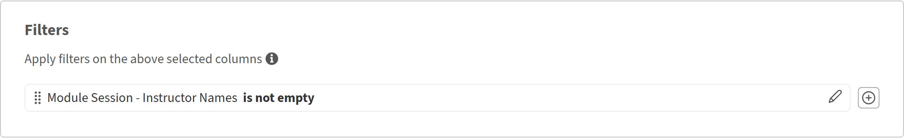

# Überprüfen der Leistung des Kursleiters mit dem Report Builder

## Übersicht

Dieser Bericht hilft Schulungsleitern zu ermitteln, welche Kursleiter am aktivsten sind, wie viele Teilnehmer sie erreichen und wie viele Teilnehmer die von ihnen bereitgestellten Kurse abschließen.

## Erstellen eines Kursleitereffizienzberichts

1. Starten Sie den Report Builder, und wählen Sie **Bericht erstellen**.
2. Geben Sie einen Namen ein, z. B. **Kursleitereffizienz**.
3. Fügen Sie **Kursleiternamen** aus dem **Modul**-Dataset hinzu.
4. Fügen Sie **Modul-ID** aus dem **Modul**-Dataset hinzu. Sie aggregieren dies, um die Sitzungen zu zählen.
5. Fügen Sie **Status** aus dem **Modultranskript**-Dataset hinzu. Sie verwenden count if, um Abschlüsse zu zählen.
6. Wählen Sie **Gruppe von** auf **Kursleiternamen**.
7. Wenden Sie **Count** auf **Modul-ID** an. Geben Sie den Alias Gesamtanzahl der Sitzungen ein.
8. Wenden Sie **Anzahl, wenn** auf **Status** an, und wählen Sie Abgeschlossen. Geben Sie den Alias &quot;**Abschlüsse insgesamt**&quot; ein.
9. Um auch Gesamtregistrierungen anzuzeigen, fügen Sie **Status** ein zweites Mal hinzu. Anwenden von **Anzahl, wenn** auf &quot;Nicht gestartet&quot;. Geben Sie den Alias Gesamtanzahl der Registrierungen ein.

   

10. Filter **Kursleiternamen** darf nicht leer sein.

    

11. Sortieren Sie nach **Abschlüsse insgesamt**, um zuerst die leistungsstärksten Kursleiter anzuzeigen.

    

12. Wählen Sie **Bericht speichern** aus, und wählen Sie **Aktionen** > **Download** aus, um den Bericht herunterzuladen.

Der heruntergeladene Bericht fasst die Effizienz der Kursleiter zusammen, indem er die Gesamtzahl der Schulungssitzungen, die abgeschlossenen Teilnehmer und die nicht begonnenen Registrierungen für jeden Kursleiter vergleicht und so dazu beiträgt, die Interaktion, die Abschlussleistung und den potenziellen Schulungsbedarf zu bewerten.

## Best Practices

* Verwenden Sie Katalogbeschriftungen, um Kursleiterberichte an eine bestimmte Geschäftseinheit, einen bestimmten Standort oder ein bestimmtes Programm zu übermitteln. Dies ist präziser als das Filtern nach dem Katalognamen allein.
* Fügen Sie einen Datumsfilter hinzu, z. B. **Registrierungsdatum** in den letzten 90 Tagen, um den Bericht auf einen letzten Zeitraum und nicht auf alle Zeitdaten zu skalieren.
* Sortieren Sie nach einer aussagekräftigen Metrik, z. B. **Abschlüsse insgesamt,**, anstatt nach Kursleiternamen, damit Leistungsunterschiede sofort sichtbar sind.
