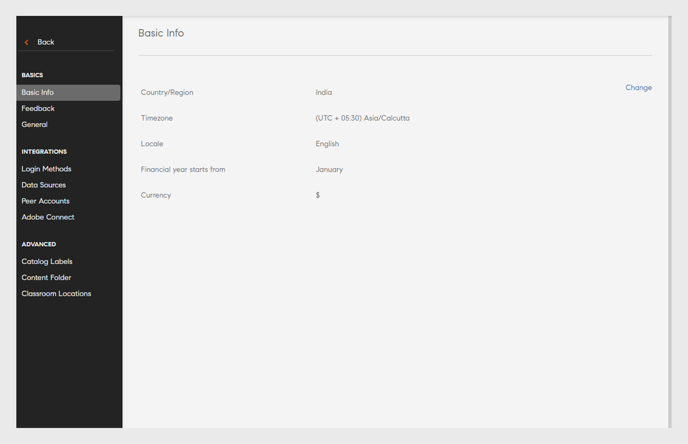

# Einstellungen

Erfahren Sie mehr über Learning Manager-Kontoeinstellungen, die Sie als Administrator konfigurieren können.

Sie können Ihre Administratorprofileinstellungen ändern und Ihre Kontoeinstellungen aktualisieren. Zeigen Sie Ihre Profilinformationen an, fügen Sie ein Profilfoto hinzu bzw. ändern Sie es, und ändern Sie den Inhalt von **[!UICONTROL Über mich]**. Aktualisieren Sie Ihre Unternehmensinformationen, richten Sie Anmeldungsmethoden für Benutzer ein und richten Sie Connect-Integration über die Kontoeinstellungen ein.

## Adobe Learning Manager konfigurieren

In dieser Schulung werden die Grundlagen der Einstellungen auf Kontoebene erfasst.

Wenn Sie die Schulung nicht starten können, schreiben Sie an <almacademy@adobe.com>.

## Kontoeinstellungen {#accountsettings}

Um die Kontoeinstellungen Ihres Unternehmens zu aktualisieren, klicken Sie auf **[!UICONTROL Einstellungen]** im linken Bereich.

**Grundlegende Informationen (Unternehmensinformationen)**

Klicken Sie auf der Seite auf **[!UICONTROL Ändern]** und bearbeiten Sie Land, Zeitzone, Gebietsschema und Geschäftsjahr.

**Konfigurieren Sie „Administrator kontaktieren“**

Wenn Sie die E-Mail-Adressen für den Support-Administrator für Ihr Unternehmen ändern oder hinzufügen möchten, können Sie diese konfigurieren, indem Sie auf **[!UICONTROL Support]** im linken Bereich klicken. Klicken Sie auf **[!UICONTROL Ändern]** neben **[!UICONTROL Support-E-Mail-ID]** und fügen Sie die E-Mail-IDs hinzu. E-Mail wird an diese Administratoren gesendet, wenn der Teilnehmer auf **[!UICONTROL Administrator kontaktieren]** am unteren Rand der Seite klickt.

Fügen Sie zusätzliche E-Mails mit Semikolon als Trennzeichen hinzu.

**Anmeldungsmethoden** - Administratoren können den Modus auswählen, über den Ihre internen oder externen Benutzer auf das Konto zugreifen können.

* **Interne Benutzer:** Für interne Benutzer können Sie Adobe ID oder Single Sign-on als Anmeldemodus festlegen.
* **Externe Benutzer:** Für externe Benutzer können Sie die Adobe ID oder die SSO oder die Lern-Manager-ID festlegen.

Wenn Sie die Lern-Manager-ID wählen, können sich externe Benutzer bei diesem Konto anmelden, nachdem sie ihren Lern-Manager-Benutzernamen und ihr Kennwort erstellt haben.

>[!NOTE]
>
>Wenn es mehrere externe Profilsätze gibt, können alle Profile einen beliebigen Login-Typ haben. Wenn der Anmeldetyp beispielsweise Adobe ID ist, können sich alle Profile nur mit der Adobe ID anmelden. Jedes Profil kann nicht seinen einzelnen Anmeldetyp haben.

Sie können mit der Adobe ID oder über einmalige Anmeldung (SSO) auf die Learning Manager-Anwendung zugreifen. Die einmalige Anmeldung (SSO) ist ein Verfahren, über das ein Benutzer einmal authentifiziert wird und mehrmals auf mehrere Anwendungen zugreifen kann. Diese Konfiguration ist für das Unternehmen nicht zwingend erforderlich. Wenn Ihr Unternehmen über einen auf SAML 2.0 basierten SSO-Anbieter verfügt, können Sie diesen für die Konfiguration der Learning Manager-Anwendung verwenden. Die Konfiguration ist auf Unternehmensebene und für die Learning Manager-Anwendung erforderlich. Wenn Sie SSO verwenden möchten, wenden Sie sich zwecks Konfigurationsanweisungen an den Support von Adobe

**Feedback**

Klicken Sie auf **[!UICONTROL Feedback]** im linken Bereich, um den Fragebogen einzurichten, um Feedback von Teilnehmern zu erhalten, nachdem Sie einen Kurs absolviert haben. Weitere Informationen zum Erstellen von L1- und L3-Feedback finden Sie im Hilfeinhalt für die [Kursfunktion ](/help/migrated/administrators/feature-summary/courses.md#add-l1-and-l3-feedback).

**Mehrere Versuche**

Wählen Sie **[!UICONTROL Einstellungen]** > **[!UICONTROL Allgemein]** > **[!UICONTROL Mehrere Versuche]**.

Wenn Sie das Kontrollkästchen &quot;Mehrere Versuche&quot; aktivieren, können die Autoren &quot;Mehrere Versuche&quot; für interaktive E-Learning-Kurse oder -Module festlegen. Wenn Sie das zweite Kontrollkästchen auswählen, können Administratoren &quot;Unendliche Versuche&quot; standardmäßig für alle neu erstellten interaktiven E-Learning-Kurse festlegen.

*Kontrollkästchen &quot;Mehrere Versuche&quot; aktivieren*

**Kursmoderation**

Klicken Sie im linken Teilfenster auf **[!UICONTROL Allgemein]** und aktivieren Sie die Funktion „Kursmoderation“. Weitere Informationen zu dieser Funktion finden Sie unter [Kursmoderation](courses.md#main-pars_header_1879001177).

**Diskussions-Dashboard**

Wenn Sie das Kontrollkästchen „Diskussions-Dashboard“ aktivieren, können Teilnehmer und Kursleiter in der Teilnehmer-App auf der Seite „Kurse“ über die Registerkarte „Diskussionen“ Kommentare für Kurse veröffentlichen. Wenn diese Funktion jedoch auf Kursebene nicht aktiviert ist, haben die Einstellungen auf Kursebene Vorrang vor Administratoreinstellungen.

**Teilnehmer-Dashboard**

Klicken Sie im linken Teilfenster auf „Teilnehmer-Dashboard“. Auf dieser Seite können Sie Widgets wählen, die auf der Teilnehmerseite angezeigt werden sollen. Wählen Sie die Widgets, die Sie auf der Teilnehmerseite aktivieren möchten. Die nicht ausgewählten Widgets werden nicht auf der Teilnehmerseite angezeigt.

**Adobe Connect**

Klicken Sie auf **[!UICONTROL Adobe Connect]** im linken Bereich, um das Adobe Connect-Konto zu konfigurieren, um virtuelle Klassenzimmersitzungen zu hosten. Weitere Informationen finden Sie in der Hilfe zur [Adobe Connect](adobeconnect-integration.md)-Funktion.

## Allgemeine Einstellungen {#general}

Aktivieren oder Deaktivieren der folgenden Einstellungen:

<table>
 <tbody>
  <tr>
   <th>
    
<b>Name</b>

    </th>
   <th>
    
<b>Beschreibung</b>

   </th>
  </tr>
  <tr>
   <td>Kurseffektivität anzeigen</td>
   <td>Wenn diese Option aktiviert ist, können Teilnehmer die aktuelle Kurseffektivität auf der Kurskachel sehen. Diese Funktion ist nur für Kurse verfügbar. Die Sternebewertung wird für Lernprogramme oder Zertifikate nicht unterstützt. Es ist für Kurse und Lernprogramme verfügbar, aber nicht für Zertifizierungen.</td>
  </tr>
  <tr>
   <td>Kursmoderation</td>
   <td>Wenn diese Option aktiviert ist, müssen alle Änderungen an Kursen vom Administrator genehmigt werden, bevor die Kurse für die Teilnehmer sichtbar sind.</td>
  </tr>
  <tr>
   <td>Diskussions-Dashboard</td>
   <td>Wenn Sie das Kontrollkästchen „Diskussions-Dashboard“ aktivieren, können Teilnehmer und Kursleiter in der Teilnehmer-App auf der Seite „Kurse“ über die Registerkarte „Diskussionen“ Kommentare für Kurse veröffentlichen. Wenn diese Funktion jedoch auf Kursebene nicht aktiviert ist, haben die Einstellungen auf Kursebene Vorrang vor Administratoreinstellungen.</td>
  </tr>
  <tr>
   <td>Mehrere Versuche</td>
   <td>Wenn aktiviert, kann der Autor mehrere Versuche für Kursmodule konfigurieren.</td>
  </tr>
  <tr>
   <td>Neue Kenntnisse entdecken</td>
   <td>Wenn diese Funktion aktiviert ist, können die Teilnehmer Peer- und Führungskenntnisse entdecken und nach eigener Wahl Kenntnisse abonnieren.</td>
  </tr>
  <tr>
   <td>Sichtbarkeit für Kenntnisse/Tags</td>
   <td>Zeigen Sie Teilnehmern alle Kenntnisse und Tags an Sie können entweder alle Kenntnisse und Tags anzeigen oder Kenntnisse und Tags, die zugewiesen sind, oder solche, die Teil der Kataloge sind, die für den Teilnehmer sichtbar sind.</td>
  </tr>
  <tr>
   <td>Eindeutige Lernobjekt-IDs</td>
   <td>Wenn aktiviert, kann ein Admin oder ein Autor eine eindeutige ID für jedes Lernobjekt hinzufügen.</td>
  </tr>
  <tr>
   <td>Filterbereiche anzeigen</td>
   <td>
    
Legen Sie fest, welche Filterfelder Benutzern in der Teilnehmer-Anwendung zur Verbesserung ihrer Suchergebnisse zur Verfügung stehen Folgende Optionen stehen zur Verfügung:

    <ul>
     <li>Kataloge</li>
     <li>Typ</li>
     <li>Format</li>
     <li>Dauer</li>
     <li>Kenntnisse</li>
     <li>Qualifikationsstufen</li>
     <li>Tags</li>
    </ul>
    
Wenn der Teilnehmer die Teilnehmer-App in den Abschnitten „Meine Lernprogramme“ und „Katalog“ startet, kann der Teilnehmer die Filter in den entsprechenden Fenstern sehen.

    
<b>Hinweis: </b>Die Filter <b>Format </b>und <b>Dauer </b>werden standardmäßig deaktiviert und den Teilnehmern nicht unmittelbar nach der Veröffentlichung angezeigt. Der Administrator sollte sie aktivieren.  
</td>
  </tr>
  <tr>
   <td>Katalogliste anzeigen</td>
   <td>Wenn diese Option aktiviert ist, können die Teilnehmer eine Liste aller für sie verfügbaren Kataloge anzeigen. Die Teilnehmer können dies verwenden, um die Anzeige der Lernobjekte zu verfeinern.</td>
  </tr>
  <tr>
   <td>Produktterminologie</td>
   <td>Learning Manager verfügt über eine Standardterminologie, die im gesamten Produkt verwendet wird. Passen Sie die Terminologie an die Anforderungen Ihrer Organisation an.</td>
  </tr>
  <tr>
   <td>Modulversions-Update</td>
   <td>Konfigurieren Sie die Standardeinstellung zum Aktualisieren von Inhalten. Die Einstellungen können für jeden Inhalt auf der Kursseite geändert werden.</td>
  </tr>
  <tr>
   <td>Benutzer automatisch registrieren</td>
   <td>Wenn aktiviert, werden neu importierte Benutzer automatisch registriert. Standardmäßig müssen Benutzer manuell registriert werden, bevor sie Learning Manager verwenden können.</td>
  </tr>
  <tr>
   <td>Interne Benutzer automatisch löschen</td>
   <td>Wenn diese Option aktiviert ist, werden interne Benutzer automatisch gelöscht, wenn sie für eine bestimmte Anzahl von Tagen nicht auf das System zugreifen. Diese Funktion gilt für Benutzer, die nur die Rolle <b>Teilnehmer</b> haben. Um den Zugriff wiederherzustellen, müssen Benutzer sich an den Administrator wenden. </td>
  </tr>
  <tr>
   <td>Katalogbeschriftungen anzeigen</td>
   <td>Wenn diese Option aktiviert ist, können Administratoren und Autoren Katalogbeschriftungen und Werte festlegen und sie mit Lernobjekten verknüpfen.</td>
  </tr>
  <tr>
   <td>Teilnehmer können ihre Punktzahl anzeigen</td>
   <td>Wenn diese Option aktiviert ist, können die Teilnehmer ihre Ergebnisse in der Lernendenabschrift einsehen.</td>
  </tr>
  <tr>
   <td>Auswahl-E-Mail</td>
   <td>
    
Ein Administrator kann das Senden einer E-Mail an Teilnehmer aktivieren oder deaktivieren. Der Administrator kann auch die Häufigkeit der gesendeten E-Mails steuern.

    <ul>
     <li>Bei <b>aktiven Konten</b> sind Auswahl-E-Mails standardmäßig deaktiviert, sodass sie vom Administrator manuell aktiviert werden können.</li>
     <li>Bei <b>Testkonten</b> bleibt die Option für Auswahl-E-Mails deaktiviert und der Administrator kann die Option nicht aktivieren.</li>
    </ul>
    
Wenn die Funktion deaktiviert ist, gilt:

    <ul>
     <li>Die Option <b>Auswahl-E-Mail</b> wird deaktiviert.</li>
     <li>Ein Teilnehmer kann die Benutzereinstellung für das Auswahl-E-Mail-Abonnement nicht sehen.</li>
    </ul>
    
 Wenn die Funktion aktiviert ist, gilt:

    <ul>
     <li>Der Administrator kann die Option „Auswahl-E-Mail“ aktivieren und ändern.</li>
     <li>Über die <b>Profileinstellungen </b>in der Teilnehmer-App kann ein Teilnehmer (nicht in der DND-Liste) die Auswahl-E-Mail abonnieren/abbestellen.</li>
    </ul></td>
  </tr>
  <tr>
   <td>Symbole der Schulungskarte aktivieren </td>
   <td>Sofern aktiviert, werden Symbole auf Schulungskarten in der Teilnehmer-App angezeigt. </td>
  </tr>
  <tr>
   <td>Links für Fußzeile</td>
   <td>
    
Fügen Sie Links oder E-Mail-IDs hinzu, die als Fußzeilen angezeigt werden. Sie können maximal drei Fußzeilenlinks hinzufügen.

    
Führen Sie die folgenden Schritte aus, um die Links in der Fußzeile anzupassen:

    <ol>
     <li>Klicken Sie auf <b>Mehr hinzufügen</b>, geben Sie den Namen und die URL oder E-Mail-ID in die angegebenen Felder ein. Stellen Sie der URL http:// oder https:// voran.</li>
     <li>Klicken Sie auf <b>Replizieren</b>, um die Änderung in alle Ländereinstellungen zu übertragen. Dies stellt sicher, dass alle Sprachen den Namen und die URL erhalten.</li>
     <li>Um die Änderungen zu speichern, klicken Sie auf <b>Speichern</b>. Sie können eine Popup-Nachricht sehen, die die Änderung bestätigt. Nachdem Sie auf „OK“ geklickt haben, wird die Fußzeile mit den neu hinzugefügten Links gefüllt.</li>
    </ol>
    
Zusätzlich können Sie:

    <ul>
     <li>Klicken Sie auf das Symbol <b>Zurücksetzen</b>, um die Standardwerte in den Feldern <b>Hilfe</b> und <b>Administrator kontaktieren</b> zurückzusetzen.</li>
     <li>Passen Sie den Link in der Fußzeile für alle Sprachen an. Klicken Sie auf die Dropdown-Liste <b>Sprache</b>, wählen Sie die Sprache aus und fügen Sie den <b>Namen</b> und die <b>URL</b> in die angegebenen Felder ein. Nachdem Sie die Änderungen gespeichert haben, werden die aktualisierten Links in der Fußzeile angezeigt. </li>
    </ul></td>
  </tr>
  <tr>
   <td>Berichtszeitzone </td>
   <td>
    
Legen Sie eine Voreinstellung auf Kontoebene fest, um das Lerntranskript in die folgenden Zeitzonen zu exportieren:

    <ul>
     <li>UTC (Standardverhalten)</li>
     <li>Zeitzonenvoreinstellung auf Kontoebene</li>
    </ul>
    
Das mit der Jobs-API heruntergeladene Teilnehmertranskript lädt die Daten auch in die ausgewählte Zeitzone herunter.

    
<b>Hinweis: </b>Es wird unmittelbar nach der Veröffentlichung standardmäßig keine Änderung im Teilnehmertranskript erwartet. Administratoren können diese Einstellung über "Administrator &gt; Einstellungen &gt; Allgemein &gt; Berichtszeitzone" konfigurieren.
</td>
  </tr>
 </tbody>
</table>

<table border="0" cellpadding="0" cellspacing="0" width="1709">
 <tbody>
  <tr>
   <td height="20" width="147">Name</td>
   <td>Beschreibung</td>
  </tr>
  <tr>
   <td height="20">Kurseffektivität anzeigen</td>
   <td>Teilnehmer können aktuelle Kurseffizienz im Kurstitel sehen, wenn die Option aktiviert ist.</td>
  </tr>
  <tr>
   <td height="20">Kursmoderation</td>
   <td>Wenn diese Option aktiviert ist, müssen alle Änderungen an Kursen vom Administrator genehmigt werden, bevor die Kurse für die Teilnehmer sichtbar sind.</td>
  </tr>
  <tr>
   <td height="20">Diskussions-Dashboard</td>
   <td>Wenn Sie das Kontrollkästchen „Diskussions-Dashboard“ aktivieren, können Teilnehmer und Kursleiter in der Teilnehmer-App auf der Seite „Kurse“ über die Registerkarte „Diskussionen“ Kommentare für Kurse veröffentlichen. Wenn diese Funktion jedoch auf Kursebene nicht aktiviert ist, haben die Einstellungen auf Kursebene Vorrang vor Administratoreinstellungen.</td>
  </tr>
  <tr>
   <td height="20">Mehrere Versuche</td>
   <td>Wenn aktiviert, kann der Autor mehrere Versuche für Kursmodule konfigurieren.</td>
  </tr>
  <tr>
   <td height="20">Neue Kenntnisse entdecken</td>
   <td>Wenn diese Funktion aktiviert ist, können die Teilnehmer Peer- und Führungskenntnisse entdecken und nach eigener Wahl Kenntnisse abonnieren.</td>
  </tr>
  <tr>
   <td height="20">Sichtbarkeit für Kenntnisse/Tags</td>
   <td>Zeigen Sie Teilnehmern alle Kenntnisse und Tags an Sie können entweder alle Kenntnisse und Tags anzeigen oder Kenntnisse und Tags, die zugewiesen sind, oder solche, die Teil der Kataloge sind, die für den Teilnehmer sichtbar sind.</td>
  </tr>
  <tr>
   <td height="20">Eindeutige Lernobjekt-IDs</td>
   <td>Wenn aktiviert, kann ein Admin oder ein Autor eine eindeutige ID für jedes Lernobjekt hinzufügen.</td>
  </tr>
  <tr>
   <td rowspan="10" height="191">Filterbereiche anzeigen</td>
   <td>Legen Sie fest, welche Filterfelder Benutzern in der Teilnehmer-Anwendung zur Verbesserung ihrer Suchergebnisse zur Verfügung stehen Folgende Optionen stehen zur Verfügung:</td>
  </tr>
  <tr>
   <td height="19">Kataloge</td>
  </tr>
  <tr>
   <td height="19">Typ</td>
  </tr>
  <tr>
   <td height="19">Format</td>
  </tr>
  <tr>
   <td height="19">Dauer</td>
  </tr>
  <tr>
   <td height="19">Kenntnisse</td>
  </tr>
  <tr>
   <td height="19">Qualifikationsstufen</td>
  </tr>
  <tr>
   <td height="19">Tags</td>
  </tr>
  <tr>
   <td height="19">Wenn der Teilnehmer die Teilnehmer-App in den Abschnitten „Meine Lernprogramme“ und „Katalog“ startet, kann der Teilnehmer die Filter in den entsprechenden Fenstern sehen.</td>
  </tr>
  <tr>
   <td height="20">Hinweis: Die Filter Format und Dauer werden standardmäßig deaktiviert und den Teilnehmern nicht unmittelbar nach der Veröffentlichung angezeigt. Der Administrator sollte sie aktivieren. </td>
  </tr>
  <tr>
   <td height="20">Katalogliste anzeigen</td>
   <td>Wenn diese Option aktiviert ist, können die Teilnehmer eine Liste aller für sie verfügbaren Kataloge anzeigen. Die Teilnehmer können dies verwenden, um die Anzeige der Lernobjekte zu verfeinern.</td>
  </tr>
  <tr>
   <td height="20">Produktterminologie</td>
   <td>Learning Manager verfügt über eine Standardterminologie, die im gesamten Produkt verwendet wird. Passen Sie die Terminologie an die Anforderungen Ihrer Organisation an.</td>
  </tr>
  <tr>
   <td height="20">Modulversions-Update</td>
   <td>Konfigurieren Sie die Standardeinstellung zum Aktualisieren von Inhalten. Die Einstellungen können für jeden Inhalt auf der Kursseite geändert werden.</td>
  </tr>
  <tr>
   <td height="20">Benutzer automatisch registrieren</td>
   <td>Wenn aktiviert, werden neu importierte Benutzer automatisch registriert. Standardmäßig müssen Benutzer manuell registriert werden, bevor sie Learning Manager verwenden können.</td>
  </tr>
  <tr>
   <td height="20">Interne Benutzer automatisch löschen</td>
   <td>Wenn diese Option aktiviert ist, werden interne Benutzer automatisch gelöscht, wenn sie für eine bestimmte Anzahl von Tagen nicht auf das System zugreifen. Diese Funktion gilt für Benutzer, die nur die Rolle Teilnehmer haben. Um den Zugriff wiederherzustellen, müssen Benutzer sich an den Administrator wenden.</td>
  </tr>
  <tr>
   <td height="20">Katalogbeschriftungen anzeigen</td>
   <td>Wenn diese Option aktiviert ist, können Administratoren und Autoren Katalogbeschriftungen und Werte festlegen und sie mit Lernobjekten verknüpfen.</td>
  </tr>
  <tr>
   <td height="20">Teilnehmer können ihre Punktzahl anzeigen</td>
   <td>Wenn diese Option aktiviert ist, können die Teilnehmer ihre Ergebnisse in der Lernendenabschrift einsehen.</td>
  </tr>
  <tr>
   <td rowspan="9" height="172">Auswahl-E-Mail</td>
   <td>Ein Administrator kann das Senden einer E-Mail an Teilnehmer aktivieren oder deaktivieren. Der Administrator kann auch die Häufigkeit der gesendeten E-Mails steuern.</td>
  </tr>
  <tr>
   <td height="19">Bei aktiven Konten sind Auswahl-E-Mails standardmäßig deaktiviert, sodass sie vom Administrator manuell aktiviert werden können.</td>
  </tr>
  <tr>
   <td height="19">Bei Testkonten bleibt die Option für Auswahl-E-Mails deaktiviert und der Administrator kann die Option nicht aktivieren.</td>
  </tr>
  <tr>
   <td height="19">Wenn die Funktion deaktiviert ist, gilt:</td>
  </tr>
  <tr>
   <td height="19">Die Option Auswahl-E-Mail wird deaktiviert.</td>
  </tr>
  <tr>
   <td height="19">Ein Teilnehmer kann die Benutzereinstellung für das Auswahl-E-Mail-Abonnement nicht sehen.</td>
  </tr>
  <tr>
   <td height="19"> Wenn die Funktion aktiviert ist, gilt:</td>
  </tr>
  <tr>
   <td height="19">Der Administrator kann die Option „Auswahl-E-Mail“ aktivieren und ändern.</td>
  </tr>
  <tr>
   <td height="20">Über die Profileinstellungen in der Teilnehmer-App kann ein Teilnehmer (nicht in der DND-Liste) die Auswahl-E-Mail abonnieren/abbestellen.</td>
  </tr>
  <tr>
   <td height="20">Symbole der Schulungskarte aktivieren</td>
   <td>Sofern aktiviert, werden Symbole auf Schulungskarten in der Teilnehmer-App angezeigt.</td>
  </tr>
  <tr>
   <td rowspan="8" height="153">Links für Fußzeile</td>
   <td>Fügen Sie Links oder E-Mail-IDs hinzu, die als Fußzeilen angezeigt werden. Sie können maximal drei Fußzeilenlinks hinzufügen.</td>
  </tr>
  <tr>
   <td height="19">Führen Sie die folgenden Schritte aus, um die Links in der Fußzeile anzupassen:</td>
  </tr>
  <tr>
   <td height="19">1. Klicken Sie auf Mehr hinzufügen, geben Sie den Namen und die URL oder E-Mail-ID in die angegebenen Felder ein. Stellen Sie der URL http:// oder https:// voran.</td>
  </tr>
  <tr>
   <td height="19">2. Klicken Sie auf "Replizieren", um die Änderung in alle Ländereinstellungen zu übertragen. Dies stellt sicher, dass alle Sprachen den Namen und die URL erhalten.</td>
  </tr>
  <tr>
   <td height="19">3. Um die Änderungen zu speichern, klicken Sie auf "Speichern". Sie können eine Popup-Nachricht sehen, die die Änderung bestätigt. Nachdem Sie auf „OK“ geklickt haben, wird die Fußzeile mit den neu hinzugefügten Links gefüllt.</td>
  </tr>
  <tr>
   <td height="19">Zusätzlich können Sie:</td>
  </tr>
  <tr>
   <td height="19">Klicken Sie auf das Symbol Zurücksetzen , um die Standardwerte in den Feldern Hilfe und Administrator kontaktieren zurückzusetzen.</td>
  </tr>
  <tr>
   <td height="20">Passen Sie den Link in der Fußzeile für alle Sprachen an. Klicken Sie auf die Dropdown-Liste Sprache , wählen Sie die Sprache aus und fügen Sie den Namen und die URL in die angegebenen Felder ein. Nachdem Sie die Änderungen gespeichert haben, werden die aktualisierten Links in der Fußzeile angezeigt.</td>
  </tr>
  <tr>
   <td rowspan="5" height="96">Berichtszeitzone</td>
   <td> Legen Sie eine Voreinstellung auf Kontoebene fest, um das Lerntranskript in die folgenden Zeitzonen zu exportieren:</td>
  </tr>
  <tr>
   <td height="19">UTC (Standardverhalten)</td>
  </tr>
  <tr>
   <td height="19">Zeitzonenvoreinstellung auf Kontoebene</td>
  </tr>
  <tr>
   <td height="19">Das mit der Jobs-API heruntergeladene Teilnehmertranskript lädt die Daten auch in die ausgewählte Zeitzone herunter.</td>
  </tr>
  <tr>
   <td height="20">Hinweis: Es wird unmittelbar nach der Veröffentlichung standardmäßig keine Änderung im Teilnehmertranskript erwartet. Administratoren können diese Einstellung über "Administrator &gt; Einstellungen &gt; Allgemein &gt; Berichtszeitzone" konfigurieren.</td>
  </tr>
  <tr>
   <td height="19">Badgr-Integration</td>
   <td>Wenn diese Option aktiviert ist, können die Teilnehmer ihre Abzeichen auf die Badgr-Website hochladen. In Kundenschulungsszenarien möchten Unternehmen ihre Kunden „zertifizieren“ und ihnen die Möglichkeit geben, diese Anmeldedaten über soziale Netzwerke anzuzeigen. Dies motiviert den Teilnehmer, eine Schulung zu absolvieren und seine Leistungen mit anderen zu teilen. </td>
  </tr>
  <tr>
   <td height="135">
    
Bewertung anzeigen
</td>
   <td>
    <ul>
     <li>Wenn die Option <b>Kurseffektivität</b> aktiviert ist, können Teilnehmer nur den Wert der Kurseffektivität sehen.</li>
     <li>Wenn die Option <b>Bewertungssterne</b> aktiviert ist, können Teilnehmer nur die durchschnittliche Sternebewertung sehen sowie die Anzahl der Teilnehmer, die den Kurs bewertet haben. </li>
    </ul>
    
Diese Funktion ist nur für Kurse verfügbar. Die Sternebewertung wird für Lernprogramme oder Zertifikate nicht unterstützt.  <b>Hinweis: </b>Diese Änderung betrifft nur die Teilnehmer-App. 

    
In allen anderen Apps (Admin, Autor, Manager, benutzerdefinierter Administrator, benutzerdefinierter Autor) haben Änderungen an den Einstellungen (Sternebewertung/Kurseffektivität/Deaktivierung der Bewertungsanzeige) keine Auswirkungen. 

    
Für neue Konten ist im Abschnitt <b>Bewertungen anzeigen</b> die Option <b>Sternebewertung</b> standardmäßig aktiviert.

    
Wenn für vorhandene Konten zuvor die Option <b>Kurseffektivität</b> aktiviert war, wird der Abschnitt <b>Bewertungen anzeigen</b> mit der Option "Kurseffektivität" aktiviert. Wenn die Option <b>Kurseffektivität</b>s deaktiviert ist, wird der Abschnitt <b>Bewertungen anzeigen</b> ebenfalls deaktiviert. Wenn der Abschnitt <b>Bewertungen anzeigen</b> aktiviert ist, wird die Option <b>Sternebewertung</b> standardmäßig aktiviert.
</td>
  </tr>
  <tr>
   <td height="19">Einstellen</td>
   <td>Wählen Sie eine der folgenden Optionen zum Einstellen:<li>Nach dem Einstellen können registrierte Teilnehmer Aktionen anzeigen und ausführen, aber die noch nicht registrierten Teilnehmer verlieren den Zugriff.</li><li>Sobald Teilnehmer eingestellt werden, verlieren sowohl die registrierten als auch die noch nicht registrierten Teilnehmer den Zugriff.</li>
<b>Hinweis:</b> Sie können Kurse, Lernpfade oder Zertifizierungen auf ihren Übersichtsseiten einstellen.
 </td>
  </tr>
 </tbody>
</table>

<table>
 <tbody>
  <tr>
   <td>
    
Lernpläne
</td>
   <td>
    
Wenn die Option <b>Erweiterte Funktionen des Lernplans aktivieren</b> aktiviert ist, können Administratoren Lernpläne in andere Lernpläne aufnehmen und diese Lernpläne mit Kursen kombinieren. Die Aktivierung dieser Option kann nicht rückgängig gemacht werden. 
</td>
  </tr>
  <tr>
   <td>
    
Kursleiterverwaltung 
</td>
   <td>
    
Aktivieren Sie diese Einstellung, um die Liste der Kursleiter einzuschränken, die beim Erstellen von Sitzungen für Klassenzimmer/virtuelle Klassenzimmer ausgewählt werden können. Alle Benutzer mit Kursleiterberechtigung können einer beliebigen Sitzung nur als Kursleiter zugewiesen werden. Diese Einschränkung gilt nicht für Migrationsarbeitsabläufe. 

  </td>
  <tr>
    <td>
      
Import von Kenntnissen

    </td>
    <td>
      
Wenn diese Option aktiviert ist, können Sie eine externe Quelle auswählen, um Kenntnisse zu importieren. Die Kenntnisse für vorhandene Lernressourcen werden während der ersten Ausführung einmal in das Kompetenz-Repository importiert. Bei allen nachfolgenden Importen von Lernressourcen werden die Kenntnisse nur für neu importierte Elemente in das Kenntnisrepository importiert.
      Sobald die Option aktiviert ist, kann die Aktion nicht mehr rückgängig gemacht werden. Sie können später nicht deaktivieren oder zu einer anderen Quelle wechseln.
      

    </td>
  </tr>
  </tr>
 </tbody>
</table>

>[!NOTE]
>
>Sobald die Einstellung für den Kenntnisimport aktiviert ist, kann das Kontolayout nicht mehr in die klassische Ansicht umgeschaltet werden, d. h. das Umschalten auf das klassische Konto ist deaktiviert, nachdem die Option **Kenntnisse importieren** aktiviert wurde.

## Umbenennung von Lernobjekten {#renaminglearningobjects}

Diese Funktion ist nur in englischer Sprache verfügbar.

Administratoren können jetzt in Learning Manager Lernobjekte umbenennen. Die folgenden Begriffe können umbenannt werden.

Modul\
Kurs\
Lernprogramm\
Zertifizierung\
Lernplan\
Arbeitshilfe\
Katalog\
Kenntnisse\
Abzeichen\
Ankündigung\
Eigenes Lernen\
Leaderboard\
Effektivität\
Voraussetzung\
Vorbereitung\
Grundlegender Inhalt\
Testout\
Selbststudium\
Gemischt\
Klassenzimmer\
Virtuelles Klassenzimmer\
Aktivität

## Profileinstellungen {#profilesettings}

1. Klicken Sie in der rechten oberen Ecke neben Ihrem Foto/Konto auf den Dropdownpfeil und wählen Sie **[!UICONTROL Profileinstellungen]** aus.
1. Im Popup-Dialogfeld können Sie ein Foto hinzufügen/ändern, indem Sie mit der Maus darauf zeigen und im Bereich &quot;Profilfoto&quot; auf **[!UICONTROL Bearbeiten]** klicken.
1. Fügen Sie **[!UICONTROL Über]** Inhalt hinzu/ändern Sie ihn, indem Sie auf **[!UICONTROL Bearbeiten]** daneben klicken.
1. Klicken Sie auf **[!UICONTROL Speichern].**.

## Inhaltsordner {#content-folder}

Learning Manager unterstützt Ordner für private Inhalte. Ein Administrator kann Ordner für private Inhalte konfigurieren und über benutzerdefinierte Rollen bestimmten benutzerdefinierten Autoren Zugriff darauf gewähren. Beachten Sie, dass Standardautoren (auch als Vollautoren bezeichnet) weiterhin Zugriff auf alle Inhalte im Konto haben. Somit haben Vollautoren Zugriff auf alle Ordner und alle Inhalte.

Inhaltsordner können von Administratoren konfiguriert werden. Erst nach der Konfiguration werden Inhaltsordner für Autoren sichtbar und sie erhalten die Möglichkeit, den Inhalt in einem oder mehreren Ordnern zu platzieren.

Um einen Inhaltsordner hinzuzufügen, klicken Sie in der Administrator-App auf **[!UICONTROL Einstellungen]** > **[!UICONTROL Inhaltsordner]**.

*Inhaltsordnereinstellungen ändern*

### Ordner

Ein Ordner ist ein Repository mit Inhalten, die einer Teilmenge der gesamten Inhaltsbibliothek in einem Konto entsprechen, und verfügt über die folgenden Eigenschaften:

* Nur ein Administrator kann einen Ordner erstellen, bearbeiten oder löschen.
* Ein Administrator kann den Zugriff auf Ordner steuern, indem er Rollen nur für benutzerdefinierte Administratoren definiert.
* Der Inhalt **muss jederzeit mit mindestens einem Ordner verknüpft sein**. Zunächst werden alle Inhalte mit dem öffentlichen Ordner verknüpft, was später geändert werden kann.
* Der Inhalt kann zum Zeitpunkt der Erstellung mit mehreren Ordnern verknüpft werden, was auch durch einen Kopiervorgang möglich ist.
* Alle Ordnernamen müssen innerhalb des Kontos eindeutig sein, da andernfalls ein Fehler beim Benennen eines Ordners auftritt.

Ordner steuern nur die Sichtbarkeit von Inhalten und erstellen keine Kopien von Inhalten. Daher wird die Bearbeitung des Inhalts in allen zugehörigen Ordnern widergespiegelt.

### Öffentlicher Ordner

Jedes Konto enthält einen öffentlichen Ordner. Anfänglich befinden sich alle Inhalte in diesem Ordner. Später können Autoren Inhalte aus diesem Ordner in andere Ordner verschieben. Ein öffentlicher Ordner verfügt über die folgenden Eigenschaften:

* Alle Inhalte, die mit diesem Ordner verknüpft sind, sind standardmäßig für alle Arten von Autoren verfügbar.
* Inhalte, die Teil eines öffentlichen Ordners sind, können nicht Teil eines anderen Ordners sein. Das Gleiche gilt auch umgekehrt.

Dieser Ordner kann nicht Teil einer konfigurierbaren Rollendefinition sein. Wenn also ein öffentlicher Ordner nicht in einer konfigurierbaren Rollendefinition enthalten ist, wird der Zugriff auf den öffentlichen Ordner nicht eingeschränkt.

### Privater Ordner

* Jeder von einem Administrator erstellte Ordner ist ein privater Ordner.

### Ordnervorgänge

**Ordner hinzufügen**

Um einen Ordner hinzuzufügen, klicken Sie in der oberen rechten Ecke des Fensters auf **[!UICONTROL Hinzufügen]**.

**Ordner löschen**

Sie können auch einen Ordner löschen. Wählen Sie den zu löschenden Ordner aus, klicken Sie auf das Menü &quot;Aktionen&quot;, und klicken Sie auf **[!UICONTROL Ordner löschen]**.

>[!NOTE]
>
>Ordner können gelöscht werden, wenn der gesamte zugehörige Inhalt auch mit anderen Ordnern verknüpft ist. Wenn Inhalte vorhanden sind, die nur mit dem zu löschenden Ordner verknüpft sind, verschieben Sie zunächst den Inhalt in einen anderen Ordner und löschen Sie dann den Ordner.

## Standorte für Klassenzimmer

Administrator(inn)en können diese Einstellung verwenden, um eine Bibliothek mit Standorten für Klassenzimmer zu erstellen und zu konfigurieren. Autor(inn)en können einen vorkonfigurierten Standort auswählen, um ihr Klassenzimmerereignis einzurichten. Wählen Sie einen Speicherort aus der Bibliothek aus, um die Standortinformationen, die URL und die Lizenzbeschränkung automatisch auszufüllen.

Als Administrator(in) haben Sie folgende Möglichkeiten:

### Speicherorte in CSV importieren

Fügen Sie Ihrem Konto Standorte hinzu, indem Sie eine CSV-Datei mit Standorten importieren. Die CSV-Datei muss die Spalte „City“ enthalten.

### Standort hinzufügen

Fügen Sie Folgendes hinzu:

1. Name des Speicherorts: Geben Sie den Namen des Klassenzimmers ein.
2. Standortinformationen: Geben Sie die Informationen zum Standort ein.
3. Region: Der eingegebene Wert wird als Filter &quot;Schulungsstandorte&quot; für Teilnehmer angezeigt.
4. URL des Speicherorts: Geben Sie die URL des Speicherorts ein.
5. Sitzplatzbeschränkung: Geben Sie die Sitzplatzkapazität des Raumes ein.

*Klassenzimmerspeicherorte hinzufügen*

Sie können den Speicherort auch mithilfe einer CSV-Datei hinzufügen. Die CSV-Datei muss die folgenden Felder enthalten:

* name
* info
* url
* seatlimit
* Region

<!---->

### Einstellungen {#admin-classroom-settings}

Wählen Sie **Bearbeiten**, um Folgendes zu ändern:

* **Autoren das Erstellen von Speicherorten erlauben**: Nach der Aktivierung werden alle von Autoren erstellten Speicherorte auf der Registerkarte &quot;Alle Speicherorte&quot; aufgeführt. Teilnehmer sehen diese Speicherorte auch unter Katalog- und Kalenderfilter.
* **Autoren erlauben, Speicherorte zu ändern und zu löschen**:
Nach der Aktivierung können Autoren alle Speicherorte in Klassenzimmern ändern und löschen. Die Änderungen durch Autoren werden in der gesamten Plattform widergespiegelt, einschließlich Berichten.

## Häufig gestellte Fragen {#frequentlyaskedquestions}

+++Wie kann ich unterschiedliche Ordner für die Inhaltsbibliothek erstellen?

Klicken Sie auf **[!UICONTROL Einstellungen]** > **[!UICONTROL Inhaltsordner]**. Um einen Ordner hinzuzufügen, klicken Sie in der oberen rechten Ecke auf **[!UICONTROL Hinzufügen]** und geben Sie im Dialogfeld den Namen und die Beschreibung des Ordners ein.

Inhaltsordner können von Administratoren konfiguriert werden. Erst nach der Konfiguration werden Inhaltsordner für Autoren sichtbar und sie erhalten die Möglichkeit, den Inhalt in einem oder mehreren Ordnern zu platzieren.

Weitere Informationen finden Sie im Abschnitt [Inhaltsordner](settings.md#content-folder).
+++

+++Wie kann ich das Geschäftsjahr für das Konto hinzufügen?

Klicken Sie in **[!UICONTROL Einstellungen]** > **[!UICONTROL Grundlegende Informationen]** auf **[!UICONTROL Ändern]**. Wählen Sie in der Dropdownliste **[!UICONTROL Geschäftsjahr beginnt mit]** den Monat aus.
+++
