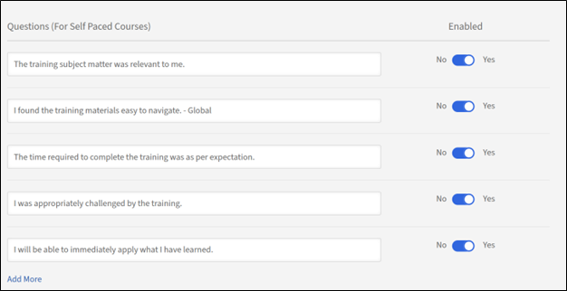

# Grundeinstellungen in Adobe Learning Manager

## Übersicht

Der Abschnitt &quot;Grundlegende Informationen&quot; dient als Grundlage für Ihre Adobe Learning Manager-Einrichtung und enthält die wichtigsten Unternehmensparameter, die definieren, wie Ihre Lernplattform über verschiedene Regionen, Sprachen und Geschäftskontexte hinweg funktioniert.

## Wichtigste Vorteile

* Bietet regionsspezifische Inhaltsbereitstellung und Benutzererfahrung.
* Standardisiert Zeitanzeigen, Datumsformate und Währungsdarstellungen.
* Ermöglicht automatische Anpassungen der Sommerzeit für ausgewählte Zeitzonen.
* Reduziert die Notwendigkeit manueller Anpassungen auf der gesamten Plattform.

## Grundlegende Einstellungen konfigurieren

### Zugriff auf grundlegende Informationseinstellungen

1. Melden Sie sich bei Adobe Learning Manager als Administrator an.
2. Wählen Sie in der linken Navigationsleiste **[!UICONTROL Einstellungen]** aus.

   

3. Wählen Sie in der Kategorie **[!UICONTROL Grundlagen]** die Option **[!UICONTROL Grundlegende Informationen]**.

   

4. Wählen Sie **[!UICONTROL Ändern]** aus, um die grundlegenden Einstellungen zu ändern.

### Grundlegende Einstellungen ändern

**Land/Region**

In der Dropdownliste &quot;Land/Region&quot; in den Administratoreinstellungen von Adobe Learning Manager können Sie das Land oder die Region angeben, das bzw. die mit der Organisation verknüpft ist. Diese Einstellung wird für Lokalisierungszwecke verwendet, um sicherzustellen, dass die Plattform regionalen Präferenzen, Compliance-Anforderungen und Zeitzonen entspricht.

**Zeitzone**

Mit der Dropdown-Liste Zeitzone können Sie die Standardzeitzone für die Plattform definieren. Dadurch wird sichergestellt, dass alle zeitabhängigen Aktivitäten, wie Kurstermine, Fristen und Berichte, genau auf die Ortszeit der Organisation oder der Teilnehmer abgestimmt sind.

**Gebietsschema**

Gebietsschema bezieht sich auf die Sprach- und Ländereinstellungen für das Konto. Mit der Dropdown-Liste &quot;Gebietsschema&quot; können Administratoren die Sprache konfigurieren, in der die Benutzeroberfläche und der Inhalt der Plattform für Benutzer angezeigt werden. Diese Option stellt sicher, dass Teilnehmer und Administratoren mit der Plattform in ihrer bevorzugten Sprache interagieren können.

**Geschäftsjahr beginnt ab**

Mit dieser Option können Sie den Startmonat für das Geschäftsjahr Ihrer Organisation definieren. Wenn das Geschäftsjahr Ihrer Organisation beispielsweise im Dezember beginnt, können Sie diese Option auf Dezember festlegen. Die Berichte und Analysen werden dann mit diesem Finanzzeitraum in Einklang gebracht.

**Währung**

Mit der Option Währung können Sie die Standardwährung für das Konto definieren. Diese Währung wird für die Preisgestaltung von Lernobjekten wie Kursen, Lernpfaden und Zertifizierungen verwendet. Wenn Ihre Organisation beispielsweise in den Vereinigten Staaten tätig ist, können Sie die Währung auf USD ($) festlegen. Entsprechend können Sie für Operationen in Europa EUR (€) auswählen.

### Feedbackeinstellungen ändern

Die Feedbackeinstellungen in Adobe Learning Manager bieten Administratoren Tools zum Sammeln und Verwalten von Feedback von Teilnehmern (L1) und Managern (L3). Diese Einstellungen stellen sicher, dass Kurse und Lernziele effektiv ausgewertet werden, was eine kontinuierliche Verbesserung ermöglicht.

Bevor Sie wertvolle Einblicke von Ihren Teilnehmern sammeln können, müssen Sie die L1-Feedback-Funktion aktivieren und ihre Parameter festlegen. In diesem ersten Schritt navigieren Sie zum Bereich &quot;Feedbackeinstellungen&quot; und aktivieren die Funktion für alle neuen Kurse sowie die primäre Sprache für Ihre Feedbackformulare.

### L1-Feedback aktivieren

Suchen Sie auf der Registerkarte L1-Feedback den Umschalter L1-Feedback für neu erstellten Kurs- und Lernpfad aktivieren. Wählen Sie den Schalter aus, um ihn einzuschalten. Dies beinhaltet automatisch ein L1-Feedback-Formular für alle neuen Kurse, die Sie erstellen.

**Auswählen einer Standardsprache**

Verwenden Sie das Dropdown-Menü Sprache , um die Standardsprache für Ihre Feedbackformulare auszuwählen. Dadurch wird sichergestellt, dass die Fragen den Teilnehmern in der richtigen Sprache angezeigt werden.

**Fragebögen für verschiedene Kurstypen konfigurieren**

Mit Adobe Learning Manager können Sie die Fragen basierend darauf anpassen, ob es sich bei Ihrem Kurs um ein Modul zum Selbststudium oder eine Präsenzsitzung handelt. Dadurch wird sichergestellt, dass das Feedback, das Sie erhalten, spezifisch und relevant ist. In diesem Schritt wählen Sie die Fragen für Kurse zum Selbststudium und Klassenzimmerkurse aus und passen sie an, um die aussagekräftigsten Daten zu sammeln.

**Für Kurse zum Selbststudium**:

* **Obligatorische Frage**: Der Fragebogen enthält eine obligatorische Frage: &quot;Wie wahrscheinlich ist es, dass Sie diesen Kurs einem Kollegen empfehlen?&quot; Dies ist eine standardmäßige Net Promoter Score (NPS) Frage, die eine Schlüsselmetrik für die allgemeine Kurszufriedenheit bietet.
* **Fragen anpassen**: Überprüfen Sie die Liste der bereitgestellten Fragen. Wenn Sie eine Frage in das Feedbackformular einfügen möchten, stellen Sie sicher, dass der daneben befindliche Umschalter auf Ja eingestellt ist. Um eine Frage zu entfernen, wechseln Sie zu Nein.
* **Benutzerdefinierte Fragen hinzufügen**: Wenn Sie zusätzliche Fragen zu Ihrem Inhalt zum Selbststudium haben, wählen Sie den Link Weitere hinzufügen aus, um neue benutzerdefinierte Anweisungen zu erstellen und dem Fragebogen hinzuzufügen.

**Für Klassenzimmerkurse**:

* **Fragen anpassen**: Überprüfen Sie die Liste der Fragen, die für Schulungen im Klassenzimmer zugeschnitten sind. Stellen Sie den Schalter neben jeder Frage auf &quot;Ja&quot;, um sie einzuschließen, bzw. auf &quot;Nein&quot;, um sie aus dem Feedbackformular auszuschließen.
* **Benutzerdefinierte Fragen hinzufügen**: Um neue Fragen hinzuzufügen, die spezifisch für Ihre Klassenzimmerumgebung oder Ihren Moderationsstil sind, wählen Sie den Link Weitere hinzufügen aus, um diese zu erstellen und der Liste hinzuzufügen.

**Feedback-Erinnerungen einrichten**

Um Ihre Reaktionszeiten zu maximieren, empfiehlt es sich, automatisierte Erinnerungen zu konfigurieren. In diesem Schritt erfahren Sie, wie Sie diese Erinnerungen einrichten und planen, wobei Sie festlegen, wann sie gesendet werden, wie oft sie auftreten und wie lange sie versendet werden. Indem du die Teilnehmer proaktiv erinnerst, kannst du die Menge an Feedback, die du sammelst, deutlich erhöhen.

1. **Neue Erinnerung hinzufügen**: Wählen Sie im Abschnitt **[!UICONTROL L1-Feedbackerinnerungen]** die Option **[!UICONTROL Neue Erinnerung hinzufügen]** aus.

   

2. **Zeitplan für Erinnerung definieren**: Verwenden Sie im daraufhin angezeigten Fenster **Einstellungen für Erinnerung** die Dropdown-Menüs und Eingabefelder, um die Erinnerung zu konfigurieren:

   a. **[!UICONTROL Wann gesendet werden soll]**: Wählen Sie aus, ob die Erinnerung **[!UICONTROL Bei Kursabschluss]** oder **[!UICONTROL Nach Abschluss des Kurses]** gesendet wird.
b. **[!UICONTROL Wiederholung]**: Wählen Sie die Häufigkeit der Erinnerung aus (z. B. &quot;Jede Woche&quot;).
c. **[!UICONTROL Für]**: Geben Sie die Gesamtdauer (in Wochen) an, für die die Erinnerungen gesendet werden (z. B. 4 Wochen).

3. **[!UICONTROL Erinnerung speichern]**: Wählen Sie das blaue Häkchen, um die neue Erinnerungskonfiguration zu speichern. Sie können diesen Vorgang wiederholen, um bei Bedarf weitere Erinnerungen hinzuzufügen.

   

4. Wählen Sie **[!UICONTROL Speichern]** in der oberen rechten Ecke der Seite aus, um die L1-Feedbackeinstellungen anzuwenden.

### L3-Feedback aktivieren

Bevor Sie Feedback vom Manager eines Teilnehmers erfassen können, müssen Sie die L3-Feedbackeinstellungen konfigurieren. In diesem ersten Schritt navigieren Sie zur Seite Feedbackeinstellungen und wählen die Registerkarte L3-Feedback aus. Von hier aus können Sie die Sprache für die Feedback-Anforderung festlegen und die primäre Frage überprüfen, die an den Manager gesendet wird.

**Registerkarte &quot;L3-Feedback auswählen**

Wählen Sie die Registerkarte L3-Feedback auf der Seite Feedback-Einstellungen .

**Feedbackanweisung überprüfen**

Das L3-Feedback wird vom Manager des Teilnehmers als einzelne Anweisung angefordert, mit der er einverstanden oder nicht einverstanden sein kann. Die angegebene Standardanweisung lautet: &quot;Die Leistung des Mitarbeiters hat sich nach der Schulung deutlich verbessert.&quot; Sie können diese Anweisung bearbeiten, um sie besser an die Anforderungen Ihrer Organisation anzupassen.

**Auswählen einer Standardsprache**

Wählen Sie im Dropdown-Menü Sprache die Standardsprache für die Feedbackanforderung aus.

**Feedback-Erinnerungen einrichten**

Um sicherzustellen, dass Manager zeitnahes Feedback geben, müssen Sie automatische Erinnerungen einrichten. Bei diesem Schritt müssen Sie konfigurieren, wann diese Erinnerungen gesendet werden und wie oft sie auftreten. Der Screenshot zeigt, dass L3-Feedback-Erinnerungen so konfiguriert werden können, dass sie nach Kursabschluss einmal gesendet werden. Sie können jedoch bei Bedarf weitere Erinnerungen hinzufügen.

1. **[!UICONTROL Neue Erinnerung hinzufügen]**: Um eine neue Erinnerung zu erstellen, wählen Sie den Link **[!UICONTROL Neue Erinnerung hinzufügen]**.
2. **[!UICONTROL Zeitplan für Erinnerung definieren]**: Wählen Sie im Bereich **[!UICONTROL Einstellungen für Erinnerung]** die Dropdownmenüs und Eingabefelder aus, um die Erinnerung zu konfigurieren:
a. **[!UICONTROL Wann gesendet werden soll]**: Wählen Sie aus, wann die Erinnerung gesendet wird. Die Optionen sind: **[!UICONTROL Bei Kursabschluss]** und **[!UICONTROL Nach Kursabschluss]**.
b. **[!UICONTROL Wiederholung]**: Wählen Sie die Häufigkeit der Erinnerung aus. Wenn die Wiederholung **[!UICONTROL Einmal]** ist, bedeutet dies, dass der Manager eine Benachrichtigung erhält, um Feedback zu geben. Die verfügbaren Optionen sind: Einmal, Jeden Tag, Jede Woche und Jeden Monat.
3. Nachdem Sie den Zeitplan eingerichtet haben, wählen Sie das blaue Häkchen, um die Erinnerungskonfiguration zu speichern. Die Erinnerung wird in der Liste der vorhandenen Erinnerungen angezeigt.

   

4. Wählen Sie in der oberen rechten Ecke der Seite **[!UICONTROL Speichern]** aus, um die L3-Feedbackeinstellungen anzuwenden.

## Allgemeine Einstellungen

### Übersicht

Die allgemeinen Einstellungen in Adobe Learning Manager bieten Administratoren einen zentralen Ort, an dem sie die Lernerfahrung der Teilnehmer insgesamt und die Verwaltungsprozesse konfigurieren können. Mit diesen Einstellungen können Sie verschiedene Funktionen aktivieren oder deaktivieren, um die Plattform an die spezifischen Anforderungen Ihres Unternehmens anzupassen.

Zu den wichtigsten konfigurierbaren allgemeinen Einstellungen gehören:

* **Kurseffektivität und -moderation:** Wählen Sie aus, den Teilnehmern eine Bewertung der Kurseffektivität anzuzeigen, und aktivieren Sie eine Funktion zur Kursmoderation, die die Genehmigung des Administrators für alle Kursänderungen erfordert.
* **Funktionen für Teilnehmerinteraktion:** Sie können Funktionen wie das **Diskussions-Dashboard** für Kurskommentare, die Kenntnisse aus externen Quellen für Teilnehmer und **Auswahl-E-Mails** aktivieren oder deaktivieren, um die Teilnehmer über neue Inhalte und Fortschritte auf dem Laufenden zu halten.
* **Die Einstellungen für die Inhalts- und Kursverwaltung:** ermöglichen die Konfiguration von **Mehrere Versuche** für interaktives E-Learning, das Hinzufügen von **eindeutigen Lernobjekt-IDs** zum Inhalt und das Festlegen des Standardverhaltens für **Modulversionsupdates**.
* **Benutzerverwaltung:** Aktivieren Sie **Benutzer automatisch registrieren**, um dem System automatisch neue Benutzer hinzuzufügen, und **Interne Benutzer automatisch löschen**, die für einen bestimmten Zeitraum inaktiv waren.
* **Anpassung und Anzeige**: Sie können steuern, was die Teilnehmer sehen, z. B. Aktivieren oder Deaktivieren von **Filterbereichen** für die Suche, Anzeigen von **Katalogbeschriftungen** und Anpassen von bis zu drei **Fußzeilenlinks**.

### Kursmoderation

Mit der Kursmoderation können Sie die Aktualisierung von Kursen durch Autoren überwachen und verwalten. Es stellt sicher, dass alle Änderungen an Kursinhalten von Administratoren überprüft und genehmigt werden, bevor sie für die Teilnehmer veröffentlicht werden. Bei der Auswahl der Kursmoderation müssen Autoren die Genehmigung der Administratoren einholen, um einen Kurs zu veröffentlichen, der Änderungen am Kurs vorgenommen hat.

Wenn ein Autor einen Kurs aktualisiert, z. B. ein Modul oder Module hinzufügt oder entfernt und versucht, den Kurs zu veröffentlichen,

1. Sie erhalten Benachrichtigungen, wenn der Autor einen Kurs mit Änderungen erneut veröffentlicht.
2. Wählen Sie die Benachrichtigung, um die vom Autor vorgenommenen Änderungen anzuzeigen.
3. Vergleichen Sie den alten und den neuen Inhalt.
4. Änderungen genehmigen oder ablehnen:
a. Genehmigen Sie die Änderungen, um den Kurs mit Aktualisierungen erneut zu veröffentlichen.
b. Ablehnen Sie die Änderungen, um die vorherige Version des Kurses aktiv zu halten.
5. Autoren werden über Ihre Entscheidung informiert, unabhängig davon, ob sie genehmigt oder abgelehnt wurde.

### Diskussions-Dashboard

Mit der Option &quot;Diskussions-Dashboard&quot; in Adobe Learning Manager können Teilnehmer an Diskussionen im Zusammenhang mit Kursen, Modulen oder Lernprogrammen teilnehmen. Sie können diese Funktion aktivieren und verwalten, um die Zusammenarbeit und den Wissensaustausch zwischen Teilnehmern zu fördern. Diskussions-Dashboards sind mit bestimmten Kursen oder Modulen verknüpft, sodass sie im Kontext relevant sind.

Als Teilnehmer können Sie über die Registerkarte „Diskussionen“ mit anderen Teilnehmern und mit Ihrem Kursleiter interagieren. Sie können die Beiträge zu allen Kursen anzeigen, die für Sie sichtbar sind oder für die Sie sich registriert haben. Wenn ein Administrator Diskussionen für einen Kurs aktiviert hat, können Sie die Registerkarte „Diskussionen“ neben der Registerkarte „Hinweise“ für den betreffenden Kurs anzeigen.

Wenn Sie die Registerkarte &quot;Diskussionen&quot; eines Kurses auswählen, werden die vorhandenen Beiträge und Kommentare zu diesem Kurs angezeigt. Wenn Sie sich bereits für den Kurs registriert haben, können Sie auch Beiträge oder Kommentare eingeben, die dann für andere Benutzer sichtbar sind. Nachdem Sie die Nachricht eingegeben, klicken Sie auf „Veröffentlichen“. Ihr Beitrag muss mindestens 10 Zeichen enthalten.

Der Beitrag wird sofort auf der Registerkarte „Diskussionen“ angezeigt. Sie können die Beiträge nach &quot;Neueste zuerst&quot; oder &quot;Älteste zuerst&quot; sortieren und die Beiträge löschen, die Sie geschrieben haben. Auch nachdem Sie die Registrierung für den Kurs widerrufen haben, können Sie weiterhin alle Beiträge anzeigen und Ihre eigenen Beiträge löschen.

Als Administrator können Sie Diskussionen moderieren, um Relevanz und Angemessenheit sicherzustellen. Teilnehmer erhalten Benachrichtigungen über Antworten oder Aktualisierungen in Diskussionen, an denen sie teilnehmen.

### Mehrere Versuche

Wenn Sie diese Option auswählen, können Autoren die Anzahl der Wiederholungsversuche festlegen, die auf Kurs- oder Modulebene möglich sind. Dadurch können Teilnehmer den Kurs oder die Bewertung nach Abschluss wiederholen.  Diese Einstellung ist nützlich für Kurse, die Tests, Tests oder Kurstypen umfassen, für die eine Bewertung erforderlich ist.

### Sichtbarkeit von Kenntnissen, Tags, Produkten und Rollen

Diese Option bestimmt, ob Teilnehmer nur Kenntnisse oder Tags sehen, die zugewiesen sind, oder solche, die Teil der Kataloge sind, die für Teilnehmer sichtbar sind, oder alle Kenntnisse und Tags. Dies umfasst Kenntnisse, Tags, Produkte und Rollen, die mit Kursen oder Lernpfaden verknüpft sind.

Wählen Sie **[!UICONTROL Bearbeiten]**, um einzuschränken, was ein Teilnehmer sehen kann:

Die Teilnehmer erkunden dann die für sie sichtbaren Kenntnisse und Tags und abonnieren die Kenntnisse ihrer Wahl.

### Eindeutige Lernobjekt-IDs

Mit der Option können Sie jedem Lernobjekt (z. B. Kursen, Lernpfaden, Zertifizierungen oder Arbeitshilfen) eine eindeutige Kennung zuweisen. Dadurch wird sichergestellt, dass jedes Lernobjekt über eine eigene ID verfügt, die für die Nachverfolgung, das Reporting und die Integration mit externen Systemen nützlich sein kann.

Wenn diese Option aktiviert ist, wird Autoren ein Feld zum Hinzufügen der Lernobjekt-ID beim Erstellen eines Lernobjekts angezeigt. Sie können die IDs entsprechend hinzufügen. Eindeutige IDs sind für die Integration mit Systemen von Drittanbietern geeignet, einschließlich Learning Record Stores (LRS) und Learning Management Systemen (LMS). Die eindeutigen IDs erleichtern es Ihnen oder einem Autor auch, nach bestimmten Lernobjekten zu suchen und sie über Teilnehmertranskripte nachzuverfolgen.

### Filterbereiche anzeigen

Mit dieser Option können Sie steuern, welche Filteroptionen Teilnehmern in der Teilnehmer-Anwendung zur Verfügung stehen. Diese Filter helfen Teilnehmern, ihre Suchergebnisse in den Abschnitten &quot;Eigenes Lernen&quot; und &quot;Katalog&quot; für einen Teilnehmer einzugrenzen. Die folgenden Filteroptionen stehen zur Auswahl:

* Gruppen
* Kataloge
* Typ
* Format
* Dauer
* Kenntnisse
* Qualifikationsstufen
* Tags
* Preis
* Preisspanne
* Standorte
* Produkte
* Empfehlungsgrade

>[!NOTE]
>
>Die Filter **[!UICONTROL Format]** und **[!UICONTROL Dauer]** sind standardmäßig deaktiviert und werden den Teilnehmern nicht sofort angezeigt. Sie müssen diese explizit auswählen.

### Produktterminologie

Adobe Learning Manager verfügt über eine bestimmte Produktterminologie zum Definieren von Lernobjekten, z. B. Kurse, Lernpfade oder Arbeitshilfen. Sie können die Terminologie auf Englisch und Französisch Ihren Wünschen entsprechend anpassen. Laden Sie die Vorlage für die Produktterminologie herunter und ersetzen Sie beispielsweise einen Lernplan durch eine Schreibregel. Ändern Sie ähnliche Einträge in Französisch. Laden Sie dann die geänderte Vorlage hoch und wählen Sie Speichern aus, um die Begriffe im Produkt zu aktualisieren.

Weitere Informationen finden Sie unter Produktterminologie in Adobe Learning Manager .

### Modulversions-Update

Mit dieser Option können Administratoren den Inhalt eines Moduls aktualisieren, ohne den Fortschritt von Teilnehmern zu unterbrechen, die bereits für Kurse registriert sind, die dieses Modul enthalten. Dies stellt sicher, dass die Teilnehmer ihre Lernreise reibungslos fortsetzen können, während Autoren die Inhalte auf dem neuesten Stand halten können. Wenn die Option aktiviert ist, können Autoren eine neue Version eines Moduls (z. B. SCORM-, AICC- oder xAPI-Pakete) hochladen, um die vorhandene zu ersetzen.

* Teilnehmer, die das Modul bereits gestartet haben, fahren mit der Version fort, für die sie registriert wurden.
* Neue Teilnehmer greifen automatisch auf die aktualisierte Version zu.
* Adobe Learning Manager erfasst verschiedene Versionen des Moduls für Reporting- und Auditing-Zwecke.

### Benutzer automatisch registrieren

Mit dieser Option können Sie Benutzer automatisch für bestimmte Kataloge oder Lerninhalte registrieren, wenn sie dem System hinzugefügt werden. Dadurch wird sichergestellt, dass Benutzer sofort auf relevante Lernmaterialien zugreifen können, ohne dass manuelle Eingriffe erforderlich sind.

* Neue Benutzer werden automatisch bei vordefinierten Katalogen oder Kursen registriert, wenn sie dem System hinzugefügt werden.
* Administratoren können Regeln definieren, um basierend auf Benutzerattributen wie Rollen, Gruppen oder anderen Kriterien zu bestimmen, für welche Kataloge oder Kurse Benutzer automatisch registriert werden. Weitere Informationen finden Sie unter [Lernpläne in Adobe Learning Manager](/help/migrated/administrators/feature-summary/learning-plans.md) oder [Externe Benutzergruppen bei Registrierung automatisch in Kursen registrieren](https://elearning.adobe.com/2024/05/automatically-enroll-external-user-groups-in-courses-upon-registration/).

### Interne Benutzer automatisch löschen

Diese Option löscht Benutzer, wenn sie für eine bestimmte Dauer nicht auf Adobe Learning Manager zugreifen.  Geben Sie die Anzahl der Tage an, auf die ein Benutzer Zugriff haben kann, ohne sich bei Adobe Learning Manager anzumelden. Mit dieser Option können Sie auch inaktive interne Benutzer nach einem bestimmten Zeitraum automatisch aus dem System entfernen. Dies trägt dazu bei, eine saubere und organisierte Benutzerdatenbank beizubehalten, indem nicht mehr aktive Benutzer entfernt werden.

* Interne Benutzer, die für eine bestimmte Dauer inaktiv waren, werden automatisch gelöscht.
* Benutzer werden vor dem Löschen benachrichtigt, sodass sie sich anmelden und das Entfernen verhindern können.
* Damit der Zugriff wiederhergestellt werden kann, muss sich ein gelöschter Benutzer an den Kontoadministrator wenden.

### Katalogbeschriftungen anzeigen

Mit dieser Option kann ein Autor Katalogbeschriftungen beim Erstellen eines Lernobjekts festlegen. Ein Teilnehmer sieht dann die Katalogbeschriftungen im Abschnitt &quot;Katalog&quot; der Teilnehmeranwendung. Diese Beschriftungen helfen den Teilnehmern dabei, verschiedene Kataloge zu identifizieren und zu unterscheiden, die ihnen zur Verfügung stehen. Wenn die Option deaktiviert ist, werden die Kurse oder Lernobjekte in den Standardkatalog verschoben.

### Benutzerdefinierter Kompatibilitätstyp

Mit dieser Option kann ein Autor Compliance-Typen definieren und verwalten, die auf die spezifischen Anforderungen seines Unternehmens zugeschnitten sind, während er Lernobjekte erstellt. Autoren können dem Kurs, den sie erstellen, ein Compliance-Label und einen Abgabetermin hinzufügen.
Dies ist besonders nützlich, um Compliance-Schulungen für Mitarbeiter anhand einzigartiger Unternehmensrichtlinien zu verfolgen und durchzusetzen.

### Teilnehmer können ihre Punktzahl anzeigen

Wenn Sie diese Option auswählen, wird sichergestellt, dass Teilnehmer ihre Quizergebnisse in ihren Teilnehmertranskripten anzeigen können. In den Transkripten helfen die Spalten Quiz_score, Quiz_score_max, Highest_Quiz_score und Highest_Quiz_score_max einem Teilnehmer, seine Bewertungsergebnisse anzuzeigen. Diese Punktzahlen helfen den Teilnehmern, ihren Fortschritt zu verfolgen und ihre Leistung zu verstehen.

Wenn Sie die Option deaktivieren, werden die Quizergebnisse nicht in den Teilnehmertranskripten der Teilnehmer angezeigt.

### Auswahl-E-Mail

Mit dieser Option können Sie zusammenfassende E-Mails an Teilnehmer senden, in denen sie über ihre Lernaktivitäten, den Fortschritt und anstehende Termine informiert werden. Diese E-Mails sollen die Teilnehmer über ihre Schulungsprogramme informieren und mit ihnen interagieren. In diesen E-Mails werden die Aktivitäten der Teilnehmer erfasst, z. B. abgeschlossene Kurse.

Sie können die Häufigkeit der E-Mails in den Einstellungen der E-Mail-Vorlage ändern. Darüber hinaus können Sie den Inhalt der Auswahl-E-Mails anpassen, um bestimmte Details einzuschließen, die für die Teilnehmer relevant sind.

>[!NOTE]
>
>* Bei aktiven Konten sind Auswahl-E-Mails standardmäßig deaktiviert, sodass Sie sie manuell aktivieren können.
>* Bei Testkonten bleibt die Option für Auswahl-E-Mails deaktiviert und Sie können die Option nicht aktivieren.

### Symbole &quot;Kurs/Lernpfad/Zertifizierung/Arbeitshilfe-Karte aktivieren&quot;

Mit dieser Option können Autoren auf den Kurskarten des Teilnehmers Titelbilder für verschiedene Arten von Lerninhalten hinzufügen. Anhand dieser Bilder können Teilnehmer den Inhaltstyp (z. B. Kurs, Lernpfad, Zertifizierung oder Arbeitshilfe) auf einen Blick leicht identifizieren. Beim Erstellen eines Lernobjekts können Autoren Titelbilder zu Kursen hinzufügen.

Wenn Sie diese Option nicht auswählen, werden auf den Karten keine Symbole angezeigt.

### Links für Fußzeile

Mit dieser Option können Sie den Fußzeilenbereich der Teilnehmer-App anpassen, indem Sie Links zu externen Ressourcen, Unternehmens-Websites oder anderen relevanten Seiten hinzufügen. Diese Links werden unten in der Benutzeroberfläche der Teilnehmer-App angezeigt und können verwendet werden, um einen schnellen Zugriff auf wichtige Informationen zu ermöglichen. Die Links können die Teilnehmer zu externen Websites, Hilfeseiten oder Unternehmensrichtlinien leiten. Sie bieten Teilnehmern einfachen Zugriff auf zusätzliche Ressourcen direkt über die App.

So können Sie die Fußzeilenlinks anpassen:

1. **[!UICONTROL Links hinzufügen]**: Wählen Sie **[!UICONTROL Mehr hinzufügen]** aus und geben Sie den Namen und die URL oder E-Mail-ID in die angegebenen Felder ein. Stellen Sie sicher, dass der URL http:// oder https:// vorangestellt ist.
2. **[!UICONTROL Gebietsschemaübergreifend replizieren]**: Wählen Sie **[!UICONTROL Replizieren]** aus, um die Änderungen in alle Gebietsschemas zu kaskadieren, um sicherzustellen, dass alle Sprachen den gleichen Namen und die gleiche URL erhalten.
3. Wählen Sie **[!UICONTROL Speichern]**, um die Änderungen anzuwenden.

**Zusätzliche Optionen:**

* Standardwerte zurücksetzen: Wählen Sie das Symbol &quot;Zurücksetzen&quot;, um die Standardwerte in den Feldern &quot;Hilfe&quot; und &quot;Administrator kontaktieren&quot; wiederherzustellen.
* Anpassen für alle Sprachen: Wählen Sie eine Sprache aus der Dropdown-Liste aus und fügen Sie dann den Namen und die URL für diese Sprache hinzu. Speichern Sie die Änderungen, um die Fußzeilenlinks für die ausgewählte Sprache zu aktualisieren.

### Berichtszeitzone

Mit dieser Option können Sie eine Voreinstellung auf Kontoebene für das Exportieren des Berichts &quot;Teilnehmertranskripte und Sitzungsübersicht&quot; in bestimmte Zeitzonen festlegen. Die verfügbaren Optionen sind:

* UTC (Standardverhalten)
* Zeitzonenvoreinstellung auf Kontoebene

Diese Option stellt außerdem sicher, dass das mit der Jobs-API heruntergeladene Teilnehmertranskript die ausgewählte Zeitzone widerspiegelt.

### Badgr-Integration

Wenn Sie die Option auswählen, können die Teilnehmer:

* Laden Sie ihre Abzeichen auf die Badgr-Website hoch.
* Teilen Sie die Abzeichen in sozialen Medien.

So funktioniert es:

* Wählen Sie die Option im Abschnitt Badgr-Integration aus.
* Teilnehmer melden sich über Adobe Learning Manager bei ihrem Badgr-Konto an.
* In Adobe Learning Manager erworbene Abzeichen werden automatisch in das Badgr-Konto hochgeladen.

>[!NOTE]
>
>* Adobe Learning Manager stellt kein Badgr-Konto als Teil der Integration zur Verfügung. Teilnehmer müssen ihr eigenes Badgr-Konto erstellen.
>* Teilnehmer können ihr Badgr-Konto direkt auf der Seite &quot;Abzeichen&quot; in der Teilnehmer-App konfigurieren.

Weitere Informationen finden Sie unter [Unterstützung für Badgr](/help/migrated/learners/feature-summary/badges.md#support-for-badgr-badges)-Badges.

### Bewertungen anzeigen

Mit dieser Option können Sie die Anzeige von Kursbewertungen in der Teilnehmer-App aktivieren oder deaktivieren. Wenn diese Option aktiviert ist, können Teilnehmer Bewertungen für Kurse anzeigen, was ihnen hilft, fundierte Entscheidungen über die Registrierung für einen Kurs zu treffen.

* Wenn die Option Kurseffektivität ausgewählt ist, können Teilnehmer nur den Wert der Kurseffektivität sehen. Die Kurseffektivität wird basierend auf Teilnehmer-Feedback (L1), Quizpunktzahlen (L2) und Manager-Feedback (L3) berechnet.
* Wenn die Option Sternebewertung ausgewählt ist, können Teilnehmer nur die durchschnittliche Sternebewertung sehen sowie die Anzahl der Teilnehmer, die den Kurs bewertet haben. Die Sternebewertung ist der Durchschnitt aller Bewertungen, die von Teilnehmern nach Abschluss eines Kurses abgegeben werden.

Bei neuen Konten ist für den Abschnitt Bewertungen anzeigen die Option Sternebewertung standardmäßig aktiviert.

Wenn für vorhandene Konten zuvor die Option Kurseffektivität aktiviert war, wird der Abschnitt Bewertungen anzeigen mit der Option &quot;Kurseffektivität&quot; aktiviert. Wenn die Option Kurseffektivität deaktiviert ist, wird der Abschnitt Bewertungen anzeigen ebenfalls deaktiviert. Wenn der Abschnitt Bewertungen anzeigen aktiviert ist, wird die Option Sternebewertung standardmäßig aktiviert.

### Standardansicht (Teilnehmerrolle)

Diese Option bezieht sich auf die Ansicht der Teilnehmer im Kurskatalog. Aktivieren Sie das Kontrollkästchen &quot;Listenansicht&quot;, um die Teilnehmeransicht von der Standardrasteransicht zur Listenansicht zu ändern.

### Lernpläne

Wenn Sie **[!UICONTROL Erweiterte Funktionen des Lernplans aktivieren]** auswählen, können Sie Lernpläne in Lernpläne aufnehmen und diese Lernpläne mit Kursen kombinieren. Die Aktivierung dieser Option kann nicht rückgängig gemacht werden.

### Kursleiterverwaltung

Diese Option stellt sicher, dass Autoren Kursleiter für ein virtuelles Klassenzimmer oder eine Klassenzimmersitzung aus einer vordefinierten Liste auswählen können.

**Wichtigste Funktionen:**

* Auswahl von Kursleitern einschränken: Sessions können nur Benutzern mit der Kursleiterrolle zugewiesen werden.
* Auswirkungen auf Migrationsarbeitsabläufe: Diese Einschränkung gilt nicht für Migrationsarbeitsabläufe.

### Modulvorschau

Wenn Sie Aktivieren auswählen, können Autoren einen Kurs als Teilnehmer in der Vorschau anzeigen, nachdem sie den Kurs erstellt haben.

### Preisgestaltung für Kurse/Lernpfade/Zertifizierungen aktivieren

Mit dieser Option können Sie E-Commerce-Funktionen für Kurse, Lernpfade und Zertifizierungen aktivieren. Diese Funktion wird hauptsächlich für die Integration von Adobe Learning Manager mit Adobe Commerce verwendet, sodass Unternehmen ihre Schulungsangebote monetarisieren können.
Sobald Sie die Funktion aktiviert haben, wird das Feld Währung auf der Seite Grundlegende Informationen angezeigt.

Wenn Kurse kostenpflichtig sind, können Autoren den Kurs, den Lernpfad oder den Zertifizierungspreis angeben. Teilnehmer können Schulungen direkt von Adobe Learning Manager oder [benutzerdefinierten AEM erwerben](/help/migrated/integrate-aem-learning-manager.md).

>[!NOTE]
>
>Bestimmte Arten von Schulungen, wie wiederkehrende Zertifizierungen und von Managern genehmigte Kurse, können nicht erworben werden.

### Warenkorb für SKU mit mehreren Artikeln aktivieren

Mit dieser Option können Teilnehmer einem Warenkorb mehrere Schulungselemente (Kurse, Lernpfade, Zertifizierungen) hinzufügen und sie zusammen erwerben. Diese Funktion ist Teil der in Adobe Commerce integrierten E-Commerce-Funktion.

Diese Funktion ist besonders für Unternehmen nützlich, die mehrere Schulungsartikel verkaufen und den Kaufprozess für Teilnehmer optimieren möchten.

**Wichtigste Funktionen:**

* Mehrere Käufe: Teilnehmer können mehrere Artikel zu ihrem Warenkorb hinzufügen und sie in einer Transaktion erwerben. Weitere Informationen finden Sie unter Warenkorb mit mehreren Elementen.
*Optimierter Checkout: Reduziert die Notwendigkeit, dass Teilnehmer für jeden Schulungsartikel separate Käufe tätigen.
* SKU-Management: Administratoren können SKUs für Kurse, Lernpfade und Zertifizierungen verwalten, um eine ordnungsgemäße Verfolgung und Berichterstellung zu gewährleisten.

### Playereinstellungen

Mit dieser Option können Autoren den Fluidic Player für verschiedene Kurse auf Kursebene anpassen. Autoren können konfigurieren, wie Schulungsinhalte für Teilnehmer im Player angezeigt werden. Dazu gehören Einstellungen in Bezug auf die Sprache des Inhalts, die Einstellungen der Benutzeroberfläche und die Wiedergabeoptionen.

### Manager können den Abschluss markieren

Mit dieser Option können Manager ihren Mitarbeitern Kurse, Zertifizierungen oder den Abschluss eines Lernplans markieren. Diese Funktion ist nützlich, wenn Teilnehmer Schulungen außerhalb der Plattform abgeschlossen haben oder manuelle Eingriffe benötigen, um ihren Fortschritt zu aktualisieren.
Manager können den Kursabschluss wie folgt kennzeichnen:

* Checklistenmodul : Mit dem Checklistenmodul können Manager die Leistung der Teilnehmer basierend auf bestimmten Aufgaben oder Kriterien bewerten. Autoren müssen dieses Modul während der Kurserstellung aktivieren und Manager als Reviewer zuweisen.
* Kursseite: Auf der Kursseite:
a.    Wählen Sie die Registerkarte **[!UICONTROL Teilnehmer]** im linken Bereich aus.
b.    Wählen Sie den Teilnehmer aus, dessen Anwesenheit Sie markieren möchten.
c.    Wählen Sie **[!UICONTROL Aktionen]** > **[!UICONTROL Abschluss markieren]**.

**Zusätzliche Hinweise:**

* Manager können die Teilnehmerliste auch zu Berichtszwecken exportieren.
* Wenn ein Kurs mehrere Instanzen enthält, können Manager die Teilnehmer separat für jede Instanz anzeigen und verwalten.

### Einstellen

Mit dieser Option können Autoren Schulungsinhalte (Kurse, Lernpfade, Zertifizierungen) einstellen, die nicht mehr relevant oder erforderlich sind. Eingestellte Inhalte werden aus dem Katalog des Teilnehmers entfernt, bleiben aber in Berichten und historischen Daten für Tracking-Zwecke zugänglich. Sie haben zwei Möglichkeiten:

1. Nach dem Einstellen können registrierte Teilnehmer Aktionen anzeigen und ausführen, aber die noch nicht registrierten Teilnehmer verlieren den Zugriff:
a. Registrierte Teilnehmer:
i. Teilnehmer, die bereits für den eingestellten Kurs oder Lernpfad registriert sind, können weiterhin auf den Inhalt zugreifen.
ii. Sie können weiterhin Aktionen ausführen, wie z. B. den Kurs abschließen oder das Material anzeigen.
b. Noch nicht eingeschriebene Teilnehmer:
i. Teilnehmer, die sich nicht für den Kurs oder den Lernpfad registriert haben, bevor er eingestellt wurde, sehen den Inhalt im Katalog nicht mehr.
ii. Sie verlieren den Zugriff auf die eingestellten Inhalte vollständig.
2. Sobald Teilnehmer eingestellt werden, verlieren sowohl die registrierten als auch die noch nicht registrierten Teilnehmer den Zugriff:
a. Registrierte Teilnehmer:
i. Teilnehmer, die bereits für den Kurs oder den Lernpfad registriert waren, verlieren den Zugriff auf die Inhalte, sobald sie eingestellt werden.
ii. Sie können keine Aktionen mehr für eingestellte Inhalte ausführen oder anzeigen.
b. Noch nicht eingeschriebene Teilnehmer:
i. Teilnehmer, die sich nicht für den Kurs oder den Lernpfad registriert haben, verlieren ebenfalls den Zugriff, da der Inhalt nicht mehr im Katalog angezeigt wird.

### Automatisch außer Kraft setzen

Mit dieser Option können Autoren ein bestimmtes Datum für die automatische Einstellung eines Kurses festlegen. Wenn ein Kurs eingestellt wird, ist er nicht mehr für neue Registrierungen verfügbar, aber Teilnehmer, die bereits registriert sind, können weiterhin auf den Kurs zugreifen und ihn abschließen.

Wichtigste Hinweise:

* Sobald das Datum für die automatische Einstellung festgelegt wurde, wechselt der Kurs am angegebenen Datum automatisch in den Status &quot;Eingestellt&quot;.
* Eingestellte Kurse sind im Kurskatalog für neue Teilnehmer nicht sichtbar, aber bestehende Teilnehmer können weiterhin auf sie zugreifen und sie abschließen.

### Alle für den Kurs registrierten Kurse in Suchergebnissen anzeigen

Mit dieser Option können Teilnehmer Kurse in Suchergebnissen anzeigen, selbst wenn die Teilnehmer Teil ihres registrierten Lernpfads oder der Zertifizierung sind.

### Import von Kenntnissen

Mit dieser Option können Sie Kenntnisse aus externen Quellen, z. B. LinkedIn Learning und Go1, mithilfe der entsprechenden Connectors importieren. Diese Funktion integriert externe Skills Clouds und Talent-Management-Systeme in Adobe Learning Manager und verbessert die Fähigkeit der Plattform, Kenntnisse effektiv zu verwalten und zu nutzen.

Die Kenntnisse von externen Inhaltsanbietern werden dem vom Administrator definierten Kenntnisrepository in Adobe Learning Manager hinzugefügt. Diese Kenntnisse stehen Autoren während des Workflows zur Kurserstellung zur Verfügung.

1. Wählen Sie **[!UICONTROL Aktivieren]**.

   

2. Wählen Sie einen Inhaltsanbieter aus der Dropdown-Liste **[!UICONTROL Quelle für Kenntnisse auswählen]** aus.
3. Wählen Sie **[!UICONTROL Speichern]**.
Beachten Sie, dass die Aktion unumkehrbar ist, sobald die Option aktiviert ist. Sie können später nicht deaktivieren oder zu einer anderen Quelle wechseln.

