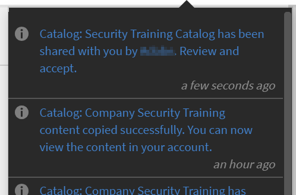

# Aktivieren der vollständigen Kontrolle über den freigegebenen Katalog

## Katalog erstellen {#createcatalog}

Als Administrator können Sie einen Katalog mit Kursen, Lernprogrammen, Arbeitshilfen und Zertifizierungen erstellen.

Weitere Informationen finden Sie unter [Kataloge](/help/migrated/administrators/feature-summary/catalogs.md).

## Katalog teilen {#sharecatalog}

Sie können die Kataloge mit internen Benutzern eines Unternehmens oder mit externen Benutzer teilen. Allerdings ist das Teilen exklusiv. Das heißt, dass ein intern freigegebenen Katalog nicht mit externen Gruppen geteilt werden kann und umgekehrt.

Kurse, Lernprogramme, Arbeitshilfen und Zertifizierungen sind die unterstützten Lernobjekte für freigegebenen Katalog.

Weitere Informationen finden Sie unter [Kataloge teilen](/help/migrated/administrators/feature-summary/catalogs.md).

## Aktivieren Sie die vollständige Kontrolle über den freigegebenen Katalog {#fullcontrol}

Sie können externen Konten vollen Zugriff auf Ihren Katalog gewähren. Der Administrator des Kontos kann dann den Katalog akzeptieren und dementsprechend Lerninhalte oder Module hinzufügen oder löschen.

Um einem externen Konto die volle Kontrolle zu gewähren,

1. Nachdem Sie einem Katalog Lerninhalte hinzugefügt haben, müssen Sie den Katalog für externe Benutzer freigeben.
1. Fügen Sie im Dialogfeld „Externes Konto“ die Unterdomäne und die E-Mail-ID des Administrators der externen Organisation hinzu.
1. Schalten Sie in der Option Katalogsteuerung die Schaltfläche um, um externen Benutzern die vollständige Kontrolle über den Katalog zu ermöglichen.

   

   *Vollständige Kontrolle über den freigegebenen Katalog zulassen*

   Wenn Sie die vollständige Katalogsteuerung zulassen, akzeptiert der Administrator der externen Organisation die Anforderung, Änderungen am Katalog zuzulassen. Der Autor der externen Organisation kann dann die Kurse bearbeiten oder Module hinzufügen.

   Weitere Informationen finden Sie in der Abschnitte unten.

## Administrator der externen Organisation {#administratorofexternalorganization}

Sobald der Administrator der vorherigen Organisation die vollständige Kontrolle über den Katalog aktiviert hat, akzeptiert der Administrator der externen Organisation die Anforderung, akzeptiert den Katalog und zeigt ihn an.

1. Klicken Sie auf das Benachrichtigungssymbol, um die Benachrichtigung anzuzeigen und den Katalog zu akzeptieren.

   <!---->

1. Klicken Sie auf „Akzeptieren“, um die Einladung für den Katalog zu akzeptieren.
1. Wenn Sie in der Liste der Kataloge den Katalog starten, der für Sie freigegeben wurde, wird die Meldung angezeigt, dass der Katalog jetzt die volle Kontrolle hat.

   

   *Katalogdetails anzeigen*

1. Sie können den Namen des Katalogs und die Beschreibung ändern.

## Teilen Sie den Katalog für Lernprogramme, Zertifizierungen und Arbeitshilfen {#sharecatalogforlearningprogramcertificationandjobaids}

Wie die vollständige Katalogkontrolle für Kurse kann der Administrator auch die vollständige Katalogkontrolle für Folgendes gewähren:

* Lernprogramme
* Zertifizierungen
* Arbeitshilfen

## Kurs zurücksetzen. {#resetcourse}

1. Klicken Sie auf der Katalogkarte mit der fehlerhaften Verknüpfung auf **[!UICONTROL Kurs zurücksetzen]**.

<!-- -->

1. Sie sehen eine Warnmeldung, nachdem Sie auf die Schaltfläche „Zurücksetzen“ geklickt haben. Kurs zurücksetzen:

   * Entfernt alle neu hinzugefügten Inhalte aus dem Katalog.
   * Aktualisiert den Katalog synchron mit dem ursprünglichen freigegebenen Katalog.
   * Stellt die Beziehung zum übergeordneten Lernobjekt wieder her.

   Das Zurücksetzen des Katalogs ist irreversibel. Sie können die Änderungen, die Sie am Katalog vorgenommen haben, nicht rückgängig machen.

1. Klicken Sie auf „Ja“, um die Änderungen zu akzeptieren.
1. Im Vorlesungsverzeichnis sehen Sie, dass das Verzeichnis nicht mehr die Meldung *Link defekt* enthält.

   Wenn Sie die Katalogdetails anzeigen, können Sie feststellen, dass der Katalog jetzt in seinem ursprünglichen Zustand wiederhergestellt ist.

## Ein Lernobjekt neu hinzufügen {#readdalearningobject}

Wenn Sie einen Kurs, ein Lernprogramm, eine Zertifizierung oder eine Arbeitshilfe versehentlich entfernt haben, können Sie ihn/sie wiederherstellen.

Klicken Sie auf „Erneut hinzufügen“, um ein gelöschtes Lernobjekt wiederherzustellen.

Diese Aktion kehrt die Aktion um und stellt das Lernobjekt in der Katalogansicht wieder her.

*Erneutes Hinzufügen eines Lernobjekts*

Nachdem Sie auf die Schaltfläche „Erneut hinzufügen“ geklickt haben, wird eine Bestätigungsmeldung angezeigt, dass das Lernobjekt erfolgreich zum Katalog hinzugefügt wurde.

## Externe Organisation {#externalorganization}

Nachdem der Administrator des externen Kontos den Katalog akzeptiert hat, kann der Autor jetzt Kurse und Lernprogramme hinzufügen.

1. Als Benutzer erhalten Sie eine Benachrichtigung, dass der Katalog jetzt in Ihrem Konto verfügbar ist.
1. Um die Liste der Kurse anzuzeigen, klicken Sie im linken Navigationsbereich auf **[!UICONTROL Kurse]**. Sie können alle von Ihnen erstellten und für Sie freigegebenen Kurse anzeigen.
1. Um die Kursdetails anzuzeigen, klicken Sie auf der Kurskarte auf **[!UICONTROL Kurs anzeigen]**.

   <!---->

1. Auf der Seite mit den Kursdetails werden Informationen zum Kurs und zu den gemeinsam genutzten Modulen angezeigt. Um ein Modul hinzuzufügen, klicken Sie auf „Module hinzuzufügen“. Wenn Sie den vorhandenen Modulen Module hinzufügen, werden die neuen Module am Ende der vorhandenen Module angezeigt. Sie können die Module jederzeit neu anordnen.
1. Nachdem Sie die Module hinzugefügt haben, klicken Sie auf „Neu veröffentlichen“.

   Nachdem Sie die Module erneut veröffentlicht haben, wird auf der Katalogkarte die Meldung *Verbindung unterbrochen* angezeigt.

   Da Sie den ursprünglichen Katalog mit neuen Modulen aktualisiert haben, besteht die bestehende Beziehung zum erworbenen Kurs nicht mehr.

   Das Lernobjekt ist nicht mit dem Quellkonto synchron, da der Inhalt des Lernobjekts geändert wurde.

   <!---->

Wenn Sie nach dem Hinzufügen und erneuten Veröffentlichen des Moduls das Gefühl haben, dass Sie versehentlich einen Kurs im Katalog hinzugefügt oder gelöscht haben, können Sie das Modul zurücksetzen und den ursprünglichen Zustand des Moduls wiederherstellen, als es erstmals mit voller Kontrolle freigegeben wurde.
