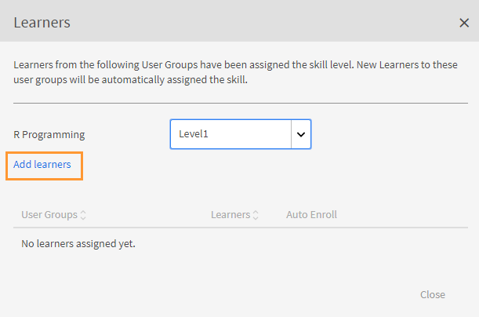
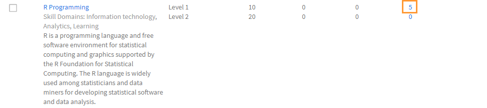
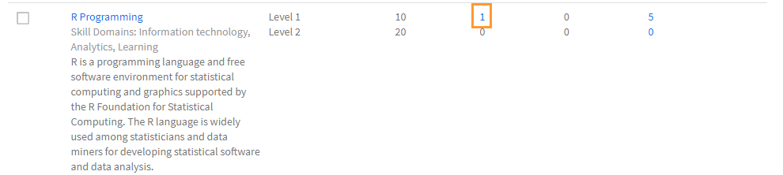

# Erstellen und Ändern von Kenntnissen und Stufen

Erstellen, Zuweisen und Ändern von Kenntnissen und Stufen.

In einem Kenntnisdiagramm werden die Fachkenntnisse, das Wissen und die Eigenschaften eines Unternehmensmitarbeiters zusammengefasst. Diese Kenntnisdiagramme helfen Firmen/Unternehmen dabei, die Leistungserwartungen für ihre Mitarbeiter festzusetzen oder zu erhöhen. Durch Kenntnisse können Mitarbeiter ihr Verhalten auf die Erwartungen des Unternehmens hin ausrichten.

In Adobe Learning Manager können Sie mithilfe von Kenntnisdiagrammen die Leistungen von Teilnehmern anhand ihrer Kenntnisse zuordnen. Wenn Teilnehmer einige Kurse absolviert haben, können sie ihren Stand zu jeder Qualifikation erkennen, indem sie die Qualifikationsdiagramme anzeigen.

Der grundlegende Zweck von Kenntnissen im Learning Manager LMS ist, dem Administrator ein Tool zur Verfügung zu stellen, das das Lernen an den Geschäftszielen ausrichtet.

## Qualifikation hinzufügen {#addaskill}

Als Administrator können Sie Folgendes ausführen:

* Ordnen Sie eine Domäne Kenntnissen zu.
* Fügen Sie mehrere Stufen Kenntnissen hinzu.
* Fügen Sie ein Abzeichen zu einer Stufe hinzu.

Um Kenntnisse hinzuzufügen, gehen Sie wie folgt vor:

1. Wählen Sie im linken Teilfenster **[!UICONTROL Kenntnisse]** > **[!UICONTROL Hinzufügen]** > **[!UICONTROL Kenntnisse hinzufügen]**. Geben Sie den Kenntnissen einen Namen und eine Beschreibung.

   

   *Namen und Beschreibung von Kenntnissen hinzufügen*

1. Weisen Sie den Kenntnissen eine Domäne zu. Beim Erstellen von Kenntnissen können Sie sie den relevantesten von Learning Manager unterstützten Kenntnisdomänen zuordnen. Weitere Informationen finden Sie unter [***Kenntnisse Kenntnisdomänen zuordnen***](/help/migrated/administrators/feature-summary/curation-skills.md).

   Geben Sie die Domäne in das Feld ein und Sie können Empfehlungen sehen. Wählen Sie die Option(en) aus, die für die Kenntnisse relevant sind.

   

   *Domäne hinzufügen*

1. Ordnen Sie die Ebenen den Kenntnissen zu. Um eine Stufe hinzuzufügen, klicken Sie auf **[!UICONTROL Hinzufügen]**.

   Sie können Kenntnisse für Mitarbeiter erstellen und zuweisen. Es gibt verschiedene Stufen für Kenntnisse und für jede Stufe muss eine bestimmte Anzahl von Credits erworben werden.

   Sie können Kenntnisse maximal drei Stufen zuweisen. Der Lernpfad besteht darin, Teilnehmer für verschiedene Lernobjekte einzuschreiben, die dann in eine bestimmte Anzahl von Credits übersetzt werden, die die Anforderungen für die verschiedenen Stufen von Kenntnissen erfüllen.

   Sobald diese Lernobjekte und -stufen erreicht wurden, kann der Teilnehmer auf einer produktiveren Stufe arbeiten.

   

   *Kenntnisstufen hinzufügen*

   Wenn Sie Kenntnisse hinzufügen, können Sie Credits Dezimalstellen zuweisen. Die Credits werden mit bis zu zwei Dezimalstellen angezeigt.

   Dezimalunterstützung ist nur in englischer Sprache verfügbar.

1. Wählen Sie ein Abzeichen für die Stufe. Wählen Sie in der Dropdown-Liste **[!UICONTROL Abzeichen]** ein Bild aus, das als Abzeichen für diese Stufe verwendet werden soll.
1. Um die Änderungen zu speichern, klicken Sie auf **[!UICONTROL Speichern]**.

   Sobald Kenntnisse erstellt wurden, können Sie die neu erstellten Kenntnisse auf der Seite **[!UICONTROL Kenntnisse]** finden. Sie können auch die Domänen und die kurze Beschreibung von Kenntnissen anzeigen. Sie können außerdem die Stufen und die Credits anzeigen, die jeder Stufe zugewiesen wurden.

   

   *Liste der Kenntnisse anzeigen*

## Einem Teilnehmer Kenntnisse zuordnen {#assigntheskilltolearners}

Administratoren können Teilnehmern Kenntnisse zuordnen.

Nachdem Sie Ihre Kenntnisse erstellt und gespeichert haben, werden diese auf der Kenntnisseite angezeigt. Nun können Sie diese Qualifikationen Teilnehmern wie folgt zuordnen:

1. Klicken Sie auf der Seite **[!UICONTROL Kenntnisse]** auf den Hyperlink mit der Anzahl der für die Kenntnisse eingeschriebenen Teilnehmer. Für neu erstellte Kenntnisse beträgt die Anzahl der Teilnehmer für alle Stufen null.

   

   *Teilnehmer anzeigen, die Kenntnissen zugewiesen sind*

   Fügen Sie für dieses Beispiel Teilnehmer für Stufe 1 hinzu. Klicken Sie auf den Hyperlink neben Stufe 1.

1. Klicken Sie im Dialogfeld „Teilnehmer“ auf **[!UICONTROL Teilnehmer hinzufügen]**.

   

   *Teilnehmer hinzufügen*

1. Suchen Sie nach Teilnehmern und fügen Sie die Teilnehmer hinzu. Sie können auch Benutzergruppen hinzufügen.

   

   *Teilnehmer suchen und hinzufügen*

1. Um die Änderungen zu speichern, klicken Sie auf **[!UICONTROL Speichern]**.

   Nachdem Sie die Teilnehmer zugewiesen haben, werden alle Teilnehmer in einer Benutzergruppe, sofern vorhanden, standardmäßig automatisch für die Kenntnisse registriert. Sie können die Teilnehmer von der automatischen Anmeldung ausschließen lassen, indem Sie auf die Schaltfläche **[!UICONTROL Automatische Registrierung]** klicken.

   

   *Automatische Registrierung deaktivieren*

   Einzelne Teilnehmer können sich selbst oder vom Administrator für ein Lernprogramm automatisch registrieren.

1. Nachdem Sie auf **[!UICONTROL Schließen]** geklickt haben, wird die Gesamtzahl der Teilnehmer angezeigt, die der von Ihnen erstellten Kenntnisse zugewiesen wurden.

   In diesem Beispiel befinden sich zwei einzelne Teilnehmer und drei Teilnehmer in einer Benutzergruppe.

   

   *Anzahl der Teilnehmer, die Kenntnissen zugewiesen sind*

## Ordnen Sie Kenntnisse einem Kurs zu {#assignskilltocourse}

Sobald Sie Kenntnisse erstellt haben, kann ein Autor einen Kurs erstellen und Kenntnisse dem Kurs zuweisen.

*Zuweisen von Kenntnissen zu einem Kurs*

Nachdem der Autor den Kurs veröffentlicht hat, können Sie auf der Seite **[!UICONTROL Kenntnisse]** die Anzahl der Kurse anzeigen, die einer Kenntnisstufe zugeordnet sind. Diese wird erhöht, wenn Sie die Kenntnisse einem neuen Kurs zuweisen.

*Anzahl der Kurse, die einer Kenntnisstufe zugeordnet sind*

## Weisen Sie den Kenntnissen eine Arbeitshilfe zu {#assignajobaidtotheskill}

Arbeitshilfen sind Schulungsmaterialien, auf die ein Teilnehmer zugreifen kann, ohne dass sie sich für spezifische Lernobjekte wie beispielsweise für einen Kurs oder ein Lernprogramm registrieren müssen.

Während der Erstellung einer Arbeitshilfe kann ein Autor eine Kenntnisstufe damit verknüpfen. Das Erstellen einer Arbeitshilfe ohne Kenntnisse und das Verknüpfen dieser mit einem Kurs mit Kenntnissen verknüpft die Kenntnisse nicht mit der Arbeitshilfe.

*Arbeitshilfe erstellen*

Auf der Seite **[!UICONTROL Kenntnisse]** können Sie die Anzahl der mit dieser Kenntnisstufe verknüpften Arbeitshilfen anzeigen.

*Anzahl der Arbeitshilfen für Kenntnisse*

## Kenntnisse suchen {#searchskill}

Suchen Sie nach Kenntnissen, indem Sie den Namen der Kenntnisse eingeben und diese aus den vorhandenen Optionen auswählen. Die Type-Ahead-Suchfunktion ist hier ebenfalls verfügbar.

Sie können in den Abschnitten **[!UICONTROL Aktiv]** und **[!UICONTROL Eingestellt]** auf der Seite „Kenntnisse“ nach Kenntnissen suchen.

## Kenntnisse bearbeiten {#editaskill}

Klicken Sie auf der Seite **[!UICONTROL Kenntnisse]** auf die Kenntnisse, die Sie ändern möchten. Nehmen Sie im Dialogfeld **[!UICONTROL Kenntnisse bearbeiten]** die erforderlichen Änderungen vor, z. B.

* Hinzufügen oder Löschen einer Kenntnisdomäne.
* Geben Sie den Namen und die Beschreibung des Dashboards ein.
* Hinzufügen einer Kenntnisstufe oder Ändern einer vorhandenen Stufe.
* Hinzufügen oder Löschen eines Abzeichens für Kenntnisse.

Nachdem Sie die Änderungen vorgenommen haben, klicken Sie auf **[!UICONTROL Speichern]**.

## Kenntnisse einstellen {#retireaskill}

Um Kenntnisse zu beenden, wählen Sie auf der Seite **[!UICONTROL  Kenntnisse]** die Kenntnisse aus, die Sie beenden möchten.

Klicken Sie in der rechten oberen Ecke des Menüs **[!UICONTROL Aktionen]** auf **[!UICONTROL Einstellen]**.

Wenn Sie Kenntnisse einstellen, werden sie nicht mehr im Kurs angezeigt.

Wenn Kenntnisse eingestellt sind, können sie nicht mehr mit Kursen oder Arbeitshilfen verknüpft oder Teilnehmern zugewiesen werden, bis sie erneut veröffentlicht werden. Die bestehenden Assoziationen und Zuordnungen sind vom Einstellen der Kenntnisse nicht betroffen.

## Kenntnisse erneut veröffentlichen {#republishaskill}

Sobald Sie Kenntnisse eingestellt haben, werden die eingestellten Kenntnisse auf der Registerkarte **[!UICONTROL Eingestellt]** angezeigt. Auf der Registerkarte wird die Liste aller Kenntnisse angezeigt, die eingestellt sind.

Um eingestellte Kenntnisse erneut zu veröffentlichen, wählen Sie die Kenntnisse und wählen Sie aus dem Menü **[!UICONTROL Aktion]** **[!UICONTROL Neu veröffentlichen]**.

Dies stellt die Kenntnisse wieder her und Sie können sie erneut auf der Registerkarte **[!UICONTROL Aktiv]** anzeigen.

## Kenntnisse löschen {#deleteaskill}

Sie können nur Kenntnisse löschen, die zuvor eingestellt wurden.

Wählen Sie auf der Registerkarte **[!UICONTROL Eingestellt]** die Kenntnisse aus, die Sie löschen möchten, und klicken Sie im Menü **[!UICONTROL Aktionen]** auf **[!UICONTROL Löschen]**.

Sie können Kenntnisse nur löschen, wenn sie keinem Teilnehmer, Kurs oder keiner Arbeitshilfe zugeordnet sind.

## Kursleiter(innen) Kenntnisse zuweisen

Fügen Sie eine CSV-Datei hinzu, die die Kenntnisse von Kursleiter(inn)en enthält. Diese Kenntnisse werden dann der Liste der Kenntnisse hinzugefügt.

1. Wählen Sie in der oberen rechten Ecke des Bildschirms **[!UICONTROL Hinzufügen]** > **[!UICONTROL Kenntnisse dem Kursleiter zuweisen]**.
1. CSV-Datei hochladen. Die Spalten in der CSV-Datei lauten:

   * Name der Kenntnisse
   * Kenntnisstufen
   * Kursleiter-E-Mail oder Kursleiter-UUID

   Bei UUID-aktivierten Konten ersetzen Sie die Spalte &quot;E-Mail-Adresse des Kursleiters&quot; durch die UUID des Kursleiters.

   Klicken Sie auf „Speichern“.

   

   *Kursleiterkenntnisse aus einer CSV-Datei hinzufügen*

1. Es wird ein Bestätigungs-Popup angezeigt.

   Hinweis: Die folgende Fehlermeldung wird angezeigt, wenn die CSV-Datei falsche Felder enthält.

   

   *Fehlermeldung für falsche Felder*

### Kenntnisseite

Auf der Seite &quot;Kenntnisse&quot; befindet sich die Spalte &quot;Kursleiter&quot;, die die Anzahl der Kursleiter angibt, die Kenntnissen zugewiesen sind. Wenn Sie auf die Anzahl der Kursleiter klicken, wird ein Popup-Fenster angezeigt, in dem die Kursleiter angezeigt werden, die den Kenntnissen zugewiesen sind.

*Kenntnisseite*

### CSV-Qualifikationszuweisung herunterladen

1. Klicken Sie auf der Seite &quot;Kenntnisse&quot; auf **[!UICONTROL Hinzufügen]** > **[!UICONTROL Kenntnisse dem Kursleiter zuweisen]**.
1. Klicken Sie im Dialogfeld auf **[!UICONTROL Zuvor hinzugefügte Aufgabe]**.
1. Die CSV-Datei, die Sie zuletzt hochgeladen haben, wird heruntergeladen.

>[!NOTE]
>
>Es wird empfohlen, die CSV-Datei für die Qualifikationszuweisung zuerst herunterzuladen, zu bearbeiten und dann hochzuladen.

## Häufig gestellte Fragen {#frequentlyaskedquestions}

+++Wie kann ich einen Teilnehmer aus Kenntnissen entfernen?

Sie können einen Teilnehmer nicht aus Kenntnissen entfernen. Sie können Kenntnissen jedoch neue Teilnehmer oder Benutzergruppen hinzufügen.
+++

+++Wie kann ich Teilnehmer für Kenntnisse automatisch registrieren?

Die automatische Registrierung ist nur für Benutzergruppen verfügbar. Wenn Sie eine Benutzergruppe, z. B. „Alle Autoren“, für Kenntnisse registrieren und speichern, ist die automatische Registrierung standardmäßig aktiviert. Allen neuen Benutzer der Benutzergruppe „Alle Autoren“ werden also auch die Kenntnisse zugewiesen.

Wenn Sie die automatische Registrierung für diese Kenntnisstufe für „Alle Autoren“ beenden, werden allen neuen Benutzern, die der Benutzergruppe „Alle Autoren“ hinzugefügt werden, die Kenntnisse nicht zugewiesen.
+++

+++Wie starte ich die automatische Registrierung neu?

Registrieren Sie dieselbe Benutzergruppe erneut für die Kenntnisstufe, für die die automatische Registrierung beendet wurde.

Dadurch wird die automatische Registrierung neu gestartet, und auch Teilnehmern, die der Gruppe hinzugefügt wurden, als diese Funktion deaktiviert war, werden die Kenntnisse jetzt zugewiesen.

Das heißt, wenn Sie eine Benutzergruppe erneut registrieren, um die automatische Registrierung zu starten, werden die Benutzergruppenmitglieder aktualisiert und die Kenntnisse allen aktuellen Mitgliedern zugewiesen.
+++

+++Wie kann ich einem Kurs Kenntnisse zuweisen?

Weitere Informationen zum Verfahren finden Sie im Abschnitt [Zuweisen von Kenntnissen zu einem Kurs](skills-levels.md#assignskilltocourse).
+++

+++Wie ändere ich Kenntnisstufen?

Um eine oder mehrere Stufen in Kenntnissen zu ändern, bearbeiten Sie die Kenntnisse und ändern Sie die Eigenschaften der vorhandenen Stufen.
+++

+++Wie aktiviere ich Abzeichen und Kenntnisse, damit sie an den Kursabschluss gebunden sind?

Kenntnisse können mit dem Kursabschluss verbunden werden, während Sie als Autor einen Kurs erstellen. Im Bereich „Einstellungen“ können Sie die Kenntniskriterien für den Abschluss des Kurses festlegen.

Um Abzeichen für den Abschluss des Kurses zu aktivieren, aktivieren Sie im Abschnitt **[!UICONTROL Instanzen]** der Autoren-App das gewünschte Abzeichen.
+++

+++Kann ein Administrator ein Abzeichen als abgeschlossen markieren, auch wenn das Abzeichen &quot;In Bearbeitung&quot; anzeigt?

Ein Administrator kann ein Lernobjekt als abgeschlossen markieren. Kenntnisse und Abzeichen sind mit dem Lernobjekt verknüpft und können nicht separat als **[!UICONTROL Abgeschlossen]** gekennzeichnet werden.

Mit anderen Worten, um das Abzeichen zu erreichen, **muss man das dazugehörige Lernobjekt abschließen**.
+++

### Ähnliche Themen

* [Kenntnisse und Adobe Learning Manager](https://elearning.adobe.com/2018/11/skills-captivate-prime/)
