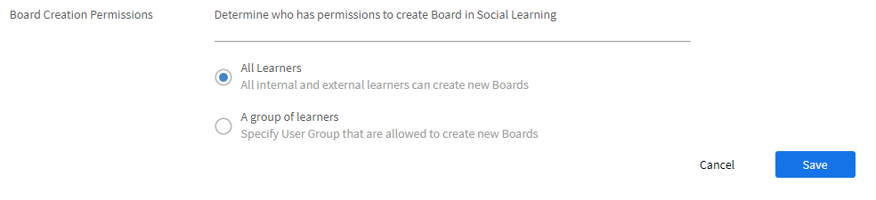

# Überwachung und Moderation von Soziales Lernen als Administrator

Als Administrator können Sie im Sozialen Lernen durchgeführte Aktivitäten aktivieren, deaktivieren und überwachen. Sobald die Soziales Lernen-Funktion aktiviert ist, können die Teilnehmer sie anzeigen und mit dem Sozialen Lernen beginnen.

Mit Soziales Lernen können Teilnehmer von überall aus lernen und Inhalte mit ihren Kollegen teilen. Mit dieser Funktion können Teilnehmer interagieren, Ideen austauschen und zusammenarbeiten und so ihr gesamtes Lernerlebnis verbessern.

## Aktivieren und konfigurieren Sie Einstellungen für das Soziale Lernen {#enableandconfiguresettingsinsociallearning}

Führen Sie folgende Schritte aus, um die Funktion für Soziales Lernen zu aktivieren und zu konfigurieren:

1. Klicken Sie auf **[!UICONTROL Soziales Lernen]** auf der linken Navigationsleiste. Sie werden zur Aktivitätsseite weitergeleitet.
1. Aktivieren **[!UICONTROL Social Learning]** -Funktion über die **[!UICONTROL Aktivieren]** in der Aktivitätsseite, wenn Sie sie zum ersten Mal aktivieren. Andernfalls kann sie über die **[!UICONTROL Einstellungen]** angezeigt.

   Ein Popup-Dialogfeld erscheint wie in der Abbildung unten.

    

   *Social Learning aktivieren*

<!--  -->

Der Administrator kann Einstellungen für Soziales Lernen konfigurieren. Einstellungen umfassen Typen von Inhaltskurationen wie **[!UICONTROL Manuelle Kuratierung]** und **[!UICONTROL Keine Kuration]**. Die Bereichseinstellungen können auf einen anderen Bereich festgelegt werden, z. B. auf den Benutzertyp (intern/extern) oder andere aktive Felder im Konto. Der Administrator kann den URL-Pfad festlegen, über den die Teilnehmenden die Adobe Learning Manager-Desktop-Anwendung herunterladen können.

### Inhaltskuration {#contentcuration}

Da Soziales Lernen ein informelles Lernen ist, ähnelt seine Funktionalität anderen Social-Media-Plattformen. Social-Media-Posts stören oft, weil sie oft irrelevante Inhalte konsumieren, die ihre Produktivität beeinträchtigen. Dieser Gedanke kann durch inhaltliche Moderation und Kuration erfüllt werden.

**[!UICONTROL Manuelle Kuratierung]** und **[!UICONTROL Keine Kuration]** Es gibt zwei Kurationsoptionen, die vom Administrator ausgewählt werden können.

**[!UICONTROL Automatische Unterstützung für manuelle Kuratierung]:** Learning Manager verfügt über eine auf künstlicher Intelligenz basierende Auto-Kuration-Engine, mit der Sie die Essenz des Inhalts jedes beliebigen Formats intelligent herausfinden können, das später den gewünschten Teilnehmern bereitgestellt werden kann. Es kann auch Inhalte genehmigen oder ablehnen, die auf der Grundlage des angegebenen Confidence-Scores veröffentlicht werden.

Beispielsweise ist Adarsh ein Lerner und er fand einen Blog interessant, also postet er ihn auf Adobe Learning Managers Social-Learning-Plattform. Der Beitrag wird dann an die KI-gestützte Content Curation Engine weitergeleitet, die die im Inhalt vorhandenen Kenntnisse vorhersagt und diese mit den entsprechenden Board-Kenntnissen vergleicht. Wenn eine der Qualifikationen übereinstimmt, wird der Inhalt veröffentlicht, andernfalls wird er zur manuellen Kuration gesendet.

Der Mindestwert für die Vertrauenswürdigkeit, der für die Buchung erforderlich ist, ist 50 %.

**[!UICONTROL Manuelle Kuratierung]:** Um die Authentizität des Inhalts zu überprüfen, bevor er live geschaltet wird, kann der Administrator die Einstellung &quot;Manuelle Kuratierung&quot; aktivieren. Sobald die Einstellung der manuellen Kuration aktiviert ist, wird sie zur Kuration an die Top-SMEs (maximal 3) weitergeleitet. Basierend auf der durchschnittlichen Antwort wird die Stelle entsprechend genehmigt/abgelehnt. Gibt es mehr als 50 Prozent, wird der Beitrag live gesendet, andernfalls abgelehnt. Weitere Informationen über die SMEs [finden Sie hier](social-learning-configurations-as-an-admin.md#SubjectMatterExpertsSMEs).

Im neuen Bereich erhält er/sie Punkte für Aktivitäten auf allen Ebenen.

In den Bereichen der Bestenliste für soziale Netzwerke kann ein Benutzer alle Benutzer seines Bereichs zusammen mit speziellen Benutzern anzeigen.

Wenn Sie spezielle Benutzerrechte erhalten haben, können Sie alle Benutzer im Konto in Ihrer Bestenliste anzeigen, unabhängig vom Bereich der Benutzer.

Wenn spezielle Benutzer durch ausreichende Punktzahl zu SME werden, werden sie im **[!UICONTROL Top-Fachexperten]** im sozialen Leaderboard.

Warten Sie 60 Minuten, bis die Änderungen wirksam werden.

### Bereichseinstellungen {#scopesettings}

Beim Sozialen Lernen bestimmt ein Bereich die von Ihnen angezeigten Boards, die die Sichtbarkeit des Inhalts steuern. Wenn ein Benutzer einen Bereich hat, z. B. ***Vendor_A***, er kann nur Boards und zugehörige Beiträge sehen, die von anderen erstellt wurden, die demselben Bereich angehören ***Vendor_A***.

Auf diese Weise können Administratoren eine Gruppe von Benutzern verwalten, z. B. Lieferanten, Partner oder Abteilungen in einer Organisation.

Aktivieren Sie Soziales Lernen und Ranglisten für interne und externe Benutzer.

Es gibt separate Abschnitte, um interne und externe Benutzer zu aktivieren.

**Für interne Teilnehmer aktivieren**

In diesem Abschnitt können Sie die Benutzereigenschaft auswählen, um den Umfang des sozialen Lernens für interne Benutzer zu definieren. Benutzer mit den gleichen Merkmalen **Wert** Teilen Sie den gleichen Bereich für Soziales Lernen.

Im Fenster &quot; **Benutzermerkmal** die gewünschte Option aus.

*Wählen Sie die Benutzereigenschaften aus, um den Bereich zu definieren.*

Standardmäßig ist die Option **[!UICONTROL Alle internen Benutzer]** in der Dropdown-Liste Benutzermerkmal ist immer ausgewählt.

Sie können interne Benutzer basierend auf ihren aktiven Feldern erfassen.

**Für externe Teilnehmer aktivieren**

Verwenden Sie ein externes Profil, um den Lernumfang für externe Benutzer zu definieren. Teilnehmer mit demselben externen Profil teilen sich einen gemeinsamen Bereich für Soziales Lernen.

*Bereich für externe Teilnehmer aktivieren*

Externe Benutzer erhalten einen Bereich basierend auf ihren externen Profilen.

Wenn Sie in der obigen Liste beispielsweise **[!UICONTROL Acme Corp]** aktivieren, können alle Teilnehmer, die zu Acme Corp gehören, die von ihnen erstellten Boards sehen. Wenn Sie die Option **Henry Cavill** deaktivieren, können die Teilnehmer keine von Henry Cavill erstellten Boards sehen.

Der Administrator kann die Sichtbarkeit des Inhalts basierend auf dem aktiven Feld im Feld **[!UICONTROL Benutzereigenschaft]** festlegen.

Zum Beispiel kann der Administrator den Bereich auf **[!UICONTROL Benutzertyp (intern/extern)]** Benutzer festlegen. Wenn Sie als Suchbereich &quot;Benutzertyp&quot; festlegen, ist der von einem internen Teilnehmer auf der Plattform für soziales Lernen freigegebene Inhalt nur für andere interne Teilnehmer in der Organisation und nicht für die externen Benutzer sichtbar und umgekehrt.

Nachdem ein Benutzermerkmal vom Administrator ausgewählt wurde, kann er die Funktion für soziales Lernen auf die Gruppen von Teilnehmern und Teilnehmer beschränken, indem Sie das Kontrollkästchen unter dem Feld „Benutzermerkmal“ aktivieren. Klicken Sie auf das Wertfeld, um die Teilnehmer oder Teilnehmergruppen auszuwählen, für die Sie die Funktion für das Soziale Lernen aktivieren möchten.

Standardmäßig wird der Umfang durch das Attribut **[!UICONTROL Benutzertyp]** die interne oder externe Teilnehmer sind.

Wenn das aktive Feld keinen Wert enthält, ist die Dropdown-Liste für das Feld **[!UICONTROL Wert]** für den Administrator nicht sichtbar.

<!-- -->

Die Benutzer können ihre Inhalte auch über den Adobe Learning Manager-Client veröffentlichen. Klicken Sie je nachdem, ob Sie ein Mac- oder Windows-Benutzer sind, auf die angegebenen Links, um die Desktop-Anwendung herunterzuladen, und führen Sie die angegebenen Schritte aus, um sie auf Ihrem System zu installieren. Wenn Sie Schwierigkeiten bei der Installation haben, [klicken Sie hier](../../kb/troubleshooting-issues-with-adobe-learning-manager-desktop-app.md).

### Download-Konfigurationen {#downloadconfigurations}

<!---->

Bei Enterprise-Servern kann der Administrator den Ort ändern, von dem aus die Teilnehmer die Desktopanwendung für Windows und Mac herunterladen können.

*Download-Speicherort ändern*

Die Enterprise Server-URL muss öffentlich gehostet werden.

### Berechtigungen für Board-Erstellung {#permission}

Um die Erstellung von Boards durch alle Teilnehmer einzuschränken und die Boards effektiv zu moderieren, kann ein Administrator einer ausgewählten Gruppe von Benutzern Berechtigungen zum Erstellen von Boards erteilen.

*Berechtigungen zum Erstellen eines Boards festlegen*

Standardmäßig ist die Option **[!UICONTROL Alle Teilnehmer]** aktiviert.

**[!UICONTROL Alle Teilnehmer]:** Wenn Sie diese Option auswählen, können alle internen und externen Benutzer Boards erstellen.

**Eine Gruppe von Teilnehmer:** Wenn Sie diese Option auswählen, werden nur Benutzer mit der Berechtigung zum Erstellen eines Boards unter dem Link **[!UICONTROL Neues Board erstellen]** in Soziales Lernen angezeigt. Wählen Sie die Benutzergruppe aus, der die Berechtigung zum Erstellen eines Boards erteilt werden muss. Sie können auch automatisch generierte sowie benutzerdefinierte Benutzergruppen hinzufügen.

<!---->

Benutzer mit demselben Bereich können nur das Board sehen. Für Benutzer, die keine Berechtigung haben, bleibt der Link **[!UICONTROL Neues Board erstellen]** unsichtbar.

Warten Sie 60 Minuten, bis die Änderungen wirksam werden.

## Spezielle Benutzer {#privilege}

Ein Administrator kann einer Benutzergruppe spezielle Berechtigungen erteilen, mit denen Mitglieder der Gruppe an allen Boards teilnehmen können. Alle Einschränkungen, die im Abschnitt Bereichseinstellungen festgelegt wurden, werden von der speziellen Benutzergruppe umgangen.

Die Benutzergruppe kann entweder automatisch generiert oder benutzerdefiniert sein.

Ein Benutzer, dem diese Berechtigung gewährt wurde, hat Zugriff auf alle Boards mit Ausnahme von **Privaten Boards**.

*Besondere Rechte gewähren*

Wenn der Administrator eine Benutzergruppe auswählt, können standardmäßig alle Benutzer in der Gruppe auf alle Boards zugreifen, unabhängig vom Bereich des Benutzers. Jeder Benutzer mit diesen erweiterten Rechten kann alle internen und externen Boards anzeigen und daran teilnehmen.

Spezielle Benutzer erhalten über alle Bereiche hinweg Kurationsanfragen, wenn sie über ausreichende KMU-Punkte für diese Kenntnisse verfügen.

Wenn der Benutzer nicht über die erforderlichen SME-Punkte verfügt, werden die Kuratierungsrechte an die drei besten SME dieser Kenntnisse weitergegeben.

Im neuen Bereich erhält er/sie Punkte für Aktivitäten auf allen Ebenen.

In den Bereichen der Bestenliste für soziale Netzwerke kann ein Benutzer alle Benutzer seines Bereichs zusammen mit speziellen Benutzern anzeigen.

Wenn Sie spezielle Benutzerrechte erhalten haben, können Sie alle Benutzer im Konto in Ihrer Bestenliste anzeigen, unabhängig vom Bereich der Benutzer.

Wenn spezielle Benutzer durch ausreichende Punktzahl zu SME werden, werden sie im **[!UICONTROL Top-Fachexperten]** im sozialen Leaderboard.

Warten Sie 60 Minuten, bis die Änderungen wirksam werden.

### Anpassen des sozialen Banners {#customize-social-banner}

Der Administrator kann den Titel und den Untertitel anpassen, die auf der Sozialen Lernen-Startseite im Headerbild angezeigt werden. Alles was der Administrator als Titel und Untertitel eingibt, wird auf der Startseite des Teilnehmers angezeigt.

1. Klicken Sie in der Admin-App auf **[!UICONTROL Social Learning]** > **[!UICONTROL Einstellungen]**.
1. Klicken **[!UICONTROL Anpassen]**.
1. Ändern Sie das Bannerbild. Die Abmessungen des Bildes müssen mindestens **1.600 px x 240 px**.
1. Schalten Sie die Option zum Ausblenden oder Anzeigen der **[!UICONTROL Weitere Infos]** auf dem Banner.
1. Geben Sie den Titel und den Untertitel in die unten angegebenen Felder ein:

   

   *Anpassen des sozialen Banners*

Es gibt noch einige weitere Optionen:

* **[!UICONTROL Sprache]:** Wählen Sie aus der Dropdown-Liste die Sprache aus, in die Titel und Untertitel übersetzt werden sollen. Sie können auch benutzerdefinierten Text für verschiedene Sprachen hinzufügen.
* **[!UICONTROL Replizieren]:** Klicken Sie auf diese Schaltfläche, um Titel und Untertitel in allen Sprachen zu replizieren.
* **[!UICONTROL Zurücksetzen]:** Klicken Sie auf diese Schaltfläche, um zum ursprünglichen Titel und Untertitel zurückzukehren.

  Auf der Soziales Lernen-Startseite werden die vom Administrator bereitgestellten Informationen als Kopfzeile der Seite angezeigt.

  <!---->

### Ansicht für Soziales Lernen

Ein Administrator kann die Ansicht für soziales Lernen aus den folgenden Einstellungen auswählen:

* Beitragsansicht - Wenn Sie diese Option auswählen, werden die einzelnen Beiträge aller Boards angezeigt.
* Board-Ansicht - Wenn Sie diese Option auswählen, werden alle verfügbaren Boards angezeigt.

## Automatische Kuration des Inhalts {#autocuration}

Das manuelle Moderieren von Inhalten ist häufig fehleranfällig und zeitintensiv. Darüber hinaus ist der Prozess nicht skalierbar und für viele soziale Aktivitäten ungeeignet. Daher wird die Kuration von Inhalten automatisch wichtig, wenn viele Benutzer eingeschlossen werden, die sozial aktiv sind.

In Learning Manager gibt es eine Option zur automatischen Kuration von Inhalten. Die Kuration wird von einer AI-fähigen Engine gesteuert, die mit den vordefinierten Kenntnissen arbeitet, nachdem der Administrator die vordefinierten Kenntnisse mit Kenntnissen verknüpft hat. Weitere Informationen finden Sie unter [Domänenzuordnung für Kenntnisse](curation-skills.md).

Bei der automatischen Kuration sind folgende Inhaltstypen zulässig:

* PDF
* Audio- und Videodateien
* Präsentationen - PPT oder PPTX
* Dokumente - .docx, .doc

Ein Administrator kann die Option aktivieren, Inhalte automatisch in der Administrator-App zu kuratieren.

1. Klicken Sie im linken Bereich der Admin-App auf **[!UICONTROL Soziales Lernen]**.
1. Klicken Sie auf der Seite auf die Registerkarte **[!UICONTROL Einstellungen]**.
1. Aktivieren Sie die Option **[!UICONTROL Automatische Unterstützung für manuelle Kuration]**.

   

   *Wählen Sie die Option Manuelle Kuratierung mit automatischer Unterstützung aus.*

Wenn ein Benutzer einen Inhalt in ein Forum hochlädt, entfernt ein AI-basierter Algorithmus den Text aus dem Inhalt, und der Text wird dann an die Kurations-Engine übergeben. Die Kurations-Engine versucht, die im Inhalt vorhandenen Kenntnisse zu finden.

Die vorhergesagten Kenntnisse aus dem hochgeladenen Inhalt stimmen mit denen mit dem Board überein, in dem der Inhalt hochgeladen wurde.  Wenn Kenntnisse mit einer Vertrauensbewertung von mehr als 50 % der Board-Kenntnisse übereinstimmen, wird der Inhalt im Board veröffentlicht. Wenn das Confidence-Ergebnis weniger als 50 % beträgt, wird der Inhalt zur manuellen Kuration gesendet.

Immer wenn ein Inhalt automatisch kuratiert wird, erhält der Benutzer eine Benachrichtigung, dass der Inhalt in dem Forum verfügbar ist, in dem er zuvor hochgeladen wurde.

*Flussdiagramm der Kurationseinstellungen*

Es wird empfohlen, dass der Administrator SME für Kenntnisse hinzufügt, wenn die manuelle Kuration aktiviert ist. Der Administrator kann SMEs hinzufügen, indem er den Benutzern mit Fachkenntnissen im Vorfeld SME-Punkte zur Verfügung stellt. Weitere Informationen über die Bereitstellung von Punkten für KMU:  [hier klicken](social-learning-configurations-as-an-admin.md#SubjectMatterExpertsSMEs).

**Keine Kuration:** Alle Beiträge der Teilnehmer werden automatisch ohne Inhaltsmoderation veröffentlicht.

<!---->

## Häufig gestellte Fragen zur automatischen Kuration von Inhalten {#faq-auto-curation}

+++Wie viel Zeit hat ein SME, um einen Beitrag zu kuratieren?

Ein SME erhält mindestens 24 Stunden, um einen Beitrag zu kuratieren. Aufgrund von Zeitzonenunterschieden kann sie auf 47 Stunden erhöht werden.

+++

+++Wird der Kurs an die nächsten drei SME weitergeleitet, wenn alle drei zur Verfügung stehen? Werden immer drei SME einbezogen?

Der Kurationsantrag wird am ersten Tag an die Top-SME geleitet. Wenn diese nicht antworten, wird der Antrag am nächsten Tag an die drei nächsten SME weitergeleitet.

Wenn die drei neuen SME nicht reagieren, wird der Antrag an die Moderatoren des Boards gerichtet.

Wenn die Board-Moderatoren nicht antworten, wird der Antrag automatisch genehmigt.

+++

+++Wenn zwei SME kuratieren und einer nicht - geht der Antrag an den vierten SME oder wird der Durchschnitt der von der ersten SME-Runde für den Beitrag bewerteten Beiträge übernommen?

Für die Genehmigung des Beitrags ist eine Zustimmung von 50 % erforderlich. Gleiches gilt für die Ablehnung eines Beitrags, für die ebenfalls 50 % erforderlich sind. Bei jeder Zustimmung durch einen SME wird bewertet, ob die erforderlichen 50 % erreicht wurden.

Werden diese 50 % nach einem Tag nicht erreicht, wird der Antrag an die nächsten SME weitergeleitet, wodurch die vorherigen unbeantworteten Kurationsanträge verfallen.

Am ersten Tag wird der Kurationsantrag beispielsweise an drei SME geleitet; einer von ihnen stimmt zu, die anderen beiden antworten nicht. Am nächsten Tag geht der Antrag an die nächsten drei SME. Auf dieser Ebene gibt es derzeit insgesamt vier aktive SME. Mindestens zwei SEM müssen ihn genehmigen, um die Kuration zu genehmigen.(Wenn er von zwei SEM genehmigt und von zwei abgelehnt wird, entscheidet die Seite, die zuerst 50 % erreicht.)

+++

+++Soweit ich weiß, wird ein &quot;Moderator&quot; nur zugewiesen (und das ist nicht obligatorisch), wenn jemand ein neues Board erstellt. Was nützt es, wenn ein Teilnehmer einem Board einen &quot;Moderator&quot; zuweist, wenn SMEs den Kenntnissen zugewiesen werden, mit denen ein Board verbunden ist?

Im Folgenden sind die Zuständigkeiten eines Soziales Board-Moderators aufgeführt:

* Der Moderator kann den Board-Namen, die Beschreibung, die Dashboard-Sichtbarkeitseinstellungen und andere Konfigurationen bearbeiten.
* Der Moderator kann einen Beitrag auf dem Board löschen, wenn der Beitrag nicht für die Zielgruppe geeignet ist.
* Der Moderator erhält Benachrichtigungen über Missbrauch melden für das Board.
* Der Moderator erhält Kurationsanträge, wenn kein SME für das Board verfügbar sind.

+++

+++Unser Schulungsteam wird die Kenntnisse, die mit der Kenntnisstufe verbunden sind, sowie die KMU, die den Kenntnissen zugewiesen sind, erweitern bzw. überwachen.

SME werden basierend auf Kenntnissen, nicht auf Kenntnisstufen hinzugefügt/zugewiesen. Dies ist so beabsichtigt.

+++

+++Was ist der Unterschied zwischen einem &quot;Moderator für Soziales Lernen&quot; und einem &quot;SME für Soziales Lernen&quot;?

**Moderatoren:** Moderatoren sind zweite Besitzer des Boards. Sie werden während der Board-Erstellung von den Erstellern hinzugefügt, sodass sie das Board auch in Abwesenheit dieser kontrollieren können. Standardmäßig ist der Ersteller des Boards der Moderator.

**KMU:** Fachexperten sind Experten mit spezifischen Kenntnissen. Administratoren können bestimmten Kenntnissen SME zuweisen, um Inhalte dieser Kenntnisse zu kuratieren. SME erhalten die Kurationsanträge für Boards, die mit ihren Kenntnissen verknüpft sind. Teilnehmer können auch SME werden, indem sie SME-Punkte sammeln.

+++

+++Wenn zwei oder drei SME bestimmten Kenntnissen zugewiesen werden, hängt eine Genehmigung oder Ablehnung eines Social-Learning-Beitrags von der Kuration aller SME ab oder davon, wer zuerst kuratiert?

Für die Genehmigung des Beitrags ist eine Zustimmung von 50 % erforderlich. Gleiches gilt für die Ablehnung eines Beitrags, für die ebenfalls 50 % erforderlich sind. Bei jeder Zustimmung durch einen SME wird bewertet, ob die erforderlichen 50 % erreicht wurden.

Werden diese 50 % nach einem Tag nicht erreicht, wird der Antrag an die nächsten SME weitergeleitet, wodurch die vorherigen unbeantworteten Kurationsanträge verfallen.

+++

## Trends {#trends}

Die Trends der sozialen Aktivität des Teilnehmers können auf der Registerkarte Aktivität im Abschnitt Trends angezeigt und verfolgt werden. Diese Daten können für verschiedene Zeiträume wie die letzten sieben Tage, den letzten Monat, die letzten drei Monate und alle Zeiten angezeigt werden.

„Letzte sieben Tage“ ist der Standardwert im Datumsfilter.

>[!NOTE]
>
>„Letzte sieben Tage“ ist der Standardwert im Datumsfilter.

Das erste Bild liefert dem Administrator die folgenden Informationen für den aus dem Datumsfilter ausgewählten Zeitraum:

1. **[!UICONTROL Neue Beiträge]**: Zeigt die Anzahl der neuen Beiträge an, die innerhalb der Datumsperiode erstellt wurden. Außerdem wird die Gesamtzahl der Beiträge für den gesamten Zeitraum angezeigt.
1. **[!UICONTROL Prozentsatz aktiver Benutzer]**: Zeigt den Gesamtprozentsatz aktiver Benutzer beim sozialen Lernen im Vergleich zur Gesamtzahl der im Konto verfügbaren Benutzer an.
1. **[!UICONTROL Neue Boards]**: Zeigt die Anzahl der neuen Boards an, die erstellt wurden. Außerdem wird die Gesamtzahl der Boards für den gesamten Zeitraum angezeigt.

Das zweite visuelle Element ist ein Liniendiagramm, das den Trend der Anzahl von Boards oder Beiträge zeigt, die basierend auf dem im Datumsfilter ausgewählten Zeitraum erstellt wurden. Klicken Sie auf den Filter, um die verschiedenen Zeitoptionen wie letzte sieben Tage, letzten Monat, letzte drei Monate und alle Zeit anzuzeigen.

*Neue Grafik mit dem Trend*

## Kenntnisse {#skills}

In diesem Abschnitt können Sie alle Kenntnisse anzeigen, die auf der Plattform für soziale Aktivitäten verwendet wurden. Der Administrator kann das Suchfeld verwenden, um nach Kenntnissen zu suchen, die noch nicht verwendet werden, während ein Board erstellt und SMEs zugeordnet werden. Auf diese Weise erhalten die SMEs eine Benachrichtigung, wenn ein Board mit diesen Kenntnissen erstellt wird, und sie können den Beitrag als Teil des Arbeitsablaufs für die manuelle Kuration überprüfen.

Bei einem Konto mit deaktiviertem Sozialen Lernen werden keine Kenntnisse angezeigt. Die Suchleiste ist auch für solche Konten verfügbar, sodass der Administrator über die Funktion verfügt, nach Kenntnissen zu suchen und SMEs hinzuzufügen.

Der Administrator kann den Aktivitätsfaktor, die Anzahl der Beiträge, Boards, Benutzer und den Namen von SMEs für alle Kenntnisse anzeigen, die beim Erstellen eines Boards oder Beitrags verwendet wurden.

<!---->

<table>
 <tbody>
  <tr>
   <td>
    
<b>Sl. Anzahl</b>
</td>
   <td>
    
<b>Spaltenname</b>
</td>
   <td>
    
<b>Erklärung</b>
</td>
  </tr>
  <tr>
   <td>
    
1
</td>
   <td>
    
Name der Kenntnisse
</td>
   <td>
    
Zeigt Namen von Kenntnissen an, die beim Sozialen Lernen verwendet werden.
</td>
  </tr>
  <tr>
   <td>
    
2
</td>
   <td>
    
Aktivitätspunktzahl
</td>
   <td>
    
Zeigt die Summe der Aktivitätspunkte aller Boards an, die zu Kenntnissen gehören.
</td>
  </tr>
  <tr>
   <td>
    
3
</td>
   <td>
    
Beiträge
</td>
   <td>
    
Zeigt die Gesamtzahl der Beiträge an, die mit Kenntnissen erstellt wurden.
</td>
  </tr>
  <tr>
   <td>
    
4
</td>
   <td>
    
Boards
</td>
   <td>
    
Zeigt die Gesamtzahl der Boards an, die mit Kenntnissen erstellt wurden.
</td>
  </tr>
  <tr>
   <td>
    
5
</td>
   <td>
    
Benutzer
</td>
   <td>
    
Zeigt die Gesamtzahl der Teilnehmer an, die diese Kenntnisse verwendet haben.
</td>
  </tr>
  <tr>
   <td>
    
6
</td>
   <td>
    
SMEs
</td>
   <td>
    
Zeigt die aktuellen Top 3-SME für diese Kenntnisse an. Der Administrator kann SMEs durch Klicken auf den Link hinzufügen oder ändern.
</td>
  </tr>
 </tbody>
</table>

## Kompetenzdomäne {#skilldomain}

Basierend auf den hauptsächlich von Lern-Manager-Endbenutzern verwendeten Kenntnissen hat Adobe Learning Manager eine Liste von 25 Kenntnisdomänen kategorisiert, die das automatische Kurationssystem zum Kuratieren von Inhalten verwendet. Der Administrator muss die konfigurierten Enterprise-Kenntnisse den von Prime bereitgestellten Kenntnisdomänen zuordnen. Die Zuordnung von Kenntnissen kann auf der Seite &quot;Administratorkenntnisse&quot; erfolgen, während Sie Kenntnisse erstellen oder vorhandene Kenntnisse ändern. Weitere Informationen zum Zuordnen oder Hinzufügen von Kenntnissen: [hier klicken](skills-levels.md#Createaskillandalevel).

+++Liste der Kenntnisdomänen, die vom Kurationssystem des Lern-Managers verwendet werden

1. Buchhaltung
1. Analysen
1. Wirtschaftsethik
1. Wirtschaftsrecht
1. Geschäftsprozess
1. Computersicherheit
1. Kundenbeziehungsmanagement
1. Design
1. Finanzen
1. Personalmanagement
1. Informationstechnologie
1. Lernprogramm
1. Management
1. Marketing
1. Medizin
1. Produktion und Fertigung
1. Qualitätsmanagement
1. Verkauf
1. Wissenschaftliche Forschung und Technik
1. Soziale Medien
1. Sozialkompetenz
1. Strategisches Management
1. Verwaltung der Lieferkette
1. Technische Kommunikation
1. Sicherheit am Arbeitsplatz

+++

## Fachexperten (Subject Matter Experts - SMEs) {#subjectmatterexpertssmes}

**Fachexperten** sind Menschen, die über ein beträchtliches Wissen und Fachwissen in Bezug auf ihre Fähigkeiten verfügen. Ein **KMU** spielt eine wichtige Rolle beim sozialen Lernen, wenn der Administrator die Kurationseinstellungen als manuell festgelegt hat oder wenn die automatische Kurationsmethode den Inhalt nicht kuratieren kann. In der Spalte „SME“ werden nur die drei größten SMEs angezeigt.

## Voraussetzungen, um ein SME zu sein {#requirementstobeansme}

Der Status von SMEs kann nur durch das Sammeln von SME-Punkten durch Aktivitäten im Bereich Soziales Lernen erreicht werden. Der Administrator kann einem SME basierend auf seinem Fachwissen Punkte zuweisen.

## Hinzufügen von SMEs zu Kenntnissen {#addingsmestoaskill}

Führen Sie die folgenden Schritte aus, um SMEs zu Kenntnissen hinzuzufügen:

1. Klicken **[!UICONTROL SME hinzufügen]** oder **[!UICONTROL SME ändern]**.

   

   *SME hinzufügen oder ändern*

1. Klicken **[!UICONTROL Erweiterte Optionen]** aus dem Popup-Dialogfeld.

   

   *Dialogfeld &quot;Erweiterte Optionen&quot; anzeigen*

1. Suchen Sie nach dem Benutzer mit Fachkenntnissen. Nachdem der Benutzer gefunden wurde, geben Sie die Anzahl der Punkte ein, die Sie ihm in der **Punkte hinzufügen** Eingabefeld.

   Wenn der Benutzer bereits über Punkte verfügt, wird die Anzahl der neuen Punkte, die dem Benutzer zugewiesen wurden, zur aktuellen Anzahl von Punkten hinzugefügt.

   Standardmäßig ist die aktuelle Punktzahl für jeden neuen Benutzer des Sozialen Lernens 0.

   

   *Punkte für einen Benutzer hinzufügen*

1. Durch Aktivieren des Kontrollkästchens **[!UICONTROL Minimale SME-Punkte aktivieren]** können Sie die Mindestanzahl von Punkten festlegen, die ein Benutzer benötigt, um als SME in der Liste der Top-SMEs angezeigt zu werden. Sobald der Schwellenwert festgelegt ist, werden SMEs mit Punkten, die kleiner oder gleich dem erforderlichen Mindestpunktwert sind, nicht in den SME-Listen aufgeführt.

   Wenn die Option **[!UICONTROL Minimale SME-Punkte aktivieren]** nicht aktiviert ist, werden die drei häufigsten Benutzer mit den höchsten Punkten als SME für diese bestimmten Kenntnisse betrachtet.

1. Klicken **[!UICONTROL Speichern]** , um die vorgenommenen Änderungen anzuzeigen.

## SME-Punktesystem {#smepointsystem}

**SME erhalten eine Anzahl von Punkten basierend auf den folgenden Punkten:**

* Ein Benutzer erhält jedes Mal zwei Punkte, wenn ein anderer Benutzer einen von ihm erstellten Beitrag positiv bewertet.
* Ein Benutzer erhält jedes Mal zwei Punkte, wenn ein anderer Benutzer einen von ihm erstellten Kommentar positiv bewertet.
* Ein Teilnehmer erhält 5 Punkte für die Beantwortung einer Frage.
* Jedes Mal, wenn die Antwort eine positive Bewertung erhält, erhält der Teilnehmer zwei weitere Punkte.

## SME-Statuspunkte basierend auf Kurationsaktivität {#smestatuspointsbasedoncurationactivity}

**SME erhalten auch eine Anzahl von Punkten basierend auf Kurationsaktivitäten für Folgendes:**

* Wenn ein Beitrag zur manuellen Kuration gesendet wird, weil die automatische Kuration nicht sicher ist, ob der Inhalt relevant ist oder nicht, erhält der SME beim Senden der Moderation 5 Punkte.

## Soziale Aktivitäten für den monatlichen Abrechnungsplan für aktive Benutzer {#socialactivitiesformonthlyactiveusersbillingplan}

Jedes Mal, wenn ein Benutzer ein neues soziales Board, einen sozialen Beitrag oder einen sozialen Kommentar erstellt, wird dies als gültige Aktivität gezählt, die auf die **Benutzer für die monatliche Aktivierung**(MAU) , wenn das Konto dem MAU-Abrechnungsmodell folgt. Weitere Informationen finden Sie in der [Referenz zur Rechnungsverwaltung](billing-management.md).

## Häufig gestellte Fragen {#frequentlyaskedquestions}

+++Wie kann Soziales Lernen für externe Teilnehmer aktiviert werden?

In **[!UICONTROL Social Learning]** > **[!UICONTROL Einstellungen]** im Abschnitt Bereichseinstellungen die Option **[!UICONTROL Für externe Teilnehmer aktivieren]**. Wählen Sie in der Dropdown-Liste ein externes Profil aus und definieren Sie den Lernumfang für dieses Profil.

*Wählen Sie die Option Für externe Teilnehmer aktivieren aus.*
+++
