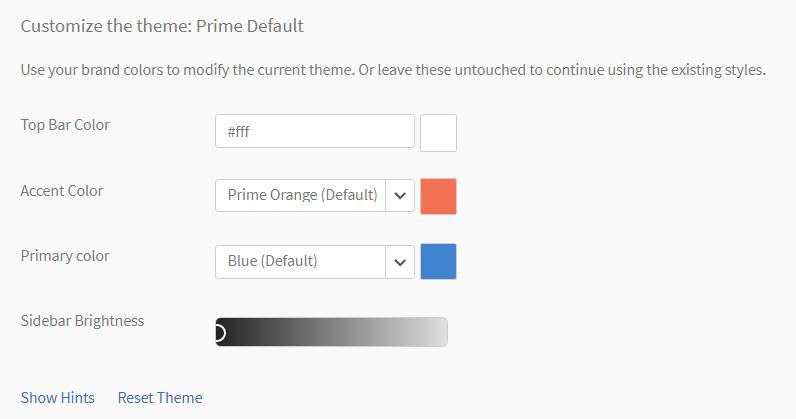

# Farbdesigns

Farbdesigns und Branding in Learning Manager

Mit Learning Manager können Sie das Aussehen der Anwendung ändern, um sie dem Branding Ihres Unternehmens anzupassen.

## Anpassen der Benutzeroberfläche

In dieser Schulung lernen Sie, wie Sie das Erscheinungsbild der Benutzeroberfläche an die Branding-Anforderungen eines Unternehmens anpassen können.

Wenn Sie die Schulung nicht starten können, schreiben Sie an <almacademy@adobe.com>.

## Branding {#branding}

Klicken **[!UICONTROL Branding]** im linken Bereich, um Ihren Organisationsnamen zu aktualisieren, die Subdomäne, Protokollstile und Designs zu ändern. Klicken **[!UICONTROL Bearbeiten]** neben jedem dieser Themen, um den Inhalt zu ändern.

## Logostile {#logostyling}

Klicken **[!UICONTROL Bearbeiten]** , um das Erscheinungsbild Ihres Logos und Firmennamens in der Learning Manager-Anwendung festzulegen.

Klicken Sie auf **[!UICONTROL Neues Logo hochladen]** und wählen Sie das Logo von Ihrem Computer. Sie können das Erscheinungsbild des Logos und den Unternehmensnamen nachstehend in der Vorschau anzeigen. Wählen Sie den Kopfzeilenstil und klicken Sie auf **[!UICONTROL Speichern]**.

## Designs {#themes}

Ein Set mit fünf repräsentativen Bildern wird bereitgestellt, um Ihre Farbdesignänderungen in der Vorschau anzuzeigen, bevor Sie sie in Ihre Anwendung übernehmen. Navigieren Sie durch diese Bilder, indem Sie auf die Symbole &lt; und > auf der rechten Seite der Bilder klicken, um sie in der Vorschau anzuzeigen. Alternativ dazu können Sie auch mit der rechten Maustaste auf die Navigationskreise am unteren Rand dieser Bilder klicken, um den Satz von Vorschaumomentaufnahmen zu durchsuchen.

**Wählen Sie ein Design aus** 

Klicken Sie auf **[!UICONTROL Hinweise anzeigen]** unterhalb dieses Abschnitts, um die Hinweise auf dem Bild wie unten gezeigt anzuzeigen.

*Anzeigen von Hinweisen zu einem Design*

Die Lern-Manager-Anwendung bietet fünf Farbdesignoptionen für ihre Benutzer:

* Prime-Standard
* Kieselseine
* Fasching
* Herbst
* Winterhimmel
* Lebhaft

>[!NOTE]
>
>Das Lebhaft -Design ist barrierefrei.

*Anpassen der Farben eines Designs*

Sie können die Farbe der oberen Leiste, die Akzentfarbe (z. B. Symbolfarbe im linken Bereich), die Primärfarbe und die Seitenleistenhelligkeit der Designs anpassen, mit Ausnahme des Prime-Standarddesigns.

Im Dialogfeld &quot; **[!UICONTROL Primärfarbe]** können Sie die Farbe auswählen, die für die immersive Benutzeroberfläche verwendet wird.

Für die Anpassung wählen Sie den Designtyp im linken Bereich aus und klicken Sie auf die Quadrate neben der Markenfarbe und Seitenleistensymbolfarben. Klicken Sie in der Seitenleiste auf Seitenleistenhelligkeit, ziehen Sie den Regler vorwärts oder rückwärts, um die Helligkeit anzupassen. Sehen Sie sich die Vorschau in den oben genannten Bildern an, wenn Sie diese Optionen ändern.

Klicken **[!UICONTROL Design zurücksetzen]** , um die ursprünglichen Einstellungen des Designs wiederherzustellen. Klicken **[!UICONTROL Speichern]** nach Abschluss der Änderungen.

**Live-Vorschau** 

Klicken Sie auf die **[!UICONTROL Live-Vorschau]** in der unteren linken Ecke des Designabschnitts. Ein Popupfenster wird wie folgt angezeigt:

*Das Popupmenü &quot;Live-Vorschau&quot;*

Wählen Sie das gewünschte Design aus der Dropdownliste aus, passen Sie die Einstellungen an und klicken Sie auf **[!UICONTROL Vorschau]**, um die Änderungen anzuzeigen, die in Ihrer Anwendung live sind. Jetzt können Sie alle Funktionen der Anwendung ausführen und die Änderungen ansehen. Sie können auch Ihre Rollen ändern, wenn Sie durch die Live-Vorschau navigieren. Wenn Sie mit den Änderungen zufrieden sind, können Sie zur Live-Designvorschau zurückkehren und auf **[!UICONTROL Design anwenden]**.

Während Sie die Änderungen in der Vorschau live anzeigen, wird das Popupmenü „Live-Design-Vorschau“ immer noch am unteren Fensterrand angezeigt. Sie können das Popupmenü minimieren.

## Mehrfaches Branding. {#multiple-branding}

So implementieren Sie mehrere Branding-Elemente:

1. Wählen Sie in der Admin-App **Branding** im linken Bereich.
1. Auswählen **Bearbeiten** im Abschnitt &quot;Mehrfaches Branding&quot;.
1. Wählen Sie die Umschaltfläche aus und aktivieren Sie sie.

### Interne Benutzer

1. Wählen Sie ein aktives Feld aus der Dropdownliste aus.
1. Je nach Auswahl können Sie den Namen der Organisation ändern und ein neues Logo für die Benutzer hochladen.

### Externe Benutzer

1. Wählen Sie ein aktives Feld aus der Dropdownliste aus.
1. Je nach Auswahl können Sie den Namen der Organisation ändern und ein neues Logo für die Benutzer hochladen.

>[!NOTE]
>
>Interne Benutzer können aktive Felder wie &quot;Externe Benutzer&quot; haben (z. B. muss der Administrator das Multi-Branding für die internen Benutzer und die externen Benutzer separat hinzufügen, indem er die Werte der aktiven Felder separat auswählt).

#### Wichtige Anmerkungen

* Ein Administrator kann das Branding auf mehreren Ebenen für diesen aktiven Feldwert hinzufügen, und der externe Benutzer kann sich mit verschiedenen Mechanismen anmelden (SSO Single (Okta, Mini Orange), Social Login) und überprüfen, ob das Multi-Branding anwendbar ist.
* Ein externer Benutzer hat ein aktives Feld und einen aktiven Feldwert, wie der interne Benutzer: Obwohl er freigegeben ist, muss er vom Administrator separat im Multi-Branding angegeben werden. Nach der Anwendung kann sich ein externer Benutzer mit verschiedenen Mechanismen anmelden (SSO Single (Okta, Mini Orange), Social Login) und überprüfen, ob das Multi-Branding anwendbar ist.
* Ein externer Benutzer, der von einem Profil in ein anderes verschoben wurde: Das Verschieben des externen Benutzers von einem Profil in ein anderes Profil hat keine Auswirkungen auf den Wert des aktiven Felds für den Benutzer, es sei denn, der Wert des aktiven Felds wird vom Administrator oder vom externen Benutzer während der Anmeldung oder Registrierung bearbeitet/gelöscht.

>[!NOTE]
>
>Wenn mehrere Brandings für interne und externe Benutzer festgelegt sind, mit demselben aktiven Feldnamen, mit demselben aktiven Feldwert, aber mit unterschiedlicher Konfiguration. In diesem Fall wäre es empfehlenswert, dieselbe Konfigurationseinstellung (Logo, Thema, Name der Organisation) zu verwenden, um Diskrepanzen zu vermeiden.

## Konto anpassen {#customize}

Mit Adobe Learning Manager können Sie Ihr Konto anpassen, um ein besseres Benutzererlebnis zu bieten.

In der folgenden Liste werden die Komponenten angezeigt, die angepasst werden können. Wenden Sie sich zum Anpassen des Kontos an den Lern-Manager  [Stütze](mailto:captivateprimesupport@adobe.com).

<table>
 <tbody>
  <tr>
   <td>
    
<b>Anpassen</b>
</td>
   <td>
    
<b>Was wird empfohlen</b>
</td>
  </tr>
  <tr>
   <td>
    
Passen Sie die Farben der Schulungskarten an
</td>
   <td>
    
 

    <ul>
     <li>Nur bis zu 12 benutzerdefinierte Farben. </li>
     <li>Farben werden auf alle Lernobjekte angewendet. Die Farben werden nacheinander auf alle Lernobjekte (Schulungen) angewendet, und der hexadezimale Farbcode ist das erforderliche Format für alle Farben, z. B. #ffffff.</li>
     <li>Wenn nur eine Farbe angegeben ist, wird diese Farbe auf alle Lernobjekte angewendet.</li>
    </ul>
    
 
</td>
  </tr>
  <tr>
   <td>
    
Cursor-Bild
</td>
   <td>
    
Das benutzerdefinierte Bild wird angezeigt, wenn sich ein Benutzer auf einem Lernobjekt befindet. 

    <ul>
     <li>Das angewendete benutzerdefinierte Bild wird angezeigt, sobald ein Benutzer die Maus über die Lern-Manager-Webseite bewegt. </li>
     <li>Empfohlene Größe - 16x16 oder 24x24 px</li>
     <li>Empfohlenes Bildformat - PNG, JPG</li>
    </ul></td>
  </tr>
  <tr>
   <td>
    
Bild für Fortschrittsymbol
</td>
   <td>Wird beim Navigieren zwischen Seiten angezeigt. Präsent an Stellen, an denen Sie das Fortschritts-GIF mit den vier Quadraten sehen. 
    <ul>
     <li>Empfohlene Größe - kleiner oder gleich 32x32 px</li>
     <li>Empfohlenes Bildformat - GIF, PNG, JPG</li>
    </ul>
    
 
</td>
  </tr>
  <tr>
   <td>
    
Schriften
</td>
   <td>
    
Zum Anwenden der Schriftarten ist ein CDN erforderlich. Außerdem müssen Sie die Schriftfamilie freigeben, die angewendet werden soll.

    
<b>Hinweis:</b> Die Schriftfamilie muss in allen Browsern unterstützt werden.
</td>
  </tr>
  <tr>
   <td>
    
Hintergrundbild
</td>
   <td>
    
Ein Hintergrundbild ist nur in der Teilnehmerrolle sichtbar. 

    
Sie benötigen das Bild, das Sie auf den Hintergrund des Teilnehmers anwenden müssen.

    <ul>
     <li><b>Empfohlenes Bildformat:</b> PNG, JPG, JPEG</li>
     <li><b>Empfohlene Größe: </b>1400 x 908 px</li>
    </ul></td>
  </tr>
 </tbody>
</table>

## Konfigurieren der Empfehlungseinstellungen {#configurerecommendationsettings}

Ein **Branding** > **Allgemein** können Sie Empfehlungsbereiche für interne und externe Teilnehmer konfigurieren und den Teilnehmern die Auswahl von Kenntnissen auf der Teilnehmer-Startseite ermöglichen.

Im Fenster &quot; **Allgemein** &quot; haben Sie die folgenden Optionen:

<table>
 <tbody>
  <tr>
   <td>
    
Startseite für Teilnehmer
</td>
   <td>
    
Wählen Sie entweder <strong>Klassisch </strong>oder <strong>Immersiv</strong>. Wenn Sie „Immersiv“ wählen, werden andere Optionen angezeigt.
</td>
  </tr>
  <tr>
   <td>
    
Schulungstyp 
</td>
   <td>
    
Wählen Sie entweder <strong>Benutzerdefiniert </strong>oder <strong>Branchenspezifisch</strong>. Bei weniger als 1.000 Teilnehmern wird das gesamte Konto als ein einziger Bereich betrachtet. Die Empfehlung basiert auf allen Teilnehmern. 
</td>
  </tr>
  <tr>
   <td>
    
Einstellung des Empfehlungsumfangs 
</td>
   <td>
    
Wählen Sie mindestens ein aktives Feld aus. Für <strong>Benutzerdefiniert</strong> können Sie maximal ein aktives Feld auswählen. Für <strong>Branchenspezifisch</strong>können Sie maximal fünf aktive Felder auswählen. 
</td>
  </tr>
  <tr>
   <td>
    
Teilnehmern das Erkunden von Interessensbereichen ermöglichen
</td>
   <td>
    
Nur für klassisches Benutzeroberfläche. Auswählen <strong>Ja </strong>oder <strong>Nein</strong>. 
</td>
  </tr>
  <tr>
   <td>
    
Benutzer zum Auswählen von Interessenbereichen (Kenntnissen) auffordern  
</td>
   <td>
    
Nur für immersive Benutzeroberfläche. Auswählen <strong>Ja</strong> oder <strong>Nein</strong>. 
</td>
  </tr>
 </tbody>
</table>
