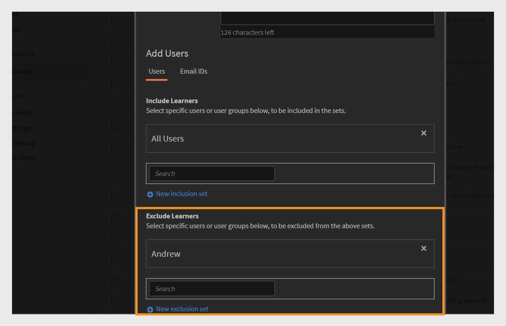
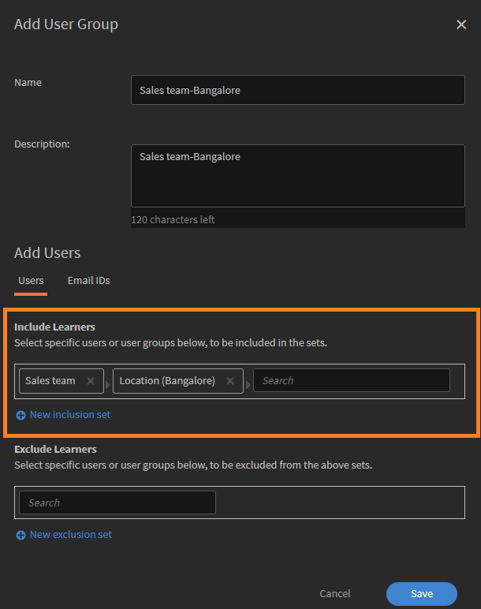

# Benutzergruppen in Adobe Learning Manager

Benutzergruppen in Adobe Learning Manager helfen Ihnen dabei, Teilnehmer anhand gängiger Attribute wie Abteilung, Standort oder Rolle zu organisieren. Durch das Gruppieren von Benutzern ist es einfacher, Kurse zuzuweisen, Berechtigungen zu verwalten und den Lernfortschritt für mehrere Benutzer gleichzeitig zu verfolgen.

>[!INFO]
>
>In dieser Schulung der ALM Academy erfahren Sie, wie Sie eine Benutzergruppe anhand von Namen, E-Mail-IDs und der Kombination mehrerer automatisch generierter Benutzergruppen erstellen.   

## Typen von Benutzergruppen

Adobe Learning Manager unterstützt die folgenden Benutzergruppen:

1. **Automatisch generierte Benutzergruppen:** In Adobe Learning Manager erstellt das System automatisch einige Benutzergruppen basierend auf Benutzerrollen und -attributen. Zu diesen systemdefinierten Gruppen gehören &quot;Alle Autoren&quot;, &quot;Alle Administratoren&quot;, &quot;Alle Teilnehmer&quot; und &quot;Alle Manager&quot;. Adobe Learning Manager generiert diese Gruppen, um Benutzer anhand ihrer Rolle zu organisieren. Sie können diese systemdefinierten Gruppen nicht umbenennen oder löschen.

2. **Benutzerdefinierte Benutzergruppen:** In Adobe Learning Manager können Administratoren benutzerdefinierte Benutzergruppen erstellen, um Teilnehmer basierend auf bestimmten Kriterien zu organisieren. Diese Gruppen sind dynamisch und fügen automatisch Benutzer hinzu, die die definierten Bedingungen erfüllen. Benutzerdefinierte Gruppen helfen dabei, zielgerichtete Lernpfade zuzuweisen, benutzerdefiniertes Branding anzuwenden und zielgerichtete Berichte zu erstellen. Sie sind ein flexibles Tool für die Verwaltung und Personalisierung des Lernerlebnisses.

## Erstellen einer benutzerdefinierten Benutzergruppe

Administratoren erstellen Benutzergruppen manuell, um Benutzer basierend auf definierten Attributen zu organisieren. Diese Gruppen können dynamisch sein und automatisch Benutzer hinzufügen, die die angegebenen Kriterien erfüllen. Benutzergruppen vereinfachen Aufgaben wie das Zuweisen von Lernpfaden, das Anwenden von benutzerdefiniertem Branding und das Generieren zielgerichteter Berichte.

Erstellen einer benutzerdefinierten Benutzergruppe:

1. Wählen Sie auf der Administrator-Homepage **Benutzer** aus.
2. Wählen Sie **Benutzergruppen** aus, und wählen Sie dann **Hinzufügen** aus.

   
   _Schaltfläche zum Hinzufügen einer neuen Benutzergruppe auf der Benutzergruppenseite_

3. Geben Sie den Gruppennamen und die Beschreibung ein.

   
   _Eingabefelder zum Eingeben des Gruppennamen und der optionalen Beschreibung_

## Benutzer zur Benutzergruppe hinzufügen

Administratoren können Benutzer auf zwei Arten zu einer Benutzergruppe hinzufügen:

### Benutzerbereich

Administratoren können die Einbeziehungs- und Ausschlusssätze verwenden, um Benutzer oder Benutzergruppen im Abschnitt Benutzer hinzuzufügen oder zu entfernen.

* **Einbeziehungssätze** fügen Benutzer einer benutzerdefinierten Benutzergruppe hinzu. Sie können eine oder mehrere Benutzergruppen einschließen, und Adobe Learning Manager verwendet Logik (UND/ODER), um zu entscheiden, welcher Benutzer eingeschlossen werden soll. Weitere Informationen zur UND/ODER-Logik finden Sie in diesem [Abschnitt](#_Inclusion_and_exclusion).
* **Ausschlusssätze** entfernen Benutzer aus der Gruppe, selbst wenn sie Teil des Einschlusssatzes waren. Dadurch wird die Benutzerliste der Gruppe verfeinert.

Benutzer zur Gruppe hinzufügen:

1. Suchen und wählen Sie Benutzer oder vorhandene Benutzergruppe im Feld **Teilnehmer einschließen** aus.

_Einschlusseinstellungen zum Hinzufügen bestimmter Benutzer oder Gruppen zu einer benutzerdefinierten Benutzergruppe_

### Abschnitt &quot;E-Mail-IDs&quot;

1. Geben Sie die E-Mail-Adressen der Benutzer im Komma-, Semikolon- oder Zeilenumbruchformat ein, um die Benutzer der Gruppe hinzuzufügen.

2. Wählen Sie **E-Mail-IDs validieren**.

   
   _Wählen Sie E-Mail-IDs validieren aus, um die eingegebenen E-Mail-IDs zu validieren_

   Es wird ein Fehler angezeigt, wenn Adobe Learning Manager nicht über die E-Mail-ID verfügt oder wenn die E-Mail-ID falsch ist.

   
   _Feld zum manuellen Eingeben mehrerer E-Mail-Adressen zum Hinzufügen von Benutzern zu einer Gruppe_

3. Wählen Sie **Speichern** aus, um die Gruppe zu erstellen.

## Benutzer aus der Gruppe ausschließen

Administratoren können bestimmte Benutzer von einer Benutzergruppe ausschließen, selbst wenn sie die Kriterien der Gruppe erfüllen. Dies ist hilfreich, wenn Sie Ausnahmen vornehmen möchten, z. B. verhindern möchten, dass bestimmte Benutzer zugewiesene Kurse erhalten oder in Berichten angezeigt werden, die mit dieser Gruppe verknüpft sind.

So schließen Sie beim Erstellen einer benutzerdefinierten Benutzergruppe bestimmte Benutzer oder ganze Benutzergruppen aus:

1. Wählen Sie alle **Benutzergruppen** aus, und wählen Sie dann **Hinzufügen** aus.
2. Navigieren Sie zum Abschnitt **Teilnehmer ausschließen**.
3. Wählen Sie die Benutzer oder Gruppen aus, die Sie ausschließen möchten.

_Ausschlusseinstellungen zum Entfernen von Benutzern oder Gruppen aus einer benutzerdefinierten Gruppe_

## Gruppenmitglieder anzeigen

Administratoren können eine Liste von Benutzern in einer Benutzergruppe anzeigen, einschließlich Details wie Name, E-Mail-ID und Status. Anzeigen der Benutzerliste

1. Wählen Sie **Benutzer** und anschließend **Benutzergruppen** aus.
2. Wählen Sie eine Gruppe aus, und wählen Sie dann den Wert im Feld **Nein aus. der Spalte Personen**.

_Liste der Benutzer, die derzeit in einer ausgewählten Benutzergruppe enthalten sind_

_Liste der in der ausgewählten Benutzergruppe verfügbaren Benutzer_

## Gruppenmitglieder herunterladen

Administratoren können eine Liste von Gruppenmitgliedern herunterladen, um Benutzerdetails wie Name, E-Mail-Adresse, Status, hinzugefügtes Datum (UTC-Zeitzone), Löschdatum (UTC-Zeitzone) und Datum der letzten Anmeldung (UTC-Zeitzone) zu überprüfen. Dies hilft bei der Verfolgung, Berichterstellung und Prüfung der Gruppenmitgliedschaft.

1. Wählen Sie **Benutzer** und anschließend **Benutzergruppen** aus.
2. Wählen Sie das Downloadsymbol neben einer Gruppe aus, um den Bericht als CSV-Datei zu exportieren.

_Downloadsymbol zum Exportieren von Gruppenmitgliedsdaten als CSV-Datei_

Im Folgenden sind die Spalten des Gruppenmitgliedsberichts aufgeführt:

* **Name**: Name des Benutzers
* **E-Mail**: E-Mail-ID des Benutzers
* **Status**: Status des Benutzers (registriert oder nicht registriert).
* **Hinzugefügtes Datum (UTC-Zeitzone)**: Datum, an dem der Benutzer in der UTC-Zeitzone hinzugefügt wurde.
* **Löschdatum (UTC-Zeitzone)**: Datum, an dem der Benutzer in der UTC-Zeitzone gelöscht wurde.
* **Letztes Anmeldedatum (UTC-Zeitzone)**: Datum, an dem der Benutzer zuletzt in der UTC-Zeitzone angemeldet ist.

_CSV-Beispieldatei enthält die Benutzerdetails_

## Benutzergruppe bearbeiten

Administratoren können Gruppen bearbeiten, um ihren Namen, ihre Beschreibung oder andere Details zu ändern.

Bearbeiten einer Benutzergruppe

1. Wählen Sie **Benutzer** auf der Startseite des Administrators aus.
2. Wählen Sie **Benutzergruppen** aus.
3. Wählen Sie die Benutzergruppe aus, die Sie bearbeiten möchten.
4. Nehmen Sie die erforderlichen Änderungen vor, z. B. den Namen, die Beschreibung oder andere Details aktualisieren.
5. Wählen Sie **Speichern**, um die Änderungen anzuwenden. Die Änderungen werden auf die Benutzergruppe angewendet.

_Felder zum Ändern des Namens, der Beschreibung oder der Mitgliedschaftsregeln der Benutzergruppe_

## Benutzergruppe löschen

Administratoren können Benutzergruppen löschen, die nicht mehr benötigt werden, um die Gruppenliste organisiert und auf dem neuesten Stand zu halten.

Löschen einer Benutzergruppe:

1. Wählen Sie **Benutzer** und anschließend **Benutzergruppen** aus.
2. Wählen Sie die Gruppe aus, die Sie löschen möchten.
3. Wählen Sie **Aktionen** und anschließend **Löschen** aus.

   
   Option _Löschen im Menü &quot;Aktionen&quot; zum Entfernen einer Benutzergruppe_

4. Bestätigen Sie den Löschvorgang, wenn Sie dazu aufgefordert werden. Die Benutzergruppe wird aus Adobe Learning Manager gelöscht.

## Benutzergruppenbericht herunterladen

Die Benutzergruppenberichte von Adobe Learning Manager geben Administratoren und Managern Einblicke in die Leistung verschiedener Benutzergruppen, z. B. Abteilungen, Rollen oder externe Partner. Anhand dieser Berichte können Sie den Lernfortschritt, die Kursabschlussraten und die Interaktionsniveaus gruppenübergreifend vergleichen.

So laden Sie den Bericht herunter:

1. Wählen Sie **Benutzer** und anschließend **Benutzergruppen** aus.
2. Wählen Sie **Aktionen** und anschließend **Benutzergruppenbericht herunterladen**.

_Option zum Herunterladen von Informationen und Metadaten auf Gruppenebene aus dem Menü &quot;Aktionen&quot;_

Dieser Bericht umfasst:

| Spalte | Beschreibung |
|---|---|
| Benutzergruppentyp | Die Kategorie der Benutzergruppe, z. B. automatisch generierte oder benutzerdefinierte Gruppe. |
| Name | Der Name, der der Benutzergruppe zugewiesen ist. |
| Beschreibung | Eine kurze Erläuterung des Zwecks oder des Umfangs der Benutzergruppe. |
| Erstellt von (Name) | Der vollständige Name des Administrators, der die Gruppe erstellt hat. |
| Erstellt von (E-Mail) | Die E-Mail-Adresse des Administrators, der die Gruppe erstellt hat. |
| Erstellt am (UTC TimeZone) | Datum und Uhrzeit der Erstellung der Gruppe, angezeigt in UTC (Coordinated Universal Time). |
| Anzahl der Benutzer | Die Gesamtzahl der Benutzer, die derzeit in der Gruppe enthalten sind. |

_Benutzergruppenbericht enthält alle Felder_

## Einschluss- und Ausschlussregeln für das Erstellen benutzerdefinierter Benutzergruppen

Wenn Sie eine **benutzerdefinierte Benutzergruppe** erstellen, indem Sie automatisch generierte oder vorhandene Benutzergruppen hinzufügen, wendet Adobe Learning Manager bestimmte **Einschluss- und Ausschlussregeln** an, die auf der **UND/ODER-Logik** basieren. Diese Regeln hängen davon ab, wie Benutzergruppen in den Einbeziehungs- und Ausschlussgruppen kombiniert werden.

Sie können eine oder mehrere automatisch generierte Benutzergruppen zum Einbeziehungsset hinzufügen. Die angewendete Logik hängt davon ab, wie Sie diese Gruppen auswählen:

### UND-Logik in Benutzergruppen verwenden

Wenn Sie mehrere Benutzergruppen innerhalb eines Einbeziehungssatzes auswählen, müssen Benutzer alle Bedingungen erfüllen, um einbezogen zu werden.

Beispiel:

* Vertriebsteamgruppe: 120 Benutzer
* Standort (Bangalore) Gruppe: 80 Benutzer
* Häufige Benutzer in **beiden** Gruppen: 40 Benutzer

Adobe Learning Manager verwendet die UND-Logik, um eine Gruppe mit nur 40 Benutzern zu erstellen. Diese Benutzer sind Teil des Vertriebsteams und befinden sich ebenfalls in Bangalore, wobei beide Bedingungen erfüllt werden.

_Beispiel, in dem mehrere Gruppen mit UND-Logik kombiniert werden_

### ODER-Logik in Benutzergruppen verwenden

Wenn Sie Benutzergruppen in separaten Einbeziehungssätzen hinzufügen, werden alle Bedingungen erfüllende Benutzer eingeschlossen. Beispiel:

* Vertriebsteamgruppe: 120 Benutzer
* Standort (Bangalore) Gruppe: 80 Benutzer
* Benutzer in beiden Gruppen insgesamt: 160 Benutzer (einige Benutzer können in beiden Gruppen sein)

Wenn Sie die OR-Logik verwenden, fügt Adobe Learning Manager Benutzer hinzu, die entweder im Vertriebsteam oder in Bangalore ansässig sind. Dies bedeutet, dass Benutzer einbezogen werden, die eine der beiden Bedingungen erfüllen. Daher umfasst die Gruppe 160 Benutzer, nachdem Duplikate entfernt wurden.

_Beispiel, in dem mehrere Gruppen mit ODER-Logik kombiniert werden_
