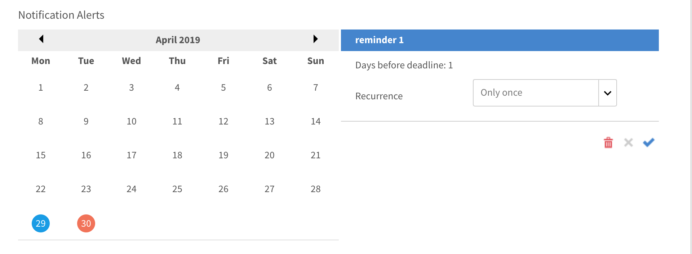

# Benachrichtigungen

Die Benachrichtigungsfunktion gilt für alle Benutzer von Adobe Learning Manager. Jeder Benutzer erhält jedoch basierend auf seiner Rolle in verschiedenen Szenarien unterschiedliche Benachrichtigungen. Alle Warnungen und Benachrichtigungen an Benutzer werden über das Popup-Dialogfeld für Benachrichtigungen angezeigt.

## Zugriff auf Benachrichtigungen {#accessnotifications}

Die Benutzer können Benachrichtigungen anzeigen, indem sie in der rechten oberen Ecke des Fensters auf das Benachrichtigungssymbol klicken. Dieses Popup-Dialogfeld zeigt Hervorhebungen aller Benachrichtigungen zusammen mit dem Zeitpunkt des Auftretens mit einer Bildlaufleiste an. Um weitere Informationen über alle Benachrichtigungen anzuzeigen, klicken Sie am unteren Rand des Popupfensters auf „Alle Benachrichtigungen einblenden“. Die Benachrichtigungsseite wird angezeigt.

Die markierte Zahl über dem Benachrichtigungssymbol gibt die Anzahl der neuesten Benachrichtigungen an. Wenn beispielsweise seit Ihrer letzten Anmeldung fünf Benachrichtigungen neu eingegangen sind, wird über dem Benachrichtigungssymbol die Zahl 5 angezeigt. Wenn Sie die neuesten Benachrichtigungen gelesen haben, wird diese Zahl ausgeblendet.

## Benachrichtigungstypen für Administratoren {#typesofnotificationsforadministrators}

Administratoren erhalten Benachrichtigungen in folgenden Fällen:

* Immer, wenn eine CSV-Benutzerliste erfolgreich hochgeladen wurde.
* Immer, wenn der Upload einer CSV-Benutzerliste fehlgeschlagen ist. Der Administrator erhält eine Meldung mit der Fehlerursache.
* Der Administrator kann darüber hinaus Benachrichtigungsmeldungen für Kurse und Lernprogramme für einzelne Instanzen einrichten. In diesem Fall erhält der Administrator die Benachrichtigungen anhand der auf Instanzenebene ausgewählten Häufigkeit.

>[!NOTE]
>
>Wenn ein Administrator zusätzlich zu seiner Rolle über Autoren- oder Managerberechtigungen verfügt, erhält der Administrator Benachrichtigungen für jede Rolle.

Die folgende Abbildung zeigt das Beispiel eines Benachrichtigungsfensters für die Administratorrolle:

*Administratorbenachrichtigungen anzeigen*

In diesem Popupfenster werden Markierungen aller Benachrichtigungen zusammen mit dem Zeitpunkt des Auftretens und einer Bildlaufleiste angezeigt. Die Anzahl der neuen Benachrichtigungen wird durch die markierte Zahl oben am Benachrichtigungssymbol angezeigt. Wenn beispielsweise seit Ihrer letzten Anmeldung fünf Benachrichtigungen neu eingegangen sind, wird über dem Benachrichtigungssymbol die Zahl 5 angezeigt. Wenn Sie die neuesten Benachrichtigungen gelesen haben, wird diese Zahl ausgeblendet.

Klicken Sie auf den Link **[!UICONTROL Alle Benachrichtigungen anzeigen]** am unteren Rand des Benachrichtigungs-Popup-Fensters, um alle Benachrichtigungen auf einer separaten Seite anzuzeigen. Auf der Benachrichtigungsseite sehen Sie Folgendes:

* **Alle Benachrichtigungen**: Hier können Sie alle Benachrichtigungen anzeigen
* **Ausstehend**: Ausstehende Benachrichtigungen hier anzeigen
* **Diskussion**: Suchen Sie nach Kursen, um die Diskussionen anzuzeigen.

## Richten Sie mehrstufige Eskalationsbenachrichtigungen ein {#setupmultilevelescalationnotifications}

Eskalations-E-Mails, wenn die Teilnehmer Fristen nicht einhalten, können an den Manager und einen Skip-Manager gesendet werden. Sie können mehrstufige Eskalationsbenachrichtigungen für den nicht abgeschlossenen Kurs während des Vorgangs zum Erstellen eines Kurses oder sogar nach dessen Erstellung einrichten. Eskalationsbenachrichtigungen können so eingerichtet werden, dass sie regelmäßig an einen Manager oder einen Skip-Manager gesendet werden.

1. Melden Sie sich als Administrator oder Autor an und klicken Sie auf „Kurse“.
1. Wählen Sie den Kurs aus, für den Sie die Eskalationsbenachrichtigungen ändern möchten, und klicken Sie auf **[!UICONTROL Kurs anzeigen]**.

   

   *Wählen Sie die Option &quot;Kurs anzeigen&quot; aus.*

1. Klicken Sie auf **[!UICONTROL Instanzen]** > **[!UICONTROL Benachrichtigungswarnungen]**.

   

   *Wählen Sie die Option &quot;Benachrichtigungswarnungen&quot; aus.*

1. Ein Kalender wird angezeigt, der die festgelegte Frist für den rot hervorgehobenen Kurs angibt. Klicken Sie auf das hervorgehobene Datum, um anzuzeigen, dass die Erinnerungen für den Teilnehmer eingestellt sind.

   

   *Fristerinnerungen anzeigen*

1. Legen Sie Erinnerungen fest, indem Sie Fristen vor dem Stichtag auswählen. Auf diese Weise können Sie Erinnerungen für den Teilnehmer zur bevorstehenden Frist einrichten.

   

   *Termin für Fristerinnerung festlegen*

1. Wählen Sie ein Datum nach Ablauf der Frist aus, um einen Erinnerungsplan für den Teilnehmer und Eskalationsbenachrichtigungen an den Manager festzulegen.

   

   *Erinnerungen und Eskalationsdaten festlegen*

1. Wenn der Teilnehmer den Kurs auch nach der Eskalation an den Manager immer noch nicht abschließt, können Sie mit den Einstellungen zum Skip-Manager des Teilnehmers eskalieren. Klicken Sie auf ein Datum nach Ablauf der verlängerten Frist, wählen Sie die Wiederholung von Erinnerungen und die Anzahl der Tage für den Zeitplan aus, und wählen Sie im Dropdown-Menü **Eskalation** die Option **Manager und Manager der Überspringstufe** aus. Klicken Sie auf das blaue Häkchen, um die Benachrichtigungseinstellungen zu speichern.

   

   *Benachrichtigungseinstellungen speichern*

## Häufig gestellte Fragen {#frequentlyaskedquestions}

+++Wie richte ich Erinnerungsbenachrichtigungen für die Instanz ein?

Klicken Sie in einer Instanz auf Benachrichtigungswarnungen. Ein Kalender wird angezeigt, der die festgelegte Frist für den rot hervorgehobenen Kurs angibt. Klicken Sie auf das hervorgehobene Datum, um anzuzeigen, dass die Erinnerungen für den Teilnehmer eingestellt sind. Legen Sie die Erinnerungen wie in diesem [Abschnitt](user-notifications.md#Setupmultilevelescalationnotifications) fest.
+++
