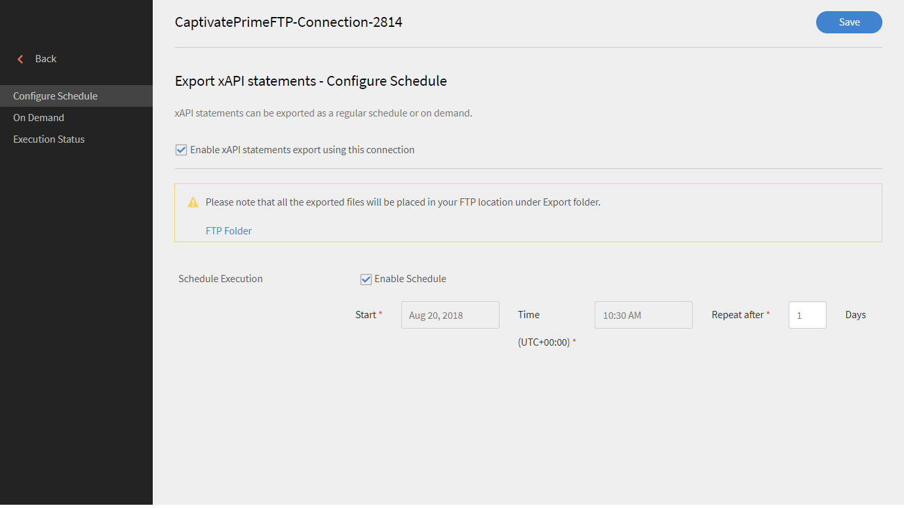

# xAPI in Learning Manager

## Was ist xAPI? {#whatisxapi}

Die Experience API (xAPI) ist eine E-Learning-Softwarespezifikation, die es ermöglicht, dass Lerninhalte und Lernsysteme so miteinander kommunizieren, dass alle Arten von Lernerfahrungen aufgezeichnet und verfolgt werden. Lernerfahrungen werden in einem Learning Record Store (LRS) aufgezeichnet. LRS können in traditionellen Lernmanagementsystemen (LMS) oder eigenständig existieren.

Weitere Informationen zu xAPI finden Sie unter [xAPIc-Spezifikationen](https://github.com/adlnet/xAPI-Spec).

## Wie unterstützt Learning Manager xAPI? {#howdoeslearningmanagersupportxapi}

Learning Manager hat einen integrierten Learning Record Store. Dieser LRS kann xAPI-Anweisungen von Inhalten akzeptieren, die in Learning Manager gehostet wurden. Er akzeptiert sogar xAPI-Anweisungen von Drittanbietern. Diese xAPI-Anweisungen werden in Learning Manager gespeichert und können dann aus Learning Manager heraus exportiert werden, um sie in einem Data-Warehousing-System eines Drittanbieters anzuzeigen.

## Wann verwendet man xAPI? {#whendoyouusexapi}

In zunehmendem Maße müssen Lernerfahrungen des Endbenutzers erfasst werden, die sich über mehrere Systeme erstrecken.  Es ist auch notwendig, die genaue Nutzung des Teilnehmers von Schulungsinhalten zu verfolgen. Dies geht über „Start“, „Wird ausgeführt“ und „Abschluss“ hinaus (das sind die einzigen von SCORM erfassten Attribute).

## Verwenden von xAPI im Lern-Manager {#usingxapiinprime}

### Anwendung einrichten {#setupyourapplication}

1. Melden Sie sich als Integrationsadministrator an. Wählen Sie **[!UICONTROL Anwendungen > Registrieren]**.

   

   *Startseite zum Registrieren einer Anwendung*

1. Registrieren Sie eine neue Anwendung.

   

   *Neue Anwendung registrieren*

1. Definieren Sie den Umfang für die Anwendung.

   * Wenn **[!UICONTROL Administratorrolle – Lese- und Schreibzugriff für xAPI]** aktiviert ist, kann der Administrator xAPI-Anweisungen und -Dokumente veröffentlichen und abrufen.
   * Wenn **[!UICONTROL Teilnehmerrolle – Lese- und Schreibzugriff für xAPI]** aktiviert ist, kann der Administrator xAPI-Anweisungen und -Dokumente veröffentlichen und abrufen.

1. Speichern Sie die Änderungen. Sie erhalten Ihre Entwickler-ID und Ihr Geheimnis.

**Endpunkte**:

Klicken Sie auf den folgenden Link, um das xAPI-Swagger-Dokument anzuzeigen:

[xAPI Swagger-Dokument](https://learningmanagereu.adobe.com/docs/primeapi/xapi/)

>[!NOTE]
>
>Die in Learning Manager unterstützte xAPI-Version ist 1.0.3.


## API-Authentifizierung {#apiauthentication}

Die Learning Manager-xAPI verwendet das OAuth 2.0-Framework zum Authentifizieren und Autorisieren Ihrer Clientanwendungen. Sobald Sie Ihre Anwendung registriert haben, können Sie clientId und clientSecret abrufen. Die Get-URL wird im Browser verwendet, da sie die Learning Manager-Benutzer mit ihren vorkonfigurierten Konten wie SSO oder Adobe ID authentifiziert.

```
GET https://learningmanager.adobe.com/oauth/o/authorize?client_id=<Enter your clientId>&redirect_uri=<Enter a url to redirect to>&state=<Any String data>&scope=<admin:xapi or learner:xapi>&response_type=CODE.
```

## Verfolgen von xAPI-Anweisungen als Learning Manager LO {#trackingxapistatementsasprimelo}

Als Autor können Sie nun ein xAPI-Modul auswählen, während Sie Kurse zur Überwachung der Benutzererfahrung außerhalb von Learning Manager erstellen. Sie können diese Funktion beispielsweise verwenden, um die Aktivitäten von Benutzern auf einer Plattform eines Drittanbieters zu bewerten, die für die Kursnutzung verwendet wird.

1. Verwenden Sie beim Erstellen eines **[!UICONTROL Aktivitätsmoduls]** in der Option **[!UICONTROL Typ]** das Popupmenü, um das **[!UICONTROL xAPI-basierte Modul auszuwählen.]**

   

   *Wählen Sie die Option &quot;xAPI-basiertes Modul&quot; aus.*

1. Sie werden aufgefordert, einen IRI bereitzustellen. Andernfalls wird er von Learning Manager automatisch generiert.

   Der IRI für eine Aktivität ist für ein Konto eindeutig. Das bedeutet, dass zwei Module im Learning Manager nicht denselben IRI haben können. In folgenden Fällen wird ein neuer IRI generiert:

   * Wenn ein Kurs mit dem xAPI-Modul kontoübergreifend freigegeben wird.
   * Wenn eine Zertifizierung mit dem xAPI-Modul wiederholt wird.


   Jede xAPI-Anweisung mit dem erwähnten IRI wird im obigen Modul verfolgt und spiegelt sich in den Learning Manager-Berichten wider.

1. Um die automatisch generierte IRI zu kopieren, besuchen Sie die Seite „Aktivitätsmodul“ erneut.
1. Veröffentlichen Sie das Modul.

**Zu beachtende Punkte:**

* Der Lern-Manager unterstützt derzeit nur mbox als Bezeichner. Andere Bezeichner wie mboz_sha1, openid , account werden nicht unterstützt.

* stateId und profileId sind UUIDs, wenn sie mit Learning Manager verwendet werden.
* Die PUT-Anforderung überschreibt das Dokument nicht für xAPIs-Agenten/Profile, Aktivitäten/Profile und Aktivitäten/Status.
* Nicht identifizierte Gruppen werden in Actor nicht unterstützt.
* Der Parameter &quot;related_activities&quot; wird in der GET-Anweisung nicht unterstützt.
* Die Parameter „format=ids&#39; &amp; &#39;format=canonical“ werden in GET-Anweisungen nicht unterstützt.
* Durch die Annullierung der xAPI-Anweisung werden keine Aktionen rückgängig gemacht, die im Lern-Manager aufgetreten sind, als die Anweisung veröffentlicht wurde.

## Berichte erstellen {#generatereports}

xAPI-Berichte können als Excel-Berichte generiert werden. Als Administrator öffnen Sie **[!UICONTROL Berichte > Excel-Berichte > xAPI-Aktivitätsbericht]**.

Der heruntergeladene Bericht ruft alle Informationen ab, die vom Teilnehmer und vom Administrator für eine Anweisung veröffentlicht wurden.

Dieselben Berichte können über FTP- und Box-Connectors für jede Integration von Drittanbietern erstellt/geplant werden. Führen Sie die folgenden Schritte aus:

Melden Sie sich als **Integrationsadministrator > FTP-/Box-Connector öffnen > Wählen Sie im linken Bereich den xAPI-Aktivitätsbericht** aus. Wählen Sie, ob Sie einen Bericht planen/generieren möchten.



*Bericht planen oder generieren*

* Wenn in der xAPI-Anweisung nur die Rohpunktzahl ohne die Höchstpunktzahl gesendet wird, wird die Quizpunktzahl in LT nicht angezeigt.

* Um die Prozentpunktzahl im Lern-Manager zu erhalten, werden skalierte Punktzahlen über xAPI gesendet.

## Beispielbericht {#samplereport}

[xAPI-Beispielbericht.](assets/xapireport8842560559890766717csv.zip)
