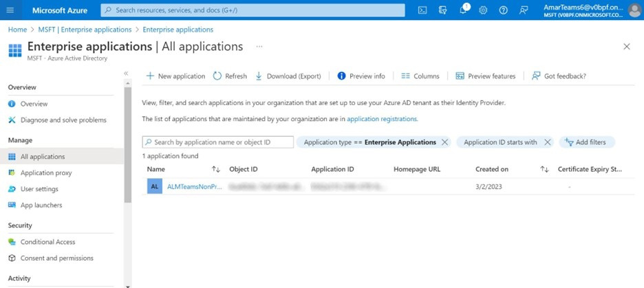

# Adobe Learning Manager-App für Microsoft Teams

## Einrichten

Das Einrichten von ALM in MS Teams umfasst drei Schritte und erfordert Unterstützung von ALM-Administrator(in) und Microsoft Azure-Administrator(in). In einigen Organisationen sind Azure-Administrator(in) und MS Teams-Administrator(in) nicht identisch, und sie benötigen daher auch zusätzliche MS Teams-Administrator(inn)en.

**ALM-Admin - Integrations-Admin-Rolle genehmigt Teams-App**

Nachdem der Integrationsadministrator die MS Teams-App genehmigt hat, ist die Adobe Learning Manager-App im MS Teams App Store verfügbar und die Teilnehmer können darauf zugreifen. Die App bietet jedoch weder Benachrichtigungen noch eine automatische Anmeldung und wird für die Teilnehmenden in MS Teams nicht angeheftet.

**Microsoft Azure Admin genehmigt die Berechtigung für ALM-App im Azure Dashboard**

Azure-Administrator(inn)en müssen die erforderlichen Berechtigungen für die ALM-App genehmigen. So kann die ALM-App Benachrichtigungen an MS Teams senden und eine automatische Anmeldung zulassen. Bei der automatischen Anmeldung müssen sich Benutzende nicht separat im Browser bei Adobe Learning Manager anmelden.

**MS Teams-Administrator erstellt eine Richtlinie für ALM-Teams**

MS Teams-Administrator(inn)en sollten in ihrem Admin Center die ALM-App für alle Benutzenden anheften und als globale Richtlinie zulassen. Wenn ALM nur von einer bestimmten Gruppe im Unternehmen verwendet wird, müssen MS Teams-Administrator(inn)en eine benutzerdefinierte Richtlinie auswählen und sie nur auf diese bestimmte Gruppe anwenden.

## Integration Admin-Rolle genehmigt Teams-App

Führen Sie die nachfolgenden Schritte aus:

1. Wählen Sie in der Integrationsadministrator-App **[!UICONTROL Anwendungen]** > **[!UICONTROL Highlights]** und wählen Sie **[!UICONTROL ALM Teams-App]**.

   
   *ALM Teams-App auswählen*

1. Wählen Sie in der oberen rechten Ecke des Bildschirms **[!UICONTROL Genehmigen]**.

   
   *Wählen Sie auf der Seite mit den App-Einstellungen Genehmigen .*

1. Auswählen **[!UICONTROL OK]** im angezeigten Dialogfeld.

   
   *Nach Genehmigung auf &quot;OK&quot; klicken*

1. Nach der Genehmigung wird &quot;ALM Teams App&quot; im Abschnitt &quot;Externe Apps&quot; angezeigt.

   
   *Die ALM Teams-App wird auf der Seite Apps angezeigt*

Jetzt können Benutzer auf MS Teams auf die ALM-App zugreifen.

## Microsoft Azure-Administrator(in) genehmigt die Berechtigung für ALM-App im Azure Dashboard

Führen Sie die nachfolgenden Schritte aus:

1. Navigieren Sie als Azure-Administrator zum Abschnitt Azure Active Directory verwalten im Azure-Dashboard.

   
   *Azure-Dashboard starten*

1. Fügen Sie den folgenden Link in ein separates Browserfenster ein:

   `https://login.microsoftonline.com/<tenantIdTobeReplaced>/oauth2/authorize?client_id=8d349d9f-bf59-4ece-8022-a41e87d81903&response_type=code&redirect_uri=https://learningmanager.adobe.com`

1. Ersetzen Sie im obigen Link `<tenantIdTobeReplaced>` mit der Mandanten-ID, die auf der Seite &quot;Übersicht&quot; unten verfügbar ist. Geben Sie die neue URL ein.

1. Fügen Sie die Adobe Learning Manager-App zu Ihren Azure-Anwendungen hinzu.

   
   *Zu Azure hinzufügen*

1. Wählen Sie die Registerkarte „Unternehmensanwendungen“ und dann „Alle Anwendungen“. ALMTeamsApp ist hier aufgelistet.

   
   *ALM-App anzeigen*

1. Klicken Sie auf die App und navigieren Sie zur Registerkarte Berechtigungen .

   
   *Registerkarte &quot;Berechtigungen&quot; anzeigen*

1. Wählen Sie auf der Registerkarte Berechtigungen &#39; **[!UICONTROL Administratorzustimmung für MSFT erteilen]**&#39;, um ALM-Teams-App-Berechtigungen zu erteilen.

   
   *Berechtigungen auswählen*

1. Auswählen **[!UICONTROL Akzeptieren]**.

   
   *&quot;Akzeptieren&quot; auswählen*

1. Nach der Erteilung erhalten die Teilnehmer über diese Berechtigungen die ALM-App, sodass sie sich im Hintergrund anmelden und Benachrichtigungen an die Teilnehmer in der MS Teams-App senden können.

   
   *Zugriff wird gewährt*

## MS Teams-Administrator(in) erstellt eine Richtlinie für die Teams-App

Führen Sie die nachfolgenden Schritte aus:

1. Als MS Teams-Administrator erstellen Sie im Admin Center eine Richtlinie zum Hinzufügen der Teams-App zur Teams-App Ihrer Teilnehmer.

   
   *Erstellen einer Richtlinie*

1. Navigieren Sie zum Abschnitt “Setup-Richtlinien“. Erstellen Sie eine globale Richtlinie und wählen Sie **[!UICONTROL Applikationen hinzufügen]** im Unterabschnitt Angeheftete Anwendungen .

   
   *Richtlinie hinzufügen*

1. Suchen Sie im folgenden Dialogfeld nach **[!UICONTROL Adobe Learning Manager]** und fügen Sie die App hinzu. Dadurch wird der Adobe-Lernmanager im Abschnitt &quot;Installierte Apps&quot; hinzugefügt.

   
   *Applikation installieren*

1. Speichern Sie diese Richtlinie. Dadurch ist die App für alle in der Organisation verfügbar.

Alternativ können Administrator(inn)en eine benutzerdefinierte Richtlinie anstelle einer globalen Richtlinie erstellen. Fügen Sie den Adobe-Lernmanager dieser benutzerdefinierten Richtlinie hinzu und wenden Sie die benutzerdefinierte Richtlinie dann nur auf die Benutzergruppen an, die auf den Adobe-Lernmanager zugreifen müssen.
