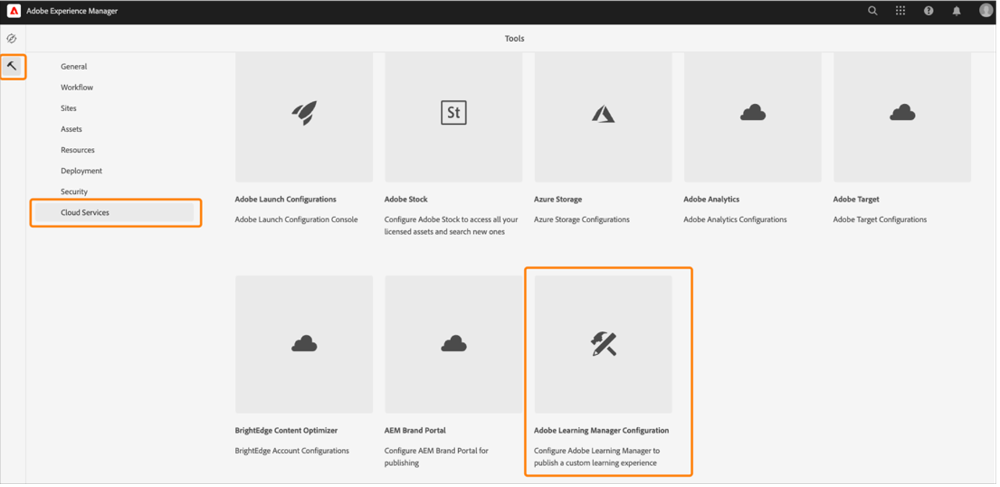
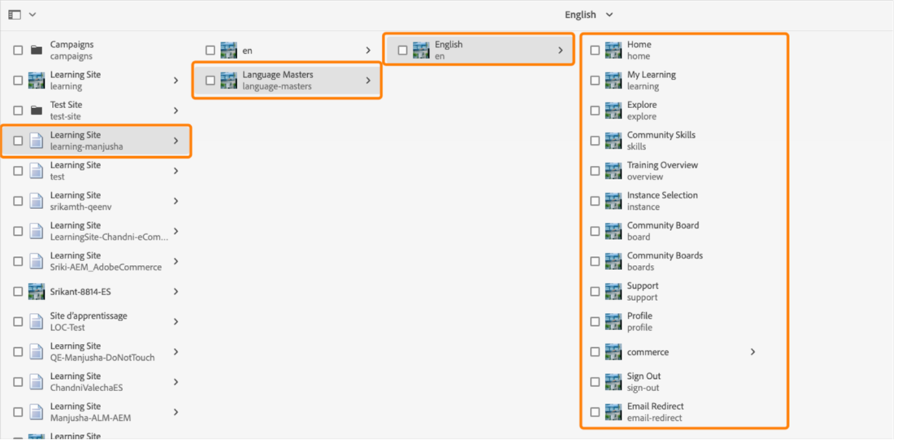
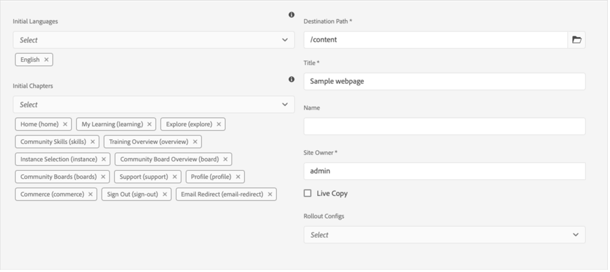

# Adobe Learning Manager-Referenzsite-Paket (ALM-Referenzsite) für AEM-Sites

Adobe Learning Manager (ALM) ist in Adobe Experience Manager-Sites (AEM) integriert. So können Sie mit minimalem Programmieraufwand Ihre eigene Website und gut reagierende Mobilgeräteoberflächen für Adobe Learning Manager erstellen. Mit dieser Integration können Sie angepasste Lernbenutzeroberflächen für Ihre Benutzenden erstellen.

Um eine solche Benutzeroberfläche zu erstellen, stellt ALM ein Adobe-Learning Manager-Referenzsite-Paket (ALM-Referenzsite-Paket) für AEM-Sites in Form einer ZIP-Datei bereit, die Sie auf Ihrer AEM-Sites-Instanz installieren können.

Das Paket enthält AEM-Sites-Webseitenvorlagen und -Websitekomponenten zusammen mit integrierbaren Widgets, z. B. Lernkatalog, integrierbare Widgets, Kalender usw.

Nachdem Sie das ALM-Referenzsite-Paket installiert haben, können Sie mit dem Erstellen einer Website für Adobe Learning Manager beginnen, die Sie auf Ihrer AEM-Sites-Instanz hosten können. Ihre Benutzenden können dann die Komponenten per Drag &amp; Drop auf die Website ziehen.

>[!IMPORTANT]
>
>Adobe Learning Manager (ALM)-Pakete für AEM Sites bieten einen Quick Start Code Block für die Implementierung. Dieses Paket wurde für Headless-Bereitstellungen entwickelt. Sobald Sie die bereitgestellte Code-Basis verwenden, liegt die Verantwortung für die Pflege und Entwicklung bei Ihnen, wie es bei Headless-Anwendungen auf Basis von Adobe Learning Manager üblich ist. Die zugrunde liegende API wird weiterhin von Adobe Learning Manager unterstützt.

## ALM-Referenzsite-Paket installieren

### Voraussetzungen

* Lizenzen für AEM-Sites und Adobe Commerce.
* AEM On-Premise 6.5 oder Adobe Experience Manager - Cloud Service
* Adobe Commerce 2.4.3

Nachdem Sie Ihre AEM-Sites-Umgebung gesichert haben, müssen Sie das ALM-Referenzsite-Paket installieren. Dieses Paket enthält AEM-Webseiten und Websitekomponenten, die das Erstellen der Lernplattform unterstützen.

Das Verweisstandortpaket wird im [**GitHub-Repository**](https://github.com/adobe/adobe-learning-manager-reference-site/releases/tag/1.0.0) gehostet.

Weitere Informationen finden Sie in der README-Datei.

## Anwendung in [!DNL Adobe Learning Manager] erstellen

Nach der Installation des AEM-Site-Pakets müssen Sie eine ALM-Anwendung konfigurieren, um Ihr Lernportal mit der AEM-Site zu verbinden.

Dieses Szenario gilt, wenn AEM mit [!DNL Adobe Learning Manager] verwendet wird.

Führen Sie die unten genannten Schritte aus:

1. Klicken Sie als Integrationsadministrator auf **[!UICONTROL Anwendungen]**.
1. Klicken Sie in der rechten oberen Ecke der Seite auf **[!UICONTROL Registrieren]**, um eine neue Anwendung zu erstellen.
1. Geben Sie auf der Seite &quot;Neue Anwendung registrieren&quot; die folgenden Details ein:

   1. Anwendungsname: Der Name der Anwendung, die Sie erstellen.
   1. URL: Die URL Ihrer Organisation.
   1. Domänen umleiten: Die Hosting-Domänen der AEM Website. Sie können auch Platzhalter angeben.
   1. Beschreibung: Die Beschreibung der Anwendung.
   1. Bereiche: Wählen Sie die Teilnehmerrollen &quot;Lesezugriff&quot; und &quot;Schreibzugriff&quot; aus.
   1. Nur für dieses Konto?: Wählen Sie &quot;Ja&quot;, wenn Sie die Anwendung für das vorhandene ALM-Konto verwenden möchten.

1. Nachdem Sie die Änderungen vorgenommen haben, klicken Sie auf &quot;Speichern&quot;.

Notieren Sie sich die angezeigten Anmeldeinformationen der Anwendung.

*Anwendungsanmeldeinformationen*

Klicken Sie zum Genehmigen der Anwendung auf **[!UICONTROL Genehmigen]**.

## Token abrufen

1. Klicken Sie auf der Registerkarte &quot;Entwicklerressourcen&quot; auf **[!UICONTROL Zugriffstoken für Tests und Entwicklung]**.

   

   *Zugriffstoken für Tests und Entwicklung auswählen*

1. Geben Sie die folgenden Details ein:

   
   *Geben Sie die Tokendetails ein*

   1. OAuth-Code abrufen: Geben Sie die Client-ID aus dem vorherigen Abschnitt ein und ändern Sie den Bereich. Klicken Sie auf Senden , um den OAuth-Code zu erhalten.
   1. Aktualisierungstoken abrufen: Geben Sie die Client-ID und den Schlüssel aus dem vorherigen Abschnitt ein. Geben Sie außerdem den OAuth-Code ein, den Sie aus dem vorherigen Schritt erhalten haben. Klicken Sie auf Senden.
   1. Zugriffstoken abrufen: Geben Sie die Client-ID und den Schlüssel aus dem vorherigen Abschnitt ein. Geben Sie außerdem das Aktualisierungstoken ein, das Sie aus dem vorherigen Schritt bezogen haben. Klicken Sie auf Senden.
   1. Details zum Zugriffstoken abrufen: Geben Sie das Zugriffstoken ein, das Sie aus dem vorherigen Schritt erhalten haben. Klicken Sie auf Senden.

1. Sie können die Details aus der folgenden JSON-Antwort abrufen. Die Antwort besteht aus dem Zugriffstoken, dem Aktualisierungstoken, der Benutzerrolle, der Konto-ID, der Benutzer-ID und der Zeit bis zum Ablauf. Notieren Sie sich das Aktualisierungstoken, da Sie es wiederverwenden.

## Konfigurieren des ALM-Kontos in AEM

1. Starten Sie Ihre AEM-Instanz.
1. Klicken Sie auf Einstellungen > Cloud Service.
1. Klicken Sie auf Adobe Learning Manager-Konfiguration.

   
   *Adobe Learning Manager-Konfiguration auswählen*

1. Klicken Sie auf &quot;Erstellen > Konfigurationsordner&quot;. Benennen Sie Ihren Ordner.

   
   *Konfiguration erstellen*

1. Wählen Sie im Lernprojekt die Konfiguration aus, die Sie erstellt haben.

1. Geben Sie die Details der Konfiguration ein.

   
   *Konfigurationsordner erstellen*

   1. Adobe Learning Manager-Modus: Wählen Sie aus, wie das Lernerlebnis für angemeldete und nicht angemeldete Teilnehmer gestaltet werden soll.
   1. Adobe Learning Manager-URL: Geben Sie die URL der ALM-Instanz ein, in der die Lerndienste gehostet werden.
   1. Konto-ID: Die ID des ALM-Kontos.
   1. Client-ID, geheimer Clientschlüssel und Token für die Autorenaktualisierung: Geben Sie die Anmeldeinformationen ein, die Sie beim Erstellen der Anwendung in ALM erhalten haben.
   1. Anpassung des Widgets: Weitere Informationen finden Sie unter [Integrieren in AEM](/help/migrated/integrate-aem-learning-manager.md) `.`

1. Speichern und schließen Sie die Konfiguration.

### AEM + Adobe Learning Manager (angemeldete/nicht angemeldete Benutzende)

Mit Adobe Learning Manager können Sie jetzt Ihre Produkte und Schulungen Ihren bestehenden und potenziellen Kunden und Partnern präsentieren, ohne dass eine Kontoerstellung oder Anmeldung erforderlich ist. Diese Funktion unterstützt Sie bei der Einführung von Produkten und Schulungen, indem sie Teilnehmenden eine schnelle und einfache Vorschau der Schulungen bietet, mit der Sie Produktfunktionen hervorheben und für sie werben können. So können Sie Ihre Produkte und Angebote potenziellen Kunden und Partnern effektiv präsentieren und die Produktwahrnehmung steigern. Der einfache Zugriff und die bessere Erreichbarkeit steigern das Interesse, und dies führt zu mehr Registrierungen für Schulungen und einer höheren Akzeptanz von Lernangeboten.

Mit diesem Arbeitsablauf können Teilnehmende eine Vorschau einer Schulung anzeigen, auf Schulungsinformationen zugreifen oder nach einer Schulung suchen, ohne sich bei Adobe Learning Manager anzumelden. Dieser Arbeitsablauf gilt nicht für die native Learning Manager-Benutzeroberfläche. (Er gilt NUR für AEM-Sites und andere Headless-Benutzeroberflächen.)

**Konfigurieren und Aktivieren des Lernplattformkonnektors**

Dieser Abschnitt unterstreicht die Schritte, die zum Konfigurieren und Aktivieren des folgenden Connectors erforderlich sind:

**Zugriff auf Schulungsdaten**

Mit diesem Connector kann Ihre auf AEM-Sites basierende oder sonstige benutzerdefinierte Headless-Benutzeroberfläche Schulungsinformationen abrufen und für die Teilnehmenden rendern und eine nahtlose Suche nach Schulungsinformationen durchführen, bevor oder nachdem sich ein Teilnehmer anmeldet.

Dieser Connector ist nur erforderlich, wenn Sie auf AEM-Sites basierende oder sonstige Headless-Benutzeroberflächen verwenden.

Der Connector exportiert Schulungsmetadaten in eine Datenspeicher- und Abruflösung sowie ein Suchaktivierungssystem. Daher können Sie Ihre auf AEM-Sites basierende oder sonstige benutzerdefinierte Headless-Benutzeroberfläche so konfigurieren, dass diese beiden Dienste verwendet werden können, um Schulungsdaten abzurufen, Webseiten zu rendern und den Teilnehmenden eine optimierte Schulungssuchfunktion zu bieten. Beispielsweise kann eine nicht angemeldete auf AEM-Sites basierende Benutzeroberfläche die exportierten Metadaten verwenden, um Teilnehmenden zu helfen, Seiten mit Schulungsinformationen zu suchen, zu durchsuchen und darauf zuzugreifen.

Aktivieren Sie diesen Connector, um Ihre auf AEM-Sites basierenden Webseiten zu erstellen und zu rendern und Ihren Teilnehmenden sowohl vor als auch nach der Anmeldung benutzerdefinierte Erlebnisse zu bieten. Aktivieren Sie diesen Connector, um Ihre auf AEM-Sites basierenden Webseiten zu erstellen und zu rendern und Ihren Teilnehmenden sowohl vor als auch nach der Anmeldung benutzerdefinierte Erlebnisse zu bieten.

* Adobe Learning Manager-CDN-Basis-URL: Geben Sie die Basis-URL des Datenabruf-CDN-Dienstpfads von der Verbindungsseite für den Zugriff auf Schulungsdaten ein.
* Admin-Aktualisierungstoken : Geben Sie das Aktualisierungstoken ein, das Sie im vorherigen Abschnitt festgelegt haben.
* URL der Schulungsmetadatenbasis : Geben Sie die Basis-URL der Suchfunktion und des Dienstpfads für den Datenabruf über die Schulungsdatenzugriffsseite ein.
* URL für Adobe Learning Manager-Registrierung: Geben Sie die vom Integrationsadministrator für das Konto generierte URL für die Selbstregistrierung ein, die von den Teilnehmenden zur Registrierung für die Schulung verwendet wird.

### AEM + Adobe Learning Manager + Adobe Commerce (angemeldete/nicht angemeldete Benutzer)

Adobe Learning Manager bietet jetzt Lösungen, mit denen Sie die Lernplattform nahtlos in Adobe Commerce integrieren können. Mit dieser Version können Sie Ihre nativen, auf AEM-Sites basierenden oder sonstigen Headless-Learning Manager-Benutzeroberflächen ganz einfach mit Adobe Commerce verbinden. Mit dieser Integration können Sie E-Commerce-Funktionen innerhalb Ihrer Lernplattform realisieren. Sie können Ihren Kunden und Geschäftspartnern jetzt kostenpflichtige Schulungen anbieten und Schulungskäufe ganz einfach auf nativen und nicht nativen Learning Manager-Benutzeroberflächen ermöglichen. Teilnehmende können auch eine Vorschau einer Schulung anzeigen, auf Schulungsinformationen zugreifen oder nach einer Schulung suchen, ohne sich bei Adobe Learning Manager anzumelden.

Ein Benutzer kann die bereits AEM Anwendung verwenden und sie genehmigen, anstatt eine zu erstellen.

* Adobe Learning Manager-CDN-Basis-URL: Geben Sie die Basis-URL des Datenabruf-CDN-Dienstpfads von der Adobe Commerce-Verbindungsseite ein.
* Adobe Commerce-URL: Geben Sie die URL der Adobe Commerce-Instanz ein, die Sie verwenden.
* GraphQL-Proxypfad - Die clientseitigen Learning Manager-Komponenten greifen direkt auf den Adobe Commerce GraphQL-Endpunkt zu, sodass ein CORS-Fehler auftreten kann. Um diesen Fehler zu vermeiden, müssen alle Aufrufe entweder vom gleichen Endpunkt wie AEM oder über einen Proxy, der CORS-Header hinzufügt, bereitgestellt werden.
* Adobe Commerce-Store-Name : Geben Sie den Adobe Commerce-Store-Namen ein, den Sie im vorherigen Abschnitt festgelegt haben.
* Adobe Commerce-Kundentoken-Lebensdauer (in Sekunden) : Geben Sie die Kundentoken-Lebensdauer ein, die den vordefinierten Zeitraum für eine Anmeldesitzung angibt.
* Admin-Aktualisierungstoken : Geben Sie das Aktualisierungstoken ein, das Sie im vorherigen Abschnitt festgelegt haben.

## Webseiten anpassen

Passen Sie Ihre Webseiten mithilfe der Website mit den AEM Referenzen und der verfügbaren Widgets an.

1. Starten Sie Ihre AEM-Instanz.
1. Klicken Sie auf Sites und öffnen Sie die Konfigurationsseite.
1. Klicken Sie auf **[!UICONTROL Lernsite]** > **[!UICONTROL Sprachmaster]** > **[!UICONTROL Englisch]**. Alle Webseiten des Projekts sind in diesem Ordner enthalten.

   
   *Alle Webseiten anzeigen*

1. Wählen Sie eine beliebige Vorlage aus, und klicken Sie auf **[!UICONTROL Bearbeiten]**.

1. Klicken Sie auf der Seite auf die Schaltfläche für Komponenteneinstellungen und ändern Sie die Eigenschaften der Komponente.

   
   *Schaltfläche &quot;Einstellungen auswählen&quot;*

1. Zeigen Sie eine Vorschau Ihrer Änderungen an oder veröffentlichen Sie die Seite.

## Erstellen von Webseiten

Neben den vom Referenzsite-Paket bereitgestellten Vorlagen, die Sie verwenden können, können Sie auch Webseiten erstellen, die auf den Vorlagen in AEM basieren.

1. Klicken Sie auf der AEM auf &quot;Erstellen&quot; > &quot;Seite&quot;.

1. Wählen Sie die Vorlage aus, die Sie anpassen möchten. Klicken Sie auf Weiter.

1. Geben Sie die Seiteneigenschaften ein.

   
   *Seiteneigenschaften*

1. Klicken Sie zum Erstellen der Seite auf **[!UICONTROL Erstellen]**.

1. Wählen Sie die neue Seite aus, und klicken Sie auf **[!UICONTROL Bearbeiten]**.

1. Fügen Sie eine Komponente auf der Seite ein, z. B. **Lernen - Inhalt**.

   
   *Nach Site filtern*

1. Wählen Sie die erforderlichen Katalogfilter aus, die auf der Seite angezeigt werden.

## Erstellen einer Website aus Blueprint

Das ALM Referenz-Site-Paket bietet einen &quot;Learning Site Blueprint&quot;, mit dem Sie eine Website für Ihre Lernplattform erstellen können. Mit AEM-Blueprints können Sie Webseiten direkt aus AEM-Sites-Komponenten erstellen. Sie müssen keine Vorlagen verwenden.

1. Klicken Sie auf der AEM Startseite auf **[!UICONTROL Sites]**.

1. Klicken Sie auf **[!UICONTROL Erstellen]** > **[!UICONTROL Standort]**.

1. Klicken Sie auf &quot;Website-Blueprint&quot;.

   

   *Site aus Blueprint erstellen*

1. Klicken Sie auf Weiter.

1. Geben Sie auf der Eigenschaftenseite die Metadaten für die Seite ein. Klicken Sie auf Erstellen.

   
   *Lernsite-Blueprint auswählen*

1. Klicken Sie auf den Hyperlink &quot;Startseite&quot;, um zur Startseite der von Ihnen erstellten Website zu navigieren. Auf dieser Seite können Sie die Widgets und Katalogkomponenten anpassen.

## Codieren Ihrer Website

Zusätzlich zur Verwendung der integrierten Vorlagen und dem von Grund auf neuen Erstellen einer Website mithilfe der WYSIWYG-Komponenten können Sie auch Code schreiben und die Website erstellen.

Der Code befindet sich im [GitHub-Repository der Referenzsite](https://github.com/adobe/adobe-learning-manager-reference-site).

Die Hauptbestandteile der Vorlage sind:

* core: Java-Paket, das alle Kernfunktionen wie OSGi-Dienste, Listener oder Scheduler sowie komponentenbezogenen Java-Code wie Servlets oder Anforderungsfilter enthält.
* ui.apps: enthält die /apps (und /etc)-Teile des Projekts, d. h. JS&amp;CSS-Client-Bibliotheken, Komponenten, Vorlagen.
* ui.content: enthält Beispielinhalte, die die Komponenten aus &quot;ui.apps&quot; verwenden
* ui.frontend: Enthält React-Komponenten.

Der gesamte Code ist im Repository enthalten, damit Sie sofort loslegen können.

## Importieren von Learning Manager-Komponenten und Hinzufügen zu vorhandenen Webseiten oder Vorlagen

Durch Installieren des AEM-Referenzsite-Pakets werden die Learning Manager-Komponenten Ihrer AEM-Sites-Instanz hinzugefügt. Standardmäßig können Sie diese Komponenten der vordefinierten Learning Site für das Webprojekt (Website) hinzufügen. Diese Komponenten sind auch auf der Website verfügbar, die Sie mit der Learning Site Blueprint erstellen.

Wenn Sie diese neu hinzugefügten Learning Manager-Komponenten jedoch in Ihrem vorhandenen Webprojekt oder Ihrer Website verwenden möchten, sollten Sie sie wie folgt importieren.

1. Installieren Sie das ALM-Referenzsite-Paket.

1. Öffnen Sie das Webprojekt und navigieren Sie zur HTML-Datei (für die Webseite oder Webvorlage, der Sie die Learning Manager-Komponenten hinzufügen möchten).
1. Teilnehmen an einem Meeting

   Öffnen Sie die HTML-Datei und fügen Sie der Seitenkomponente die folgenden Codeausschnitte hinzu, damit der Code ausgeführt wird, bevor die auf der Seite vorhandenen Lernkomponenten gerendert werden.

   *`<sly data-sly-use.configModel="com.adobe.learning.core.models.GlobalConfigurationModel"/>`*
   *`<meta name="cp-config" content="${configModel.config}" />`*

   Mit dem vorhergehenden Code wird die zugeordnete Konfiguration dem für das Rendern der Lernkomponenten erforderlichen Meta-Tag der Seite hinzugefügt. Weitere Informationen finden Sie unter [Adobe Learning Manager-Referenzsite](https://github.com/adobe/adobe-learning-manager-reference-site/blob/master/ui.apps/src/main/content/jcr_root/apps/learning/components/page/customheaderlibs.html).

1. Stellen Sie sicher, dass Sie die Konfiguration dem Webprojekt zugeordnet haben.
1. Öffnen Sie die AEM Sites-Vorlage, in die Sie die Learning Manager-Komponenten importieren möchten.
1. Navigieren Sie im Vorlagenseiteneditor zum Container &quot;Zulässige Komponenten&quot; und wählen Sie **Richtlinie**.
1. Navigieren Sie auf der Seite &quot;Richtlinie&quot; zu &quot;Eigenschaften > Zulässige Komponenten&quot; und wählen Sie die folgenden Komponenten: &quot;Lernen – Inhalt&quot;,&quot;Lernen – Form&quot; und &quot;Lernen – Struktur&quot;.

Mit dem folgenden Verfahren kann die Vorlage den Client-Bibliotheksabhängigkeiten der importierten Learning Manager-Komponenten gerecht werden.

Die Webseiten, die diese Komponenten enthalten, sollten diese Bibliotheken laden, damit die Komponenten erfolgreich gerendert und verwendet werden können.

1. Klicken Sie im Vorlagenseiteneditor auf &quot;Seiteninformationen&quot; und dann auf &quot;Seitenrichtlinie&quot;.
1. Navigieren Sie auf der Seite &quot;Richtlinie&quot; zu &quot;Eigenschaften > Client-Bibliotheken&quot; und fügen Sie diese der Vorlagenseite hinzu:

   1. learning.site
   1. learning.ui
   1. learning.commerce

Nachdem Sie diese Vorlage gespeichert haben, können Sie die Learning Manager-Komponenten allen Webseiten hinzufügen, die von dieser Vorlage abgeleitet wurden.
