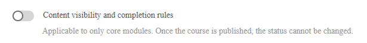

# Adaptive Kurse für Autoren

## Erstellen und Konfigurieren von adaptiven Kursen

Erstellen Sie einen Kurs mit Sichtbarkeit und Abschlussregeln für die einzelnen Module, damit verschiedene Teilnehmer unterschiedliche Inhalte basierend auf ihren Benutzergruppen sehen und abschließen können.

>[!NOTE]
>
>Der adaptive Kurstyp ist nur verfügbar, wenn **Sichtbarkeit und Abschlussregeln** für Ihr Konto aktiviert wurden. Wenn Sie die Option zum Erstellen eines adaptiven Kurses nicht sehen, bitten Sie Ihren Administrator, das adaptive Lernen zu aktivieren.

### Erstellen von adaptiven Kursen

1. Melden Sie sich bei Adobe Learning Manager als Autor an.

   

2. Wählen Sie in der linken Navigation **Kurse** aus. Wählen Sie dann **Hinzufügen** aus.
3. Geben Sie den Namen des Kurses, die Beschreibung und andere Details ein.
4. Wählen Sie den Schalter **Inhaltssichtbarkeit und Abschlussregeln**.

   

5. Wählen Sie im Bestätigungsdialogfeld **Ja** aus.

   

   **Module zu einem adaptiven Kurs hinzufügen**

   Fügen Sie die erforderlichen Module hinzu. Fügen Sie Inhaltsmodule hinzu, indem Sie Inhalte hochladen, Elemente aus der Inhaltsbibliothek auswählen oder Klassenzimmer- oder virtuelle Klassenzimmersitzungen hinzufügen.

   **Modultypen, die adaptive Regeln unterstützen (Inhaltsmodule):**

   * E-Learning zum Selbststudium.
   * Sitzungen im Klassenzimmer
   * Virtuelle Klassenzimmersitzungen
   * Aktivitätsmodule

   **Modultypen, die keine adaptiven Regeln unterstützen:**

   * **Vorbereitungsmodule:** Wird allen Teilnehmern angezeigt, bevor der Kerninhalt beginnt. Es können keine Sichtbarkeit- oder Abschlussregeln festgelegt werden.
   * **Testmodule:** Für alle Teilnehmer verfügbar. Wenn Sie einen Test abschließen, wird der gesamte Kurs unabhängig vom Status des Inhaltsmoduls abgeschlossen. Es können keine Sichtbarkeit- oder Abschlussregeln festgelegt werden.
   * **Arbeitshilfen:** Jederzeit für alle registrierten Teilnehmer sichtbar.

6. Wählen Sie **Hinzufügen** aus.

### Sichtbarkeit und Abschlussregeln für jedes Modul konfigurieren

Nachdem Sie ein Inhaltsmodul hinzugefügt haben, konfigurieren Sie die adaptiven Regeln:

1. Wählen Sie das Modul aus, das Sie konfigurieren möchten.
2. Suchen Sie in den Moduleinstellungen den Abschnitt **Sichtbarkeit und Abschlussregeln**.

   

3. Wählen Sie **Regeln hinzufügen**, um die Benutzergruppen hinzuzufügen, die dieses Modul sehen können.

   

   

   Teilnehmer in diesen Gruppen sehen das Modul im Kurs, müssen es aber nicht abschließen, es sei denn, sie sind ebenfalls obligatorisch.

4. Wählen Sie **Speichern**.
5. Wiederholen Sie diesen Vorgang für jedes Inhaltsmodul im Kurs.

**Schlüsselregeln:**

* Ein Teilnehmer, der zu mehreren Benutzergruppen gehört, erhält das restriktivste Ergebnis: Wenn eine Gruppe ein Modul als obligatorisch definiert, ist es für diesen Teilnehmer obligatorisch.
* Sie müssen mindestens ein Modul als **Obligatorisch** für mindestens eine Benutzergruppe konfigurieren, bevor Sie veröffentlichen können. Das System blockiert die Veröffentlichung, bis diese Bedingung erfüllt ist.

### Kurs im Entwurfsstatus

Wenn sich ein Kurs im Entwurfsstatus befindet, stellt er die Phase dar, in der die gesamte adaptive Struktur vollständig entworfen, konfiguriert und verfeinert werden kann, bevor sie für Teilnehmer gesperrt wird. In dieser Phase können Autoren festlegen, ob der Kurs als adaptiver oder regulärer Kurs funktionieren soll. Diese Entscheidung bleibt bis zur Veröffentlichung des Kurses rückgängig. Dies macht die Entwurfsphase kritisch, da nur an diesem Punkt der adaptive Kern des Kurses festgelegt oder geändert werden kann.

Autoren haben die vollständige Kontrolle über die Kursstruktur in Entwurfskursen. Sie können Module frei hinzufügen, entfernen und neu anordnen, um den beabsichtigten Lernfluss zu gestalten. Gleichzeitig können sie adaptives Verhalten auf granularer Ebene konfigurieren, indem sie Sichtbarkeitsregeln für jedes Modul definieren. Diese Regeln bestimmen, welche Benutzergruppen auf bestimmte Module zugreifen können, sodass der Kurs später personalisierte Lernerlebnisse bereitstellen kann. Neben der Sichtbarkeit können Autoren auch Abschlussregeln definieren, indem sie Module als obligatorisch oder optional für verschiedene Benutzergruppen markieren. Das System verlangt, dass mindestens ein Modul obligatorisch sein muss, um sinnvolle Abschlusskriterien sicherzustellen.

Der Entwurfsstatus ermöglicht auch die uneingeschränkte Bearbeitung der adaptiven Logik. Autoren können Regeln ohne Systemeinschränkungen iterativ hinzufügen, ändern oder entfernen. So können Sie mit verschiedenen Konfigurationen experimentieren, bevor Sie den Kurs abschließen. Zusätzlich zur adaptiven Einrichtung bleiben alle Standard-Kurselemente editierbar, einschließlich Kurs-Metadaten wie Titel und Beschreibung sowie der zugrunde liegenden Lerninhalte, einschließlich SCORM-Modulen oder anderer Assets.

Es ist wichtig zu verstehen, dass die adaptive Konfiguration im Entwurf nur für die Kernkursmodule gilt. Andere Komponenten wie Vorbereitungs- oder Testinhalte unterstützen keine adaptiven Regeln und sind von der Sichtbarkeit oder Abschlusskonfigurationen nicht betroffen.

Schließlich dient der Entwurfsstatus als letzte Möglichkeit, die Kurseinrichtung vor der Veröffentlichung zu validieren. Sobald der Kurs veröffentlicht wurde, wird die adaptive Konfiguration dauerhaft und kann nicht mehr rückgängig gemacht werden.

### Vorschau als Teilnehmer

Wenn Sie **Vorschau als Teilnehmer** auswählen, werden alle Module im Kurs unabhängig von den Benutzergruppenregeln angezeigt. Dadurch erhalten Autoren und Administratoren einen vollständigen Überblick über die Kursstruktur. Teilnehmer in der Produktion sehen nur die Module, die ihre Benutzergruppen sichtbar machen.

### Publish und adaptive Kurse.

Das Veröffentlichen eines adaptiven Kurses folgt demselben Workflow wie das Veröffentlichen eines regulären Kurses.

Wählen Sie nach der Konfiguration aller Module und ihrer Regeln **Publish** aus.

Nach der Veröffentlichung steht der Kurs für die Registrierung zur Verfügung. Teilnehmer sehen beim Öffnen des Kurses nur die für ihre Benutzergruppen konfigurierten Module.

>[!IMPORTANT]
>
>Nach der Veröffentlichung können Sie nicht mehr von &quot;Adaptiv&quot; zu &quot;Standard&quot; oder umgekehrt wechseln. Überprüfen Sie Ihre Konfiguration vor der Veröffentlichung.

### Aktualisieren eines veröffentlichten adaptiven Kurses

Sie können einen veröffentlichten adaptiven Kurs jederzeit aktualisieren. Änderungen werden für eingeschriebene Teilnehmer fast in Echtzeit wirksam.

Beachten Sie, dass Sie die Sichtbarkeitseinstellungen im adaptiven Kurs nicht mehr ändern können. Sie können den Kurs nicht zu einem nicht adaptiven Kurs machen.

### Module hinzufügen oder ändern

1. Öffnen Sie den veröffentlichten Kurs.
2. Wählen Sie **Bearbeiten**.
3. Sie können Module hinzufügen, bearbeiten oder entfernen und ihre Sichtbarkeits- und Abschlussregeln anpassen.
4. Veröffentlichen Sie den Kurs erneut.

**Auswirkung:**

| Ändern | Auswirkungen auf eingeschriebene Teilnehmer in Bearbeitung |
|---|---|
| Neues obligatorisches Modul hinzugefügt (sichtbar für die Benutzergruppe eines Teilnehmers) | Ihren Abschlussanforderungen wird ein Modul hinzugefügt. Wenn es sich bei dem Modul um ein Klassenzimmer oder eine virtuelle Klassenzimmersitzung ohne verbleibende Lizenzen handelt, wird der Teilnehmer auf der Warteliste für dieses Modul aufgeführt. |
| Modul entfernt oder für die Benutzergruppe eines Teilnehmers ausgeblendet | Modul von der Abschlussanforderung entfernt. Wenn dies das letzte obligatorische Modul war, wird der Kurs für den Teilnehmer automatisch abgeschlossen. |
| Modul wurde für die Benutzergruppe eines Teilnehmers von obligatorisch in optional geändert | Modul bleibt sichtbar; Der Teilnehmer muss es nicht mehr abschließen, damit der Kurs abgeschlossen werden kann. |
| Neues obligatorisches Modul hinzugefügt (der Teilnehmer hat den Kurs bereits abgeschlossen) | Das Modul wird für den Teilnehmer sichtbar, aber er erhält nicht automatisch eine Lizenz und kann nicht darauf zugreifen. Das neue Modul ist nur verfügbar, wenn ein Aktualisierungsabschluss ausgelöst wird. |

### Instanzenwechselverhalten

Ein Teilnehmer, der die Instanzen eines adaptiven Kurses wechselt, führt seinen Fortschritt fort:

* Module, die sie bereits abgeschlossen haben, bleiben in der neuen Instanz abgeschlossen.
* Lizenzen werden nur für nicht abgeschlossene sichtbare Module in der neuen Instanz belegt.
* Wenn die sichtbaren Module in der neuen Instanz keine freien Lizenzen haben, wird der Teilnehmer auf diese Sitzungen auf die Warteliste gesetzt.

## Verwalten von Sitzplatzbeschränkungen und Wartelisten in adaptiven Kursen

Adaptive Kurse in Adobe Learning Manager erzwingen Sitzungsbeschränkungen für den einzelnen Schulungsraum oder den virtuellen Schulungsraum. Im Gegensatz zu regulären Kursen, bei denen eine vollständige Sitzung die gesamte Registrierung blockiert, registriert ein adaptiver Kurs den Teilnehmer sofort und wartet ihn nur auf die spezifischen Sitzungen, in denen keine Lizenzen verfügbar sind. Der Teilnehmer kann ohne Unterbrechung auf alle anderen Module zugreifen.

### So funktionieren Sitzbeschränkungen in adaptiven Kursen

Wenn sich ein Teilnehmer für einen adaptiven Kurs anmeldet, der Klassenzimmer- oder virtuelle Klassenzimmermodule enthält, überprüft das System die Verfügbarkeit der Lizenzen nur für Sitzungen, die für den Teilnehmer basierend auf seinen Benutzergruppen sichtbar sind.

* Wenn alle sichtbaren Klassenzimmer- oder virtuellen Klassenzimmersitzungen über verfügbare Lizenzen verfügen, wird der Teilnehmer registriert und hat sofort vollen Zugriff.
* Wenn für eine oder mehrere sichtbare Sitzungen keine Lizenzen verfügbar sind, wird der Teilnehmer registriert und sofort auf die Warteliste für diese bestimmten Sitzungen gesetzt. Sie können alle anderen Module sofort starten und durchlaufen.

In der folgenden Tabelle werden alle Lizenz- und Wartelistenszenarien für adaptive Kurse beschrieben.

| Bedingung bei der Registrierung | Ergebnis |
|---|---|
| Alle sichtbaren CR/VC-Sitzungen verfügen über verfügbare Lizenzen | Registriert mit vollem Zugriff auf alle Module |
| Mindestens eine sichtbare CR/VC-Sitzung ist voll | Registriert; nur bei Vollsitzungen auf die Warteliste gesetzt werden; alle anderen Module, auf die sofort zugegriffen werden kann |
| Teilnehmer bereits registriert; Autor fügt eine neue obligatorische CR/VC-Sitzung ohne Lizenzen hinzu | Teilnehmer auf Warteliste für die neue Sitzung Bestehender Fortschritt und Zugriff unberührt |
| Teilnehmer meldet sich ab | alle frei gehaltenen Sitze sofort; Nächste auf die Warteliste gesetzte Teilnehmer in der Reihenfolge des Registrierungsdatums gelöscht |
| Änderung einer Benutzergruppe entfernt eine Sitzung aus dem sichtbaren Satz des Teilnehmers | Sofort freigegebener Sitz |
| Teilnehmer schließt den Kurs ab; Neue obligatorische CR/VC-Sitzung wird sichtbar | Modul sichtbar, aber kein Sitz automatisch zugewiesen. Der Teilnehmer muss den Abschluss der Aktualisierung auslösen, um auf die Sitzung zuzugreifen. |
| Der Administrator oder Kursleiter weist Lizenzen zu | Alle auf die Warteliste gesetzten CR/VC-Sitzungen für diesen Teilnehmer werden gleichzeitig gelöscht |

### Warteliste anzeigen

1. Öffnen Sie den adaptiven Kurs in der Administratoransicht.
2. Wählen Sie **Teilnehmer** aus.
3. Wählen Sie die Registerkarte **Warteliste** aus.

Auf der Registerkarte &quot;Warteliste&quot; werden Teilnehmer aufgeführt, die in einem oder mehreren Modulen auf die Warteliste gesetzt werden. Bei adaptiven Kursen befindet sich der Bericht auf der Ebene des Kursinstanzmoduls und nicht auf der Ebene der Kursinstanz, da ein Teilnehmer an einigen Modulen gerade bearbeitet wird, während er gleichzeitig auf anderen auf der Warteliste steht.

### Warteliste leeren und Lizenzen zuweisen

Wenn eine Lizenz verfügbar wird, weil ein Teilnehmer die Registrierung aufhebt, das Sitzplatzlimit erhöht oder manuell zugewiesen wird, werden Teilnehmer auf der Warteliste in der Reihenfolge des Registrierungsdatums gelöscht (frühestes Registrierungsdatum zuerst).

So ordnen Sie Lizenzen manuell einem oder mehreren Teilnehmern zu:

1. Öffnen Sie den adaptiven Kurs.
2. Wählen Sie die Registerkarte **Teilnehmer** > **Warteliste** aus.
3. Aktivieren Sie das Kontrollkästchen neben dem oder den Teilnehmern, denen Sie Lizenzen zuweisen möchten.
4. Wählen Sie **Lizenzen zuordnen**.

Wenn Sie Lizenzen zuweisen auswählen, wird der ausgewählte Teilnehmer in allen auf der Warteliste stehenden Sitzungen gleichzeitig aus der Warteliste gelöscht, nicht nur in der Sitzung, die Sie gerade anzeigen. Das System geht davon aus, dass der Platz für den Teilnehmer physisch oder virtuell eingerichtet wurde.

**Auslöser für die Warteliste:**

Die Warteliste wird automatisch verarbeitet, wenn einer der folgenden Punkte eintritt:

* Ein Teilnehmer meldet sich für den Kurs ab (wodurch sein Platz in allen abgehaltenen Sitzungen frei wird)
* Die Sitzplatzbeschränkung für eine Sitzung wird erhöht.
* Ein Teilnehmer wechselt die Instanzen
* Ein Administrator oder Kursleiter weist Lizenzen zu

>[!NOTE]
>
>Wenn Sie eine neue Instanz eines adaptiven Kurses erstellen, ist die Option **Teilnehmer auf Warteliste benachrichtigen** nicht verfügbar. Dies ist ein erwartetes Verhalten und unterscheidet sich von normalen Kursen.

In einem regulären Kurs wird die Warteliste auf Instanzebene verfolgt, sodass Sie vom System aufgefordert werden können, wartende Teilnehmer zu benachrichtigen, wenn eine neue Instanz geöffnet wird. In einem adaptiven Kurs werden Wartelisten auf der Ebene des individuellen Klassenzimmers oder des virtuellen Klassenzimmers **Sitzung** und nicht auf der Instanzebene verfolgt. Es gibt keine Warteliste auf Instanzebene, die benachrichtigt werden kann, wenn eine neue Instanz erstellt wird. Daher wird die Eingabeaufforderung nicht angezeigt und es werden keine automatischen Benachrichtigungen gesendet.

## Auslösen des Abschlusses der Aktualisierung für einen adaptiven Kurs

Mit dem Abschluss &quot;Aktualisieren&quot; in Adobe Learning Manager kann der Abschluss eines adaptiven Kurses eines Teilnehmers neu bewertet werden, wenn sich seine Lernanforderungen ändern. Dies ist relevant, wenn sich die Benutzergruppe eines Teilnehmers ändert, wenn ein Autor Modulregeln aktualisiert oder wenn ein Teilnehmer einen adaptiven Kurs unter seinem aktuellen Profil erneut absolvieren möchte.

### Was der Aktualisierungsabschluss bewirkt

In einem adaptiven Kurs wird der Satz der obligatorischen Module eines Teilnehmers von seinen Benutzergruppen zum Zeitpunkt des Abschlusses des Kurses bestimmt. Wenn sich ihre Benutzergruppen später ändern oder wenn der Autor neue obligatorische Module hinzufügt, muss der Teilnehmer möglicherweise zusätzliche Inhalte abschließen, um die Anforderungen seines neuen Profils zu erfüllen.

Mit der Aktualisierung werden zwei Dinge erledigt:

1. Setzt den vorhandenen Kursabschluss des Teilnehmers zurück, wenn er jetzt über neue obligatorische Module verfügt, die unvollständig sind.
2. Erstellt einen neuen Datensatz im Teilnehmertranskript, der die aktualisierte Abschlussanforderung darstellt.

Der ursprüngliche Abschlussdatensatz wird im Teilnehmertranskript als historischer Eintrag beibehalten. Zuvor abgeschlossene Module bleiben abgeschlossen. Der Teilnehmer muss sie nicht wiederholen, es sei denn, es handelt sich um speziell neu obligatorische Module, die zuvor nicht sichtbar oder nicht abgeschlossen waren.

### Wenn die Aktualisierung abgeschlossen ist

**Szenario 1: Durch die Änderung der Benutzergruppe werden neue obligatorische Module hinzugefügt:**

Ein Teilnehmer schließt einen adaptiven Kurs ab. Ihre Benutzergruppe wird später geändert, und die neue Benutzergruppe macht zuvor ausgeblendete oder optionale Module obligatorisch.

* Der vorhandene Abschlusseintrag verbleibt im Teilnehmertranskript.
* Wenn der Teilnehmer neue nicht abgeschlossene obligatorische Module hat, wird eine neue Teilnehmertranskriptzeile erstellt und der Kurs wird als in Bearbeitung angezeigt.
* Der Teilnehmer muss die neuen obligatorischen Module abschließen, um einen neuen Abschluss zu erreichen.

**Szenario 2: Änderungen an Benutzergruppen führen zu keinen neuen obligatorischen Modulen**

Ein Teilnehmer schließt einen adaptiven Kurs ab. Die Benutzergruppe ändert sich, aber die Anforderungen der neuen Benutzergruppe werden bereits durch die vorhandenen Abschlüsse erfüllt.

* Der Kurs bleibt in einem abgeschlossenen Status.
* Es wird keine neue Teilnehmertranskript-Zeile erstellt.
* Der Teilnehmer muss keine Aktion ausführen.

**Szenario 3: Vom Teilnehmer initiierte Wiederholung**

Ein Teilnehmer, der bereits einen adaptiven Kurs abgeschlossen hat, kann ihn wiederholen, um ihn unter seinem aktuellen Benutzergruppenprofil abzuschließen. Dies ist nützlich, wenn sich die Rolle eines Teilnehmers seit dem ursprünglichen Abschluss geändert hat.

1. Der Teilnehmer öffnet den abgeschlossenen adaptiven Kurs.
2. Der Teilnehmer wählt die Option zum Wiederholen oder Neustarten des Kurses aus.
3. Der Kurs wird anhand der aktuellen Benutzergruppen neu bewertet, um den neuen obligatorischen Modulsatz zu bestimmen.
4. Eine neue Zeile mit dem Teilnehmertranskript wird erstellt.

**Szenario 4: Testmodulverhalten**

Wenn ein Teilnehmer ein Testmodul abgeschlossen hat, bevor der Aktualisierungsabschluss ausgelöst wurde, ist der Abschluss des Tests nach der Aktualisierung weiterhin gültig. Sobald das System den Abschluss des Kurses bewertet (ausgelöst durch einen beliebigen Modulabschluss oder eine beliebige Teilnehmeraktion), wird der Kurs erneut automatisch vervollständigt, da der Test bereits abgeschlossen ist, es sei denn, der Kurs verfügt über zusätzliche obligatorische Inhaltsmodule, die jetzt erforderlich und unvollständig sind.

>[!NOTE]
>
>Wenn dem adaptiven Kurs ein neues Klassenzimmer oder eine neue virtuelle Klassenzimmersitzung hinzugefügt wird, nachdem der Teilnehmer den Kurs über den Test abgeschlossen hat, und anschließend ein Abschluss der Aktualisierung ausgelöst wird, wird der Teilnehmer möglicherweise nicht automatisch auf der Registerkarte **Anwesenheit und Punktzahl** oder auf der **Warteliste** für die neue Sitzung angezeigt. Dies tritt auf, weil der Test-Out-Abschluss den Kurs in einem abgeschlossenen Status hält und die Sitzzuweisungslogik nicht erneut ausgelöst wird. Wenn Sie die Anwesenheit eines Testteilnehmers für eine neu hinzugefügte Sitzung verfolgen müssen, weisen Sie seinen Platz manuell über die Registerkarte **Warteliste** zu. Beachten Sie, dass Testmodule nicht der empfohlene Ansatz für adaptive Kurse sind.

**Szenario 5: Vom Administrator ausgelöste Aktualisierung**

Ein Administrator kann im Namen eines Teilnehmers einen Aktualisierungsabschluss auslösen, wenn sich das Profil des Teilnehmers geändert hat und der Administrator feststellt, dass der vorhandene Abschlussdatensatz die aktuellen Anforderungen nicht mehr widerspiegelt.

>[!CAUTION]
>
>Wenn der adaptive Kurs Teil einer wiederkehrenden Zertifizierung ist, gilt der Abschluss der Aktualisierung nur für die Registrierung des Teilnehmers im Stammzertifizierungszyklus. Nachfolgende wiederkehrende Zyklen enthalten eine separate Instanz des adaptiven Kurses, die nicht von der Aktualisierung betroffen ist. Teilnehmer, die sich für einen wiederkehrenden Zyklus registriert haben, sehen keine Modulaktualisierungen und ihre Abschlüsse werden nicht zurückgesetzt. Wenn Ihr Unternehmen adaptive Kurse in wiederkehrenden Zertifizierungen verwendet, teilen Sie dem Administrator diese Einschränkung mit, bevor Sie den Abschluss der Aktualisierung auslösen.

1. Öffnen Sie das Profil des Teilnehmers oder die Registerkarte Teilnehmer des Kurses in der Administratoransicht.
2. Suchen Sie die Registrierung des Teilnehmers.
3. Wählen Sie **Sichtbarkeit und Abschluss aktualisieren**.

ALM bewertet obligatorische Module basierend auf den aktuellen Benutzergruppen des Teilnehmers neu und stellt den Abschluss zurück, wenn neue obligatorische Module vorhanden sind.
