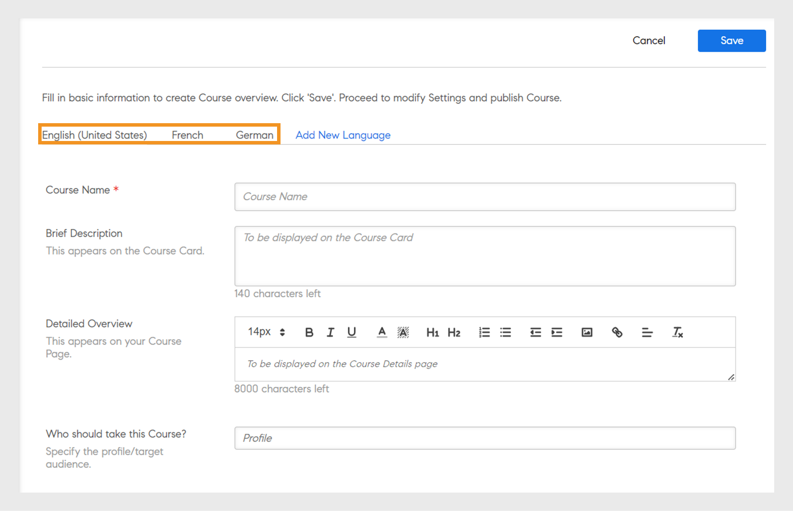
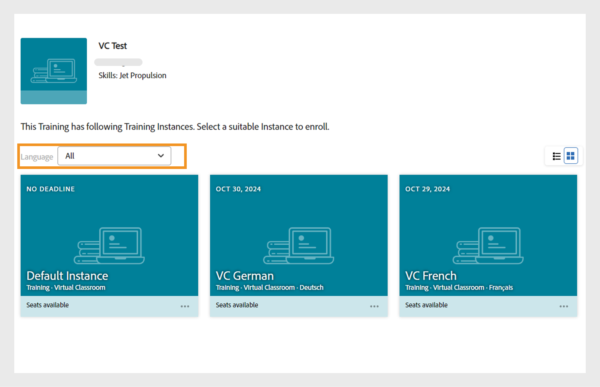

# Hinzufügen von Lernobjekten in verschiedenen Sprachen

Lesen Sie dieses Thema, um zu erfahren, wie Sie Kurse, Zertifizierungen und Lernplänen in unterschiedlichen Sprachen hinzufügen.

Autoren können Lernobjekte wie Kurse, Zertifizierungen und Lernpläne erstellen. Sie können diese Lernobjekte auch in mehreren Sprachen erstellen.

In Learning Manager können Sie Lernobjekte in mehreren Sprachen erstellen. Während der Erstellung von Lernobjekten können Sie Kursinhalte und/oder Metadaten in zusätzlichen Sprachen hinzufügen. Sie können jedoch auch die Details Ihrer Lernobjekte jederzeit bearbeiten und so Ihre Lernobjekte in zusätzlichen Sprachen anbieten.

Um eine neue Sprache hinzuzufügen, klicken Sie auf den Kurs, die Zertifizierung oder den Lernplan, dem/der Sie neue Sprachen hinzufügen möchten. Klicken Sie oben auf der Seite „Grundlegende Informationen“ auf „Neue Sprache hinzufügen“. 

*Neue Sprache hinzufügen*

Wählen Sie im angezeigten Dialogfeld die zusätzlichen Sprachen aus, die Sie Teilnehmern anbieten möchten, und klicken Sie auf „Speichern“.

*Sprache auswählen*

Damit Ihre Änderungen wirksam werden, müssen Sie Ihren Kurs erneut veröffentlichen.

## Unterstützung mehrerer Sprachen für CR/VC-Instanzen mit Sprach-Tagging

Mit Adobe Learning Manager (ALM) können Autoren sprachspezifische Instanzen mithilfe von Sprach-Tagging für Klassenzimmer- und virtuelle Klassenzimmermodule erstellen. Mit dieser Funktion können Teilnehmer auf CR/VC-Module in ihrer bevorzugten Sprache zugreifen. Beispielsweise kann ein Autor ein CR/VC-Modul mit zwei Instanzen erstellen: eine auf Englisch und eine auf Französisch. Teilnehmer können die Instanzen in ihrer bevorzugten Sprache auswählen.

### Workflow

Zunächst erstellt und veröffentlicht der Autor einen Kurs in mehreren Sprachen, wodurch die Sprachoptionen auf der Instanzerstellungsseite aktiviert werden. Der Autor kann dann verschiedene Instanzen erstellen, indem er für jede Instanz eine Sprache auswählt. Teilnehmer können die Instanz basierend auf der Sprache auswählen, die ihnen zugeordnet ist.

### Erstellen eines Kurses mit mehreren Sprachen

Führen Sie die folgenden Schritte aus, um einen Kurs mit mehreren Sprachen zu erstellen:

1. Melden Sie sich als **[!UICONTROL Autor]** an.
2. Wählen Sie **[!UICONTROL Kurse]** > **[!UICONTROL Hinzufügen]** aus, um einen Kurs zu erstellen.
3. Geben Sie **[!UICONTROL Name]** und **[!UICONTROL Beschreibung]** des Kurses ein.
4. Wählen Sie **[!UICONTROL Neue Sprache hinzufügen]** und wählen Sie die erforderlichen Sprachen aus. Dadurch werden mehrere Registerkarten für jede Sprache erstellt.

   
   _Neue Sprache hinzufügen - Kurs_
5. Wechseln Sie zu den entsprechenden Sprachenregisterkarten und geben Sie den **[!UICONTROL Namen]** und die **[!UICONTROL Beschreibung]** des Kurses ein.
6. Wählen Sie auf der Registerkarte Englisch (USA) die Option **[!UICONTROL Modul hinzufügen]** > **[!UICONTROL Virtuelles Klassenzimmermodul]**.

   >[!NOTE]
   >
   >Das Verfahren wird auch für das Klassenzimmermodul gleich sein.

   
Neue Sprache für VC-Modul hinzufügen

7. Geben Sie auf jeder Sprachenregisterkarte **[!UICONTROL Titel]** und **[!UICONTROL Beschreibung]** ein, und wählen Sie **[!UICONTROL Hinzufügen]** aus.
8. Geben Sie die erforderlichen Details für den Kurs ein und veröffentlichen Sie den Kurs.

### Instanzen für jede Sprache erstellen

Sie können die Instanzen für jede Sprache in den Apps &quot;Admin&quot; und &quot;Autor&quot; erstellen. Führen Sie die folgenden Schritte aus, um Instanzen in der Autoren-App zu erstellen:

1. Melden Sie sich als **[!UICONTROL Autor]** an.
2. Wählen Sie **[!UICONTROL Kurse]** und anschließend den mehrsprachigen Kurs aus.
3. Wählen Sie **[!UICONTROL Instanzen]** > **[!UICONTROL Neue Instanz hinzufügen]**, um die Instanzen zu erstellen.
4. Geben Sie den **[!UICONTROL Instanznamen]** ein, und wählen Sie den **[!UICONTROL Ausfülltermin]** aus.
5. Wählen Sie **[!UICONTROL Weitere Optionen anzeigen]**, um die anderen Optionen anzuzeigen.
6. Wählen Sie die gewünschte Sprache aus dem Dropdown-Menü **[!UICONTROL Sprache]** aus.

   
   _Sprache für die Instanz auswählen_

7. Geben Sie die anderen Details ein und wählen Sie **[!UICONTROL Speichern]**.
8. Erstellen Sie Instanzen für andere Sprachen mit denselben Schritten. Teilnehmer können alle Sprachinstanzen für diesen Kurs sehen.

### Auswählen der Instanz und Registrieren - Arbeitsablauf für Teilnehmer

Teilnehmer können diese Sprachinstanzen in ihrer App sehen. Sie können ihre bevorzugte Sprachinstanz auswählen, sich registrieren und an den CR/VC-Sitzungen in dieser Sprache teilnehmen.

Führen Sie die folgenden Schritte aus, um die Instanz auszuwählen und sich zu registrieren:

1. Wechseln Sie in der Teilnehmer-App zum **[!UICONTROL Katalog]** und wählen Sie den Kurs aus.
2. Sie können den folgenden Bildschirm mit mehreren Instanzen sehen.

   
   _VC-Modul für Teilnehmer_

3. Sie können mithilfe der Filteroption Sprache herausfiltern. Wählen Sie Ihre bevorzugte Sprache aus und melden Sie sich für den Kurs an.
4. Nach der Auswahl werden die folgenden Details auf der Seite &quot;Kursübersicht&quot; angezeigt.

_Instanzdetails_

