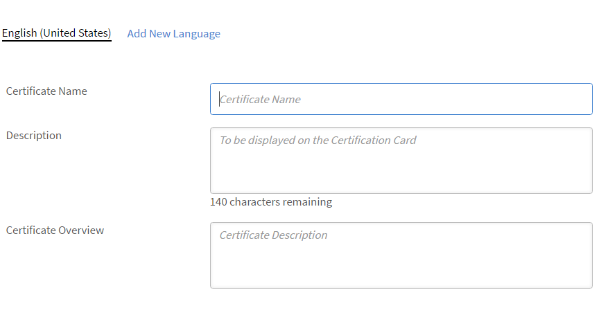

# Hinzufügen von Lernobjekten in verschiedenen Sprachen

Lesen Sie dieses Thema, um zu erfahren, wie Sie Kurse, Zertifizierungen und Lernplänen in unterschiedlichen Sprachen hinzufügen.

Autoren können Lernobjekte wie Kurse, Zertifizierungen und Lernpläne erstellen. Sie können diese Lernobjekte auch in mehreren Sprachen erstellen.

In Learning Manager können Sie Lernobjekte in mehreren Sprachen erstellen. Während der Erstellung von Lernobjekten können Sie Kursinhalte und/oder Metadaten in zusätzlichen Sprachen hinzufügen. Sie können jedoch auch die Details Ihrer Lernobjekte jederzeit bearbeiten und so Ihre Lernobjekte in zusätzlichen Sprachen anbieten.

Um eine neue Sprache hinzuzufügen, klicken Sie auf den Kurs, die Zertifizierung oder den Lernplan, dem/der Sie neue Sprachen hinzufügen möchten. Klicken Sie oben auf der Seite „Grundlegende Informationen“ auf „Neue Sprache hinzufügen“. 

*Neue Sprache hinzufügen*

Wählen Sie im angezeigten Dialogfeld die zusätzlichen Sprachen aus, die Sie Teilnehmern anbieten möchten, und klicken Sie auf „Speichern“.

*Sprache auswählen*

Damit Ihre Änderungen wirksam werden, müssen Sie Ihren Kurs erneut veröffentlichen.
