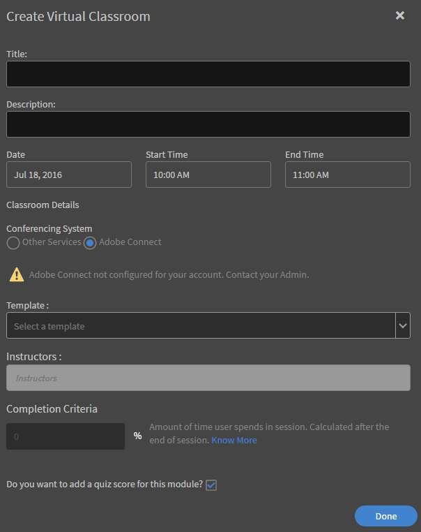

# Adobe Connect-Integration

Autoren können während der Erstellung von Kursen Kurse für das virtuelle Klassenzimmer über Adobe Connect erstellen. Um Adobe Connect für Ihr Learning Manager-Konto zu aktivieren, müssen Sie den Administrator Ihres Unternehmens kontaktieren.

## Kurs für virtuelles Klassenzimmer (VC) mit Adobe Connect erstellen {#createvirtualclassroomvccoursewithadobeconnect}

1. Klicken Sie auf der Seite „Eigene Kurse“ auf „Module hinzufügen“ und wählen Sie „Virtuelles Klassenzimmer“. Das Dialogfeld „Virtuelles Klassenzimmer erstellen“ wird angezeigt.
1. Im Dialogfeld &quot; **Konferenzsystem** wählen Sie Adobe Connect aus.

   

   *Erstellen eines virtuellen Klassenzimmers*

1. Geben Sie den Titel, die Beschreibung, das Datum für das VC sowie Start- und Endzeit ein.

   Wenn Adobe Connect nicht für Ihr Konto konfiguriert ist, wird eine Warnmeldung angezeigt, wie im Screenshot oben gezeigt. Vorlage, Kursleiter und andere Adobe Connect-Optionen sind deaktiviert. Sie müssen Ihren Administrator kontaktieren, um Adobe Connect für Ihr Konto zu konfigurieren.

1. Die Adobe Learning Manager-Anwendung ruft die Standardvorlagen (Meeting, Schulung und Ereignis) sowie die Liste der Kursleiter (d. h. der Benutzer mit Veranstalterrechten) von Adobe Connect ab. Wählen Sie die gewünschte Vorlage.
1. Wählen Sie den Kursleiter für Ihren Kurs im virtuellen Klassenzimmer aus der Liste der Kursleiter aus.

   

   *Wählen Sie den Kursleiter aus der Liste aus*

1. Geben Sie die Abschlusskriterien für den VC-Kurs ein. Abschlusskriterien sind der Prozentsatz der Gesamtdauer des Kurses, die ein Teilnehmer absolvieren muss, damit der Kurs als abgeschlossen betrachtet werden kann. Angenommen, ein Kurs dauert eine Stunde. Wenn Sie für die Abschlusskriterien „50 %“ angeben, gilt der Kurs für einen Teilnehmer als abgeschlossen, wenn dieser mindestens 30 Minuten daran teilgenommen hat.
1. Klicken Sie auf **[!UICONTROL Fertig]**.

## Gemeinsame Vorlagen aus Adobe Connect {#sharedtemplatesofadobeconnect}

Standardmäßig werden alle im Adobe Connect-Konto erstellten gemeinsamen Vorlagen in der Learning Manager-Anwendung abgerufen. Sie können benutzerdefinierte Vorlagen hinzufügen, indem Sie sie im Adobe Connect-Konto als gemeinsame Vorlagen erstellen.
