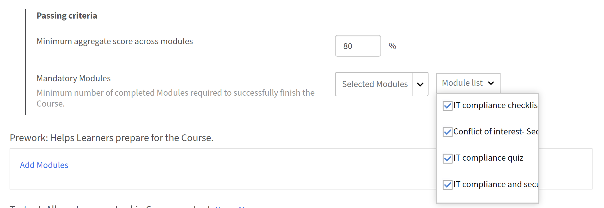

# Schulungsmaterial für Autoren

## Konfigurieren des Schulungsbuchs für einen Kurs

Richten Sie in Adobe Learning Manager eine gewichtete Punktzahl für einen Kurs ein, sodass jeder Teilnehmer eine aus seiner Modulleistung berechnete Gesamtpunktzahl erhält und der Kursabschluss an das Erreichen eines Mindestpunktzahlschwellenwerts gebunden werden kann.

Das Schulungsbuch wird auf Kursebene konfiguriert, wenn ein neuer Kurs erstellt wird. Es kann nicht zu einem vorhandenen veröffentlichten Kurs hinzugefügt werden.

>[!NOTE]
>
>Damit Teilnehmer das Schulungsbuch in einem Kurs sehen können, muss ein Administrator zunächst **Schulungsbuchsichtbarkeit** auf Kontoebene aktivieren.

### Gradebook für einen Kurs aktivieren

* Melden Sie sich bei Adobe Learning Manager als Autor an.
* Wählen Sie in der linken Navigation **Kurse** aus, und wählen Sie dann **Hinzufügen** aus, um einen neuen Kurs zu erstellen.
* Geben Sie den Kursnamen, die Beschreibung und andere erforderliche Details ein.
* Suchen Sie im Abschnitt **Module** den Schalter **Gradebook**.

  

* Wählen Sie den Schalter **Gradebook**, um ihn zu aktivieren. Darunter werden zwei Optionen angezeigt. Beide sind standardmäßig aktiviert:
  * **Kursbuch für Teilnehmer anzeigen:** Teilnehmer sehen eine **Kursbuch-Registerkarte** im Kursplayer, auf der ihre Modulpunktzahlen, die Gewichtungsaufschlüsselung und das Gesamtergebnis angezeigt werden. Deaktivieren Sie diese Option, um Bewertungen intern zu berechnen, ohne sie den Teilnehmern zur Verfügung zu stellen.
  * **Einschließen von Modulen, die keinen Beitrag zur Endnote leisten:** Module, die nicht Teil der Anforderung zum Bestehen von Kriterien sind, werden ebenfalls im Schulungsbuch angezeigt. Wenn diese Einstellung nicht aktiviert ist, werden nur die Module angezeigt, die Teil der Kriterien zum Bestehen sind.

### Module hinzufügen und Gewichtung zuweisen

Nachdem Sie &quot;Gradebook&quot; aktiviert haben, fügen Sie Ihre Inhaltsmodule hinzu und weisen Sie jedem bewertbaren Modul einen Gewichtungsprozentsatz zu. Die Gewichtungsprozentsätze müssen bis zu genau 100 betragen, bevor Sie die Konfiguration speichern können.

* Wählen Sie **Module hinzufügen**.
* Wählen Sie in der Modulauswahl die Module aus, die Sie hinzufügen möchten, und wählen Sie **Hinzufügen** aus. Die Module werden im Abschnitt **Inhalt** angezeigt. Bewertungsmodule, SCORM, Captivate-Inhalte, AICC, xAPI, native Tests, Aktivitätsmodule, Klassenzimmersitzungen und virtuelle Klassenzimmersitzungen zeigen ein Eingabefeld **Gewichtung** an. Nicht bewertbare Module zeigen einen Strich in der Gewichtungsspalte.
* Geben Sie für jedes bewertbare Modul einen Prozentwert in das Feld **Gewichtung** ein. Eine **Gesamtgewichtung** wird während der Eingabe aktualisiert und muss genau **100%** erreichen, bevor Sie speichern können.

  

* Für Module mit mehreren Bereitstellungstypen: Die Gewichtung kann nur zugewiesen werden, wenn **alle** Bereitstellungstypen im Modul die Bewertung unterstützen. Wenn eine Lieferart keine Bewertung unterstützt, kann das gesamte Modul nicht gewichtet werden.

>[!NOTE]
>
>Die Bewertungsskala muss nicht zwischen den Bereitstellungstypen übereinstimmen. Eine von 100 bewertete Klassenzimmersitzung und ein von 10 bewertetes SCORM-Modul können im selben Schulungsbuch nebeneinander existieren. Die Formel normalisiert jeden Beitrag automatisch.

### Mindestpunktzahl für das Bestehen der Prüfung festlegen

* Suchen Sie im Kurseditor den Abschnitt **Kriterien für das Bestehen**.
* Geben Sie im Feld **Minimale Gesamtpunktzahl für Module** einen Prozentsatz zwischen 0 und 100 ein.
* Ein Wert von **0** bedeutet, dass der Kurs allein auf der Grundlage des erforderlichen Modulabschlusses abgeschlossen wird, ohne dass ein Gesamtpunktzahlschwellenwert festgelegt wird.
* Jeder Wert über 0 bedeutet, dass der Teilnehmer die erforderlichen Module abschließen UND diese Gesamtpunktzahl erfüllen oder überschreiten muss.
* Geben Sie im Feld **Obligatorische Module** die erforderliche Zahl ein oder wählen Sie sie aus der Dropdown-Liste aus.

  

* Wählen Sie **Speichern**.

Die Mindestpunktzahl für das Bestehen ist für Teilnehmer auf der Registerkarte **Gradebook** sichtbar, sodass sie den Schwellenwert kennen, bevor sie beginnen.

### Konfigurieren der Punktpunkteeinstellungen für Module mit mehreren Versuchen {#configurescoresettingsmultipleattempts}

Wenn ein Modul mehrere Versuche zulässt, wählen Sie, welche Punktzahl für die Versuche in der Gradebook-Berechnung verwendet wird.

* Suchen Sie im Kurseditor nach einem Modul, für das mehrere Versuche aktiviert sind.

  

* Suchen Sie die zu verwendende **Punktzahl**-Einstellung neben diesem Modul.
* Wählen Sie **Neueste** oder **Höchste**:
  * **Aktuellste:** Die neueste Versuchsbewertung wird immer verwendet. Ein niedrigerer Wert bei einem späteren Versuch ersetzt einen höheren früheren.
  * **Höchste Punktzahl:** Die beste Punktzahl aus jedem Versuch wird beibehalten. Eine niedrigere Punktzahl bei einem späteren Versuch verringert die gespeicherte Punktzahl nicht.

    

* Wählen Sie **Speichern**.

### Publish starten.

Nachdem Sie alle Gradebook-Einstellungen konfiguriert haben, veröffentlichen Sie den Kurs mithilfe des Standard-Workflows. Wählen Sie **Speichern** und anschließend **Publish** aus, um den Kurs Teilnehmern zur Verfügung zu stellen.

### Best Practices

* Weisen Sie die Gewichtung zu, die die relative Bedeutung der einzelnen Module widerspiegelt. Geben Sie höhere Prozentwerte für Module ein, die für das Lernziel am wichtigsten sind.
* Aktivieren Sie **Kursbuch für Teilnehmer anzeigen**, es sei denn, es gibt einen bestimmten Grund, Punktzahlen auszublenden. Teilnehmer, die ihr Gewicht und ihren Punktwert sehen können, sind besser positioniert, um ihre Bemühungen zu priorisieren.
* Legen Sie die Mindestpunktzahl für das Bestehen der Prüfung fest, bevor sich die Teilnehmer registrieren. Das Ändern nach aktiven Registrierungen kann sich auf die in Bearbeitung befindlichen Abschlüsse auswirken.
* Verwenden Sie **Höchste** für die Einstellung für mehrere Versuche, wenn Module Bewertungen sind, die Teilnehmer wiederholen sollen. Verwenden Sie **Latest**, wenn Sie statt der besten Leistung die aktuelle Wissensstufe erfassen möchten.
* Stellen Sie sicher, dass der Indikator **Gesamtgewicht** vor dem Speichern genau 100 % anzeigt.
