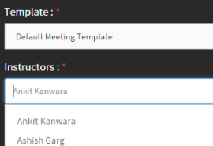

# Kataloge

Kataloge im Lern-Manager bestehen aus den Kursen, Lernprogrammen und Zertifizierungen für die Teilnehmerrolle im Lern-Manager-Konto.

## Kataloge {#Catalogs-1}

Alle im Learning Manager verfügbaren Kurse finden Sie im Abschnitt &quot;Kurse&quot;. Dasselbe gilt für Lernprogramme, Zertifikate usw.

Um nur die Kurse anzuzeigen, die ein Autor erstellt hat, navigieren Sie zum Abschnitt **Meine Kurse**.

Als Autor können Sie den Kurskatalog anzeigen, der eine Sammlung aller Kurse im Konto ist.

Nachdem Sie sich als Autor angemeldet haben, klicken Sie auf **Kurskatalog** im linken Bereich, um die Liste aller Kurse anzuzeigen, die im Learning Manager für Ihr Unternehmen verfügbar sind.

Verwenden Sie die in der Abbildung unten dargestellten Filteroptionen, um nach den Kursen im Katalog zu suchen.

*Suchen Sie die Kurse im Katalog*

## Kurs für virtuelles Klassenzimmer (VC) mit Adobe Connect erstellen {#createvirtualclassroomvccoursewithadobeconnect}

1. Klicken Sie auf der Seite &quot;Eigene Kurse&quot; auf &quot;Module hinzufügen&quot; und wählen Sie &quot;Virtuelles Klassenzimmer&quot;. Das Dialogfeld &quot;Virtuelles Klassenzimmer erstellen&quot; wird angezeigt.
1. Im Dialogfeld &quot; **dialog>Konferenzsystem** Option wählen Sie Adobe Connect
1. Geben Sie Titel, Beschreibung, VC-Datum, Start- und Endzeit ein.

   Wenn Adobe Connect nicht für Ihr Konto konfiguriert ist, wird eine Warnmeldung angezeigt (siehe Screenshot oben). Vorlage, Kursleiter und andere Adobe Connect-Optionen sind deaktiviert. Sie müssen sich an Ihren Administrator wenden, um Adobe Connect für Ihr Konto zu konfigurieren.

1. Die Adobe Learning Manager-Anwendung ruft die Standardvorlagen (Meeting, Schulung und Ereignis) und die Liste der Kursleiter (Benutzer mit Veranstalterberechtigungen) von Adobe Connect ab. Wählen Sie die gewünschte Vorlage.

1. Wählen Sie den Kursleiter für Ihren VC-Kurs aus der Liste der Kursleiter aus.

   

   *Wählen Sie den Kursleiter aus der Liste aus*

1. Geben Sie die Abschlusskriterien für den VC-Kurs an. Abschlusskriterien sind der Prozentsatz der Gesamtdauer des Kurses, an dem ein Teilnehmer teilnehmen muss, um als abgeschlossen betrachtet zu werden. Angenommen, die Dauer des Kurses beträgt beispielsweise 1 Stunde. Wenn Sie 50 % als Abschlusskriterien angeben und ein Teilnehmer den Kurs auch nur für 30 Minuten besucht, wird er für den Teilnehmer als abgeschlossen betrachtet.

1. Klicken **[!UICONTROL Fertig]**.
