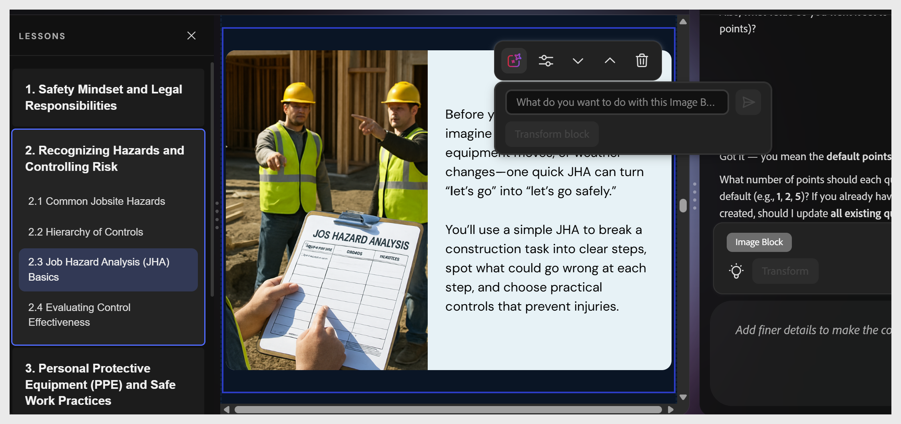

# Inhaltskomponente hinzufügen

Wählen Sie zwischen zwei vorhandenen Elementen aus. Die Schaltfläche &quot;+&quot; wird angezeigt. Wählen Sie diese Option aus, um die Komponentenauswahl zu öffnen.

Verfügbare Komponenten:

| **Komponente** | **Für** verwenden |
|----------------|---------------------------------------------------|
| **Absatz** | Textkörper und Erläuterungen |
| **Image** | Illustrationen, Screenshots, Diagramme |
| **Video** | Eingebettetes MP4- oder verknüpftes Video |
| **Karte wechseln** | Term- oder Definitionspaare, Anzeigen von Interaktionen |
| **Bildraster** | Mehrere Bilder in einem Rasterlayout |
| **Akkordeon** | Erweiterbare Abschnitte, schrittweise Verfahren |
| **Zeitleiste** | Sequenzielle Ereignisse oder Prozessschritte |
| **Registerkarte** | Parallele Inhalte - Vergleiche, regionale Varianten |
| **Karussell** | Wischbare Serie von Bildern oder Inhaltskarten |
| **MCQ** | Inline-Wissensüberprüfung ohne Bewertung |
| **Wahr/Falsch** | Inline-Prüfung auf Richtigkeit oder Richtigkeit |

>[!NOTE]
>
>Verwenden Sie **Akkordeon** für Schritt-für-Schritt-Verfahren, bei denen die Teilnehmer von der Kontrolle ihres Tempos profitieren. Verwenden Sie **Flip Card** als Ausdruck oder Definitionsinhalt.

## Inhaltsblöcke innerhalb eines Themas verschieben

Sie können Inhaltsblöcke innerhalb eines Themas entweder mit den Bearbeitungsoptionen in der Symbolleiste oder mit der KI neu anordnen.

