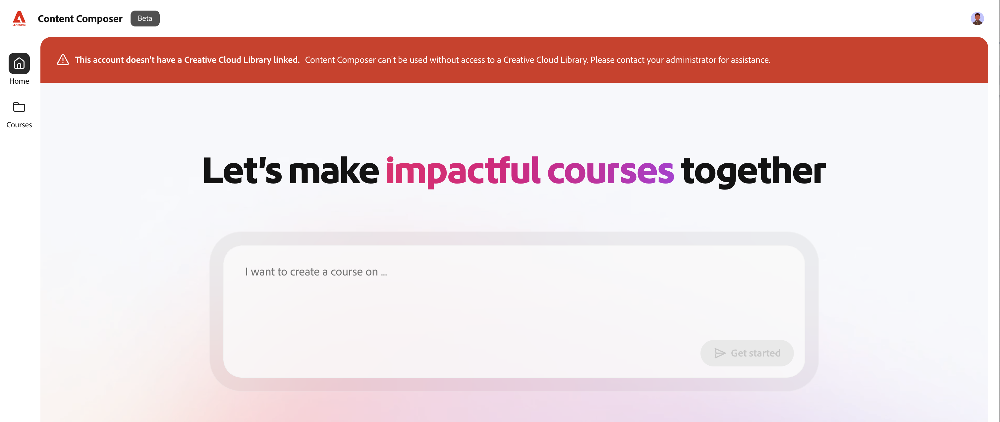

>[!IMPORTANT]
>
>Für wen ist dieses Dokument gedacht: Administratoren, die den Creative Cloud-Speicher für Adobe Learning Manager-Benutzer aktivieren müssen, damit sie auf Content Composer zugreifen und ihn verwenden können. Dies ist besonders nützlich für Administratoren, die bei Anmeldungs- oder Zugriffsfehlern im Zusammenhang mit dem Speicher eine Fehlerbehebung durchführen und das kostenlose Abonnementangebot über Adobe Admin Console zuweisen möchten.

Für den Adobe Learning Manager Content Composer (ALM) müssen Benutzer über Creative Cloud-Speicher verfügen, der mit ihrem Adobe-Konto verknüpft ist. Benutzer ohne Creative Cloud-Speicher können möglicherweise nicht auf Content Composer zugreifen und es können Anmeldungs- oder Zugriffsfehler auftreten.

Um Unternehmen bei der Bereitstellung von Speicher für betroffene Benutzer zu unterstützen, bietet Adobe ein kostenloses Mitgliedschaftsangebot, das Administratoren über die Adobe Admin Console zuweisen können. Dieses Angebot gilt für Creative Cloud-Speicher und kann verwendet werden, wenn ein Anwender noch nicht über ein Abo mit Speicherberechtigung verfügt.

## Vorbereitung

Voraussetzungen:

* Sie haben Adobe Admin Console-Administratorzugriff.
* Der Benutzer, der Zugriff auf den Inhaltsentwickler benötigt, wird identifiziert.
* Sie haben überprüft, ob der Benutzer bereits über ein Abo mit Creative Cloud-Speicher verfügt.

## Gründe, warum Anwender Creative Cloud-Speicher benötigen

Content Composer verwendet Creative Cloud-Speicher zum Speichern von Kursen. Benutzer, denen kein Speicher ihrem Adobe-Profil zugewiesen ist, erhalten möglicherweise eine Fehlermeldung, wenn sie versuchen, Content Composer zu verwenden.

Viele Adobe-Kunden verfügen bereits über Creative Cloud-Speicher durch bestehende Adobe-Produkte und sind davon nicht betroffen. Einige Adobe Learning Manager-Kunden verfügen jedoch möglicherweise nicht über standardmäßig bereitgestellten Speicher und benötigen möglicherweise einen Administrator, um ihn zu aktivieren.

## Kostenlosen Creative Cloud-Speicher für Anwender aktivieren

Wenn ein Anwender nicht über Creative Cloud-Speicher verfügt, weisen Sie ihm das kostenlose Abonnementangebot der Adobe Admin Console zu.

1. Melden Sie sich bei [Adobe Admin Console](https://adminconsole.adobe.com/) mit einem Konto mit Administratorrechten an. Nur Administratoren können Benutzern Produkte und Angebote zuweisen.
2. Wählen Sie in der Admin Console Produkte > Testversionen und Sonderangebote.

   

3. Sehen Sie sich das kostenlose Abonnement-Angebot an, das unter &quot;Testversionen und Sonderangebote&quot; verfügbar ist. Dieses Angebot wird als empfohlene Methode für die Aktivierung von Creative Cloud-Speicher für Benutzer ohne Speicherberechtigung behandelt.

   

4. Weisen Sie das kostenlose Mitgliedschaftsangebot den erforderlichen Benutzern zu. Die Zuweisung kann nur von einem Administrator mit entsprechenden Berechtigungen für die Admin Console abgeschlossen werden.
5. Stellen Sie nach der Zuweisung sicher, dass der Benutzer über Creative Cloud-Speicher verfügt, und bitten Sie den Benutzer, sich erneut bei Content Composer anzumelden.

## Speicherplatz, der durch ein kostenloses Abonnement bereitgestellt wird

Benutzer mit kostenlosem Abonnement erhalten ca. 2 GB Creative Cloud-Speicher, sodass sie Content Composer verwenden können.

## Fehlerbehebung

**Benutzer erhält einen Fehler beim Zugriff auf Content Composer**

Überprüfen Sie, ob der Benutzer in seinem Adobe-Profil über Creative Cloud-Speicher verfügt.

**Benutzer kann das Angebot für die kostenlose Mitgliedschaft nicht sehen**

Bestätigen Sie Folgendes:

* Sie sind als Administrator angemeldet.
* Sie sehen den Bereich &quot;Produkte&quot; in Adobe Admin Console.
* Die Organisation kann auf das Angebot zugreifen.

## Häufige Fragen

**Erhält jeder Adobe Learning Manager-Benutzer automatisch Creative Cloud-Speicher?**

Anzahl Einige ALM-Benutzer verfügen möglicherweise nicht über standardmäßig bereitgestellten Speicher und benötigen möglicherweise zusätzliche Berechtigungen über das kostenlose Abonnementangebot.

**Können Benutzer den Speicher selbst aktivieren?**

Anzahl Die Speicherberechtigung muss von einem Adobe-Administrator über die Admin Console zugewiesen werden.

**Ist Creative Cloud-Speicher für Content Composer erforderlich?**

Ja. Content Composer ist davon abhängig, dass Creative Cloud-Speicher mit dem Adobe-Konto verknüpft ist.

**Was sollten Administratoren tun, wenn ein Benutzer einen speicherbezogenen Fehler feststellt?**

Überprüfen Sie, ob der Benutzer über eine Creative Cloud-Speicherberechtigung verfügt. Wenn nicht, weisen Sie das kostenlose Mitgliedschaftsangebot über Adobe Admin Console zu und lassen Sie den Benutzer es erneut versuchen.

**Was sollten Administratoren tun, wenn sie noch Zugriffs- oder Berechtigungsprobleme haben?**

Wenn der Adobe Admin Console-Administrator ein Problem beim Zuweisen von Creative Cloud-Speicher oder beim Debuggen von Zugriffsproblemen Fläche, erfordert das Problem möglicherweise Unterstützung auf Enterprise-Kontoebene. Wenden Sie sich in solchen Fällen über die in Admin Console verfügbaren Supportoptionen an den Adobe Enterprise Support.

Weitere Informationen finden Sie unter [Adobe von Enterprise Support-Optionen](https://helpx.adobe.com/de/business/enterprise/get-help/support-options/support-for-enterprise.html).
