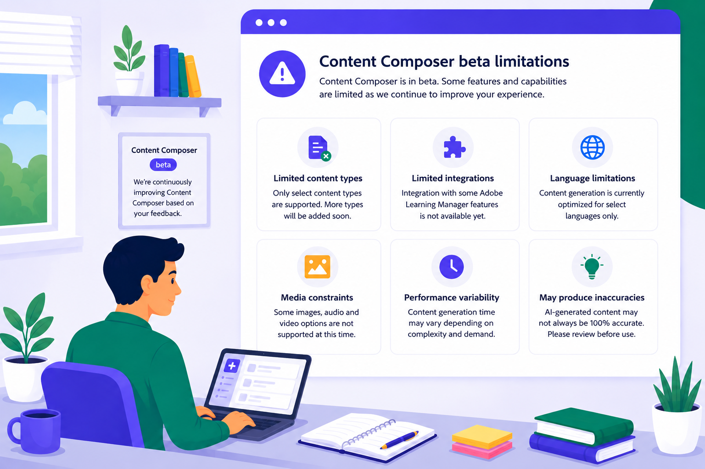
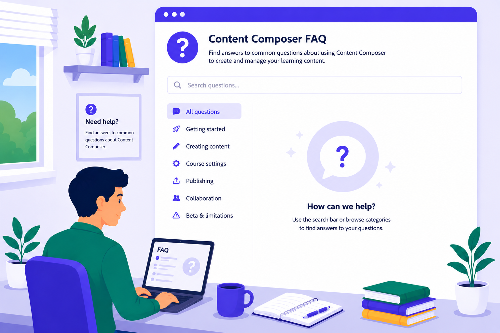
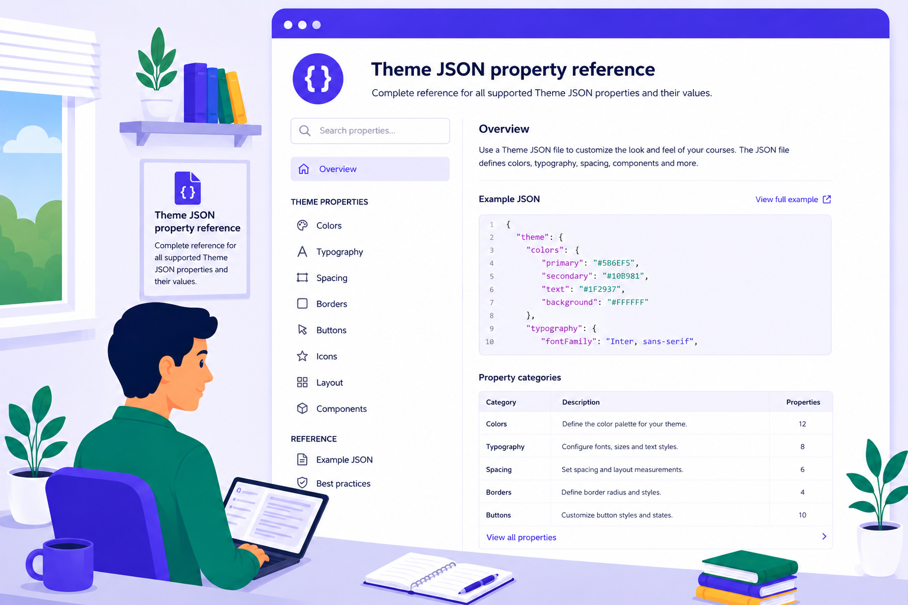

# Hilfe zu Adobe Learning Manager Content Composer (Beta)

>[!IMPORTANT]
>
>Beta-Funktionen können Mängel enthalten und werden &quot;wie besehen&quot; ohne jegliche Gewährleistung bereitgestellt. Adobe hat das alleinige Ermessen, ob Betafunktionen allgemein verfügbar gemacht werden sollen. Adobe ist nicht verpflichtet, die Beta-Funktionen zu verwalten, zu korrigieren, zu aktualisieren, zu ändern, zu ändern oder auf andere Weise (über Adobe Support Services oder auf andere Weise) zu unterstützen. Sollte eine Beta-Funktion allgemein verfügbar werden, kann sie zusätzlichen Nutzungsbedingungen einschließlich ggf. anfallender Gebühren unterliegen. Beta-Funktionen können sich ohne vorherige Ankündigung ändern, einschließlich der Kündigung. Kunden wird empfohlen, mit Vorsicht vorzugehen und sich in keiner Weise auf die ununterbrochene oder fehlerfreie Funktion oder Leistung der Betafunktionen zu verlassen. Dementsprechend erfolgt jede Nutzung der Beta-Funktionen auf eigenes Risiko des Kunden. Die Produktfunktionen und die zugehörige Dokumentation können sich mit der Weiterentwicklung der Funktion ändern. Diese Dokumentation spiegelt die aktuelle Beta-Erfahrung wider und sollte nicht als endgültige oder vollständige Produktdokumentation betrachtet werden.

**Vom Konzept zum Kurs in Minuten**

Adobe Learning Manager Content Composer ist ein KI-Tool zur Erstellung von Kursen, mit dem eine einfache Eingabeaufforderung in einen strukturierten, veröffentlichungsfähigen Kurs mit Lektionen, Bewertungen und Medien umgewandelt wird, ohne dass zuvor Erfahrung mit didaktischer Gestaltung erforderlich ist.

Content Composer führt Autoren durch Schulungsziele, Quellmaterial und Lernziele mithilfe von Konversationen und generiert dann Kurse, die intelligent, markenkonform und bereit sind, direkt in Adobe Learning Manager zu veröffentlichen.

**Wichtigste Highlights**

- **Erstellung von KI-gestützten Kursen**: Eine KI für die Kommunikation stellt zielgerichtete Fragen, um aus Schulungszielen klare, messbare Lernziele zu machen.
- **Generierung mit Dokumentenerdung**: Autoren laden vorhandene Dokumente, Richtlinien oder Decks hoch. Die KI generiert aus diesem Material eine kurze Zusammenfassung. Autoren akzeptieren oder bearbeiten, bevor etwas erstellt wird.
- **Instruktive Soundausgabe**: Kurse, Bewertungen und Medien werden mithilfe strukturierter Lernprinzipien generiert, wodurch der Output pädagogisch effektiv bleibt und nicht nur schnell produziert werden kann.
- **Direktes Veröffentlichen in Adobe Learning Manager**: Abgeschlossene Kurse werden direkt in Adobe Learning Manager veröffentlicht. Kein separates Authoring-Tool, kein manueller SCORM-Export.
- **Arbeitsablauf für ein System**: Die Erstellung von Kursen, die Verwaltung von Teilnehmern und die Berichterstellung verbleiben auf einer Plattform, wodurch der Aufwand für die Verwaltung mehrerer Tools zur Erstellung und Bereitstellung von Inhalten entfällt.

## Vor der Anmeldung

>[!IMPORTANT]
>
>Sie müssen sich mit einem gültigen Adobe Creative Cloud-Konto anmelden. Wenn Sie noch kein Konto haben, können Sie über Adobe Expreß ein kostenloses Konto erstellen. Weitere Informationen finden Sie unter [Erstellen eines kostenlosen Adobe Expreß-Kontos](https://helpx.adobe.com/express/web/adobe-express-subscription/free.html). Starten Sie nach dem Erstellen Ihrer Adobe-Anmeldeinformationen den Content Composer und melden Sie sich an, um mit dem Erstellen von Kursen zu beginnen. Wenn Ihr Unternehmen bereits über ein Creative Cloud-Abonnement verfügt, wenden Sie sich an Ihren Administrator, um ein Creative Cloud-Konto für Sie bereitzustellen, bevor Sie sich bei Content Composer anmelden.

## Content Composer testen {#trycontent-composer}

Sind Sie bereit, Ihren ersten Kurs zu beginnen? Öffnen Sie Content Composer und navigieren Sie in kürzester Zeit von einer einfachen Eingabeaufforderung zu einem Kurs, der für die Veröffentlichung bereit ist.

[**Content Composer testen**](https://contentcomposer.adobe.io/)

<!--

-->

<!---->

## Übersicht {#overview}

<table style="table-layout:auto; border:none; border-collapse:collapse;">
 <tbody>
  <tr>
   <td style="border:none;">
    
    

    <a href="what-is-content-composer.md"><strong>Erste Schritte mit Content Composer</strong></a>
    

    
Was Content Composer ist, für wen es gedacht ist und was Sie benötigen, bevor Sie beginnen.

   </td>
   <td style="border:none;">
    
    

    <a href="write-a-prompt.md"><strong>Kurs erstellen</strong></a>
    

    
Wechseln Sie in einem einzigen Assistenten von einer einfachen Eingabeaufforderung zu einem Kurs, der für die Veröffentlichung bereit ist.

   </td>
   <td style="border:none;">
    
    

    <a href="general-course-settings.md"><strong>Kurseinstellungen konfigurieren</strong></a>
    

    
Legen Sie vor der Veröffentlichung Abschlusskriterien, die Quizpunktzahl und Ihre Adobe Learning Manager-Verbindung fest.

   </td>
  </tr>
  <tr>
   <td style="border:none;">
    
    

    <a href="apply-theme.md"><strong>Kursthemen verwalten</strong></a>
    

    
Wenden Sie visuelle Themen an, passen Sie sie an, erstellen und importieren Sie sie, um zu steuern, wie Ihr Kurs aussieht und sich anfühlt.

   </td>
   <td style="border:none;">
    
    

    <a href="share-collaborate.md"><strong>Freigabe und Zusammenarbeit</strong></a>
    

    
Teilen Sie Ihren Kurs zur Überprüfung mit Kollegen oder geben Sie Teilnehmern direkten Zugriff auf den Kurs.

   </td>
   <td style="border:none;">
    
    

    <a href="publish-to-alm.md"><strong>Publish zu Adobe Learning Manager</strong></a>
    

    
Stellen Sie Ihren fertigen Kurs bei Adobe Learning Manager bereit, und erfahren Sie, wie Content Composer und ALM die Zuständigkeiten für Authoring, Bereitstellung und Reporting aufteilen.

   </td>
  </tr>
  </tbody>
</table>

## Nachschlagen {#lookthingsup}

Schnelle Antworten, aktuelle Einschränkungen und das vollständige JSON-Schema. Alles, was du brauchst, um schnell etwas nachzuschlagen.

<table style="table-layout:auto; border-collapse:collapse;" border="1" bordercolor="transparent" cellpadding="0" cellspacing="0">
 <tbody>
  <tr>
   <td style="border:1px solid transparent;">
    
    

    <a href="content-composer-beta-limitations.md"><strong>Beta-Einschränkungen</strong></a>
    

    
Eine vollständige Liste der aktuellen Einschränkungen, Problemumgehungen und des Status der Roadmap. Wird aktualisiert, wenn Funktionen ausgeliefert werden.

   </td>
   <td style="border:1px solid transparent;">
    
    

    <a href="content-composer-faq.md"><strong>Häufige Fragen zu Content Composer</strong></a>
    

    
Schnelle Antworten auf die häufigsten Fragen zu Authoring, Einstellungen, Freigabe und Veröffentlichung.

   </td>
   <td style="border:1px solid transparent;">
    
    

    <a href="theme-json-reference.md"><strong>Referenz für Theme-JSON-Eigenschaft</strong></a>
    

    
Jede Eigenschaft im Content Composer-Design-JSON-Schema mit Beschreibungen und Beispielwerten.

   </td>
  </tr>
 </tbody>
</table>

## Jetzt beginnen {#startcreating}

Du hast alles, was du brauchst. Öffnen Sie Content Composer und legen Sie Ihren ersten Kurs fest.

[**Content Composer testen**](https://contentcomposer.adobe.io/)
