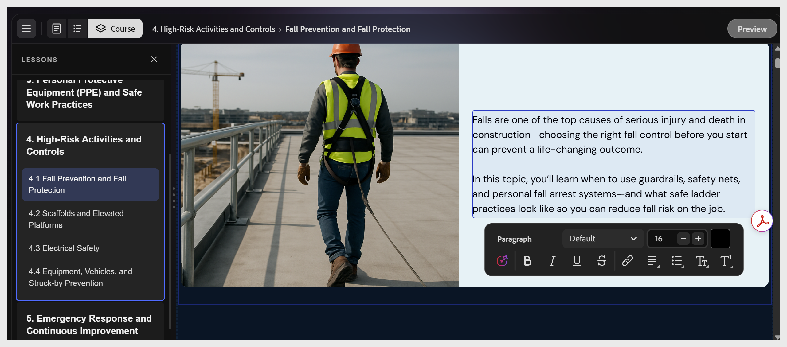

# Kurstext bearbeiten

    

Wählen Sie ein beliebiges Textelement aus, um den Cursor darin zu platzieren. Am unteren Rand der Arbeitsfläche wird eine Symbolleiste zur Formatierung mit den Steuerelementen fett, kursiv, unterstrichen, durchgestrichen, verknüpft, ausgerichtet sowie in der Liste angezeigt.

>[!NOTE]
>
>Themen- und Lektionsnamen sind Teil der Gliederungsstruktur. Um sie nach der Erstellung des Kurses umzubenennen, wenden Sie sich an den Assistenten: &quot;Benennen Sie Lektion 2 in &#39;Kennworthygiene&#39; um.&quot; Sie können sie nicht umbenennen, indem Sie eine Überschrift im Kurseditor auswählen.

