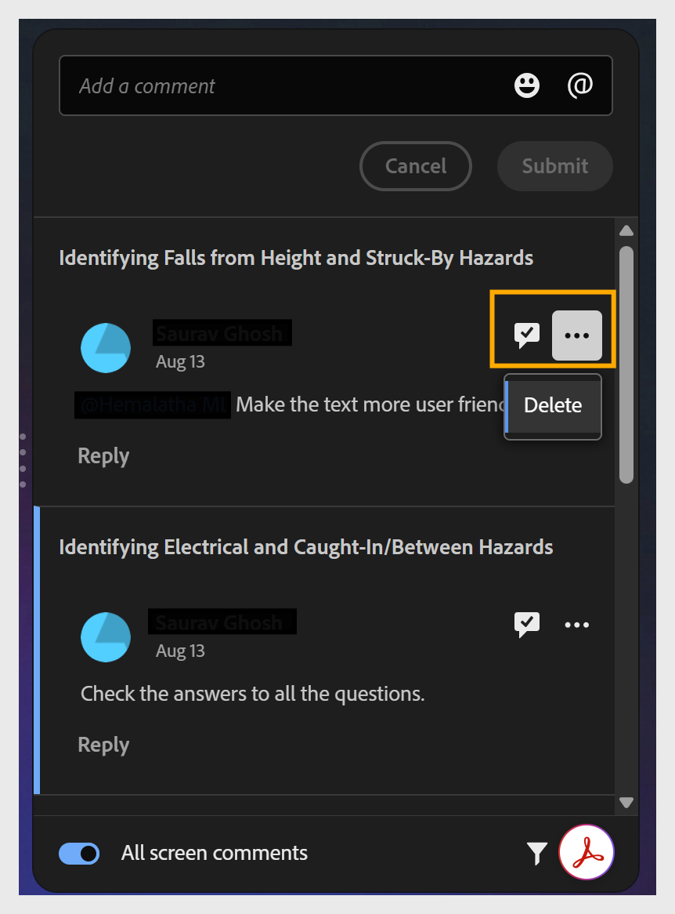

# Verwalten von und Antworten auf Kommentare

Wenn Sie der Autor sind, können Sie den Bereich &quot;**Kommentare**&quot; in Ihrem Projekt verwenden, um die Kommentare anzuzeigen und zu beantworten.

1. Wählen Sie in der oberen Symbolleiste **Kommentare** aus. Der Bereich &quot;**Kommentare**&quot; wird geöffnet und zeigt alle Reviewerkommentare an.

   

2. Wählen Sie einen beliebigen Kommentar aus, um ihn im Kontext auf der Arbeitsfläche anzuzeigen.

   

3. Wählen Sie das Häkchensymbol aus, um einen Kommentar als beantwortet zu markieren, oder das Symbol **Weitere Optionen**, um ihn zu bearbeiten oder zu löschen.

   

4. Speichern Sie den aktualisierten Kurs.

5. Wählen Sie **Freigeben**, um den Überprüfungslink zu aktualisieren, damit die Überprüfer die neueste Version anzeigen können.
