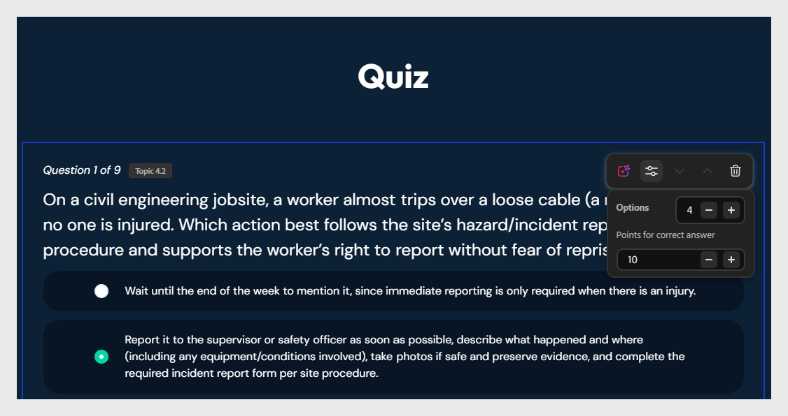

# Quiz überprüfen und bearbeiten

Am Ende des Kurses wird ein abgestuftes Quiz angezeigt. Jede Frage wird mit dem Thema markiert, das sie testet.

>[!NOTE]
>
>In Lektionen eingebettete Wissensüberprüfungen werden nicht bewertet. Nur das Quiz am Ende der Lektion wird bewertet.

So bearbeiten Sie eine Frage:

1. Wählen Sie den Fragentext zur Bearbeitung aus und passen Sie mithilfe der Textbearbeitungsoptionen den Stil an.
   

2. Wählen Sie das Optionsfeld neben der Option, die Sie als korrekt markieren möchten.

3. Sie können der richtigen Antwort auch eine Punktzahl zuweisen.
   

4. Um eine Frage zu löschen, wählen Sie **Option entfernen**.

5. Wenn Sie Fragen neu generieren möchten, wenden Sie sich an den Assistenten: &quot;Regenerieren Sie das Quiz für Lektion 1.&quot;
