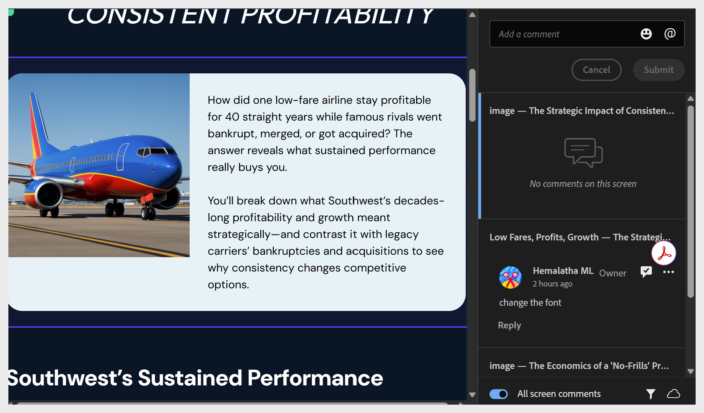

# Ein freigegebenes Projekt überprüfen und kommentieren

Wenn ein Projekt zum Review freigegeben wird, greifen Sie als Reviewer über den vom Autor freigegebenen Link auf den Kurs zu.

1. Öffnen Sie den für Sie freigegebenen Überprüfungslink.

2. Wählen Sie im Bereich &quot;**Kommentare**&quot; auf der rechten Seite eine Kurskomponente aus, für die Änderungen erforderlich sind. Der Name der Komponente wird oben im Kommentarfeld angezeigt, sodass Ihr Feedback weiterhin mit dem rechten Teil des Kurses verknüpft bleibt. Fügen Sie Ihren Kommentar darunter hinzu.

   

   Im Bereich &quot;**Kommentare**&quot; können Sie:
   * Kommentare hinzufügen, bearbeiten, löschen, beantworten und schließen.
   * Kommentare anderer Prüfer anzeigen.
   * Verwenden Sie **@**, um den Projektbesitzer oder einen anderen Reviewer zu erwähnen (nur, wenn Sie sich mit Ihrer Adobe ID angemeldet haben).
   * Füge in deinen Kommentaren Emojis hinzu.
   * Alle Kommentare zum Kurs anzeigen: Standardmäßig werden im Kommentarbereich Kommentare nur für die Kurskomponente angezeigt, die Sie gerade anzeigen. Aktivieren Sie die Option Alle Kommentare zu Bildschirm , um alle Kommentare im gesamten Projekt anzuzeigen, unabhängig davon, welche Komponente oder welcher Bildschirm aktiviert ist.

   

   * Filtern von Kommentaren nach Status **Reviewer**, **Zeit** und **Geschlossen**.

   

3. Wählen Sie **Senden** aus, um Ihren Kommentar zu veröffentlichen, oder **Abbrechen**, um ihn zu verwerfen.

## Offensiven Inhalt melden

Wenn Sie bei der Überprüfung eines freigegebenen Inhalts-Composer-Kurses auf Inhalte stoßen, die die [Nutzungsbedingungen](https://www.adobe.com/legal/terms.html) der Adobe verletzen, können Sie diese melden.

Wählen Sie rechts oben **Bericht** aus, und füllen Sie das Formular aus. Alternativ können Sie Missbrauch per E-Mail an [abuse@adobe.com](mailto:abuse@adobe.com) melden. 

