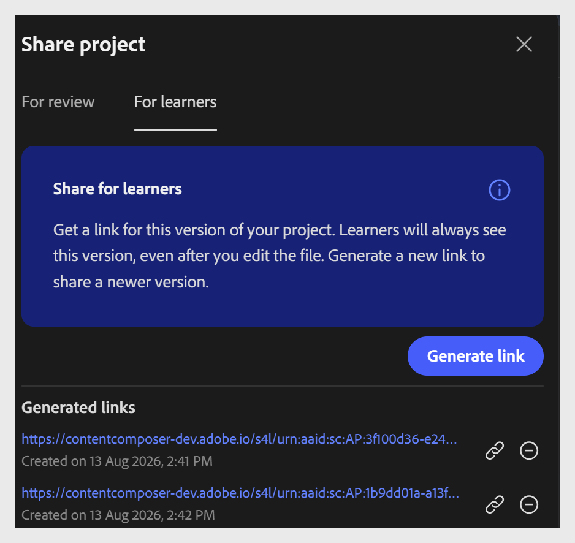

# Kurs für Teilnehmer freigeben

Durch die Freigabe für Teilnehmer erhalten sie direkten Zugriff auf den Kurs, ohne dass eine LMS-Verbindung oder -Anmeldung erforderlich ist. Dies ist nützlich, wenn die Teilnehmer eine Vorschau eines Kurses anzeigen oder einen Kurs schnell abschließen sollen, z. B. während eines Pilotprojekts, einer informellen Schulungssitzung oder bevor der Kurs in Adobe Learning Manager zur formellen Anmeldung und Nachverfolgung veröffentlicht wird.

1. Wählen Sie **Freigeben** in der oberen Symbolleiste aus.

2. Wählen Sie die Registerkarte **Für Teilnehmer** aus.

3. Wählen Sie **Link generieren**, um einen Link für den Teilnehmerzugriff zu erstellen.

   

4. Geben Sie den Link für Ihre Teilnehmer frei.

>[!IMPORTANT]
>
>Teilnehmer-Links sind versionsspezifisch. Jedes Mal, wenn Sie den Kurs aktualisieren, generieren und geben Sie einen neuen Link frei, damit die Teilnehmer auf die neueste Version zugreifen können. Der vorherige Link zeigt weiterhin die frühere Version an.
>
>Der Teilnehmerzugriff umfasst nicht das Kommentarfeld. Teilnehmer können keine Kommentare hinzufügen oder mit dem Arbeitsablauf für Reviews interagieren.

