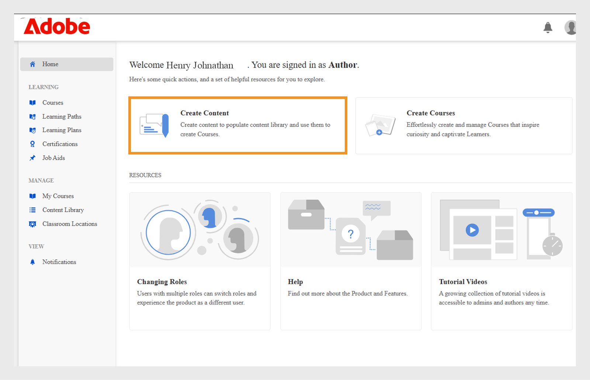

# Inhaltsbibliothek

Erfahren Sie, wie Sie Inhalt zum Selbststudium erstellen können, der Kursen zugeordnet werden kann.

## Inhaltsbibliothek {#contentlibrary}

Inhalte sind die Bausteine eines Kurses. Autoren erstellen eine Bibliothek von Inhalten, die Kursen als Module zum Selbststudium hinzugefügt werden können. Auf diese Inhaltsbibliothek haben nur Autoren Zugriff.

## Unterstützte Inhaltstypen {#supported}

Sie können interaktive und statische Inhalte in der Bibliothek hochladen.

Die folgende Tabelle zeigt den Typ der interaktiven und statischen Dateitypen, die Sie in die Bibliothek hochladen können.

<table>
 <tbody>
  <tr>
   <td>
    
<b>Interaktive Inhalte</b>
</td>
   <td>
    
<b>Inhaltstyp</b>
</td>
   <td>
    
<b>Erweiterungen</b>
</td>
  </tr>
  <tr>
   <td>
    
 
</td>
   <td>
    

    <ul>
     <li>SCORM 1.2</li>
     <li>SCORM 2004</li>
     <li>AICC</li>
     <li>TinCan</li>
    </ul>
    

</td>
   <td>
    
zip
</td>
  </tr>
  <tr>
   <td>
    
<b>Statische Inhalte</b>
</td>
   <td>
    
<b>Inhaltstyp</b>
</td>
   <td>
    
<b>Erweiterungen</b>
</td>
  </tr>
  <tr>
   <td>
    
 
</td>
   <td>
    
Video
</td>
   <td>
    
mp4, wmv, 3gp, 3g2, 3gp2, asf, avi, f4v h264, mpe, mpeg, mpg, mpg2, m4v, mov, wmv
</td>
  </tr>
  <tr>
   <td>
    
 
</td>
   <td>
    
Audio
</td>
   <td>
    
mp3, wav, aac, m4a, wma, vorbis, pcm, eac3, amr, ac3
</td>
  </tr>
  <tr>
   <td>
    
 
</td>
   <td>
    
PDF
</td>
   <td>
    
PDF
</td>
  </tr>
  <tr>
   <td>
    
 
</td>
   <td>
    
MS PowerPoint
</td>
   <td>
    
pptx, ppt
</td>
  </tr>
  <tr>
   <td>
    
 
</td>
   <td>
    
MS Word
</td>
   <td>
    
docx, doc
</td>
  </tr>
  <tr>
   <td>
    
 
</td>
   <td>
    
MS Excel
</td>
   <td>
    
xlsx, xls
</td>
  </tr>
  <tr>
   <td>
    
 
</td>
   <td>
    
HTML
</td>
   <td>
    
zip-Datei
</td>
  </tr>
 </tbody>
</table>

## Fügen Sie der Bibliothek neuen Inhalt hinzu {#addnewcontentinthelibrary}

**Autoren** können Inhalte in ALM hinzufügen. Es gibt zwei Inhaltstypen in ALM: **[!UICONTROL Inhalt]** und **[!UICONTROL Quiz]**. Informationen zum Hinzufügen von Inhalten finden Sie unter [Statischen Inhalt hinzufügen](content-library.md#addstaticcontent) und [Quiz erstellen](content-library.md##createaquiz).

## Statischen Inhalt hinzufügen {#addstaticcontent}

1. Wählen Sie im linken Fensterbereich **[!UICONTROL Inhaltsbibliothek]** aus, nachdem Sie sich als **Autor** angemeldet haben, und wählen Sie **[!UICONTROL Hinzufügen]** aus.

   Alternativ können Sie **[!UICONTROL Inhalt erstellen]** auf der Seite **[!UICONTROL Erste Schritte]** auswählen.

1. Geben Sie im Feld **[!UICONTROL Name]** einen Namen für den Inhalt ein, den Sie hochladen möchten.
1. Geben Sie im Feld **[!UICONTROL Beschreibung]** die Beschreibung für den Inhalt ein. Stellen Sie sicher, dass die Beschreibung, die Sie eingeben möchten, aussagekräftig ist. Die Zeichenbegrenzung beträgt 400 Zeichen.
1. Um den Inhalt hinzuzufügen, wählen Sie **[!UICONTROL Inhaltsdatei hinzufügen]** und laden Sie Ihre Ressourcendatei hoch. Wenn Sie Inhalte für verschiedene Sprachen hinzufügen, können Sie nicht statische und interaktive Inhalte in einer Gruppe kombinieren. Entweder sollte der gesamte Inhalt in allen Sprachen statisch sein, oder der gesamte Inhalt sollte interaktiv sein.

   Wenn Sie den Inhalt ersetzen möchten, können Sie einen statischen Inhalt durch einen anderen statischen Inhalt ersetzen. Gleiches gilt für interaktive Inhalte.

1. Im Feld **[!UICONTROL Dauer]** können Sie optional die erwartete Zeit eingeben, die ein Teilnehmer in diesem Modul verbringen würde. Es dauert nur Minuten.

   Wenn der Teilnehmer einen Kurs als abgeschlossen markiert, berechnen wir die Lernzeit basierend auf der angegebenen Dauer. Wenn der Teilnehmer den Inhalt im Player nutzt, wird die im Player verbrachte Zeit zur aufgewendeten Lernzeit hinzugefügt. Wenn die tatsächliche Inhaltszeit kürzer als die angegebene Dauer ist, zeigt der Player die Inhaltszeit so an, wie sie ist. In diesem Fall werden keine Änderungen vorgenommen.

1. Geben Sie im Feld **[!UICONTROL Tags]** die Tags für den hochgeladenen Inhalt ein, damit Ihr Inhalt sichtbar wird.

   Ein Autor kann diese Tags verwenden, um nach dem Inhalt zu suchen, während er den Inhalt zum Kurs hinzufügt.

### HTML5-Dateityp in der Inhaltsbibliothek hinzufügen

Autoren können HTML5-Inhalte als ZIP-Datei zu Inhalten zum Selbststudium hinzufügen. Der ZIP-Ordner sollte eine HTML-Datei mit dem Namen &quot;`index.html`&quot; enthalten. Wenn mehrere HTML-Dateien vorhanden sind, sollten alle mit der Hauptdatei `index.html` verknüpft sein. Teilnehmer können den HTML5-Inhalt im Fluidic Player anzeigen. Der Autor kann diesen HTML5-Inhalt dem Modul zum Selbststudium eines Kurses hinzufügen und die Abschlusskriterien festlegen. Autoren können die Kriterien für das Abschließen des HTML-Kurses auf eine von zwei Arten festlegen:

* Der Teilnehmer kann es selbst als abgeschlossen markieren.
* Er wird als abgeschlossen markiert, sobald der Kurs gestartet wird.

Führen Sie die folgenden Schritte aus, um den HTML-Dateityp (.zip) zur Inhaltsbibliothek hinzuzufügen.

1. Wählen Sie in der Autoren-App auf der Startseite **[!UICONTROL Inhalt erstellen]**.
1. Wählen Sie im Bildschirm **[!UICONTROL Inhaltsbibliothek]** die Option **[!UICONTROL Hinzufügen]** > **[!UICONTROL Inhalt]** aus.
1. Geben Sie den Namen und die Beschreibung des Inhalts ein.
1. Wählen Sie die Option **[!UICONTROL Inhaltsdatei hinzufügen]**, suchen Sie dann die HTML-Dateien (als Ordner gezippt) und wählen Sie sie aus.
1. Nachdem der Inhalt hinzugefügt wurde, können Sie den Inhalt im Abschnitt **[!UICONTROL Inhaltsbibliothek]** anzeigen.
1. Wählen Sie den HTML-Inhalt aus, und wählen Sie dann **[!UICONTROL Bearbeiten]**.
1. Wählen Sie eine der folgenden Optionen aus der Option **[!UICONTROL Abschlusskriterien]** aus.
   * **[!UICONTROL Beim Starten von Inhalten]**: Der Kurs wird automatisch als abgeschlossen markiert, wenn der Teilnehmer ihn startet.
   * **[!UICONTROL Teilnehmer markiert Abgeschlossen]**: Der Teilnehmer hat die Möglichkeit, den Kurs im Fluidic Player als abgeschlossen zu markieren.

   
   _Abschlusskriterien_

1. Wählen Sie **[!UICONTROL Speichern]**.
1. Erstellen Sie einen Kurs, indem Sie diesen Inhalt hinzufügen.  Weitere Informationen finden Sie unter [Erstellen, Ändern und Veröffentlichen von Kursen](/help/migrated/authors/feature-summary/courses.md).

Wenn ein Autor in der Teilnehmer-App Auswahlkriterien als **[!UICONTROL Beim Starten von Inhalten]** auswählt, wird der Kurs als abgeschlossen markiert, wenn der Teilnehmer ihn startet. Wenn ein Autor **[!UICONTROL Teilnehmer markiert abgeschlossen]** wählt, hat der Teilnehmer die Möglichkeit, den Kurs als abgeschlossen zu markieren.

_Teilnehmer markiert Abgeschlossen_

### Versionierung {#versioning}

Die Inhaltsbibliothek verwaltet auch die Versionierung Ihrer hochgeladenen Inhalte. Wenn Sie Änderungen am Inhalt vornehmen, beispielsweise eine PowerPoint-Präsentation, und die PPT-Datei erneut in die Bibliothek hochladen, wird die Versionsnummer um eins erhöht. Auf diese Weise können Sie Änderungen an Ihren Inhalten nachverfolgen.

## Hinzufügen von interaktiven Inhalten {#addinteractivecontent}

1. Wählen Sie im linken Fensterbereich **[!UICONTROL Inhaltsbibliothek]** aus, nachdem Sie sich als **Autor** angemeldet haben, und wählen Sie **[!UICONTROL Hinzufügen]** aus.

   Alternativ können Sie **[!UICONTROL Inhalt erstellen]** auf der Seite **[!UICONTROL Erste Schritte]** auswählen.

1. Geben Sie im Feld **[!UICONTROL Name]** einen Namen für den Inhalt ein, den Sie hochladen möchten.
1. Geben Sie im Feld **[!UICONTROL Beschreibung]** die Beschreibung für den Inhalt ein.

   >[!NOTE]
   >
   >Stellen Sie sicher, dass die Beschreibung, die Sie eingeben möchten, aussagekräftig ist. Die Zeichenbegrenzung beträgt 245 Zeichen.

1. Um den Inhalt hinzuzufügen, wählen Sie **[!UICONTROL Inhaltsdatei hinzufügen]** und laden Sie Ihre Ressourcendatei hoch. Wenn Sie Inhalte für verschiedene Sprachen hinzufügen, können Sie nicht statische und interaktive Inhalte in einer Gruppe kombinieren. Entweder sollte der gesamte Inhalt in allen Sprachen statisch sein, oder der gesamte Inhalt sollte interaktiv sein.

* [Unterstützte Dateitypen](content-library.md#supported)

  Der interaktive Inhalt kann ein von SCORM, AICC oder Captivate veröffentlichtes Projekt sein. Die Datei muss eine Zip-Datei sein.

  Sie können auch HTML-Inhalte hinzufügen, die aus Captivate, Presenter oder Presenter Video Express generiert wurden.

1. Adobe Learning Manager unterstützt Untertitel für in Adobe Learning Manager hochgeladene Videoinhalte. Jetzt können Autoren die Datei mit den Untertiteln zusammen mit der Videodatei hochladen.

   Anschließend können die Teilnehmer die Untertitel während der Wiedergabe des Videomoduls anzeigen.

   Das unterstützte Format ist [Web Video Text Tracks (webVTT)](https://www.w3.org/TR/webvtt1/).

   Untertitelunterstützung ist für Videoinhalte verfügbar, die in die Inhaltsbibliothek in Adobe Learning Manager hochgeladen wurden.

   Wenn Sie als Autor Video- oder Audioinhalte hochladen, können Sie auch die VTT-Datei hochladen, die die Untertitel enthält.

   Die Untertitel werden dann im Fluidic Player angezeigt. Die Untertitel sind auch mit den [WCAG2.0-Standards](https://www.w3.org/TR/WCAG20/) kompatibel.

   Wenn Sie der Bibliothek einen Videoinhalt hinzufügen, können Sie auch die VTT-Datei hinzufügen, bei der **&#x200B;**&#x200B;eine gültige Datei sein muss.

   

   *WebVTT-Datei hinzufügen*

   Die hochgeladene VTT-Datei entspricht der vorhandenen Version des Inhalts. Daher wird die hochgeladene webVTT-Datei nicht mit der älteren Version des Inhalts verknüpft.

   Wenn Sie den Inhalt in verschiedenen Sprachen erstellen, können Sie für jede Sprache eine andere webVTT-Datei hochladen. Die Teilnehmer können die Beschriftungen sehen, die der während der Wiedergabe ausgewählten Sprache entsprechen.

   >[!NOTE]
   >
   >   Eine VTT-Datei unterstützt eine Sprache. Um mehrere Sprachen zu unterstützen, laden Sie mehrere Videodateien für jede Inhaltssprache und dann die entsprechende VTT-Datei für jede Videodatei hoch.

   Als Autor fordert Adobe Learning Manager Sie jedes Mal, wenn Sie den Video- oder Audioinhalt ändern, zur Eingabe einer neuen VTT-Datei auf.

   Nachdem Sie diesen Inhalt einem Kurs hinzugefügt haben und wenn Sie den Kurs als Teilnehmer in der Vorschau anzeigen, können Sie die Untertitel im Video sehen.

   Schalten Sie auf dem Player die CC-Schaltfläche im Fluidic Player ein, um die Beschriftungen ein- oder auszublenden.

   Die gleiche Ansicht ist sowohl in der **Teilnehmer-App** als auch in der **Vorschau als Teilnehmer** vorhanden.

   Wenn Sie **die VTT-Datei hinzufügen, aktualisieren oder löschen**, erhalten Sie eine Benachrichtigung.
WebVTT-Unterstützung ist nicht verfügbar für:

   1. Videoankündigungen.
   1. Video, das innerhalb des E-Learning-Inhalts abgespielt wird. Das hängt vom Inhalt ab.
   1. In Soziales Lernen hochgeladenes Video.
   1. In der Adobe Learning Manager-Desktop-Applikation erstellte Videos.
   1. Mithilfe des Migrationsvorgangs erstellte Videoinhalte.
   1. Videowiedergabe in der mobilen App im Offlinemodus.

1. Im Feld **[!UICONTROL Dauer]** können Sie optional die erwartete Zeit eingeben, die ein Teilnehmer in diesem Modul verbringen würde. Es dauert nur Minuten.
1. Geben Sie im Feld **[!UICONTROL Tags]** die Tags für den hochgeladenen Inhalt ein, damit Ihr Inhalt sichtbar wird.

### Unterstützung für freigegebenen Katalog

Wenn ein Händlerkonto einen Katalog mit den Kursen teilt und die Kurse die Module, Audio oder Video mit den Untertiteln enthalten, müssen sich die Kurse im Konto des Käufers genauso verhalten.

Die Modulweitergabe sollte vom Verkäufer- zum Käuferkonto korrekt funktionieren. Dies kann Bearbeiten/Löschen/Hinzufügen der VTT-Datei im Modul beinhalten.

Sobald Sie den Inhalt hochgeladen haben, können Sie eine Benachrichtigung anzeigen, indem Sie oben rechts auf der Seite auf das Glockensymbol klicken. Jedes Mal, wenn Sie einen Inhalt ändern und erneut hochladen, erhalten Sie eine Benachrichtigung. Wenn Sie die Änderungen vornehmen, erhalten nur Sie die Benachrichtigung, nicht andere Autoren.

## Erstellen Sie ein Quiz {#createaquiz}

Erstellen Sie Bewertungen im Adobe Learning Manager mit dem neuen Quizerstellungstool auf der Seite „Inhaltsbibliothek“. Die erstellten Bewertungen werden Teil der Inhaltsbibliothek und können zu einem &quot;öffentlichen&quot; Ordner hinzugefügt werden, um die Wiederverwendbarkeit von Kursen zu gewährleisten.

1. Wählen Sie im linken Bereich Inhaltsbibliothek aus.
1. Wählen Sie in der oberen rechten Ecke des Bildschirms **Hinzufügen > Quiz** aus.
1. Geben Sie auf der Seite &quot;Quiz erstellen&quot; den Namen und die Beschreibung des Quiz ein.
1. Wählen Sie im Abschnitt „Quizinhalt“ die Option **Quizfrage hinzufügen**.
1. Wählen Sie im Dialogfeld &quot;Quizfrage&quot; den Fragentyp aus. Es gibt drei Arten von Fragen:
   * Multiple-Choice-Frage
   * Richtig oder falsch
   * Lückentext
1. Geben Sie die Frage ein und wählen Sie die richtige Antwort aus.
1. Legen Sie die Punkte für das Quiz fest.
1. Wenn die Frage zum Bestehen des Quiz richtig beantwortet werden muss, aktivieren Sie das Kontrollkästchen **Muss richtig beantwortet werden, um das Quiz zu bestehen**.
1. Wählen Sie **Speichern und Schließen**.
1. Geben Sie die Punkte zum Bestehen des Quiz in das Feld **Kriterien für Bestehen** ein.
1. Wenn ein Teilnehmer eine richtige Antwort anzeigen soll, aktivieren Sie die Umschalttaste **Richtige Antworten anzeigen** für Teilnehmer nach dem Quiz.
1. Wenn die Fragen und Antworten zufällig angezeigt werden sollen, aktivieren Sie die Umschalter:
   * Fragen zufällig anordnen
   * Antwortoptionen zufällig anordnen
1. Geben Sie einen Ordner an, um das Quiz hinzuzufügen und es so allen Autoren zur Verfügung zu stellen.
1. Geben Sie im Feld **Dauer** die Zeit an, die der Teilnehmer für das Quiz aufwenden muss.
1. Geben Sie ein Tag aus der Liste der bereits erstellten Tags an.
1. Fügen Sie dem Quiz ein Logo und einen Hintergrund hinzu.
1. Wählen Sie rechts oben auf der Seite **Publish** aus.

Um die Tests in verschiedenen Sprachen hinzuzufügen, führen Sie die folgenden Schritte aus:

1. Um das Quiz für verschiedene Sprachen hinzuzufügen, wählen Sie die Registerkarte **Neue Sprache hinzufügen** und wählen Sie die erforderlichen Sprachen aus. Mit diesem Ansatz können Sie mehrsprachige Unterstützung für Ihre Inhalte hinzufügen.

   

   *Neue Sprache für einen Inhalt hinzufügen*

1. Wiederholen Sie den Vorgang zum Hochladen von Inhalten für die neuen Sprachen.
1. Wenn Sie eine Sprache entfernen möchten, wählen Sie die Registerkarte **[!UICONTROL Neue Sprache hinzufügen]** aus, und deaktivieren Sie die Auswahl.

   Nachdem Sie die Änderungen vorgenommen haben, klicken Sie auf **[!UICONTROL Speichern]**. In der Bibliothek kann der neue Inhalt jetzt verwendet werden.

Das Quiz wird der **[!UICONTROL Inhaltsbibliothek]** hinzugefügt. Wie alle Inhalte in der Inhaltsbibliothek können Sie ein Quiz außer Betrieb nehmen und dann löschen.

## Dem Ordner hinzufügen {#add-folder}

Nachdem ein Administrator die Inhaltsordner erstellt hat, können Sie, ein Autor, einen Inhalt in einen Inhaltsordner hochladen, sodass der Inhalt nur für Sie oder eine bestimmte Gruppe von Autoren im Konto sichtbar ist. Sie können den Inhalt auch veröffentlichen und für alle Autoren im Konto sichtbar machen.

**Beispielverwendung**

So möchten Agenturen beispielsweise die vollständige Kontrolle über die Inhalte behalten und jemand, der den Überblick über die Inhalte hat, muss Zugriff auf alle Inhalte haben. Gleichzeitig müssen Content-Ersteller in Agenturen nur Zugriff auf ihre eigenen Inhalte haben und in einigen Fällen auch auf die Inhalte einer anderen Person.

Inhaltsbibliothek mit vorhandenem Inhalt (d. h. Inhalt, der vor dem Konfigurieren von Inhaltsordnern hochgeladen wurde) wird als **Öffentlicher Ordner** definiert. Dieser Ordner kann nicht eingestellt oder gelöscht werden. Inhalte, die Teil des öffentlichen Ordners sind, sind für alle Arten von Autoren zugänglich. Sobald die Inhaltsordner konfiguriert sind, sollten Standardautoren und benutzerdefinierte Autoren beim Hochladen neuer Inhalte den Ordner auswählen, in dem der Inhalt platziert werden soll.

>[!NOTE]
>
>Öffentliche Ordner und private Ordner schließen sich gegenseitig aus. Das bedeutet, dass der Inhalt **nicht gleichzeitig mit dem öffentlichen Ordner und dem privaten Ordner** verknüpft werden kann. Es kann entweder mit dem öffentlichen Ordner, **oder** verknüpft werden. Es kann jederzeit mit einem oder mehreren privaten Ordnern verknüpft werden.

Wenn Sie einen Inhalt hinzufügen, können Sie den Ordner auswählen, in dem sich der Inhalt befindet.

*Inhalt zu Ordner hinzufügen*

Wenn Sie **Öffentlich** auswählen, ist der Inhalt für alle Autoren sichtbar. Alle Inhalte, die im Konto vorhanden waren und nicht Teil eines Ordners sind, werden standardmäßig im öffentlichen Ordner gespeichert.

Beachten Sie, dass Inhaltsordner einfach virtuelle Abteilungen sind, um den Inhalt zu verknüpfen. Wenn ein Inhalt in zwei Ordnern platziert wird, bedeutet dies, dass es sich bei der Inhaltsdatei immer um eine einzelne Datei handelt, die jedoch mit mehreren Ordnern verknüpft ist. Wenn der Inhalt also von der Datei &quot;custom-author-1&quot; aktualisiert wird, die Zugriff auf &quot;custom-folder-1&quot; hat, wird derselbe aktualisierte Inhalt auch in &quot;custom-folder-2&quot; angezeigt, auf den über &quot;custom-author-2&quot; zugegriffen wird.

In der Inhaltsbibliothek gibt es zwei Optionen zum Verwalten der Inhaltsordner:

**Alle Ordner**

Es handelt sich um eine Liste mit allen Ordnern, die im Konto erstellt wurden.

*Alle Ordner anzeigen*

**Alle Autoren**

Diese Liste zeigt die Autoren an, die Inhalte erstellt und in die Bibliothek hochgeladen haben.

*Alle Autoren anzeigen*

Diese Option ist nur **verfügbar**, wenn ein Administrator einen neuen Ordner erstellt.

## Inhalt in Ordner verschieben {#movecontenttofolder}

So verschieben Sie den Inhalt eines öffentlichen Ordners in einen privaten Ordner:

1. Wählen Sie den Ordner **Öffentlich** aus der Dropdown-Liste **Alle Ordner** aus.

   

   *Alle hochgeladenen Inhalte anzeigen*

1. Wählen Sie den Inhalt aus, den Sie in einen Ordner verschieben möchten. Klicken Sie dann auf **[!UICONTROL Aktionen]** > **[!UICONTROL Inhalt organisieren]** > **[!UICONTROL Inhalt in Ordner verschieben]**.

   

   *Ausgewählten Inhalt in Ordner verschieben*

1. Wählen Sie den Ordner aus, in den Sie den Inhalt verschieben möchten. Klicken Sie auf **[!UICONTROL Verschieben]**.

## Inhalt in Ordner kopieren {#copycontenttofolder}

Wenn Sie einen Ordner kopieren, fügen Sie dem Ordner ein Tag hinzu. Beim Kopieren werden keine Kopien des Inhalts erstellt, sondern nur eine Zuordnung zu bestimmten Ordnern hinzugefügt.

*Ordner kopieren*

## Verknüpfung des Ordners aufheben {#unlinkfolder}

Das Aufheben der Verknüpfung bedeutet, dass der Inhalt aus dem ausgewählten Ordner entfernt wird.

Die Verknüpfung von Inhalt mit dem angegebenen Ordner &quot;**ONLY**&quot; kann aufgehoben werden, wenn er auch mit anderen Ordnern verknüpft ist. Wenn Inhalte, deren Verknüpfung aufgehoben wird, nur einem Ordner zugeordnet sind, empfiehlt es sich, stattdessen den VERSCHIEBUNGSvorgang zu verwenden.

>[!NOTE]
>
>Das Menü &quot;Organisieren&quot; unter &quot;Aktionen&quot; ist zunächst deaktiviert. Um dies zu verwenden, müssen Sie zunächst einen Ordner in der Dropdownliste „Ordner“ auswählen.

*Verknüpfung eines Ordners aufheben*

## Fügen Sie Inhalte für verschiedene Sprachen hinzu {#addcontentfordifferentlanguages}

1. Um den Inhalt für verschiedene Sprachen hinzuzufügen, klicken Sie auf die Registerkarte **Neue Sprache hinzufügen** und wählen Sie die gewünschten Sprachen aus. Mit diesem Ansatz können Sie mehrsprachige Unterstützung für Ihre Inhalte hinzufügen.

   

   *Neue Sprache für einen Inhalt hinzufügen*

1. Wiederholen Sie den Vorgang zum Hochladen von Inhalten für die neuen Sprachen.
1. Wenn Sie eine Sprache entfernen möchten, klicken Sie auf die Registerkarte „Neue Sprache hinzufügen“, und deaktivieren Sie Ihre Auswahl.

   Nachdem Sie die Änderungen vorgenommen haben, klicken Sie auf Speichern. In der Bibliothek kann der neue Inhalt jetzt verwendet werden.

## Abschlusskriterien festlegen {#setcompletioncriteria}

<table>
 <tbody>
  <tr>
   <td>
    
<b>Statische Inhalte</b>
</td>
   <td>
    
<b>Interaktive Inhalte</b>
</td>
  </tr>
  <tr>
   <td>
    
Sie können nur für die folgenden Optionen die <b> Abschluss</b>-Kriterien für den Inhalt festlegen:

    <ul>
     <li>Bei Inhaltsaufruf</li>
     <li>Basierend auf erforderlichem Mindestergebnis (in Prozent)</li>
    </ul></td>
   <td>
    
Sie können <b>Abschluss</b>- und <b>Erfolgs</b>-Kriterien für den Inhalt für die folgenden Optionen festlegen:

    <ul>
     <li>Bei Inhaltsaufruf</li>
     <li>Basierend auf erforderlichem Mindestergebnis (in Prozent)</li>
     <li>Optionen für Quiz bestanden oder Quizversuch</li>
    </ul>
    
<b>HINWEIS:</b> Es können nur HTML-Inhalte von Captivate, Presenter Video Express oder Presenter bearbeitet werden.
</td>
  </tr>
 </tbody>
</table>

Nachdem Sie den Inhalt hinzugefügt haben, können Sie die Abschlusskriterien für den Inhalt ändern.

In Adobe Learning Manager werden Abzeichen und Kenntnisse basierend auf Erfolg und Abschluss vergeben. Wenn der Teilnehmer einen Kurs abgeschlossen hat, aber nicht erfolgreich ist, erhält der Teilnehmer nicht das Abzeichen und die Kenntnisse, die dem LO entsprechen.

Wenn Sie beispielsweise Adobe Captivate zum Erstellen Ihres Kurses und zum Festlegen der Lernparameter im Dialogfeld &quot;Voreinstellungen&quot; verwendet haben, werden dieselben Einstellungen in den Abschlusskriterienoptionen zu Adobe Learning Manager migriert.

Im Abschnitt „Abschlusskriterien“ können Sie die folgenden Optionen festlegen:

**Beim Starten von Inhalten:** Wenn Sie diese Option aktivieren, definieren Sie die Abschlusskriterien für den Inhalt, wenn ein Teilnehmer den Inhalt öffnet.

**Basierend auf dem erforderlichen Mindestprozentsatz:** Legen Sie einen Wert als Mindestprozentsatz für die Verwendung vom Teilnehmer fest. Wenn Sie beispielsweise den Prozentsatz auf 50 festlegen, kann der Teilnehmer 50 % des Inhalts verwenden und trotzdem die Abschlusskriterien erfüllen.

**Quiz:** Sie können eines der folgenden Kriterien auswählen:

* **Quiz bestanden:** In diesem Fall wird der Status nur als „Vollständig“ übermittelt, wenn die Benutzer das Quiz bestehen. 
* **Quiz durchgeführt**: In diesem Fall wird der Status als „Vollständig“ übermittelt, wenn Benutzer das Quiz durchführen, unabhängig davon, ob sie es bestehen oder nicht. 
* **Quiz bestanden oder Limit erreicht:** Der Status wird als „Abgeschlossen“ gemeldet, wenn die Teilnehmer das Quiz bestehen oder alle Versuche unternommen haben. Wenn die Anzahl der Versuche im Kurs beispielsweise auf 2 festgelegt ist und:

   * Wenn Teilnehmer den ersten Versuch unternehmen und das Quiz bestehen, wird der Status als &quot;Vollständig&quot; und &quot;Bestanden&quot; übermittelt.
   * Wenn Teilnehmer den ersten Versuch unternehmen und das Quiz nicht bestehen, wird der Status als &quot;Unvollständig&quot; und &quot;Fehlgeschlagen&quot; übermittelt, da die erlaubte Anzahl der Versuche noch immer nicht erreicht wurde.
   * Wenn Teilnehmer das Quiz erneut durchführen und es nicht bestehen, wird der Status als &quot;Vollständig&quot; und &quot;Fehlgeschlagen&quot; übermittelt.
   * Wenn Teilnehmer das Quiz erneut durchführen und es bestehen, wird der Status als &quot;Vollständig&quot; und &quot;Bestanden&quot; übermittelt.

## Erfolgskriterien festlegen {#setsuccesscriteria}

Ebenso können Sie die Erfolgskriterien für den Kurs definieren. Ein Erfolgskriterium gibt die Leistung eines Teilnehmers als bestanden oder nicht bestanden an. Wenn Sie einen Kurs in Captivate erstellt haben, können Sie die Erfolgskriterien für den Kurs im Dialogfeld „Voreinstellungen“ wie folgt festlegen:

Sie haben beispielsweise ein Modul hochgeladen, in dem sich ein Quiz befindet. Jetzt haben Sie die Abschlusskriterien für dieses Modul auf „Beim Starten von Inhalten“ und die Erfolgskriterien auf „Bestanden“ gesetzt.

Wenn der Teilnehmer den Kurs gestartet hat und das Quiz nicht bestanden hat, wird der Kurs als abgeschlossen markiert. Die Erfolgskriterien werden jedoch nur erfüllt, wenn der Teilnehmer das Quiz besteht.

## Inhalts-Filteroptionen {#contentfilteroptions}

### Nach Datum sortieren {#sortaccordingtodate}

Sortieren Sie den Inhalt nach den letzten Änderungen. Sie können den Inhalt entweder in aufsteigender oder absteigender Reihenfolge sortieren.

*Inhalte nach Datum sortieren*

### Nach Verwendung sortieren {#sortaccordingtousage}

Sortieren Sie den Inhalt entsprechend der Verwendung des Inhalts in einem Kurs. Wählen Sie in der Dropdown-Liste „Typ“ die Option „Wird verwendet“ oder „Nicht verwendet“.

*Inhalte nach Nutzung sortieren*

## Eindeutige ID des Inhalts und Ablaufdatum hinzufügen

### Was ist die eindeutige Inhalts-ID?

Die eindeutige Inhalts-ID ist ein eindeutiger Code, der jedem Inhaltselement in Adobe Learning Manager zugewiesen wird. Sie hilft Administratoren und Autoren dabei, Inhalte einfach zu finden und zu verwalten, insbesondere bei der Aktualisierung oder beim Verschieben zwischen Systemen. Diese eindeutige Content-ID ist auch nützlich für die Integration von Content in andere Tools wie HR oder Compliance-Systeme. Dieselbe eindeutige Inhalts-ID wird für alle Sprachversionen verwendet, sodass für die Teilnehmer alles konsistent bleibt.

* Eindeutige IDs von Inhalten müssen in allen Inhalten eindeutig sein.
* Eindeutige ID des Inhalts darf keine Leerzeichen oder Sonderzeichen enthalten.
* Wenn eine doppelte eindeutige Inhalts-ID eingegeben wird, wird während der Erstellung ein Fehler angezeigt.

### Was ist das Ablaufdatum?

Das Ablaufdatum kennzeichnet Inhalte, die veraltet oder nicht mehr benötigt werden. Auch nach dem Ablaufdatum bleibt der Inhalt verfügbar, aber er erinnert Autoren und Administratoren daran, ihn bei Bedarf zu überprüfen und zu aktualisieren. Basierend auf den Einstellungen können abgelaufene Inhalte aus neuen Registrierungen entfernt oder archiviert werden. Wie die eindeutige Inhalts-ID funktioniert das Ablaufdatum für alle Sprachversionen auf die gleiche Weise, sodass der Inhalt für alle sauber und auf dem neuesten Stand bleibt.

* Der Inhalt bleibt auch nach Ablauf verfügbar.
* Eine Warnung wird angezeigt, wenn ein Datum in der Vergangenheit ausgewählt wurde.
* Das Ablauffeld akzeptiert jedes Datum zwischen 1990 und 2037.

Dadurch können Organisationen die Relevanz von Inhalten beibehalten, ohne versehentlich veröffentlichte Elemente zu entfernen.

Die eindeutige Content-ID und das Ablaufdatum gelten für alle Sprachversionen einer Content-Gruppe und gewährleisten so ein konsistentes Erlebnis für alle Benutzer, unabhängig von der Sprache. Autoren können die eindeutige Inhalts-ID verwenden, um schnell nach bestimmten Inhalten zu suchen und diese zu finden, was die Verwaltung und Aktualisierung von Schulungsmaterialien vereinfacht.

Der **[!UICONTROL Schulungsbericht]** enthält jetzt zwei neue Spalten: **[!UICONTROL Ablaufdatum des Inhalts (UTC-Zeitzone)]** und **[!UICONTROL Eindeutige ID des Inhalts]**, um die eindeutige ID des Inhalts und das Ablaufdatum zu verfolgen. Diese Felder können über die Benutzeroberfläche oder die Migration hinzugefügt werden, und der Administrator kann sie zentral über Schulungsberichte nachverfolgen.

### Eindeutige ID des Inhalts und Ablaufdatum hinzufügen

Autoren können eine eindeutige Inhalts-ID hinzufügen und ein Ablaufdatum festlegen, wenn sie Inhalte erstellen.

Eindeutige Inhalts-ID und Ablaufdatum hinzufügen:

1. Melden Sie sich als Autor an.
2. Wählen Sie **[!UICONTROL Inhalt erstellen]** oder **[!UICONTROL Inhaltsbibliothek]** im linken Bereich aus.

   
   _Auswählen von &quot;Inhalt erstellen&quot; auf der Startseite_

3. Wählen Sie **[!UICONTROL Hinzufügen]** aus und wählen Sie dann **[!UICONTROL Inhalt]** auf der Startseite des Autors aus.

   
   _Auswählen von Inhalt in der Inhaltsbibliothek hinzufügen_

4. Geben Sie **[!UICONTROL Name]** und **[!UICONTROL Beschreibung]** ein.

5. Wählen Sie den Inhalt aus der Option **[!UICONTROL Inhaltsdatei hinzufügen]** aus.
6. Wählen Sie die Option &quot;Ordner aus **[!UICONTROL Dem Ordner hinzufügen]**&quot; aus, um den Inhalt dem Ordner hinzuzufügen.

   
   _Neuen Inhalt hinzufügen_

7. Geben Sie die ID des hochgeladenen Inhalts in das Feld **[!UICONTROL Eindeutige ID des Inhalts]** ein. Die ID muss eindeutig sein und den richtigen Benennungsrichtlinien entsprechen. Die ID darf keine Nicht-ASCII-Zeichen oder -Leerzeichen enthalten. Wenn Sie eine doppelte ID eingeben, wird eine Fehlermeldung angezeigt.

   
   _Feld zur Eingabe einer eindeutigen alphanumerischen Inhalts-ID_

8. Wählen Sie das Ablaufdatum für den Inhalt. Dieses Datum wirkt sich nicht auf die Inhaltsverfügbarkeit oder den Teilnehmerzugriff aus. Sie können ein beliebiges Datum zwischen 1990 und 2037 auswählen. Wenn ein Datum in der Vergangenheit ausgewählt wurde, wird eine Warnung angezeigt, der Inhalt kann jedoch weiterhin veröffentlicht werden.
9. Wählen Sie **[!UICONTROL Speichern]**.
Der hochgeladene Inhalt wird jetzt in der **[!UICONTROL Inhaltsbibliothek]** angezeigt.

### Eindeutige ID des Inhalts und Ablaufdatum für Sprachen festlegen

Die eindeutige ID des Inhalts und das Ablaufdatum werden auf Ebene der Inhaltsgruppe definiert, d. h., sie werden einmal festgelegt und gelten automatisch für alle Sprachversionen des Inhalts.

1. Wählen Sie den Inhalt in der **[!UICONTROL Inhaltsbibliothek]** aus.
2. Wählen Sie **[!UICONTROL Bearbeiten]**.
3. Wählen Sie **[!UICONTROL Neue Sprache hinzufügen]**.
4. Wählen Sie eine beliebige Sprache aus der Liste aus.
5. Wählen Sie **[!UICONTROL Speichern]**.
Die eindeutige Inhalts-ID und das Ablaufdatum werden jetzt in der sprachspezifischen Version des Inhalts angezeigt, z. B. in diesem Beispiel auf Deutsch.

### Suche mit der eindeutigen Inhalts-ID

Sie können die eindeutige Content-ID verwenden, um in allen Sprachversionen nach Inhalten zu suchen, was das Auffinden und Verwalten bestimmter Elemente erleichtert. Darüber hinaus sind sowohl die eindeutige Content-ID als auch das Ablaufdatum in Schulungsberichten enthalten, um eine konsistente Nachverfolgung und Berichterstattung zu gewährleisten.

1. Starten Sie die **[!UICONTROL Inhaltsbibliothek]**.
2. Geben Sie die **[!UICONTROL eindeutige Inhalts-ID]** in die Suchleiste ein.

   
   _Inhalt wird mit der eindeutigen Inhalts-ID durchsucht_
3. Wählen Sie den Inhalt zum Anzeigen oder Bearbeiten aus.

### Unterstützung der Inhaltsmigration

Beim Migrieren von Inhalten können Sie **expiryDate** und **uniqueContentId** in der Datei module_version.csv einschließen. So wird die Kontinuität von Metadaten beim Verschieben von Inhalten zwischen Systemen gewährleistet.

### Änderungen bei Berichten

Zwei neue Spalten, eindeutige Inhalts-ID und Ablaufdatum des Inhalts, sind jetzt im Schulungsbericht verfügbar. Mithilfe dieser Felder können Administratoren die Ablaufdaten von Inhalten effektiver überwachen.

## Inhalt zurückziehen {#retirecontent}

Sobald Sie einen Inhalt veröffentlicht haben, können Sie ihn nicht mehr löschen. Sie müssen den Inhalt zuerst zurückziehen. Wenn Sie einen Inhalt als „Zurückgezogen“ markieren, ist er für die Teilnehmer nicht mehr sichtbar. Der Inhalt wird auch in den Abschnitt **[!UICONTROL Eingestellt]** verschoben.

Um Inhalt zurückzuziehen, führen Sie die folgenden Schritte aus:

* Wählen Sie in **[!UICONTROL Inhaltsbibliothek]** den Inhalt aus, den Sie zurückziehen möchten.
* Wählen Sie **[!UICONTROL Aktion]** aus, und wählen Sie dann **[!UICONTROL Zurückziehen]**.

Inhalte, die in Lernobjekten verwendet werden, werden nicht beeinflusst. Die Teilnehmenden können weiterhin auf die Inhalte zugreifen.

>[!NOTE]
>
>Sie können auch Inhalte aus dem Abschnitt **[!UICONTROL Eingestellt]** hinzufügen, zu **[!UICONTROL Inhaltsbibliothek]** navigieren und dann **[!UICONTROL Eingestellt]** auswählen. Wählen Sie **[!UICONTROL Inhalt hinzufügen]**. Weitere Informationen finden Sie unter [Statischen Inhalt hinzufügen](content-library.md#addstaticcontent).

## Nach Inhalt suchen {#searchforcontent}

In der Inhaltsbibliothek können Sie nach Inhalten suchen, indem Sie entweder den Namen des Inhalts oder die mit dem Inhalt verknüpften Tags auswählen.

Geben Sie in der Suchleiste den Namen eines Kurses oder eines Tags ein, um die Empfehlungen anzuzeigen.

<!---->

## Veröffentlichen Sie zurückgezogene Inhalte erneut {#republishretiredcontent}

Sobald Sie einen Inhalt zurückgezogen haben, können Sie ihn erneut veröffentlichen und ihn in der Liste „Veröffentlicht“ anzeigen. Wenn Sie beispielsweise Version 1 eines Inhalts zurückgezogen haben und diese durch Version 2 ersetzen möchten, können Sie beispielsweise version1.pptx in die Liste „Veröffentlicht“ verschieben und die Datei mit version2.pptx aktualisieren. Die neue Datei kann in verschiedenen Kursen verwendet werden.

So veröffentlichen Sie den zurückgezogenen Inhalt erneut:

1. Navigieren Sie zur Registerkarte **Zurückgezogen** und wählen Sie den Inhalt aus, den Sie erneut veröffentlichen möchten.
1. Wählen Sie **Aktion** > **Neu veröffentlichen**.

Der Inhalt wird jetzt in der Liste „Veröffentlicht“ angezeigt.

## Inhalt aktualisieren

Autoren können den Inhalt des veröffentlichten Kurses aktualisieren. Dadurch erhalten die Teilnehmer die neueste Version des Inhalts. Weitere Informationen finden Sie in diesem [Blog](https://elearning.adobe.com/2024/06/how-to-update-the-content-in-the-course/).

### Inhaltsversionskontrolle für Teilnehmer, die einen Kurs abgeschlossen haben

Adobe Learning Manager bietet Autoren beim Aktualisieren von Inhalten eine klarere Versionskontrolle. Autoren sehen jetzt während einer Aktualisierung der Inhaltsversion drei genau definierte Optionen:

| Teilnehmerstatus | Jetzt aktualisieren | Eventuell aktualisieren | Update nicht gestartet |
|---|---|---|---|
| Nicht registriert | V2 | V2 | V2 |
| Noch nicht begonnen | V2 | V2 | V2 |
| Wird ausgeführt | V2 * | V1 → V2 * | V1 |
| Abgeschlossen | V2 * | V2 * | V1 (beibehalten) |

(*) Gibt an, dass das Modul beim Versionsupdate zurückgesetzt wird.

In **[!UICONTROL Update nicht gestartet]** sieht der abgeschlossene Teilnehmer weiterhin die vorhandene Inhaltsversion (V1), wodurch das Problem unerwarteter weißer Bildschirme behoben wird.

* **[!UICONTROL Jetzt aktualisieren]**: Inhaltsaktualisierung für alle Teilnehmer anwenden (nicht gestartet, Teilnehmer in Bearbeitung und Abgeschlossene Teilnehmer würden jetzt auf eine neue Inhaltsversion umgestellt)
* **[!UICONTROL Letzte Aktualisierung]**: Letztendlich eine Inhaltsaktualisierung für alle Teilnehmer anwenden (nicht gestartet, abgeschlossene Teilnehmer würden jetzt auf eine neue Inhaltsversion umgestellt; Teilnehmer in Bearbeitung würden nach Abschluss umgestellt)
* **[!UICONTROL Update nicht gestartet]**: Inhaltsaktualisierung nur für nicht gestartete Teilnehmer anwenden (laufende und abgeschlossene Teilnehmer verbleiben in der vorhandenen Inhaltsversion)

#### Änderungen in der Benutzeroberfläche

| Altes Etikett | Neue Option |
|---|---|
| Inhaltsaktualisierung auf alle Teilnehmer anwenden | Alle Teilnehmer jetzt aktualisieren:Inhaltsaktualisierung für alle Teilnehmer anwenden |
| Aktualisierung auf Teilnehmer anwenden, die noch nicht gestartet wurden | Nur nicht angefangene Teilnehmer aktualisieren: Inhaltsaktualisierung nur für nicht angefangene Teilnehmer anwenden |
| In Bearbeitung befindliche Teilnehmer erhalten nach Abschluss eine Aktualisierung | Letztendlich alle Teilnehmer aktualisieren: Wenden Sie schließlich die Inhaltsaktualisierung für alle Teilnehmer an |

## Inhalte löschen {#deletecontent}

Nachdem Sie einen Inhalt zurückgezogen haben, können Sie ihn löschen.

* Navigieren Sie zur Registerkarte „Zurückgezogen“ und wählen Sie den Inhalt aus, den Sie löschen möchten.
* Wählen Sie Aktionen > Löschen.

Beachten Sie, dass vorhandene Kurse, die den Inhalt verwenden und aus der Inhaltsbibliothek gelöscht werden, den Inhalt weiterhin verwenden.

## Häufig gestellte Fragen {#frequentlyaskedquestions}

+++ Wie lade ich SCORM-Inhalte in Adobe Learning Manager hoch?

Erstellen Sie einen SCORM-kompatiblen eLearning-Kurs in einem beliebigen Tool, z. B. Adobe Captivate, und veröffentlichen Sie den Inhalt als ZIP-Datei. Laden Sie dann in Adobe Learning Manager die ZIP-Datei in den Katalog hoch und legen Sie die Abschluss- und Erfolgskriterien fest.
+++

+++Wie lade ich eine neue Version desselben Inhalts zu Adobe Learning Manager hoch?

In Adobe Learning Manager verwaltet die Inhaltsbibliothek auch Versionen Ihrer hochgeladenen Inhalte. Wenn Sie Änderungen am Inhalt vornehmen, z. B. eine PowerPoint-Präsentation, und die Präsentation erneut in die Bibliothek hochladen, wird die Versionsnummer um eins erhöht. Auf diese Weise können Sie Änderungen an Ihren Inhalten nachverfolgen. Eine neue Version des Inhalts kann gleichzeitig auf alle Lernobjekte angewendet werden, oder Sie können für jeden Kurs einzelne Aktualisierungen anwenden.
+++

+++Wie kann ich die Details eines Kurses in einer anderen Sprache bearbeiten?
Nachdem Sie eine Sprache/Sprachen wie in einem früheren Abschnitt beschrieben hinzugefügt haben, klicken Sie auf die jeweilige Sprachenregisterkarte und fügen die Kursinformationen hinzu bzw. bearbeiten sie.

&lt;!——>
+++
