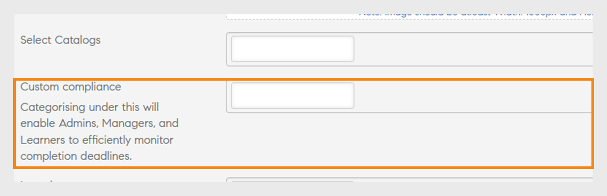
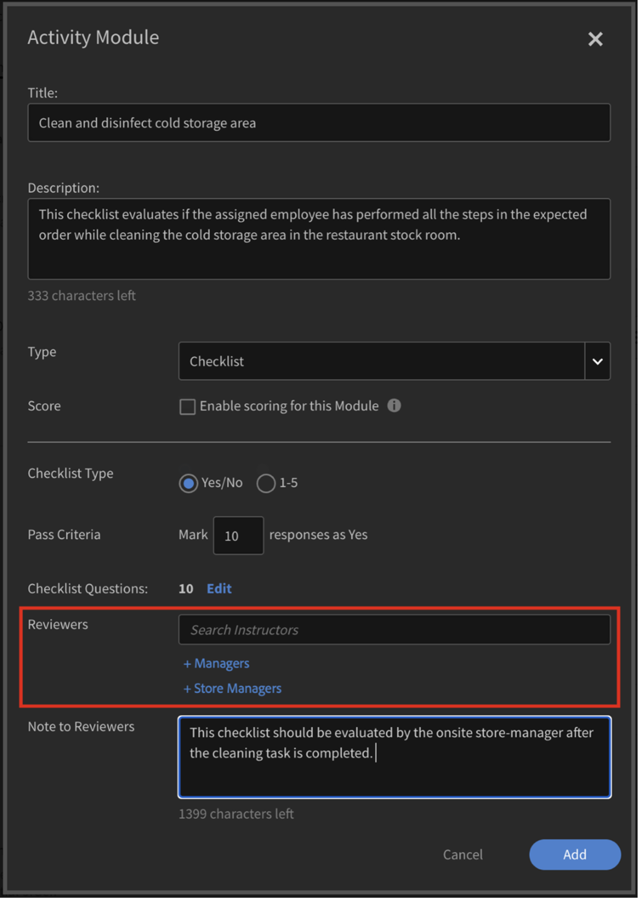

# Erstellen, Ändern und Veröffentlichen von Kursen

In diesem Artikel erfahren Sie, wie Sie Kurse, Zertifizierungen und Lernprogramme in Learning Manager erstellen.

Autoren können Lernobjekte wie Kursen, Zertifizierungen und Lernpläne erstellen. Die Teilnehmer können diese Lernobjekte nutzen, während die Administratoren den Fortschritt der Teilnehmer verfolgen können.

## Kurse in Learning Manager {#coursesincaptivateprime}

Mit Adobe Learning Manager können Autoren Kurse mit einem oder mehreren Modulen erstellen, die sich auf virtuelle Schulungen, Selbststudium, Klassenzimmerschulungen und Aktivitäten beziehen. Administratoren können diese Kurse weiterhin verwenden, um Kursinstanzen zu erstellen, Teilnehmer zu registrieren, Abzeichen zuzuweisen und Feedback für diese Kurse zu aktivieren. Sie können mit diesen Kursen auch Lernprogramme, Lernpläne und Zertifizierungen erstellen.

Autoren können E-Learning-Inhalte verwenden, die mit einem beliebigen eLearning-Tool erstellt wurden. Sonstige unterstützte Kursformate sind unter anderem Videodateien, pdf, doc, docx, ppt und pptx.

## Kurs erstellen - Grundlegender Arbeitsablauf {#createacoursebasicworkflow}

Um einen Kurs zu erstellen, führen Sie die unten genannten Schritte aus:

1. Melden Sie sich als Autor bei Adobe Learning Manager an, da nur Autoren berechtigt sind, Kurse zu erstellen. Klicken Sie nun auf der Seite „Erste Schritte“ auf **[!UICONTROL Kurse erstellen]**.
1. Geben Sie auf der **Seite Kursübersicht** den Namen des Kurses ein. Geben Sie nun eine kurze Beschreibung für diesen Kurs ein, die auf der Kurskarte angezeigt wird. Diese Beschreibung darf nicht länger als 140 Zeichen sein. Geben Sie anschließend die Detailübersicht für den Kurs ein, die auf der Seite „Kursdetails“ angezeigt wird. Die Beschreibung darf nicht länger als 1500 Zeichen sein.

   Als Autor können Sie die Beschreibung der Module anzeigen, während Sie das Modul zu einem Kurs hinzufügen.

1. Um den Kurs in anderen Sprachen zur Verfügung zu stellen, klicken Sie in der oberen linken Ecke der Seite auf „Neue Sprache hinzufügen“. Wählen Sie die Sprache/Sprachen, in denen der Kurs bereitgestellt werden soll. Klicken Sie auf **[!UICONTROL Speichern]**. Weitere Informationen finden Sie unter [Inhalt für verschiedene Sprachen hinzufügen](/help/migrated/authors/feature-summary/content-library.md).
1. **Kurseinstellungen ändern** -

   1. Wählen Sie auf der Seite „Kurseinstellungen“ Kenntnisse für den Kurs aus. Wählen Sie aus der Dropdown-Liste „Kenntnisse“ die gewünschtem Kenntnisse aus. Wählen Sie dann in der Dropdown-Liste „Stufe“ die gewünschte Stufe aus.
   1. Wählen Sie die Kurskenntnisse, Stufen und legen Sie die Credits für die Kenntnisse fest. Fügen Sie bei Bedarf weitere Kenntnisse hinzu.
   1. Wählen Sie in der Dropdownliste **Registrierungstyp** den Registrierungstyp aus.

   Im Folgenden sind die Registrierungstypen aufgeführt:

   * **Vom Manager ernannt:** Nur Manager können diese Kurse ernennen. Teilnehmer können sich für diese Art von Kursen nicht selbst registrieren.
   * **Vom Manager genehmigt:** Manager genehmigen diese Kurse. Teilnehmer können sich für diese Kurse anmelden, sind jedoch ohne Genehmigung von Manager nicht direkt für diese Kurse angemeldet. Wenn sich Teilnehmer für Kurse dieser Art anmelden, erhält der Manager eine Benachrichtigung. Nach Genehmigung des Managers werden diese Kurse für die Teilnehmer als registriert angeführt.
   * **Selbstregistrierung:** Teilnehmer können sich für diese Kurse selbst direkt registrieren.

1. Um die Änderungen zu speichern, klicken Sie auf **[!UICONTROL Speichern]**. Um den Kurs zu veröffentlichen, klicke auf **[!UICONTROL Veröffentlichen]**.

## Kurs erstellen - Erweiterter Arbeitsablauf {#createacourseadvancedworkflow}

1. Melden Sie sich als Autor bei Adobe Learning Manager an, da nur Autoren berechtigt sind, Kurse zu erstellen. Klicken Sie nun auf der Seite „Erste Schritte“ auf **[!UICONTROL Kurse erstellen]**.
1. Geben Sie auf der **Seite Kursübersicht** den Namen des Kurses ein. Geben Sie nun eine kurze Beschreibung für diesen Kurs ein, die auf der Kurskarte angezeigt wird. Diese Beschreibung darf nicht länger als 140 Zeichen sein. Geben Sie anschließend die Detailübersicht für den Kurs ein, die auf der Seite „Kursdetails“ angezeigt wird. Die Beschreibung darf nicht länger als 1500 Zeichen sein.
1. Um den Kurs in anderen Sprachen zur Verfügung zu stellen, klicken Sie in der oberen linken Ecke der Seite auf „Neue Sprache hinzufügen“. Wählen Sie die Sprache/Sprachen, in denen der Kurs bereitgestellt werden soll. Klicken Sie auf **[!UICONTROL Speichern]**. Weitere Informationen finden Sie unter [Inhalt für verschiedene Sprachen hinzufügen](/help/migrated/authors/feature-summary/content-library.md).
1. **Kurseinstellungen ändern** -

   1. Wählen Sie auf der Seite „Kurseinstellungen“ Kenntnisse für den Kurs aus. Wählen Sie aus der Dropdown-Liste „Kenntnisse“ die gewünschtem Kenntnisse aus. Wählen Sie dann in der Dropdown-Liste „Stufe“ die gewünschte Stufe aus.
   1. Wählen Sie die Kurskenntnisse, Stufen und legen Sie die Credits für die Kenntnisse fest. Fügen Sie bei Bedarf weitere Kenntnisse hinzu.
   1. Fügt dem Kurs bei Bedarf benutzerdefinierte Compliance-Labels hinzu. Siehe [Hinzufügen von Compliance-Labels zu Kurs/Lernpfad/Zertifizierung](/help/migrated/authors/feature-summary/courses.md#add-compliance-labels-to-courselearning-pathcertification).
   1. Wählen Sie in der Dropdownliste **Registrierungstyp** den Registrierungstyp aus.

   Im Folgenden sind die Registrierungstypen aufgeführt:

   * **Vom Manager ernannt:** Nur Manager können diese Kurse ernennen. Teilnehmer können sich für diese Art von Kursen nicht selbst registrieren.
   * **Vom Manager genehmigt:** Manager genehmigen diese Kurse. Teilnehmer können sich für diese Kurse anmelden, sind jedoch ohne Genehmigung von Manager nicht direkt für diese Kurse angemeldet. Wenn sich Teilnehmer für Kurse dieser Art anmelden, erhält der Manager eine Benachrichtigung. Nach Genehmigung des Managers werden diese Kurse für die Teilnehmer als registriert angeführt.
   * **Selbstregistrierung:** Teilnehmer können sich für diese Kurse selbst direkt registrieren.

1. Wählen Sie, ob Sie einen Preis für Ihren Kurs festlegen oder ihn kostenlos anbieten möchten. Wenn Sie den Kurs kostenpflichtig anbieten möchten, wählen Sie die Option **[!UICONTROL Kostenpflichtig]** und geben Sie einen Preis an. Der Preis wird dann auf der Kurskarte und auf der Kursübersicht für einen Teilnehmer angezeigt.

   HINWEIS: Dies ist nur aktiviert, wenn der Adobe Commerce-Connector konfiguriert ist.

1. Wenn Sie die Möglichkeit geben, für die Teilnehmer, sich von Ihrem Kurs abzumelden, aktivieren Sie das Kontrollkästchen **Teilnehmer können sich selbst abmelden**.

1. **Instanzkonfiguration**

   Wenn du diese Option aktiviert hast, können Teilnehmer, die sich im Status &quot;In Bearbeitung&quot; befinden, andere Instanzen besuchen und sich dort anmelden. Teilnehmende können dann den Fortschritt der vorherigen Instanz beibehalten.

   Wenn Sie nach der Veröffentlichung des Kurses zur Seite “Einstellungen“ zurückkehren, kann die Option nicht mehr bearbeitet werden.

   Sie können die Option für die folgenden Kurstypen aktivieren:

   * Selbststudium
   * Klassenzimmer
   * Aktivität
   * Gemischt

   Hinweis: Wenn du beim Duplizieren eines Kurses die Option &quot;Instanzkonfiguration&quot; im Quellkurs aktiviert hast, bleibt die Option im Zielkurs deaktiviert.

   **Instance Switch wird nicht unterstützt für**:

   * Kostenpflichtige Kurse
   * Vom Manager nominierte Kurse vom Typ &quot;Registrierung&quot;.

   Die Konfiguration des Instanzwechsels wird nicht an Peer-Konten weitergegeben, wenn sie über den Katalog freigegeben wird. Die Option bleibt im Zielkurs deaktiviert.

1. **Mehrere Anmeldungen**

   Auf diese Weise können Teilnehmer in mehreren Kursinstanzen zu einem oder zu unterschiedlichen Zeiten angemeldet werden.

   Aktiviert die Aktivierung der Option **&quot;Mehrfachanmeldung** &quot;, um zwischen verschiedenen Kursanmeldungen eines Teilnehmers zu wechseln. Wenn Sie den Instanzwechsel aktiviert haben, können Sie nicht die Mehrfachregistrierung verwenden.

1. Wählen Sie die Voraussetzungskurse, die der Teilnehmer absolviert haben muss, bevor er an Ihrem Kurs teilnehmen kann. Klicken Sie auf das Feld „Kurse“ und wählen Sie die entsprechenden Kurse aus der Kursliste.
1. Aktivieren des **Kontrollkästchens &quot;Voraussetzungen** aktivieren ****&quot;, wenn die kurse, die für mich erforderlich sind, obligatorisch sind.
1. Fügen Sie Schlüsselwörter für Ihren Kurs als Tags hinzu. Diese Tags helfen den Teilnehmern, Ihren Kurs leichter zu finden. Alle diese Tags werden basierend auf den von uns hinzugefügten Modulen automatisch hinzugefügt. Wenn Sie weitere Tags haben, die Sie zu diesem Kurs hinzufügen möchten, können Sie diese eingeben.
1. Fügen Sie Schlüsselwörter für Ihren Kurs als Tags hinzu. Diese Tags helfen den Teilnehmern, Ihren Kurs leichter zu finden. Alle diese Tags werden basierend auf den von uns hinzugefügten Modulen automatisch hinzugefügt. Wenn Sie weitere Tags haben, die Sie zu diesem Kurs hinzufügen möchten, können Sie diese eingeben.
1. Wähle im Feld &quot;Automatische Rente&quot; ein Datum aus, an dem der Kurs in den Ruhestand geht. Die/der Administrator(in) muss zuerst die Option &quot;Automatisch einstellen&quot; aktivieren.
1. Um die Änderungen zu speichern, klicken Sie auf **[!UICONTROL Speichern]**. Um den Kurs zu veröffentlichen, klicke auf **[!UICONTROL Veröffentlichen]**.

### Compliance-Labels für Kurs/Lernpfad/Zertifizierung hinzufügen {#add-custom-compliance-label}

So fügt ihr Compliance-Labels zu Kursen hinzu:

1. Wähle im Author-Programm Kurse ]**/Lernpfade]**/**[!UICONTROL Zertifizierungen aus]**, **[!UICONTROL und wähle**[!UICONTROL &quot;Hinzufügen&quot;]****[!UICONTROL .
1. Gib den Namen und andere Details ein, z. B. Beschreibung, Kenntnisse.
1. Gib im **[!UICONTROL Textfeld &quot;Benutzerdefinierte Compliance]** &quot; das Compliance-Label ein, und wähle es aus.

   
   _Benutzerdefinierte Compliance hinzufügen_

   >[!IMPORTANT]
   >
   >Wenn ihr benutzerdefinierte Compliance hinzufügt, solltet ihr eine Deadline für den Kurs festlegen.

1. Speichere und veröffentliche den Kurs/Lernpfad/die Zertifizierung.
Jetzt gilt der Kurs/Lernpfad/die Zertifizierung als Compliance-Art. Administratoren können diesen Kurs zum Compliance-Dashboard hinzufügen und ihn an Manager weitergeben, um den Fortschritt zu verfolgen

>[!NOTE]
>
>Autoren können auch die Compliance-Labels zu einem vorhandenen Kurs/Lernpfad/zertifizierung hinzufügen, indem sie sie bearbeiten.

## Gamification-Punkte

Sie können Gamification-Punkte auf Kurs- und Kursinstanzebene zuweisen. Damit können Sie Punkte an verschiedene Kurse oder Instanzen vergeben. Teilnehmer erhalten Anreize, bestimmte Kurse abzunehmen oder eine bestimmte Kursinstanz gegenüber anderen zu bevorzugen.

1. Wählen Sie auf Kursinstanzebene **[!UICONTROL Gamification-Punkte]**.


*Set Points for Gamification.*

1. Wählen Sie **[!UICONTROL Bearbeiten]**.
1. Wenn du &quot;Einstellungen auf Kursebene verwenden&quot; auswählst, werden die folgenden Optionen angezeigt:

   * **[!UICONTROL Nach Abschluss]**: Wählen Sie diesen Schalter aus, wenn Teilnehmende 100 Punkte erhalten sollen, wenn sie einen Kurs abschließen.
   * **Weitere Regeln**

      * **[!UICONTROL Frühzeitiger Abschluss]**: Wenn Sie diese Option auswählen, erhalten die ersten 30 Teilnehmenden 100 Punkte, wenn sie einen Kurs abschließen.
      * **[!UICONTROL Zeitgerechter Abschluss]**: Wenn Sie diese Option auswählen, erhalten die Teilnehmenden 100 Punkte, wenn sie einen Kurs innerhalb von 999 Tagen abschließen.

1. Wenn Sie **[!UICONTROL Benutzerdefinierte Einstellungen verwenden]** wählen, werden die folgenden Optionen angezeigt:

   * **[!UICONTROL Nach Abschluss]**: Wählen Sie diesen Schalter aus, wenn Teilnehmende 100 Punkte erhalten sollen, wenn sie einen Kurs abschließen.
   * **Weitere Regeln**

      * **[!UICONTROL Frühzeitiger Abschluss]**: Wenn Sie diese Option auswählen, können Sie festlegen, wie viele Teilnehmende bestimmte Punkte erhalten.
      * **[!UICONTROL Rechtzeitiger Abschluss]**: Wenn Sie diese Option auswählen, können Sie die Anzahl der Punkte bestimmen, die Teilnehmende erhalten, wenn sie einen Kurs innerhalb einer bestimmten Zeit abschließen.

   

   *Frühzeitige und zeitnahe Fertigstellung festlegen*

1. Wählen Sie **[!UICONTROL Speichern]**.

## Lernressourcen zusammenfassen

Ein Autor kann entscheiden, ob er die Lernressourcen auf der Lernplanebene aggregieren oder auf einer individuellen Kursebene beibehalten möchte.

Wähle **[!UICONTROL als Autor den Lernpfad]** > **[!UICONTROL Einstellungen]** aus. Klicke auf **[!UICONTROL &quot;Bearbeiten&quot;]**.

**[!UICONTROL Im Abschnitt &quot;Ressourcen&quot; (Resources]**) ist die Checkbox &quot;Komponenten-Kursressourcen auf Lernpfadebene aggregiert&quot; angezeigt, wenn aktiviert ist, ob die vorhandenen Ressourcen auf Kursebene auf Lernpfadebene angezeigt werden.

>[!NOTE]
>
>Auf der Seite &quot;Einstellungen&quot; eines Lernpfads kann auch ein Administrator diese Option aktivieren. Diese Option zeigt Ressourcen an, die auf Kursebene auf der Ebene des Lernpfads angezeigt werden.

## Planungs-Assistent

Zur Bewältigung von Konflikten bei der Buchung von Kursleiter(inne)n und Klassenzimmern. Wenn du wissen möchtest, zu welchem Zeitpunkt und zu welchem Datum ein Kursleiter verfügbar ist, bevor du ihn dem Kurs zuweisen möchtest, verwende den Planungsassistenten.

Klicke beim Erstellen eines Kurses für einen VC- oder CR-Kurs auf &quot;Scheduling Assistant&quot;.


*Assistent für die Launch-Planung*

Das Fenster &quot;Scheduling Assistant&quot; wird geöffnet.


*Der Terminierungsassistenten-Dialog*

Mit dem Zeitplanungs-Assistenten können Sie:

* Kursleiter anhand ihrer Namen suchen.
* Kursleiter anhand ihrer Fähigkeiten suchen.

### Kursleiter anhand ihrer Namen suchen.

Geben Sie im Feld &quot;Kursleiter&quot; den Namen des Kursleiters ein oder suchen Sie nach einem Teil des Namens des Kursleiters. Es wird eine Liste von Kursleitern angezeigt, aus der Sie einen Kursleiter auswählen können.


*Suche nach Kursleitern*

Es können mehrere Kursleiter(innen) ausgewählt werden, aber nur jeweils ein(e) Kursleiter(in). Die ausgewählte Zeit wird im Zeitkonfliktfenster hervorgehoben. In der Nähe des Kursleiters erscheint ein Kreuzsymbol, auf das du klickst, um den Kursleiter zu entfernen.


*Suche nach mehreren Kursleitern*

### Kursleiter anhand ihrer Kenntnisse suchen.

Nach Kursleiter(inne)n mit einzelnen oder mehreren Kenntnissen suchen. Für die Suche wird der Operator AND verwendet.

Skills können nur nach teil- oder vollständigen Kompetenznamen und nicht nach Kompetenzniveau durchsucht werden.

Geben Sie im Assistenten den Kursleiter(innen)namen, den Standort und die maximale Anzahl der Lizenzen ein.

Du kannst auch nach Suchfunktionen suchen, die angezeigt werden, nachdem du auf das Filtersymbol auf der rechten Seite des Instructor-Suchfelds geklickt hast. Der folgende Screenshot zeigt die Schaltfläche an.


*Suche nach Kursleitern nach Kompetenzen*

### Benutzergruppenfilter

Wähle den Filter im Instructor-Feld aus. Mit dem Filter **[!UICONTROL Benutzergruppe]** können Autor(inn)en oder benutzerdefinierte Autor(inn)en die/den richtige(n) Kursleiter(in) finden, indem sie die Werte in der Benutzergruppe verwenden.

Wenn beide Filter angewendet werden, wird eine Liste von Kursleiter(inne)n angezeigt, die der Benutzergruppe angehören und über die ausgewählten Kenntnisse verfügen.

Dies gilt für den Terminierungsassistenten auf der Kurs- oder Instanzenseite.


*Nach Anwendergruppen filtern*

### Instanzseite

Sie können den Planungsassistenten auch über die Instanzenseite aufrufen, wie unten gezeigt.

Der Terminierungsassistent ist auch auf der Instanzseite sowie für Administratoren und benutzerdefinierten Administrator/Autor verfügbar.


*Kursleiter auf der Seite &quot;Instanzen&quot; planen*

### Nach einem Klassenzimmer suchen

Du kannst sowohl auf den Seiten des Moduls als auch auf den Seiten des Planungsassistenten sowohl den Namen des Unterrichtsraums als auch den Standortbereich angeben, um nach einem Speicherort zu suchen.

## Rich-Text-Formatierung

Beim Erstellen eines Kurses, eines Lernprogramms, einer Zertifizierung oder Arbeitshilfe können Autoren verschiedene Inhaltstypen wie Text, Bild oder verschiedene Textformatierungsoptionen eingeben.

Wenn du einen Kurs erstellst, siehst du im Feld &quot;Kursüberblick&quot; den Rich-Text-Editor. Du kannst Inhalte formatieren, Bilder hinzufügen, Hyperlinks hinzufügen usw.


*Rich Text Editor starten*

Ebenso können Sie mit dem Rich-Text-Editor die Beschreibung ändern, wenn Sie eines der folgenden Elemente erstellen:

**Lernprogramm**


*Rich-Text-Editor für ein Lernprogramm verwenden*

**Zertifizierung**


*Rich-Text-Editor für eine Zertifizierung verwenden*

**Arbeitshilfe**


*Rich-Text-Editor für Job Aid verwenden*

Außerdem können Sie den Rich-Text-Editor für andere Sprachen verwenden.

## Unterstützung von Rich-Text-Beschreibungen für die Headless-Benutzeroberflächen

### Warum ist CSS erforderlich?

Rich Text besteht aus HTML-Markup. Wenn Sie das Markup unverändert rendern, wird der Standardstil des Browsers angewendet. Das passt oft nicht gut zu den Stilrichtlinien des Unternehmens. Ein CSS ist erforderlich, um die Richtlinien zu erfüllen.

### Standardstil

Das angehängte CSS-Stylesheet enthält den Stil, der von Learning Manager angewendet wird. Das Styling wurde unter Berücksichtigung der häufigsten Anwendungsfälle optimiert. Laden Sie die angehängte CSS-Datei herunter und importieren Sie sie entsprechend Ihren Konventionen und Ihrem Build-System in Ihre Webanwendung. Die definierten CSS-Klassen werden unter der QL-Editor-Klasse namespaced und beeinträchtigen ihre vorhandenen Stile nicht.

### Stile anpassen

Der Standardstil erfüllt möglicherweise nicht alle Anforderungen. Die Anpassungen können durch Überschreiben des bereitgestellten CSS vorgenommen werden. Der Stil wird als Nachfahren-Selektoren unter ql-editor eingeschlossen. Folgende Klassen werden verwendet:

* Einzug: **li.ql-indent-$number**. $number variiert von 1 bis 9
* Größe: **ql-size-small**, **ql-size-large**, **ql-size-huge**

* Ausrichtung: **ql-align-center**, **ql-align-justify**, **ql-align-right**

* Farbe: **ql-color-$color**. $color = white, red, orange, yellow, green, blue, purple
* Hintergrund: **ql-bg-$color**. $color = black, red, orange, yellow, green, blue, purple
* HTML-Tags: p, ol, ul, pre, blockquote, h1, h2, h3, h4, h5, h6

[CSS-Datei für die Anpassung.](assets/ql-headless.css)

### API-ÄNDERUNGEN ZUM AKTIVIEREN VON RICH-TEXT-ÜBERSICHTEN

Wenn Kunden eine Headless-Benutzeroberfläche erstellen, müssen sie die Lernobjekte in der von ihnen entwickelten benutzerdefinierten Benutzeroberfläche anzeigen. Hierzu wird üblicherweise die API [GET /learningObjects](https://learningmanagereu.adobe.com/docs/primeapi/v2/#!/learning_object/get_learningObjects) verwendet, die bereitgestellt wird. Da Learning Manager die Erfassung von &quot;Rich Text&quot; für das Übersichtsfeld unterstützt, wird das Datenmodell von Lernobjekten in den API-Antworten ebenfalls verfügbar. Siehe das Feld mit dem Namen &quot;richTextOverview&quot; im Fragment des Modells in der API Antwort unten. Beachte auch, dass das zuvor belichte Feld (&quot;Übersicht&quot;) aus Gründen der Abwärtskompatibilität unverändert bleibt.

```
{ 
 "data": [ 
 { 
 "id": "string", 
 "type": "string", 
 "attributes": { 
 … 
 "localizedMetadata": [ 
 { 
 "description": "string", 
 "locale": "string", 
 "name": "string", 
 "overview": "string", 
 "richTextOverview": "string" 
 } 
 ], 
 … 
 }, 
 "relationships": { 
 … 
 } 
 } 
 } 
 ] 
} 
```

Kunden, die bereits das Übersichtsfeld verwenden, bleiben in ihrer Headless-Oberfläche unverändert und sehen nur einfachen Text wie bisher. Wenn Kund(inn)en die Rich-Text-Übersicht nutzen möchten, müssen sie in der Author-Benutzeroberfläche Übersichten im Rich-Text-Format für ihre Lernobjekte erstellen. Danach gibt Learning Manager zusätzlich zum einfachen Text (wie zuvor) im API-Antwortmodell auch die Rich-Text-Übersicht zurück.

Um diesen Rich-Text jedoch in der Benutzeroberfläche zu rendern, muss der Kunde ein CSS einschließen. Dies wird in den folgenden Abschnitten ausführlich erläutert.

## Mehrere Versuche zulassen {#allowmultipleattempts}

Nachdem der Administrator mehrere Versuche aktiviert hat, können Sie als Autor mehrere Versuche für ein interaktives E-Learning-Modul auf Kurs- oder Modulebene konfigurieren.


*Mehrere Versuche für ein interaktives E-Learning-Modul konfigurieren*

<table>
 <tbody>
  <tr>
   <td>
    <p><b>Option</b></p></td>
   <td>
    <p><b>Beschreibung</b></p></td>
  </tr>
  <tr>
   <td>
    <p>Siehe Versuche unter</p></td>
   <td>
    <p>Sie können die Anzahl der Versuche für ein Modul auf unendlich setzen oder ein bestimmtes Limit festlegen.<span style="font-size: 0.8125rem;">Die Informationen zu den Versuchen werden dem Teilnehmer angezeigt, sobald er aktiviert ist. Der Teilnehmer kann das Modul neu aufnehmen, indem er auf den Button "Reattempt" klickt.</span></p></td>
  </tr>
  <tr>
   <td>
    <p>Stoppen Sie den neuen Versuch, sobald das Modul abgeschlossen oder bestanden ist</p></td>
   <td>
    <p>Um zu konfigurieren, wann Teilnehmer die Option "Neuer Versuch" auswählen sollen, aktivieren Sie das Häkchen "Neuen Versuch beenden, sobald das Modul abgeschlossen oder bestanden ist". Nach erfolgreichem Abschluss des Moduls wird die Option "Reattempt" aus der Ansicht der Teilnehmer entfernt.</p></td>
  </tr>
  <tr>
   <td>
    <p>Modul zwischen versuchen 0:0:1-Format: Tage/Stunden/Minuten</p></td>
   <td>
    <p>Du kannst Module für einen bestimmten Zeitraum zwischen den Versuchen sperren, indem du das Häkchen "<b>Modul zwischen versuchen 0:0:1 Format: Tage/Stunden/Minuten</b>" aktiviert. Wenn ein Modul gesperrt ist, kann der Teilnehmer das Modul erst besuchen, wenn die vorgesehene Sperrzeit verstrichen ist. </p>
    <p>ou kann die Endkriterien für einen Versuch definieren, indem sie die Kontrollkästchen "<b>Player-Schließen</b>" oder "<b>Abschluss</b>" aktivieren.</p></td>
  </tr>
  <tr>
   <td>
    <p>Spieler schließen</p></td>
   <td>
    <p>Jeder Starte eines Moduls wird als neuer Versuch behandelt, wenn das Kriterium als <b>Payer schließen</b> ausgewählt ist. Der Teilnehmer wird mit Details zum Sperren des Moduls und beim Schließen des Players aufgefordert.</p></td>
  </tr>
  <tr>
   <td>
    <p>Abschluss</p></td>
   <td>
    <p>Wenn das Ende eines Versuchs basierend auf <b>Abschluss</b> festgelegt wird, wird er basierend auf den Erfolgskriterien für den Inhalt berechnet. Die Teilnehmer dürfen das Modul nicht erneut versuchen, bis der Inhalt die Abschlussinformationen sendet. Die Details der Modulsperrung und des Versuchs werden dem Teilnehmer mitgeteilt, sobald der Versuch beendet ist.</p></td>
  </tr>
  <tr>
   <td>
    <p>Zeitlimit festlegen, um das Modul abzuschließen</p></td>
   <td>
    <p>Autoren können eine Zeitbeschränkung für das Ausfüllen eines Moduls festlegen, indem sie das Häkchen "<b>Zeitbeschränkung für das vollständige Modul</b> festlegen" aktivieren.</p>
    <p>Jeder Start eines Players wird als neuer Versuch betrachtet und der Teilnehmer wird während des Starts über die Zeitangaben informiert.</p>
    <p><b>Hinweis:</b><span style="font-size: 0.8125rem;">Der Versuch endet automatisch, sobald die Zeit abgelaufen ist. Wenn Sie den Player ebenfalls schließen, wird der aktuelle Versuch beendet.</span></p></td>
  </tr>
  <tr>
   <td>
    <p>Mehrere Versuche auf Modulebene</p></td>
   <td>
    <p>Wenn Sie einen Versuch auf Modulebene aus dem Dropdown-Menü Versuch festlegen unter auswählen, können Sie die Optionen auf Modulebene individuell konfigurieren.</p></td>
  </tr>
 </tbody>
</table>

## Kursmodule {#coursemodules}

### Module hinzufügen {#addmodules}

Sie können jetzt Inhalts-, Vorbereitungs- und Test-Module hinzufügen. **Inhalt**-Module sind die Hauptmodule des Kurses. **Die Vorbereitungs**-Module enthalten einige grundlegende Informationen, die den Teilnehmern helfen können, sich auf den Kurs vorzubereiten. Diese Module sind für die Teilnehmer nicht obligatorisch. **Test**-Module helfen Teilnehmern den Inhalt zu überspringen und den Test durchzuführen, wenn sie bereits von den Inhalten Kenntnis haben und den Test durchführen wollen, um die Konformitätsanforderung zu erfüllen.

Führen Sie die folgenden Schritte aus, um ein Inhaltsmodul hinzuzufügen:

1. Klicken Sie auf **[!UICONTROL Module hinzufügen]**. Sie können vier Optionen zum Hinzufügen von Modulen sehen. Die erste Option ist das Hinzufügen von Selbststudium-Modulen. Dies sind die Module, die Sie in Adobe Learning Manager erstellen und der Modulbibliothek hinzufügen. Diese zweite Option ist das Einrichten des virtuellen Klassenzimmers. Die dritte ist das Einrichten eines Klassenzimmermoduls und die vierte das Aktivitätsmodul.

   

   *Modul für Kurs hinzufügen*

   **Selbststudium-Modul:** In diesem Modus können Sie ein Kursmodul in Ihrem eigenen Tempo starten und abschließen. Sie können Ihren eigenen Zeitplan festlegen.

   Nachdem Sie auf die Option geklickt haben, wird die Liste der Module mit automatischer Geschwindigkeit angezeigt, die Ihrer Modulbibliothek bereits hinzugefügt wurden. Hier können Sie entweder durch die Liste scrollen und diejenigen auswählen, die Sie hinzufügen möchten, oder Sie können nach den Modulen suchen, indem Sie den Namen des Moduls in das Suchfeld oder die Modul-Tags eingeben.

   Nachdem Sie die Module ausgewählt haben, klicken Sie auf **[!UICONTROL Hinzufügen]**. Diese Module werden jetzt im Abschnitt „Inhalt“ angezeigt.

   Sie können die Module auch neu anordnen. Ziehen Sie ein beliebiges Modul nach oben oder unten und ordnen Sie die Module in der richtigen Reihenfolge an.

   **Virtuelles Klassenzimmer-Modul:** In diesem Modus können Teilnehmer Online-Live-Vorlesungen besuchen, die von einem geschulten Kursleiter geleitet werden. Geben Sie den Titel und die Beschreibung ein und legen Sie die Dauer der Sitzung fest. Sie können auch die Konferenz-URL und die Kursleiter für die Durchführung der Sitzung angeben. Um die Änderungen zu speichern, klicken Sie auf **[!UICONTROL Fertig]**.

   

   *VC-Modul hinzufügen*

   Wenn Sie einen Kurs mithilfe des Konfigurationsdialogfelds &quot;Virtuelles Klassenzimmer&quot; erstellen, stellen Sie das **Konferenzsystem** auf die von Ihnen erstellte Teams-Verbindung ein. Wählen Sie aus, ob Sie einen Meetingorganisator für die Veranstaltung wünschen.

   Wenn du &quot;Ja **&quot; für einen Meeting-Organisator auswählst**, musst du den Namen des Veranstalters eingeben. Geben Sie den Namen ein und wählen Sie den Organisator aus.

   **Lobby-Umgehung**

   * Wenn Sie **Ja** wählen, können alle Teilnehmer am Meeting teilnehmen.
   * Wenn Sie **Nein** wählen, wird eine Anfrage an den Organisator gesendet, dem Teilnehmer die Teilnahme am Meeting zu erlauben oder zu verweigern.

   **Hinweis:** Ein Teilnehmer muss auf Microsoft Teams verfügbar sein. Teilnehmende können jedoch als Gäste an Learning Manager teilnehmen.

   **Klassenzimmer-Modul:** In diesem Modus können Teilnehmer persönlich Vorlesungen besuchen, die von einem geschulten Kursleiter geleitet werden. Geben Sie den Titel und die Beschreibung ein und legen Sie die Dauer der Sitzung fest. Sie können auch den Ort der Klasse und die Kursleiter für die Durchführung der Sitzung angeben. Um die Änderungen zu speichern, klicken Sie auf **[!UICONTROL Fertig]**.

   

   *Lernmodul hinzufügen*

   Wenn du einen Kurs erstellst, lege im Konfigurationsdialogfeld für virtuelle Klassenzimmer das Konferenzsystem auf die von dir erstellte Microsoft Teams Verbindung fest. Wählen Sie aus, ob Sie einen Meetingorganisator für die Veranstaltung wünschen.

   Wenn du &quot;Ja&quot; für einen Meeting-Organisator auswählst, musst du den Namen des Veranstalters eingeben. Geben Sie den Namen des Organisators ein und wählen Sie den Organisator aus.

   **Lobby-Umgehung**

   * Wenn du &quot;Ja&quot; auswählst, können alle Teilnehmer am Meeting teilnehmen.
   * Wenn du &quot;Nein&quot; auswählst, wird eine Aufforderung an den Organisator gesendet, den Teilnehmer daran zu hindern oder daran zu hindern.

   **Hinweis:** Wenn ein Teilnehmer Microsoft Teams als Gast beitreten möchte, muss er die E-Mail eingeben. Die E-Mail-Adresse muss in Learning Manager vorhanden sein.

   **Aktivitätsmodul:** In diesem Modus müssen die Teilnehmer eine Reihe von Aktivitäten absolvieren, z. B. Workshops, Übungen, Fragebögen und andere Lernaktivitäten. Geben Sie den Titel, die Beschreibung und die externe URL als Referenz ein. Um die Änderungen zu speichern, klicken Sie auf **[!UICONTROL Fertig]**.

   

   *Aktivitätsmodul hinzufügen*

   Du kannst die Dauer festlegen, während du in einem Kurs ein Aktivitätsmodul für aktivitätstypige Dateieinreichungs- und xAPI-basierte Module hinzufügst.

1. Fügen Sie auf ähnliche Weise Module für den Prework- und Test-Modus hinzu.
1. Wählen Sie nach Bedarf den gewünschten Abfolgetyp für Module, d. h. sortiert oder unsortiert.

   Wenn Sie **Sortiert** wählen, erscheinen die Module in der Reihenfolge, in der Sie diese erstellt haben. Wenn Sie **Unsortiert** wählen, wird für die Module keine Reihenfolge festgesetzt. Die Teilnehmer können die Module in beliebiger Reihenfolge ausführen.

1. Wählen Sie in der Dropdown-Liste Pflichtmodule die Anzahl der Module aus, die der Teilnehmer für den Abschluss des Kurses belegen muss.
1. Fügen Sie ein Titelbild und das Bannerbild für den Kurs hinzu. Die Kataloge werden vom Administrator erstellt. Weitere Informationen finden Sie unter [Kataloge](/help/migrated/administrators/feature-summary/catalogs.md).

   **Hinweis:** Die empfohlenen Abmessungen sind:

   * **Deckbild:** 300 px x 300 px
   * **Bannerbild:** 1.600 px x 140 px

1. Klicken Sie oben rechts auf der Seite auf **[!UICONTROL Speichern]**.

#### Im Aktivitätsmodul HTML Link hinzufügen

Autoren können im Aktivitätsmodul HTML Links hinzufügen und die Abschlusskriterien festlegen. So füierst du einen HTML-Link hinzu, und legt die Abschlusskriterien fest:

1. Wähle **[!UICONTROL im Author-Programm auf der Startseite &quot;Kurse]** erstellen&quot;.
1. Im Bildschirm &quot;Kurskatalog ]**&quot; die**[!UICONTROL  Option &quot;Hinzufügen&quot;]**auswählen**[!UICONTROL 
1. Gib den Namen und die Beschreibung des Kurses ein.
1. Wähle **[!UICONTROL &quot;**[!UICONTROL  Modul ]**]** hinzufügen&quot; > Aktivitätsmodul **** aus.
1. Gib in der **[!UICONTROL Aufforderung zum Aktivitätsmodul]** den Namen und die Beschreibung ein.
1. Wähle den **[!UICONTROL Typ]** als **[!UICONTROL externen URL]** aus.
1. Wähle eine der folgenden Optionen aus der **[!UICONTROL Option &quot;Fertigstellungskriterien&quot;]** .
   * **[!UICONTROL Teilnehmermarkierungen sind abgeschlossen]**: Der Teilnehmer hat die Möglichkeit, den Kurs im Fluidic Player als abgeschlossen zu markieren.
   * **[!UICONTROL Beim Starten von Inhalten]**: Der Kurs wird automatisch als abgeschlossen markiert, sobald der Teilnehmer ihn startet.

   
   _Abschlusskriterien_

1. Wähle **[!UICONTROL &quot;Kurs hinzufügen]** und veröffentlichen&quot;.

## Checkliste {#create-checklist}

Die Bewertung ist ein wichtiger Aspekt jedes LMS. Online-Beurteilungen gehören zu den wichtigsten Methoden, um das Verständnis eines Themas durch die Teilnehmer zu bewerten. Oft ist es jedoch notwendig, das Verständnis einer Person zu bewerten, während sie/sie gerade im Job ist, indem man sie bei der Durchführung der erforderlichen Aufgaben beobachtet.

Nehmen wir an, Ladenangestellte oder Lagerarbeiter unterliegen bei ihrer tagtäglichen Arbeit einer Bewertung. Es könnten die zur Reparatur einer Kaffeemaschine ausgeführten Schritte oder die Schritte bei der Verpackung eines Materials sein. Kursleiter können Mitarbeiter für solche Aufgaben anhand einer Checkliste in der Bewertungsaktivität mit „Bestanden“ oder „Nicht bestanden“ bewerten.

### Erstellen einer Checkliste {#createachecklist}

Nur ein Autor kann eine Checkliste erstellen. Eine Checkliste ist ein Aktivitätsmodultyp. Während du ein Aktivitätsmodul einstellst, kannst du als Autor eine Aktivität als **Checkliste** auswählen, wie unten gezeigt:


*Checkliste erstellen*

Nachdem Sie die Option **Checkliste** ausgewählt haben, werden einige weitere Optionen angezeigt.

**Checklistentyp:** Wählen Sie eine Option aus, **Ja/Nein** oder **1-5**. Wenn Sie „Ja/Nein“ wählen, enthält die Checkliste Fragen, die nur mit Ja oder Nein beantwortet werden können. Wenn Sie „1-5“ wählen, wird eine Likert-Checkliste angezeigt, in der Sie eine Frage auf einer Fünf-Punkte-Skala bewerten können.

**Kriterien für das Bestehen:**

<table>
 <tbody>
  <tr>
   <td>
    <p>Wenn Sie <b>Ja/Nein</b> ausgewählt haben, dann...</p></td>
   <td>
    <p>Wenn Sie <b>1-5</b> ausgewählt haben, dann...</p></td>
  </tr>
  <tr>
   <td>
    <p>Legen Sie als Kriterium für das Bestehen eine Anzahl der Ja-Antworten fest. Wenn Sie z. B. 3 eingeben, besteht der Teilnehmer den Kurs, wenn er bei der Auswertung von einem Kursleiter mindestens drei <b>Ja</b>-Antworten erhält.</p></td>
   <td>
    <p>Legen Sie als Kriterien für das Bestehen als Schwellenwert eine beliebige Anzahl zwischen 1 und 5 fest. Wenn Sie beispielsweise 2 und 4 eingeben, besteht der Teilnehmer den Kurs, wenn er mindestens <b>zwei </b>Bewertungen erhält, deren Punktzahl mindestens gleich <b>vier</b> ist.</p></td>
  </tr>
 </tbody>
</table>

Wählen Sie einen oder mehrere Kursleiter, die den Teilnehmer bewerten sollen.

Wenn du kommentare oder Anmerkungen hast, kannst du sie im **Textfeld &quot;Hinweis&quot; zum Kursleiter** hinzufügen.

Fügen Sie nun die Checklistenfragen hinzu. Klicken Sie auf **[!UICONTROL Hinzufügen]**. Sie können nur bis zu 150 Fragen hinzufügen.


*Checklistenfragen hinzufügen*

Um mehr Fragen hinzuzufügen, klicken Sie auf **[!UICONTROL Weitere hinzufügen]**.

Speichern Sie die Änderungen, fügen Sie das Modul hinzu und veröffentlichen Sie den Kurs.

### Kenntnisse hinzufügen {#addskills}

Geben Sie auf dieser Seite die folgenden Details ein:

1. Wählen Sie die Kurskenntnisse, Stufen und legen Sie die Credits für die Kenntnisse fest. Fügen Sie bei Bedarf weitere Kenntnisse hinzu.

   

   *Neue Skills für einen Kurs hinzufügen*

1. Wählen Sie die Art der Anmeldung. Die folgenden Optionen sind verfügbar:

   * **Vom Manager ernannt:** Nur Manager können diese Kurse ernennen. Teilnehmer können sich für diese Art von Kursen nicht selbst registrieren.
   * **Vom Manager genehmigt:** Manager genehmigen diese Kurse. Teilnehmer können sich für diese Kurse anmelden, sind jedoch ohne Genehmigung von Manager nicht direkt für diese Kurse angemeldet. Wenn sich Teilnehmer für Kurse dieser Art anmelden, erhält der Manager eine Benachrichtigung. Nach Genehmigung des Managers werden diese Kurse für die Teilnehmer als registriert angeführt.
   * **Selbstregistrierung:** Teilnehmer können sich für diese Kurse selbst direkt registrieren.

1. Wenn Sie die Möglichkeit geben, für die Teilnehmer, sich von Ihrem Kurs abzumelden, aktivieren Sie das Kontrollkästchen **Teilnehmer können sich selbst abmelden**.
1. Wählen Sie die Voraussetzungskurse, die der Teilnehmer absolviert haben muss, bevor er an Ihrem Kurs teilnehmen kann. Klicken Sie auf das Feld „Kurse“ und wählen Sie die entsprechenden Kurse aus der Kursliste.

   

   *Kurse hinzufügen.*

1. Aktivieren Sie das Kontrollkästchen **Voraussetzungen**, wenn die erforderlichen Kurse für mich obligatorisch sein sollen.
1. Fügen Sie Schlüsselwörter für Ihren Kurs als Tags hinzu. Diese Tags helfen den Teilnehmern, Ihren Kurs leichter zu finden. Alle diese Tags werden basierend auf den von uns hinzugefügten Modulen automatisch hinzugefügt. Wenn Sie weitere Tags haben, die Sie zu diesem Kurs hinzufügen möchten, können Sie diese eingeben.
1. Fügen Sie die Profile Ihrer Zielgruppe für diesen Kurs hinzu, indem Sie auf den Textbereich klicken und die Profile aus den Vorschlägen auswählen.
1. Fügen Sie Ressourcendateien für Ihren Kurs als zusätzliches Material hinzu. Ziehen Sie Ihre Materialien wie Text-, Video- oder Audiodateien in den entsprechenden Bereich.
1. Dieser Kurs wird nun für diese Teilnehmer verfügbar sein, die diese Profile als empfohlenen Kurs haben. Sie können in diesem Abschnitt auch zusätzliche Ressourcen für Ihre Teilnehmer hinzufügen. Teilnehmer können diese Dateien zur späteren Bezugnahme herunterladen. Sobald Sie mit all diesen Veränderungen fertig sind, klicken Sie auf **[!UICONTROL Speichern]** in der rechten oberen Ecke. Dadurch wird Ihr Kurs als Entwurf gespeichert. Ihr Kurs wird standardmäßig als Entwurf gespeichert.

## Kursleiter für Module zuweisen {#assigninstructorsformodules}

1. Nachdem Sie die Module für den Kurs erstellt haben, können Sie den Modulen Kursleiter zuweisen. Klicken Sie im Autoren-Dashboard auf **[!UICONTROL Kurskatalog]**.
1. Klicken Sie auf den Kurs, dessen Modul Sie den Kursleitern zuweisen möchten.
1. Klicke im **Abschnitt &quot;Module** hinzufügen&quot; auf das Modul, dem du einen Kursleiter zuweisen möchtest.
1. Geben Sie im Feld **Kursleiter** den Benutzernamen des Benutzers an, dem Sie die Kursleiterrolle zuweisen möchten.

   

   *Anwendern eine Lehrerrolle zuweisen*

1. Um den Kurs mit den Updates erneut zu veröffentlichen, klicke auf **[!UICONTROL &quot;Erneut veröffentlichen&quot;]**.

## Beobachtungs-Checkliste

Ein Checklistenmodul kann jetzt neben Kursleiter(innen)n zusätzlich von Manager(innen)n überprüft werden. Personal-Manager(innen) sowie nicht hierarchische Manager(innen) wie Filial-Manager(innen) oder Standort-Manager(innen) können die Checkliste überprüfen und abschließen.

Kursautoren können Personen-Manager und (falls zutreffend) nicht hierarchische Manager als Prüfer hinzufügen, indem sie diese Rollenoptionen im Abschnitt &quot;Prüfer&quot; auswählen und gleichzeitig ein Checklistenmodul einrichten. Dies kann auf Kursinstanzebene erfolgen.



*Prüfer in einem Aktivitätsmodul hinzufügen*

Wenn du die Option &quot;**[!UICONTROL +Manager]**&quot; auswählst, kann der Manager des Teilnehmers in der Organisationshierarchie die Checkliste automatisch überprüfen. Manager-Namen müssen nicht einzeln gesucht und hinzugefügt werden.

Wenn Ihr(e) Kontoadministrator(in) durch Verwendung der Option &quot;Aktive Felder&quot; nicht-hierarchische Manager-Rollen eingerichtet hat (z. B. Standort-Manager(in)), stehen Ihnen diese Manager-Rollen zur Auswahl, und Sie können sie aktivieren, um die Checkliste zu überprüfen.

Manager-Namen müssen nicht einzeln gesucht und hinzugefügt werden. Wenn sich Teilnehmer für den Checklistenkurs registrieren, sendet er automatisch eine Benachrichtigung an ihre Manager/Filial-Manager zur Überprüfung zusammen mit einem ausgewählten Kursleiter. Mit diesem Workflow können Autoren die Namen einzelner Manager ganz einfach erwähnen.

Wenn du im obigen Beispiel-Screenshot die Option &quot;**[!UICONTROL +Store-Manager]**&quot; auswählst, kann der nicht hierarchische Manager, der mit dem Teilnehmer abgestimmt ist, automatisch die Checkliste überprüfen. Beachte, dass &quot;Speichern&quot; hier durch das vom Administrator definierte aktive Feld ersetzt wird.

Aktualisierungen des Checklistenmoduls beinhalten auch an Kursleiter(innen) und Manager(innen) gesendete Benachrichtigungen, wenn Teilnehmende für einen Kurs registriert sind, der ein Checklistenmodul enthält. Die Reviewer(innen) erhalten eine Benachrichtigung im Benachrichtigungscenter von Learning Manager sowie im Kursleiter(innen)-/Manager(innen)-Dashboard, dass eine Checklistenaktion fällig ist.

<!---->

Reviewer(innen) können Informationen zu allen ausstehenden Checklistenprüfungselementen über das Menü „Checklisten“ sowie über das Menü „Benachrichtigungen“ anzeigen, wenn sie sich als Kursleiter(innen)/Manager(innen) anmelden.


*Genehmigungen für die Zertifizierung*

Nachdem der Reviewer auf die Überprüfungs-Checkliste geklickt hat, kann er die Bewertung abschließen.


*Prüfpunkte für ausstehende Checklisten*

Die Berichte können in Checklisten heruntergeladen werden, die detaillierte Informationen zur Teilnehmendenbewertung, zum Namen der Prüferin/des Prüfers, zur Rolle und zur E-Mail-Adresse enthalten.

Die CSV-Datei &quot;Checklistenbericht&quot; enthält die neuen und aktualisierten Felder:

* Reviewername anstelle von Kursleitername
* Reviewer-E-Mail statt Kursleiter-E-Mail
* Reviewerrolle: Mögliche Werte sind Manager, Filial-/Standort-Manager, Kursleiter

## Kursvorschau {#previewacourse}

Sobald der Kurs erstellt und als Entwurf gespeichert wurde, können Sie den Kurs als Teilnehmer in der Vorschau anzeigen und ihn dann veröffentlichen, um ihn im Kurskatalog verfügbar zu machen.

Klicken Sie auf **[!UICONTROL Vorschau als Teilnehmer anzeigen]**, um eine Vorschau des Kurses anzuzeigen.


*Vorschau eines Kurses als Teilnehmer*

Dies öffnet die Seite **Kursübersicht**, auf der Sie die Module, ihre Reihenfolge und andere Details zum Kurs sehen können.


*Module und weitere Details anzeigen*

Um zu sehen, wie die Teilnehmer diesen Kurs erleben können, klicken Sie auf jedes dieser Module, um ihn zu beginnen. Dadurch wird der Kurs im Fluidic Player abgespielt.

## Kurs veröffentlichen {#publishacourse}

Nachdem Sie als Teilnehmer einen Kurs in der Vorschau angezeigt haben, können Sie den Kurs veröffentlichen, sodass er für die Teilnehmer verfügbar ist. Beachten Sie, dass sich der Kurs noch im Entwurfsmodus befindet.

Ein typischer Lebenszyklus von Kursen sieht wie folgt aus:

* **Entwurf** – Wenn ein Autor die Erstellung eines Kurses abgeschlossen und gespeichert hat In diesem Status ist der Kurs für Teilnehmer noch nicht verfügbar.
* **Veröffentlicht** – Wenn ein Autor die Veröffentlichung eines Kurses abgeschlossen hat In diesem Status ist der Kurs für Teilnehmer verfügbar. Sie können sich für einen solchen Kurs registrieren. Sie können außerdem einen Kurs in diesem Status bearbeiten.
* **Im Ruhestand** : Nach der Veröffentlichung eines Kurses kann ein Autor ihn in einen Ruhezustand verschieben, wenn der Autor nicht möchte, dass der Kurs im Kurskatalog für Teilnehmer angezeigt wird.
* **Gelöscht** : Ein Kurs unter dem gelöschten Status ist der, wenn er vollständig aus der Adobe Learning Manager-Anwendung entfernt wird. Nur Autoren können Kurse löschen, wenn sie sich in den Status &quot;Entwurf&quot; oder &quot;Zurückgetreten&quot; befinden.


*Workflow eines Kurszyklus*

Um den Kurs, den Sie erstellt haben, zu veröffentlichen, klicken Sie auf **[!UICONTROL Veröffentlichen]** in der rechten oberen Ecke der Seite.


*Einen Kurs veröffentlichen*

Klicken Sie in der angezeigten Bestätigungsmeldung auf **[!UICONTROL OK]**.

Der Kurs ist jetzt im Kurskatalog verfügbar.

## Kurs anzeigen {#viewacourse}

Sie können als Autor eine Liste aller verfügbaren Kurse sehen. Klicken Sie auf „Kurskatalog“, um alle Kurse im Learning Manager-Konto anzuzeigen. Klicken Sie auf **[!UICONTROL Meine Kurse]**, um die von Ihnen verfassten Kurse im Learning Manager-Konto anzuzeigen.

Bewegen Sie den Mauszeiger auf der Kurskarte über die Optionen und klicken Sie auf **[!UICONTROL Kurs anzeigen]**.


*Kurs anzeigen*

Das Fenster mit den Kursinformationen wird angezeigt. Der Kurs ist schreibgeschützt. Um den Kurs zu ändern, klicken Sie auf **[!UICONTROL Bearbeiten]**.

## Kurs einstellen {#retireacourse}

Wenn Sie einen Kurs beenden, können Sie keine neuen Teilnehmer für den Kurs anmelden. Bereits eingeschriebene Teilnehmer können den Kurs belegen.

Um einen Kurs zu beenden, bewegen Sie den Mauszeiger über die Optionen und klicken Sie auf „Kurs beenden“.


*Einen Kurs ausmustern*

Klicken Sie im angezeigten Bestätigungsfenster auf **[!UICONTROL Ja]**.

## Kurs duplizieren {#duplicateacourse}

Sie können eine Kopie des Kurses erstellen und dann den Kurs ändern. Wenn Sie Ihren Kurs sichern möchten, können Sie den Kurs duplizieren.

## Kurse suchen {#searchforcourses}

Mit Adobe Learning Manager fällt es Ihnen leichter, Kurse Ihrer Wahl schnell zu finden. Sie können Ihre Kurse auf die folgenden Arten suchen:

**Suchfeld:** Klicken Sie auf die Suchleiste in der oberen rechten Ecke der Seite **Kurskatalog**. Geben Sie den Namen des Kurses oder das zu Ihrem Kurs passende Schlüsselwörter ein. Sie können auch mithilfe der Tags suchen, die während der Erstellung der Kurse hinzugefügt werden. Nach Tags können Sie im Feld „Kurse suchen“ suchen, was bedeutet, dass die Tags im Suchfeld angezeigt werden, während Sie tippen.


*Nach Kursen suchen*

**Liste der Kurse filtern:** Sie können die Kurse nach Status filtern, z. B. Alle, Veröffentlicht, Entwurf und Eingestellt. Anhand Ihrer Auswahl können Sie die gefilterte Kursliste anzeigen und die erforderlichen Kurse auswählen.

Autoren können Kurse sortieren, um den gewünschten Kurs schneller zu finden. Klicke auf **[!UICONTROL Sortieren nach]** und wähle die alphabetische aufsteigende Reihenfolge, die alphabetische absteigende Reihenfolge, das vom Kurs erstellte Datum, das Aktualisierte Datum des Kurses und die Effektivität der Kurse aus.


*Kursliste filtern*

## Registrieren von Teilnehmern in Kurs {#enrolllearnersinacourse}

Um Teilnehmer für die Kurse anzumelden oder den Managern die Nominierung von Teilnehmern für die Kurse zu ermöglichen, müssen Sie in den Administratormodus wechseln, da nur Administratoren die Berechtigung haben, Teilnehmer für die Kurse anzumelden.

Um in den Admin-Modus zu wechseln,

1. klicken Sie auf Ihr Profilbild und wählen Sie dann „Administrator“.
1. Klicken Sie im Admin-Modus im linken Teilfenster auf **[!UICONTROL Kurse]**. Auf dieser Seite seht ihr alle Kurse, die von allen Autoren in eurem Learning Manager-Konto erstellt wurden.
1. Bewegen Sie den Mauszeiger über die Kurskarte, um die Teilnehmer zu registrieren. Die Option **Teilnehmer registrieren** wird angezeigt. Klicken Sie auf diese Option.

   

   *Teilnehmer für einen Kurs anmelden*

1. Im Dialogfeld „Teilnehmer registrieren“ wird in der oberen rechten Ecke angezeigt, dass die Option **Standardinstanz** ausgewählt ist. Sobald ein Kurs von einem Autor erstellt wurde, wird eine Standardinstanz des Kurses erstellt.

   

   *Standardinstanz eines Kurses anzeigen*

1. Beginnen Sie, den Namen eines Teilnehmers in das Feld „Teilnehmer einbeziehen“ einzugeben, und wählen Sie einen Teilnehmer aus. Sie können hier auch Benutzergruppen hinzufügen. Wenn du alle Teilnehmer in deinem Learning Manager-Konto anmelden möchtest, beginne mit der Eingabe aller Teilnehmer. Sie können auch Teilnehmer für ein Team registrieren.

   

   *Learher zu Kursen hinzufügen*

1. Wenn Sie einen Teilnehmer vom Kurs ausschließen möchten, geben Sie den Namen des Teilnehmers in das Feld **Teilnehmer ausschließen** ein.
1. Nachdem Sie die Teilnehmer registriert haben, klicken Sie auf **[!UICONTROL Weiter]**. Im Dialogfeld „Teilnehmer registrieren“ können Sie die Zusammenfassung der Registrierung anzeigen.

   

   *Übersicht zur Kursanmeldung anzeigen*

1. Um alle Teilnehmer für den Kurs zu registrieren, klicken Sie auf **[!UICONTROL Registrieren]**. Diese Teilnehmer sind jetzt erfolgreich für diesen Kurs registriert. Die Teilnehmer erhalten eine Benachrichtigung, um den Kurs zu belegen. Wiederholen Sie den Anmeldevorgang, um weitere Teilnehmer zu registrieren.

## Änderungen an der Seite „Kursinstanz“ für Connect VC-Module {#connect-vc}

Beim Abrufen eines Connect-Kurses können Sie zwei Arten von Räumen erstellen:

* Dynamisch
* Dauerhaft

Eine dauerhafte URL ändert sich nicht. Für Benutzer ohne Connect und eigenen Meetingraum muss zur Laufzeit jedoch ein dynamischer Meetingraum verwendet werden. Die Teilnehmer können dann an ihrem Meeting teilnehmen.


*Optionen für dynamischen Meeting-Raum*

Sie können jetzt die URL des dauerhaften Raums auf der Seite **Kursinstanz** ändern.

<!--|  |  |
|---|---|-->

## Registrierung für die Teilnehmer von Kurs aufheben {#unenrolllearnersfromacourse}

Während der Erstellung eines Kurses kann ein Autor die Option **Teilnehmer können selbst die Registrierung aufheben** aktivieren, damit Teilnehmer, die an dem Kurs teilnehmen, sich vom Kurs abmelden können.

Ein Administrator kann auch die Registrierung für die Teilnehmer vom Kurs aufheben.


*Teilnehmer aus Kursen abwickeln*

Weitere Informationen finden Sie unter [Registrierung für Teilnehmer aufheben](/help/migrated/administrators/feature-summary/courses.md).

## Fügen Sie Kursmodule für Captivate und Presenter hinzu {#addcoursemodulesforcaptivateandpresenter}

Sie können in Learning Manager mit den Menüoptionen „Veröffentlichen“ Kursmodule aus Adobe Captivate und Adobe Presenter veröffentlichen.

1. Klicke in Captivate auf **[!UICONTROL &quot;Veröffentlichen]** > **[!UICONTROL in Learning Manager]** veröffentlichen&quot;.
1. Geben Sie den Namen der Subdomain oder die E-Mail-ID ein und klicken Sie auf **[!UICONTROL Senden]**. Wenn Sie mehrere Konten haben, werden Sie dazu aufgefordert, ein Konto auszuwählen.
1. Melden Sie sich mit Adobe-Anmeldeinformationen an. Wenn Sie noch keine Adobe ID haben, klicken Sie auf **[!UICONTROL Konto erstellen]**. Nach der Autorisierung werden Sie zur Seite für die Veröffentlichung von Modulen weitergeleitet.
1. Geben Sie alle Basisinformationen über das Modul ein und klicken Sie auf „Veröffentlichen“.

Sie sehen das veröffentlichte Modul auf der Modulseite von Learning Manager. Weitere Informationen finden Sie unter [Projekt in Adobe Learning Manager veröffentlichen](https://helpx.adobe.com/captivate/classic/publish-project-to-captivate-prime.html).

## Kurseffektivität {#courseeffectiveness}

Die Bewertung der Kurseffektivität hilft Autoren dabei, die Kurse auszuwerten, die nicht den Bedürfnissen der Teilnehmer entsprechen, und sie entsprechend zu ändern. Die Kurseffektivität wird ausgewertet, um zu erfahren, wie nützlich ein Kurs für die Teilnehmer ist. Es handelt sich um eine Kombination aus Ergebnissen aus dem Feedback der Teilnehmer zu den Kursinhalten. Das Kurs-Testergebnis für einen Teilnehmer und das Feedback des Managers zur Bewertung eines Teilnehmers basierend auf dem Lernen aus dem Kurs.

Unter **Meine Kurse** kann der Autor die Bewertung der Kurseffektivität auf den Kurs-Miniaturbildern sehen, wie in der Abbildung unten sichtbar. Dieser Kurs hat eine Bewertung von „100“.

<!---->

Der Wert der Kurseffektivität wird auf Basis der Werte der L1-, L2- und L3-Feedbacks berechnet. Um die Aufschlüsselung für jedes Feedback zu sehen, klicken Sie auf den Kurseffektivitätswert. Es wird ein Popupfenster angezeigt (siehe unten).


*Berechnung der Kurseffektivität*

In diesem Beispiel erhielt 1 von 1 Benutzer alle drei Arten von Feedback, daher ist die Wertung 100/100. In dieser Tabelle wird gezeigt, wie fehlendes Feedback sich auf die Gesamteffektivität auswirkt. Klicken Sie in der rechten unteren Ecke des Popup-Fensters auf den Pfeil nach unten, um zu sehen, wie die Kurseffektivität berechnet wird.

<!---->

Wie aus dem obigen Kreisdiagramm hervorgeht, wird das L3-Feedback des Managers am höchsten gewichtet.

## Zertifizierungen und Lernprogramme {#certificationsandlearningprograms}

Sowohl Autor als auch Administrator können Zertifizierungen und Lernprogramme für Teilnehmer über die App „Autor“ erstellen. Klicken Sie auf der Startseite auf „Zertifizierungen“ oder „Lernprogramme“, um die jeweiligen Lernobjekte zu erstellen.

Informationen zur Erstellung und Verwaltung von Zertifizierungen und Lernprogrammen findest du unter  [Zertifizierungen](/help/migrated/administrators/feature-summary/certifications.md) und  [Lernprogramme](/help/migrated/administrators/feature-summary/learning-programs.md).

## Pflichtkurse für externe Zertifizierung {#mandatorycoursesforexternalcertification}

In früheren Versionen von Learning Manager war das Absolvieren eines Kurses durch Teilnehmende in der externen Zertifizierung nicht zwingend erforderlich, um ein Zertifikat zu erlangen.

Sie können jetzt Kurse verbindlich festlegen, indem Sie auf der Registerkarte „Lehrplan“ die Option **Erforderliche Kurse als obligatorisch für den Abschluss eines Zertifikats festlegen** aktivieren.


*Obligatorische Kurse zum Ausfüllen eines Zertifikats festlegen*

Wenn Kurse als obligatorisch festgelegt sind:

* Auf der Einreichungsseite des Managers werden die Teilnehmer erst aufgelistet, nachdem die Teilnehmer die Kurse abgeschlossen haben.
* Der Teilnehmer kann eine Datei erst nach Abschluss des Kurses hochladen.

## Häufig gestellte Fragen {#frequentlyaskedquestions}

+++Wie entfernst du die &quot;Seek Manager Nomination&quot; für einen Kurs?

Führen Sie die folgenden Schritte aus:

1. Melden Sie sich bei Learning Manager als Autor an.
1. Öffnen Sie den Kurs.
1. Klicke im Bedienfeld links auf **[!UICONTROL Einstellungen]** > **[!UICONTROL Bearbeiten]**.
1. Ändern Sie in der Dropdown-Liste **Anmeldetyp** den Anmeldetyp von **Vom Manager nominiert** in **Vom Manager genehmigt** oder **Selbst registriert**.

1. Nachdem Sie den Registrierungstyp geändert haben, veröffentlichen Sie den Kurs erneut.

+++

+++Wie kombiniere ich Kurse?

Sie können Kurse über ein Lernprogramm kombinieren.

1. Melden Sie sich bei Learning Manager als Administrator an.
1. Klicken Sie im linken Teilfenster auf **[!UICONTROL Lernprogramme]**.
1. Um ein Lernprogramm hinzuzufügen, klicken Sie auf **[!UICONTROL Hinzufügen]**.
1. Geben Sie die Details des Lernprogramms ein und klicken Sie auf **[!UICONTROL Speichern]**, um das Lernprogramm zu speichern.
1. Klicken Sie nach dem Erstellen des Lernprogramms auf **[!UICONTROL Katalog]**.
1. Klicken Sie auf einer Kurskarte auf **[!UICONTROL Hinzufügen]** (siehe unten). Wiederholen Sie den Vorgang für so viele Kurse, wie Sie dem Lernprogramm hinzufügen möchten.


Wenn Sie alle im Lernprogramm erforderlichen Kurse hinzugefügt haben, klicken Sie auf **[!UICONTROL Veröffentlichen]**.

In einem Lernprogramm können Sie nur selbst registrierte Kurse hinzufügen, nicht jedoch Kurse, die vom Manager nominiert oder vom Manager genehmigt wurden. Dies ist ein Standardverhalten in Learning Manager.

+++

+++Wie stellt man sicher, dass nicht alle Kurse von allen Teilnehmern angezeigt werden?

Dies erreichen Sie über Kataloge. Ein Standardkatalog enthält standardmäßig alle Kurse, die Learning Manager hinzugefügt wurden.

Sie müssen den Standardkatalog deaktivieren und benutzerdefinierte Kataloge erstellen.

1. Melden Sie sich bei Learning Manager als Administrator an.
1. Klicken Sie im linken Teilfenster auf **[!UICONTROL Kataloge]**.
1. Erstellen Sie einen Katalog, indem Sie auf **[!UICONTROL Erstellen]** klicken. Geben Sie die Details ein und klicken Sie auf **[!UICONTROL Speichern]**.

1. Über die neu erstellten Katalogoptionen kannst du verschiedene Lernarten auswählen, die du z. B. zum Lernprogramm, zur Zertifizierung oder zum Kurs hinzufügen kannst.
1. Klicken Sie im Abschnitt „Lernprogramm“ auf **[!UICONTROL Inhalt hinzufügen]**.
1. Klicken Sie im linken Bereich auf **[!UICONTROL Intern freigeben]** oder **[!UICONTROL Extern freigeben]**, je nachdem, welche Zielgruppe Sie ansprechen möchten.

1. Um eine Benutzergruppe hinzuzufügen, klicken Sie auf **[!UICONTROL Benutzergruppen hinzufügen]**.
1. Deaktiviere auf der Seite Kataloge den **D-Efault-Katalog**, und aktiviere den von dir erstellten Katalog.


+++

+++Wie meldest du dich für einen abgeschlossenen Kurs erneut an?

Ein Kursabschluss kann nicht rückgängig gemacht werden. Ein Teilnehmer **kann für einen abgeschlossenen Kurs nicht erneut registriert** werden.

+++

+++Wie können Teilnehmer den Kurs auch nach Abschluss anzeigen?

Ein Teilnehmer kann einen Kurs nach Abschluss anzeigen, indem er im Kurs auf die Schaltfläche „Überarbeiten“ klickt.

Führen Sie die unten genannten Schritte aus:

1. Melden Sie sich als Teilnehmer an.
1. Öffnen Sie den Kurs, den Sie abgeschlossen haben.
1. Klicken Sie auf **[!UICONTROL Erneut aufrufen]**.

+++

+++Wie füge ich eine Ressourcendatei im Kurs hinzu?

Beim Erstellen eines Kurses können Sie dem Kurs Video-, Audio-, PDF- oder Textdateien hinzufügen, die für den Kurs relevant sind, sodass der Teilnehmer auf zusätzliches Schulungsmaterial zugreifen kann.


+++

+++Wie lege ich mehrere Versuche für das Modul fest?

**Voraussetzung:** Der Administrator muss in **den Einstellungen > Allgemein** in der Admin-App die Option **&quot;Mehrere Versuche**&quot; aktivieren.

Als Autor aktivieren Sie auf der Seite „Kursübersicht“ die Option **Mehrere Versuche zulassen**.

Weitere Informationen finden Sie im [Abschnitt zu mehreren Versuchen](courses.md#Allowmultipleattempts).

+++

+++Kannst du die Inhalte herunterladen, die in Adobe Learning Manager hochgeladen wurden, um die Inhalte zu ändern?

Nein. Der in Learning Manager hochgeladene Content ist eine veröffentlichte ZIP-Datei und nicht die Quelldatei. Daher kann der Inhalt auch dann nicht in einem Authoring-Tool bearbeitet werden, wenn er heruntergeladen wird. Sie benötigen eine Quelldatei, um den Inhalt zu bearbeiten.

+++
