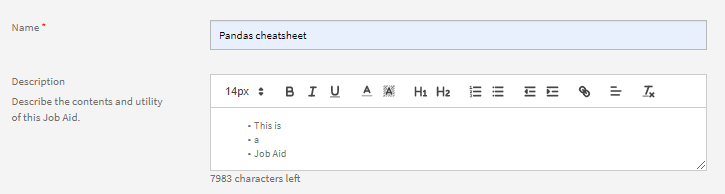

# Kurse erstellen, ändern und veröffentlichen

In diesem Artikel erfahren Sie, wie Sie Kurse, Zertifizierungen und Lernprogramme im Learning Manager erstellen.

Autoren können Lernobjekte wie Kurse, Zertifizierungen und Lernpläne erstellen. Teilnehmer können diese Lernobjekte nutzen, während Administratoren den Fortschritt der Teilnehmer verfolgen können.

## Kurse im Learning Manager {#coursesincaptivateprime}

Mit dem Adobe-Lernmanager können Autoren Kurse erstellen, die ein oder mehrere Module im Zusammenhang mit virtueller Schulung, Selbststudium, Klassenzimmerschulung und Aktivitäten verwenden. Administratoren können diese Kurse außerdem verwenden, um Kursinstanzen zu erstellen, Teilnehmer zu registrieren, Abzeichen zuzuweisen und Feedback für diese Kurse zu aktivieren. Außerdem können sie mit diesen Kursen Lernprogramme, Lernpläne und Zertifizierungen erstellen.

Autoren können E-Learning-Inhalte verwenden, die mit jedem E-Learning-Tool erstellt wurden. Weitere unterstützte Kursformate sind Videodateien, PDF, doc, docx, PPT und PPTX.

## Kurs erstellen - Grundlegender Arbeitsablauf {#createacoursebasicworkflow}

Um einen Kurs zu erstellen, führen Sie die folgenden Schritte aus:

1. Melden Sie sich bei Adobe Learning Manager als Autor an, da nur Autoren über die Rechte zum Erstellen von Kursen verfügen. Klicken Sie nun auf der Seite Erste Schritte auf **[!UICONTROL Kurse erstellen]**.
1. Im Fenster &quot; **Kursübersicht** den Namen des Kurses ein. Geben Sie nun eine kurze Beschreibung für diesen Kurs ein, die auf der Kurskarte angezeigt wird. Diese Beschreibung darf nicht länger als 140 Zeichen sein. Geben Sie dann die detaillierte Übersicht für den Kurs ein, die auf der Seite &quot;Kursdetails&quot; angezeigt wird. Die Beschreibung darf nicht länger als 1500 Zeichen sein.

   Als Autor können Sie die Beschreibung der Module anzeigen, während Sie das Modul zu einem Kurs hinzufügen.

1. Um den Kurs in anderen Sprachen verfügbar zu machen, klicken Sie oben links auf der Seite auf &quot;Neue Sprache hinzufügen&quot;. Wählen Sie die Sprache(n) aus, in der (denen) Sie Ihren Kurs verfügbar machen möchten. Klicken **[!UICONTROL Speichern]**. Weitere Informationen finden Sie unter [Inhalte für verschiedene Sprachen hinzufügen](/help/migrated/authors/feature-summary/content-library.md).
1. **Kurseinstellungen ändern**-

   1. Wählen Sie auf der Seite Kurseinstellungen Kenntnisse für den Kurs aus. Wählen Sie in der Dropdown-Liste Kenntnisse die gewünschten Kenntnisse aus. Wählen Sie dann in der Dropdown-Liste &quot;Stufe&quot; die gewünschte Stufe aus.
   1. Wählen Sie die Kurskenntnisse und die Stufe aus und legen Sie die Credits für die Kenntnisse fest. Fügen Sie bei Bedarf weitere Kenntnisse hinzu.
   1. Im Fenster &quot; **Registrierungstyp** den Registrierungstyp aus.

   Im Folgenden sind die Registrierungstypen aufgeführt:

   * **Vom Manager ernannt:** Nur Manager können diese Kurse nominieren. Teilnehmer können sich für diese Art von Kursen nicht selbst registrieren.
   * **Vom Manager genehmigt:** Manager genehmigen diese Kurse. Teilnehmer können sich für diese Kurse anmelden, aber sie werden für diese Art von Kursen nicht direkt registriert, ohne dass dies von einem Manager genehmigt wurde. Wenn sich Teilnehmer für Kurse dieser Art anmelden, erhält der Manager eine Benachrichtigung. Nach Genehmigung des Managers werden diese Kurse für die Teilnehmer als registriert aufgeführt.
   * **Selbstregistriert:** Teilnehmer können sich für diese Kurse selbst direkt registrieren.

1. Klicken Sie zum Speichern der Änderungen auf **[!UICONTROL Speichern]**. Um den Kurs zu veröffentlichen, klicken Sie auf **[!UICONTROL Veröffentlichen]**.

## Kurs erstellen - Erweiterter Arbeitsablauf {#createacourseadvancedworkflow}

1. Melden Sie sich bei Adobe Learning Manager als Autor an, da nur Autoren über die Rechte zum Erstellen von Kursen verfügen. Klicken Sie nun auf der Seite Erste Schritte auf **[!UICONTROL Kurse erstellen]**.
1. Im Fenster &quot; **Kursübersicht** den Namen des Kurses ein. Geben Sie nun eine kurze Beschreibung für diesen Kurs ein, die auf der Kurskarte angezeigt wird. Diese Beschreibung darf nicht länger als 140 Zeichen sein. Geben Sie dann die detaillierte Übersicht für den Kurs ein, die auf der Seite &quot;Kursdetails&quot; angezeigt wird. Die Beschreibung darf nicht länger als 1500 Zeichen sein.
1. Um den Kurs in anderen Sprachen verfügbar zu machen, klicken Sie oben links auf der Seite auf &quot;Neue Sprache hinzufügen&quot;. Wählen Sie die Sprache(n) aus, in der (denen) Sie Ihren Kurs verfügbar machen möchten. Klicken **[!UICONTROL Speichern]**. Weitere Informationen finden Sie unter [Inhalte für verschiedene Sprachen hinzufügen](/help/migrated/authors/feature-summary/content-library.md).
1. **Kurseinstellungen ändern**-

   1. Wählen Sie auf der Seite Kurseinstellungen Kenntnisse für den Kurs aus. Wählen Sie in der Dropdown-Liste Kenntnisse die gewünschten Kenntnisse aus. Wählen Sie dann in der Dropdown-Liste &quot;Stufe&quot; die gewünschte Stufe aus.
   1. Wählen Sie die Kurskenntnisse und die Stufe aus und legen Sie die Credits für die Kenntnisse fest. Fügen Sie bei Bedarf weitere Kenntnisse hinzu.
   1. Im Fenster &quot; **Registrierungstyp** den Registrierungstyp aus.

   Im Folgenden sind die Registrierungstypen aufgeführt:

   * **Vom Manager ernannt:** Nur Manager können diese Kurse nominieren. Teilnehmer können sich für diese Art von Kursen nicht selbst registrieren.
   * **Vom Manager genehmigt:** Manager genehmigen diese Kurse. Teilnehmer können sich für diese Kurse anmelden, aber sie werden für diese Art von Kursen nicht direkt registriert, ohne dass dies von einem Manager genehmigt wurde. Wenn sich Teilnehmer für Kurse dieser Art anmelden, erhält der Manager eine Benachrichtigung. Nach Genehmigung des Managers werden diese Kurse für die Teilnehmer als registriert aufgeführt.
   * **Selbstregistriert:** Teilnehmer können sich für diese Kurse selbst direkt registrieren.

1. Wählen Sie aus, ob Sie einen Preis für Ihren Kurs festlegen oder ihn kostenlos machen möchten. Wenn Sie den Kurs kostenpflichtig machen möchten, wählen Sie die Option **[!UICONTROL Bezahlt]** und geben Sie einen Preis an. Der Preis wird dann auf der Kurskarte und der Kursübersichtsseite für einen Teilnehmer angezeigt.

   HINWEIS: Diese Option ist nur aktiviert, wenn der Adobe Commerce-Connector konfiguriert ist.

1. Wenn Sie Teilnehmern die Möglichkeit geben, sich von Ihrem Kurs abzumelden, aktivieren Sie das Kontrollkästchen **Teilnehmer können die Registrierung selbst aufheben**.
1. **Instanzkonfiguration**

   Wenn Sie diese Option aktivieren, können Teilnehmer mit dem Status In Bearbeitung andere Instanzen besuchen und sich dort registrieren. Ein Teilnehmer kann dann den Fortschritt der vorherigen Instanz beibehalten.

   Wenn Sie nach der Veröffentlichung des Kurses zur Seite &quot;Einstellungen&quot; zurückkehren, kann die Option nicht mehr bearbeitet werden.

   Sie können die Option für die folgenden Kurstypen aktivieren:

   * Selbststudium
   * Klassenzimmer
   * Aktivität
   * Überblendet

   Hinweis: Wenn Sie beim Duplizieren eines Kurses die Option &quot;Instanzkonfiguration&quot; im Quellkurs aktiviert haben, bleibt die Option im Zielkurs deaktiviert.

   **Instanzschalter wird nicht unterstützt für**:

   * Kostenpflichtige Kurse
   * Vom Manager nominierte Kurse vom Typ &quot;Registrierung&quot;.

   Die Konfiguration des Instanzwechsels wird nicht an Peer-Konten weitergegeben, wenn sie über den Katalog freigegeben wird. Die Option bleibt im Zielkurs deaktiviert.

1. **Mehrere Registrierungen**

   Auf diese Weise können Sie Teilnehmer in mehr als einer Kursinstanz zu einem oder verschiedenen Zeitpunkten registrieren.

   Aktivieren Sie den Umschalter **Mehrfachregistrierung** , um zwischen verschiedenen Kursregistrierungen eines Teilnehmers zu wechseln. Wenn Sie den Instanzwechsel aktiviert haben, können Sie nicht die mehrfache Registrierung verwenden.

1. Wählen Sie die erforderlichen Kurse aus, die vor Kursbeginn abgeschlossen werden müssen. Klicken Sie auf das Feld &quot;Kurse&quot; und wählen Sie aus der Liste der Kurse.
1. Aktivieren Sie die **Aktivieren** **Voraussetzungen** Kontrollkästchen, wenn die erforderlichen Kurse für mich obligatorisch sein sollen.
1. Fügen Sie Ihrem Kurs Schlüsselwörter als Tags hinzu. Diese Tags helfen den Teilnehmern, Ihren Kurs während der Suche leicht zu finden. Alle diese Tags werden automatisch basierend auf den Modulen hinzugefügt, die wir hinzugefügt haben. Wenn Sie weitere Tags zu diesem Kurs hinzufügen möchten, können Sie fortfahren und ihn eingeben.
1. Fügen Sie Ihrem Kurs Schlüsselwörter als Tags hinzu. Diese Tags helfen den Teilnehmern, Ihren Kurs während der Suche leicht zu finden. Alle diese Tags werden automatisch basierend auf den Modulen hinzugefügt, die wir hinzugefügt haben. Wenn Sie weitere Tags zu diesem Kurs hinzufügen möchten, können Sie fortfahren und ihn eingeben.
1. Wählen Sie im Feld &quot;Automatische Einstellung&quot; ein Datum aus, an dem der Kurs eingestellt wird. Der Administrator muss zuerst die Option &quot;Automatisch einstellen&quot; aktivieren.
1. Klicken Sie zum Speichern der Änderungen auf **[!UICONTROL Speichern]**. Um den Kurs zu veröffentlichen, klicken Sie auf **[!UICONTROL Veröffentlichen]**.

## Gamification-Punkte

Sie können Gamification-Punkte auf Kurs- und Kursinstanzebene zuweisen. Damit können Sie Punkte an verschiedene Kurse oder Instanzen vergeben. Teilnehmer erhalten einen Anreiz, bestimmte Kurse zu belegen oder eine bestimmte Kursinstanz gegenüber anderen vorzuziehen.

1. Wählen Sie auf Kursinstanzebene **[!UICONTROL Gamification-Punkte]**.


*Festlegen von Punkten für Gamification*

1. Auswählen **[!UICONTROL Bearbeiten]**.
1. Wenn Sie Einstellungen auf Kursebene verwenden wählen, werden die folgenden Optionen angezeigt:

   * **[!UICONTROL Nach Abschluss]**: Wählen Sie diesen Schalter aus, wenn der Teilnehmer 100 Punkte erhalten soll, wenn er einen Kurs abschließt.
   * **Weitere Regeln**

      * **[!UICONTROL Frühzeitiger Abschluss]**: Wenn Sie diese Option auswählen, erhalten die ersten 30 Teilnehmer 100 Punkte, wenn sie einen Kurs abschließen.
      * **[!UICONTROL Rechtzeitiger Abschluss]**: Wenn Sie diese Option auswählen, erhalten die Teilnehmer 100 Punkte, wenn sie einen Kurs innerhalb von 999 Tagen abschließen.

1. Wenn Sie **[!UICONTROL Benutzerdefinierte Einstellungen verwenden]** werden die folgenden Optionen angezeigt:

   * **[!UICONTROL Nach Abschluss]**: Wählen Sie diesen Schalter aus, wenn der Teilnehmer 100 Punkte erhalten soll, wenn er einen Kurs abschließt.
   * **Weitere Regeln**

      * **[!UICONTROL Frühzeitiger Abschluss]**: Wenn Sie diese Option auswählen, können Sie festlegen, wie viele Teilnehmer bestimmte Punkte erhalten.
      * **[!UICONTROL Rechtzeitiger Abschluss]**: Wenn Sie diese Option auswählen, können Sie die Anzahl der Punkte bestimmen, die Teilnehmer erhalten, wenn sie einen Kurs innerhalb einer bestimmten Zeit abschließen.

   

   *Vorzeitige Fertigstellung festlegen*

1. Auswählen **[!UICONTROL Speichern]**.

## Lernressourcen zusammenfassen

Ein Autor kann entscheiden, ob er die Lernressourcen auf der Lernplanebene aggregieren möchte oder sie auf einer individuellen Kursebene bleiben lassen möchte.

Wählen Sie als Autor **[!UICONTROL Lernpfad]** > **[!UICONTROL Einstellungen]**. Klicken **[!UICONTROL Bearbeiten]**.

Im Dialogfeld &quot; **[!UICONTROL Ressourcen]** das Kontrollkästchen &quot;Auf Lernpfadebene aggregierte verfassungsgebende Kursressourcen anzeigen&quot; aktiviert ist, wird angezeigt, ob auf Kursebene vorhandene Ressourcen auf Lernpfadebene angezeigt werden.

>[!NOTE]
>
>Auf der Seite &quot;Einstellungen&quot; eines Lernpfads kann ein Administrator diese Option auch aktivieren. Mit dieser Option werden die auf Kursebene vorhandenen Ressourcen angezeigt, die auf der Lernpfadebene angezeigt würden.

## Terminplanungs-Assistent

Konflikte bei der Buchung von Kursleitern und Klassenzimmern bewältigen. Wenn Sie wissen möchten, zu welcher Zeit und zu welchem Datum ein Kursleiter verfügbar ist, bevor Sie ihn dem Kurs zuweisen, verwenden Sie den Scheduling Assistant.

Klicken Sie beim Erstellen eines Kurses für einen VC- oder CR-Kurs auf &quot;Planungsassistent&quot;.


*Startplanungs-Assistent*

Das Fenster Scheduling Assistant wird gestartet.


*Das Dialogfeld &quot;Planungsassistent&quot;*

Mit dem Zeitplanungs-Assistenten können Sie:

* Suchen Sie nach Kursleitern anhand ihrer Namen.
* Durchsuche die Kursleiter nach ihren Fähigkeiten.

### Kursleiter anhand ihres Namens suchen

Geben Sie im Feld &quot;Kursleiter&quot; den Namen des Kursleiters ein oder suchen Sie nach einem Teil des Namens des Kursleiters. Es wird eine Liste von Kursleitern angezeigt, aus der Sie einen Kursleiter auswählen können.


*Nach Kursleitern suchen*

Es können mehrere Kursleiter ausgewählt werden, aber nur ein Kursleiter kann gleichzeitig zugewiesen werden. Die ausgewählte Zeit wird im Zeitkonfliktfenster hervorgehoben. In der Nähe des Kursleiters wird ein Kreuz angezeigt, auf das Sie klicken, um den Kursleiter zu entfernen.


*Nach mehreren Kursleitern suchen*

### Kursleiter nach Kenntnissen suchen

Suchen Sie nach einem Kursleiter mit einzelnen oder mehreren Kenntnissen. Für die Suche wird der Operator AND verwendet.

Kenntnisse können nur nach einem Teil oder dem vollständigen Kenntnisnamen durchsucht werden, nicht nach Kenntnisstufen.

Geben Sie im Assistenten den Namen des Kursleiters, den Standort und die maximale Anzahl der Lizenzen ein.

Sie können auch nach Kenntnissen suchen, die angezeigt werden, nachdem Sie auf das Filtersymbol rechts neben dem Suchfeld für Kursleiter geklickt haben. Der folgende Screenshot zeigt die Schaltfläche an.


*Nach Kursleitern anhand von Kenntnissen suchen*

### Benutzergruppenfilter

Wählen Sie den Filter im Feld Kursleiter aus. Es ist ein **[!UICONTROL Benutzergruppe]** Filter Ein Autor oder ein benutzerdefinierter Autor kann den richtigen Kursleiter finden, indem sie die Werte in der Benutzergruppe verwenden.

Wenn beide Filter angewendet werden, wird eine Liste von Kursleitern angezeigt, die der Benutzergruppe angehören und über die ausgewählten Kenntnisse verfügen.

Dies gilt für den Planungsassistenten auf der Seite &quot;Kurse oder Instanzen&quot;.


*Nach Benutzergruppen filtern*

### Instanzseite

Sie können den Planungsassistenten auch über die Instanzenseite aufrufen, wie unten gezeigt.

Der Zeitplanungs-Assistent ist auch auf der Instanzseite für Administratoren und benutzerdefinierte Administratoren/Autoren verfügbar.


*Kursleiter über die Seite &quot;Instanzen&quot; planen*

### Nach einem Speicherort suchen

Sie können nach einem Speicherort suchen, indem Sie sowohl auf der Seite mit dem Modul- als auch auf der Seite mit dem Zeitplanungs-Assistenten den Namen des Klassenzimmers und den Namen des Standortbereichs angeben.

## RTF-Formatierung

Beim Erstellen eines Kurses, eines Lernprogramms, einer Zertifizierung oder einer Arbeitshilfe können Autoren verschiedene Inhaltstypen wie Text, Bild oder verschiedene Textformatierungsoptionen eingeben.

Beim Erstellen eines Kurses wird der Rich-Text-Editor im Feld &quot;Kursübersicht&quot; angezeigt. Sie können Ihre Inhalte formatieren, Bilder und Hyperlinks hinzufügen usw.


*Rich-Text-Editor starten*

Ebenso können Sie den Rich-Text-Editor verwenden, um die Beschreibung beim Erstellen eines der folgenden Elemente zu ändern:

**Lernprogramm**


*Rich-Text-Editor für Lernprogramme verwenden*

**Zertifizierung**


*Rich-Text-Editor für Zertifizierung verwenden*

**Arbeitshilfe**



*Rich-Text-Editor für Arbeitshilfen verwenden*

Darüber hinaus können Sie den Rich-Text-Editor für andere Sprachen verwenden.

## Unterstützung von Rich-Text-Beschreibungen für die Headless-Benutzeroberfläche

### Warum ist CSS erforderlich?

Rich Text besteht aus HTML-Markup. Wenn Sie das Markup unverändert rendern, wird der Standardstil des Browsers angewendet. Das passt oft nicht gut zu den Stilrichtlinien des Unternehmens. Ein CSS ist erforderlich, um die Richtlinien zu erfüllen.

### Standardstil

Das angehängte CSS-Stylesheet enthält den Stil, der vom Lern-Manager angewendet wird. Das Styling wurde unter Berücksichtigung der meisten Anwendungsfälle optimiert. Laden Sie die angehängte CSS-Datei herunter und importieren Sie sie entsprechend Ihren Konventionen und Ihrem Build-System in Ihre Webanwendung. Die definierten CSS-Klassen werden unter der ql-editor-Klasse mit einem Namensraum versehen und beeinträchtigen nicht die vorhandenen Stile.

### Stile anpassen

Der Standardstil erfüllt möglicherweise nicht alle Anforderungen. Die Anpassungen können durch Überschreiben des bereitgestellten CSS vorgenommen werden. Der gesamte Stil wird als Nachfahren-Selektoren unter ql-editor eingeschlossen. Die folgenden Klassen werden verwendet:

* Einzug: **li.ql-indent-$number**. $number variiert von 1 bis 9
* Größe: **ql-size-small**, **ql-size-large**, **ql-size-huge**

* Ausrichtung: **ql-align-center**, **ql-align-justify**, **ql-align-right**

* Farbe: **ql-color-$color**. $color = weiß, rot, orange, gelb, grün, blau, lila
* Hintergrund: **ql-bg-$color**. $color = schwarz, rot, orange, gelb, grün, blau, lila
* HTML-Tags: p, ol, ul, pre, blockquote, h1, h2, h3, h4, h5, h6

[CSS-Datei, die für die Anpassung verwendet wird.](assets/ql-headless.css)

### API-ÄNDERUNGEN ZUR ERMÖGLICHUNG DES RENDERNS VON RICH-TEXT-ÜBERSICHTEN

Wenn Kunden eine Headless-Benutzeroberfläche erstellen, müssen sie die Lernobjekte auf der von ihnen entwickelten benutzerdefinierten Benutzeroberfläche anzeigen. Hierfür wird in der Regel das Dialogfeld &quot; [GET /learningObjects](https://learningmanagereu.adobe.com/docs/primeapi/v2/#!/learning_object/get_learningObjects) API, die verfügbar gemacht wird. Da Learning Manager jetzt die Erfassung von &quot;Rich-Text&quot; für das Übersichtsfeld unterstützt, macht das Datenmodell von Lernobjekten in den API-Antworten dasselbe ebenfalls verfügbar. Weitere Informationen finden Sie im Feld &quot;richTextOverview&quot; im Fragment des Modells in der API-Antwort unten. Beachten Sie außerdem, dass das zuvor angezeigte Feld (&quot;overview&quot;) aus Gründen der Abwärtskompatibilität unverändert bleibt.

```
{ 
 "data": [ 
 { 
 "id": "string", 
 "type": "string", 
 "attributes": { 
 … 
 "localizedMetadata": [ 
 { 
 "description": "string", 
 "locale": "string", 
 "name": "string", 
 "overview": "string", 
 "richTextOverview": "string" 
 } 
 ], 
 … 
 }, 
 "relationships": { 
 … 
 } 
 } 
 } 
 ] 
} 
```

Kunden, die bereits das Übersichtsfeld verwenden, sind von der Headless-Oberfläche nicht betroffen. Wie zuvor wird nur einfacher Text angezeigt. Wenn Kunden die Rich-Text-Übersicht nutzen möchten, müssen sie reich formatierte Übersichten für ihre Lernobjekte in der Benutzeroberfläche des Autors erstellen. Danach beginnt Learning Manager auch die Rich-Text-Übersicht zurückzugeben, zusätzlich zum reinen Text (wie zuvor) im API-Antwortmodell.

Um diesen Rich Text jedoch in der Benutzeroberfläche zu rendern, muss der Kunde ein CSS-Code einfügen. Dies wird in den folgenden Abschnitten ausführlich erläutert.

## Mehrere Versuche zulassen {#allowmultipleattempts}

Sobald der Administrator mehrere Versuche aktiviert hat, können Sie als Autor mehrere Versuche für ein interaktives E-Learning-Modul auf Kurs- oder Modulebene konfigurieren.


*Konfigurieren Sie mehrere Versuche für ein interaktives E-Learning-Modul*

<table>
 <tbody>
  <tr>
   <td>
    <p><b>Option</b></p></td>
   <td>
    <p><b>Beschreibung</b></p></td>
  </tr>
  <tr>
   <td>
    <p>Versuche festlegen auf</p></td>
   <td>
    <p>Sie können die Anzahl der Versuche für ein Modul auf unendlich festlegen oder eine bestimmte Grenze festlegen.<span style="font-size: 0.8125rem;">Die Informationen zu den Versuchen werden dem Teilnehmer angezeigt, sobald er aktiviert ist. Der Teilnehmer kann wählen, ob er das Modul erneut durchführen möchte, indem er auf die Schaltfläche "Erneut versuchen" klickt.</span></p></td>
  </tr>
  <tr>
   <td>
    <p>Stoppen Sie den neuen Versuch, sobald das Modul abgeschlossen oder bestanden ist</p></td>
   <td>
    <p>Um zu konfigurieren, wann die Teilnehmer daran gehindert werden sollen, die neue Versuchsoption auszuwählen, aktivieren Sie das Kontrollkästchen "Neuen Versuch stoppen, wenn das Modul abgeschlossen oder bestanden ist". Die Option "Erneut versuchen" wird nach erfolgreichem Abschluss des Moduls aus der Teilnehmeransicht entfernt.</p></td>
  </tr>
  <tr>
   <td>
    <p>Modul zwischen Versuchen 0 sperren:0:1 Format: Tage/Stunden/Minuten</p></td>
   <td>
    <p>Sie können Module für eine bestimmte Zeit zwischen den Versuchen sperren, indem Sie das Kontrollkästchen "<b>Modul zwischen Versuchen 0 sperren:0:1 Format: Tage/Stunden/Minuten</b>". Wenn ein Modul gesperrt ist, kann der Teilnehmer das Modul nicht besuchen, bis die angegebene Sperrzeit abgelaufen ist. </p>
    <p>Sie können die Endkriterien eines Versuchs definieren, indem Sie die Option '<b>Spieler schließen</b>' oder '<b>Abschluss</b>'-Kontrollkästchen.</p></td>
  </tr>
  <tr>
   <td>
    <p>Spieler schließen</p></td>
   <td>
    <p>Jeder Modulstart wird als neuer Versuch behandelt, wenn die Kriterien als ' ausgewählt sind.<b>Spieler schließen</b>'. Ein Teilnehmer wird aufgefordert, Details zur Modulsperre anzuzeigen und zu versuchen, den Player zu schließen.</p></td>
  </tr>
  <tr>
   <td>
    <p>Abschluss</p></td>
   <td>
    <p>Wenn das Ende eines Versuchs auf <b>Abschluss</b>, dann wird er basierend auf den Erfolgskriterien für den Inhalt berechnet. Die Teilnehmer dürfen das Modul erst dann erneut versuchen, wenn der Inhalt die Abschlussinformationen sendet. Details zur Modulsperre und zu den Versuchen werden dem Teilnehmer mitgeteilt, sobald der Versuch beendet ist.</p></td>
  </tr>
  <tr>
   <td>
    <p>Zeitlimit für Abschluss des Moduls festlegen</p></td>
   <td>
    <p>Autoren können ein Zeitlimit für den Abschluss eines Moduls festlegen, indem sie das Kontrollkästchen aktivieren.<b>Zeitlimit für Abschluss des Moduls festlegen</b>".</p>
    <p>Jeder Start eines Players wird als neuer Versuch betrachtet und der Teilnehmer wird während des Starts über die Zeitdetails informiert.</p>
    <p><b>Hinweis:</b><span style="font-size: 0.8125rem;">Der Versuch endet automatisch, sobald die Zeit abgelaufen ist. Wenn Sie den Player ebenfalls schließen, wird der aktuelle Versuch beendet.</span></p></td>
  </tr>
  <tr>
   <td>
    <p>Mehrere Versuche auf Modulebene</p></td>
   <td>
    <p>Wenn Sie einen Versuch auf Modulebene aus der Dropdown-Liste Versuch festlegen unter auswählen, können Sie die Optionen auf Modulebene individuell konfigurieren.</p></td>
  </tr>
 </tbody>
</table>

## Kursmodule {#coursemodules}

### Module hinzufügen {#addmodules}

Sie können jetzt Inhalts-, Vorbereitungs- und Testmodule hinzufügen. **Inhalt** sind die Hauptmodule, aus denen sich der Kurs zusammensetzt. **Vorarbeit** Module enthalten einige grundlegende Informationen, die den Teilnehmern helfen können, sich auf den Kurs vorzubereiten. Diese Module sind für die Teilnehmer nicht zwingend erforderlich. **Testout** Mithilfe von Modulen können Teilnehmer den Inhalt überspringen und den Test absolvieren, wenn sie den Inhalt bereits kennen und den Test absolvieren möchten, um die Compliance-Anforderung zu erfüllen.

Um ein Inhaltsmodul hinzuzufügen, führen Sie die folgenden Schritte aus:

1. Klicken **[!UICONTROL Module hinzufügen]**. Es werden vier Optionen zum Hinzufügen von Modulen angezeigt. Die erste Option besteht darin, Module zum Selbststudium hinzuzufügen. Dies sind die Module, die Sie erstellen und der Modulbibliothek im Adobe-Lernmanager hinzufügen. Mit dieser zweiten Option wird das virtuelle Klassenzimmer eingerichtet. Der dritte besteht darin, ein Klassenzimmermodul einzurichten, und der vierte ist Aktivitätsmodul.

   

   *Ein Modul für einen Kurs hinzufügen*

   **Selbststudium:** In diesem Modus können Sie ein Kursmodul in Ihrem eigenen Tempo starten und abschließen. Sie können Ihren eigenen Zeitplan festlegen.

   Nachdem Sie auf die Option geklickt haben, wird die Liste der Module zum Selbststudium angezeigt, die Ihrer Modulbibliothek bereits hinzugefügt wurden. Hier können Sie entweder durch die Liste scrollen und die gewünschten Module auswählen oder Sie können nach den Modulen suchen, indem Sie den Modulnamen in das Suchfeld oder die Modul-Tags eingeben.

   Klicken Sie nach der Auswahl der Module auf **[!UICONTROL Hinzufügen]**. Diese Module werden jetzt im Abschnitt &quot;Inhalt&quot; angezeigt.

   Sie können die Module auch neu anordnen. Ziehen Sie ein beliebiges Modul nach oben oder unten und ordnen Sie die Module in der richtigen Reihenfolge an.

   **Virtuelles Klassenzimmermodul:** In diesem Modus können die Teilnehmer an Live-Online-Vorlesungen teilnehmen, die von einem geschulten Kursleiter unterstützt werden. Geben Sie den Titel und die Beschreibung ein und legen Sie die Dauer der Sitzung fest. Sie können auch die Konferenz-URL und die Kursleiter angeben, die die Sitzung durchführen sollen. Klicken Sie zum Speichern der Änderungen auf **[!UICONTROL Fertig]**.

   

   *VC-Modul hinzufügen*

   Wenn Sie einen Kurs mithilfe des Konfigurationsdialogfelds &quot;Virtuelles Klassenzimmer&quot; erstellen, legen Sie die **Konferenzsystem** mit der von Ihnen erstellten Teams-Verbindung verknüpft. Wählen Sie aus, ob Sie einen Besprechungsorganisator für die Veranstaltung einrichten möchten.

   Wenn Sie **Ja** für einen Meetingveranstalter müssen Sie den Namen des Veranstalters eingeben. Geben Sie den Namen ein und wählen Sie den Organisator aus.

   **Umgehung der Lobby**

   * Wenn Sie **Ja** können alle Teilnehmer am Meeting teilnehmen.
   * Wenn Sie **Nein**, wird eine Anfrage an den Organisator gesendet, um den Teilnehmer daran zu hindern, an dem Meeting teilzunehmen.

   **Hinweis:** Ein Teilnehmer muss in den Microsoft Teams verfügbar sein. Der Teilnehmer kann jedoch als Gast am Learning Manager teilnehmen.

   **Klassenzimmermodul:** In diesem Modus nehmen die Teilnehmer an persönlichen Vorträgen teil, die von einem ausgebildeten Kursleiter unterstützt werden. Geben Sie den Titel und die Beschreibung ein und legen Sie die Dauer der Sitzung fest. Sie können auch den Speicherort der Klasse und die Kursleiter zum Ausführen der Sitzung angeben. Klicken Sie zum Speichern der Änderungen auf **[!UICONTROL Fertig]**.

   

   *Klassenzimmermodul hinzufügen*

   Legen Sie beim Erstellen eines Kurses im Dialogfeld &quot;Konfiguration des virtuellen Klassenzimmers&quot; das Konferenzsystem auf die Verbindung fest, die Sie mit den Microsoft Teams erstellt haben. Wählen Sie aus, ob Sie einen Besprechungsorganisator für die Veranstaltung einrichten möchten.

   Wenn Sie für einen Meetingveranstalter &quot;Ja&quot; auswählen, müssen Sie den Namen des Veranstalters eingeben. Geben Sie den Namen des Organisators ein und wählen Sie den Organisator aus.

   **Umgehung der Lobby**

   * Wenn Sie &quot;Ja&quot; auswählen, kann jeder Teilnehmer am Meeting teilnehmen.
   * Wenn Sie &quot;Nein&quot; auswählen, wird eine Anfrage an den Organisator gesendet, damit der Teilnehmer an dem Meeting teilnehmen kann.

   **Hinweis:** Wenn ein Teilnehmer als Gast an Microsoft Teams teilnehmen möchte, muss er die E-Mail-Adresse eingeben. Die E-Mail muss im Lern-Manager vorhanden sein.

   **Aktivitätsmodul:** In diesem Modus müssen die Teilnehmer eine Reihe von Aktivitäten wie Workshops, Übungen, Fragebogen und andere Lernaktivitäten durchführen. Geben Sie den Titel, die Beschreibung und die externe URL als Referenz ein. Klicken Sie zum Speichern der Änderungen auf **[!UICONTROL Fertig]**.

   

   *Aktivitätsmodul hinzufügen*

   Sie können die Dauer beim Hinzufügen eines Aktivitätsmoduls in einem Kurs für den Aktivitätstyp &quot;Dateiübermittlung&quot; und xAPI-basierte Module angeben.

1. Ebenso können Sie Module für den Vorarbeits- und den Testmodus hinzufügen.
1. Wählen Sie den Sequenzierungstyp für Module gemäß Ihren Voreinstellungen &quot;Geordnet&quot; oder &quot;Unsortiert&quot; aus.

   Wenn Sie **Bestellt** klicken, werden die Module in derselben Reihenfolge angezeigt, in der Sie sie erstellt haben. Wenn Sie **Unsortiert** klicken, werden die Module nicht sequenziert. Teilnehmer können die Module in beliebiger Reihenfolge abschließen.

1. Wählen Sie in der Dropdown-Liste Obligatorische Module die Anzahl der Module aus, die der Teilnehmer absolvieren muss, um den Kurs abzuschließen.
1. Fügen Sie ein Titelbild und das Bannerbild für den Kurs hinzu. Die Kataloge werden vom Administrator erstellt. Weitere Informationen finden Sie unter [Kataloge](/help/migrated/administrators/feature-summary/catalogs.md).

   **Hinweis:** Die empfohlenen Abmessungen sind:

   * **Titelbild:** 300 px x 300 px
   * **Bannerbild:** 1600 px x 140 px

1. Klicken Sie oben rechts auf der Seite auf **[!UICONTROL Speichern]**.

## Checkliste {#create-checklist}

Die Bewertung ist ein wichtiger Aspekt jedes LMS. Online-Bewertungen sind eine der besten Möglichkeiten, das Verständnis eines Teilnehmers für ein Thema zu bewerten. Aber oft ist es notwendig, das Verständnis einer Person zu beurteilen, während sie am Arbeitsplatz ist, indem sie beobachtet wird, wie sie die notwendigen Aufgaben ausführt.

Nehmen wir an, Ladenangestellte oder Lagerarbeiter unterliegen bei ihrer tagtäglichen Arbeit einer Bewertung. Dabei kann es sich um die zur Reparatur einer Kaffeemaschine durchgeführten Schritte oder um die Schritte zum Verpacken eines Materials handeln. Kursleiter können Mitarbeiter für solche Aufgaben anhand einer Checkliste in der Bewertungsaktivität mit &quot;Bestanden&quot; oder &quot;Nicht bestanden&quot; bewerten.

### Erstellen einer Checkliste {#createachecklist}

Nur ein Autor kann eine Checkliste erstellen. Eine Checkliste ist ein Aktivitätsmodultyp. Beim Einrichten eines Aktivitätsmoduls können Sie als Autor eine Aktivität als **Checkliste**, wie unten dargestellt:


*Erstellen einer Checkliste*

Sobald Sie die Option **Checkliste** werden einige zusätzliche Optionen angezeigt.

**Checklistentyp:** Wählen Sie eine Option, **Ja/Nein** oder **1-5**. Wenn Sie &quot;Ja/Nein&quot; wählen, enthält die Checkliste Fragen, die nur mit Ja oder Nein beantwortet werden können. Wenn Sie &quot;1-5&quot; auswählen, wird eine Likert-Checkliste angezeigt, in der Sie eine Frage auf einer Fünf-Punkte-Skala bewerten können.

**Kriterien für das Bestehen:**

<table>
 <tbody>
  <tr>
   <td>
    <p>Wenn Sie <b>Ja/Nein</b>, dann ...</p></td>
   <td>
    <p>Wenn Sie <b>1-5</b>, dann ...</p></td>
  </tr>
  <tr>
   <td>
    <p>Legen Sie als Kriterien für das Bestehen die Anzahl der Ja-Antworten fest. Wenn Sie beispielsweise 3 eingeben, besteht der Teilnehmer den Kurs, wenn er mindestens drei <b>Ja </b>von einem Kursleiter ausgewertet werden.</p></td>
   <td>
    <p>Legen Sie die Kriterien für das Bestehen als Schwellenwert auf eine beliebige Zahl zwischen 1 und 5 fest. Wenn Sie beispielsweise 2 und 4 eingeben, besteht der Teilnehmer den Kurs, wenn er mindestens <b>zwei </b>Bewertungen, deren Punktzahl größer oder gleich <b>Vier</b>.</p></td>
  </tr>
 </tbody>
</table>

Wählen Sie einen oder mehrere Kursleiter, die den Teilnehmer bewerten sollen.

Wenn Sie einen Kommentar oder eine Notiz haben, können Sie diesen im Dialogfeld &quot; **Hinweis für den Kursleiter** Textfeld ein.

Fügen Sie nun die Fragen auf der Checkliste hinzu. Klicken **[!UICONTROL Hinzufügen]**. Sie können nur bis zu 150 Fragen hinzufügen.


*Checklistenfragen hinzufügen*

Um weitere Fragen hinzuzufügen, klicken Sie auf **[!UICONTROL Weitere hinzufügen]**.

Speichern Sie die Änderungen, fügen Sie das Modul hinzu und veröffentlichen Sie den Kurs.

### Kenntnisse hinzufügen {#addskills}

Geben Sie auf dieser Seite die folgenden Details ein:

1. Wählen Sie die Kurskenntnisse und die Stufe aus und legen Sie die Credits für die Kenntnisse fest. Fügen Sie bei Bedarf weitere Kenntnisse hinzu.

   

   *Kenntnisse für einen Kurs hinzufügen*

1. Wählen Sie den Registrierungstyp aus. Die folgenden Optionen sind verfügbar:

   * **Vom Manager ernannt:** Nur Manager können diese Kurse nominieren. Teilnehmer können sich für diese Art von Kursen nicht selbst registrieren.
   * **Vom Manager genehmigt:** Manager genehmigen diese Kurse. Teilnehmer können sich für diese Kurse anmelden, aber sie werden für diese Art von Kursen nicht direkt registriert, ohne dass dies von einem Manager genehmigt wurde. Wenn sich Teilnehmer für Kurse dieser Art anmelden, erhält der Manager eine Benachrichtigung. Nach Genehmigung des Managers werden diese Kurse für die Teilnehmer als registriert aufgeführt.
   * **Selbstregistriert:** Teilnehmer können sich für diese Kurse selbst direkt registrieren.

1. Wenn Sie Teilnehmern die Möglichkeit geben, sich von Ihrem Kurs abzumelden, aktivieren Sie das Kontrollkästchen **Teilnehmer können die Registrierung selbst aufheben**.
1. Wählen Sie die erforderlichen Kurse aus, die vor Kursbeginn abgeschlossen werden müssen. Klicken Sie auf das Feld &quot;Kurse&quot; und wählen Sie aus der Liste der Kurse.

   

   *Voraussetzungskurse hinzufügen*

1. Aktivieren Sie die **Voraussetzungen** Kontrollkästchen, wenn die erforderlichen Kurse für mich obligatorisch sein sollen.
1. Fügen Sie Ihrem Kurs Schlüsselwörter als Tags hinzu. Diese Tags helfen den Teilnehmern, Ihren Kurs während der Suche leicht zu finden. Alle diese Tags werden automatisch basierend auf den Modulen hinzugefügt, die wir hinzugefügt haben. Wenn Sie weitere Tags zu diesem Kurs hinzufügen möchten, können Sie fortfahren und ihn eingeben.
1. Fügen Sie die Profile Ihrer Zielgruppe für diesen Kurs hinzu, indem Sie auf den Textbereich klicken und die Profile aus den Vorschlägen auswählen.
1. Fügen Sie Ressourcendateien für Ihren Kurs als zusätzliches Material hinzu. Ziehen Sie Ihre Materialien wie Text-, Video- oder Audiodateien.
1. Dieser Kurs ist jetzt für diese Teilnehmer verfügbar, die diese Profile als empfohlenen Kurs haben. Sie können in diesem Abschnitt auch zusätzliche Ressourcen für Ihre Teilnehmer anhängen. Teilnehmer können diese Dateien zur späteren Referenz herunterladen. Wenn Sie mit all diesen Änderungen fertig sind, klicken Sie auf **[!UICONTROL Speichern]** in der rechten oberen Ecke. Dadurch wird Ihr Kurs als Entwurf gespeichert. Ihr Kurs wird standardmäßig als Entwurf gespeichert.

## Kursleiter für Module zuweisen {#assigninstructorsformodules}

1. Nachdem Sie Module für Ihren Kurs erstellt haben, können Sie den Modulen Kursleiter zuweisen. Klicken Sie im Autoren-Dashboard auf **[!UICONTROL Kurskatalog]**.
1. Klicken Sie auf den Kurs, dessen Modul Sie den Kursleitern zuweisen möchten.
1. Im Fenster &quot; **Module hinzufügen** auf das Modul, dem Sie einen Kursleiter zuweisen möchten.
1. Im Dialogfeld &quot; **Kursleiter** den Benutzernamen des Benutzers an, dem Sie die Kursleiterrolle zuweisen möchten.

   

   *Benutzer eine Kursleiterrolle zuweisen*

1. Um den Kurs mit den Aktualisierungen erneut zu veröffentlichen, klicken Sie auf **[!UICONTROL Neu veröffentlichen]**.

## Beobachtungs-Checkliste

Ein Checklistenmodul kann jetzt von Managern zusätzlich zu den Kursleitern überprüft werden. Personen-Manager sowie nicht hierarchische Manager wie Store-Manager oder Standort-Manager können die Checkliste überprüfen und abschließen.

Kursautoren können sowohl Manager mit Personen als auch (falls zutreffend) nicht hierarchische Manager als Reviewer hinzufügen, indem sie diese Rollenoptionen im Abschnitt &quot;Reviewer&quot; auswählen, während sie ein Checklistenmodul einrichten. Dies kann auf Kursinstanzebene erfolgen.


*Hinzufügen von Überprüfern in einem Aktivitätsmodul*

Wählen Sie die Option &quot;**[!UICONTROL +Manager]**&quot; aktiviert automatisch den Manager eines Teilnehmers in der Organisationshierarchie, um die Checkliste zu überprüfen. Sie müssen Manager-Namen nicht einzeln suchen und hinzufügen.

Wenn Ihr Kontoadministrator nicht hierarchische Managerrollen eingerichtet hat (z. B. Standortmanager oder Standortmanager), indem er die Option Aktive Felder verwendet, stehen Ihnen diese Managerrollen zur Auswahl und können sie aktivieren, um die Checkliste zu überprüfen.

Sie müssen Manager-Namen nicht einzeln suchen und hinzufügen. Wenn sich Teilnehmer für den Checklistenkurs registrieren, sendet er automatisch eine Benachrichtigung an ihre Manager/Store-Manager zur Überprüfung zusammen mit einem ausgewählten Kursleiter. Dieser Arbeitsablauf erleichtert es Autoren, die Namen einzelner Manager nicht zu erwähnen.

Wählen Sie im obigen Beispiel-Screenshot die Option &quot;**[!UICONTROL +Store Manager]**&quot; aktiviert automatisch den nicht hierarchischen Manager, der dem Teilnehmer zugeordnet ist, die Checkliste zu überprüfen. Beachten Sie, dass &quot;store&quot; hier durch das aktive Feld ersetzt wird, das vom Administrator definiert wird.

Aktualisierungen des Checklistenmoduls beinhalten auch Benachrichtigungen an Kursleiter und Manager, wenn ein Teilnehmer für einen Kurs registriert ist, der ein Checklistenmodul enthält. Der Reviewer erhält eine Benachrichtigung im Benachrichtigungscenter des Learning Manager sowie im Dashboard des Kursleiters/Managers, dass eine Checklistenaktion fällig ist.

<!---->

Der Reviewer kann Informationen zu allen ausstehenden Checklisten-Review-Elementen über das Menü Checklisten sowie über das Menü Benachrichtigungen anzeigen, wenn er sich als Kursleiter/Manager anmeldet.


*Zulassungen für die Zertifizierung*

Nachdem der Reviewer auf die Überprüfungs-Checkliste geklickt hat, kann er die Bewertung abschließen.


*Überprüfen ausstehender Checklistenüberprüfungselemente*

Die Berichte können auf Checklisten heruntergeladen werden, die detaillierte Informationen zur Teilnehmerbewertung, zum Namen des Prüfers, zur Rolle und zur E-Mail-Adresse enthalten.

Die CSV-Datei &quot;Checklistenbericht&quot; enthält die neuen und aktualisierten Felder:

* Reviewername anstelle von Kursleitername
* E-Mail-Adresse des Reviewers anstelle der E-Mail-Adresse des Kursleiters
* Reviewerrolle: Mögliche Werte sind Manager, Store/Location Manager, Kursleiter

## Kursvorschau {#previewacourse}

Nachdem der Kurs erstellt und als Entwurf gespeichert wurde, können Sie den Kurs als Teilnehmer in der Vorschau anzeigen und veröffentlichen, um ihn im Kurskatalog verfügbar zu machen.

Um eine Vorschau des Kurses anzuzeigen, klicken Sie **[!UICONTROL Vorschau als Teilnehmer]**.


*Kursvorschau als Teilnehmer*

Dadurch wird der Kurs geöffnet. **Übersicht** &quot;, auf der Sie die Module, ihre Reihenfolge und andere Details zum Kurs sehen können.


*Anzeigen von Modulen und anderen zugehörigen Details*

Um zu sehen, wie die Teilnehmer diesen Kurs erleben können, klicken Sie auf jedes dieser Module, um mit der Wiedergabe zu beginnen. Dies beginnt mit der Wiedergabe des Kurses im Fluidic Player.

## Kurs veröffentlichen {#publishacourse}

Nachdem Sie den Kurs als Teilnehmer in der Vorschau angezeigt haben, können Sie den Kurs veröffentlichen, damit er für die Teilnehmer verfügbar wird. Beachten Sie, dass sich der Kurs noch im Entwurfsmodus befindet.

Ein typischer Lebenszyklus von Kursen sieht wie folgt aus:

* **Entwurf** - Wenn ein Autor einen Kurs fertig erstellt und gespeichert hat. In diesem Status ist der Kurs für Teilnehmer noch nicht verfügbar.
* **Veröffentlicht** - Wenn ein Autor einen Kurs veröffentlicht hat. In diesem Status ist der Kurs für Teilnehmer verfügbar, die sich registrieren können. Sie können einen Kurs in diesem Status auch bearbeiten.
* **Rentner** - Nach der Veröffentlichung kann der Autor den Kurs wieder einstellen, wenn er ihn aus dem Kurskatalog für die Teilnehmer entfernen möchte.
* **Gelöscht** - Ein Kurs hat den Status &quot;Gelöscht&quot;, wenn er vollständig aus der Adobe Learning Manager-Anwendung entfernt wurde. Kurse können nur von Autoren gelöscht werden, wenn sie im Status &quot;Entwurf&quot; oder &quot;Eingestellt&quot; sind.


*Arbeitsablauf eines Kurslebenszyklus*

Um den von Ihnen erstellten Kurs zu veröffentlichen, klicken Sie auf **[!UICONTROL Veröffentlichen]** oben rechts auf der Seite.


*Kurs veröffentlichen*

Klicken Sie in der angezeigten Bestätigungs-Popup-Nachricht auf **[!UICONTROL OK]**.

Der Kurs ist jetzt im Kurskatalog verfügbar.

## Kurs anzeigen {#viewacourse}

Sie können als Autor eine Liste aller verfügbaren Kurse anzeigen. Um alle Kurse im Learning Manager-Konto anzuzeigen, klicken Sie auf &quot;Kurskatalog&quot;. Um alle Ihre erstellten Kurse im Learning Manager anzuzeigen, klicken Sie auf **[!UICONTROL Meine Kurse]**.

Bewegen Sie den Mauszeiger auf der Kurskarte über die Optionen und klicken Sie auf **[!UICONTROL Kurs anzeigen]**.


*Kurs anzeigen*

Das Fenster &quot;Kursinformationen&quot; wird angezeigt. Der Kurs ist schreibgeschützt. Um den Kurs zu ändern, klicken Sie auf **[!UICONTROL Bearbeiten]**.

## Kurs einstellen {#retireacourse}

Wenn Sie einen Kurs einstellen, können Sie keine neuen Teilnehmer für den Kurs registrieren. Teilnehmer, die bereits registriert sind, können den Kurs absolvieren.

Um einen Kurs einzustellen, zeigen Sie auf der Kurskarte auf die Optionen und klicken Sie auf &quot;Kurs einstellen&quot;.


*Kurs einstellen*

Klicken Sie im angezeigten Bestätigungs-Popup auf **[!UICONTROL Ja]**.

## Duplizieren von Kursen {#duplicateacourse}

Sie können eine Kopie des Kurses erstellen und dann den Kurs ändern. Wenn Sie Ihren Kurs sichern möchten, können Sie den Kurs duplizieren.

## Nach Kursen suchen {#searchforcourses}

Adobe Learning Manager erleichtert Ihnen das schnelle Auffinden von Kursen Ihrer Wahl. Sie können Ihre Kurse auf folgende Weise suchen:

**Suchfeld:** Klicken Sie auf die Suchleiste in der rechten oberen Ecke der **Kurskatalog** angezeigt. Geben Sie den Kursnamen oder zu Ihren Kursen passende Schlüsselwörter ein. Sie können auch anhand von Tags suchen, die während der Kurserstellung hinzugefügt werden. Nach Tags können Sie im Feld &quot;Kurse suchen&quot; suchen, was bedeutet, dass die Tags im Suchfeld angezeigt werden, während Sie tippen.


*Nach Kursen suchen*

**Liste der Kurse filtern:** Sie können die Kurse nach Status filtern, z. B. Alle, Veröffentlicht, Entwurf und Eingestellt. Abhängig von Ihrer Wahl können Sie die gefilterte Liste der Kurse anzeigen und die erforderlichen Kurse auswählen.

Als Autor können Sie die Kurse auch sortieren, um den gewünschten Kurs besser zu finden. Klicken **[!UICONTROL Sortieren]** und wählen Sie alphabetisch aufsteigende Reihenfolge, alphabetisch absteigende Reihenfolge, Erstellungsdatum des Kurses, Aktualisierungsdatum des Kurses und Kurseffektivität.


*Kursliste filtern*

## Registrieren Sie Teilnehmer für einen Kurs {#enrolllearnersinacourse}

Um Teilnehmer für die Kurse zu registrieren oder um es Managern zu ermöglichen, Teilnehmer für die Kurse zu nominieren, müssen Sie in den Administratormodus wechseln, da nur Administratoren die Rechte haben, Teilnehmer für die Kurse zu registrieren.

Zum Wechseln in den Administratormodus:

1. Klicken Sie auf Ihr Profilbild und wählen Sie dann &quot;Administrator&quot;.
1. Klicken Sie im Administratormodus auf **[!UICONTROL Kurse]** im linken Bereich. Auf dieser Seite können Sie alle Kurse anzeigen, die von allen Autoren in Ihrem Learning Manager-Konto erstellt wurden.
1. Um die Teilnehmer zu registrieren, bewegen Sie den Mauszeiger über die Kurskarte, und Sie können die Option sehen **Registrieren von Teilnehmern**. Klicken Sie auf diese Option.

   

   *Registrieren Sie Teilnehmer für einen Kurs*

1. Im Dialogfeld Teilnehmer registrieren in der oberen rechten Ecke können Sie sehen, dass die Option **Standardinstanz** ausgewählt ist. Sobald ein Kurs von einem Autor erstellt wurde, wird eine Standardinstanz des Kurses erstellt.

   

   *Standardinstanz eines Kurses anzeigen*

1. Beginnen Sie, den Namen eines Teilnehmers in das Feld &quot;Teilnehmer einschließen&quot; einzugeben, und wählen Sie einen Teilnehmer aus. Sie können hier auch Benutzergruppen hinzufügen. Wenn Sie alle Teilnehmer in Ihrem Learning Manager-Konto registrieren möchten, beginnen Sie mit der Eingabe aller Teilnehmer. Sie können Teilnehmer auch für ein Team registrieren.

   

   *Teilnehmer zu einem Kurs hinzufügen*

1. Wenn Sie einen Teilnehmer vom Kurs ausschließen möchten, geben Sie den Namen des Teilnehmers in das Feld **Teilnehmer ausschließen** ein.
1. Nachdem Sie die Teilnehmer registriert haben, klicken Sie auf **[!UICONTROL Fortfahren]**. Im Dialogfeld &quot;Teilnehmer registrieren&quot; können Sie die Zusammenfassung der Registrierung anzeigen.

   

   *Übersicht über die Kursregistrierung anzeigen*

1. Um alle Teilnehmer für den Kurs zu registrieren, klicken Sie auf **[!UICONTROL Registrieren]**. Diese Teilnehmer haben sich jetzt erfolgreich für diesen Kurs registriert. Die Teilnehmer erhalten eine Benachrichtigung, damit sie den Kurs absolvieren können. Um weitere Teilnehmer zu registrieren, wiederholen Sie den Registrierungsprozess.

## Änderungen an der Seite &quot;Kursinstanz&quot; für Connect VC-Module {#connect-vc}

Beim Abrufen eines Connect-Kurses können Sie zwei Arten von Räumen erstellen:

* Dynamisch
* Dauerhaft

Eine dauerhafte URL ist immer fest. Benutzer ohne Connect und eigenen Meetingraum müssen zur Laufzeit jedoch einen dynamischen Meetingraum verwenden. Die Teilnehmer können dann an ihrem Meeting teilnehmen.


*Dynamische Meetingraumoptionen*

Sie können jetzt die URL des dauerhaften Raums im Fenster &quot; **Kursinstanz** angezeigt.

<!--|  |  |
|---|---|-->

## Registrierung von Teilnehmern für einen Kurs aufheben {#unenrolllearnersfromacourse}

Beim Erstellen eines Kurses kann ein Autor die Option **Teilnehmer können die Registrierung selbst aufheben**, damit Teilnehmer, die den Kurs absolvieren, sich vom Kurs abmelden können.

Ein Administrator kann auch die Registrierung von Teilnehmern für den Kurs aufheben.


*Registrierung von Teilnehmern für einen Kurs aufheben*

Weitere Informationen unter [Registrierung von Teilnehmern aufheben](/help/migrated/administrators/feature-summary/courses.md).

## Kursmodule für Captivate und Presenter hinzufügen {#addcoursemodulesforcaptivateandpresenter}

Sie können die Kursmodule auch über das Menü &quot;Veröffentlichen&quot; in Adobe Captivate und Adobe Presenter im Learning Manager veröffentlichen.

1. Klicken Sie unter Captivate auf **[!UICONTROL Veröffentlichen]** > **[!UICONTROL Veröffentlichen in Learning Manager]**.
1. Geben Sie den Namen der Unterdomäne oder die E-Mail-ID ein und klicken Sie auf **[!UICONTROL Senden]**. Wenn Sie über mehrere Konten verfügen, werden Sie aufgefordert, das Konto auszuwählen.
1. Melden Sie sich mit Ihren Adobe-Anmeldedaten an. Wenn Sie keine Adobe-ID haben, klicken Sie auf **[!UICONTROL Konto erstellen]**. Nach der Autorisierung werden Sie zur Modulveröffentlichungsseite weitergeleitet.
1. Geben Sie alle grundlegenden Informationen zum Modul ein und klicken Sie auf &quot;Veröffentlichen&quot;.

Sie können das veröffentlichte Modul auf der Seite mit den Lern-Manager-Modulen sehen. Weitere Informationen finden Sie unter [Projekt auf Adobe Learning Manager veröffentlichen](https://helpx.adobe.com/captivate/classic/publish-project-to-captivate-prime.html).

## Kurseffektivität {#courseeffectiveness}

Die Bewertung der Kurseffektivität hilft Autoren dabei, Kurse zu bewerten, die nicht gemäß den Anforderungen der Teilnehmer funktionieren, und sie entsprechend zu ändern. Die Kurseffektivität wird ausgewertet, um festzustellen, wie nützlich ein Kurs für den Teilnehmer ist. Dies ist eine Kombination der Ergebnisse des Teilnehmer-Feedbacks zu den Kursinhalten. Die Ergebnisse des Kursquiz für einen Teilnehmer und das Feedback des Managers, das einen Teilnehmer basierend auf dem Lernen aus dem Kurs bewertet.

In **Meine Kurse** kann ein Autor die Bewertung der Kurseffektivität auf den Kursminiaturansichten anzeigen, wie in der Abbildung unten gezeigt. Sie können die Bewertung für diesen Kurs als 100 anzeigen.

<!---->

Der Wert für die Kurseffektivität wird unter Berücksichtigung der L1-, L2- und L3-Feedbackwerte ermittelt. Um die Aufschlüsselung jedes Feedbacks anzuzeigen, klicken Sie auf den Kurseffektivitätswert. Ein Popupmenü wird angezeigt (siehe unten).


*Berechnung der Kurseffektivität*

In dieser Momentaufnahme hat 1 von 1 Benutzer alle drei Arten von Feedback erhalten, daher ist die Punktzahl 100/100. Anhand dieser Tabelle können Sie das fehlende Feedback zur Verbesserung der Gesamteffektivität nachvollziehen. Um anzuzeigen, wie die Kurseffektivität berechnet wird, klicken Sie in der rechten unteren Ecke des Popupmenüs auf den Abwärtspfeil.

<!---->

Wie in dem oben gezeigten Kreisdiagramm gezeigt, wird L3-Feedback vom Manager stärker gewichtet.

## Zertifizierungen und Lernprogramme {#certificationsandlearningprograms}

Sowohl Autor als auch Administrator können Zertifizierungen und Lernprogramme für Teilnehmer über die Autoren-App erstellen. Klicken Sie auf der Startseite entweder auf Zertifizierungen oder auf Lernprogramme , um die entsprechenden Lernobjekte zu erstellen.

Informationen zum Erstellen und Verwalten von Zertifizierungen und Lernprogrammen finden Sie unter  [Zertifikationen](/help/migrated/administrators/feature-summary/certifications.md) und  [Lernprogramme](/help/migrated/administrators/feature-summary/learning-programs.md).

## Pflichtkurse für externe Zertifizierungen {#mandatorycoursesforexternalcertification}

In früheren Versionen von Learning Manager war der Kursabschluss vom Teilnehmer in der externen Zertifizierung nicht zwingend erforderlich, um ein Zertifikat abzuschließen.

Sie können jetzt Kurse verbindlich festlegen, indem Sie die Option **Erforderliche Kurse als obligatorisch für den Abschluss des Zertifikats festlegen** auf der Registerkarte &quot;Stundenplan&quot;.


*Pflichtkurse zum Abschließen eines Zertifikats festlegen*

Wenn Kurse als obligatorisch festgelegt sind:

* Auf der Einreichungsseite des Managers werden die Teilnehmer erst aufgelistet, nachdem sie die Kurse abgeschlossen haben.
* Der Teilnehmer kann eine Datei erst nach Abschluss des Kurses hochladen.

## Häufig gestellte Fragen {#frequentlyaskedquestions}

+++Wie entferne ich &quot;Manager-Nominierung suchen&quot; für einen Kurs?

Führen Sie die folgenden Schritte aus:

1. Melden Sie sich bei Learning Manager als Autor an.
1. Öffnen Sie den Kurs.
1. Klicken Sie im linken Teilfenster auf **[!UICONTROL Einstellungen]** > **[!UICONTROL Bearbeiten]**.
1. Im Fenster &quot; **Registrierungstyp** den Registrierungstyp in der Dropdownliste von **Vom Manager ernannt** bis **Vom Manager genehmigt** oder **Selbstregistriert**.

1. Nachdem Sie den Registrierungstyp geändert haben, veröffentlichen Sie den Kurs erneut.

+++

+++Kurse kombinieren

Sie können Kurse über ein Lernprogramm kombinieren.

1. Melden Sie sich bei Learning Manager als Administrator an.
1. Klicken Sie im linken Teilfenster auf **[!UICONTROL Lernprogramme]**.
1. Um ein Lernprogramm hinzuzufügen, klicken Sie auf **[!UICONTROL Hinzufügen]**.
1. Geben Sie die Details des Lernprogramms ein und klicken Sie auf **[!UICONTROL Speichern]**.
1. Klicken Sie nach dem Erstellen des Lernprogramms auf **[!UICONTROL Katalog]**.
1. Klicken Sie auf einer Kurskarte auf **[!UICONTROL Hinzufügen]**, wie unten gezeigt. Wiederholen Sie den Vorgang für so viele Kurse, wie Sie dem Lernprogramm hinzufügen möchten.


Nachdem Sie alle im Lernprogramm erforderlichen Kurse hinzugefügt haben, klicken Sie auf **[!UICONTROL Veröffentlichen]**.

In einem Lernprogramm können Sie nur selbst registrierte Kurse hinzufügen, nicht jedoch Kurse, die vom Manager nominiert oder vom Manager genehmigt wurden. Dies ist ein Standardverhalten im Lern-Manager.

+++

+++Wie kann sichergestellt werden, dass nicht alle Teilnehmer alle Kurse sehen können?

Dies erreichen Sie über Kataloge. Ein Standardkatalog enthält alle Kurse, die standardmäßig dem Lern-Manager hinzugefügt wurden.

Sie müssen den Standardkatalog deaktivieren und benutzerdefinierte Kataloge erstellen.

1. Melden Sie sich bei Learning Manager als Administrator an.
1. Klicken Sie im linken Teilfenster auf **[!UICONTROL Kataloge]**.
1. Erstellen Sie einen Katalog, indem Sie auf **[!UICONTROL Erstellen]**. Geben Sie die Details ein und klicken Sie auf **[!UICONTROL Speichern]**.

1. In den neu erstellten Katalogoptionen können Sie verschiedene Lerntypen auswählen, die Sie hinzufügen können, z. B. Lernprogramm, Zertifizierung oder Kurs.
1. Klicken Sie im Abschnitt Lernprogramm auf **[!UICONTROL Inhalt hinzufügen]**.
1. Klicken Sie im linken Teilfenster auf **[!UICONTROL Intern freigeben]** oder **[!UICONTROL Extern freigeben]** abhängig von der Zielgruppe, die Sie ansprechen möchten.

1. Klicken Sie zum Hinzufügen einer Benutzergruppe auf **[!UICONTROL Benutzergruppen hinzufügen]**.
1. Deaktivieren Sie auf der Seite &quot;Kataloge&quot; das Kontrollkästchen **D[!UICONTROL Standardkatalog]** und aktivieren Sie den Katalog, den Sie erstellt haben.


+++

+++Wie melde ich mich für einen abgeschlossenen Kurs erneut an?

Ein Kursabschluss kann nicht rückgängig gemacht werden. Ein Teilnehmer **kann nicht erneut registriert werden** zu einem abgeschlossenen Kurs hinzufügen.

+++

+++Wie können Teilnehmer den Kurs anzeigen, auch wenn sie ihn abgeschlossen haben?

Ein Teilnehmer kann einen Kurs nach Abschluss anzeigen, indem er im Kurs auf die Schaltfläche &quot;Überarbeiten&quot; klickt.

Führen Sie die folgenden Schritte aus:

1. Melden Sie sich als Teilnehmer an.
1. Öffnen Sie den Kurs, den Sie abgeschlossen haben.
1. Klicken **[!UICONTROL Erneut]**.

+++

+++Wie füge ich dem Kurs eine Ressourcendatei hinzu?

Beim Erstellen eines Kurses können Sie dem Kurs Video-, Audio-, PDF- oder Textdateien hinzufügen, die für den Kurs relevant sind, damit der Teilnehmer auf zusätzliches Schulungsmaterial zugreifen kann.


+++

+++Wie kann ich mehrere Versuche für ein Modul festlegen?

**Voraussetzung:** Der Administrator muss die Option **Mehrere Versuche** in **Einstellungen > Allgemein** in der Admin-App.

Als Autor aktivieren Sie auf der Seite &quot;Kursübersicht&quot; die Option **Mehrere Versuche zulassen**.

Weitere Informationen finden Sie unter [Abschnitt zu mehreren Versuchen](courses.md#Allowmultipleattempts).

+++

+++Können Sie den Inhalt herunterladen, der auf den Adobe Learning Manager hochgeladen wurde, um den Inhalt zu ändern?

Nein, der auf den Learning Manager hochgeladene Inhalt ist eine veröffentlichte ZIP-Datei und nicht die Quelldatei. Daher kann der Inhalt auch dann nicht in einem Authoring-Tool bearbeitet werden, wenn er heruntergeladen wird. Sie benötigen eine Quelldatei, um den Inhalt zu bearbeiten.

+++

