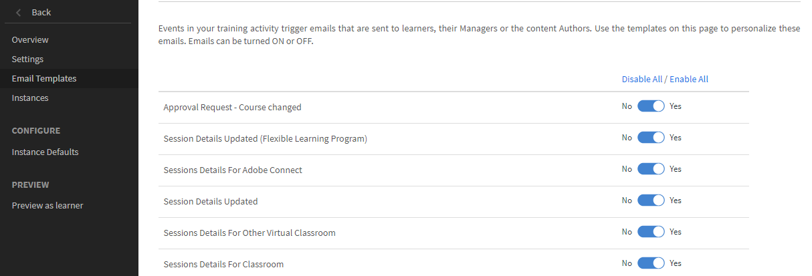
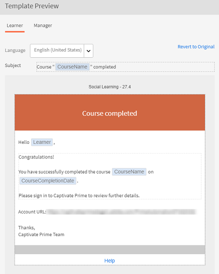

# E-Mail-Vorlagen

In diesem Artikel erfahren Sie, wie Sie E-Mail-Vorlagen für Ereignisse konfigurieren, die sich auf alle Lernobjekte beziehen.

Die Learning Manager-Anwendung sendet E-Mail-Benachrichtigungen ereignisgesteuert an mehrere Benutzerrollen.

Als Autor können Sie E-Mail-Vorlagen anpassen, indem Sie Inhalte hinzufügen oder ändern und Benachrichtigungen für verschiedene Ereignisse, die von Teilnehmern, Managern und Autorenaktivitäten ausgelöst werden, an Benutzer senden. Beispielsweise können Sie eine benutzerdefinierte E-Mail senden, wenn sich ein Teilnehmer für Ihren Kurs registriert. Nach der Registrierung erhält der Teilnehmer die kursspezifische E-Mail automatisch.

Sie können auch festlegen, dass bei bestimmten Ereignissen keine E-Mail-Benachrichtigungen gesendet werden, indem Sie die Option &quot;E-Mail-Vorlage&quot; deaktivieren.

## E-Mail-Benachrichtigungen festlegen {#settingemailnotifications}

1. Klicken Sie in der Autoren-App auf das Lernobjekt, für das Sie die E-Mail-Vorlage konfigurieren möchten. Beispiel: Kurse.
1. Klicken Sie auf der Lernobjektseite auf den Kurs, die Zertifizierung oder das Lernprogramm, für den bzw. das Sie die E-Mail-Einstellungen konfigurieren möchten.
1. Klicken Sie auf der Seite mit den Lernobjektdetails auf E-Mail-Vorlagen.

   Sie können die Liste der Vorlagen anzeigen, die für das ausgewählte Lernobjekt verfügbar sind.

   
   *Vorlagenliste*

1. Klicken Sie auf den Ereignisnamen, um die Vorlage im Vorschaumodus anzuzeigen.

   

   *Vorschau der Vorlage anzeigen*

   Sie können jede Vorlage anpassen, indem Sie auf den Text im Hauptteil der Vorlage klicken. Sie können Variablen in den Text einfügen, indem Sie auf die entsprechenden Symbole klicken (siehe Abbildung). Bewegen Sie die Maus über jedes Symbol, um die Namen anzuzeigen.

   
   *Einfügen von Variablen*

   Folgende Variablen stehen zur Verfügung:

   * LPName
   * LPCompletionDeadline
   * LearnerName
   * LearnerEmail
   * CourseName
   * CourseDescription
   * CourseCompletionDeadline
   * CourseSkillDetails
   * CourseBadge

   Sie können die Nachricht auf den Standardinhalt zurücksetzen, indem Sie über der Vorlage auf den Link Auf Original zurücksetzen klicken.

   Wie Sie oben in der Vorlage sehen, können Sie die Vorlage je nach Typ der E-Mail-Benachrichtigung für mehrere Rollen (Manager, Teilnehmer usw.) anpassen.

1. Klicken Sie unten auf der Vorlagenseite auf Speichern .
1. Klicken Sie auf der Seite mit den E-Mail-Vorlagen auf die kreisförmige Ja/Nein-Schaltfläche, um die Benachrichtigung zu senden oder zu deaktivieren.

*E-Mail-Benachrichtigung aktivieren oder deaktivieren*

Wenn der Kreis in der Benachrichtigungsschaltfläche für jeden Ereignisnamen neben &quot;Ja&quot; steht (mit blauem Hintergrund), ist die Benachrichtigung aktiviert. Wenn es grau dargestellt wird und der Kreis an &quot;Nein&quot; angrenzt, ist die Benachrichtigung deaktiviert.

Wenn Sie eine E-Mail-Vorlage auf Kursebene konfigurieren, hat diese Vorrang vor den Einstellungen auf Administratorebene für diesen bestimmten Kurs.
