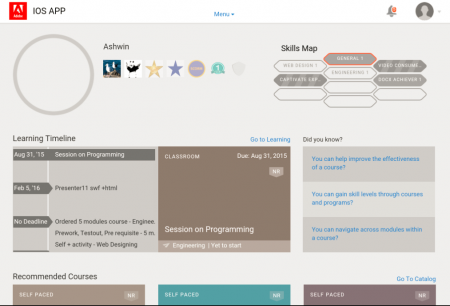
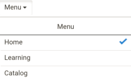
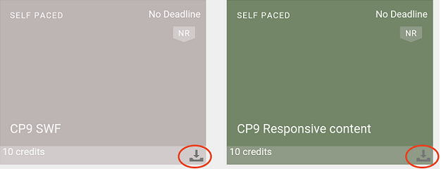
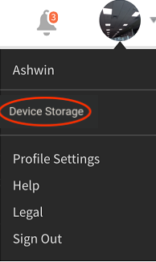

# Benutzer von iPad- und Android-Tablets

Wenn Sie sich auf dem iPad oder Android-Tablet als Teilnehmer bei Learning Manager angemeldet haben, sehen Sie die folgende Startseite:

Um zu den Lern- und Katalogfunktionen zu navigieren, tippen Sie auf die Dropdown-Liste **Menü** und wählen Sie die gewünschte Option aus.

Sie können auf iPad- und Android-Tablets auch offline auf die Learning Manager-App zugreifen. Laden Sie Kurse herunter und bearbeiten Sie sie im Offlinemodus. Wenn Sie wieder mit dem Netzwerk verbunden sind, synchronisieren Sie sie mit der Online-App.

1. Tippen Sie auf die Dropdown-Liste Menü und dann auf die Option Lernen. Eine Liste aller verfügbaren Kurse wird in Form von Kacheln angezeigt.
1. Tippen Sie auf das Download-Symbol unten auf jeder Lernobjekt-Kachel, um die Lerninhalte herunterzuladen.

1. Wenn Sie online sind, wird am oberen Rand der App in einer Leiste eine Eingabeaufforderung angezeigt und nachgefragt, ob Sie Ihre Inhalte online synchronisieren möchten. Tippen Sie auf die rote Leiste, wenn Ihre Antwort „Ja“ ist. Eine grüne Leiste zeigt an, dass Ihr Inhalt mit der Online-App synchron ist.

## Gerätespeicher verfolgen {#trackdevicestorage}

Sie können Ihren Gerätespeicher regelmäßig überprüfen.

Tippen Sie dazu auf das Profilsymbol in der rechten oberen Ecke der App und tippen Sie auf die Menüoption **Gerätespeicher**.

Das folgende Dialogfeld mit Informationen zum App-Speicher wird angezeigt.

Anhand der Informationen zum App-Speicher können Sie den gesamten Speicher des Geräts, der App und der heruntergeladenen Kurse überprüfen. Mit diesen Informationen können Sie Kurse entsprechend herunterladen. Um heruntergeladene Kurse vom Gerät zu löschen, tippen Sie neben dem entsprechenden Kursnamen auf das X-Symbol.
