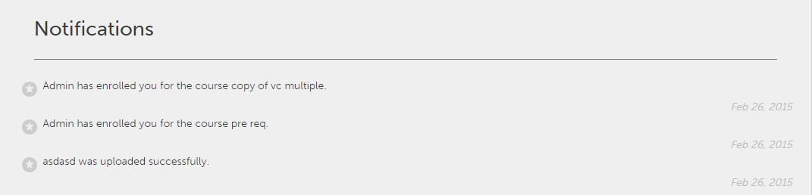

# Benutzerbenachrichtigungen

Die Benachrichtigungsfunktion gilt für alle Benutzer von Adobe Learning Manager. Jeder Benutzer erhält jedoch basierend auf seiner Rolle in verschiedenen Szenarien unterschiedliche Benachrichtigungen. Alle Warnungen und Benachrichtigungen an Benutzer werden über das Popup-Dialogfeld für Benachrichtigungen angezeigt.

## Zugriff auf Benachrichtigungen {#accessnotifications}

Die Benutzer können Benachrichtigungen anzeigen, indem sie in der rechten oberen Ecke des Fensters auf das Benachrichtigungssymbol klicken.

In der folgenden Abbildung sehen Sie ein Musterbenachrichtigungsfenster für einen Autor:

In diesem Popupfenster werden Markierungen für Benachrichtigungen zusammen mit deren Eingangszeitpunkt und einer Bildlaufleiste angezeigt.

Die Anzahl der neuen Benachrichtigungen wird durch die markierte Zahl oben auf dem Benachrichtigungssymbol angezeigt. Wenn es beispielsweise seit Ihrer letzten Anmeldung fünf neue Benachrichtigungen gibt, wird oben am Benachrichtigungssymbol die Zahl fünf angezeigt. Wenn Sie die neuesten Benachrichtigungen gelesen haben, wird diese Zahl ausgeblendet.

Klicken Sie am unteren Rand des Benachrichtigungs-Popupfensters auf den Link **[!UICONTROL Alle Benachrichtigungen anzeigen]**, um alle Benachrichtigungen auf einer separaten Seite anzuzeigen.

## Arten von Benachrichtigungen für Autoren {#typesofnotificationsforauthors}

Autoren erhalten Benachrichtigungen, wenn die folgenden Ereignisse eintreten:

* Wenn das Hochladen eines Moduls erfolgreich war
* Wenn eine Modulversion geändert wurde
