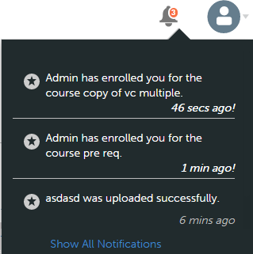

# Benutzerbenachrichtigungen

Die Benachrichtigungsfunktion gilt für alle Benutzer des Adobe Learning Manager. Jeder Benutzer erhält jedoch basierend auf seiner Rolle in verschiedenen Szenarien unterschiedliche Arten von Benachrichtigungen. Alle Warnungen und Benachrichtigungen an Benutzer werden über das Popup-Dialogfeld &quot;Benachrichtigungen&quot; angezeigt.

## Auf Benachrichtigungen zugreifen {#accessnotifications}

Benutzer können Benachrichtigungen anzeigen, indem sie auf das Benachrichtigungssymbol in der oberen rechten Ecke des Fensters klicken.

Ein Beispiel-Benachrichtigungsfenster für die Autorenrolle wird im folgenden Screenshot angezeigt:

In diesem Popupfenster werden Markierungen aller Benachrichtigungen zusammen mit dem Zeitpunkt des Auftretens und einer Bildlaufleiste angezeigt.

Die Anzahl der neuesten Benachrichtigungen wird durch die markierte Zahl oben auf dem Benachrichtigungssymbol angezeigt. Wenn es beispielsweise nach Ihrer letzten Anmeldung fünf neue Benachrichtigungen gibt, wird die Zahl fünf über dem Benachrichtigungssymbol angezeigt. Diese Nummern werden ausgeblendet, sobald Sie alle neuesten Benachrichtigungen gelesen haben.

Klicken **[!UICONTROL Alle Benachrichtigungen anzeigen]** am unteren Rand des Benachrichtigungs-Popup-Fensters, um alle Benachrichtigungen auf einer separaten Seite anzuzeigen.

## Arten von Benachrichtigungen für Autoren {#typesofnotificationsforauthors}

Autoren erhalten Benachrichtigungen, wenn die folgenden Ereignisse eintreten:

* Wenn der Modul-Upload erfolgreich war
* Wenn eine Modulversion geändert wird
