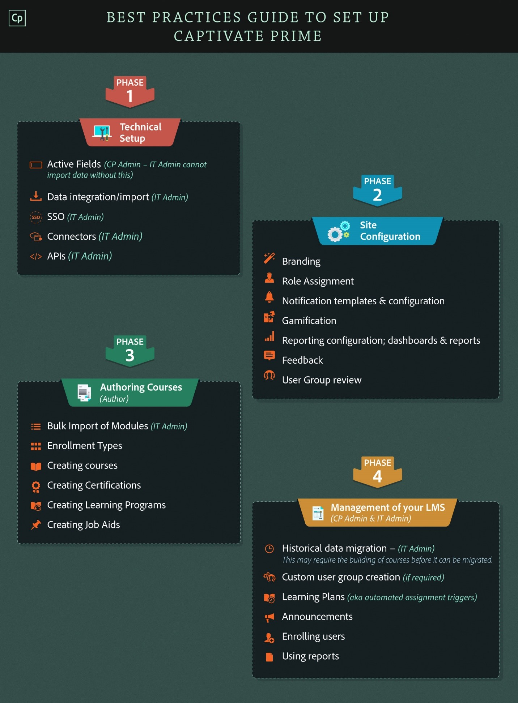

# Bereitstellungsleitfaden für Learning Manager

## Einführung {#introduction}

Learning Manager ist ein Learning Management System (LMS), mit dem Schulungsexperten ansprechende und verfolgbare Lernmaterialien bereitstellen können, die zu den Anforderungen und Zielen eines Unternehmens beitragen können. Mit Learning Manager können Ausbilder oder Manager Kurse und andere Lernobjekte in einer bestimmten Reihenfolge für Teilnehmer zuweisen. Dieses Tool bietet außerdem mehrere leistungsstarke Funktionen, darunter einen Fluidic Player in mehreren Formaten, Gamification, Abzeichen und benutzerfreundliches Teilnehmer-Dashboard. Um jedoch alle diese Funktionen nutzen zu können, muss Learning Manager zunächst konfiguriert und eingerichtet werden.

Dieser Leitfaden enthält schrittweise Anleitungen zum Einstieg in Learning Manager. In diesem Dokument finden Sie auch die Konfigurations- und Einrichtungsinformationen im Detail. Lesen Sie weiter, um zu erfahren, wie Ihnen der Einstieg in Learning Manager gelingt.

## Für wen ist dieser Leitfaden gedacht? {#whoisthisguideintendedfor}

Als Learning Manager-Benutzer können Sie sich in der Rolle eines Administrators, Autors, Kursleiters, Managers oder Teilnehmers befinden. Dieser Leitfaden richtet sich an Benutzer, die wahrscheinlich an der Einrichtung eines LMS für ein Unternehmen oder einen Kunden beteiligt sind:

* **IT-Administrator** - Als IT-Administrator können Sie Learning Manager aktivieren oder in Ihr Unternehmen integrieren. Ein IT-Administrator kann auch einzelne oder mehrere Benutzer hinzufügen und die Rolle eines Integrationsadministrators oder eines Administrators übernehmen, der Learning Manager in Drittanbieteranwendungen integriert.
* **Autor** - Als Learning Manager-Autor können Sie Lerninhalte erstellen, die für die Lernanforderungen eines Unternehmens erforderlich sind. Ein Autor ist an der Erstellung des grundlegenden Inhalts beteiligt, der in den Lern-Manager hochgeladen wird.

* **Learning Manager-Administrator**: Ein Learning Manager-Administrator führt die Konfigurations- und Einrichtungsaktivitäten für die Anwendung durch. In einigen Unternehmen kann ein IT-Administrator auch die Rolle eines Learning Manager-Administrators spielen.

## Erste Schritte bei der Bereitstellung von Learning Manager {#getstartedwithcaptivateprimedeployment}

Nachdem Sie Learning Manager erworben haben, aktivieren Sie Ihr Learning Manager-Konto mit dem erhaltenen Lizenzschlüssel. Fahren Sie mit den in der folgenden Abbildung gezeigten Konfigurationen fort:

## Konfigurieren Ihrer Site in Learning Manager {#configureyoursiteincaptivateprime}

Bevor Sie Lernobjekte in Learning Manager hinzufügen und implementieren, sind einige wichtige Konfigurationen erforderlich. Beginnen Sie mit der Konfiguration Ihrer Site entsprechend Ihrer Organisation. Die Site-Konfiguration umfasst die folgenden Schritte:

* Branding und Logo für Ihr Unternehmen einrichten
* E-Mail-Vorlagen konfigurieren
* Grundlegende Kontoeinstellungen konfigurieren
* Feedbackeinstellungen konfigurieren
* Einstellungen für das Teilnehmer-Dashboard konfigurieren

### Branding und Logo einrichten {#setupbrandingandlogo}

Als Administrator können Sie das Branding und die Designs so festlegen, dass sie den Branding-Anforderungen Ihrer Organisation entsprechen. Um das Branding und die Designs für Ihre Site festzulegen, gehen Sie wie folgt vor:

### Logo und Banner festlegen: {#settingthelogoandbanner}

Verwenden Sie die Logo- und Banner-Einstellungen, um das Logo Ihres Unternehmens in Learning Manager anzuzeigen. Konfigurieren Sie die Branding-Optionen, um die Domäne des Unternehmens in der URL festzulegen, den Namen des Unternehmens anzuzeigen und Farbschemata anzuzeigen, die dem Branding des Unternehmens entsprechen. So konfigurieren Sie die Branding-Einstellungen:

* Melden Sie sich bei Ihrem Learning Manager-Konto als Administrator an.
* Klicken Sie im linken Teilfenster auf **Branding**.
* Auf der Branding-Seite können Sie die folgenden Optionen konfigurieren, indem Sie auf **Bearbeiten** für die Option klicken, die Sie ändern möchten:

   * **Name der Organisation** : Der Wert, den Sie hier angeben, bestimmt den Namen, der auf dem Banner auf jeder Seite Ihrer Site angezeigt wird.
   * **Subdomain**: Dieser Wert bestimmt die URL für Ihre Site.
   * **Logo-Formatierung**: Das Bild in diesem Feld wird als Logo in der oberen rechten Ecke jeder Seite angezeigt. Hier können Sie auswählen, ob nur das Logo oder der Name Ihres Unternehmens oder das Logo und der Name des Unternehmens angezeigt werden sollen.

>[!NOTE]
>
>Sie können den Namen und das Logo nur mithilfe des Brandings konfigurieren. Sie können die Position des Logos oder des Bildes nicht ändern.

***Learning Manager unterstützt die folgenden Dateiformate für Logobilder: .png, .jpeg, .jpg, .gif, .bmp***

### Festlegen der Designs für Ihre Site {#settingthethemesforyoursite}

Mit Learning Manager können Sie das Erscheinungsbild Ihrer Site mithilfe von Designs ändern. Die Anwendung bietet Ihnen die folgenden Farbdesigns zur Auswahl:

* Prime-Standard
* Kieselseine
* Fasching
* Herbst
* Winterhimmel

Sie können eines der Farbschemata auswählen, um es an Ihr Unternehmensbranding anzupassen.

1. Klicken Sie im linken Navigationsbereich von Learning Manager auf **[!UICONTROL Branding]**.
1. Klicken Sie im Abschnitt **Designs** auf **[!UICONTROL Bearbeiten]**. In der Anwendung können Sie ein neues Design auswählen. Wenn Sie ein Design auswählen, werden sofort die Farbschemata angezeigt, die für die wichtigsten Elemente der Benutzeroberfläche verwendet werden.

   

1. Darüber hinaus können Sie die **Farbe der oberen Leiste**, die **Akzentfarbe** und die **Helligkeit der Seitenleiste** bearbeiten.  Für diese wichtigen Elemente der Benutzeroberfläche können Sie Ihre eigenen Markenfarben verwenden.
1. Um die Werte auf das Standardfarbschema für Ihr Design zurückzusetzen, klicken Sie auf **[!UICONTROL Design zurücksetzen]**. Dadurch werden die Farben für die wichtigsten UI-Elemente auf die Standardoptionen für das ausgewählte Design zurückgesetzt.
1. Nachdem Sie das Design ausgewählt haben, klicken Sie auf **[!UICONTROL Hinweise anzeigen]**, um die Beschriftungen oder Hinweise in der Vorschau anzuzeigen.

   

   Beachten Sie eine Diashow mit mehreren Bildern im Abschnitt **Designs**. Mit dieser Diashow können Sie sofort eine Vorschau des Designs oder Farbschemas anzeigen. Sie können ausgewählte Seiten wie die Startseite, das Teilnehmer-Dashboard usw. sofort in der Vorschau anzeigen.

1. Wenn Sie eine Vorschau der Änderungen in einem Browser anzeigen möchten, klicken Sie auf **[!UICONTROL Live-Vorschau]**. Ein Popupfenster für die Live-Designvorschau wird angezeigt, in dem Sie entweder das Farbschema ändern oder mit den Standardoptionen fortfahren können. Um eine Vorschau Ihrer Optionen in einem Browser anzuzeigen, klicken Sie in diesem Popup-Fenster auf **[!UICONTROL Vorschau]**.

   

1. Die ausgewählten Optionen werden vorübergehend auf Ihre Site angewendet. Wenn Sie die ausgewählten Themen- und Farbeinstellungen speichern möchten, klicken Sie auf **[!UICONTROL Anwenden]**.
1. Nachdem Sie ein Design ausgewählt und angewendet haben, klicken Sie auf **&#x200B;**&#x200B;[!UICONTROL Speichern]&#x200B;**&#x200B;**, um Ihre Auswahl zu speichern.

## Konfigurieren von E-Mail-Vorlagen {#configureemailtemplates}

Als Administrator können Sie als Nächstes E-Mail-Vorlagen für verschiedene Ereignisse konfigurieren. Sie können E-Mail-Vorlagen, die an Benutzer gesendet werden sollen, aktivieren, deaktivieren und ändern. Es gibt drei Hauptkategorien von E-Mail-Vorlagen:

* Allgemeine E-Mail-Vorlagen: Diese E-Mails werden für generische Ereignisse ausgelöst. Beispiel: Eine Willkommensbenachrichtigung, wenn sich ein Benutzer zum ersten Mal anmeldet.
* E-Mail-Vorlagen, die mit einem Lernobjekt oder einer Aktivität verknüpft sind: Diese E-Mails werden an Teilnehmer, Autoren oder Manager gesendet, wenn eine Lernaktivität vorhanden ist. Beispielsweise E-Mails, die nach der Kursregistrierung, der Teilnahme am Klassenzimmer, dem Kursabschluss usw. ausgelöst werden.
* Erinnerungen und Updates: Diese E-Mails werden ausgelöst, wenn Benutzer für jedes Ereignis Aktualisierungen oder Erinnerungen benötigen. Beispielsweise ein Teilnehmer, der eine Erinnerung für einen bevorstehenden Kurs erhält, oder ein Administrator, der eine E-Mail-Benachrichtigung für einen freigegebenen Bericht erhält.

Sie können diese E-Mail-Benachrichtigungen über das Administrator-Dashboard aktivieren und konfigurieren. Führen Sie die folgenden Schritte aus, um zu erfahren, wie Sie E-Mail-Vorlagen einrichten:

1. Klicken Sie im linken Navigationsbereich auf **[!UICONTROL **&#x200B; E-Mail-Vorlagen &#x200B;**.]**.
1. Klicken Sie auf eine der folgenden Registerkarten:**[!UICONTROL ** Allgemein **/** Lernaktivität **/** Erinnerungen und Updates **.]** Nehmen wir an, Sie klicken auf **[!UICONTROL **&#x200B; Lernaktivität &#x200B;**.]**
1. Klicken Sie auf die Statusschaltfläche für die Aktivität, für die Sie eine E-Mail auslösen möchten. In diesem Beispiel nehmen wir an, Sie klicken auf **[!UICONTROL **&#x200B; Lernprogramm - Registriert von Administrator/Manager &#x200B;**.]**

   

   Das System zeigt die Popup-Meldung &quot;Erfolgreich aktiviert&quot; an. Wenn ein Manager oder Administrator einen Teilnehmer für einen Kurs registriert, erhält der Teilnehmer eine E-Mail von diesem Learning Manager-Konto.

1. Sie können die Standard-E-Mail-Vorlage ändern. Klicken Sie dazu auf das Ereignis. Klicken Sie in diesem Beispiel auf **[!UICONTROL Lernprogramm - Registriert von Administrator/Manager.]**
1. Beachten Sie, dass im Popup-Dialogfeld **[!UICONTROL Vorlagenvorschau]** zwei Registerkarten vorhanden sind: [!UICONTROL Teilnehmer] und [!UICONTROL Manager].

   

   Klicken Sie für jede dieser Registerkarten auf den E-Mail-Text, um den Inhalt zu ändern. Um die Änderungen an der E-Mail-Vorlage zu speichern, klicken Sie auf **[!UICONTROL Speichern]**.

   Wenn sich ein Teilnehmer jetzt für einen Kurs vom Manager oder vom Administrator registriert hat, erhalten der Teilnehmer und sein Manager eine E-Mail-Benachrichtigung.

   ***Hinweis: Die Änderungen gelten nur für die E-Mail-Vorlage, die dem ausgewählten Ereignis zugeordnet ist.***

1. Beachten Sie, dass Sie die Konto-URL oder die Signatur in der E-Mail-Vorlage nicht ändern konnten. Um die **[!UICONTROL Konto-URL]** oder **[!UICONTROL Signatur]** zu ändern, klicken Sie auf die Registerkarte **[!UICONTROL Einstellungen]**. Auf dieser Registerkarte können Sie das E-Mail-Banner, die E-Mail-Signatur und die Konto-URL ändern.

   Der Konto URL-Link wird in allen E-Mails unmittelbar vor der Signatur angezeigt. Geben Sie die URL ein und klicken Sie auf **[!UICONTROL Speichern]**. Diese URL ist nur für interne Benutzer sichtbar.

   Für das E-Mail-Banner können Sie die Farbe des Banners ändern, indem Sie **[!UICONTROL **&#x200B; Bannerhintergrund &#x200B;** auswählen.] **&#x200B; Sie können auch ein benutzerdefiniertes Bild als Banner verwenden, indem Sie die Option &#x200B;** [!UICONTROL Benutzerdefiniertes Bild] **&#x200B; auswählen. Klicken Sie auf &#x200B;** [!UICONTROL Speichern]**, nachdem Sie die Änderungen vorgenommen haben.

   ***Hinweis: Die benutzerdefinierte Bildgröße für das E-Mail-Banner muss 1240x200px betragen. Bilder, die größer als die empfohlene Größe sind, werden beschnitten.***

   ***Learning Manager unterstützt nur die Dateitypen .jpg, .jpeg und .png für E-Mail-Banner.***

   

1. Sie können auch „Optionale Manager-E-Mails“ aktivieren. Wenn Sie das Kontrollkästchen **[!UICONTROL Aktivieren]** aktivieren, wird der Manager auch in die Mailingliste aufgenommen, wenn ein direkter Bericht eine E-Mail von diesem Prime-Konto erhält.

   ***Hinweis: Die Einstellungen auf dieser Registerkarte gelten global für alle Vorlagen.***

### Konfigurieren von E-Mail-Vorlagen für ein Lernobjekt {#configureemailtemplatesforalearningobject}

Neben dem Festlegen von E-Mail-Vorlagen auf globaler Ebene können Sie als Administrator auch E-Mail-Vorlagen für ein bestimmtes Lernobjekt konfigurieren. In diesem Fall gelten alle Änderungen, die Sie an der E-Mail-Vorlage vornehmen, nur für dieses Lernobjekt.

Diese Option ist auch für Autoren verfügbar, wenn Autoren ein Lernobjekt einrichten.

So konfigurieren Sie E-Mail-Vorlagen für ein Lernobjekt:

1. Klicken Sie auf den Kurs, das Lernprogramm oder die Zertifizierung, für die Sie die E-Mail-Vorlage konfigurieren möchten.
1. Klicken Sie im linken Teilfenster auf **[!UICONTROL **&#x200B; E-Mail-Vorlagen &#x200B;**.] **&#x200B; Das System zeigt das Popup-Dialogfeld &#x200B;**&#x200B;**[!UICONTROL Vorlagenübersicht]**&#x200B;** an.
1. Ändern Sie den Betreff oder den Text der E-Mail-Vorlage und klicken Sie auf **[!UICONTROL **Speichern**]**, um die Änderungen zu übernehmen.
1. Klicken Sie auf **[!UICONTROL **&#x200B; Auf Original zurücksetzen &#x200B;**, um die Änderungen abzubrechen.]**

### Empfang von E-Mails für Benutzer beschränken {#restrictusersfromreceivingemails}

Als Administrator können Sie auswählen, wer E-Mails von Learning Manager erhält und wer nicht. Sie können dies mit der Option **&#x200B;**&#x200B;[!UICONTROL Eingeschränkter Benutzer]&#x200B;**&#x200B;** auf der Registerkarte **&#x200B;**&#x200B;[!UICONTROL Einstellungen] **&#x200B; **. Benutzer können dieser Liste mit ihrem Namen, ihrer E-Mail-ID oder ihrer eindeutigen Benutzer-ID hinzugefügt werden. Die unter dieser Option aufgeführten Benutzer erhalten keine E-Mail-Mitteilungen von Learning Manager.

## Konfigurieren Ihrer Kontoeinstellungen {#configureyouraccountsettings}

Mit Learning Manager können Sie einige Kontoeinstellungen konfigurieren, z. B. grundlegende Einstellungen, Feedback-Einstellungen, allgemeine Einstellungen und Einstellungen für das Teilnehmer-Dashboard. In den folgenden Verfahren erfahren Sie, wie Sie diese Einstellungen konfigurieren:

### Grundlegende Einstellungen konfigurieren {#configurebasicsettings}

1. Klicken Sie auf der Learning Manager-Startseite auf **&#x200B;**&#x200B;[!UICONTROL Einstellungen]&#x200B;**&#x200B;**. Standardmäßig zeigt das System die Seite „Grundlegende Informationen“ mit den Feldern „Standardsprache“ und „Standort“ an.
1. Klicken Sie auf **&#x200B;**&#x200B;[!UICONTROL Ändern]&#x200B;**&#x200B;** in der oberen rechten Ecke der Seite, um die grundlegenden Informationen zu bearbeiten.
1. Konfigurieren Sie die folgenden Optionen:

   * **Land**: Wählen Sie in diesem Dropdownfeld das Land aus.
   * **Zeitzone**: Legen Sie die entsprechende Zeitzone für Ihren Standort fest.
   * **Gebietsschema**: Wählen Sie die gewünschte Sprache aus. Wenn Sie die Sprache in diesem Feld ändern, wird die Änderung auf alle Benutzer angewendet, die diese Anwendung verwenden. Jeder Benutzer kann jedoch die Sprache seiner Voreinstellungen individuell ändern.
   * **Geschäftsjahr startet im**: Wählen Sie den Monat aus, in dem das Geschäftsjahr für Ihr Unternehmen beginnt.

   

## Konfigurieren von Feedbackeinstellungen {#configurefeedbacksettings}

Mit Learning Manager können Sie das Feedback von Teilnehmern für einen Kurs erfassen. Sie können auch Feedback zu Teilnehmern mit Learning Manager einholen. Um Feedback einzuholen, müssen Sie zunächst die Feedbacktypen L1 und L3 konfigurieren.

L3-Feedback ist das Feedback, das ein Manager einem Teilnehmer gibt. Sie können dieses Feedback verwenden, um die Leistung der Teilnehmer im Zeitverlauf zu verfolgen. L1-Feedback ist das Feedback, das ein Teilnehmer zu einem Kurs abgibt. Mit dieser Art von Feedback kann ein Administrator direkt Feedback zu einem Kurs abgeben.

Als Administrator können Sie die Feedbackeinstellungen global konfigurieren. Gehen Sie dazu wie folgt vor:

1. Klicken Sie auf der Learning Manager-Startseite auf **[!UICONTROL Einstellungen]**.
1. Klicken Sie im linken Bereich auf **[!UICONTROL Allgemein]**.
1. Um L1-Feedback zu konfigurieren, klicken Sie auf die Registerkarte **[!UICONTROL L1-Feedback]**. Sie sehen die Optionen zum Konfigurieren einer obligatorischen Frage und mehrerer optionaler Fragen. Dies sind die Fragen, die einem Teilnehmer angezeigt werden, während er nach Abschluss eines Kurses Feedback abgibt. Die Fragen sind als Anweisungen formuliert, sodass die Teilnehmer ihre Antwort auf einer Skala von 1 bis 5 auswählen können.

   Der erste Teil des L1-Feedbacks ist eine obligatorische Frage dazu, wie es für einen Teilnehmer ist, diesen Kurs einem Freund oder einem Kollegen zu empfehlen.

   ***Hinweis: Sie können die obligatorische Frage nicht bearbeiten oder ändern.***

   

1. Um die anderen Fragen für Ihren Feedback-Fragebogen zu konfigurieren, klicken Sie auf die Fragen in **&#x200B;**&#x200B;[!UICONTROL Selbststudium im Klassenzimmer]&#x200B;**&#x200B;** oder **&#x200B;**&#x200B;[!UICONTROL Kurse im Klassenzimmer]&#x200B;**&#x200B;**. Wenn Sie auf eine Frage klicken, können Sie im System die Standardfragen bearbeiten.

   

1. Sie können die Standardfragen aktivieren, deaktivieren oder vollständig an Ihre Anforderungen anpassen. Sie können beispielsweise die Standardfrage &quot;Der Schulungsgegenstand war für mich relevant&quot; entfernen und die Frage durch &quot;Ich fand die Schulung nützlich und relevant&quot; ersetzen.
1. Nachdem Sie die Fragen für Teilnehmer abgeschlossen haben, können Sie die Erinnerungseinstellungen konfigurieren. Standardmäßig gibt es eine vorhandene Erinnerung, bei der die Anwendung automatisch Erinnerungen an Teilnehmer sendet, wenn ein Kurs erfolgreich abgeschlossen wurde. Diese Erinnerung wird auch alle zwei Wochen wiederholt, bis der Teilnehmer antwortet. Sie können die vorhandene Erinnerung ändern, indem Sie auf die Erinnerung klicken, oder eine neue Erinnerung hinzufügen.

   

1. Konfigurieren Sie die Erinnerungseinstellungen, indem Sie die folgenden Optionen einstellen:

   * **Sendezeitpunkt**: Geben Sie an, ob Sie die Feedback-Anforderung bei oder nach Kursabschluss senden möchten.
   * **Tage nach Abschluss**: Geben Sie die Anzahl der Tage an, nach denen Sie die Feedback-Anforderung senden möchten. Dieses Feld ist nur sichtbar, wenn **&#x200B;**&#x200B;[!UICONTROL Nach Kursabschluss]&#x200B;**&#x200B;** ausgewählt wurde.

   * **Wiederholung**: Geben Sie an, ob Sie die Feedback-Erinnerung täglich, wöchentlich oder monatlich senden möchten. Sie können auch angeben, wie viele Wochen die Erinnerung gesendet werden soll.

1. Speichern Sie die Erinnerungseinstellungen, indem Sie das Kontrollkästchen aktivieren.
1. Nachdem Sie alle Feedbackeinstellungen abgeschlossen haben, klicken Sie auf **[!UICONTROL **Speichern**]** in der oberen rechten Ecke der Seite.

## L3-Feedback konfigurieren: {#configurel3feedback}

L3-Feedback enthält die Fragen, die an den Manager eines Teilnehmers gesendet werden, nachdem der Teilnehmer einen Kurs abgeschlossen hat. L3-Feedback ermöglicht es einem Administrator, Änderungen des Verhaltens oder der Kenntnisse eines Teilnehmers im Laufe der Zeit zu verfolgen. Um dieses Feedback zu konfigurieren, klicken Sie auf der Feedback-Seite auf die Registerkarte **&#x200B;**&#x200B;[!UICONTROL L3-Feedback]&#x200B;**&#x200B;**. Sie sehen eine Standardfrage. Der Manager muss diese Frage anhand einer Fünf-Punkte-Ratingskala beantworten.

Ähnlich wie beim L1-Feedback können Sie die Erinnerungen für das L3-Feedback konfigurieren. Sie können entweder die vorhandene Erinnerung ändern oder eine neue Feedbackerinnerung hinzufügen.

Nachdem Sie die Feedbackfrage und die Erinnerungseinstellungen abgeschlossen haben, klicken Sie auf **&#x200B;**&#x200B;[!UICONTROL Speichern]&#x200B;**&#x200B;**, um Ihre Einstellungen anzuwenden.

## Feedback auf Instanzebene konfigurieren {#configurefeedbackataninstancelevel}

Im vorherigen Verfahren wurden die Schritte zur Konfiguration der Feedbackeinstellungen auf globaler Ebene beschrieben. Das heißt, die Einstellungen werden auf alle Kurse angewendet. Zusätzlich zu diesen globalen Fragen können Sie als Administrator oder Autor zusätzliche L1- und L3-Feedbackfragen auf Instanzebene konfigurieren.

So konfigurieren Sie die Feedbackeinstellungen auf Instanzebene:

1. Klicken Sie auf der Learning Manager-Startseite auf **[!UICONTROL Kurse]**.
1. Bewegen Sie den Mauszeiger über den Kurs, in dem Sie die Feedbackeinstellungen konfigurieren möchten. Klicken Sie auf [!UICONTROL **Kurs anzeigen**.].

   

1. Klicken Sie auf der Seite mit den Kursdetails im Abschnitt &quot;Konfigurieren&quot; auf **[!UICONTROL Standardwerte für Instanz]**.
1. Wählen Sie in der Dropdownliste [!UICONTROL **Sprache**] die Sprache aus, in der der Feedbackfragebogen angezeigt werden soll.
1. Aktivieren Sie das L1-Reaktionsfeedback, wenn Sie Feedback von Teilnehmern einholen möchten. In diesem Abschnitt können Sie bis zu zwei Fragen hinzufügen. Die Teilnehmer können beschreibende Antworten auf diese Fragen geben.
1. Aktivieren Sie das Kontrollkästchen **[!UICONTROL Als obligatorisch definieren]**, wenn Sie eine oder beide Fragen als obligatorisch festlegen möchten.
1. Wählen Sie **[!UICONTROL Fragebogen sofort nach Kursabschluss anzeigen]** aus, wenn Teilnehmer den Feedback-Fragebogen unmittelbar nach Abschluss des Kurses anzeigen möchten.

   

1. Um das L3-Feedback zur Verhaltensänderung auf Instanzebene zu konfigurieren, **&#x200B;**&#x200B;[!UICONTROL aktivieren]&#x200B;**&#x200B;** Sie das L3-Feedback. Die Anwendung zeigt eine vordefinierte, obligatorische Frage und eine leere Frage an, in die Sie eine Frage Ihrer Wahl eingeben können.
1. Für die vordefinierte Frage zur Verbesserung des Teilnehmers nach der Teilnahme am Kurs liegt die Antwort im Likert-Skalierungsformat vor. Das heißt, Manager müssen eine Option auf einer Skala von „Stimme voll zu“ bis „Stimme überhaupt nicht zu“ wählen.
1. Geben Sie die zweite Frage für den Manager an. Manager können eine aussagekräftige Antwort auf diese Frage geben.
1. Aktivieren Sie das Kontrollkästchen **&#x200B;**&#x200B;[!UICONTROL Als obligatorisch definieren]&#x200B;**&#x200B;**, wenn Sie die zweite Frage als obligatorisch festlegen möchten.

   

1. Konfigurieren Sie optional die Erinnerungseinstellungen auf Instanzebene. Wenn Sie hier keine Erinnerungseinstellungen konfigurieren, werden automatisch die globalen Erinnerungseinstellungen zugewiesen.
1. Nachdem Sie die Feedbackfragen und die Erinnerungseinstellungen abgeschlossen haben, klicken Sie auf **[!UICONTROL **Speichern**]**, um Ihre Einstellungen anzuwenden.

   ***Hinweis: Die Feedbackeinstellungen gelten nicht für Zertifizierungen.***

## Konfigurieren von allgemeinen Einstellungen {#configuregeneralsettings}

Mit den allgemeinen Einstellungen in Learning Manager können Administratoren generische Einstellungen konfigurieren, die sich auf andere Funktionen in der Anwendung auswirken. Beispielsweise können Sie mit allgemeinen Einstellungen festlegen, ob die Kurseffektivität für Teilnehmer sichtbar gemacht werden kann. So konfigurieren Sie die allgemeinen Einstellungen:

1. Klicken Sie auf der Learning Manager-Startseite auf **&#x200B;**&#x200B;[!UICONTROL Einstellungen]&#x200B;**&#x200B;**.
1. Klicken Sie im linken Bereich auf **&#x200B;**&#x200B;[!UICONTROL Allgemein]&#x200B;**&#x200B;**.
1. Auf der Einstellungsseite „Allgemein“ können Sie die folgenden Optionen konfigurieren:

   Für alle diese Optionen ist die Funktion, auf die sich jede Option auswirkt, unterschiedlich. Bei Bedarf können Sie Querverweise zu jeder der detaillierten Funktionen erstellen.

   * **Kurseffektivität anzeigen**: Aktivieren Sie diese Option, wenn Teilnehmer die Effektivität eines Kurses im Kurstitel sehen sollen.
   * **Option zum Zurücksetzen des Moduls**: Aktivieren Sie diese Option, wenn Sie Teilnehmern die Möglichkeit geben möchten, ein Modul zurückzusetzen. Wenn Sie diese Option auswählen, können Teilnehmer Ihre Module zurücksetzen, wenn sie nicht bestanden haben oder wenn sie ein Modul teilweise absolviert haben und von vorne beginnen möchten.
   * **Kursmoderation**: Aktivieren Sie diese Option, wenn die Änderungen an einem Kurs von einem Administrator genehmigt werden sollen, bevor die Änderungen für die Teilnehmer sichtbar sind.
   * **Diskussions-Dashboard**: Aktivieren Sie diese Option, wenn Teilnehmer Diskussions-Dashboards für Kurse anzeigen und daran teilnehmen sollen. Wenn Sie das Kontrollkästchen **Diskussions-Dashboard** aktivieren, können Teilnehmer und Kursleiter Kommentare für Kurse veröffentlichen. Wenn diese Funktion jedoch auf Kursebene nicht aktiviert ist, haben die Einstellungen auf Kursebene Vorrang vor Administratoreinstellungen.

   * **Neue Kenntnisse entdecken**: Aktivieren Sie diese Option, wenn Teilnehmer Peer- und Führungskenntnisse erforschen sollen.
   * **Eindeutige Lernobjekt-IDs**: Aktivieren Sie diese Option, wenn Sie Autoren die Möglichkeit geben möchten, Lernobjekten eindeutige IDs hinzuzufügen.
   * **Katalogliste anzeigen**: Aktivieren Sie diese Option, wenn die Teilnehmer alle verfügbaren Kataloge anzeigen sollen. Mit dieser Option können Teilnehmer ihre Lernobjektliste verfeinern.

   

## Konfigurieren der Einstellungen für das Teilnehmer-Dashboard {#configurelearnerdashboardsettings}

Mit dem Teilnehmer-Dashboard in Learning Manager können Teilnehmer zusätzlich zu ihren Leistungen, Kenntnissen und Ankündigungen ihre obligatorischen und empfohlenen Kurse anzeigen. Administratoren können festlegen, wie dieses Teilnehmer-Dashboard angezeigt werden soll, indem sie die Einstellungen für das Teilnehmer-Dashboard konfigurieren. Mit diesen Einstellungen können Administratoren die Widgets auf der Teilnehmerseite festlegen. Diese Einstellungen geben auch an, wie und wo die Widgets im Teilnehmer-Dashboard platziert werden. Als Administrator können Sie eine Vorschau des Layouts des Teilnehmer-Dashboards anzeigen, bevor Sie die Einstellungen anwenden.

1. Klicken Sie auf der Learning Manager-Startseite auf **[!UICONTROL Einstellungen]**.
1. Klicken Sie im linken Navigationsbereich auf **[!UICONTROL **&#x200B; Teilnehmer-Dashboard &#x200B;**.]**.
1. Wählen Sie die Widgets aus, die Sie aktivieren möchten. Wenn Sie die Auswahl eines Widgets aufheben, wird das Widget sofort aus der Vorschau entfernt. Teilnehmer können dieses Widget nicht in ihrem Dashboard sehen.
1. Klicken Sie auf **&#x200B;**&#x200B;[!UICONTROL Speichern]&#x200B;**&#x200B;**, um die Einstellungen anzuwenden.

   

1. Um die Standardeinstellungen anzuwenden, klicken Sie auf **[!UICONTROL Auf Standard zurücksetzen.]** In diesem Fall sind alle Widgets mit Ausnahme von **[!UICONTROL Willkommen und Ankündigungsnotizen]** sichtbar.

   ***Auch nachdem Sie die Einstellungen im Teilnehmer-Dashboard aktiviert haben, können Teilnehmer Widgets in ihren jeweiligen Dashboards ändern und verschieben.***

