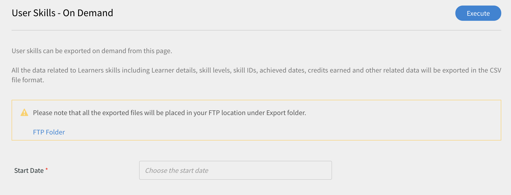
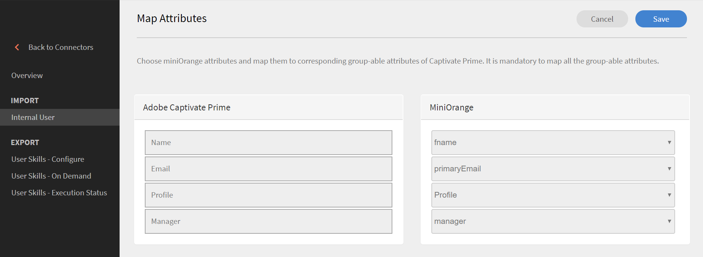

# Learning Manager-Connectors

Anleitung zum Integrieren von Salesforce mit dem Learning Manager über Connectors, Anleitung zum Integrieren von FTP mit dem Learning Manager und automatischen Hochladen von CSV über den FTP-Connector.

Unternehmen verfügen über andere Anwendungen und Systeme, die möglicherweise in Learning Manager integriert werden müssen. Connectors sind Dienstprogramme, die bei der Durchführung datenbasierter Integrationen helfen, z. B. Importieren von Daten in Learning Manager aus externen Systemen oder Exportieren von Daten in externe Systeme aus Learning Manager. In der Version vom Juli 2016 funktionieren die Connectors nur wie Benutzer, die Massenimporte für Learning Manager aus externen Systemen durchführen.

Learning Manager stellt Connectors für Salesforce und FTP bereit. Über den Salesforce-Connector können für die Integration zuständige Administratoren eines Unternehmens ihre Salesforce-Anwendung mit dem Learning Manager integrieren. Als Verantwortlicher für die Integration können Sie außerdem mithilfe des FTP-Connectors Gruppen von Benutzern automatisch in Ihre Unternehmensanwendung importieren.

Learning Manager stellt außerdem die Lynda-, getAbstract- und Harvard Management System-Connectors bereit, mit denen Teilnehmer auf Kurse von Lynda.com, getAbstract und Harvard ManageMentor zugreifen und diese absolvieren können.

Lesen Sie weiter, um zu erfahren, wie Sie diese Connectors in Learning Manager konfigurieren und verwenden.

## Salesforce-Connector {#sfconnector}

Der Salesforce-Connector verbindet Learning Manager- und Salesforce-Konten, um die Datensynchronisierung zu automatisieren. Im Salesforce-Connector stehen die folgenden Funktionen zur Verfügung:

### Attribute zuordnen

Der für die Integration zuständige Administrator kann Spalten in Salesforce wählen und den entsprechenden für Gruppen geeigneten Attributen des Learning Managers zuordnen. Dies ist eine einmalige Maßnahme. Sobald die Zuordnung abgeschlossen ist, wird dieselbe Zuordnung auch für spätere Benutzerimporte verwendet. Wenn der Administrator eine andere Zuordnung zum Importieren von Benutzern benötigt, kann diese neu konfiguriert werden.

### Automatischer Benutzerimport

Beim Importieren von Benutzern hat der Learning Manager-Administrator die Möglichkeit, Mitarbeiterdaten aus Salesforce abzurufen und automatisch in Learning Manager zu importieren. Durch diese Automatisierung entfällt der manuelle Aufwand beim Erstellen und Hochladen von CSV-Dateien in Learning Manager.

### Automatische Zeitplanung

Die automatische Zeitplanung kann zusammen mit dem automatischen Benutzerimport sehr effizient sein. Der Lern-Manager-Administrator kann einen Zeitplan entsprechend den Anforderungen des Unternehmens einrichten. Benutzer in der Learning Manager-Anwendung können gemäß dem Zeitplan auf dem neuesten Stand gehalten werden. Die Synchronisierung kann täglich in der Learning Manager-Anwendung durchgeführt werden.

### Filtern von Benutzern

Der Lern-Manager-Administrator kann die Benutzer vor dem Import filtern. Beispielsweise kann der Lern-Manager-Administrator alle Benutzer in der Hierarchie unter einem oder mehreren bestimmten Managern importieren.

## Salesforce-Connector konfigurieren {#configuresalesforceconnector}

Erfahren Sie, wie Sie Learning Manager mit Salesforce integrieren.

### Voraussetzungen {#prerequisites}

Stellen Sie sicher, dass Sie Ihre Salesforce-Unternehmens-URL zur Hand haben. Wenn der Name Ihrer Organisation beispielsweise **Myorg** klicken, könnte die Salesforce-URL [https://myorg.salesforce.com](https://myorg.salesforce.com/). Dies ist die einzige Eingabe, die erforderlich ist, um das Salesforce-Konto mit dem Learning Manager zu verbinden.

Stellen Sie außerdem sicher, dass Sie über die entsprechenden Anmeldedaten verfügen, um sich bei dem Konto anzumelden.

## Erstellen einer Verbindung {#createaconnection}

1. Bewegen Sie die Maus auf der Startseite des Learning Manager über die Salesforce-Karte/Miniaturansicht. Ein Menü wird angezeigt. Klicken **[!UICONTROL Vernetzen]** im Menü.

   

1. Ein Dialogfeld wird angezeigt, in dem Sie zur Eingabe der Unternehmens-URL aufgefordert werden. Klicken **[!UICONTROL Vernetzen]** nach Angabe der URL.
1. Nach erfolgreicher Verbindung wird die Übersichtsseite angezeigt.

## Attribute zuordnen {#mapattributes}

Sobald die Verbindung erfolgreich hergestellt wurde, können Sie Salesforce-Spalten zu den entsprechenden Attributen von Learning Manager zuordnen. Dieser Schritt ist obligatorisch.

1. Auf der Zuordnungsseite werden links die Spalten des Learning Managers und rechts die Spalten von Salesforce angezeigt. Wählen Sie den entsprechenden Spaltennamen aus, der dem Spaltennamen des Lern-Managers zugeordnet ist.

   

   Die Spaltendaten des Learning Managers, die auf der linken Seite angezeigt werden, werden von den aktiven Feldern abgerufen. Die **Betriebsleiter** muss unbedingt einem Feld mit der E-Mail-Adresse zugeordnet werden. Alle Spalten müssen zugeordnet werden, bevor der Connector verwendet werden kann.

1. Klicken **[!UICONTROL Speichern]** nach Abschluss der Zuordnung.
1. Der Connector ist jetzt einsatzbereit. Das Konto, das jetzt konfiguriert wurde, wird als Datenquelle innerhalb der Administrator-App angezeigt, sodass der Administrator den Import planen oder die Synchronisierung nach Bedarf starten kann.

## Verwenden des Salesforce-Connector {#usingsalesforceconnector}

Der Salesforce-Connector stellt eine Verbindung zu Salesforce.com her, um die Benutzer als konfiguriert abzurufen und sie dem Learning Manager hinzuzufügen.

## FTP-Connector für Learning Manager {#ftpconnector}

Mithilfe des FTP-Connectors können Sie Learning Manager mit beliebigen externen Systemen integrieren, um Datensynchronisierung zu automatisieren. Es wird erwartet, dass externe Systeme Daten in einem CSV-Format exportieren können und sie in den entsprechenden Ordner des Learning Manager FTP-Kontos zu platzieren. Im FTP-Connector stehen die folgenden Funktionen zur Verfügung:

Sie können den Box-Connector auch für die Datenmigration, den Benutzerimport und den Datenexport verwenden. Weitere Informationen finden Sie unter [Box-Connector.](third-party-connectors.md#main-pars_header_302653946)

## Datenimport {#dataimport}

Beim Importieren von Benutzern hat der Learning Manager-Administrator die Möglichkeit, Mitarbeiterdaten vom Learning Manager FTP-Dienst abzurufen und automatisch in den Learning Manager zu importieren. Mit dieser Funktion können Sie mehrere Systeme integrieren, indem Sie die CSV, die durch diese Systeme generiert wurden, in die entsprechenden Ordner der FTP-Konten platzieren. Learning Manager übernimmt die CSV-Dateien, führt sie zusammen und importiert die Daten gemäß dem Zeitplan. Weitere Informationen finden Sie unter &quot;Planung&quot;.

**Attribute zuordnen**

Der für die Integration zuständige Administrator kann Spalten in der CSV-Datei auswählen und den für Gruppen geeigneten Attributen des Learning Managers zuordnen. Diese Zuordnung ist eine einmalige Maßnahme. Nachdem diese Zuordnung vorgenommen wurde, wird dieselbe Zuordnung auch für spätere Benutzerimporte verwendet. Die Zuordnung kann neu konfiguriert werden, wenn der Administrator eine andere Zuordnung zum Importieren von Benutzern benötigt.

## Daten exportieren {#exportdata}

Mit dem Datenexport können Benutzer Benutzerkenntnisse auf einen FTP exportieren, um diese auf einem beliebigen System von Drittanbietern zu integrieren.

## Planung {#scheduling}

Der Administrator kann Planungsaufgaben einrichten, wie sie für das Unternehmen gewünscht werden, und die Benutzer in der Learning Manager-Anwendung sind entsprechend dem Zeitplan auf dem neuesten Stand. In ähnlicher Weise kann der Integrations-Admin den Export von Kenntnissen zur rechten Zeit planen, um diese in ein externes System zu integrieren. Die Synchronisierung kann täglich in der Learning Manager-Anwendung durchgeführt werden.

## Konfigurieren des FTP-Connectors für Learning Manager {#configurecaptivateprimeftpconnector}

Erfahren Sie, wie Sie Learning Manager mit dem FTP-Connector integrieren.

### Erstellen einer Verbindung {#Createaconnection-1}

1. Bewegen Sie die Maus auf der Startseite des Learning Manager über die FTP-Karte/Miniaturansicht. Ein Menü wird angezeigt. Klicken **[!UICONTROL Vernetzen]** im Menü.

   

1. Ein Dialogfeld wird angezeigt, in dem Sie zur Eingabe der E-Mail-ID aufgefordert werden. Geben Sie die E-Mail-Adresse der Person an, die für das Verwalten des Learning Manager-FTP-Kontos für das Unternehmen verantwortlich ist. Klicken **[!UICONTROL Vernetzen]** nach Angabe der E-Mail-ID.
1. Learning Manager sendet Ihnen eine E-Mail, in der Sie aufgefordert werden, das Kennwort zurückzusetzen, bevor Sie zum ersten Mal auf den FTP zugreifen können. Der Benutzer muss das Kennwort zurücksetzen und dieses für den Zugriff auf das Learning Manager-FTP-Konto verwenden.

   Nur ein Learning Manager-FTP-Konto kann für ein bestimmtes Learning Manager-Konto erstellt werden.

   Auf der Übersichtsseite können Sie den Verbindungsnamen für Ihre Integration angeben. Wählen Sie aus, welche Aktion Sie aus den folgenden Optionen ausführen möchten:

   * Importinterne Benutzer
   * Benutzerkenntnisse exportieren - Konfigurieren Sie einen Zeitplan
   * Benutzerkenntnisse exportieren - OnDemand

   

## Importieren

+++Interner Benutzer

Mit der Option zum Importieren interner Benutzer können Sie die Generierung des Benutzerimportberichts automatisch planen. Die generierten Berichte werden Ihnen als CSV-Dateien gesendet.

+++

+++Attribute zuordnen

Sobald die Verbindung erfolgreich hergestellt wurde, können Sie die Spalten der CSV-Dateien zuordnen, die im FTP-Ordner den entsprechenden Attributen von Learning Manager platziert werden. Dieser Schritt ist obligatorisch.

1. Auf der Seite &quot;Attributzuordnung&quot; werden links die erwarteten Spalten des Learning Manager und rechts die Namen der Spalten in der CSV-Datei angezeigt. Auf der rechten Seite wird zunächst ein leeres Auswahlfeld angezeigt. Importieren Sie eine beliebige Vorlagen-CSV, indem Sie auf **Datei auswählen**.
1. Durch den oben beschriebenen Schritt werden alle Spaltennamen aus der CSV-Datei in die Dropdown-Auswahlliste auf der rechten Seite übernommen. Wählen Sie den entsprechenden Spaltennamen aus, der dem Spaltennamen des Lern-Managers zugeordnet ist.

   *Das Feld &quot;Manager&quot; muss dem Feld mit der E-Mail-Adresse zugeordnet werden. Alle Spalten müssen zugeordnet werden, bevor der Connector verwendet werden kann.*

1. Klicken **[!UICONTROL Speichern]** nach Abschluss der Zuordnung.

   Der Connector ist jetzt einsatzbereit. Das gerade konfigurierte Konto wird jetzt als Datenquelle in der Administrator-App angezeigt, sodass der Administrator den Import planen oder die Synchronisierung nach Bedarf starten kann.

+++

+++Verwenden des FTP-Connectors für Learning Manager

1. Die CSV-Dateien aus externen Systemen sollten unter folgendem Pfad abgelegt werden:

   `code $OPERATION$/$OBJECT_TYPE$/$SUB_OBJECT_TYPE$/data.csv`

   **Hinweis:** In der Version vom Juli 2016 ist nur das Importieren von Benutzern zulässig. Um den FTP-Connector daher verwenden zu können, müssen Sie sicherstellen, dass die CSV-Dateien in den folgenden Ordner platziert werden:

   `code Home/import/user/internal/*.csv`

1. Der FTP-Connector übernimmt alle Zeilen aus CSV-Dateien, daher ist es wichtig, dass die Zeile, die einem Benutzer in einer CSV entspricht, in keiner anderen CSV erscheint.
1. Alle CSV-Dateien sollten die in der Zuordnung angegebenen Spalten enthalten.
1. Alle erforderlichen CSV müssen sich in dem Ordner befinden, bevor der Vorgang beginnt.

Beim Importieren von Benutzern in den Lern-Manager muss der Administrator auch wissen, wie Benutzer im Lern-Manager verwaltet werden. Siehe [User Management-Hilfe](../integration-admin/feature-summary/migration-manual.md#usermanagement) , um weitere Informationen zu erhalten.

+++

## Exportieren

+++Skills

Es gibt zwei Möglichkeiten, Berichte zu Benutzerkenntnissen zu exportieren.

**[!UICONTROL Benutzerkenntnisse nach Bedarf]**: Sie können das Startdatum angeben und den Bericht mithilfe der Option exportieren. Der Bericht wird von dem eingegebenen Datum bis zum aktuellen Tag extrahiert.

**[!UICONTROL Konfigurieren von Benutzerkenntnissen]**: Mit dieser Option können Sie die Extrahierung des Berichts planen. Wählen Sie das Kontrollkästchen Zeitplan aktivieren und geben Sie das Startdatum und die Startzeit ein. Sie können auch das Intervall angeben, in dem der Bericht generiert und gesendet werden soll.

+++

Um den Exportordner zu öffnen, in dem die exportierten Dateien in Ihrem FTP-Speicherort platziert werden, öffnen Sie den Link zum FTP-Ordner, der auf der Seite &quot;Benutzerkenntnisse&quot; bereitgestellt ist, wie unten gezeigt.

Die automatisch exportierten Dateien befinden sich am Speicherort **Start/Export/&#42;FTP_Speicherort&#42;**

Die automatisch exportierten Dateien sind mit dem Titel &quot; **skill_achievements_&#42;Datum ab &#42;_bis_&#42;Datum bis&#42;.csv**

## Lynda-Connector {#lyndaconnector}

Der Lynda-Connector kann von Unternehmenskunden von Lynda.com verwendet werden, die möchten, dass ihre Teilnehmer Lynda-Kurse innerhalb von Learning Manager entdecken und nutzen. Der Connector kann so konfiguriert werden, dass er regelmäßig Kurse von Lynda.com mit Ihrem API-Schlüssel aufruft. Sobald ein Kurs in Learning Manager erstellt wurde, können Benutzer nach ihnen suchen und sie verwenden. Der Teilnehmerfortschritt kann dann im Lern-Manager verfolgt werden.

### Konfigurieren des Lynda-Connectors {#configurethelyndaconnector}

1. Klicken Sie im integrierten Admin-Dashboard auf &quot;Lynda&quot;.

   Sie sehen die Kachel mit drei Optionen: &quot;Erste Schritte&quot;, &quot;Verbinden&quot; und &quot;Verbindungen verwalten&quot;.

1. Wenn Sie den Lynda-Connector zum ersten Mal konfigurieren, klicken Sie auf &quot;Verbinden&quot;.

   Sie müssen das ExaVault-FTP-Konto konfigurieren, bevor Sie diesen Connector konfigurieren.

1. Geben Sie auf der Verbindungsseite einen Namen für Ihren Connector ein. Geben Sie den App-Schlüssel und den geheimen Schlüssel für Ihre Verbindung ein.

   Sie müssen sich an Ihren Anbieter wenden, um den App-Schlüssel und den geheimen Schlüssel zu erhalten.

1. Klicken Sie auf Speichern.

   Die Konfiguration wird gespeichert und die Lynda-Verbindung für Ihr Konto wurde hinzugefügt. Sie können jetzt auf der Startseite auf &quot;Verbindungen verwalten&quot; klicken und Ihre Konfiguration jederzeit bearbeiten.

1. Wenn Sie bereits über eine Verbindung verfügen, klicken Sie auf &quot;Verbindungen verwalten&quot;, um alle Ihre Verbindungen anzuzeigen.

   Die Migrationsfunktion muss für Ihr Konto aktiviert werden, bevor Sie diesen Connector konfigurieren.

1. Klicken Sie auf die Verbindung, die Sie bearbeiten möchten.
1. Klicken Sie im linken Teilfenster auf &quot;Konfigurieren&quot;. Führen Sie einen der folgenden Schritte aus:

   * In diesem Fenster können Sie die Details Ihres Kontos sowie den Synchronisierungszeitplan anzeigen oder bearbeiten. Sie müssen das Kontrollkästchen Verbindung aktivieren aktivieren, wenn Sie dieses Konto aktivieren möchten.
   * Klicken Sie auf Bearbeiten und bearbeiten Sie Ihre Anmeldeinformationen. Klicken Sie auf Zurücksetzen , um die Aktualisierungen dieses Felds rückgängig zu machen.
   * Klicken Sie auf Zeitplan aktivieren , um die Synchronisierung zu planen. Sie können Startzeit und -datum eingeben und anschließend die Häufigkeit der Synchronisierung in Tagen festlegen. Aktivieren Sie beispielsweise die Synchronisierung alle 3 Tage.

   Klicken Sie auf Speichern , um Ihre Änderungen zu speichern.

   

1. Klicken Sie im linken Teilfenster auf &quot;On Demand-Ausführung&quot;. Mit dieser Option können Sie Benutzer-Feeds und andere relevante Daten aus Lynda importieren. Geben Sie das Startdatum für die On-Demand-Ausführung ein und klicken Sie auf &quot;Ausführen&quot;, um die Synchronisierung auszuführen. Alle Daten vom Startdatum bis zum aktuellen Tag werden importiert.

   * Sie können auf &quot;Zugriff auf den Lern-Manager während der Ausführung deaktivieren&quot; klicken, um die Anwendung während der Synchronisierung auszusetzen.
   * Wenn Sie auf &quot;Zugriff auf Learning Manager während der Ausführung aktivieren&quot; klicken, wird der Dienst während der Synchronisierung nicht unterbrochen.

   

1. Sie können auch jederzeit im linken Teilfenster auf &quot;Ausführungsstatus&quot; klicken, um eine Zusammenfassung aller Ausführungen für diesen Connector in chronologischer Reihenfolge anzuzeigen. Sie können das Startdatum und die Dauer der Synchronisierung anzeigen sowie den Typ der Synchronisierung (ob es sich um eine On-Demand-Synchronisierung handelt) und den Status der Synchronisierung (ob die Synchronisierung läuft oder abgeschlossen ist).

   Wenn Sie eine Verbindung löschen und neu erstellen, werden die vorherigen Ausführungen für den Connector wieder angezeigt. Sie können alle Ausführungen anzeigen, bevor Sie die Verbindung gelöscht haben.

   Eine Wiederholung ist nur für die letzte Synchronisierung möglich.

   

## getAbstract-Connector {#getabstractconnector}

Der getAbstract-Connector kann von Unternehmenskunden von getAbstract.com verwendet werden, die möchten, dass ihre Teilnehmer getAbstract-Kurse entdecken und nutzen. Der Connector kann so konfiguriert werden, dass er regelmäßig Nutzungsdaten aufruft, je nachdem welche Teilnehmerabschlussdatensätze in Learning Manager erstellt werden. Lesen Sie weiter, um zu erfahren, wie Sie diesen Connector in Learning Manager konfigurieren.

### getAbstract-Connector konfigurieren {#configurethegetabstractconnector}

1. Klicken Sie im integrierten Admin-Dashboard auf getAbstract.

   Sie sehen auf der Kachel drei Optionen: &quot;Erste Schritte&quot;, &quot;Verbinden&quot; und &quot;Verbindungen verwalten&quot;.

1. Wenn Sie den getAbstract-Connector zum ersten Mal konfigurieren, klicken Sie auf &quot;Verbinden&quot;.

   Sie müssen das ExaVault-FTP-Konto konfigurieren, bevor Sie diesen Connector konfigurieren.

   Stellen Sie sicher, dass Sie diese FTP-Anmeldedaten für Ihren Inhaltsanbieter freigeben, um auf die Feeds zugreifen zu können.

1. Geben Sie im Feld &quot;Verbindungsname&quot; einen Namen für die Verbindung ein.

   Geben Sie die entsprechenden Schlüssel in die Felder Client-ID und Client-Geheimnis ein. Möglicherweise müssen Sie sich an Ihren Anbieter wenden, um die entsprechenden Schlüssel für diesen Connector zu erhalten.

   Die Schlüssel sind erforderlich, um die Kurs-Metadaten für die vom Client genutzten Kurse abzurufen.

1. Wenn Sie bereits über eine Verbindung verfügen, klicken Sie auf der Startseite auf &quot;getAbstract&quot; > &quot;Verbindungen verwalten&quot;, um Ihre vorhandene Konfiguration anzuzeigen und zu bearbeiten.

   Die Migrationsfunktion muss für Ihr Konto aktiviert werden, bevor Sie diesen Connector konfigurieren.

1. Klicken Sie auf die Verbindung, deren Konfiguration Sie anzeigen oder bearbeiten möchten.

   

1. Klicken Sie im linken Teilfenster auf &quot;Konfigurieren&quot;. Führen Sie einen der folgenden Schritte aus:

   * In diesem Fenster können Sie die Details Ihres Kontos sowie den Synchronisierungszeitplan anzeigen oder bearbeiten. Sie müssen das Kontrollkästchen Verbindung aktivieren aktivieren, wenn Sie dieses Konto aktivieren möchten.
   * Klicken Sie auf Bearbeiten und bearbeiten Sie Ihre Anmeldeinformationen. Klicken Sie auf Zurücksetzen , um die Aktualisierungen dieses Felds rückgängig zu machen.
   * Klicken Sie auf Zeitplan aktivieren , um die Synchronisierung zu planen. Sie können Startzeit und -datum eingeben und anschließend die Häufigkeit der Synchronisierung in Tagen festlegen. Aktivieren Sie beispielsweise die Synchronisierung alle 3 Tage.

1. Klicken Sie auf Speichern.

   Die Konfiguration wird gespeichert und die getAbstract-Verbindung für Ihr Konto wird hinzugefügt.

1. Klicken Sie im linken Teilfenster auf &quot;On Demand-Ausführung&quot;. Mit dieser Option können Sie Benutzer-Feeds und andere relevante Daten aus getAbstract importieren. Geben Sie das Startdatum für die On-Demand-Ausführung ein und klicken Sie auf &quot;Ausführen&quot;, um die Synchronisierung auszuführen. Alle Daten vom Startdatum bis zum aktuellen Tag werden importiert.

   * Sie können auf &quot;Zugriff auf den Lern-Manager während der Ausführung deaktivieren&quot; klicken, um die Anwendung während der Synchronisierung auszusetzen.
   * Wenn Sie auf &quot;Zugriff auf Learning Manager während der Ausführung aktivieren&quot; klicken, wird der Dienst während der Synchronisierung nicht unterbrochen.

1. Sie können auch jederzeit im linken Teilfenster auf &quot;Ausführungsstatus&quot; klicken, um eine Zusammenfassung aller Ausführungen für diesen Connector in chronologischer Reihenfolge anzuzeigen. Sie können das Startdatum und die Dauer der Synchronisierung anzeigen sowie den Typ der Synchronisierung (ob es sich um eine On-Demand-Synchronisierung handelt) und den Status der Synchronisierung (ob die Synchronisierung läuft oder abgeschlossen ist).

   Wenn Sie eine Verbindung löschen und neu erstellen, werden die vorherigen Ausführungen für den Connector wieder angezeigt. Sie können alle Ausführungen anzeigen, bevor Sie die Verbindung gelöscht haben.

   Eine Wiederholung ist nur für die letzte Synchronisierung möglich.

   Damit jede Art von Synchronisierung funktioniert, müssen Sie sicherstellen, dass der Benutzer-Feed für die in der Synchronisierung angegebenen Daten im FTP-Ordner für getAbstract FTP vorhanden ist.

   Das folgende Excel-Arbeitsblatt ist ein Beispiel für einen Benutzer-Feed aus getAbstract. Der Dateiname muss dem folgenden Format entsprechen:** report_export_yyyy_MM_dd_HHmmss.xlsx** oder **report_export_yyyy_MM_dd.xlsx**.
   [getAbstract-Beispiel für Benutzer-Feed-Excel-Tabelle](assets/report-export-20170401175342.xlsx)

## Harvard ManageMentor-Connector {#hmmconnector}

Der Harvard ManageMentor-Connector kann von Unternehmenskunden von Harvard ManageMentor verwendet werden, die möchten, dass ihre Teilnehmer Harvard ManageMentor-Kurse entdecken und nutzen. Der Connector unterstützt Sie beim Erstellen von Kursen im Lern-Manager und kann so konfiguriert werden, dass er regelmäßig Daten zum Teilnehmerfortschritt aufruft. Um diesen Connector zu konfigurieren, führen Sie die folgenden Schritte aus:

### Harvard ManagerMentor-Connector konfigurieren {#configuretheharvardmanagermentorconnector}

1. Klicken Sie im integrierten Admin-Dashboard auf &quot;Harvard ManageMentor&quot;.

   Sie sehen auf der Kachel drei Optionen: &quot;Erste Schritte&quot;, &quot;Verbinden&quot; und &quot;Verbindungen verwalten&quot;.

1. Wenn Sie den Harvard ManageMentor-Connector zum ersten Mal konfigurieren, klicken Sie auf &quot;Verbinden&quot;.

   Sie müssen auch das ExaVault-FTP-Konto konfigurieren, bevor Sie diesen Connector konfigurieren.

   Stellen Sie sicher, dass Sie diese FTP-Anmeldedaten für Ihren Inhaltsanbieter freigeben, um auf die Feeds zugreifen zu können.

1. Geben Sie im Feld &quot;Verbindungsname&quot; einen Namen für Ihre Verbindung ein. Klicken Sie auf Verbinden , um diese Verbindung zu speichern.
1. Wenn Sie bereits über eine Verbindung verfügen, klicken Sie auf der Startseite auf &quot;Harvard ManageMentor&quot; > &quot;Verbindungen verwalten&quot;. Klicken Sie auf die Verbindung, die Sie bearbeiten möchten, um Ihre vorhandene Konfiguration zu bearbeiten.

   Die Migrationsfunktion muss für Ihr Konto aktiviert werden, bevor Sie diesen Connector konfigurieren.

   

1. Klicken Sie im linken Teilfenster auf &quot;Konfigurieren&quot;. Führen Sie einen der folgenden Schritte aus:

   * In diesem Fenster können Sie die Details Ihres Kontos sowie den Synchronisierungszeitplan anzeigen oder bearbeiten. Sie müssen das Kontrollkästchen Verbindung aktivieren aktivieren, wenn Sie dieses Konto aktivieren möchten.
   * Klicken Sie auf Zeitplan aktivieren , um die Synchronisierung zu planen. Sie können Startzeit und -datum eingeben und anschließend die Häufigkeit der Synchronisierung in Tagen festlegen. Aktivieren Sie beispielsweise die Synchronisierung alle 3 Tage.

1. Klicken Sie im linken Teilfenster auf &quot;On Demand-Ausführung&quot;. Mithilfe dieser Option können Sie Benutzer-Feeds und andere relevante Daten aus Harvard ManageMentor importieren. Geben Sie das Startdatum für die On-Demand-Ausführung ein und klicken Sie auf &quot;Ausführen&quot;, um die Synchronisierung auszuführen. Alle Daten vom Startdatum bis zum aktuellen Tag werden für diese Verbindung importiert.

   * Sie können auf &quot;Zugriff auf den Lern-Manager während der Ausführung deaktivieren&quot; klicken, um die Anwendung während der Synchronisierung auszusetzen.
   * Wenn Sie auf &quot;Zugriff auf Learning Manager während der Ausführung aktivieren&quot; klicken, wird der Dienst während der Synchronisierung nicht unterbrochen.

   Wenn Sie die Synchronisierung alle paar Tage automatisieren möchten, geben Sie die Anzahl der Tage im Feld &quot;Anzahl der Tage wiederholen&quot; an. Durch die Synchronisierung wird sichergestellt, dass Ihr Konto mit der neuesten Version der Abstrakte und Übersichten von Harvard ManageMentor aktualisiert wird.

1. Sie können auch jederzeit im linken Teilfenster auf &quot;Ausführungsstatus&quot; klicken, um eine Zusammenfassung aller Ausführungen für diesen Connector in chronologischer Reihenfolge anzuzeigen. Sie können das Startdatum und die Dauer der Synchronisierung anzeigen sowie den Typ der Synchronisierung (ob es sich um eine On-Demand-Synchronisierung handelt) und den Status der Synchronisierung (ob die Synchronisierung läuft oder abgeschlossen ist).

   Wenn Sie eine Verbindung löschen und neu erstellen, werden die vorherigen Ausführungen für den Connector wieder angezeigt. Sie können alle Ausführungen anzeigen, bevor Sie die Verbindung gelöscht haben.

   Eine Wiederholung ist nur für die letzte Synchronisierung möglich.

   Damit die Synchronisierung erfolgreich ausgeführt werden kann, muss mindestens eine der folgenden Dateien im FTP-Ordner für Harvard ManageMentor vorhanden sein:

   hmm12_metadata.xlsx: Diese Datei enthält die Kurs-Metadaten für den Harvard ManageMentor-Connector. Achten Sie darauf, beim Hochladen der Datei die Namenskonvention zu befolgen.

   client_hmm12_20150125.xlsx: Dies ist der Benutzer-Feed für den Harvard ManageMentor-Connector. Die zu befolgende Dateinamenskonvention lautet **client_hmm12_yyyyMMdd.xlsx.**

   Die beiden folgenden Beispieldateien zeigen einen Benutzer-Feed und einen Kurs-Feed für diesen Connector:
   [Datei mit Kurs-Metadaten für den Harvard ManageMentor-Connector](assets/hmm12-metadata.xlsx) [Benutzer-Feed für den Harvard ManageMentor-Connector](assets/client-hmm12-20170304.xlsx)

## Workday Connector {#workdayconnector}

Mithilfe des Workday-Connectors können Sie Learning Manager mit dem Workday-Mandanten integrieren, um Datensynchronisierung zu automatisieren.

### Importieren

#### Attribute zuordnen

Der für die Integration zuständige Administrator kann Spalten in Workday auswählen und den entsprechenden für Gruppen geeigneten Attributen des Lern-Managers zuordnen. Dies ist eine einmalige Maßnahme. Sobald die Zuordnung abgeschlossen ist, wird dieselbe Zuordnung auch für spätere Benutzerimporte verwendet. Wenn der Administrator eine andere Zuordnung zum Importieren von Benutzern benötigt, kann diese neu konfiguriert werden.

#### Automatischer Benutzerimport

Beim Importieren von Benutzern hat der Learning Manager-Administrator die Möglichkeit, Mitarbeiterdaten aus Workday abzurufen und automatisch in Learning Manager zu importieren.

#### Filtern von Benutzern

Der Lern-Manager-Administrator kann die Benutzer vor dem Import filtern. Beispielsweise kann der Lern-Manager-Administrator alle Benutzer in der Hierarchie unter einem oder mehreren bestimmten Managern importieren.

## Exportieren

Mit dem Export für die Benutzerkenntnisse können Benutzer Benutzerkenntnisse automatisch in Workday exportieren.

Kenntnisse von mehreren Learning Manager-Konten können nicht gleichzeitig mit demselben Workday-Konto exportiert werden.

## Planung {#Scheduling-1}

Der Administrator kann Planungsaufgaben einrichten, wie sie für das Unternehmen gewünscht werden, und die Benutzer in der Learning Manager-Anwendung sind entsprechend dem Zeitplan auf dem neuesten Stand. In ähnlicher Weise kann der Integrations-Admin den Export von Kenntnissen zur rechten Zeit planen, um diese in ein externes System zu integrieren. Die Synchronisierung kann täglich in der Learning Manager-Anwendung durchgeführt werden.

## Workday Connector konfigurieren {#configureworkdayconnector}

**Voraussetzung**: Bitten Sie den Workday-Administrator Ihres Unternehmens, einen Integration System User (ISU) mit den Berechtigungen zu erstellen, die im Dokument ISU_Permissions definiert sind. Laden Sie eine Kopie über den unten stehenden Link herunter.
[Laden Sie eine Kopie der Sicherheit des Integration System User (ISU) herunter.](assets/isu-permissions-v1.pdf) Erfahren Sie, wie Sie Learning Manager mit dem Workday-Connector integrieren.

1. Bewegen Sie den Mauszeiger auf der Startseite des Learning Manager über die Kachel Workday. Ein Menü wird angezeigt. Klicken **[!UICONTROL Vernetzen]** im Menü.

   

1. Ein Dialogfeld wird angezeigt, in dem Sie aufgefordert werden, die Anmeldeinformationen für die neue Verbindung einzugeben. Im Folgenden sind die Felder aufgeführt, die Sie eingeben müssen, bevor Sie die Verbindung herstellen.

   * Verbindungsname: Geben Sie einen Verbindungsnamen Ihrer Wahl an.
   * Host-URL: Integrationsadministrator kann die Host URL-Details vom entsprechenden Workday-Administrator abrufen.
   * Mandant: Der Mandant ist für Ihr Unternehmen intern. Ihr Workday-Administrator gibt Ihnen die Mandantendetails an.
   * Benutzername und Kennwort: Der Workday-Administrator erstellt einen integrierten Systembenutzer (ISU) mit den erforderlichen Sicherheitsberechtigungen und teilt diese dann mit dem Integrationsadministrator.

   Hinweis: Learning Manager verwendet Version 28.1 der Workday API.

   

1. Klicken Sie auf &quot;Verbinden&quot;, nachdem Sie Informationen in alle relevanten Felder eingegeben haben.

   Sie können auch mehrere Workday-Verbindungen haben, die mit Ihrem Learning Manager-Konto synchronisiert sind.

Auf der Übersichtsseite können Sie den Verbindungsnamen für Ihre Integration angeben. Wählen Sie aus, welche Aktion Sie aus den folgenden Optionen ausführen möchten:

* Importinterne Benutzer
* Benutzerkenntnisse exportieren - Konfigurieren Sie einen Zeitplan
* Benutzerkenntnisse exportieren - OnDemand

## Importieren

### Attribute zuordnen {#MapAttributes-1}

Sie können den Workday-Connector verwenden, um Learning Manager und Workday zu integrieren und die Datensynchronisierung zu automatisieren. Sie können alle aktiven Benutzer aus Workday in den Lernmanager importieren. Benutzer können aus verschiedenen Datenquellen einschließlich FTP und Salesforce importiert werden.

Die Benutzerattribute aus dem Lern-Manager und der Workday müssen zugeordnet werden, bevor Benutzer importiert werden. Verwenden Sie auf der Übersichtsseite die interne Benutzeroption unter &quot;Importieren&quot;, um die Zuordnungsattribute bereitzustellen.

Geben Sie die Anmeldeinformationen für den Adobe-Lernmanager in der Spalte Adobe-Lernmanager ein. Verwenden Sie die Dropdown-Menüs, um die richtigen Anmeldeinformationen für die Spalten unter Workday auszuwählen.

Derzeit unterstützt der Learning Manager den Import von 44 Benutzerattributen aus Workday. Fügen Sie mithilfe der aktiven Felder im Lern-Manager zusätzliche Attribute hinzu.

Workday verfügt über vier Hierarchiestufen, während der Lern-Manager über zwei Ebenen verfügt. Die vier Ebenen in Workday sind Kenntnisprofilkategorie, Kenntnisprofil, Kenntniselementkategorie und Kenntniselement. Ihr Kenntnisname und Ihre Stufe vom Lernmanager zusammen werden in Workday unter dem Kenntniselement zugeordnet.

+++Liste der unterstützten Workday-Attribute

wd:User_ID\
wd:Worker_ID\
wd:Personal_Data.wd:Name_Data.wd:Preferred_Name_Data.wd:Name_Detail_Data.@wd:Formatted_Name\
wd:Personal_Data.wd:Name_Data.wd:Legal_Name_Data.wd:Name_Detail_Data.@wd:Formatted_Name\
wd:Personal_Data.wd:Name_Data.wd:Legal_Name_Data.wd:Name_Detail_Data.wd:Prefix_Data.wd:Title_Descriptor\
wd:Personal_Data.wd:Name_Data.wd:Preferred_Name_Data.wd:Name_Detail_Data.wd:Prefix_Data.wd:Title_Descriptor\
wd:Personal_Data.wd:Name_Data.wd:Preferred_Name_Data.wd:Name_Detail_Data.wd:First_Name\
wd:Personal_Data.wd:Name_Data.wd:Preferred_Name_Data.wd:Name_Detail_Data.wd:Last_Name\
wd:Personal_Data.wd:Name_Data.wd:Legal_Name_Data.wd:Name_Detail_Data.wd:First_Name\
wd:Personal_Data.wd:Name_Data.wd:Legal_Name_Data.wd:Name_Detail_Data.wd:Last_Name\
wd:Personal_Data.wd:Contact_Data.wd:Address_Data.0.@wd:Formatted_Address\
wd:Personal_Data.wd:Contact_Data.wd:Address_Data.0.wd:Postal_Code\
wd:Personal_Data.wd:Contact_Data.wd:Address_Data.0.wd:Country_Region_Descriptor\
wd:Personal_Data.wd:Contact_Data.wd:Phone_Data.0.@wd:formatted_phone\
wd:Personal_Data.wd:Contact_Data.wd:Phone_Data.0.wd:Country_ISO_Code\
wd:Personal_Data.wd:Contact_Data.wd:Phone_Data.0.wd:International_Phone_Code\
wd:Personal_Data.wd:Contact_Data.wd:Phone_Data.0.wd:Phone_Number\
wd:Personal_Data.wd:Primary_Nationality_Reference.wd:ID.1.$\
wd:Personal_Data.wd:Gender_Reference.wd:ID.1.$\
wd:Personal_Data.wd:Identification_Data.wd:National_ID.0.wd:National_ID_Data.wd:ID\
wd:Personal_Data.wd:Identification_Data.wd:Custom_ID.0.wd:Custom_ID_Data.wd:ID\
wd:User_Account_Data.wd:Default_Display_Language_Reference.wd:ID.1.$\
wd:Role_Data.wd:Organization_Role_Data.wd:Organization_Role.0.wd:Organization_Role_Reference.wd:ID.1.$\
wd:Employment_Data.wd:Worker_Job_Data.0.wd:Position_Data.wd:Position_Title\
wd:Employment_Data.wd:Worker_Job_Data.0.wd:Position_Data.wd:Business_Title\
wd:Employment_Data.wd:Worker_Job_Data.0.wd:Position_Data.wd:Business_Site_Summary_Data.wd:Name\
wd:Employment_Data.wd:Worker_Job_Data.0.wd:Position_Data.wd:Business_Site_Summary_Data.wd:Address_Data.@wd:Formatted_Address\
wd:Employment_Data.wd:Worker_Job_Data.0.wd:Position_Data.wd:Job_Classification_Summary_Data.0.wd:Job_Classification_Reference.wd:ID.1.$\
wd:Employment_Data.wd:Worker_Job_Data.0.wd:Position_Data.wd:Job_Classification_Summary_Data.0.wd:Job_Group_Reference.wd:ID.1.$\
wd:Employment_Data.wd:Worker_Job_Data.0.wd:Position_Data.wd:Work_Space__Reference.wd:ID.1.$\
wd:Employment_Data.wd:Worker_Status_Data.wd:Active\
wd:Employment_Data.wd:Worker_Status_Data.wd:Active_Status_Date\
wd:Employment_Data.wd:Worker_Status_Data.wd:Hire_Date\
wd:Employment_Data.wd:Worker_Status_Data.wd:Original_Hire_Date\
wd:Employment_Data.wd:Worker_Status_Data.wd:Retired\
wd:Employment_Data.wd:Worker_Status_Data.wd:Retirement_Date\
wd:Employment_Data.wd:Worker_Status_Data.wd:Beendet\
wd:Employment_Data.wd:Worker_Status_Data.wd:Termination_Date\
wd:Employment_Data.wd:Worker_Status_Data.wd:Termination_Last_Day_of_Work\
wd:Organization_Data.wd:Worker_Organization_Data.0.wd:Organization_Data.wd:Organization_Code\
wd:Organization_Data.wd:Worker_Organization_Data.0.wd:Organization_Data.wd:Organization_Name\
wd:Organization_Data.wd:Worker_Organization_Data.0.wd:Organization_Data.wd:Organization_Type_Reference.wd:ID.1.$\
wd:Organization_Data.wd:Worker_Organization_Data.0.wd:Organization_Data.wd:Organization_Subtype_Reference.wd:ID.1.$\
wd:Qualification_Data.wd:Education.0.wd:School_Name\
wd:Qualification_Data.wd:External_Job_History.0.wd:Job_History_Data.wd:Job_Title\
wd:Qualification_Data.wd:External_Job_History.0.wd:Job_History_Data.wd:Company\
wd:Management_Chain_Data.wd:Worker_Supervisory_Management_Chain_Data.wd:Management_Chain_Data.0.wd:Manager.Employee_ID

+++

## Exportieren

Sie können alle Kenntnisse exportieren, die ein Benutzer vom Learning Manager in Workday erreicht hat. Beachten Sie, dass nur alle aktiven Benutzerkenntnisse exportiert werden, und Learning Manager exportiert keine veralteten Kenntnisse. Sie können auch mehrere Learning Manager-Konten mit demselben Workday Connector verbinden. Wenn die Namen der Kenntnisse in zwei Learning Manager-Konten identisch sind, werden sie denselben Kenntnissen in Workday zugeordnet. Es ist ratsam, die Namen von Kenntnissen in allen Learning Manager-Konten zu aktualisieren, bevor Sie die Kenntnisse in Workday aktualisieren, falls zwei Learning Manager-Konten dasselbe Workday-Konto verwenden.

+++Benutzerkenntnisse - Konfigurieren

Mit dieser Option können Sie die Extrahierung des Berichts planen. Stellen Sie sicher, dass das Kontrollkästchen Export für die Benutzerkenntnisse über diese Verbindung aktivieren aktiviert ist. Wählen Sie das Kontrollkästchen Zeitplan aktivieren und geben Sie das Startdatum und die Startzeit ein. Sie können auch das Intervall angeben, in dem der Bericht generiert und gesendet werden soll. Aktivieren Sie das Kontrollkästchen &quot;Zeitplan aktivieren&quot; und geben Sie das Startdatum, die Uhrzeit und die Wiederholung nach n Tagen ein. Klicken Sie abschließend auf Speichern.

+++

+++Benutzerkenntnisse - On Demand

Sie können das Startdatum angeben und den Bericht mithilfe der Option exportieren. Der Bericht wird beginnend ab dem eingegebenen Datum bis zum aktuellen Tag extrahiert. Geben Sie das Datum ein, ab dem Sie mit der Generierung des Berichts beginnen möchten, und klicken Sie auf &quot;Ausführen&quot;.

+++

+++Benutzerkenntnisse - Ausführungsstatus

Hier können Sie die Zusammenfassung aller Aufgaben anzeigen und ihren Statusbericht abrufen. Sie können Fehlermeldungen herunterladen, indem Sie auf den Link zu den Fehlermeldungen klicken.

+++

## miniOrange Connector {#miniorangeconnector}

Mithilfe des miniOrange Connectors können Sie den Learning Manager mit dem miniOrange Tenant integrieren, um die Datensynchronisierung zu automatisieren.

### Importieren

#### Attribute zuordnen

Der für die Integration zuständige Administrator kann miniOrange-Attribute auswählen und den entsprechenden für Gruppen geeigneten Attributen des Learning Managers zuordnen. Dies ist eine einmalige Maßnahme. Sobald die Zuordnung abgeschlossen ist, wird dieselbe Zuordnung auch für spätere Benutzerimporte verwendet. Wenn der Administrator eine andere Zuordnung zum Importieren von Benutzern benötigt, kann diese neu konfiguriert werden.

#### Automatischer Benutzerimport

Beim Importieren von Benutzern hat der Learning Manager-Administrator die Möglichkeit, Mitarbeiterdaten aus miniOrange abzurufen und automatisch in Learning Manager zu importieren.

#### Filtern von Benutzern

Der Lern-Manager-Administrator kann die Benutzer vor dem Import filtern. Beispielsweise kann der Lern-Manager-Administrator alle Benutzer in der Hierarchie unter einem oder mehreren bestimmten Managern importieren.

Um einen miniOrange Connector einzurichten, wenden Sie sich an das Learning Manager CSM-Team.

## miniOrange Connector konfigurieren {#configureminiorangeconnector}

1. Bewegen Sie die Maus auf der Startseite des Lernmanagers über die miniOrange-Karte/das Miniaturbild. Ein Menü wird angezeigt. Klicken  **[!UICONTROL Vernetzen]** im Menü auswählen.

   

1. Klicken Sie auf Verbinden , um eine neue Verbindung herzustellen. Die miniOrange Connector-Seite wird angezeigt. Geben Sie die Details Ihres Kontos ein, das Sie zuordnen möchten.

   

1. Wenn Sie miniOrnage-Benutzer direkt als internen Learning Manager-Benutzer importieren möchten, verwenden Sie das Dialogfeld &quot; **[!UICONTROL Importinterne Benutzer]** aus.

   

1. Auf der Zuordnungsseite werden links die Spalten des Learning Managers und rechts die Spalten miniOrnage angezeigt. Wählen Sie den entsprechenden Spaltennamen aus, der dem Spaltennamen des Lern-Managers zugeordnet ist.

   

1. Klicken Sie zum Anzeigen und Bearbeiten der Datenquelle als Administrator auf **[!UICONTROL Einstellungen > Datenquelle]**.

   Die etablierte miniOrange Quelle wird aufgelistet. Wenn Sie den Filter bearbeiten müssen, klicken Sie auf **[!UICONTROL Bearbeiten]**.

   

1. Nach Abschluss des Imports erhalten Sie eine Benachrichtigung. Klicken Sie zum Anzeigen oder Bearbeiten des Importprotokolls auf **[!UICONTROL Benutzer > Protokoll importieren.]**

### Verbindung löschen {#deleteaconnection}

Führen Sie die folgenden Schritte aus, um eine bestehende miniOrange-Verbindung zu löschen.

## BlueJeans-Connector {#bluejeansconnector}

Sie können jetzt Learning Manager mit dem BlueJeans-Connector integrieren und BlueJeans zum Veranstalten von Klassen verwenden. Mit BlueJeans können Sie Audio- und Videokonferenzanrufe, Videochats und Webinare starten.

Führen Sie die folgenden Schritte aus, um den Connector einzurichten und zu verwenden.

1. Bewegen Sie die Maus auf der Startseite des Lernmanagers über die BlueJeans-Karte/das Miniaturbild. Ein Menü wird angezeigt. Klicken  **[!UICONTROL Vernetzen]** aus dem Menü.

   

1. Die BlueJeans-Connector-Seite wird geöffnet. Geben Sie die Details Ihres Kontos in die entsprechenden Felder ein, um Learning Manager und BlueJeans zur Synchronisierung des Benutzer-Feeds zu integrieren. Sie können die Details vom Administrator Ihres BlueJeans-Kontos erhalten.

   

   Als Teilnehmer verwenden Sie beim Aktivieren des Connectors dieselbe E-Mail-ID, die für Ihr Learning Manager-Konto verwendet wird, um Benutzer-Feeds in Learning Manager zu aktivieren.

1. Sobald die Verbindung hergestellt ist, erstellen Sie als Autor einen VC-Kurs mit BlueJeans als Konferenzsystem.

   

1. Administratoren, Manager und Teilnehmer können Teilnehmer für den erstellten Kurs registrieren. Nach der Registrierung erhält der Teilnehmer eine E-Mail. Der Teilnehmer kann sich bei seinem Learning Manager-Konto anmelden, um die Programmdetails anzuzeigen und den Kurs zu belegen.
1. Wenn der Kurs abgeschlossen ist, wird der Abschlussbericht an den Learning Manager gesendet. Der Administrator kann den Abschlussbericht anzeigen, um die Anwesenheit und die Punktzahl der Teilnehmer zu überprüfen.

   

## Box-Connector {#boxconnector}

Mithilfe des BOX-Connectors können Sie Learning Manager mit beliebigen externen Systemen integrieren, um Datensynchronisierung zu automatisieren. Es wird erwartet, dass externe Systeme Daten in einem CSV-Format exportieren können und sie in den entsprechenden Ordner des Learning Manager Box-Kontos zu platzieren. Der Box-Connector bietet folgende Funktionen:

Sie können den FTP-Connector auch für die Datenmigration, den Benutzerimport und den Datenexport verwenden. Weitere Informationen: [FTP-Connector für Learning Manager.](third-party-connectors.md#main-pars_header_1427405935)

## Datenimport {#DataImport-1}

Beim Importieren von Benutzern hat der Learning Manager-Administrator die Möglichkeit, Mitarbeiterdaten vom Learning Manager Box-Dienst abzurufen und automatisch in den Learning Manager zu importieren. Mit dieser Funktion können Sie mehrere Systeme integrieren, indem Sie die CSV, die durch diese Systeme generiert wurden, in die entsprechenden Ordner der Box-Konten platzieren. Learning Manager übernimmt die CSV-Dateien, führt sie zusammen und importiert die Daten gemäß dem Zeitplan. Weitere Informationen finden Sie unter &quot;Planung&quot;.

**Attribute zuordnen**

Der für die Integration zuständige Administrator kann Spalten in der CSV-Datei auswählen und den für Gruppen geeigneten Attributen des Learning Managers zuordnen. Diese Zuordnung ist eine einmalige Maßnahme. Nachdem diese Zuordnung vorgenommen wurde, wird dieselbe Zuordnung auch für spätere Benutzerimporte verwendet. Die Zuordnung kann neu konfiguriert werden, wenn der Administrator eine andere Zuordnung zum Importieren von Benutzern benötigt.

## Datenexport {#dataexport}

Mit dem Datenexport können Benutzer Benutzerkenntnisse in einen Box-Speicherort exportieren, um diese in ein beliebiges System von Drittanbietern zu integrieren.

## Berichte planen {#schedulereports}

Der Administrator kann Planungsaufgaben einrichten, wie sie für das Unternehmen gewünscht werden, und die Benutzer in der Learning Manager-Anwendung sind entsprechend dem Zeitplan auf dem neuesten Stand. In ähnlicher Weise kann der Integrations-Admin den Export von Kenntnissen zur rechten Zeit planen, um diese in ein externes System zu integrieren. Die Synchronisierung kann täglich in der Learning Manager-Anwendung durchgeführt werden.

## Box-Connector konfigurieren {#configureboxconnector}

Erfahren Sie, wie Sie Learning Manager mit dem Box-Connector integrieren.

1. Bewegen Sie die Maus auf der Startseite des Learning Manager über die Box-Karte/Miniaturansicht. Ein Menü wird angezeigt. Klicken Sie auf das Element Verbinden in dem Menü.

   

1. Ein Dialogfeld wird angezeigt, in dem Sie zur Eingabe der E-Mail-ID aufgefordert werden. Geben Sie die E-Mail-Adresse der Person an, die für das Verwalten des Learning Manager Box-Kontos für das Unternehmen verantwortlich ist. Geben Sie die E-Mail-ID ein und klicken Sie auf Verbinden .

1. Learning Manager sendet Ihnen eine E-Mail, in der Sie aufgefordert werden, das Kennwort zurückzusetzen, bevor Sie zum ersten Mal auf Box zugreifen können. Der Benutzer muss das Kennwort zurücksetzen und dieses für den Zugriff auf das Learning Manager-Box-Konto verwenden.

   Nur ein Learning Manager-Box-Konto kann für ein bestimmtes Learning Manager-Konto erstellt werden.

   Auf der Übersichtsseite können Sie den Verbindungsnamen für Ihre Integration angeben. Wählen Sie aus, welche Aktion Sie aus den folgenden Optionen ausführen möchten:

   * Importinterne Benutzer
   * Benutzerkenntnisse exportieren - Konfigurieren Sie einen Zeitplan
   * Benutzerkenntnisse exportieren - OnDemand

## Importieren

+++Interner Benutzer

Mit der Option zum Importieren interner Benutzer können Sie die Generierung des Benutzerimportberichts automatisch planen. Die generierten Berichte werden Ihnen als CSV-Dateien gesendet.

+++

+++Attribute zuordnen

Sobald eine Verbindung erfolgreich hergestellt wurde, können Sie die Spalten der CSV-Dateien zuordnen, die im Box-Ordner den entsprechenden Attributen des Lern-Managers platziert werden. Dieser Schritt ist obligatorisch.

1. Auf der Seite &quot;Attributzuordnung&quot; werden links die erwarteten Spalten des Learning Manager und rechts die Namen der Spalten in der CSV-Datei angezeigt. Auf der rechten Seite wird zunächst ein leeres Auswahlfeld angezeigt. Importieren Sie eine beliebige Vorlagen-CSV, indem Sie auf Datei auswählen klicken.

1. Durch den oben beschriebenen Schritt werden alle Spaltennamen aus der CSV-Datei in die Dropdown-Auswahlliste auf der rechten Seite übernommen. Wählen Sie den entsprechenden Spaltennamen aus, der dem Spaltennamen des Lern-Managers zugeordnet ist.

   *Das Feld &quot;Manager&quot; muss dem Feld mit der E-Mail-Adresse zugeordnet werden. Alle Spalten müssen zugeordnet werden, bevor der Connector verwendet werden kann.*

1. Nachdem Sie alle Zuordnungen vorgenommen haben, klicken Sie auf Speichern.

   Der Connector ist jetzt einsatzbereit. Das gerade konfigurierte Konto wird jetzt als Datenquelle in der Administrator-App angezeigt, sodass der Administrator den Import planen oder die Synchronisierung nach Bedarf starten kann.

+++

+++Verwenden des Lern-Manager-Box-Connectors

1. Die CSV-Dateien aus externen Systemen sollten unter folgendem Pfad abgelegt werden:

   `code $OPERATION$/$OBJECT_TYPE$/$SUB_OBJECT_TYPE$/data.csv`

   **Hinweis:** In der Version vom Juli 2016 ist nur das Importieren von Benutzern zulässig. Um den Box-Connector verwenden zu können, müssen Sie daher sicherstellen, dass die CSV-Dateien in den folgenden Ordner platziert werden:\
   `code Home/import/user/internal/*.csv`

1. Der Box-Connector übernimmt alle Zeilen aus CSV-Dateien, daher ist es wichtig, dass die Zeile, die einem Benutzer in einer CSV entspricht, in keiner anderen CSV erscheint.
1. Alle CSV-Dateien sollten die in der Zuordnung angegebenen Spalten enthalten.
1. Alle erforderlichen CSV müssen sich in dem Ordner befinden, bevor der Vorgang beginnt.

Beim Importieren von Benutzern in den Lern-Manager muss der Administrator auch wissen, wie Benutzer im Lern-Manager verwaltet werden. Siehe [User Management-Hilfe](../integration-admin/feature-summary/migration-manual.md#usermanagement) , um weitere Informationen zu erhalten.

+++

## Exportieren

+++Skills

Es gibt zwei Möglichkeiten, Berichte zu Benutzerkenntnissen zu exportieren.

Benutzerkenntnisse - On Demand: Sie können das Startdatum angeben und den Bericht mit der Option exportieren. Der Bericht wird von dem eingegebenen Datum bis zum aktuellen Datum extrahiert

**[!UICONTROL Konfigurieren von Benutzerkenntnissen]**: Mit dieser Option können Sie die Extrahierung des Berichts planen. Wählen Sie das Kontrollkästchen Zeitplan aktivieren und geben Sie das Startdatum und die Startzeit ein. Sie können auch das Intervall angeben, in dem der Bericht generiert und gesendet werden soll.

+++

Um den Exportordner zu öffnen, in dem die exportierten Dateien in Ihrem Box-Speicherort platziert werden, öffnen Sie den Link zum Box-Ordner, der auf der Seite &quot;Benutzerkenntnisse&quot; bereitgestellt ist, wie unten gezeigt.

Die automatisch exportierten Dateien befinden sich am Speicherort **Start/Export/&#42;Box_location&#42;**

Die automatisch exportierten Dateien sind mit dem Titel &quot; **skill_achievements_&#42;Datum ab &#42;_bis_&#42;Datum bis&#42;.csv**

Die Zugriffsberechtigungen und der Inhalt im Box-Ordner, der vom Learning Manager-Team freigegeben wird, sollten vom Kunden verwaltet werden.  Beachten Sie außerdem, dass der Inhalt des Ordners physisch in der Region Frankfurt gespeichert wird.

## LinkedInLearning-Connector {#linkedinlearningconnector}

Der LinkedInLearning-Connector kann von Unternehmenskunden von LinkedIn.com verwendet werden, die möchten, dass ihre Teilnehmer Kurse innerhalb von Learning Manager entdecken und nutzen. Der Connector kann so konfiguriert werden, dass er regelmäßig Kurse mit Ihrem API-Schlüssel aufruft. Sobald ein Kurs in Learning Manager erstellt wurde, können Benutzer nach ihnen suchen und sie verwenden. Der Teilnehmerfortschritt kann dann im Lern-Manager verfolgt werden.

### LinkedIn Connector konfigurieren {#configurelinkedinconnector}

1. Klicken Sie im integrierten Admin-Dashboard auf &quot;LinkedInLearning&quot;.

   Sie sehen die Kachel mit drei Optionen: &quot;Erste Schritte&quot;, &quot;Verbinden&quot; und &quot;Verbindungen verwalten&quot;.

1. Wenn Sie den LinkedInLearning-Connector zum ersten Mal konfigurieren, klicken Sie auf &quot;Verbinden&quot;.

   Sie müssen das ExaVault-FTP-Konto konfigurieren, bevor Sie diesen Connector konfigurieren.

1. Geben Sie auf der Verbindungsseite einen Namen für Ihren Connector ein. Geben Sie den App-Schlüssel und den geheimen Schlüssel für Ihre Verbindung ein.

   Sie müssen sich an Ihren Anbieter wenden, um den App-Schlüssel und den geheimen Schlüssel zu erhalten.

1. Klicken Sie auf Speichern.

   Die Konfiguration wird gespeichert und die LinkedInLearning-Verbindung für Ihr Konto hinzugefügt. Sie können jetzt auf der Startseite auf &quot;Verbindungen verwalten&quot; klicken und Ihre Konfiguration jederzeit bearbeiten.

1. Wenn Sie bereits über eine Verbindung verfügen, klicken Sie auf &quot;Verbindungen verwalten&quot;, um alle Ihre Verbindungen anzuzeigen.

   Die Migrationsfunktion muss für Ihr Konto aktiviert werden, bevor Sie diesen Connector konfigurieren.

1. Klicken Sie auf die Verbindung, die Sie bearbeiten möchten.
1. Klicken Sie im linken Teilfenster auf &quot;Konfigurieren&quot;. Führen Sie einen der folgenden Schritte aus:

   * In diesem Fenster können Sie die Details Ihres Kontos sowie den Synchronisierungszeitplan anzeigen oder bearbeiten. Sie müssen das Kontrollkästchen Verbindung aktivieren aktivieren, wenn Sie dieses Konto aktivieren möchten.
   * Klicken Sie auf Bearbeiten und bearbeiten Sie Ihre Anmeldeinformationen. Klicken Sie auf Zurücksetzen , um die Aktualisierungen dieses Felds rückgängig zu machen.
   * Klicken Sie auf Zeitplan aktivieren , um die Synchronisierung zu planen. Sie können Startzeit und -datum eingeben und anschließend die Häufigkeit der Synchronisierung in Tagen festlegen. Aktivieren Sie beispielsweise die Synchronisierung alle 3 Tage.

   Klicken Sie auf Speichern , um Ihre Änderungen zu speichern.

1. Klicken Sie im linken Teilfenster auf &quot;On Demand-Ausführung&quot;. Mit dieser Option können Sie Benutzer-Feeds und andere relevante Daten aus LinkedIn importieren. Geben Sie das Startdatum für die On-Demand-Ausführung ein und klicken Sie auf &quot;Ausführen&quot;, um die Synchronisierung auszuführen. Alle Daten vom Startdatum bis zum aktuellen Tag werden importiert.

   * Sie können auf &quot;Zugriff auf den Lern-Manager während der Ausführung deaktivieren&quot; klicken, um die Anwendung während der Synchronisierung auszusetzen.
   * Wenn Sie auf &quot;Zugriff auf Learning Manager während der Ausführung aktivieren&quot; klicken, wird der Dienst während der Synchronisierung nicht unterbrochen.

1. Sie können auch jederzeit im linken Teilfenster auf &quot;Ausführungsstatus&quot; klicken, um eine Zusammenfassung aller Ausführungen für diesen Connector in chronologischer Reihenfolge anzuzeigen. Sie können das Startdatum und die Dauer der Synchronisierung anzeigen sowie den Typ der Synchronisierung (ob es sich um eine On-Demand-Synchronisierung handelt) und den Status der Synchronisierung (ob die Synchronisierung läuft oder abgeschlossen ist).

   Wenn Sie eine Verbindung löschen und neu erstellen, werden die vorherigen Ausführungen für den Connector wieder angezeigt. Sie können alle Ausführungen anzeigen, bevor Sie die Verbindung gelöscht haben.

   Eine Wiederholung ist nur für die letzte Synchronisierung möglich.

