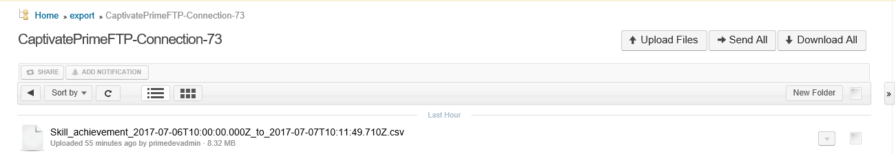
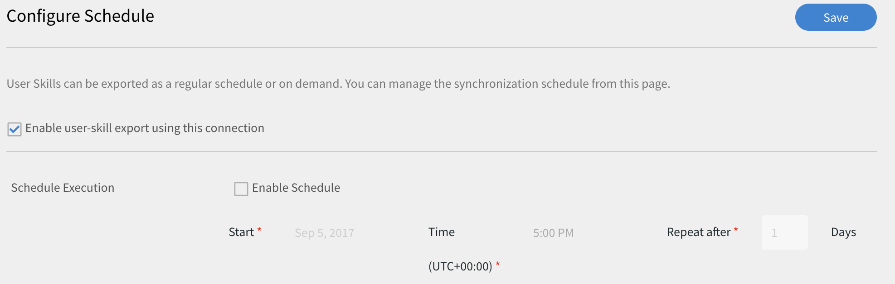
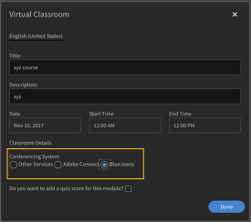

# Learning Manager-Connectors

Anleitung zum Integrieren von Salesforce in Learning Manager über Connectors, Anleitung zum Integrieren von FTP in Learning Manager und automatischen Hochladen von CSV über den FTP-Connector.

Unternehmen verfügen über andere Anwendungen und Systeme, die möglicherweise in Learning Manager integriert werden müssen. Connectors sind Dienstprogramme, die bei der Durchführung datenbasierter Integrationen helfen, z. B. Importieren von Daten in Learning Manager aus externen Systemen oder Exportieren von Daten in externe Systeme aus Learning Manager. In der Version vom Juli 2016 können die Connectors nur Massenimporte von Benutzern aus externen Systemen für Learning Manager durchführen.

Learning Manager bietet Connectors für Salesforce und FTP. Über den Salesforce-Connector können für die Integration zuständige Administratoren eines Unternehmens ihre Salesforce-Anwendung in Learning Manager integrieren. Als Verantwortlicher für die Integration können Sie außerdem mithilfe des FTP-Connectors Gruppen von Benutzern automatisch in Ihre Unternehmensanwendung importieren.

Außerdem bietet Learning Manager Connectors für Lynda, getAbstract und das Harvard Management System, mit deren Hilfe Teilnehmer auf Kurse von Lynda.com, getAbstract und Harvard ManageMentor zugreifen und diese absolvieren können.

Lesen Sie weiter, um zu erfahren, wie Sie diese Connectors in Learning Manager konfigurieren und nutzen können.

## Salesforce-Connector {#sfconnector}

Der Salesforce-Connector stellt eine Verbindung zwischen den Learning Manager- und Salesforce-Konten her, die die Synchronisierung der Daten ermöglicht. Im Salesforce-Connector stehen die folgenden Funktionen zur Verfügung:

### Attribute zuordnen

Der für die Integration zuständige Administrator kann Spalten in Salesforce wählen und den entsprechenden für Gruppen geeigneten Attributen in Learning Manager zuordnen. Dies ist eine einmalige Maßnahme. Sobald diese Zuordnung abgeschlossen ist, wird dieselbe Zuordnung auch für spätere Benutzerimporte verwendet. Falls der Administrator eine andere Zuordnung zum Importieren von Benutzern benötigt, kann diese neu konfiguriert werden.

### Automatischer Benutzerimport

Beim Importieren von Benutzenden hat der Learning Manager-Administrator die Möglichkeit, Mitarbeiterdaten aus Salesforce abzurufen und automatisch in Learning Manager zu importieren. Durch diese Automatisierung entfällt der manuelle Aufwand beim Erstellen und Hochladen von CSV-Dateien in Learning Manager.

### Automatische Zeitplanung

Die automatische Zeitplanung kann zusammen mit dem automatischen Benutzerimport sehr effizient sein. Der Learning Manager-Administrator kann Zeitpläne einrichten, wie sie für das Unternehmen benötigt werden. Benutzer in der Learning Manager-Anwendung können gemäß dem Zeitplan auf dem neuesten Stand gehalten werden. Die Synchronisierung kann täglich in Learning Manager ausgeführt werden.

### Filtern von Benutzern

Der Learning Manager-Administrator kann die Benutzer vor dem Import filtern. Learning Manager-Administratoren können beispielsweise alle Benutzer in der Hierarchie mit einem oder mehreren bestimmten Managern importieren.

## Salesforce-Connector konfigurieren {#configuresalesforceconnector}

In diesem Abschnitt wird die Integration von Learning Manager in Salesforce beschrieben.

### Voraussetzungen {#prerequisites}

Stellen Sie sicher, dass Sie Ihre Salesforce-Unternehmens-URL zur Hand haben. Wenn Ihr Unternehmen beispielsweise **myorg** heißt, könnte die Salesforce-URL [https://myorg.salesforce.com](https://myorg.salesforce.com/) lauten. Dies ist die einzige Eingabe, die für die Verbindung des Salesforce-Kontos mit Learning Manager erforderlich ist.

Stellen Sie außerdem sicher, dass Sie über die richtigen Anmeldedaten für die Anmeldung bei dem Konto verfügen.

## Verbindung erstellen {#createaconnection}

1. Zeigen Sie auf der Startseite von Learning Manager mit der Maus auf das Salesforce-Symbol. Ein Menü wird angezeigt. Wählen Sie im Menü den Eintrag **[!UICONTROL Verbinden]**.

   

1. Ein Dialogfeld wird angezeigt, in dem Sie zur Eingabe der Unternehmens-URL aufgefordert werden. Klicken Sie auf **[!UICONTROL Verbinden]**, nachdem Sie die URL angegeben haben.
1. Nach einer erfolgreichen Verbindung wird die Seite „Übersicht“ angezeigt.

## Attribute zuordnen {#mapattributes}

Sobald die Verbindung erfolgreich hergestellt wurde, können Sie Salesforce-Spalten den entsprechenden Attributen von Learning Manager zuordnen. Dieser Schritt ist obligatorisch.

1. Auf der Zuordnungsseite werden links die Spalten des Learning Managers und rechts die Spalten von Salesforce angezeigt. Wählen Sie den entsprechenden Spaltennamen aus, der dem Spaltennamen des Lern-Managers zugeordnet ist.

   

   Die Spaltendaten des Learning Managers, die auf der linken Seite angezeigt werden, werden von den aktiven Feldern abgerufen. Das Feld **Manager** muss unbedingt einem Feld mit der E-Mail-Adresse zugeordnet werden. Alle Spalten müssen zugeordnet werden, bevor der Connector verwendet werden kann.

1. Klicken Sie auf **[!UICONTROL Speichern]**, nachdem Sie die Zuordnung abgeschlossen haben.
1. Der Connector ist jetzt einsatzbereit. Das Konto, das jetzt konfiguriert wurde, wird als Datenquelle innerhalb der Administrator-App angezeigt, sodass der Administrator den Import planen oder die Synchronisierung nach Bedarf starten kann.

## Verwendung des Salesforce-Connector {#usingsalesforceconnector}

Der Salesforce-Connector stellt eine Verbindung zu Salesforce.com her, um die Benutzenden als konfiguriert abzurufen und sie Learning Manager hinzuzufügen.

## FTP-Connector für Learning Manager {#ftpconnector}

Mithilfe des FTP-Connectors können Sie Learning Manager in beliebige externe Systeme integrieren, um Datensynchronisierung zu automatisieren. Es wird erwartet, dass externe Systeme Daten in einem CSV-Format exportieren und in den entsprechenden Ordner des Learning Manager-FTP-Kontos platzieren können. Im FTP-Connector stehen die folgenden Funktionen zur Verfügung:

Sie können den Box-Connector auch für die Datenmigration, den Benutzerimport und den Datenexport verwenden. Weitere Informationen finden Sie unter [Box-Connector.](third-party-connectors.md#main-pars_header_302653946)

## Datenimport {#dataimport}

Beim Importieren von Benutzenden hat der Learning Manager-Administrator die Möglichkeit, Mitarbeiterdaten aus dem Learning Manager-FTP-Dienst abzurufen und automatisch in Learning Manager zu importieren. Mit dieser Funktion können Sie mehrere Systeme integrieren, indem Sie die CSV, die durch diese Systeme generiert wurden, in die entsprechenden Ordner der FTP-Konten platzieren. Learning Manager ruft die CSV-Dateien ab, führt sie zusammen und importiert die Daten gemäß dem Zeitplan. Weitere Informationen finden Sie unter „Planung“.

**Attribute zuordnen**

Der für die Integration zuständige Administrator kann Spalten in CSV-Dateien wählen und den entsprechenden für Gruppen geeigneten Attributen in Learning Manager zuordnen. Diese Zuordnung ist eine einmalige Maßnahme. Nachdem diese Zuordnung vorgenommen wurde, wird dieselbe Zuordnung auch für spätere Benutzerimporte verwendet. Die Zuordnung kann neu konfiguriert werden, wenn der Administrator eine andere Zuordnung für den Import für Benutzer möchte.

## Daten exportieren {#exportdata}

Durch das Exportieren von Daten können Benutzer Benutzerkenntnisse auf einen FTP exportieren, um diese auf einem beliebigen System von Drittanbietern zu integrieren.

## Planung {#scheduling}

Der Administrator kann Planungsaufgaben einrichten, wie sie für das Unternehmen gewünscht werden. Die Benutzer in der Learning Manager-Anwendung werden anhand der Planung auf dem neuesten Stand gehalten. Ebenso kann der Integrations-Admin den Export für Kenntnisse planen, damit diese in ein externes System integriert werden. Die Synchronisierung kann täglich in Learning Manager ausgeführt werden.

## Konfigurieren des FTP-Connectors für Learning Manager {#configurecaptivateprimeftpconnector}

In diesem Abschnitt wird die Integration von Learning Manager in den FTP-Connector beschrieben.

### Verbindung erstellen {#Createaconnection-1}

1. Zeigen Sie auf der Startseite von Learning Manager mit der Maus auf die FTP-Karte/-Miniaturansicht. Ein Menü wird angezeigt. Wählen Sie im Menü den Eintrag **[!UICONTROL Verbinden]**.

   

1. Ein Dialogfeld wird angezeigt, in dem Sie zur Eingabe der Unternehmens-E-Mail-ID aufgefordert werden. Geben Sie die E-Mail-Adresse der Person an, die für das Verwalten des Learning Manager-FTP-Kontos für das Unternehmen verantwortlich ist. Klicken Sie auf **[!UICONTROL Verbinden]**, nachdem Sie die E-Mail-ID angegeben haben.
1. Learning Manager sendet Ihnen eine E-Mail, in der Sie aufgefordert werden, das Kennwort zurückzusetzen, bevor Sie zum ersten Mal auf FTP zugreifen. Benutzende müssen das Kennwort zurücksetzen und es für den Zugriff auf das Learning Manager-FTP-Konto verwenden.

   Nur ein Learning Manager-FTP-Konto kann für ein bestimmtes Learning Manager-Konto erstellt werden.

   Auf der Übersichtsseite können Sie den Verbindungsnamen für Ihre Integration angeben. Wählen Sie aus, welche Aktion Sie aus den folgenden Optionen erfassen möchten:

   * Importinterne Benutzer
   * Benutzerkenntnisse exportieren - Konfigurieren Sie einen Zeitplan
   * Benutzerkenntnisse exportieren - OnDemand

   

## Importieren

+++Interner Benutzer

Mit der Option zum Importieren von internen Benutzern können Sie die Generierung des Benutzerimportberichts automatisch planen. Die generierten Berichte werden Ihnen als .CSV-Dateien gesendet.

+++

+++Attribute zuordnen

Sobald die Verbindung erfolgreich hergestellt wurde, können Sie die Spalten der CSV-Dateien zuweisen, die in den FTP-Ordner zu den entsprechenden Attributen von Learning Manager platziert werden. Dieser Schritt ist obligatorisch.

1. Auf der Seite &quot;Attributzuordnung&quot; werden links die erwarteten Spalten des Learning Manager und rechts die Namen der Spalten in der CSV-Datei angezeigt. Auf der rechten Seite wird eventuell zunächst ein leeres Auswahlfeld angezeigt. Importieren Sie eine beliebige Vorlagen-CSV, indem Sie auf **Datei auswählen** klicken.
1. Durch den oben beschriebenen Schritt werden alle Spaltennamen aus der CSV-Datei in die Dropdown-Auswahlliste auf der rechten Seite übernommen. Wählen Sie den entsprechenden Spaltennamen aus, der dem Spaltennamen des Lern-Managers zugeordnet ist.

   *Das Manager-Feld muss einem Feld mit einer E-Mail-Adresse zugeordnet werden. Alle Spalten müssen zugeordnet werden, bevor der Connector verwendet werden kann.*

1. Klicken Sie auf **[!UICONTROL Speichern]**, nachdem Sie die Zuordnung abgeschlossen haben.

   Der Connector ist jetzt einsatzbereit. Das gerade konfigurierte Konto wird jetzt als Datenquelle innerhalb des Administrator-App angezeigt, sodass der Administrator den Import planen oder die Synchronisierung nach Bedarf starten kann.

+++

+++Verwenden des FTP-Connectors für Learning Manager

1. Die CSV-Dateien aus externen Systemen sollten unter folgendem Pfad abgelegt werden:

   `code $OPERATION$/$OBJECT_TYPE$/$SUB_OBJECT_TYPE$/data.csv`

   **Hinweis:** In der Version vom Juli 2016 ist nur das Importieren von Benutzern zulässig. Um den FTP-Connector daher verwenden zu können, müssen Sie sicherstellen, dass die CSV-Dateien in den folgenden Ordner platziert werden:

   `code Home/import/user/internal/*.csv`

1. Der FTP-Connector übernimmt alle Zeilen aus CSV-Dateien, daher ist es wichtig, dass die Zeile, die einem Benutzer in einer CSV entspricht, in keiner anderen CSV erscheint.
1. Alle CSV-Dateien sollten die in der Zuordnung angegebenen Spalten enthalten.
1. Alle erforderlichen CSV müssen sich in dem Ordner befinden, bevor der Vorgang beginnt.

Beim Importieren von Benutzenden in Learning Manager muss der Administrator auch wissen, wie Benutzende in Learning Manager verwaltet werden. Weitere Informationen finden Sie in der [Hilfe zur Benutzerverwaltung](../integration-admin/feature-summary/migration-manual.md#usermanagement).

+++

## Exportieren

+++Skills

Es gibt zwei Möglichkeiten, Berichte zu Benutzerkenntnissen zu exportieren.

**[!UICONTROL Benutzerkenntnisse - On Demand]**: Sie können das Startdatum angeben und den Bericht mit der Option exportieren. Der Bericht wird von dem eingegebenen Datum bis zum aktuellen Datum extrahiert.

**[!UICONTROL Benutzerkenntnisse - Konfigurieren]**: Mit dieser Option können Sie die Extrahierung des Berichts planen. Wählen Sie das Kontrollkästchen „Zeitplan aktivieren“ und geben Sie das Startdatum und die Startzeit ein. Sie können das Intervall festlegen, in dem der Bericht generiert und gesendet werden soll.

+++

Um den Exportordner zu öffnen, in dem die exportierten Dateien in Ihrem FTP-Speicherort platziert werden, öffnen Sie den Link zum FTP-Ordner, der auf der Seite &quot;Benutzerkenntnisse&quot; bereitgestellt ist, wie unten gezeigt.

Die automatisch exportierten Dateien befinden sich im Speicherort **Home/export/&#42;FTP_location&#42;**

Die automatisch exportierten Dateien sind mit dem Titel **skill_achievements_&#42;date from &#42;_to_&#42;date to&#42;.csv** verfügbar.

## Lynda-Connector {#lyndaconnector}

Der Lynda-Connector kann von Unternehmenskunden von Lynda.com verwendet werden, die möchten, dass Ihre Teilnehmer Lynda-Kurse innerhalb von Learning Manager entdecken und nutzen. Der Connector kann so konfiguriert werden, dass er regelmäßig Kurse von Lynda.com mit Ihrem API-Schlüssel aufruft. Wenn ein Kurs in Learning Manager erstellt wurde, können Benutzende nach ihm suchen und ihn dann nutzen. Der Teilnehmerfortschritt kann dann in Learning Manager verfolgt werden.

### Konfigurieren des Lynda-Connectors {#configurethelyndaconnector}

1. Klicken Sie im integrierten Admin-Dashboard auf „Lynda“.

   Sie sehen die Kachel mit drei Optionen: Erste Schritte, Verbinden und Verbindungen verwalten.

1. Wenn Sie den Lynda-Connector zum ersten Mal konfigurieren, klicken Sie auf „Verbinden“.

   Sie müssen das ExaVault-FTP-Konto konfigurieren, bevor Sie diesen Connector konfigurieren.

1. Geben Sie auf der Verbindungsseite einen Namen für Ihren Connector ein. Geben Sie den App-Schlüssel und den geheimen Schlüssel für Ihre Verbindung ein.

   Sie müssen sich an Ihren Anbieter wenden, um den App-Schlüssel und den geheimen Schlüssel zu erhalten.

1. Klicken Sie auf „Speichern“.

   Die Konfiguration wird gespeichert und die Lynda-Verbindung für Ihr Konto wurde hinzugefügt. Sie können jetzt auf der Startseite auf &quot;Verbindungen verwalten&quot; klicken und Ihre Konfiguration jederzeit bearbeiten.

1. Wenn Sie bereits über eine Verbindung verfügen, klicken Sie auf „Verbindungen verwalten“, um alle Ihre Verbindungen anzuzeigen.

   Die Migrationsfunktion muss für Ihr Konto aktiviert werden, bevor Sie diesen Connector konfigurieren.

1. Klicken Sie auf die Verbindung, die Sie bearbeiten möchten.
1. Klicken Sie im linken Teilfenster auf &quot;Konfigurieren&quot;. Führen Sie einen der folgenden Schritte aus:

   * Über dieses Fenster können Sie die Details Ihres Kontos sowie den Synchronisierungszeitplan anzeigen oder bearbeiten. Zum Aktivieren dieses Kontos müssen Sie das Kontrollkästchen „Verbindung aktivieren“ aktivieren.
   * Klicken Sie auf „Bearbeiten“ und bearbeiten Sie Ihre Anmeldedaten. Klicken Sie auf „Zurücksetzen“, um Ihre Änderungen an diesem Feld rückgängig zu machen.
   * Klicken Sie „Plan aktivieren“, um die Synchronisierung zu planen. Sie können Startzeit und -datum eingeben und anschließend die Häufigkeit der Synchronisierung in Tagen festlegen, um beispielsweise eine Synchronisierung alle 3 Tage aktivieren.

   Klicken Sie auf „Speichern“, um Ihre Änderungen zu speichern.

   

1. Klicken Sie im linken Teilfenster auf „On-Demand-Ausführung“. Mithilfe dieser Option können Sie Benutzer-Feeds und andere relevante Daten aus Lynda importieren. Geben Sie das Startdatum für die On-Demand-Ausführung ein und klicken Sie auf „Ausführen“, um die Synchronisierung auszuführen. Alle Daten seit dem Startdatum werden importiert.

   * Sie können auf „Zugriff auf Learning Manager während der Ausführung deaktivieren“ klicken, um die Anwendung während der Synchronisierung auszusetzen.
   * Wenn Sie auf „Zugriff auf Learning Manager während der Ausführung aktivieren“ klicken, wird der Dienst während der Synchronisierung nicht unterbrochen.

   

1. Außerdem können Sie jederzeit im linken Teilfenster auf „Ausführungsstatus“ klicken, um eine Zusammenfassung aller Ausführungen für diesen Connector in chronologischer Reihenfolge anzuzeigen. Sie können das Startdatum und die Dauer der Synchronisierung anzeigen sowie die Art (ob es sich um eine On-Demand-Synchronisierung handelt) und den Status (ob die Synchronisierung läuft oder abgeschlossen ist) der Synchronisierung.

   Wenn Sie eine Verbindung löschen und neu erstellen, werden die vorherigen Ausführungen für den Connector wieder angezeigt. Sie können alle vor dem Löschen der Verbindung erfolgten Ausführungen anzeigen.

   Eine Wiederholung ist nur für die letzte Synchronisierung möglich.

   

## getAbstract-Connector {#getabstractconnector}

Der getAbstract-Connector kann von Unternehmen von getAbstract.com verwendet werden, die möchten, dass ihre Teilnehmer getAbstract-Kurse entdecken und nutzen. Der Connector kann so konfiguriert werden, dass er regelmäßig Nutzungsdaten aufruft, je nachdem welche Teilnehmerabschlussdatensätze in Learning Manager erstellt werden. Lesen Sie weiter, um zu erfahren, wie dieser Connector in Learning Manager konfiguriert werden kann.

### getAbstract-Connector konfigurieren {#configurethegetabstractconnector}

1. Klicken Sie im integrierten Admin-Dashboard auf „getAbstract“.

   Sie sehen die Kachel mit drei Optionen: Erste Schritte, Verbinden und Verbindungen verwalten.

1. Wenn Sie den getAbstract-Connector zum ersten Mal konfigurieren, klicken Sie auf „Verbinden“.

   Sie müssen das ExaVault-FTP-Konto konfigurieren, bevor Sie diesen Connector konfigurieren.

   Diese FTP-Anmeldedaten müssen Sie für Ihren Inhaltsanbieter freigeben, um auf die Feeds zugreifen zu können.

1. Geben Sie einen Namen für die Verbindung im Feld „Verbindungsname“ ein.

   Geben Sie die entsprechenden Schlüssel in die Felder „Client-ID“ und in „Client-Secret“ ein. Möglicherweise müssen Sie an den Hersteller wenden, um die entsprechenden Schlüssel für diesen Connector zu erhalten.

   Diese Schlüssel sind erforderlich, um die Kurs-Metadaten für die vom Client genutzten Kurse abzurufen.

1. Wenn Sie bereits über eine Verbindung verfügen, klicken Sie auf der Startseite auf „getAbstract“ > „Verbindungen verwalten“, um Ihre vorhandene Konfiguration anzuzeigen und zu bearbeiten.

   Die Migrationsfunktion muss für Ihr Konto aktiviert werden, bevor Sie diesen Connector konfigurieren.

1. Klicken Sie auf die Verbindung, deren Konfiguration Sie anzeigen oder bearbeiten möchten.

   

1. Klicken Sie im linken Teilfenster auf &quot;Konfigurieren&quot;. Führen Sie einen der folgenden Schritte aus:

   * Über dieses Fenster können Sie die Details Ihres Kontos sowie den Synchronisierungszeitplan anzeigen oder bearbeiten. Zum Aktivieren dieses Kontos müssen Sie das Kontrollkästchen „Verbindung aktivieren“ aktivieren.
   * Klicken Sie auf „Bearbeiten“ und bearbeiten Sie Ihre Anmeldedaten. Klicken Sie auf „Zurücksetzen“, um Ihre Änderungen an diesem Feld rückgängig zu machen.
   * Klicken Sie „Plan aktivieren“, um die Synchronisierung zu planen. Sie können Startzeit und -datum eingeben und anschließend die Häufigkeit der Synchronisierung in Tagen festlegen, um beispielsweise eine Synchronisierung alle 3 Tage aktivieren.

1. Klicken Sie auf „Speichern“.

   Die Konfiguration wird gespeichert und die getAbstract-Verbindung für Ihr Konto wird hinzugefügt.

1. Klicken Sie im linken Teilfenster auf „On-Demand-Ausführung“. Mithilfe dieser Option können Sie Benutzer-Feeds und andere relevante Daten aus getAbstract importieren. Geben Sie das Startdatum für die On-Demand-Ausführung ein und klicken Sie auf „Ausführen“, um die Synchronisierung auszuführen. Alle Daten seit dem Startdatum werden importiert.

   * Sie können auf „Zugriff auf Learning Manager während der Ausführung deaktivieren“ klicken, um die Anwendung während der Synchronisierung auszusetzen.
   * Wenn Sie auf „Zugriff auf Learning Manager während der Ausführung aktivieren“ klicken, wird der Dienst während der Synchronisierung nicht unterbrochen.

1. Außerdem können Sie jederzeit im linken Teilfenster auf „Ausführungsstatus“ klicken, um eine Zusammenfassung aller Ausführungen für diesen Connector in chronologischer Reihenfolge anzuzeigen. Sie können das Startdatum und die Dauer der Synchronisierung anzeigen sowie die Art (ob es sich um eine On-Demand-Synchronisierung handelt) und den Status (ob die Synchronisierung läuft oder abgeschlossen ist) der Synchronisierung.

   Wenn Sie eine Verbindung löschen und neu erstellen, werden die vorherigen Ausführungen für den Connector wieder angezeigt. Sie können alle vor dem Löschen der Verbindung erfolgten Ausführungen anzeigen.

   Eine Wiederholung ist nur für die letzte Synchronisierung möglich.

   Für jede Art von Synchronisierung gilt: Damit sie funktioniert, muss der Benutzer-Feed für die in der Synchronisierung angegebenen Daten im FTP-Ordner für getAbstract FTP vorhanden sein.

   Das folgende Excel-Arbeitsblatt ist ein Beispiel für einen Benutzer-Feed aus getAbstract. Der Dateiname muss dem folgenden Format entsprechen:**&#x200B; report_export_yyyy_MM_dd_HHmmss.xlsx** oder **report_export_yyyy_MM_dd.xlsx**.
   Excel-Beispiel für [getAbstract-Benutzer-Feed ](assets/report-export-20170401175342.xlsx)

## Harvard ManageMentor-Connector {#hmmconnector}

Der Harvard ManageMentor-Connector kann von Unternehmen von Harvard ManageMentor verwendet werden, die möchten, dass ihre Teilnehmer Harvard ManageMentor-Kurse entdecken und nutzen. Mit dem Connector können Sie Kurse in Learning Manager erstellen, und sie können dazu konfiguriert werden, regelmäßig Daten zum Teilnehmerfortschritt abzurufen. Um diesen Connector sich zu konfigurieren, müssen Sie folgende Schritte durchführen:

### Harvard ManageMentor-Connector konfigurieren {#configuretheharvardmanagermentorconnector}

1. Klicken Sie im integrierten Admin-Dashboard auf „Harvard ManageMentor“.

   Sie sehen die Kachel mit drei Optionen: Erste Schritte, Verbinden und Verbindungen verwalten.

1. Wenn Sie den Harvard ManageMentor-Connector zum ersten Mal konfigurieren, klicken Sie auf „Verbinden“.

   Sie müssen auch das ExaVault-FTP-Konto konfigurieren, bevor Sie diesen Connector konfigurieren.

   Diese FTP-Anmeldedaten müssen Sie für Ihren Inhaltsanbieter freigeben, um auf die Feeds zugreifen zu können.

1. Geben Sie einen Namen für die Verbindung im Feld „Verbindungsname“ ein. Klicken Sie auf „Verbinden“, um diese Verbindung zu speichern.
1. Wenn Sie bereits über eine Verbindung verfügen, klicken Sie auf der Startseite auf „Harvard ManageMentor“ > „Verbindungen verwalten“. Klicken Sie auf die Verbindung, die Sie bearbeiten möchten, um die vorhandene Konfiguration zu bearbeiten.

   Die Migrationsfunktion muss für Ihr Konto aktiviert werden, bevor Sie diesen Connector konfigurieren.

   

1. Klicken Sie im linken Teilfenster auf &quot;Konfigurieren&quot;. Führen Sie einen der folgenden Schritte aus:

   * Über dieses Fenster können Sie die Details Ihres Kontos sowie den Synchronisierungszeitplan anzeigen oder bearbeiten. Zum Aktivieren dieses Kontos müssen Sie das Kontrollkästchen „Verbindung aktivieren“ aktivieren.
   * Klicken Sie „Plan aktivieren“, um die Synchronisierung zu planen. Sie können Startzeit und -datum eingeben und anschließend die Häufigkeit der Synchronisierung in Tagen festlegen, um beispielsweise eine Synchronisierung alle 3 Tage aktivieren.

1. Klicken Sie im linken Teilfenster auf „On-Demand-Ausführung“. Mithilfe dieser Option können Sie Benutzer-Feeds und andere relevante Daten aus Harvard ManageMentor importieren. Geben Sie das Startdatum für die On-Demand-Ausführung ein und klicken Sie auf „Ausführen“, um die Synchronisierung auszuführen. Für diese Verbindung werden alle Daten seit dem Startdatum importiert.

   * Sie können auf „Zugriff auf Learning Manager während der Ausführung deaktivieren“ klicken, um die Anwendung während der Synchronisierung auszusetzen.
   * Wenn Sie auf „Zugriff auf Learning Manager während der Ausführung aktivieren“ klicken, wird der Dienst während der Synchronisierung nicht unterbrochen.

   Wenn Sie die Synchronisierung alle paar Tage automatisieren möchten, geben Sie die Anzahl der Tage in das Feld „Anzahl der Tage wiederholen“ ein. Durch die Synchronisierung wird gewährleistet, dass Ihr Konto mit der aktuellen Version der Abstrakte und Übersichten von Harvard ManageMentor aktualisiert wird.

1. Außerdem können Sie jederzeit im linken Teilfenster auf „Ausführungsstatus“ klicken, um eine Zusammenfassung aller Ausführungen für diesen Connector in chronologischer Reihenfolge anzuzeigen. Sie können das Startdatum und die Dauer der Synchronisierung anzeigen sowie die Art (ob es sich um eine On-Demand-Synchronisierung handelt) und den Status (ob die Synchronisierung läuft oder abgeschlossen ist) der Synchronisierung.

   Wenn Sie eine Verbindung löschen und neu erstellen, werden die vorherigen Ausführungen für den Connector wieder angezeigt. Sie können alle vor dem Löschen der Verbindung erfolgten Ausführungen anzeigen.

   Eine Wiederholung ist nur für die letzte Synchronisierung möglich.

   Damit die Synchronisierung erfolgreich ausgeführt werden kann, muss mindestens eine der folgenden Dateien im FTP-Ordner für Harvard ManageMentor vorhanden sein:

   hmm12_metadata.xlsx: Diese Datei enthält die Kurs-Metadaten für den Harvard ManageMentor-Connector. Achten Sie darauf, beim Hochladen der Datei die Namenskonvention zu befolgen.

   client_hmm12_20150125.xlsx: Dies ist der Benutzer-Feed für den Harvard ManageMentor-Connector. Die zu befolgende Dateinamenskonvention lautet **client_hmm12_jjjjMMtt.xlsx.**

   Die beiden folgenden Beispieldateien zeigen einen Benutzer-Feed und einen Kurs-Feed für diesen Connector:
   [Kurs-Metadatendatei für den Harvard ManageMentor-Connector](assets/hmm12-metadata.xlsx) [Benutzer-Feed für den Harvard ManageMentor-Connector](assets/client-hmm12-20170304.xlsx)

## Workday Connector {#workdayconnector}

Mithilfe des Workday-Connectors können Sie Learning Manager in den Workday-Mandanten integrieren, um die Datensynchronisierung zu automatisieren.

### Importieren

#### Attribute zuordnen

Der für die Integration zuständige Administrator kann Spalten in Workday auswählen und den entsprechenden für Gruppen geeigneten Attributen des Lern-Managers zuordnen. Dies ist eine einmalige Aktion. Sobald diese Zuordnung abgeschlossen ist, wird dieselbe Zuordnung auch für spätere Benutzerimporte verwendet. Falls der Administrator eine andere Zuordnung zum Importieren von Benutzern benötigt, kann diese neu konfiguriert werden.

#### Automatischer Benutzerimport

Beim Importieren von Benutzenden hat der Learning Manager-Administrator die Möglichkeit, Mitarbeiterdaten aus Workday abzurufen und automatisch in Learning Manager zu importieren.

#### Filtern von Benutzern

Der Learning Manager-Administrator kann die Benutzer vor dem Import filtern. Learning Manager-Administratoren können beispielsweise alle Benutzer in der Hierarchie mit einem oder mehreren bestimmten Managern importieren.

## Exportieren

Mit dem Export für die Benutzerkenntnisse können Benutzer Kenntnisse in Workday automatisch exportieren.

Kenntnisse von mehreren Learning Manager-Konten können nicht gleichzeitig mit demselben Workday-Konto exportiert werden.

## Planung {#Scheduling-1}

Der Administrator kann Planungsaufgaben einrichten, wie sie für das Unternehmen gewünscht werden. Die Benutzer in der Learning Manager-Anwendung werden anhand der Planung auf dem neuesten Stand gehalten. Ebenso kann der Integrations-Admin den Export für Kenntnisse planen, damit diese in ein externes System integriert werden. Die Synchronisierung kann täglich in Learning Manager ausgeführt werden.

## Workday Connector konfigurieren {#configureworkdayconnector}

**Voraussetzung:** Bitten Sie den Wordkday-Administrator Ihres Unternehmens, einen Integration System User (ISU) mit der Berechtigung zu erstellen, die im ISU_Permissions-Dokument definiert ist. Laden Sie eine Kopie über den unten stehenden Link herunter.
[Laden Sie eine Kopie der Sicherheit des Integration System User (ISU) herunter.](assets/isu-permissions-v1.pdf) Erfahren Sie, wie Sie Learning Manager mit dem Workday-Connector integrieren.

1. Bewegen Sie den Mauszeiger auf der Startseite des Learning Manager über die Kachel Workday. Ein Menü wird angezeigt. Wählen Sie im Menü den Eintrag **[!UICONTROL Verbinden]**.

   

1. Ein Dialogfeld wird angezeigt. Geben Sie die Anmeldeinformationen für die neue Verbindung ein. Nachstehend Felder müssen ausgefüllt werden, bevor Sie die Verbindung herstellen können.

   * Verbindungsname: Geben Sie einen Verbindungsnamen Ihrer Wahl an.
   * Host-URL: Integrationsadministrator kann die Host URL-Details vom entsprechenden Workday-Admin erhalten.
   * Mandant: Der Mandant ist für Ihr Unternehmen intern. Ihr Workday-Admin stellt Ihnen die Tenant-Details bereit.
   * Benutzername und Kennwort: Der Workday-Administrator erstellt einen integrierten Systembenutzer (ISU) mit den erforderlichen Sicherheitsberechtigungen und teilt diese dann mit dem Integrationsadministrator.

   Hinweis: Für Learning Manager wird Version 28.1 der Workday-API verwendet.

   

1. Klicken Sie auf „Verbinden“, nachdem Sie diese Daten in allen entsprechenden Feldern eingegeben haben.

   Sie können auch mehrere Workday-Verbindungen haben, die mit Ihrem Learning Manager-Konto synchronisiert sind.

Auf der Übersichtsseite können Sie den Verbindungsnamen für Ihre Integration angeben. Wählen Sie aus, welche Aktion Sie aus den folgenden Optionen erfassen möchten:

* Importinterne Benutzer
* Benutzerkenntnisse exportieren - Konfigurieren Sie einen Zeitplan
* Benutzerkenntnisse exportieren - OnDemand

## Importieren

### Attribute zuordnen {#MapAttributes-1}

Sie können den Workday-Connector verwenden, um Learning Manager und Wordkday zu integrieren, sodass die Datensynchronisierung automatisiert wird. Sie können alle aktiven Benutzer aus Workday in Learning Manager importieren. Benutzer können aus verschiedenen Datenquellen einschließlich FTP und Salesforce importiert werden.

Die Benutzerattribute von Learning Manager und Workday müssen zugeordnet werden, bevor Benutzende importiert werden. Verwenden Sie auf der Übersichtsseite verwenden Sie die interne Benutzeroption unter „Importieren“, um die Zuordnungsattribute bereitzustellen.

Geben Sie die Anmeldeinformationen für Adobe-Learning-Manager in der Spalte &quot;Adobe-Learning-Manager&quot; ein. Verwenden Sie die Dropdown-Menüs, um die korrekten Anmeldedaten für die Spalten unter Workday auszuwählen.

Derzeit unterstützt Learning Manager den Import von 44 Benutzerattributen von Workday. Fügen Sie weitere Attribute über aktive Felder in Learning Manager hinzu.

Workday verfügt über vier Hierarchiestufen, während der Lern-Manager über zwei Ebenen verfügt. Die vier Ebenen in Workday sind Kenntnisprofilkategorie, Kenntnisprofil, Kenntniselementkategorie und Kenntniselement. Ihr Kenntnisname und Ihre Stufe vom Lernmanager zusammen werden in Workday unter dem Kenntniselement zugeordnet.

+++Liste der unterstützten Workday-Attribute

wd:User_ID\
wd:Worker_ID\
wd:Personal_Data.wd:Name_Data.wd:Preferred_Name_Data.wd:Name_Detail_Data.@wd:Formatted_Name\
wd:Personal_Data.wd:Name_Data.wd:Legal_Name_Data.wd:Name_Detail_Data.@wd:Formatted_Name\
wd:Personal_Data.wd:Name_Data.wd:Legal_Name_Data.wd:Name_Detail_Data.wd:Prefix_Data.wd:Title_Descriptor\
wd:Personal_Data.wd:Name_Data.wd:Preferred_Name_Data.wd:Name_Detail_Data.wd:Prefix_Data.wd:Title_Descriptor\
wd:Personal_Data.wd:Name_Data.wd:Preferred_Name_Data.wd:Name_Detail_Data.wd:First_Name\
wd:Personal_Data.wd:Name_Data.wd:Preferred_Name_Data.wd:Name_Detail_Data.wd:Last_Name\
wd:Personal_Data.wd:Name_Data.wd:Legal_Name_Data.wd:Name_Detail_Data.wd:First_Name\
wd:Personal_Data.wd:Name_Data.wd:Legal_Name_Data.wd:Name_Detail_Data.wd:Last_Name\
wd:Personal_Data.wd:Contact_Data.wd:Address_Data.0.@wd:Formatted_Address\
wd:Personal_Data.wd:Contact_Data.wd:Address_Data.0.wd:Postal_Code\
wd:Personal_Data.wd:Contact_Data.wd:Address_Data.0.wd:Country_Region_Descriptor\
wd:Personal_Data.wd:Contact_Data.wd:Phone_Data.0.@wd:formatted_phone\
wd:Personal_Data.wd:Contact_Data.wd:Phone_Data.0.wd:Country_ISO_Code\
wd:Personal_Data.wd:Contact_Data.wd:Phone_Data.0.wd:International_Phone_Code\
wd:Personal_Data.wd:Contact_Data.wd:Phone_Data.0.wd:Phone_Number\
wd:Personal_Data.wd:Primary_Nationality_Reference.wd:ID.1.$\
wd:Personal_Data.wd:Gender_Reference.wd:ID.1.$\
wd:Personal_Data.wd:Identification_Data.wd:National_ID.0.wd:National_ID_Data.wd:ID\
wd:Personal_Data.wd:Identification_Data.wd:Custom_ID.0.wd:Custom_ID_Data.wd:ID\
wd:User_Account_Data.wd:Default_Display_Language_Reference.wd:ID.1.$\
wd:Role_Data.wd:Organization_Role_Data.wd:Organization_Role.0.wd:Organization_Role_Reference.wd:ID.1.$\
wd:Employment_Data.wd:Worker_Job_Data.0.wd:Position_Data.wd:Position_Title\
wd:Employment_Data.wd:Worker_Job_Data.0.wd:Position_Data.wd:Business_Title\
wd:Employment_Data.wd:Worker_Job_Data.0.wd:Position_Data.wd:Business_Site_Summary_Data.wd:Name\
wd:Employment_Data.wd:Worker_Job_Data.0.wd:Position_Data.wd:Business_Site_Summary_Data.wd:Address_Data.@wd:Formatted_Address\
wd:Employment_Data.wd:Worker_Job_Data.0.wd:Position_Data.wd:Job_Classification_Summary_Data.0.wd:Job_Classification_Reference.wd:ID.1.$\
wd:Employment_Data.wd:Worker_Job_Data.0.wd:Position_Data.wd:Job_Classification_Summary_Data.0.wd:Job_Group_Reference.wd:ID.1.$\
wd:Employment_Data.wd:Worker_Job_Data.0.wd:Position_Data.wd:Work_Space__Reference.wd:ID.1.$\
wd:Employment_Data.wd:Worker_Status_Data.wd:Active\
wd:Employment_Data.wd:Worker_Status_Data.wd:Active_Status_Date\
wd:Employment_Data.wd:Worker_Status_Data.wd:Hire_Date\
wd:Employment_Data.wd:Worker_Status_Data.wd:Original_Hire_Date\
wd:Employment_Data.wd:Worker_Status_Data.wd:Retired\
wd:Employment_Data.wd:Worker_Status_Data.wd:Retirement_Date\
wd:Employment_Data.wd:Worker_Status_Data.wd:Beendet\
wd:Employment_Data.wd:Worker_Status_Data.wd:Termination_Date\
wd:Employment_Data.wd:Worker_Status_Data.wd:Termination_Last_Day_of_Work\
wd:Organization_Data.wd:Worker_Organization_Data.0.wd:Organization_Data.wd:Organization_Code\
wd:Organization_Data.wd:Worker_Organization_Data.0.wd:Organization_Data.wd:Organization_Name\
wd:Organization_Data.wd:Worker_Organization_Data.0.wd:Organization_Data.wd:Organization_Type_Reference.wd:ID.1.$\
wd:Organization_Data.wd:Worker_Organization_Data.0.wd:Organization_Data.wd:Organization_Subtype_Reference.wd:ID.1.$\
wd:Qualification_Data.wd:Education.0.wd:School_Name\
wd:Qualification_Data.wd:External_Job_History.0.wd:Job_History_Data.wd:Job_Title\
wd:Qualification_Data.wd:External_Job_History.0.wd:Job_History_Data.wd:Company\
wd:Management_Chain_Data.wd:Worker_Supervisory_Management_Chain_Data.wd:Management_Chain_Data.0.wd:Manager.Employee_ID

+++

## Exportieren

Sie können alle Kenntnisse exportieren, die von einem Learning Manager-Benutzer in Workday erreicht wurden. Beachten Sie, dass nur alle aktiven Benutzerkenntnisse exportiert werden. Learning Manager exportiert keine veralteten Kenntnisse. Sie können auch mehrere Learning Manager-Konten mit demselben Workday Connector verbinden. Wenn die Namen der Kenntnisse in zwei Learning Manager-Konten identisch sind, werden sie denselben Kenntnissen in Workday zugeordnet. Es ist ratsam, die Namen von Kenntnissen in allen Learning Manager-Konten zu aktualisieren, bevor Sie die Kenntnisse in Workday aktualisieren, falls zwei Learning Manager-Konten dasselbe Workday-Konto verwenden.

+++Benutzerkenntnisse - Konfigurieren

Mit dieser Option können Sie die Extrahierung des Berichts planen. Stellen Sie sicher, dass „Export für die Benutzerkenntnisse aktivieren“ mit diesem Verbindungskontrollkästchen aktiviert ist. Wählen Sie das Kontrollkästchen „Zeitplan aktivieren“ und geben Sie das Startdatum und die Startzeit ein. Sie können das Intervall festlegen, in dem der Bericht generiert und gesendet werden soll. Wählen Sie die Option „Zeitplan aktivieren“ und geben Sie das Startdatum, die Uhrzeit und die Wiederholung nach n Tagen ein. Wenn Sie fertig sind, klicken Sie auf „Speichern“.

+++

+++Benutzerkenntnisse - On Demand

Sie können das Startdatum angeben und den Bericht mithilfe der Option exportieren. Der Bericht wird vom eingegebenen Datum bis zum aktuellen Tag extrahiert. Geben Sie das Datum ein, von dem Sie mit der Generierung des Berichts beginnen möchten, und klicken Sie auf „Ausführen“.

+++

+++Benutzerkenntnisse - Ausführungsstatus

Hier können Sie die Zusammenfassung aller Aufgaben anzeigen und ihren Statusbericht abrufen. Sie können Fehlermeldungen herunterladen, indem Sie auf den Link zu den Fehlermeldungen klicken.

+++

## miniOrange Connector {#miniorangeconnector}

Mithilfe des miniOrange-Connectors können Sie Learning Manager in den miniOrange-Mandanten integrieren, um die Datensynchronisierung zu automatisieren.

### Importieren

#### Attribute zuordnen

Der für die Integration zuständige Administrator kann miniOrange-Attribute auswählen und den entsprechenden für Gruppen geeigneten Attributen des Learning Managers zuordnen. Dies ist eine einmalige Aktion. Sobald diese Zuordnung abgeschlossen ist, wird dieselbe Zuordnung auch für spätere Benutzerimporte verwendet. Falls der Administrator eine andere Zuordnung zum Importieren von Benutzern benötigt, kann diese neu konfiguriert werden.

#### Automatischer Benutzerimport

Beim Importieren von Benutzern hat der Learning Manager-Administrator die Möglichkeit, Mitarbeiterdaten aus miniOrange abzurufen und automatisch in Learning Manager zu importieren.

#### Filtern von Benutzern

Der Learning Manager-Administrator kann die Benutzer vor dem Import filtern. Learning Manager-Administratoren können beispielsweise alle Benutzer in der Hierarchie mit einem oder mehreren bestimmten Managern importieren.

So richten Sie   miniOrange   Connector einzurichten, wenden Sie sich an das Learning Manager CSM-Team.

## miniOrange Connector konfigurieren {#configureminiorangeconnector}

1. Bewegen Sie die Maus auf der Startseite des Lernmanagers über die miniOrange-Karte/das Miniaturbild. Ein Menü wird angezeigt. Klicken Sie im Menü auf die Option **[!UICONTROL Verbinden]**.

   

1. Klicken Sie auf „Verbinden“, um eine neue Verbindung herzustellen. Die miniOrange Connector-Seite wird angezeigt. Geben Sie die Details Ihres Kontos ein, das Sie zuordnen möchten.

   

1. Wenn Sie miniOrnage-Benutzer direkt als internen Learning Manager-Benutzer importieren möchten, verwenden Sie die Option **[!UICONTROL Interne Benutzer importieren]**.

   

1. Auf der Zuordnungsseite links   auf der Seite können Sie die Spalten des Learning Managers sehen und rechts   Seite können Sie die miniOrnage Spalten sehen. Wählen Sie den entsprechenden Spaltennamen aus, der dem Spaltennamen des Lern-Managers zugeordnet ist.

   

1. Klicken Sie zum Anzeigen und Bearbeiten der Datenquelle als Administrator auf **[!UICONTROL Einstellungen > Datenquelle.]**

   Die etablierte miniOrange Quelle wird aufgelistet. Wenn Sie den Filter bearbeiten müssen, klicken Sie auf **[!UICONTROL Bearbeiten]**.

   

1. Nach Abschluss des Imports erhalten Sie eine Benachrichtigung. Klicken Sie zum Anzeigen oder Bearbeiten des Importprotokolls auf **[!UICONTROL Benutzer> Protokoll importieren.]**

### Verbindung löschen {#deleteaconnection}

Führen Sie die folgenden Schritte aus, um eine bestehende miniOrange-Verbindung zu löschen.

## BlueJeans Connector {#bluejeansconnector}

Sie können jetzt Learning Manager mit dem BlueJeans-Connector integrieren und BlueJeans zum Veranstalten von Klassen verwenden. Mit BlueJeans können Sie Audio- und Videokonferenzanrufe, Videochats und Webinare starten.

Befolgen Sie diese Schritte, um den Connector einzurichten und zu verwenden.

1. Bewegen Sie die Maus auf der Startseite des Lernmanagers über die BlueJeans-Karte/das Miniaturbild. Ein Menü wird angezeigt. Klicken Sie im Menü auf die Option **[!UICONTROL Verbinden]**.

   

1. Die BlueJeans-Connector-Seite wird geöffnet. Geben Sie die Details Ihres Kontos in die entsprechenden Felder ein, um Learning Manager und BlueJeans zur Synchronisierung des Benutzer-Feeds zu integrieren. Sie können die Details vom Administrator Ihres BlueJeans-Kontos erhalten.

   

   Als Teilnehmer verwenden Sie beim Aktivieren des Connectors dieselbe E-Mail-ID, die für Ihr Learning Manager-Konto verwendet wird, um Benutzer-Feeds in Learning Manager zu aktivieren.

1. Sobald die Verbindung hergestellt ist, erstellen Sie als Autor einen VC-Kurs mit BlueJeans als Konferenzsystem.

   

1. Administratoren, Manager und Teilnehmer können Teilnehmer für den erstellten Kurs registrieren. Nach der Registrierung erhält der Teilnehmer eine E-Mail. Die Teilnehmenden können sich bei ihrem Learning Manager-Konto anmelden, um die Programmdetails anzuzeigen und den Kurs zu belegen.
1. Wenn der Kurs abgeschlossen ist, wird der Abschlussbericht an Learning Manager gesendet. Der Administrator kann den Abschlussbericht anzeigen, um die Anwesenheit und die Punktzahl der Teilnehmer zu überprüfen.

   

## Box-Connector {#boxconnector}

Mithilfe des Box-Connectors können Sie Learning Manager in beliebige externe Systeme integrieren, um Datensynchronisierung zu automatisieren. Es wird erwartet, dass externe Systeme Daten in einem CSV-Format exportieren können und sie in den entsprechenden Ordner des Learning Manager Box-Kontos zu platzieren. Der Box-Connector bietet folgende Funktionen:

Sie können den FTP-Connector auch für die Datenmigration, den Benutzerimport und den Datenexport verwenden. Weitere Informationen: [FTP-Connector für Learning Manager](third-party-connectors.md#main-pars_header_1427405935).

## Datenimport {#DataImport-1}

Beim Importieren von Benutzenden hat der Learning Manager-Administrator die Möglichkeit, Mitarbeiterdaten aus dem Learning Manager-Box-Dienst abzurufen und automatisch in Learning Manager zu importieren. Mit dieser Funktion können Sie mehrere Systeme integrieren, indem Sie die CSV, die durch diese Systeme generiert wurden, in die entsprechenden Ordner der Box-Konten platzieren. Learning Manager ruft die CSV-Dateien ab, führt sie zusammen und importiert die Daten gemäß dem Zeitplan. Weitere Informationen finden Sie unter „Planung“.

**Attribute zuordnen**

Der für die Integration zuständige Administrator kann Spalten in CSV-Dateien wählen und den entsprechenden für Gruppen geeigneten Attributen in Learning Manager zuordnen. Diese Zuordnung ist eine einmalige Maßnahme. Nachdem diese Zuordnung vorgenommen wurde, wird dieselbe Zuordnung auch für spätere Benutzerimporte verwendet. Die Zuordnung kann neu konfiguriert werden, wenn der Administrator eine andere Zuordnung für den Import für Benutzer möchte.

## Datenexport {#dataexport}

Mit dem Datenexport können Benutzer Benutzerkenntnisse zur Integration in ein beliebiges Drittanbietersystem zu einem Box-Speicherort exportieren.

## Berichte planen {#schedulereports}

Der Administrator kann Planungsaufgaben einrichten, wie sie für das Unternehmen gewünscht werden. Die Benutzer in der Learning Manager-Anwendung werden anhand der Planung auf dem neuesten Stand gehalten. Ebenso kann der Integrations-Admin den Export für Kenntnisse planen, damit diese in ein externes System integriert werden. Die Synchronisierung kann täglich in Learning Manager ausgeführt werden.

## Box-Connector konfigurieren {#configureboxconnector}

In diesem Abschnitt wird die Integration von Learning Manager in den Box-Connector beschrieben.

1. Bewegen Sie die Maus auf der Startseite des Learning Manager über die Box-Karte/Miniaturansicht. Ein Menü wird angezeigt. Klicken Sie auf das Element Verbinden in dem Menü.

   

1. Ein Dialogfeld wird angezeigt, in dem Sie zur Eingabe der Unternehmens-E-Mail-ID aufgefordert werden. Geben Sie die E-Mail-Adresse der Person an, die für das Verwalten des Learning Manager Box-Kontos für das Unternehmen verantwortlich ist. Geben Sie die E-Mail-ID ein und klicken Sie auf Verbinden .

1. Learning Manager sendet Ihnen eine E-Mail, in der Sie aufgefordert werden, das Kennwort zurückzusetzen, bevor Sie zum ersten Mal auf Box zugreifen. Der Benutzer muss das Kennwort zurücksetzen und dieses für den Zugriff auf das Learning Manager-Box-Konto verwenden.

   Nur ein Learning Manager-Box-Konto kann für ein bestimmtes Learning Manager-Konto erstellt werden.

   Auf der Übersichtsseite können Sie den Verbindungsnamen für Ihre Integration angeben. Wählen Sie aus, welche Aktion Sie aus den folgenden Optionen erfassen möchten:

   * Importinterne Benutzer
   * Benutzerkenntnisse exportieren - Konfigurieren Sie einen Zeitplan
   * Benutzerkenntnisse exportieren - OnDemand

## Importieren

+++Interner Benutzer

Mit der Option zum Importieren von internen Benutzern können Sie die Generierung des Benutzerimportberichts automatisch planen. Die generierten Berichte werden Ihnen als .CSV-Dateien gesendet.

+++

+++Attribute zuordnen

Sobald eine Verbindung erfolgreich hergestellt wurde, können Sie die Spalten der CSV-Dateien zuordnen, die im Box-Ordner den entsprechenden Attributen des Lern-Managers platziert werden. Dieser Schritt ist obligatorisch.

1. Auf der Seite &quot;Attribute zuordnen&quot; links   auf der Seite können Sie die erwarteten Spalten des Learning Managers sehen und rechts   können Sie die CSV-Spaltennamen sehen. Auf der rechten Seite wird eventuell zunächst ein leeres Auswahlfeld angezeigt. Importieren Sie eine beliebige Vorlagen-CSV, indem Sie auf Datei auswählen klicken.

1. Durch den oben beschriebenen Schritt werden alle Spaltennamen aus der CSV-Datei in die Dropdown-Auswahlliste auf der rechten Seite übernommen. Wählen Sie den entsprechenden Spaltennamen aus, der dem Spaltennamen des Lern-Managers zugeordnet ist.

   *Das Manager-Feld muss einem Feld mit einer E-Mail-Adresse zugeordnet werden. Alle Spalten müssen zugeordnet werden, bevor der Connector verwendet werden kann.*

1. Nachdem Sie alle Zuordnungen vorgenommen haben, klicken Sie auf Speichern.

   Der Connector ist jetzt einsatzbereit. Das gerade konfigurierte Konto wird jetzt als Datenquelle innerhalb des Administrator-App angezeigt, sodass der Administrator den Import planen oder die Synchronisierung nach Bedarf starten kann.

+++

+++Verwenden des Lern-Manager-Box-Connectors

1. Die CSV-Dateien aus externen Systemen sollten unter folgendem Pfad abgelegt werden:

   `code $OPERATION$/$OBJECT_TYPE$/$SUB_OBJECT_TYPE$/data.csv`

   **Hinweis:** In der Version vom Juli 2016 ist nur das Importieren von Benutzern zulässig. Um den Box-Connector verwenden zu können, müssen Sie daher sicherstellen, dass die CSV-Dateien in den folgenden Ordner platziert werden:\
   `code Home/import/user/internal/*.csv`

1. Der Box-Connector übernimmt alle Zeilen aus CSV-Dateien, daher ist es wichtig, dass die Zeile, die einem Benutzer in einer CSV entspricht, in keiner anderen CSV erscheint.
1. Alle CSV-Dateien sollten die in der Zuordnung angegebenen Spalten enthalten.
1. Alle erforderlichen CSV müssen sich in dem Ordner befinden, bevor der Vorgang beginnt.

Beim Importieren von Benutzenden in Learning Manager muss der Administrator auch wissen, wie Benutzende in Learning Manager verwaltet werden. Weitere Informationen finden Sie in der [Hilfe zur Benutzerverwaltung](../integration-admin/feature-summary/migration-manual.md#usermanagement).

+++

## Exportieren

+++Skills

Es gibt zwei Möglichkeiten, Berichte zu Benutzerkenntnissen zu exportieren.

Benutzerkenntnisse - On Demand: Sie können das Startdatum angeben und den Bericht mit der Option exportieren. Der Bericht wird von dem eingegebenen Datum bis zum aktuellen Datum extrahiert

**[!UICONTROL Benutzerkenntnisse - Konfigurieren]**: Mit dieser Option können Sie die Extrahierung des Berichts planen. Wählen Sie das Kontrollkästchen „Zeitplan aktivieren“ und geben Sie das Startdatum und die Startzeit ein. Sie können das Intervall festlegen, in dem der Bericht generiert und gesendet werden soll.

+++

Um den Exportordner zu öffnen, in dem die exportierten Dateien in Ihrem Box-Speicherort platziert werden, öffnen Sie den Link zum Box-Ordner, der auf der Seite &quot;Benutzerkenntnisse&quot; bereitgestellt ist, wie unten gezeigt.

Die automatisch exportierten Dateien befinden sich am Speicherort **Home/export/&#42;Box_location&#42;**

Die automatisch exportierten Dateien sind mit dem Titel **skill_achievements_&#42;date from &#42;_to_&#42;date to&#42;.csv** verfügbar.

Die Zugriffsberechtigungen und der Inhalt im Box-Ordner, der vom Learning Manager-Team freigegeben wird, sollten vom Kunden verwaltet werden.  Beachten Sie außerdem, dass der Inhalt des Ordners physisch in der Region Frankfurt gespeichert wird.

## LinkedInLearning-Connector {#linkedinlearningconnector}

Der LinkedInLearning-Connector kann von Unternehmenskunden von LinkedIn.com verwendet werden, die möchten, dass Ihre Teilnehmer Kurse innerhalb von Learning Manager entdecken und nutzen. Der Connector kann so konfiguriert werden, dass er regelmäßig Kurse mit Ihrem API-Schlüssel aufruft. Wenn ein Kurs in Learning Manager erstellt wurde, können Benutzende nach ihm suchen und ihn dann nutzen. Der Teilnehmerfortschritt kann dann in Learning Manager verfolgt werden.

### Konfigurieren des LinkedIn-Connectors {#configurelinkedinconnector}

1. Klicken Sie im integrierten Admin-Dashboard auf „LinkedInLearning“.

   Sie sehen die Kachel mit drei Optionen: Erste Schritte, Verbinden und Verbindungen verwalten.

1. Wenn Sie den LinkedInLearning-Connector zum ersten Mal konfigurieren, klicken Sie auf &quot;Verbinden&quot;.

   Sie müssen das ExaVault-FTP-Konto konfigurieren, bevor Sie diesen Connector konfigurieren.

1. Geben Sie auf der Verbindungsseite einen Namen für Ihren Connector ein. Geben Sie den App-Schlüssel und den geheimen Schlüssel für Ihre Verbindung ein.

   Sie müssen sich an Ihren Anbieter wenden, um den App-Schlüssel und den geheimen Schlüssel zu erhalten.

1. Klicken Sie auf „Speichern“.

   Die Konfiguration wird gespeichert und die LinkedInLearning-Verbindung für Ihr Konto wird hinzugefügt. Sie können jetzt auf der Startseite auf &quot;Verbindungen verwalten&quot; klicken und Ihre Konfiguration jederzeit bearbeiten.

1. Wenn Sie bereits über eine Verbindung verfügen, klicken Sie auf „Verbindungen verwalten“, um alle Ihre Verbindungen anzuzeigen.

   Die Migrationsfunktion muss für Ihr Konto aktiviert werden, bevor Sie diesen Connector konfigurieren.

1. Klicken Sie auf die Verbindung, die Sie bearbeiten möchten.
1. Klicken Sie im linken Teilfenster auf &quot;Konfigurieren&quot;. Führen Sie einen der folgenden Schritte aus:

   * Über dieses Fenster können Sie die Details Ihres Kontos sowie den Synchronisierungszeitplan anzeigen oder bearbeiten. Zum Aktivieren dieses Kontos müssen Sie das Kontrollkästchen „Verbindung aktivieren“ aktivieren.
   * Klicken Sie auf „Bearbeiten“ und bearbeiten Sie Ihre Anmeldedaten. Klicken Sie auf „Zurücksetzen“, um Ihre Änderungen an diesem Feld rückgängig zu machen.
   * Klicken Sie „Plan aktivieren“, um die Synchronisierung zu planen. Sie können Startzeit und -datum eingeben und anschließend die Häufigkeit der Synchronisierung in Tagen festlegen, um beispielsweise eine Synchronisierung alle 3 Tage aktivieren.

   Klicken Sie auf „Speichern“, um Ihre Änderungen zu speichern.

1. Klicken Sie im linken Teilfenster auf „On-Demand-Ausführung“. Mithilfe dieser Option können Sie Benutzer-Feeds und andere relevante Daten aus LinkedIn importieren. Geben Sie das Startdatum für die On-Demand-Ausführung ein und klicken Sie auf &quot;Ausführen&quot;, um die Synchronisierung auszuführen. Alle Daten seit dem Startdatum werden importiert.

   * Sie können auf „Zugriff auf Learning Manager während der Ausführung deaktivieren“ klicken, um die Anwendung während der Synchronisierung auszusetzen.
   * Wenn Sie auf „Zugriff auf Learning Manager während der Ausführung aktivieren“ klicken, wird der Dienst während der Synchronisierung nicht unterbrochen.

1. Außerdem können Sie jederzeit im linken Teilfenster auf „Ausführungsstatus“ klicken, um eine Zusammenfassung aller Ausführungen für diesen Connector in chronologischer Reihenfolge anzuzeigen. Sie können das Startdatum und die Dauer der Synchronisierung anzeigen sowie die Art (ob es sich um eine On-Demand-Synchronisierung handelt) und den Status (ob die Synchronisierung läuft oder abgeschlossen ist) der Synchronisierung.

   Wenn Sie eine Verbindung löschen und neu erstellen, werden die vorherigen Ausführungen für den Connector wieder angezeigt. Sie können alle vor dem Löschen der Verbindung erfolgten Ausführungen anzeigen.

   Eine Wiederholung ist nur für die letzte Synchronisierung möglich.

