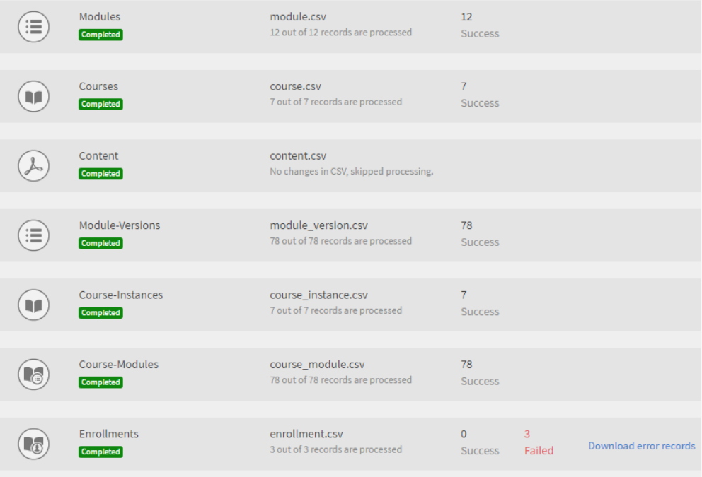

# Implementierungshandbuch für Learning Manager - Abschnitt 2

## Technische Einrichtung {#technicalsetup}

Die technische Einrichtung für Ihr Learning Manager-Konto ist hauptsächlich für Unternehmensbenutzer erforderlich. In diesem Dokument geht es um die Konfiguration von Single Sign-on für Ihr Unternehmen und die Integration von Learning Manager mit Connectors von Drittanbietern.

### Konfigurieren von Single Sign-On (SSO) {#configuresinglesignon}

Als Systemadministrator auf der Admin-Konsole müssen Sie als Erstes ein Identitätssystem definieren und einrichten, mit dem Ihre Endbenutzer authentifiziert werden. Nachdem Ihre Organisation Lizenzen für Learning Manager erworben hat, müssen Sie diese Lizenzen für Ihre Endbenutzer bereitstellen. Dazu benötigen Sie ein Verfahren, um diese Benutzer zu authentifizieren. Führen Sie die folgenden Schritte aus, um SSO für Ihre Benutzer zu konfigurieren:

1. Klicken Sie auf der Startseite des Learning Manager auf **[!UICONTROL ** Einstellungen **>** Anmeldemethoden **.]**

   

1. Wählen Sie je nach Benutzertyp eine der beiden Optionen **[!UICONTROL ** Interne Benutzer **oder** Externe Benutzer **.]**

1. Im **[!UICONTROL **Anmelden**]**Dropdown-Feld, wählen Sie **[!UICONTROL ** Single Sign-on **.]**

   

1. Zum Konfigurieren der Einstellungen für einmaliges Anmelden klicken Sie auf **[!UICONTROL **&#x200B;Ändern **.]**

   

1. Geben Sie im Feld ****[!UICONTROL IDP-initiierte Authentifizierungs-URL]**** die Authentifizierungs-URL ein, die von Ihrem Dienstanbieter bereitgestellt wurde.

   

1. Klicken Sie auf **[!UICONTROL **Hochladen **]**neben dem**[!UICONTROL  **IDP Metadata XML File **]****** und laden Sie Ihre XML-Datei hoch.
1. Klicken **[!UICONTROL ** Speichern **.]**
1. Die SSO-Authentifizierung für Ihr Konto wurde erfolgreich konfiguriert. Sie sollten sich mit SSO bei Ihrem Learning Manager-Konto anmelden können.

   ***Das SSO, das Sie im Learning Manager konfigurieren, sollte SAML 2.0 unterstützen.***

## Migration von Benutzerdaten {#migrationofuserdata}

Wenn Ihr Unternehmen als Administrator Learning Manager erwirbt, ist einer der entscheidenden Schritte, die Sie ausführen müssen, die Migration. Es ist zwingend erforderlich, dass Sie Ihre vorhandenen Schulungsinhalte und Benutzerdaten in den Learning Manager verschieben. Mit dem folgenden Migrationsarbeitsablauf können Sie die Vorteile eines modernen und intuitiven LMS nutzen, ohne die alten Daten Ihres Unternehmens zu verlieren.

Mit dem Learning Manager können Sie von Ihrem vorhandenen LMS über einen Schritt-für-Schritt-Assistenten in iterativen Sprints migrieren. Sie erhalten einen vollständigen Überblick über den Status jedes Sprints, um sicherzustellen, dass Ihre Teilnehmer keine Ausfallzeiten erleben, während Sie Ihre älteren Daten auf Adobe Learning Manager migrieren.

Zum Ausführen des Migrationsarbeitsablaufs benötigen Sie die Integrations-Admin-Berechtigungen. Als Administrator können Sie entweder die Rolle eines Integrations-Admins übernehmen oder diese Rolle einem anderen Benutzer zuweisen.

**Wir können Shaleen&#39;s Hilfe hier nehmen, um ein visuelles Bild zu erstellen.**

1. Voraussetzung
1. Vorhandene Inhalte und Benutzerdaten bewerten
1. Daten aus dem vorhandenen LMS exportieren und zuordnen
1. FTP- und BOX-Ordner für die Migration einrichten
1. Teilnehmer zum Learning Manager übertragen
1. Lerninhalte an Learning Manager übertragen
1. Übertragen verbleibender Daten an Learning Manager

### Voraussetzung {#prerequisite}

Bevor Sie den Migrationsprozess starten, müssen Sie die folgenden Voraussetzungen erfüllen:

* Extrahieren von Daten und Inhalten aus dem vorhandenen LMS und Transformieren der Daten in die vom Lernmanager definierten Dateiformate.
* Importieren von Benutzern über FTP- und BOX-Connectors Der Integrations-Admin muss sicherstellen, dass die Connectors vor dem Migrationsvorgang konfiguriert sind.

***Es wird empfohlen, dass Administratoren den Migrationsprozess in einem Testkonto testen, bevor sie die Daten und Inhalte in die Learning Manager-Produktionsumgebung migrieren. ***

### Bewerten und Exportieren von Daten {#evaluatingandexportingdata}

Der Integrations-Admin sollte sich zunächst die Daten ansehen, die im aktuellen LMS verfügbar sind. Als Integrations-Admin können Sie nur die folgenden Lernobjekte migrieren:

* Modul
* Kurs
* Modulversion
* Kursinstanz
* Kursmodul
* Kenntnisse
* Kenntnisstand
* Kenntniskurs
* Zertifizierung
* Zertifizierungskurs
* Zertifizierung bestimmen
* Lernprogramm
* Lernprogrammkurs
* Lernprogramminstanz
* Lernprogrammkursinstanz
* Registrierungen
* Zertifizierungseinschreibung
* Lernprogrammeinschreibung
* Benutzerkursbewertungen

Nachdem Sie Ihre vorhandenen Daten ausgewertet haben, müssen Sie sie den CSV-Standardspezifikationen im Lern-Manager zuordnen. Laden Sie die folgende Beispieldatei ***csv-specifications.zip*** herunter, die sieben Excel-Arbeitsblätter enthält, die für diese Migration erforderlich sind. Diese Excel-Arbeitsblätter enthalten Spezifikationen mit Beschreibungen, mit denen Sie verstehen können, wie die vorhandenen Daten den Feldern in den CSV-Dateien zugeordnet werden.

<!--
<Download link to the zip file>
-->

Stellen Sie sicher, dass jede CSV-Datei die Daten für jedes Feld im vorgeschriebenen Format enthält:

<table> 
 <tbody> 
  <tr> 
   <th width="7%" valign="top">
<strong>Anzahl</strong>
</th> 
   <th width="29%" valign="top">
<strong>Name des Excel-Arbeitsblatts</strong>
</th> 
   <th width="31%" valign="top">
<strong>Beschreibung des Inhalts</strong>
</th> 
   <th width="31%" valign="top">
<strong>Hinweise</strong>
</th> 
  </tr> 
  <tr> 
   <td>
1
</td> 
   <td>
module.xlsx
</td> 
   <td>
Metadaten für module.csv
</td> 
   <td>
 
</td> 
  </tr> 
  <tr> 
   <td>
2
</td> 
   <td>
course.xlsx
</td> 
   <td>
Metadaten für course.csv
</td> 
   <td>
Es empfiehlt sich, für einen bestimmten Kurs den Namen nur eines Autos zu verwenden, da mehrere Namen nach der Migration in der Anwendung nicht genau angezeigt werden. 
</td> 
  </tr> 
  <tr> 
   <td>
3
</td> 
   <td>
module_version.xlsx 
</td> 
   <td>
Metadaten für module_version.csv
</td> 
   <td>
Achten Sie darauf, den URL-Pfad des Ordners für das Box-Konto anzugeben, in den Sie den Inhalt hochgeladen haben. 
</td> 
  </tr> 
  <tr> 
   <td>
4
</td> 
   <td>
course_instance.xlsx
</td> 
   <td>
Metadaten für course_instance.csv 
</td> 
   <td> </td> 
  </tr> 
  <tr> 
   <td>
5
</td> 
   <td>
course_module.xlsx
</td> 
   <td>
Metadaten für course_module.csv
</td> 
   <td> </td> 
  </tr> 
  <tr> 
   <td>
6
</td> 
   <td>
skill.xlsx
</td> 
   <td>
Metadaten für skill.csv
</td> 
   <td> </td> 
  </tr> 
  <tr> 
   <td>
7
</td> 
   <td>
skill_level.xlsx
</td> 
   <td>
Metadaten für skill_level.csv
</td> 
   <td> </td> 
  </tr> 
  <tr> 
   <td>
8
</td> 
   <td>
skill_course.xlsx
</td> 
   <td>
Metadaten für skill_course.csv
</td> 
   <td> </td> 
  </tr> 
  <tr> 
   <td>
9
</td> 
   <td>
Certification.xlsx
</td> 
   <td>
Metadaten für Certification.csv
</td> 
   <td> </td> 
  </tr> 
  <tr> 
   <td>
10
</td> 
   <td>
certification_course.xlsx
</td> 
   <td>
Metadaten für certification_course.csv
</td> 
   <td> </td> 
  </tr> 
  <tr> 
   <td>
11
</td> 
   <td>
certification_commit.xlsx
</td> 
   <td>
Metadaten für certification_commit.csv
</td> 
   <td> </td> 
  </tr> 
  <tr> 
   <td>
12
</td> 
   <td>
learning_program.xlsx
</td> 
   <td>
Metadaten für learning_program.csv
</td> 
   <td> </td> 
  </tr> 
  <tr> 
   <td>
13
</td> 
   <td>
learning_program_course.xls 
</td> 
   <td>
Metadaten für learning_program_course.csv 
</td> 
   <td> </td> 
  </tr> 
  <tr> 
   <td>
14
</td> 
   <td>
learning_program_instance.xlsx 
</td> 
   <td>
Metadaten für learning_program_instance.csv
</td> 
   <td> </td> 
  </tr> 
  <tr> 
   <td>
15
</td> 
   <td>
learning_program_instance_course_instance.xlsx 
</td> 
   <td>
Metadaten für learning_program_instance_course_instance.csv
</td> 
   <td> </td> 
  </tr> 
  <tr> 
   <td>
16
</td> 
   <td>
enrollments.xlsx
</td> 
   <td>
Metadaten für enrollments.csv
</td> 
   <td> </td> 
  </tr> 
  <tr> 
   <td>
17
</td> 
   <td>
certification_enrollment.xlsx
</td> 
   <td>
Metadaten für certification_enrollment.csv
</td> 
   <td> </td> 
  </tr> 
  <tr> 
   <td>
18
</td> 
   <td>
learning_program_enrollment.xlsx
</td> 
   <td>
Metadaten für learning_program_enrollment.csv
</td> 
   <td> </td> 
  </tr> 
  <tr> 
   <td>
19
</td> 
   <td>
User_course_grade.xlsx
</td> 
   <td>
Metadaten für User_course_grade.csv
</td> 
   <td>
Ebenso empfiehlt es sich, die erforderlichen Teilnehmer-Datensatzdaten in der CSV-Datei bereitzustellen, auch wenn sie nicht erforderlich sind. Selbst wenn die CSV-Datei für die Migration verarbeitet wird, kann die Learning Manager-Anwendung ohne diese Info evtl. keine Daten darstellen. 
</td> 
  </tr> 
 </tbody> 
</table>

***Learning Manager unterstützt nur Datums- und Zeitwerte im UTF-8- und 32-Bit-Format. Während der Migration werden möglicherweise Fehler angezeigt, wenn Sie in CSV-Dateien ein Datum außerhalb des zulässigen Bereichs angeben, z. B. 2038-07-17T08:53:21.000Z oder 1980-04-17T08:13:25,322 Z.***

### Abhängigkeiten beim Importieren von Daten in CSV-Dateien {#dependencieswhileimportingdatatocsvfiles}

Beachten Sie beim Importieren der vorhandenen Daten in das standardmäßige CSV-Format die folgenden Abhängigkeiten:

* „module_version.csv“ ist von „module.csv“ abhängig
* „course_instance.csv“ ist von „course.csv“ abhängig
* „course_module.csv“ ist von „course.csv“, „module.csv“ und „module_version.csv“ abhängig
* „course_instance.csv“ ist von „course.csv“ abhängig
* „enrollment.csv“ ist von „course.csv“ abhängig
* „user_course_grade.csv“ ist von „course.csv“ und „module.csv“ abhängig
* „skill_course.csv“ ist von „course.csv“ abhängig
* „skill_level.csv“ ist von „skill.csv“ abhängig
* „learning_program_instance.csv“ ist von „learning program“ und „learning_program_course.csv“ abhängig
* „learning_program_course.csv“ ist von „learning_program.csv“ abhängig
* „learning_program_enrollment.csv“ ist von “learning program“ und „learning_program_instance.csv“ abhängig
* „learning_program_instance_course_instance.csv“ ist von „learning_program.csv“, „learning_program_instance.csv“ und „course_instance.csv“ abhängig
* certification_course.csv ist von certification.csv und von course.csv abhängig
* certification_commit.csv ist von certification.csv und certification_course.csv abhängig
* „certification_enrollment.csv“ ist von „certification.csv“, „certification_course.csv“ und „certification_enrollment.csv“ abhängig

Nachdem Sie die Daten exportiert haben, speichern Sie die CSV-Dateien auf Ihrem lokalen Computer. Die Dateien können jetzt in den FTP- oder BOX-Ordnern abgelegt werden.

## FTP- und BOX-Ordner für die Migration einrichten {#setupftpandboxfoldersforthemigration}

Bevor Sie die eigentliche Migration aller Inhalte planen und starten, müssen Sie zunächst die FTP- und BOX-Ordner einrichten. Sie benötigen diese Ordner, um Ihre CSV-Dateien in diesen Ordnern abzulegen. Sobald Ihre alten Inhalte in Form von CSV-Dateien in den FTP- und BOX-Ordnern verfügbar sind, kann Lern-Manager die Daten nutzen.

### FTP-Konto einrichten {#setupanftpaccount}

Klicken Sie auf der Startseite des Integrationsadministrators auf **[!UICONTROL ** CSV-FTP-Ordner anfordern **.]** Geben Sie im angezeigten Popup-Dialogfeld Ihre E-Mail-ID ein. Öffnen Sie den Online-Assistenten, um das ExaVault-FTP-Konto zu erstellen. Sobald Sie Ihr Konto erstellt haben, können Sie die Ordner für Ihre Migrations- und Sprint-Projekte in ExaVault FTP anzeigen.

Hier sehen Sie ein Beispiel für einen Schnappschuss der Projektdateien und des Ordners von ExaVault:

Wenn Sie den FTP-Ordner erfolgreich eingerichtet haben, wird die Meldung &quot;FTP-Ordnereinrichtung ist abgeschlossen&quot; angezeigt.

## BOX-Konto einrichten {#setupaboxaccount}

Führen Sie die folgenden Schritte aus, um ein BOX-Konto zu erstellen und einen BOX-Ordner einzurichten:

Wählen Sie auf der Integrations-Admin-Startseite „Migration“.

Klicken Sie im Abschnitt „Einrichtung“ auf „Box-Ordner anfordern“.

Geben Sie im Feld ****[!UICONTROL E-Mail-Adresse eingeben]**** die E-Mail-ID ein, unter der Sie die Anmeldeanweisungen für die Verbindung zu Box erhalten möchten.

Klicken **[!UICONTROL ** Vernetzen **.]**

Sie erhalten eine E-Mail von Box mit einem Link zum freigegebenen Ordner. Wenn Sie über kein Box-Konto verfügen, klicken Sie auf „Registrieren“ und erstellen Sie ein Konto. Anweisungen zur Anmeldung werden an die E-Mail-ID des Integrations-Admins gesendet.

Nachdem Sie die Verbindung gespeichert haben, wird auf der Migrationsseite die Meldung angezeigt: &quot;Die Einrichtung des Box-Ordners ist abgeschlossen&quot;.

## Migrieren des Inhalts in den Learning Manager {#migratingthecontenttocaptivateprime}

Bevor Sie mit der Migration beginnen, sollten Sie Folgendes beachten:

* Innerhalb eines Kontos kann jeweils nur ein Migrationsprojekt aktiv sein. Innerhalb eines Projekts kann jeweils nur ein Sprint aktiv sein.
* Wurde der Migrationsvorgang gestartet, kann die entsprechende Ausführung nicht mehr rückgängig gemacht werden. Sie können jedoch jede beliebige Daten- oder Inhaltsmigration mithilfe der Löschoption der jeweiligen Funktion in Learning Manager rückgängig machen.

Sobald das Migrationsprojekt beginnt, erhält das Projekt den Status &quot;Unter Migration&quot;. In diesem Status kann sich kein anderer Benutzer außer dem Integrations-Admin bei Learning Manager anmelden.

Schulungsinhalte in Inhaltsordner hochladen:

Klicken Sie auf der Integrations-Admin-Startseite auf **[!UICONTROL Migration.]**

Auf der Startseite der Migration zeigt das System die Migrationsprojekte an, die bereits in Ihrem Unternehmen erstellt wurden.

Klicken Sie auf **[!UICONTROL **Neu**]**oben rechts auf der Seite, um ein Migrationsprojekt zu erstellen.

***Wenn Sie noch keinen FTP-Ordner erstellt haben, werden Sie aufgefordert, einen FTP-Ordner für das ExaVault-Konto zu erstellen. Dies ist ein obligatorischer Schritt, bevor Sie mit dem Erstellen eines Migrationsprojekts beginnen. ***

Geben Sie auf der Seite ****[!UICONTROL Neues Migrationsprojekt erstellen]**** den Namen für Ihr Projekt an.

Geben Sie ein Tag für Ihr Projekt, den Kurskatalog und eine Beschreibung für das Migrationsprojekt an. Ihre Migrationsdatenelemente werden mithilfe dieses Migrationsprojekt-Tags identifiziert. Wenn Sie keinen bestimmten Kurskatalog haben, wählen Sie den Standardkatalog aus der Dropdownliste aus. Alle Kurse, die mithilfe eines Migrationsprojekts migriert werden, sind im Katalog enthalten, den Sie in dieser Phase ausgewählt haben. Wenn Sie keinen Katalog auswählen, sind alle migrierten Kurse Teil des Standardkatalogs.

Klicken Sie auf **[!UICONTROL Erstellen.]**

Erstellen Sie auf der Seite „Sprint-Konfiguration“ einen Sprint für Ihr Migrationsprojekt. Ein Sprint definiert im LMS-Migrationsprozess des Learning Managers eine Reihe von Migrationselementen, die Sie für die Migration aus dem vorhandenen LMS ausgewählt haben.

Geben Sie einen Namen und eine Beschreibung für den Sprint an.

Wählen Sie das ****[!UICONTROL Benutzer wurden seit der letzten Ausführung hinzugefügt oder geändert]****, um die Liste der Benutzer mit der Learning Manager-Anwendung zu synchronisieren. Wenn Sie Inhalte und Daten in die Learning Manager-Anwendung migrieren, ist dies möglicherweise nicht erforderlich. Wenn zwischen Ihrer früheren und der neuesten Sprint-Migration jedoch eine Zeitspanne liegt, wird empfohlen, die Liste der Benutzer zu synchronisieren. Bei diesem Schritt kann die Learning Manager-Datenbank mit Ihren LMS-Benutzern synchronisiert werden.

***Der Synchronisierungsschritt wird empfohlen, wenn die Dateien &quot;enrollment.csv&quot; und &quot;user_course_grade.csv&quot; migriert werden. Mit diesem Schritt kann die Lern-Manager-Datenbank mit Ihrer Migrationsdatenbank synchronisiert werden und es wird sichergestellt, dass alle Benutzer, deren Datensätze im Sprint migriert werden sollen, in der Migrationsdatenbank verfügbar sind.***

Klicken **[!UICONTROL ** Weiter **.]**

Klicken Sie auf **[!UICONTROL **Start**]**um die Sprint-Migration mit Ihren hochgeladenen Daten und Inhalten zu starten. Klicken ****[!UICONTROL Aktualisieren]**** bevor Sie den Sprint-Run starten, um die FTP- und Inhaltsordner mit dem Lern-Manager zu synchronisieren.

Sie können auf ****[!UICONTROL Stopp]****jederzeit während des Sprint-Migrationsvorgangs, um die Sprint-Migration abzubrechen.

Das System zeigt den Migrationsstatus für die jeweiligen Sprint-Datenelemente und -Inhalte an. Überprüfen Sie die Anzahl der erfolgreichen und fehlgeschlagenen Elemente als Teil des Sprint-Laufs der Migration.

Wenn Sie Modulinhalte hochladen, stellen Sie sicher, dass der Pfad des Inhaltsordners in der Datei *module_version.csv *angegeben wird. Wenn Sie diesen Schritt versäumen, stellen Sie möglicherweise Fehler während der Migration fest. Wenn Sie beispielsweise Inhalte von Modulen zum Selbststudium (z. B. Videos) hochladen, müssen Sie den relativen Box-URL-Pfad in der Datei *module_version.csv *angeben.

In der Abbildung unten sehen Sie ein Referenzbeispiel für den Migrationsfortschritt. Sie können die Anzahl der für jedes Migrationsdatenelement verarbeiteten Datensätze zusammen mit dem Status der erfolgreichen und fehlgeschlagenen Elemente sehen. Klicken Sie auf „Fehlerdatensätze für die fehlgeschlagenen Elemente herunterladen“, um die Fehlerprotokolle herunterzuladen und anzuzeigen. Sie können die Probleme in der CSV-Datei beheben und diese erneut auf FTP hochladen.

Um die Liste aller Sprints eines Migrationsprojekts anzuzeigen, klicken Sie auf **[!UICONTROL **Sprint**]**im linken Navigationsbereich. Sie können eine Liste aller Sprints, die Anzahl der für jeden Sprint ausgeführten Läufe, das Startdatum, die Dauer sowie den Abschlussstatus anzeigen (siehe nachfolgende Abbildung).

Um die Liste aller Sprints eines Migrationsprojekts anzuzeigen, klicken Sie auf **[!UICONTROL **Sprint**]**im linken Navigationsbereich. Sie können eine Liste aller Sprints, die Anzahl der für jeden Sprint ausgeführten Läufe, das Startdatum, die Dauer sowie den Abschlussstatus anzeigen (siehe nachfolgende Abbildung).

Um die Liste aller Sprints eines Migrationsprojekts anzuzeigen, klicken Sie auf **[!UICONTROL **Sprint**]**im linken Navigationsbereich. Sie können eine Liste aller Sprints, die Anzahl der für jeden Sprint ausgeführten Läufe, das Startdatum, die Dauer sowie den Abschlussstatus anzeigen (siehe nachfolgende Abbildung).

***Bevor Sie das Migrationsprojekt als abgeschlossen markieren, stellen Sie sicher, dass alle Sprints im Projekt abgeschlossen sind. Nachdem Sie das Migrationsprojekt als abgeschlossen markiert haben, können Sie in diesem Projekt keine Sprints mehr erstellen. Sie können an diesem Projekt keine Änderungen mehr vornehmen. Sie können nur ein weiteres Migrationsprojekt erstellen und ihm Sprints hinzufügen.***

Nachdem Sie die Lerndaten und -inhalte aus dem alten LMS Ihres Unternehmens migriert haben, überprüfen Sie, ob die Daten und Inhalte ordnungsgemäß importiert wurden. Sie können dies überprüfen, indem Sie sich als Administrator anmelden und die Verfügbarkeit von Daten und Inhalten für die importierten Module und Kurse überprüfen.

Nützliche Ressourcen zur Migration finden Sie in den folgenden Artikeln:

* Fehlerbehebung für Migrationsprobleme
* Häufig gestellte Fragen zum Hochladen von CSV

