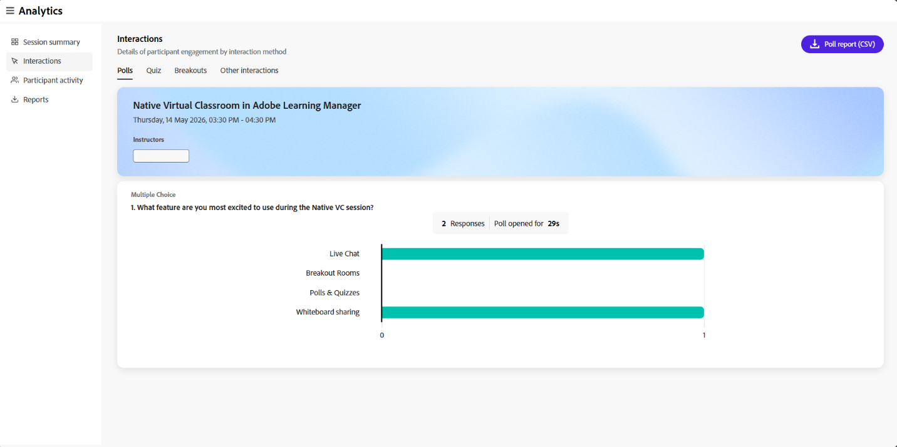

# Komponenten des Sitzungs-Dashboards

## Übersicht

Das Session-Dashboard im Live Hub besteht aus mehreren Abschnitten, die detaillierte Einblicke in die Session-Performance und die Interaktion der Teilnehmer bieten.

Jede Komponente hilft Kursleitern, die Teilnahme zu analysieren, das Verhalten der Teilnehmer zu verstehen und die Effektivität von Live-Hub-Sitzungen zu bewerten.

## Zusammenfassung der Sitzung

Die Zusammenfassung der Sessions bietet einen Überblick über Live- und aufgezeichnete Sessions, einschließlich Sessionaufzeichnungen. Es enthält Details wie die Anzahl der registrierten und teilnehmenden Teilnehmer, die Sitzungsdauer, die Anwesenheit im Laufe der Zeit, die Interaktion mit Teilnehmern und die Aufzeichnung von Ansichten.

Wählen Sie **Sitzungszusammenfassung (PDF)**, um die Zusammenfassung herunterzuladen.

*Wählen Sie die Sitzungszusammenfassung (PDF) aus, um die Zusammenfassung herunterzuladen.*

Sie können die folgenden Details anzeigen:

* **Sitzungsdauer**: Zeigen Sie die Gesamtdauer der Live-Sitzung und die durchschnittliche Dauer der Anwesenheit zwischen Teilnehmern an.

* **Anwesenheit**: Zeigen Sie die Anzahl der registrierten Teilnehmer zusammen mit denen an, die beigetreten sind, und denen, die nicht beigetreten sind.

* **Anwesenheit im Laufe der Zeit**: Sieh dir an, wie sich die Anwesenheit während der Session verändert hat, inklusive der höchsten Anwesenheit und der Gesamtzahl an Teilnehmern.

* **Teilnehmereinbeziehung**: Hier erfahren Sie, wie sich die Teilnehmer während der Sitzung engagiert haben, einschließlich der Anzahl der beantworteten Umfragen, Chat-Interaktionen, gestellten Fragen, eingereichten Tests und gesendeten Reaktionen.

### Aufzeichnungen

Einblicke zu Sessionaufzeichnungen anzeigen. Diese Erkenntnisse helfen Ihnen, das Engagement der Teilnehmer und die Nutzung der Aufzeichnungen zu verstehen. Sie können auch die Aufzeichnung herunterladen und auf die Berichte zugreifen, um sie weiter zu analysieren.

* **Ansichten insgesamt**: Die Gesamtanzahl der Aufzeichnungen, zusammen mit der Anzahl der eindeutigen Viewer.

* **Benutzer, die auch an der Live-Sitzung teilgenommen haben**: Die Anzahl der Teilnehmer, die an der Live-Sitzung teilgenommen und sich später die Aufzeichnung angesehen haben. Wählen Sie **Download-Liste**, um die Teilnehmerliste anzuzeigen.

* **Durchschnittliche Anzeigedauer**: Die durchschnittliche Zeit, die Teilnehmer damit verbrachten, die Aufzeichnung anzuschauen.

*Session-Dashboard-Ansicht mit Aufzeichnungsinformationen.*

Von den Aufzeichnungsoptionen stehen die folgenden Aktionen zur Verfügung:

* Wählen Sie **Herunterladen**, um die Aufzeichnung herunterzuladen.

* Wählen Sie **Aufzeichnung bearbeiten**, um die Aufzeichnung zu ändern. Die Aufnahme wird im Aufnahme-Player geöffnet.

## Interaktionen

In Interaktionen können Sie sehen, wie Teilnehmer interagieren und sich an der Sitzung beteiligen. Verfolgt die Antworten auf Umfragen, Fragen und Antworten sowie die Reaktionen der Teilnehmer aus den Interaktions-Tools.

Wählen Sie im linken Bereich **Interaktionen** aus, um die Interaktion der Teilnehmer anzuzeigen.

Das Interaktions-Dashboard besteht aus den folgenden Registerkarten:

### Umfragen

Auf der Registerkarte &quot;Umfragen&quot; können Sie Fragen und Antworten anzeigen, die der Umfrage hinzugefügt wurden. Sie können auch einen Bericht aller Abstimmungsinteraktionen von der Registerkarte **Umfragen** herunterladen. Der Bericht umfasst:

* Teilnehmerdetails, einschließlich Vorname, Nachname und E-Mail-Adresse.

* Die Umfragenummer, der Umfragetyp und die Umfragefrage.

* Antwort jedes Teilnehmers auf die Umfrage.

*Session-Dashboard-Ansicht mit Abstimmungsinteraktionen.*

### Quiz

Über die Registerkarte können Sie die Quizmetriken während einer Live-Sitzung anzeigen. Es enthält die folgenden Fenster:

* Laden Sie einen Bericht zu Quizinteraktionen im ZIP-Format herunter.

* Zeigen Sie eine Abbildung an, in der Teilnehmer angezeigt werden, die das Quiz eingereicht haben, es nicht abgeschlossen haben oder nicht versucht haben.

* Die Anzahl der Fragen im Quiz. Wählen Sie **Liste anzeigen** aus, um alle Fragen anzuzeigen.

* Wählen Sie **Detaillierten Bericht anzeigen**, um Teilnehmerberichte nach Fragenliste, Fragen, Rangliste und individuellen Antworten anzuzeigen.

* Durchschnittliche Genauigkeit der Antwort. Wählen Sie **Leaderboard anzeigen**, um die Ergebnisse anzuzeigen.

* Durchschnittliche Zeit, die zum Testen eines Quiz benötigt wird.

*Session-Dashboard-Ansicht mit Quizinteraktionen.*

## Breakout-Sessions

Hier erfahren Sie, wie die Teilnehmer während der Liveklasse an Arbeitsgruppensitzungen teilgenommen haben. Dieser Abschnitt enthält eine Zusammenfassung der Breakout-Aktivität sowie detaillierte Einblicke für jede Breakout-Sitzung.

* **Arbeitsgruppensitzungen**: Gesamtanzahl der Arbeitsgruppensitzungen, die während der Sitzung durchgeführt wurden.

* **Dauer der Arbeitsgruppen**: Kombinierte Dauer aller Arbeitsgruppensitzungen.

* **Teilnehmer in Arbeitsgruppen**: Anzahl der Teilnehmer, die an Arbeitsgruppensitzungen teilgenommen haben.

Wählen Sie **Arbeitsgruppenbericht (PDF)**, um den Bericht herunterzuladen.

*Sitzungs-Dashboard-Ansicht mit Einblicken zu Arbeitsgruppensitzungen.*

Für jede Arbeitsgruppensitzung können Sie den Sitzungsnamen, die Dauer und die Startzeit anzeigen. Sie können außerdem Folgendes anzeigen:

* **Teilnehmer**: Gesamtzahl der Teilnehmer an der Arbeitsgruppensitzung.

* **Teilnahmeverteilung**: Aufschlüsselung der Teilnehmer nach Teilnahmestufen. Die verfügbaren Ebenen sind &quot;Hoch&quot;, &quot;Mäßig&quot; und &quot;Niedrig&quot;.

* **Räume**: Anzahl der erstellten Arbeitsräume.

Wählen Sie **Details anzeigen** aus, um eine Arbeitsgruppensitzung zu erweitern und Einblicke auf Raumebene zu erhalten. Wählen Sie **Details ausblenden**, um sie erneut zu reduzieren.

### Arbeitsraumdetails

In der erweiterten Ansicht zeigt jeder Raum Folgendes an:

* **Anweisungen**: Die Aufforderung oder Aktivität für Teilnehmer im Raum.

* **Chat-Transkript**: Wählen Sie **Chat-Transkript** aus, um den im Raum ausgetauschten Chat anzuzeigen.

* **Kursleiter in Raum**: Eine Tabelle, in der der Name jedes Kursleiters, die Uhrzeit der Arbeitsgruppensitzungen und die Sprechzeit aufgeführt sind.

* **Teilnehmer in Raum**: Eine Tabelle, in der der Name jedes Teilnehmers, die Uhrzeit der Arbeitsgruppensitzungen, die Sprechzeit und die Teilnehmerstufe aufgeführt sind.

*Tabelle mit Kursleiter- und Teilnehmerdetails für einen Arbeitsraum.*

## Andere Interaktionen

Wählen Sie **Interaktionsberichte herunterladen** aus der Dropdown-Liste oben rechts, um den Bericht **Fragen und Antworten** und **Reaktionen** herunterzuladen.

*Session-Dashboard-Ansicht mit der Option zum Herunterladen von Interaktionsberichten.*

### Q&amp;A-Metriken

Sehen Sie sich die folgenden Attribute der Fragen-und-Antworten-Metriken an:

* Gesamtzahl der gestellten Fragen

* Die Anzahl der unbeantworteten Fragen.

* Die Anzahl der Teilnehmer, die Fragen stellten.

* Die Anzahl der Teilnehmer, die mehr als eine Frage gestellt haben, die wahrscheinlich die Top-Interessenten sind.

* Durchschnittliche Zeit, die zur Beantwortung einer Frage benötigt wird.

### Reaktionen

Teilnehmerreaktionen während der Sitzung anzeigen, einschließlich Zustimmung, Meinungsverschiedenheiten, Applaus und Gelächter.

Sehen Sie sich die folgenden Details im Diagramm an:

* Reaktionen insgesamt.

* Anzahl der Teilnehmer, die mindestens einmal reagiert haben.

* Klicks gesamt.

* Eindeutige Teilnehmer.

* Eine grafische Darstellung der Klicks auf jede Reaktion, die von einzelnen Teilnehmern ausgeführt wird.

## Aktivität des Teilnehmers

Der Abschnitt **Teilnehmeraktivität** bietet eine konsolidierte Ansicht der individuellen Teilnehmerinteraktion während der Sitzung. Es hilft Kursleitern, die Teilnahmestufen zu analysieren und die Interaktionen der Teilnehmer mit verschiedenen Aktivitäten zu verfolgen.

Wählen Sie im linken Teilfenster **Teilnehmeraktivität**, um detaillierte Erkenntnisse auf Teilnehmerebene anzuzeigen. Wählen Sie **Teilnehmeraktivitätsbericht (CSV)**, um den vollständigen Bericht herunterzuladen.

*Tabelle mit Details des Teilnehmeraktivitätsberichts.*

In der Tabelle werden die folgenden Informationen für die Teilnehmeraktivität angezeigt:

* **Teilnehmerdetails**: Name und E-Mail-ID des Teilnehmers.

* **Anwesende Dauer**: Prozentsatz der vom Teilnehmer besuchten Sitzung.

* **Beantwortete Umfragen**: Anzahl der Umfragen, auf die die Teilnehmer geantwortet haben.

* **Quizübermittlung**: Anzahl der Quizze, die vom Teilnehmer eingereicht wurden.

* **Quizpunktzahl insgesamt**: Punktzahl, die der Teilnehmer in Tests erzielt hat.

* **Sprecherzeit**: Dauer, während der der Teilnehmer während der Sitzung gesprochen hat.

* **Kamerazeit**: Dauer, für die die Kamera des Teilnehmers aktiv war.

* **Fragen gestellt**: Anzahl der vom Teilnehmer gestellten Fragen.

* **Reaktionen**: Anzahl der Reaktionen der Teilnehmer.

* **Zweifel haben**: Wie oft der Teilnehmer während der Sitzung Zweifel geäußert hat.

## Berichte

Laden Sie Berichte für verschiedene Aktivitäten von einem zentralen Hub als Kursleiter herunter. Diese Berichte erfassen die Interaktionen der Teilnehmer und Interaktionen während Live- und aufgezeichneten Vorstellungen.

Herunterladen von Berichten

1. Wählen Sie im linken Bereich **Berichte herunterladen**.

1. Wählen Sie **Alle herunterladen (.zip)**, um einen kombinierten Bericht für alle Aktivitäten herunterzuladen.

   
   *Wählen Sie Alle herunterladen (.zip) aus, um einen kombinierten Bericht herunterzuladen.*

1. Wählen Sie das Downloadsymbol neben jedem Bericht aus, um sie einzeln herunterzuladen.
