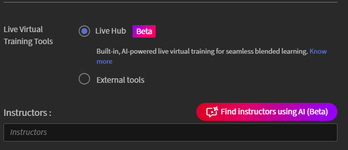

# Erstellen einer Live Hub (Beta)-Sitzung

Verwenden Sie den Live Hub , um Live-Schulungen mit Kursleiter innerhalb eines Adobe Learning Manager-Kurses bereitzustellen. Sie können Live-Hub-Sitzungen mit Inhalten zum Selbststudium kombinieren, um ein gemischtes Lernerlebnis zu schaffen.

Wenn Sie einem Kurs ein Modul für ein virtuelles Klassenzimmer hinzufügen, wählen Sie das virtuelle Schulungstool aus, das die Live-Sitzung hostet. Sie können **Live Hub**, die integrierte KI-gestützte virtuelle Schulungslösung der Adobe, oder einen externen Anbieter wie **Adobe Connect** verwenden.

>[!NOTE]
>
> Der Live-Hub wird nur dann als Option für das virtuelle Live-Schulungstool angezeigt, wenn Ihr Administrator ihn in den Einstellungen des Live-Hub aktiviert hat. Wenn sie nicht aktiviert ist, verwenden Sie stattdessen einen externen Anbieter wie Adobe Connect. Weitere Informationen finden Sie unter [Live Hub aktivieren](../administrators/feature-summary/enable-live-hub.md).

Beim Erstellen eines Live Hub-Kurses haben Sie folgende Möglichkeiten:

* Fügen Sie einem Kurs eine oder mehrere Live Hub-Sitzungen hinzu.

* Wählen Sie Kursleiter manuell aus, oder verwenden Sie KI-gestützte Kursleiterempfehlungen.

* Konfigurieren Sie den Kurs mit einer einzelnen Standardinstanz, oder erstellen Sie mehrere Instanzen für verschiedene Zeitpläne oder Zielgruppen.

In diesem Artikel wird erläutert, wie Sie einen Live Hub-Kurs erstellen, Kursleiter zuweisen und Kursinstanzen konfigurieren.

## Live Hub-Kurs erstellen

Eine Standardinstanz wird automatisch erstellt, wenn Sie ein virtuelles Klassenzimmermodul hinzufügen. Dies ist nützlich, wenn Sie eine einzelne Sitzung oder einen Standardplan für alle Teilnehmer bereitstellen möchten.

So erstellen Sie einen Live Hub-Kurs:

1. Melden Sie sich bei Adobe Learning Manager als Autor an.

1. Wählen Sie **Kurse erstellen**.

1. Wählen Sie auf der Seite **Kurskatalog** die Option **Hinzufügen** aus, und geben Sie dann die folgenden Details ein:

   1. Kursname

   1. Kurze Beschreibung

   
   *Geben Sie den Kursnamen und die Kurzbeschreibung ein, bevor Sie dem Kurs Module hinzufügen.*

1. Wählen Sie im Abschnitt **Module** die Option **Inhalt** > **Module hinzufügen** aus. 6  Das Popupfenster **Modultyp auswählen** wird angezeigt.

1. Wählen Sie **Virtuelles Klassenzimmer** und geben Sie die Kursdetails ein, einschließlich Titel, Beschreibung, Zeitzone, Start- und Enddatum sowie Start- und Endzeit.

1. Wählen Sie **Live Hub** in **Virtuelle Live-Schulungstools** aus.

   
   *Wählen Sie &quot;Live Hub&quot; aus, um KI-gestützte Kursleiterempfehlungen für die Sitzung zu aktivieren.*

1. Fügen Sie Kursleiter hinzu, indem Sie eine der folgenden Optionen verwenden:

   1. Geben Sie Kursleiternamen in das Feld **Kursleiter** ein.

   1. Wählen Sie **Finden Sie Kursleiter, die AI verwenden**, um von AI empfohlene Kursleiter anzuzeigen. Weitere Informationen finden Sie unter [Kursleiter mithilfe des Kursleiter-Finders hinzufügen](#add-instructors-using-instructor-finder).

1. Wählen Sie **Hinzufügen** > **Speichern**.

1. Wählen Sie die erforderlichen Kenntnisse im Abschnitt **Kurskenntnisse** aus.

1. Wählen Sie die **Kenntnisstufe** aus, und überprüfen oder aktualisieren Sie dann die **maximalen Credits**.

   
   *Weisen Sie Kenntnisse und Kenntnisstufen zu, um die Credits zu definieren, die Teilnehmer durch Abschluss des Kurses erwerben.*

1. Wählen Sie **Speichern** > **Publish**. Der Kurs wurde erfolgreich in Adobe Learning Manager erstellt.

## Kursinstanz erstellen

Ein Administrator kann eine oder mehrere Instanzen eines Kurses erstellen, um ihn für verschiedene Zielgruppen, Zeitpläne oder Standorte anzubieten. Jede Instanz verfügt über eigene Sitzungsdetails, sodass Sie jeder Instanz desselben Kurses unterschiedliche Kursleiter, Empfehlungen im Kursleiter-Finder und Timings zuweisen können.

So erstellen Sie eine Kursinstanz:

1. Melden Sie sich bei Adobe Learning Manager als Autor an.

1. Öffnen Sie den Kurs und wählen Sie dann im linken Bereich **Instanzen** aus.

   
   *Die Standardinstanz wird automatisch erstellt, wenn Sie ein virtuelles Klassenzimmermodul hinzufügen.*

1. Wählen Sie **Neue Instanz hinzufügen**.

1. Geben Sie den **Instanznamen**, **Startdatum** und **Ausfülltermin** ein. Wählen Sie **Weitere Optionen anzeigen**, um zusätzliche Einstellungen zu konfigurieren.

   
   *Geben Sie einen Instanznamen, ein Startdatum und einen Abschlusstermin ein, um eine neue Kursinstanz zu erstellen.*

1. Wählen Sie **Speichern** aus.   Die neue Instanz wird der Liste **Instanzen** hinzugefügt.

   
   *Die neue Instanz wird neben der Standardinstanz in der Instanzenliste angezeigt.*

1. Wählen Sie die Nummer unter **Sitzungen** aus, um die **Sitzungsdetails** anzuzeigen.

   Symbol zum Bearbeiten von 
   *Sitzungsdetails zeigen an, welche Timing-, Kursleiter- und Standortfelder noch konfiguriert werden müssen.*

1. Wählen Sie das Bearbeitungssymbol (Stiftsymbol) neben den Sitzungsdetails aus, um das Konfigurationsfeld für die Sitzung zu öffnen.

   Konfigurationsbereich für 
   *Konfigurieren Sie den Zeitplan, den Kursleiter und den Speicherort für eine bestimmte Sitzungsinstanz.*

1. Geben Sie im Feld **Kursleiter** Namen manuell ein, oder wählen Sie **Kursleiter mithilfe von AI suchen** für Kursleiter, die von AI empfohlen werden. Weitere Informationen finden Sie unter [Kursleiter mithilfe des Kursleiter-Finders hinzufügen](#add-instructors-using-instructor-finder).

1. Geben Sie die Details zum **Speicherort** ein, und wählen Sie dann **Speichern** aus. Die Sitzung wird mit den konfigurierten Timings, Kursleitern und Standortdetails aktualisiert.

## Kursleiter mit dem Kursleiter-Finder hinzufügen

Verwenden Sie statt manuell nach Kursleitern zu suchen und diese hinzuzufügen **Kursleiter-Finder**, um KI-gestützte Kursleiter-Empfehlungen für die Sitzung zu erhalten. Der Finder sucht nach Kursleitern, die anhand der Kursdetails und der erforderlichen Fähigkeiten ermittelt werden, berücksichtigt aber auch den Ferienkalender der Organisation, die Verfügbarkeit von Kursleitern und die Auslastung der Kursleiter, um die geeignetsten Kursleiter vorzuschlagen. Weitere Informationen finden Sie unter [Kursleiter hinzufügen und verwalten](./instructor-management.md).

>[!NOTE]
>
> Der Kursleiter-Finder wird nur angezeigt, wenn Ihr Administrator den Kursleiter-Finder-Assistenten in den Live Hub-Einstellungen aktiviert hat. Weitere Informationen finden Sie unter [Live Hub aktivieren](../administrators/feature-summary/enable-live-hub.md).

So fügen Sie Kursleiter mit dem Kursleiter-Finder hinzu:

1. Navigieren Sie zum Abschnitt **Kursleiter** im Modul **Virtuelles Klassenzimmer**.

1. Wählen Sie **Kursleiter mithilfe von AI suchen**.   Der Bereich **AI Assistant** wird auf der rechten Seite geöffnet.

   
   *Verwenden Sie das Bedienfeld &quot;AI-Assistent&quot;, um Empfehlungen für Kursleiter und Zeitfenster auf der Grundlage der Sitzungsdetails abzurufen.*

1. Überprüfen Sie die Liste der empfohlenen Kursleiter. Der Kursleiter empfiehlt Kursleiter basierend auf den Kurskenntnissen und den Sitzungsanforderungen. Recommendations berücksichtigt auch die Verfügbarkeit und Nutzung von Kursleitern sowie den Weihnachtskalender Ihrer Organisation. Weitere Informationen finden Sie unter **Kursleiterverwaltung**.

1. Navigieren Sie zu dem Kursleiter, den Sie zuweisen möchten, und wählen Sie dann **Hinzufügen** aus.   Der ausgewählte Kursleiter wird dem Feld **Kursleiter** als Tag hinzugefügt.

## Teilnehmer für den Kurs registrieren

Die Registrierung von Teilnehmern für einen Live Hub-Kurs hat zwei Möglichkeiten:

1. Ein **Administrator** registriert die Teilnehmer gemäß den Anforderungen des Unternehmens für den Kurs. Weitere Informationen finden Sie unter [Kursinstanzen und Lernpfade erstellen](https://experienceleague.adobe.com/de/docs/learning-manager/using/admin/courses).

1. Teilnehmer können sich selbst direkt über die Seite **Katalog** für den Kurs registrieren. Wenn der Kurs für die Selbstregistrierung konfiguriert ist, werden die Teilnehmer sofort registriert und können über **Meine Lernergebnisse** auf den Kurs zugreifen. Weitere Informationen finden Sie unter [Meine Lernergebnisse](https://experienceleague.adobe.com/de/docs/learning-manager/using/learner/courses).

Nach der Registrierung werden die Teilnehmer dem Kurs hinzugefügt und erhalten eine Benachrichtigung in ihrem Adobe Learning Manager-Konto. Abhängig von den E-Mail-Benachrichtigungseinstellungen des Kontos erhalten die Teilnehmer möglicherweise auch eine Einladung zur Teilnahme am Kurs per E-Mail.

## Branding für Live-Hub-Räume anpassen

Administratoren können das Erscheinungsbild von Live Hub-Räumen anpassen, um sie dem Branding Ihrer Organisation anzupassen. Verwenden Sie die **Designs**-Einstellungen in Adobe Learning Manager, um Markenfarben, Logos und visuelles Styling über Live Hub-Sitzungen hinweg anzuwenden.

Das benutzerdefinierte Branding trägt zu einem konsistenten Lernerlebnis bei und stellt sicher, dass Live-Schulungen die Identität Ihres Unternehmens widerspiegeln.

Weitere Informationen zum Konfigurieren von Designs finden Sie im Artikel [Farbdesigns](../administrators/feature-summary/themes.md#color-themes).
