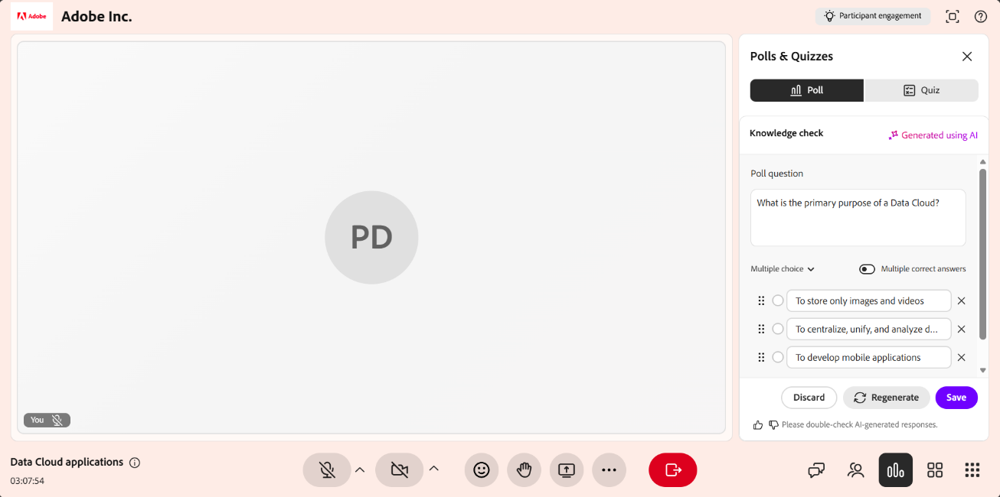

# Umfrage erstellen und starten

Nutzt Umfragen, um eure Live-Hub-Sessions interaktiver und ansprechender zu gestalten. Im Bereich **Umfragen und Tests** können Sie Umfragen manuell erstellen, indem Sie Fragetypen wie Multiple-Choice oder kurze Antworten auswählen oder mithilfe von KI mit den Optionen **Icebreaker** und **Wissensüberprüfung** generieren.

Während einer Live-Sitzung können Sie Umfragen starten und schließen, Antworten in Echtzeit überwachen, die Antworten der Teilnehmer überprüfen und auswählen, ob die Ergebnisse an die Teilnehmer weitergegeben werden sollen. In diesem Artikel wird erläutert, wie Sie Umfragen während einer Live Hub-Sitzung erstellen, verwalten und freigeben.

## Manuelles Erstellen einer Umfrage

Erstellen Sie Umfragen, um Fragen zu stellen und Antworten von Teilnehmern während einer Live-Sitzung zu erfassen. Ihr könnt Umfragen im Voraus oder spontan erstellen, um das Verständnis zu überprüfen, Feedback zu sammeln und die Teilnahme zu fördern.

So erstellen Sie manuell eine Umfrage:

1. Wählen Sie  in der Steuerungsleiste aus.

1. Wählen Sie die Registerkarte **Umfrage** aus und wählen Sie dann **Eigene erstellen**.

   
   *Wählen Sie auf der Registerkarte &quot;Umfrage&quot; die Option Eigene Umfrage erstellen aus, um manuell eine Umfrage zu erstellen.*

1. Wählen Sie auf der Registerkarte **Umfrage** einen der folgenden Fragentypen aus der Dropdownliste aus:

   1. Multiple-Choice

   1. Kurzantwort

1. Konfigurieren Sie die Abstimmung basierend auf dem ausgewählten Fragentyp:

   1. **Multiple Choice**: Geben Sie jede Antwortoption in einer separaten Zeile ein. Standardmäßig sind drei Optionsfelder verfügbar. Sie haben folgende Möglichkeiten:

      1. Um weitere Optionen hinzuzufügen, wählen Sie **Option hinzufügen**.

      1. Um mehrere Auswahlen zuzulassen, aktivieren Sie **Mehrere richtige Antworten**.

   1. **Kurze Antwort**: Es sind keine Antwortoptionen erforderlich. Teilnehmer geben Antworten in ein Textfeld ein.

1. Wählen Sie **Speichern**.

## Umfrage mit KI erstellen

Sie können KI-gestützte Optionen im Bereich **Umfragen und Tests** verwenden, um Umfragefragen zu generieren, ohne sie manuell erstellen zu müssen. Es sind zwei Umfragetypen für KI verfügbar:

* **Eisbrecherumfrage**: Generiert Fragen zur Einführung oder zum Gespräch, um die Teilnahme zu Beginn einer Sitzung oder bei der Fortsetzung nach einer Pause zu fördern.

* **Umfrage zur Wissensüberprüfung**: Generiert Fragen zur Wissensüberprüfung, die den Kursleitern dabei helfen, zu verstehen, wie gut die Teilnehmer das Thema befolgen, und ihren Ansatz bei Bedarf anzupassen.

### Eisbrecher-Umfrage erstellen

Erstellen Sie eine Eisbrecher-Umfrage, um Teilnehmer zu Beginn einer Sitzung anzusprechen. Icebreaker-Umfragen helfen den Kursleitern dabei, die Präferenzen, Erwartungen oder Vorkenntnisse der Teilnehmer zu verstehen, und fördern die Teilnahme am frühen Unterricht.

So erstellen Sie eine Eisbrecher-Umfrage:

1. Wählen Sie  in der Steuerungsleiste aus.

1. Wählen Sie die Registerkarte **Umfrage** und wählen Sie dann **Eisbrecherumfrage**.

1. Überprüfen Sie die generierten Fragen- und Antwortoptionen und ändern Sie sie bei Bedarf. Sie haben folgende Möglichkeiten:

   * Bearbeiten Sie die Frage.

   * Aktualisieren oder entfernen Sie vorhandene Antwortoptionen.

   * Ändern Sie den Fragentyp in **Kurze Antwort**.

   * Wählen Sie **Option hinzufügen** aus, um weitere Optionen einzuschließen.

   * Aktivieren Sie **Mehrere richtige Antworten** bei Multiple-Choice-Fragen.

   
   *Generieren und passen Sie eine Icebreaker-Umfrage mit KI auf der Registerkarte &quot;Umfrage&quot; an.*

1. (Optional) Wählen Sie **Umfrage neu generieren**, um eine neue Frage zu generieren.

1. (Optional) Verwenden Sie die Optionen &quot;Daumen hoch&quot; oder &quot;Daumen runter&quot;, um Feedback zum generierten Inhalt zu geben.

1. Wählen Sie **Speichern**.

### Erstellen einer Umfrage zur Wissensüberprüfung

Erstellen Sie eine Umfrage zur Wissensüberprüfung, um das Verständnis der Teilnehmer während einer Sitzung zu bewerten und zu bewerten, wie gut die Teilnehmer ein Thema verstanden haben. Diese Umfragen helfen Kursleitern, Wissenslücken zu identifizieren, Schlüsselkonzepte zu validieren und das Tempo oder den Fokus der Sitzung basierend auf den Antworten der Teilnehmer anzupassen.

Erstellen einer Wissensüberprüfungsumfrage:

1. Wählen Sie  in der Steuerungsleiste aus.

1. Wählen Sie die Registerkarte **Umfrage** aus, und wählen Sie dann **Wissensüberprüfung** aus.

1. Überprüfen Sie die generierten Fragen- und Antwortoptionen und ändern Sie sie bei Bedarf. Sie können Folgendes ändern:

   * Bearbeiten Sie die Frage.

   * Aktualisieren oder entfernen Sie vorhandene Antwortoptionen.

   * Ändern Sie den Fragentyp.

   * Wählen Sie **Option hinzufügen** aus, um weitere Optionen einzuschließen.

   * Aktivieren Sie **Verfügt über mehrere Antworten** bei Multiple-Choice-Fragen.

   
   *Generieren und Anpassen einer Wissensüberprüfungsumfrage mit AI auf der Registerkarte &quot;Umfrage&quot;.*

1. (Optional) Wählen Sie **Umfrage neu generieren**, um die aktuelle Frage durch eine neue zu ersetzen.

1. (Optional) Verwenden Sie die Optionen &quot;Daumen hoch&quot; oder &quot;Daumen runter&quot;, um Feedback zum generierten Inhalt zu geben.

1. Wählen Sie **Speichern**.

## Umfrage starten

Nachdem eine Umfrage erstellt und gespeichert wurde, wird sie im Bereich **Umfragen und Tests** auf der Registerkarte **Umfragen** angezeigt. Sie können jederzeit während der Sitzung auf gespeicherte Umfragen zugreifen und sie starten, um Teilnehmer anzusprechen und Antworten in Echtzeit zu erfassen.

So starten Sie eine Umfrage:

1. Wählen Sie  in der Steuerungsleiste aus.

1. Wählen Sie die Registerkarte **Umfrage** aus.

1. Wählen Sie eine gespeicherte Umfrage aus der Liste aus.

1. Wählen Sie **Umfrage starten**.

>[!NOTE]
>
> Die Umfrage wird für Teilnehmer sichtbar, und Kursleiter können die Umfrageergebnisse in Echtzeit anzeigen. Teilnehmer können ihre Antworten aktualisieren, während die Umfrage live bleibt.

*Wählen Sie &quot;Umfrage starten&quot; aus, um das Sammeln von Antworten während der Sitzung zu starten.*

## Umfrageergebnisse für Teilnehmer freigeben

Sie können die Umfrageergebnisse den Teilnehmern jederzeit während der Sitzung zur Verfügung stellen. Wählen Sie **Ergebnisse für alle Teilnehmer freigeben**, um die Ergebnisse in Echtzeit sichtbar zu machen. Wenn Ergebnisse freigegeben werden, zeigt die Umfrage ein **Ergebnisse live**-Tag an, das angibt, dass die Teilnehmer die Umfrageergebnisse anzeigen können.

*Wählen Sie Ergebnisse für alle Teilnehmer freigeben aus, um die Umfrageergebnisse in Echtzeit anzuzeigen.*

## Umfrage schließen

Wenn die Teilnehmer nicht mehr antworten sollen, können Sie die Umfrage schließen.

So schließen Sie eine Abstimmung:

1. Wählen Sie  in der Steuerungsleiste aus.

1. Navigieren Sie zur aktiven Umfrage auf der Registerkarte **Umfrage**.

1. Wählen Sie **Umfrage beenden**.

*Wählen Sie Umfrage beenden aus, um das Sammeln von Antworten zu beenden und die Umfrage zu schließen.*

Nach dem Ende der Abstimmung wird der Status **Geschlossen** über der Abstimmungsfrage angezeigt.

## Umfrageergebnisse anzeigen

Als Kursleiter können Sie die Umfrageergebnisse während einer Sitzung anzeigen. Diese Ergebnisse werden in Echtzeit aktualisiert, wenn Teilnehmer ihre Antworten senden oder aktualisieren. Standardmäßig zeigt die Umfrageansicht die Gesamtverteilung der Antworten für jede Option an.

So zeigen Sie detaillierte Antworten an:

1. Öffnen Sie die Registerkarte **Umfrage**.

1. Wählen Sie die aktive oder geschlossene Abstimmung aus.

1. Wählen Sie **Antworten anzeigen**.

Es wird ein Popup-Fenster geöffnet, in dem die Namen der Teilnehmer, ihre ausgewählten Antworten und mehrere Einträge für Fragen, die mehrere Antworten zulassen, angezeigt werden.

*Anzeigen der Teilnehmernamen und der ausgewählten Antworten im Fenster &quot;Umfrageantworten&quot;.*

Teilnehmer können die Umfrageergebnisse in Echtzeit anzeigen, wenn Antworten gesendet oder aktualisiert werden.

## Abgeschlossene Abstimmung verwalten

Nachdem eine Abstimmung geschlossen wurde, können Sie sie über das Optionsmenü (die drei Punkte) in der Abstimmung verwalten. Mit diesen Optionen können Sie die Abstimmung wiederverwenden, eine Kopie erstellen oder sie aus der Sitzung entfernen.

So verwalten Sie eine geschlossene Abstimmung:

1. Wählen Sie in  die Registerkarte **Umfrage** aus.

1. Navigieren Sie zur geschlossenen Umfrage und wählen Sie die Optionen (**...**) Menü.

   
   *Verwenden Sie das Optionsmenü, um eine geschlossene Abstimmung zurückzusetzen, zu duplizieren oder zu löschen.*

1. Wählen Sie eine der folgenden Optionen aus:

| **Option** | **Beschreibung** |
|----|----|
| **Zurücksetzen** | Löscht alle Antworten auf die Umfrage endgültig, während die Umfrage selbst intakt bleibt. Verwenden Sie diese Option, um dieselbe Umfrage erneut auszuführen und einen neuen Satz von Antworten zu erfassen. |
| **Duplikat** | Erstellt eine Kopie der Abstimmung mit den Fragen-und-Antworten-Optionen, sodass Sie sie wiederverwenden oder anpassen können, ohne sie erneut erstellen zu müssen. |
| **Löschen** | Entfernt die Umfrage und alle ihre Antworten endgültig aus der Sitzung. Diese Aktion kann nicht rückgängig gemacht werden. |

>[!NOTE]
>Wenn beim Duplizieren, Löschen oder Zurücksetzen einer Umfrage ein Fehler auftritt, finden Sie in [Leitfaden zur Fehlerbehebung für Live Hub](../kb/troubleshooting-guide-for-live-hub.md#poll-tab-issues) eine Liste der häufigsten Fehlermeldungen und wie diese behoben werden können.
