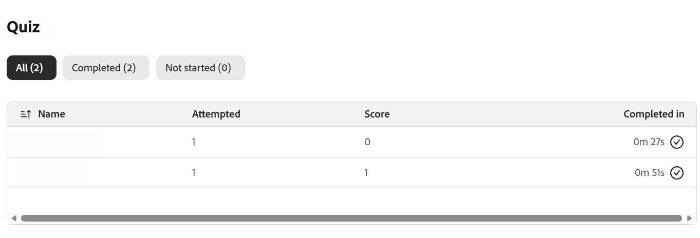
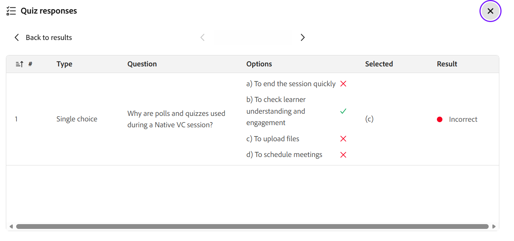

# Erstellen und Verwalten von Quiz

Als Kursleiter können Sie mit der Quizfunktion messen, wie gut die Teilnehmer ein Thema während einer Live-Hub-Sitzung erfasst haben. Im Gegensatz zu einer schnellen Umfrage mit nur einer Frage können Sie mit einem Quiz eine strukturierte Bewertung mit mehreren Fragen erstellen, die mehrere Auswahlmöglichkeiten und mehrere Antworten sowie Punktzahlen und Einstellungen wie Zeitlimits und zufällige Fragen- oder Optionsreihenfolge umfasst.

Dieser Artikel führt Sie durch jede Quizaktion, die den Kursleitern zur Verfügung steht, von der Erstellung eines Quiz bis hin zur Weitergabe der Ergebnisse.

## Erstellen Sie ein Quiz

Sie können ein Quiz erstellen, um das Verständnis der Teilnehmer während einer Sitzung zu bewerten. Tests können verschiedene Fragentypen enthalten und die Bewertung unterstützen, um die Leistung zu verfolgen. Wenn keine Quiz verfügbar sind, können Sie ein neues Quiz auf der Registerkarte **Quiz** erstellen.

Quiz erstellen:

1. Wählen Sie die Registerkarte **Quiz** im Bereich **Umfragen und Tests** aus.

   
   *Wählen Sie die Registerkarte &quot;Quiz&quot; aus dem Bedienfeld &quot;Umfragen und Quiz&quot; aus.*

1. Wählen Sie **Neues Quiz erstellen**. Ein neues Quiz mit dem Titel **Unbenanntes Quiz 1** wird geöffnet.

1. Geben Sie im Feld Frage Ihre Frage ein.

1. Geben Sie Ihre Antwortoptionen in die Optionsfelder ein. Standardmäßig stehen drei Optionen zur Verfügung. Sie haben folgende Möglichkeiten:

   1. Wählen Sie **+ Add option**, um eine weitere Option hinzuzufügen.

   1. Wählen Sie das **X** neben einer Option aus, um es zu entfernen.

   1. Ziehen Sie den Griff neben einer Option, um sie neu anzuordnen.

1. Markieren Sie die richtige Antwort:

   1. Um eine einzelne richtige Antwort festzulegen, aktivieren Sie das Optionsfeld neben der richtigen Option.

   1. Um mehr als eine richtige Antwort zuzulassen, aktivieren Sie den Umschalter **Mehrere richtige Antworten** und wählen Sie dann das Optionsfeld für jede richtige Option aus.

1. Um weitere Fragen hinzuzufügen, wählen Sie **+ Frage hinzufügen**.

   
   *Die Registerkarte &quot;Quiz&quot; zeigt die Option zum Erstellen eines Quiz an.*

1. Wählen Sie **Fertig**.

1. Wählen Sie **Speichern**. Das Quiz kann jetzt gestartet werden.

## Festlegen eines Zeitlimits für das Quiz

Sie können ein optionales Zeitlimit festlegen, sodass Teilnehmer das Quiz innerhalb einer bestimmten Dauer abschließen müssen. Das Zeitlimit wird vom Timer oben im Quiz festgelegt.

So legen Sie ein Zeitlimit fest:

1. Wählen Sie das Timer-Symbol oben im Quiz.

1. Aktivieren Sie **Zeitlimit festlegen**.

1. Legen Sie die Dauer in Minuten fest.

*Die Registerkarte &quot;Quiz&quot; zeigt die Option zum Festlegen des Quizzeitlimits an.*

## Quiz bearbeiten

Aktualisieren Sie Fragen, ändern Sie Antwortoptionen oder ordnen Sie Fragen neu an, bevor Sie das Quiz starten. Sobald das Quiz gestartet wurde, kann es nicht mehr bearbeitet werden.

Bearbeiten eines Quiz:

1. Wählen Sie die Registerkarte **Quiz** aus.

1. Navigieren Sie zu dem Quiz, das Sie bearbeiten möchten.

1. Wählen Sie das Bearbeitungssymbol (Bleistift) aus.

1. Führen Sie einen der folgenden Schritte aus:

   1. Bearbeiten Sie den Fragentext.

   1. Antwortoptionen aktualisieren oder entfernen.

   1. Wählen Sie die richtige(n) Antwort(en).

   1. Fügen Sie mit **Frage hinzufügen** eine neue Frage hinzu.

   1. Löschen Sie eine Frage, wenn sie nicht mehr erforderlich ist.

   
   *Die Registerkarte &quot;Quiz&quot; zeigt die Option zum Bearbeiten eines Quiz an.*

1. Wählen Sie **Speichern**, um die Änderungen anzuwenden.

## Quiz starten

Nachdem Sie ein Quiz erstellt und gespeichert haben, wird es auf der Registerkarte **Quiz** mit der Beschriftung **Neu** angezeigt. Durch Starten wird das Quiz für die Teilnehmer sichtbar und sie können in Echtzeit versuchen, Fragen zu stellen.

Starten eines Quiz:

1. Wählen Sie die Registerkarte **Quiz** aus.

1. Wählen Sie aus der gespeicherten Quizliste **Quiz starten**.

Wenn Sie ein Quiz starten, wird es im Bereich **Umfragen und Quizfragen** angezeigt, auf das die Teilnehmer antworten können. Wenn ein Zeitlimit festgelegt wurde, können Sie die Quizdauer auch verlängern, indem Sie **+1 Minute** während des Live-Quiz auswählen.

*Die Registerkarte &quot;Quiz&quot; zeigt das Quiz an, das für die Teilnehmer gestartet wurde.*

>[!NOTE]
>Wenn beim Erstellen oder Starten eines Quiz ein Fehler auftritt, finden Sie in [Leitfaden zur Fehlerbehebung für Live Hub](../kb/troubleshooting-guide-for-live-hub.md#quiz-tab-issues) eine Liste der häufigsten Fehlermeldungen und wie diese behoben werden können.

## Quizergebnisse anzeigen

Zeigen Sie Quizergebnisse während und nach einer Sitzung an, um die Leistung und die Teilnahme der Teilnehmer zu überwachen. Die Ergebnisse werden in Echtzeit aktualisiert, wenn die Teilnehmer versuchen, das Quiz abzuschließen.

Anzeigen der Quizergebnisse

1. Wählen Sie in  die Registerkarte **Quiz** aus.

1. Navigieren Sie zum aktiven oder abgeschlossenen Quiz.

1. Wählen Sie **Ergebnisse anzeigen**.

*Die Registerkarte &quot;Quiz&quot; zeigt die Option &quot;Details anzeigen&quot; an, um auf die Quizergebnisse zuzugreifen und diese anzuzeigen.*

Im Bereich &quot;**Quiz**&quot; werden die Ergebnisse mit den folgenden Details angezeigt:

* Teilnehmerprofile

* Anzahl der gestellten Fragen

* Punktzahlen

* Zeit, die zum Abschließen des Quiz benötigt wird

## Detaillierte Antworten für einen Teilnehmer anzeigen

Wählen Sie in der Ergebnisliste einen einzelnen Teilnehmer aus, um ausführliche Antworten abzurufen. Sie können sehen, wie der Teilnehmer jede Frage beantwortet hat.

*Popup-Fenster für Quizantworten mit den detaillierten Ergebnissen für einen Teilnehmer.*

## Quiz schließen

Verwenden Sie diese Option, um ein aktives Quiz zu beenden, wenn Teilnehmer ihre Antworten abgeschlossen haben oder wenn Sie die Einreichung beenden möchten.

Quiz schließen:

1. Wählen Sie **Quiz schließen**. Das Quiz wird für alle Teilnehmer sofort beendet.

1. Der Quizstatus wird auf **Geschlossen** aktualisiert.

*Die Registerkarte &quot;Quiz&quot; zeigt den Status &quot;Geschlossenes Quiz&quot; an.*

## Quizergebnisse für Teilnehmer freigeben

Sie können die Quizergebnisse für die Teilnehmer freigeben, nachdem Sie das Quiz beendet oder geschlossen haben. Um die Ergebnisse für alle sichtbar zu machen, aktivieren Sie den Schalter **Ergebnisse für Teilnehmer freigeben**.

Wenn die Ergebnisfreigabe aktiviert ist, wird das Quiz mit dem Tag **Ergebnisse live** gekennzeichnet. Dies bedeutet, dass die Ergebnisse den Teilnehmern angezeigt werden.

*Aktivieren Sie &quot;Ergebnisse für Teilnehmer freigeben&quot;, um die Ergebnisse für Teilnehmer freizugeben.*

## Quiz verwalten

Sie können ein gespeichertes oder geschlossenes Quiz über seine Optionen verwalten (**...**) im Bereich **Umfragen und Tests**. Mit diesen Optionen können Sie Antworten löschen, das Quiz wiederverwenden oder es aus der Sitzung entfernen.

Quiz verwalten:

1. Wählen Sie in  die Registerkarte **Quiz** aus.

1. Navigieren Sie zum Quiz und wählen Sie die Optionen (**...**) Menü.

   Menü &quot;Quizoptionen verwalten&quot; von 
   *Die Registerkarte &quot;Quiz&quot; zeigt die Option zum Zurücksetzen, Duplizieren und Löschen eines Quiz an.*

1. Wählen Sie eine der folgenden Optionen aus:

| **Option** | **Beschreibung** |
|----|----|
| **Zurücksetzen** | Löscht alle Antworten auf das Quiz endgültig, während das Quiz selbst intakt bleibt. Verwenden Sie diese Option, um dasselbe Quiz erneut auszuführen und neue Antworten zu sammeln. |
| **Duplikat** | Erstellt eine Kopie des Quiz mit den Fragen und Antwortoptionen, sodass Sie es wiederverwenden oder anpassen können, ohne es erneut zu erstellen. |
| **Löschen** | Entfernt das Quiz und alle seine Antworten endgültig aus der Sitzung. Diese Aktion kann nicht rückgängig gemacht werden. |
