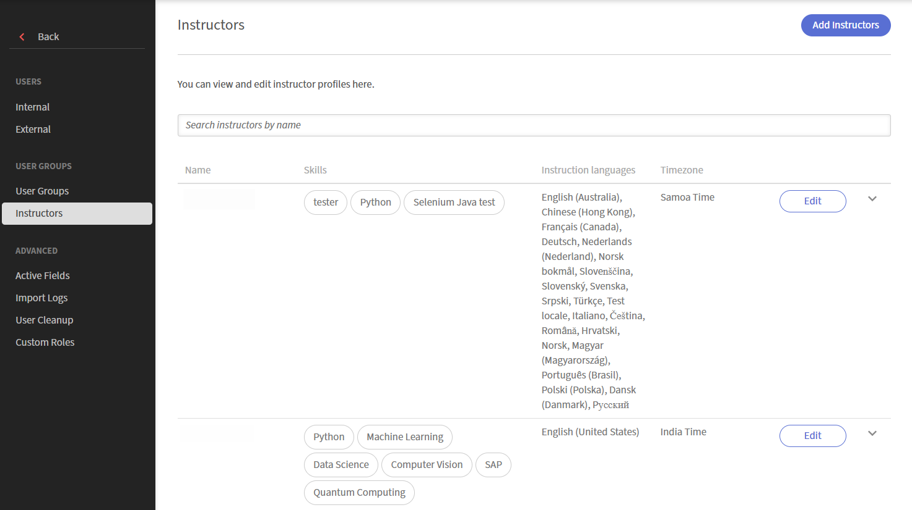

# Kursleiter hinzufügen und verwalten

Kursleiter bieten Live-Sitzungen an und binden die Teilnehmer in den Live Hub ein. Um eine genaue Planung und effektive Kursbereitstellung zu unterstützen, können Administratoren Kursleiter hinzufügen, ihre Profile erstellen, Unterrichtsfähigkeiten und Sprachen definieren und die Verfügbarkeit konfigurieren.

Die Registerkarte &quot;Kursleiter&quot; ist eine zentrale Stelle zum Verwalten dieser Informationen in Ihrer gesamten Organisation. Hier können Sie bestehende Adobe Learning Manager-Benutzer als Kursleiter hinzufügen, ihre Profile überprüfen und aktualisieren und ihre Kenntnisse, Sprachen und Verfügbarkeit entsprechend dem sich ändernden Unterrichtsbedarf auf dem neuesten Stand halten.

## Registerkarte &quot;Kursleiter&quot; aufrufen

Führen Sie die folgenden Schritte aus, um Kursleiter anzuzeigen und zu verwalten:

1. Melden Sie sich bei Adobe Learning Manager an.

1. Navigieren Sie zu **Admin** > **Benutzer**.

1. Wählen Sie **Kursleiter** in **Benutzergruppen** aus.

   Registerkarte &quot;Zugriffs-Kursleiter&quot;
   *Wählen Sie Kursleiter in Benutzergruppen aus, um Kursleiter anzuzeigen und zu verwalten.*

## Kursleiter hinzufügen

Kursleiter werden von bestehenden Adobe Learning Manager-Benutzern erstellt. Wenn ein Benutzer noch keine Kursleiterberechtigungen hat, fügen Sie ihn als Kursleiter hinzu.

Hinzufügen eines Kursleiters:

1. Wählen Sie die Registerkarte **Kursleiter** aus **Benutzergruppen**.

1. Wählen Sie **Kursleiter hinzufügen**.   Ein Popup-Fenster mit **Kursleiter hinzufügen** wird angezeigt.

   
   *Suchen Sie nach einem Benutzer anhand seines Namens und wählen Sie ihn aus, um die Kursleiterrolle zuzuweisen.*

1. Suchen Sie nach dem Namen des Benutzers und wählen Sie den Benutzer in den Suchergebnissen aus, um die Kursleiterrolle zuzuweisen.

1. Wählen Sie **Speichern** aus.   Dem Benutzer wird jetzt die Kursleiterrolle zugewiesen und er wird in der Kursleiterliste angezeigt.

## Einrichten eines Kursleiterprofils

Ein Kursleiterprofil definiert die Unterrichtsinformationen, Sprachen, Kenntnisse, Nutzung und Verfügbarkeit des Kursleiters. Durch die Fertigstellung des Profils wird eine genaue Abstimmung mit den Kursleitern, eine effiziente Planung und die Anpassung an die Kursanforderungen gewährleistet.

So richten Sie ein Kursleiterprofil ein:

1. Suchen Sie den Namen des Kursleiters auf der Registerkarte &quot;Kursleiter&quot;.

1. **Kenntnisse und andere Details hinzufügen**.   Ein Popup-Fenster **Kursleiterprofil bearbeiten** wird angezeigt.

   
   *Das Fenster &quot;Kursleiterprofil bearbeiten&quot; enthält Registerkarten mit grundlegenden Details, Kenntnissen, Verwendung und Verfügbarkeit.*

### Einfache Details hinzufügen.

Die grundlegenden Details werden im linken Bereich des Dialogfelds angezeigt und sind immer sichtbar, unabhängig davon, welche Registerkarte geöffnet ist.

Hinzufügen der grundlegenden Details:

1. Navigieren Sie zum Profilabschnitt.

1. Geben Sie die folgenden Details ein:

   | **Fields** | **Aktion** |
   |----|----|
   | **Bio** | Geben Sie eine kurze Beschreibung des Kursleiters ein (bis zu 2.048 Zeichen). |
   | **Website/LinkedIn** | Geben Sie ein externes Profil oder einen Referenz-Link ein. |
   | **Anweisungssprachen** | Suchen Sie nach den Sprachen, in denen der Kursleiter unterrichten kann. Die ausgewählten Sprachen werden als Tags angezeigt. |

## Kursleiterkenntnisse im Profil hinzufügen

Kenntnisse definieren die Fachgebiete und das Fachwissen, das ein Kursleiter vermitteln kann. Dies spielt eine Schlüsselrolle bei der Abstimmung von Kursleitern auf relevante Kurse und bei der Sicherstellung, dass der richtige Kursleiter entsprechend den Kursanforderungen zugewiesen wird.

So fügen Sie Kursleiterfertigkeiten hinzu:

1. Navigieren Sie zur Registerkarte **Kenntnisse**.

1. Geben Sie einen Kenntnisnamen in das Feld **Suche** ein. Dadurch wird eine Liste mit den Kenntnissen gefüllt.

1. Wählen Sie Kenntnisse aus der Liste aus.   Die ausgewählten Kenntnisse werden als Tags angezeigt.

1. Wählen Sie **Speichern**.

### Neue Kenntnisse erstellen

Wenn die erforderlichen Kenntnisse nicht verfügbar sind, können Sie sie direkt über das Profil erstellen.

So fügen Sie neue Kenntnisse hinzu:

1. Wählen Sie **Neue Kenntnisse hinzufügen** auf der Registerkarte **Kenntnisse**. Ein Bereich **Kenntnisse hinzufügen** wird geöffnet.

    *Geben Sie einen Qualifikationsnamen und eine Beschreibung ein, und wählen Sie dann Fertig, um die neue Qualifikation hinzuzufügen.*

1. Geben Sie die folgenden Details im Bereich **Kenntnisse hinzufügen** ein:

   1. Name der Kenntnisse

   1. Beschreibung

1. Wählen Sie **Fertig**.   Die neuen Kenntnisse wurden hinzugefügt und werden als Tag angezeigt.

1. Wählen Sie **Speichern** aus.   Die Kenntnisse werden dem Kursleiterprofil hinzugefügt.

## Kursleiterauslastung konfigurieren

Verwenden Sie die Registerkarte **Auslastung**, um die Unterrichtskapazität und die bevorzugten Arbeitszeiten eines Kursleiters zu definieren. Sie können Nutzungseinschränkungen festlegen, um Unterrichtsziele und -grenzen festzulegen und bevorzugte Arbeitszeiten anzugeben, um anzugeben, wann der Kursleiter für die Durchführung von Sitzungen verfügbar ist. Die angezeigte Zeitzone wird vom Benutzerprofil des Kursleiters geerbt.

So konfigurieren Sie die Kursleiterauslastung:

1. Navigieren Sie zur Registerkarte **Nutzung**.

1. Geben Sie die **Mindestziele** und **Höchstgrenzen** (in Stunden) für den Zeitraum **Monatlich** ein.

1. Geben Sie eine **Startzeit** und eine **Endzeit** für den bevorzugten Zeitraum ein.

   
   *Geben Sie eine Start- und Endzeit für die vom Kursleiter bevorzugten Arbeitszeiten ein.*

1. (Optional) Wählen Sie **Einen weiteren Zeitschlitz hinzufügen**, um zusätzliche Verfügbarkeit hinzuzufügen.

1. Wählen Sie **Speichern**. Die Nutzungseinschränkungen des Kursleiters und die bevorzugten Arbeitszeiten werden aktualisiert.

## Verfügbarkeit von Kursleitern verwalten

Verwenden Sie die Registerkarte **Kalender**, um den Zeitplan des Kursleiters hinzuzufügen und Zeiträume zu markieren, in denen der Kursleiter nicht verfügbar ist. Der Kalender verwendet Farbkodierung, um **Gebuchte**, **Feiertage** und **Nicht verfügbar** Daten zu identifizieren.

Die **Feiertage**, die in diesem Kalender angezeigt werden, werden aus den Feiertagseinstellungen konfiguriert. Weitere Informationen finden Sie unter [Feiertage verwalten](./manage-holidays.md).

So markieren Sie nicht verfügbare Tage:

1. Navigieren Sie zur Registerkarte **Kalender**.

1. Wählen Sie im Abschnitt **Nicht verfügbare Tage hinzufügen** ein Start- und ein Enddatum aus.

   
   *Wählen Sie ein Start- und Enddatum, um einen Bereich im Kalender des Kursleiters als nicht verfügbar zu markieren.*

1. **Hinzufügen** auswählen.   Der ausgewählte Datumsbereich wird im Kalender als nicht verfügbar markiert.

1. Wählen Sie **Speichern**. Die Verfügbarkeitseinstellungen des Kursleiters werden aktualisiert.
