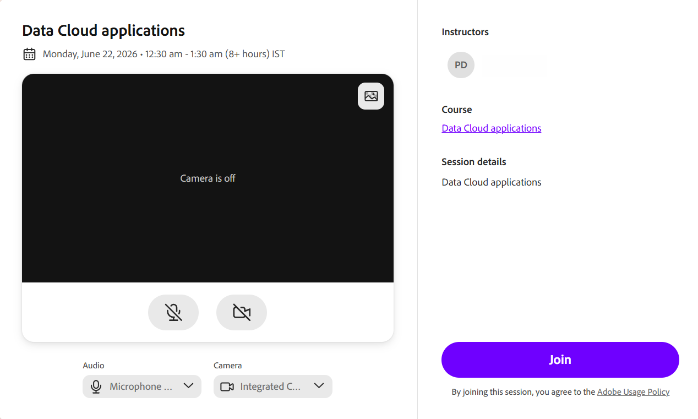

# Als Kursleiter an einer Live Hub (Beta)-Sitzung teilnehmen

Kursleiter können den virtuellen Schulungsraum vor der geplanten Startzeit betreten, um den Raum vorzubereiten, Teilnehmerberechtigungen, Beschriftungen, Umfragen, Tests und Breakout-Sessions zu konfigurieren und eigene Audio- und Videoinhalte einzurichten, bevor die Teilnehmer eintreffen.

## An der Session teilnehmen

Kursleiter können dem Raum vor Beginn der geplanten Sitzung beitreten, um die Sitzung vorzubereiten und die erforderlichen Einstellungen zu konfigurieren, bevor die Teilnehmer teilnehmen.

1. Melden Sie sich bei Adobe Learning Manager an.

1. Wählen Sie die geplante Live Hub-Sitzung aus **bevorstehenden Sitzungen**.

   
   *Wählen Sie &quot;Bevorstehende Sitzungen&quot; aus, um die URL für den Klassenzimmerbeitritt zu öffnen.*

1. Wählen Sie eine der aufgeführten Sitzungen aus.   Die Seite **Sitzungsübersicht** wird geöffnet.

   
   *Auf der Seite &quot;Sitzungsübersicht&quot; werden die Optionen für den Zugriff auf die Live-Hub-Sitzung angezeigt.*

1. Wählen Sie im Live-Hub **Klassenzimmer betreten** aus. 2  Die Benutzeroberfläche für den Live-Hub-Beitritt wird geöffnet.

   
   *Der Vorbeitrittbildschirm des Live-Hub.*

1. (Optional) Testen Sie das Mikrofon und wenden Sie den virtuellen Hintergrund an. Weitere Informationen finden Sie unter [Einrichtung des Vorbeitrittbildschirms im Live-Hub](./setup-pre-join-screen-in-live-hub.md).

1. Wählen Sie **Verbinden**.
