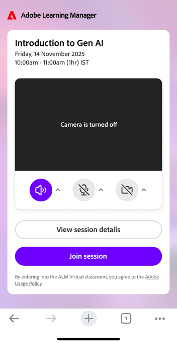
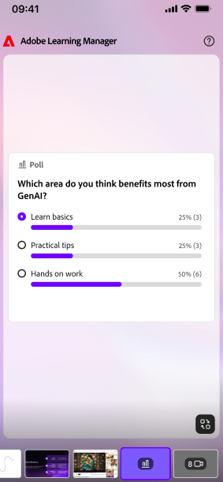

# Live Hub (Beta) auf Mobilgeräten als Teilnehmer verwenden

Verwenden Sie die mobile Adobe Learning Manager-App, um von Ihrem iOS oder Android-Gerät aus an Live-Hub-Sitzungen teilzunehmen. Während einer Sitzung können Sie mit Kursleitern und Teilnehmern interagieren, auf Umfragen und Tests reagieren, in Arbeitsräumen zusammenarbeiten und direkt von Ihrem Mobilgerät aus auf freigegebene Inhalte zugreifen.

>[!NOTE]
>
> Die mobile App unterstützt die wichtigsten Live-Hub-Teilnahmefunktionen. Einige Funktionen, die in der Desktop-Version verfügbar sind, sind auf Mobilgeräten nicht verfügbar. Eine vollständige Liste der unterstützten Funktionen auf dem Desktop finden Sie unter [Erste Schritte mit dem Live Hub](./getting-started-live-hub.md).

## Teilnehmererlebnis auf Mobilgeräten

In der folgenden Tabelle sind die Live-Hub-Funktionen aufgeführt, die Teilnehmern in der mobilen App zur Verfügung stehen.

| **Feature** | **Mobiles Erlebnis** |
|----|----|
| Sessions teilnehmen | Nimm über die Adobe Learning Manager-App an Live-Hub-Sessions teil. |
| Audio und Video | Schalten Sie Mikrofon und Kamera ein oder aus und wählen Sie die verfügbaren Audiogeräte aus. |
| Chat und Fragen | Nehmen Sie an Chatgesprächen teil und senden Sie Fragen während der Sitzung. |
| Reaktionen und Hand-Raise | Senden Sie Reaktionen und heben Sie Ihre Hand, um mit dem Kursleiter zu interagieren. |
| Umfragen | Antworten Sie auf Umfragen, die während der Sitzung veröffentlicht wurden. |
| Quiz | Testen Sie Quiz, die vom Kursleiter gestartet wurden. |
| Arbeitsräume | Treten Sie zugewiesenen Arbeitsräumen bei, arbeiten Sie mit anderen Teilnehmern zusammen, fordern Sie Unterstützung durch den Kursleiter an und zeigen Sie Arbeitsgruppenzusammenfassungen an. |
| Whiteboard und freigegebene Inhalte | Während der Sitzung freigegebene Inhalte anzeigen und damit interagieren |
| Miro-Motherboards | Zeigen Sie vom Kursleiter freigegebene Miro-Boards an. |
| Untertitel | Aktivieren oder Deaktivieren von Untertiteln während der Sitzung |
| Bildschirmfreigabe | Von Kursleitern oder Teilnehmern freigegebene Inhalte anzeigen |
| Sitzungsaufzeichnungen | Greifen Sie auf Aufzeichnungen zu, wenn sie nach der Sitzung verfügbar sind. |

## An einer Live-Hub-Sitzung teilnehmen

Nimm über die Adobe Learning Manager-App an deiner geplanten Live-Hub-Session teil.

Bevor Sie teilnehmen, können Sie die Einstellungen Ihrer Kamera, Ihres Mikrofons und Ihres Audiogeräts überprüfen, um sicherzustellen, dass sie korrekt konfiguriert sind.

*Überprüfen Sie die Einstellungen für Ihre Kamera, Ihr Mikrofon und Ihr Audiogerät, bevor Sie an einer Live-Hub-Sitzung auf Mobilgeräten teilnehmen.*

>[!NOTE]
>
> Virtuelle Hintergründe und Unschärfeeffekte im Hintergrund werden in der mobilen App nicht unterstützt.

## Navigation in der Sitzungsoberfläche

Nachdem Sie einer Sitzung beigetreten sind, werden in der Hauptsitzungsansicht die Videokacheln der Teilnehmer oder freigegebene Inhalte zusammen mit Steuerelementen für Kommunikation und Teilnahme angezeigt.

Verwenden Sie die Sitzungssteuerelemente für Folgendes:

* Schalten Sie Ihr Mikrofon ein oder aus.

* Schalte die Kamera ein oder aus.

* Melde dich!

* Reaktionen senden.

* Auf Chat und Fragen zugreifen.

* Nehmen Sie an Umfragen und Tests teil.

* Nehmen Sie an Aktivitäten im Arbeitsraum teil.

* Beenden Sie die Sitzung.

## Verwenden von Bilduntertiteln

Untertitel helfen Ihnen, gesprochene Inhalte während einer Sitzung zu verfolgen.

Sie können Untertitel jederzeit während der Teilnahme an einer Live Hub-Sitzung aktivieren oder deaktivieren.

>[!NOTE]
>
> Formatierungsoptionen für Untertitel wie Schriftgröße und Anzeigestile sind in der mobilen App nicht verfügbar.

## Fragen im Chat stellen

Verwenden Sie das Chat-Bedienfeld, um mit Kursleitern und anderen Teilnehmern zu kommunizieren.

Sie haben folgende Möglichkeiten:

* Poste Nachrichten im Session-Chat.

* Zeigen Sie Nachrichten von Kursleitern und Teilnehmern an.

* Stelle während der Session Fragen.

* Überprüfen Sie die Antworten des Kursleiters.

## Auf Umfragen antworten

Wenn ein Kursleiter eine Umfrage startet, wird sie automatisch in der Sitzung angezeigt.

*Antworten Sie direkt aus der mobilen Adobe Learning Manager-App auf eine Umfrage.*

Sie können Ihre Antwort direkt über die mobile App senden. Abhängig davon, wie die Umfrage konfiguriert ist, können Sie möglicherweise auch die Umfrageergebnisse anzeigen, nachdem Sie reagiert haben.

## Quizversuch

Wenn ein Kursleiter ein Quiz startet, können Sie es auf Ihrem Mobilgerät abschließen, ohne die Sitzung zu verlassen.

Die Quizergebnisse und die Sichtbarkeit der Antworten hängen von den vom Kursleiter konfigurierten Einstellungen ab.

## An Arbeitsräumen teilnehmen

Wenn Arbeitsräume während einer Sitzung verwendet werden, weist der Kursleiter Sie einem Raum zu.

*Arbeitsraum-Ansicht mit den auf Mobilgeräten verfügbaren Optionen für die Zusammenarbeit.*

Innerhalb eines Arbeitsraums haben Sie folgende Möglichkeiten:

* Arbeite mit anderen Teilnehmern zusammen.

* Nehmen Sie an Arbeitsgruppenaktivitäten teil.

* Fordern Sie Unterstützung vom Kursleiter an.

* Überprüfen Sie die Breakout-Zusammenfassungen, sofern verfügbar.

Arbeitsraumzuweisungen und -zeiten werden vom Kursleiter verwaltet.

## Anzeigen von freigegebenem Inhalt

Während einer Sitzung können Kursleiter Präsentationen, Whiteboards, Miro-Boards oder andere Inhalte freigeben. Sie können freigegebene Inhalte direkt in der mobilen App anzeigen und Diskussionen und Aktivitäten verfolgen.

*Von einem Kursleiter freigegebene Inhalte direkt in der mobilen App anzeigen.*

## Verlassen einer Sitzung

Wenn Sie bereit sind, die Sitzung zu beenden, wählen Sie **Verlassen**.

*Wählen Sie &quot;Verlassen&quot; aus, um die Sitzung aus der mobilen App zu beenden.*

Nachdem du die Session verlassen hast, wirst du aufgefordert, Feedback zu deiner Session abzugeben.
