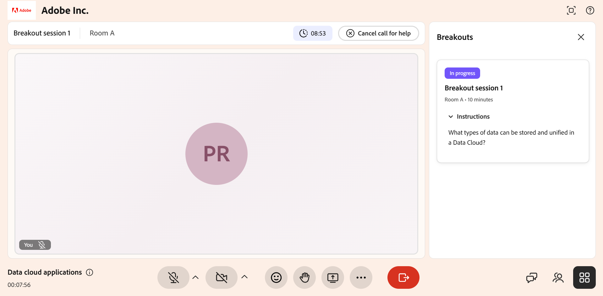

# An einer Arbeitsgruppensitzung teilnehmen

Während einer Live-Hub-Sitzung kann Ihr Kursleiter die Sitzung in kleinere Arbeitsräume aufteilen, in denen Sie sich mit den Themen befassen und praktische Aktivitäten durchführen können.

Wenn eine Arbeitsgruppensitzung beginnt, werden Sie automatisch in den Ihnen zugewiesenen Raum verschoben, wo Sie mit Ihrer Gruppe zusammenarbeiten, die Aktivitätsanweisungen befolgen und bei Bedarf um Hilfe bitten können. Nach Ende der Sitzung können Sie eine AI-generierte Zusammenfassung der Diskussion anzeigen, die in Ihrem Arbeitsraum stattgefunden hat. Dieser Leitfaden zeigt Ihnen, was Sie als Teilnehmer während einer Arbeitsgruppensitzung erwarten und was Sie tun können.

## Arbeitsraum betreten

Wenn Ihr Kursleiter eine Arbeitsgruppensitzung startet, werden Sie automatisch vom Hauptraum in den zugewiesenen Arbeitsraum verschoben. Du brauchst nichts zu tun, um mitzumachen. Im oberen Bildschirmbereich werden der Sitzungsname und Ihr Raum sowie ein Countdown-Timer angezeigt, der anzeigt, wie viel Zeit noch für die Aktivität verbleibt.

>[!NOTE]
>
>Unterhaltungen in Arbeitsräumen werden mithilfe von KI transkribiert und verarbeitet, um Übersichten zu generieren. Kursleiter können diese Zusammenfassungen überprüfen, um den Fortschritt im Raum zu verfolgen und Diskussionslücken zu identifizieren.

*Teilnehmeransicht eines aktiven Arbeitsraums, in der der Name des Raums, der Countdown-Timer und die Sitzungstools angezeigt werden*

## Aktivitätsanweisungen anzeigen

Ihr Kursleiter legt eine Aktivität oder eine Diskussionsaufforderung für die Schulung fest. Im Bereich **Arbeitsgruppen** auf der rechten Seite werden der Sitzungsstatus (**In Bearbeitung**), Ihr Raum und die Sitzungsdauer angezeigt.

So zeigen Sie die Aktivitätsaufforderung an:

1. Wenn der Bereich **Arbeitsgruppen** geschlossen ist, wählen Sie das Symbol **Arbeitsgruppen** (Raster) unten rechts auf dem Bildschirm aus.

2. Wählen Sie **Anweisungen**, um die Aktivitätsaufforderung zu erweitern, z. B. &quot;Welche Datentypen können in einer Data Cloud gespeichert und vereinheitlicht werden?&quot;

Lesen Sie diese Anweisungen während der gesamten Schulung, um Ihre
mit der Tätigkeit im Einklang stehende Diskussion.

## Zusammenarbeit mit Ihrer Gruppe

Innerhalb Ihres Arbeitsraums können Sie mithilfe der Werkzeuge in der Steuerungsleiste mit den anderen Teilnehmern im Raum arbeiten:

- **Mikrofon**: Sich stummschalten oder die Stummschaltung aufheben, um mit Ihrer Gruppe zu sprechen.

- **Kamera**: Schalten Sie Videos ein oder aus.

- **Reaktionen**: Sende ein kurzes Emoji.

- **Zu Wort melden**: Signal, dass du sprechen oder Aufmerksamkeit erregen möchtest.

- **Bildschirm freigeben**: Geben Sie Ihren Bildschirm oder eine Präsentation für den Raum frei.

- **Chat**: Öffnet den Chat-Bereich, um andere Personen in Ihrem Raum zu benachrichtigen.

- **Teilnehmer**: Sieh dir an, wer in deinem Arbeitsraum ist.

Nur die Benutzer in Ihrem Raum können Sie sehen und hören, sodass Sie frei diskutieren können, ohne die anderen Arbeitsräume zu unterbrechen.

## Empfangen von Nachrichten von Ihrem Kursleiter

Ihr Kursleiter kann eine Broadcast-Nachricht gleichzeitig an jeden Raum senden, z. B. eine Aktivitätserinnerung oder eine Zeitprüfung. Wenn sie dies tun, wird die Meldung auf Ihrem Bildschirm angezeigt. Lesen Sie die Nachricht und schließen Sie sie, um zu Ihrer Aktivität zurückzukehren.

*Broadcast-Nachricht vom Kursleiter, die im Arbeitsraum des Teilnehmers angezeigt wird*

## Hilfe anfordern

Wenn Ihre Gruppe eine Frage hat oder den Kursleiter benötigt, um Ihrem Raum beizutreten, wählen Sie oben im Arbeitsraum **Hilfe anfordern**. Dadurch wird der Kursleiter benachrichtigt, der dann Ihrem Raum beitreten kann, um zu helfen. Sie können Ihre Diskussion fortsetzen, während Sie darauf warten, dass der Kursleiter antwortet.

*Die Option &quot;Hilfe anfordern&quot; wird verwendet, um die Hilfe des Kursleiters anzufordern*

Nachdem Sie eine Anforderung gesendet haben, ändert sich die Schaltfläche in **Aufruf zur Hilfe abbrechen**. Wenn Sie keine Unterstützung mehr benötigen, z. B. wenn Ihre Gruppe die Frage selbst gelöst hat, wählen Sie **Hilferuf abbrechen**, um die Anforderung zurückzuziehen.

*Die Option &quot;Aufruf zur Hilfe abbrechen&quot; wurde verwendet, um eine Hilfeanforderung zurückzuziehen*

## Kehren Sie zum Hauptraum zurück.

Die Arbeitsgruppensitzung wird für die im Timer angezeigte Dauer ausgeführt und Ihr Kursleiter kann sie bei Bedarf verlängern. Wenn die Sitzung endet, entweder wenn der Timer ausgeht oder wenn der Kursleiter sie früh beendet, werden Sie automatisch zurück in den Hauptraum verschoben, um die Sitzung mit allen fortzusetzen.

## Übersicht über Ihren Raum anzeigen

Nach dem Ende einer Arbeitsgruppensitzung können Sie eine AI-generierte Zusammenfassung der Unterhaltung anzeigen, die in Ihrem Raum stattgefunden hat. Die Zusammenfassung enthält die wichtigsten Punkte, die in Ihrer Gruppe erörtert wurden.

Eine Zusammenfassung wird nur generiert, wenn der Arbeitsraum eine Konversation von mindestens 60 Sekunden aufweist. Wenn die Raumaktivität kürzer als 60 Sekunden ist, ist keine Zusammenfassung verfügbar.

>[!NOTE]
>
>Sie können den Bericht nur für den Raum anzeigen, in dem Sie sich befunden haben. Berichte aus anderen Arbeitsräumen sind für Sie nicht sichtbar.

Wenn Ihr Kursleiter Sie während derselben Arbeitsgruppensitzung in einen anderen Raum bewegt, z. B. von Raum A zu Raum B, wird nur die Zusammenfassung für Ihren letzten Raum angezeigt. Zusammenfassungen von Räumen, in denen Sie sich zuvor befanden, werden nicht beibehalten.

So zeigen Sie Ihre Raumzusammenfassung an:

1. Wählen Sie in der Steuerungsleiste das Symbol  aus. 3  Das Arbeitsgruppenfenster wird angezeigt.
1. Navigieren Sie zu der Arbeitsgruppensitzungskarte, für die Sie die Zusammenfassung anzeigen möchten.
1. Wählen Sie die Arbeitsgruppensitzung aus, und wählen Sie dann **Zusammenfassung**.  Die AI-generierte Zusammenfassung für Ihren Raum wird angezeigt.

   
   *Wählen Sie &quot;Zusammenfassung&quot; aus, um Ihre Raumzusammenfassung anzuzeigen.*