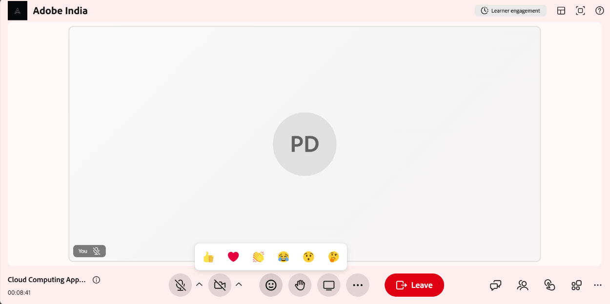

# Anwendungsreaktionen und erhöhte Hände

Als Teilnehmer können Sie Reaktionen und erhobene Hände verwenden, um an einer Sitzung teilzunehmen, ohne den Moderator zu unterbrechen. Beide Optionen sind in der Sitzungssteuerungsleiste verfügbar und helfen Ihnen bei der Kommunikation mit Kursleitern und anderen
in Echtzeit teilzunehmen.

## Deine Hand in der Session heben.

Mit der Option **Zu Wort melden** in der Steuerungsleiste können die Teilnehmer signalisieren, dass sie während einer Sitzung sprechen oder eine Frage stellen möchten. Um Ihre Hand zu heben, wählen Sie  in der Steuerungsleiste aus. Ihre erhobene Hand ist für den Kursleiter sichtbar und wird in der Liste **Teilnehmer** angezeigt.

Wenn Sie den Wert für die Hand senken möchten, wählen Sie erneut einen Wert in den Sitzungssteuerelementen aus. Die Anzeige mit erhobenem Zeiger wird aus der Teilnehmerliste entfernt.

## Reaktionen senden

Mit Reaktionen können Sie während einer Sitzung schnelles, nonverbales Feedback geben.

So senden Sie eine Reaktion:

1. Wählen Sie in der Steuerungsleiste  aus.

   
   *Wählen Sie die Reaktionen in der Steuerungsleiste aus.*

1. Wählen Sie eine der folgenden Reaktionen aus:

   1. Daumen hoch
   1. Herz
   1. Applaus
   1. Lachen
   1. Überraschung
   1. Denken

   Die ausgewählte Reaktion wird allen Teilnehmern in der Sitzung angezeigt.
